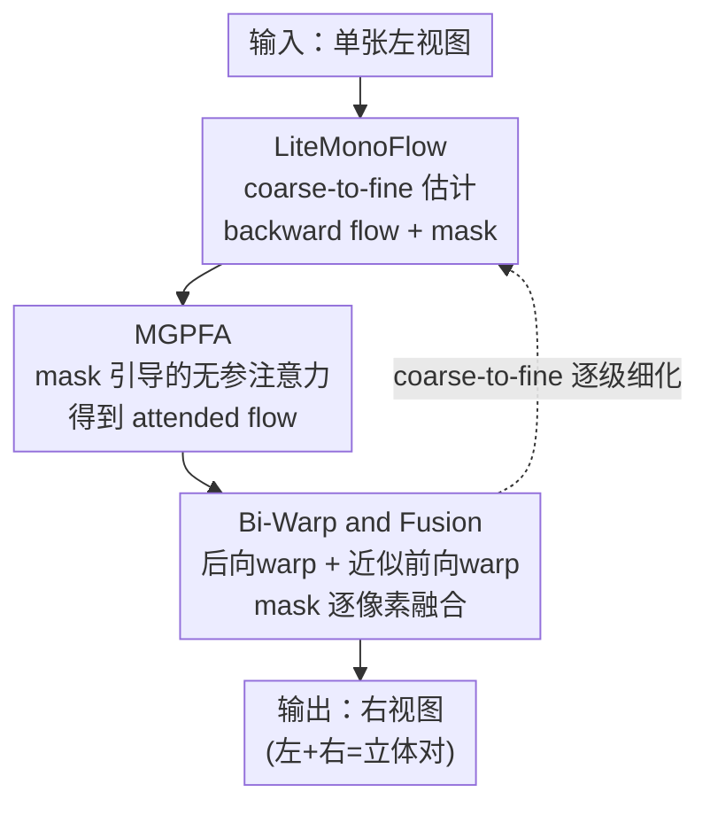

# XPaintNet: An eXtreme Lightweight Framework for Stereoscopic Conversion without Inpainting Network

**会议**: CVPR 2026  
**论文**: [CVF Open Access](https://openaccess.thecvf.com/content/CVPR2026/html/Yoon_XPaintNet_An_eXtreme_Lightweight_Framework_for_Stereoscopic_Conversion_without_Inpainting_CVPR_2026_paper.html)  
**代码**: 待确认  
**领域**: 3D视觉  
**关键词**: 立体转换, 2D转3D, 双向Warp, 实时渲染, 光流

## 一句话总结
针对 2D→3D 立体转换中"深度估计 + 前向 warp + 重型 inpainting 网络"流水线又慢又在遮挡边界出 artifact 的问题，本文提出 Bi-Warp（双向 warp 融合）彻底去掉 inpainting 网络，并据此搭出轻量网络 XPaintNet，在 2K 分辨率下跑到 100+ FPS 的同时质量与 SOTA 持平。

## 研究背景与动机

**领域现状**：立体转换（stereoscopic conversion）的目标是从单张左视图合成对应的右视图，凑成一对立体图给 AR/VR/3D 显示用。主流做法分两类：几何派先估视差/深度，再把左视图前向 warp 到右视图位置；外观派（如 Deep3D）直接用视差加权混合左视图。最近还冒出扩散派，靠学到的先验直接"幻想"出右视图。

**现有痛点**：前向 warp 在被遮挡区（disocclusion，左视图里看不到、右视图里露出来的背景）必然留下空洞，于是要挂一个 inpainting 网络去补——这既增加计算量，补出来的像素又是凭空幻想的、没有几何约束，导致左右视图不一致、边界出 halo/糊边。扩散派质量好看，但要迭代采样、慢到无法实时，而且经常幻想出左视图里根本没有的结构，左右一对就会让人看着难受（stereo discomfort）。

**核心矛盾**：右视图先验不存在，前向 warp 天然非可逆、必留洞；补洞这件事本身和"保持左右几何一致"是冲突的——你越是去 inpaint 未观测区，就越容易破坏立体对齐。同时，几何派普遍假设理想 rectified 平行相机、只建模水平视差，可现实拍摄常有残余垂直视差（rig 偏移、镜头不对称、电子防抖、裁剪等），纯水平 warp 在深度突变处会撕裂。

**本文目标**：(1) 在不引入 inpainting 网络的前提下处理 disocclusion；(2) 摆脱"只建模水平视差"的理想 rectification 假设；(3) 把整套流水线压到真正实时（2K @ 100+ FPS）。

**切入角度**：作者重新审视 warp 操作本身——前向 warp 在有效区保几何但留洞，后向 warp（backward warp，用 grid-sample 从已观测左视图取像素）在遮挡边界处会糊但能稠密覆盖 disocclusion 区。这两者在空间上是互补的。既然后向 warp 能用"邻近已观测像素"去填背景，那就不需要 inpainting 去"幻想"。同时改用 2D 向量场（光流）替代 1D 视差，水平+垂直一起建模。

**核心 idea**：用"双向 warp + 可学习 mask 融合"替代 inpainting 网络，既保几何一致又去掉了最重的那块网络开销。

## 方法详解

### 整体框架

XPaintNet 输入单张左视图 $I_L$，输出对应右视图 $\hat I_R$，整条流水线没有任何 inpainting 网络。它走 coarse-to-fine 结构，串起三个部件：**LiteMonoFlow** 轻量单向光流估计器先预测 backward flow $F_{R\to L}$ 和融合 mask $M$；**MGPFA** 用 mask 把光流加权成 attended flow（不引入任何可学习参数）；**Bi-Warp and Fusion** 用这条光流同时做后向 warp 和（由前后向关系近似出的）前向 warp，得到两张互补的候选右视图，再用 mask 逐像素融合成最终右视图。训练时额外用 **Bi-Warp Perceptual Refinement Loss** 专门强化被后向 warp 选中的 disocclusion 区。

### 关键设计

**1. LiteMonoFlow：只估单向光流，用 2D 向量场而非水平视差**

针对"理想 rectification 假设站不住 + 双向光流太重"两个痛点。作者先做了一个 toy 实验论证：理想平行 rig 下位移是 1D 的（$u=\tfrac{fb}{Z},\ v\approx 0$，$f$ 焦距、$b$ 基线、$Z$ 深度），但现实里 pitch/roll 偏移、off-axis、toe-in 会产生残余垂直视差 $v(x,y,Z)\approx \tfrac{f\theta_x + f(-t_y + y_n t_z)}{Z}$，在深度突变处造成明显的 y 轴运动。因此 XPaintNet 用 2D 光流（水平+垂直一起）替代纯水平视差，论文用 "Vertical Component Gain Map" 实证这能减少洞和接缝。光流估计本身则做得极轻：每个金字塔层取 $1/N$（$N\in\{4,2,1\}$）下采样输入，先做 pixel-unshuffle 把空间细节折进通道（降低 line-buffer 压力、提升局部性），过 8 层连续卷积，再 pixel-shuffle 还原到原分辨率输出 flow；并刻意去掉重型 residual/attention 块和长跳连，让它能跑在内存受限的边缘设备上。关键取舍是**只估一个方向的 backward flow**：因为用图像重建（光度/感知）损失端到端学习时，监督前向 flow 在 disocclusion 区是 ill-posed 的（映射非可逆、目标未定义），而监督 backward flow 靠从已观测左视图后向采样能给出稠密稳定的信号，另一方向再由前后向一致性近似导出。

**2. MGPFA：把融合 mask 复用成"零参数"注意力**

针对"想在 disocclusion 边界给更强监督，但又不想再加参数/算力"的痛点。LiteMonoFlow 估出的置信 mask $M\in[0,1]$ 本身已经隐式编码了遮挡/被遮挡区，天然就是一张"哪里模糊、哪里需要更强监督"的注意力图。于是作者直接拿它做 Mask-Guided Parameter-Free Attention：$F^{att}_{R\to L}=F_{R\to L}+(F_{R\to L}\odot M)$，$\odot$ 为逐元素乘。这等于把简单的注意力机制改造成无需任何可学习参数的形式，既没增加计算开销，又让 disoccluded 边界附近的区域拿到更强的学习信号，从而在 fine details 和 thin structures 上明显变清晰。

**3. Bi-Warp and Fusion：双向 warp 互补，彻底替掉 inpainting 网络**

这是全文核心，直接回应"前向 warp 留洞、inpainting 又破坏几何一致"的根本矛盾。流水线为简洁起见以估 backward flow $F_{R\to L}$ 为基准：先做后向 warp 得到 $\tilde I^{BW}_R(x)=W_{bw}(x,F_{R\to L})=I_L(x+F_{R\to L}(x))$，它能稠密覆盖 disocclusion 但在遮挡处偏糊；再由 backward flow 近似出前向 flow $F_{L\to R}\approx A(F_{R\to L})=-W_{bw}(F_{R\to L},-F_{R\to L})$，做前向 warp $\tilde I^{FW}_R(x)=W_{fw}(x,F_{L\to R})$，它在有效区保留锐利几何但 disocclusion 处留洞；最后用可学习逐像素 mask 融合：

$$\hat I_R = M\odot \tilde I^{FW}_R + (1-M)\odot \tilde I^{BW}_R$$

mask 自适应地在可靠区选前向的锐利内容、在 disocclusion 区选后向的稠密覆盖。"只估单向 flow、另一向用前后向关系近似"这个设计带来两个好处：减少参数与延迟，并且从构造上强制前后向一致。和 inpainting 的本质区别是——Bi-Warp **复用已观测像素而非幻想未观测内容**，所以左右视图天然几何对齐，且这个融合模块几乎零额外开销（≈0 MACs/params）。

### 损失函数 / 训练策略

总损失为 $L_{total}=\alpha\cdot L_{bi\text{-}perc}+L_1$，$\alpha=0.5$。其中 **Bi-Warp Perceptual Refinement Loss** 专门针对"后向选中的 disocclusion 区监督弱、易糊/漂移、融合 mask 不稳"问题：

$$L_{bi\text{-}perc}=\sum_l (1-M)\odot \big(\phi_l(\hat I_R)-\phi_l(I_R)\big)^2$$

$\phi_l(\cdot)$ 是预训练特征提取网络（如 VGG/Alex）的第 $l$ 层特征，$(1-M)$ 把感知惩罚聚焦到后向选中的 disocclusion 区，从而在不引入 inpainting 的前提下强化锐利、几何一致的合成，同时让 mask 保持稳定。训练数据为 110K 高质量立体电影对（MiDaS 的电影训练数据 + Mono2Stereo 训练数据合并，沿用 MiDaS 数据处理）；Adam，初始 lr 1e-4，cosine annealing，每 300K 迭代衰减 0.5，共 1M 迭代，batch size 8，单卡 RTX 3090。

## 实验关键数据

评测用 LPIPS（感知相似度）、SIoU（视差一致性/边缘对齐）、iSQoE（VR 立体观看舒适度）三个指标，基准为 Mono2Stereo（5 个子集）与 Inria3D 电影数据集；效率均 FP32、单卡 RTX 3090。

### 主实验

**Bi-Warp vs inpainting 网络（512×512，统一用 DepthAnything V2 估深度 + 前向 warp 后再补洞）**：Bi-Warp 在感知与几何指标上全面领先，且效率比 inpainting/扩散方法低一两个数量级。

| 方法（补洞模块） | Mono2Stereo LPIPS↓ | Mono2Stereo SIoU↑ | Inria3D LPIPS↓ | MACs(G) | Params(M) | 时间(ms) |
|------|------|------|------|------|------|------|
| FuseFormer | 0.146 | 0.262 | 0.193 | 72.69 | 61.38 | 25.34 |
| ProPainter | 0.130 | 0.260 | 0.171 | 591.31 | 64.22 | 243.55 |
| StrDiffusion | 0.133 | 0.262 | 0.174 | 782916.55 | 325.26 | 103715.45 |
| StereoCrafter | 0.233 | 0.237 | 0.246 | 5913.37 | 2279.24 | 1137.35 |
| **Bi-Warp (Ours)** | **0.079** | **0.306** | **0.122** | **40.55** | **24.79** | **14.27** |

**XPaintNet vs SOTA 立体转换网络（2K 分辨率）**：XPaintNet 在 Mono2Stereo 上拿到最佳 LPIPS，Inria3D 上与 Mono2Stereo 持平排第二，但效率碾压——109 FPS、仅 15.04 GMACs/1.48M 参数。

| 方法 | Mono2Stereo LPIPS↓ | SIoU↑ | iSQoE↓ | MACs(G) | Params(M) | FPS |
|------|------|------|------|------|------|------|
| Deep3D | 0.115 | 0.279 | 0.621 | 190.17 | 1.8 | 17.92 |
| StereoCrafter | 0.233 | 0.237 | 0.700 | 46069.58 | 2254.45 | 0.01 |
| Mono2Stereo | 0.109 | 0.265 | 0.621 | 75852.08 | 974.37 | 0.12 |
| **XPaintNet (Ours)** | **0.092** | **0.293** | **0.618** | **15.04** | **1.48** | **109.05** |

### 消融实验

baseline 是"不带 mask、直接加权融合前/后向 warp 帧"。逐步加 Bi-Warp（带 mask）、MGPFA、Refinement Loss，LPIPS 单调下降。

| Bi-Warp | MGPFA | $L_{bi\text{-}perc}$ | Mono2Stereo LPIPS↓ | SIoU↑ | iSQoE↓ |
|------|------|------|------|------|------|
| ✗ | ✗ | ✗ | 0.356 | 0.256 | 0.668 |
| ✗ | ✓ | ✗ | 0.221 | 0.277 | 0.659 |
| ✓ | ✗ | ✗ | 0.138 | 0.289 | 0.652 |
| ✓ | ✓ | ✗ | 0.099 | 0.292 | 0.631 |
| ✓ | ✓ | ✓ | **0.092** | **0.293** | **0.618** |

另有垂直分量的 toy 实验（Tab.1，Mono2Stereo）：只用水平 vs 水平+垂直，PSNR 30.954→31.301（+0.353），LPIPS 0.081→0.077，SIoU 0.488→0.502，iSQoE 0.643→0.638——证明即便是名义上 rectified 的素材，建模垂直运动也有稳定收益。

### 关键发现
- 贡献最大的是 **Bi-Warp 本身**：从 baseline（LPIPS 0.356）一步到 0.138，靠的是显式估遮挡区 + 互补双向 warp，洞和边界稳定性大幅改善。
- MGPFA 把 LPIPS 从 0.138 推到 0.099（Bi-Warp+MGPFA），主要恢复纹理和细线等 fine details，且不加任何参数。
- Refinement Loss 再把 0.099 压到 0.092，并把 iSQoE 从 0.631 改善到 0.618，主要锐化边缘/高频区。
- 效率上的"啊哈"：Bi-Warp/Fusion 模块本身 ≈0 MACs/params，Tab.2 里 40.55 GMACs 几乎全来自 DepthAnything V2 backbone；换成端到端的 LiteMonoFlow 后，整网 2K 下只剩 15.04 GMACs。

## 亮点与洞察
- **用"互补几何"取代"幻想补洞"**：把 disocclusion 处理从生成式问题改写成"前向 warp 保锐 + 后向 warp 稠密覆盖 + mask 融合"的纯几何问题，既去掉最重的 inpainting 网络，又从构造上保住左右一致——这是全文最巧的一笔。
- **mask 一物三用**：同一张置信 mask 既做融合权重、又当无参注意力（MGPFA）、还当感知损失的空间掩码 $(1-M)$，零额外参数把"哪里不可靠"的信息吃干榨净。
- **只估单向 flow + 前后向近似**：$F_{L\to R}\approx -W_{bw}(F_{R\to L},-F_{R\to L})$ 这一步既省一半光流网络，又天然强制前后向一致，是"轻量"能成立的关键。
- 可迁移性：这套"backward flow 监督更稳 + 双向 warp 融合"的思路，可迁移到帧插值、新视角合成等同样面临 disocclusion 的任务。

## 局限与展望
- 作者承认：流水线只能靠从左视图 grid-sample 来"稳定"未观测区，**并不能真正生成不存在的结构**——当 disocclusion 区背景在左视图里完全没出现过时，仍无能为力。作者把"几何感知的补全"留作未来工作。
- 自己发现：边缘设备实时性、StereoCrafter 等扩散基线的对比细节都丢到了 supplementary，正文无法核验；效率指标全是 FP32 单卡 RTX 3090，换硬件/精度后的相对排名未知。
- 后向 warp 在遮挡边界处仍偏糊，靠 MGPFA 和 Refinement Loss 缓解但非根治；Inria3D 上仍略逊于 Mono2Stereo，说明纯几何复用在某些场景上限低于生成式方法。
- 改进思路：在 mask 极低置信、左右都无观测的区域，按需引入一个极轻量、几何约束强的补全分支，作为 Bi-Warp 的兜底。

## 相关工作与启发
- **vs Deep3D（外观派）**：Deep3D 用视差加权混合左视图、隐含假设理想 rectified 纯水平视差，高频区糊；XPaintNet 用 2D 光流建模水平+垂直、显式做几何 warp，边界更锐（2K LPIPS 0.092 vs 0.115）。
- **vs Mono2Stereo（几何/生成派）**：Mono2Stereo 整体质量强但要 75852 GMACs、0.12 FPS，且在文字/细线等结构上易丢失；XPaintNet 用 1/5000 的算力达到相当甚至更好的 LPIPS，且 109 FPS 真正实时。
- **vs StereoCrafter（扩散派）**：扩散派单看右视图很好看，但常幻想出左视图没有的结构、破坏立体一致（iSQoE 0.700 远差），还要迭代采样 0.01 FPS；XPaintNet 不幻想、只复用已观测像素，立体舒适度（iSQoE 0.618）和速度都全面占优。
- **vs ProPainter/FuseFormer 等 inpainting 网络**：它们能补小洞但大 disocclusion 处糊边、丢纹理；Bi-Warp 用后向 warp 的稠密几何覆盖替代它们，512×512 下 LPIPS 0.079 vs 0.130，且省掉整块补洞网络。

## 评分
- 新颖性: ⭐⭐⭐⭐⭐ "去掉 inpainting 网络、用双向 warp 互补 + mask 融合"的重写很干净，反直觉又有效。
- 实验充分度: ⭐⭐⭐⭐ 两套主对比 + 消融 + 垂直分量 toy 实验齐全，但边缘设备/近似有效性等关键验证都压到了 supplementary。
- 写作质量: ⭐⭐⭐⭐ 动机—分析—方法逻辑链清晰，公式完整；个别表述（Tab.2 效率含 backbone）需读者自己厘清。
- 价值: ⭐⭐⭐⭐⭐ 2K @ 100+ FPS、1.48M 参数的实时立体转换，对 AR/VR/3D 显示落地价值很高。

<!-- RELATED:START -->

## 相关论文

- [\[CVPR 2026\] Elastic3D: Controllable Stereo Video Conversion with Guided Latent Decoding](elastic3d_controllable_stereo_video_conversion_with_guided_latent_decoding.md)
- [\[CVPR 2026\] Emergent Extreme-View Geometry in 3D Foundation Models](emergent_extreme-view_geometry_in_3d_foundation_models.md)
- [\[CVPR 2026\] Seele: A Unified Acceleration Framework for Real-Time Gaussian Splatting on Mobile Devices](seele_a_unified_acceleration_framework_for_real-time_gaussian_splatting_on_mobil.md)
- [\[CVPR 2025\] A Lightweight UDF Learning Framework for 3D Reconstruction Based on Local Shape Functions](../../CVPR2025/3d_vision/a_lightweight_udf_learning_framework_for_3d_reconstruction_based_on_local_shape_.md)
- [\[CVPR 2026\] DiffSoup: Direct Differentiable Rasterization of Triangle Soup for Extreme Radiance Field Simplification](diffsoup_direct_differentiable_rasterization_of_triangle_soup_for_extreme_radian.md)

<!-- RELATED:END -->
