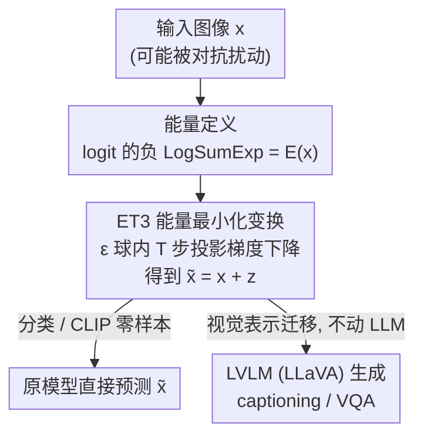

# A Provable Energy-Guided Test-Time Defense Boosting Adversarial Robustness of Large Vision-Language Models

**会议**: CVPR 2026  
**论文**: [CVF Open Access](https://openaccess.thecvf.com/content/CVPR2026/html/Mirza_A_Provable_Energy-Guided_Test-Time_Defense_Boosting_Adversarial_Robustness_of_Large_CVPR_2026_paper.html)  
**代码**: 有（论文称 "Code is available on GitHub"，仓库地址以原文为准）  
**领域**: AI安全 / 对抗鲁棒  
**关键词**: 对抗鲁棒, 测试时防御, 能量模型, 视觉语言模型, CLIP

## 一句话总结
ET3 把分类器 logit 的 LogSumExp 解释为输入的"能量"，在推理时只对图像做几步梯度下降把能量压低，就能把被对抗扰动推离数据流形的样本拉回正确类别——免训练、几乎零开销，对纯分类器、CLIP 零样本、以及 LLaVA 这类大型 VLM 的对抗鲁棒性都有显著提升，并给出了二分类下"必定纠正"的可证明保证。

## 研究背景与动机
**领域现状**：大型视觉语言模型（LVLM，如 LLaVA、OpenFlamingo、Qwen-VL）几乎都把 CLIP 视觉编码器当作"眼睛"，靠它的强泛化做 captioning、VQA、开放词表识别。但 CLIP 视觉端也正是整个系统对抗脆弱性的总源头：对图像加一点人眼不可察的扰动就能让下游全盘出错。提升鲁棒性的主流范式是**对抗训练（AT）**，把对抗样本塞进训练；另一条线是**测试时防御**，在推理阶段补救。

**现有痛点**：对抗训练昂贵、且 clean 与 perturbed 之间始终有明显差距，尤其面对更强或没见过的攻击就掉链子。测试时这一侧的方案各有代价：对抗净化（purification）要挂一个辅助生成/扩散模型来去噪；随机平滑（RS）要对噪声扰动做大量平均；近年的测试时变换（TTT，如 TPT/R-TPT/MTA）则要为每个样本优化额外的 prompt token、或生成一堆增强视图再聚合，**推理开销大、常常还要额外模型、对强攻击 scale 不动**，有的甚至拉低 clean 精度。

**核心矛盾**：要么训练侧重投入（AT），要么推理侧重投入（多视图/额外模型的 TTT），鲁棒性提升与计算/工程成本之间存在硬权衡，而且大多缺乏理论保证——你不知道这个变换什么时候会失灵。

**本文目标**：做一个**免训练、不挂额外模型、几乎零额外推理时间**的测试时防御，对图像分类器 / CLIP 零样本 / LVLM 三类设定通用，并且能在二分类下**证明**其有效。

**切入角度**：作者借用能量模型（EBM）视角——对抗样本本质上**偏离了自然数据流形**，对应着高能量；而 Joint Energy-based Model（JEM）早已说明，一个标准 softmax 分类器本身就能被读成 EBM，把 logit 直接当能量看。既然如此，"把样本拉回流形"就等价于"把能量降下来"，而能量的梯度可以直接从已有分类器/编码器拿到，不需要任何额外训练。

**核心 idea**：用"在 ε 球内做几步梯度下降最小化输入能量"这一个轻量变换，代替昂贵的对抗训练或多视图 TTT，来在测试时把对抗样本推回正确分类区。

## 方法详解

### 整体框架
ET3（Energy-guided Test-Time Transformation）的输入是一张（可能被攻击的）图像 $x$ 和一个被防御的预训练模型 $f_\theta$（分类器或视觉编码器），输出是一张微调过的图像 $\tilde x = x + z$，其中扰动 $z$ 被约束在一个半径为 $\epsilon$ 的 $\ell_2$ 球内。整条流程只有三步：① 把 $f_\theta$ 的输出 logit 通过 LogSumExp 定义成能量 $E(x)$；② 从 $x$ 出发，沿 $-\nabla_x E$ 做 $T$ 步带投影的梯度下降，得到能量更低、更"贴流形"的 $\tilde x$；③ 把 $\tilde x$ 喂回原模型完成分类，或把它经过 CLIP 视觉编码器的内部表示直接转交给下游 LVLM。

关键在于 ET3 **完全不碰 VLM 本体**：优化只在视觉编码器（CLIP）上做能量最小化，得到的 $\tilde x$ 的视觉 embedding 经 LLaVA 的投影层后，后续语言生成原封不动。也就是说，一个在 CLIP 上"净化"好的图像，其鲁棒性能**迁移**给任何复用该编码器的 LVLM，单步优化就够，几乎不影响推理速度。

### 关键设计

**1. 把 softmax 分类器读成 EBM：用 LogSumExp 定义"输入能量"**

防御要"把对抗样本拉回流形"，但流形是隐式的、没人给你一个现成的能量函数。本文的关键观察来自 JEM：一个已经训练好的 $K$ 类分类器 $f_\theta$，其 logit 本身就可以当能量用，无需再单独训练一个生成式 EBM。具体把样本 $x$ 的能量定义为输出 logit 的负 LogSumExp：

$$E(x) = -\log\left(\sum_{k=1}^{K}\exp\big(f_\theta(x)_k\big)\right).$$

直觉上，落在数据分布内（on-manifold）的样本能量低，离群/对抗样本（off-manifold）能量高。这一步的价值在于：它把"贴近自然流形"这个抽象目标变成了一个**可直接对输入求梯度**的标量目标，而梯度全部来自已有模型，零额外参数、零额外训练。

**2. ε 球内投影梯度下降做能量最小化：免训练、几步即可的核心防御**

有了能量，防御就是一个带约束的极小化：在以 $x$ 为心、半径 $\epsilon$ 的 $\ell_2$ 球 $B_\epsilon(x)$ 内找能量最低点 $\tilde x = \arg\min_{x'\in B_\epsilon(x)} E(x')$。用 $T$ 步投影梯度下降求解，第 $t$ 步为：

$$x^{(t)} = \Pi_{B_\epsilon(x)}\Big(x^{(t-1)} - \eta\,\nabla_x E\big(x^{(t-1)}\big)\Big),\quad x^{(0)}=x,$$

其中投影 $\Pi_{B_\epsilon(x)}$ 把扰动拍回 $\ell_2$ 球以保证 $\lVert z\rVert\le\epsilon$，步长 $\eta$ 和步数 $T$ 是仅有的超参。注意能量梯度展开后是 $\nabla_x E(x) = -\sum_i \mathrm{SoftMax}(f_\theta(x))_i\,\nabla_x f_\theta(x)_i$，即各类 logit 梯度按其 softmax 概率加权——降能量等价于**沿被模型最看好的类方向加强证据**。与对抗净化不同，这里没有辅助生成模型；与多视图 TTT 不同，这里不优化 prompt、不生成增强视图，因此实测单步防御的推理时间只增加约 2.3%，对干净图像还往往保持原预测甚至略增置信度。

**3. 跨设定的统一接入：CLIP 零样本与 LVLM 都靠"代理标签集 + 视觉编码器迁移"**

同一套能量最小化要同时服务于零样本分类和多模态生成，难点在于 LVLM 没有现成的"K 类 logit"。本文用两个适配把它们统一进来。对 **CLIP 零样本**：分类靠图文 embedding 相似度，于是直接把图文相似度当作 logit 来算能量；标签集可以用精炼子集，也可以用极大的 ImageNet-21K 全标签集作为"代理概念"，实测后者鲁棒性略好，故默认采用。对 **LVLM（LLaVA）**：因为它复用 CLIP 视觉编码器，ET3 就在该编码器上、以 ImageNet-21K 文本标签为参照对视觉输入做能量最小化；净化后的视觉 embedding 经投影层进入 LLaVA，**语言生成全程不变、VLM 不参与优化**。这一设计让"在编码器上净化一次、鲁棒性迁移给所有下游任务"成为可能，也解释了为何 captioning 和 VQA 能共享同一个防御。

### 损失函数 / 训练策略
ET3 **没有训练阶段**，唯一的"目标函数"就是推理时被最小化的能量 $E(x)$（式 1）。可调超参只有防御半径 $\epsilon$、步长 $\eta$ 和步数 $T$。论文中 CLIP 零样本默认 $\epsilon=5$（TeCoA）或 $4$（FARE）、$T=2$；LVLM 实验固定两步梯度迭代；单步即可获得主要收益，是其"几乎零开销"的来源。

## ET3 的可证明保证（理论）
论文给出二分类下的纠正定理（Theorem 4.1）：设 $f_\theta:\mathbb R^d\to\mathbb R^2$ 在 $B_\epsilon(x)$ 内**局部线性**，记 logit 间隔 $r_x=f_\theta(x)_{y_t}-f_\theta(x)_{\hat y_t}$、各类 logit 梯度 $g_i=\nabla_x f_\theta(x)_i$、能量对各 logit 的权重 $e_i=\mathrm{SoftMax}(f_\theta(x))_i$。只要防御预算满足 $\epsilon > \tfrac{-2r_x}{\lVert g_{y_t}\rVert}$，且**真值类的能量梯度强于错误类**（即 $C\lVert e_{\hat y_t}g_{\hat y_t}\rVert < \lVert e_{y_t}g_{y_t}\rVert$，$C$ 为定理给出的阈值），则单步（$T=1$）ET3 变换 $z$ 满足 $\lVert z\rVert\le\epsilon$ 且 $f_\theta(x+z)_{y_t} > f_\theta(x+z)_{\hat y_t}$，即变换后被正确分类。

证明思路：在局部线性假设下，攻击沿"较大梯度的负方向"压低真值 logit，而 ET3 的能量下降步恰好沿**同一较大梯度的正方向**走，把对抗点拉回真值区（图 3 左）。直觉对应物是梯度范数比 $C$：图 3 右在 1000 张 ImageNet 图上散点显示，$C\gtrsim 1$ 的样本变换后 logit margin 几乎都 $>0$（分类正确），且 $C$ 越大 margin 越大。作者还指出该定理对干净样本（$r_x>0$）假设更松、可推广到同预算下的多步变换，并引用 [26] 构造的可证明鲁棒两层 ReLU 网络作为满足假设的具体实例。

## 实验关键数据

### 主实验

**零样本分类（14 数据集，defense-unaware，AA @ $\epsilon_a=4/255$）**：ET3 对鲁棒 CLIP（TeCoA / FARE）的鲁棒精度一致提升，且几乎不伤 clean。

| 模型 (backbone) | 指标 | Base | + ET3 | 提升 |
|---|---|---|---|---|
| ViT-L/14 TeCoA ($\epsilon_t$=4/255) | Robust Avg. | 32.85 | 40.93 | +8.08 |
| ViT-L/14 FARE ($\epsilon_t$=4/255) | Robust Avg. | 32.77 | 40.60 | +7.83 |
| ViT-L/14 TeCoA ($\epsilon_t$=2/255) | Robust Avg. | 27.66 | 38.64 | +10.98 |
| ViT-L/14 FARE ($\epsilon_t$=2/255) | Robust Avg. | 20.39 | 31.75 | +11.36 |
| ViT-L/14 TeCoA ($\epsilon_t$=4/255) | Clean Avg. | 55.69 | 56.09 | +0.40 |

值得注意的是，对"较弱"（用更弱攻击训练）的模型 ET3 提升反而更大（+11 量级），且 clean 精度基本持平（±0.4）。

**对比同类测试时防御（8 细粒度数据集，TeCoA CLIP-ViT-B/32，PGD-100 @ 4/255，Robust Avg.）**：

| 方法 | 作用范围 | Robust Avg. | 提升 |
|---|---|---|---|
| CLIP (Robust) baseline | — | 12.26 | — |
| TTC | 轻量·仅视觉 | 13.90 | +1.64 |
| **ET3 (ours)** | 轻量·仅视觉 | **16.51** | **+4.25** |
| MTA | 多视图 | 17.80 | +5.54 |
| Ensemble + ET3 | 多视图 | 22.26 | +10.0 |
| R-TPT | 多视图+prompt | 21.41 | +9.15 |
| **R-TPT + ET3** | 多视图+prompt | **23.88** | **+11.62** |

ET3 单用就超过同为"轻量仅视觉"的 TTC，甚至胜过更慢的 TPT/C-TPT；叠加到 Ensemble / R-TPT 上还能进一步把 SOTA 顶高，说明它是**正交可插拔**的。

**LVLM（LLaVA-1.5-7B，defense-unaware，$\epsilon_a=4/255$，500 张 APGD 对抗样本）**：captioning 用 CIDEr、VQA 用准确率。

| 视觉编码器 | 指标 | Clean | +ET3 | 4/255 | +ET3 |
|---|---|---|---|---|---|
| CLIP（标准） | Avg. | 76.2 | 73.9 (-2.3) | 1.0 | 38.8 (+37.8) |
| TeCoA2 | Avg. | 61.6 | 62.3 (+0.7) | 19.4 | 35.5 (+16.1) |

最戏剧性的是**标准（非鲁棒）CLIP**：原本对抗下几乎归零（平均 1.0），加 ET3 后跳到 38.8，几乎只靠测试时净化就把一个完全不设防的 VLM 救了回来；对已鲁棒的 TeCoA 也再 +16。单步防御推理时间仅 +2.3%。

### 消融与设定分析

| 配置 / 设定 | 关键发现 |
|---|---|
| 标签集：精炼子集 vs ImageNet-21K | 用 ImageNet-21K 全标签作代理概念，鲁棒性略优，故默认采用 |
| 步数 $T$（1 vs 2） | 单步即获主要收益、开销 +2.3%；$T=2$ 进一步提升，仍轻量 |
| defense-aware（自适应攻击，BPDA + 目标 APGD-DLR） | 在 RobustBench ResNet-50 上对穿透防御的自适应攻击仍保持有效，报告 worst-case 精度 |
| 攻击强度变大（Fig. 4） | 攻击幅度增大时 ET3 的鲁棒增益依然存在，不只在弱攻击下生效 |

### 关键发现
- **能量梯度比 $C$ 决定成败**：理论与散点图都指向同一信号——只要真值类能量梯度足够强（$C\gtrsim1$），变换后必定纠正；这给"何时会失灵"提供了可解释的判据。
- **越不设防越受益**：标准 CLIP 的 VLM 对抗下几乎全错，ET3 带来 +37.8 的最大跳变，说明能量最小化抓住的是"回到流形"这一普适机制，而非依赖已有鲁棒训练。
- **正交性**：ET3 叠加在 Ensemble / R-TPT 上仍能继续涨点，说明它和"多视图聚合 / prompt 调优"补的是不同的洞。

## 亮点与洞察
- **把"已有分类器"白嫖成能量模型**：用 LogSumExp 把 logit 读成能量，省掉了训练辅助生成/扩散模型的全部成本——这是 purification 类方法最重的包袱，本文一句话绕过。
- **"净化一次、迁移全家"**：只在 CLIP 视觉编码器上优化，鲁棒性自动迁移给任何复用该编码器的 LVLM，且不碰语言模型，工程上几乎零侵入；这个"在共享 backbone 上做测试时防御再迁移"的思路可推广到任何以 CLIP/视觉基座为眼睛的多模态系统。
- **理论与实践对齐**：不只给了二分类纠正定理，还把抽象的"梯度范数比 $C$"用 1000 张图的散点验证成可观测信号，避免了纯理论防御常见的"假设漂亮但现实失灵"。

## 局限与展望
- **理论保证仅限二分类 + 局部线性**：纠正定理建立在两 logit、$B_\epsilon(x)$ 内局部线性、以及"真值类能量梯度更强"这几条假设上；多类、深层非线性网络只能近似满足，定理是启发而非通用证明。
- **依赖底层模型的能量地形**：若 $f_\theta$ 本身能量地形很差（$C<1$，如完全非鲁棒且梯度方向被攻击主导的极端情形），ET3 无法保证纠正——标准 CLIP 虽大幅回升但仍未及鲁棒训练上限。
- **代理标签集是经验选择**：默认 ImageNet-21K 全标签算能量，对开放域/分布外类别是否最优缺乏系统分析，换域可能要重选标签集。
- **改进方向**：把 $\epsilon/\eta/T$ 做成按 $C$ 自适应（梯度比高时多走几步）、或与轻量鲁棒训练联合，或将能量定义扩展到生成式损失以覆盖 captioning 这类无显式 logit 的任务。

## 相关工作与启发
- **vs 对抗净化（DiffPure 等）**：他们挂扩散/score 模型去噪，本文不需要任何辅助生成模型，直接复用被防御模型的 logit 当能量，开销和工程复杂度大幅降低；代价是没有显式去噪、靠"拉回流形"间接纠正。
- **vs TTC**：同属"轻量·仅视觉"测试时变换，TTC 沿 CLIP 特征空间最大化对抗输入与 clean embedding 距离，鲁棒增益有限（+1.64）；ET3 改用能量最小化方向，增益翻倍（+4.25）且有理论支撑。
- **vs TPT / R-TPT / MTA**：这些靠多视图增强 + prompt 调优，推理开销大；ET3 单用就追平/超过它们，叠加上去还能再涨，是更便宜且正交的一块拼图。
- **vs 对抗训练（TeCoA / FARE）**：AT 在训练侧花大力气，ET3 则在它们之上再加一层免训练的测试时净化，把同一鲁棒 backbone 的对抗精度继续推高 +8~11，说明训练侧与测试侧防御可叠加互补。

## 评分
- 新颖性: ⭐⭐⭐⭐ 把 JEM 的"logit 即能量"用作免训练测试时防御并配二分类纠正定理，角度清新但属已有概念的巧妙组合。
- 实验充分度: ⭐⭐⭐⭐ 覆盖纯分类器 / CLIP 零样本 / LVLM 三设定、defense-unaware 与 defense-aware（自适应攻击）双威胁模型、14~15 数据集，较完整。
- 写作质量: ⭐⭐⭐⭐ 理论—直觉—实验对齐清楚，图 3 把抽象的梯度比 $C$ 落地成可观测信号。
- 价值: ⭐⭐⭐⭐ 免训练、+2.3% 开销、可插拔、能救完全不设防的 VLM，实用性强，易被下游 multimodal 系统采用。

<!-- RELATED:START -->

## 相关论文

- [\[CVPR 2026\] TTP: Test-Time Padding for Adversarial Detection and Robust Adaptation on Vision-Language Models](ttp_test-time_padding_for_adversarial_detection_and_robust_adaptation_on_vision-.md)
- [\[CVPR 2026\] When CLIP Sees More, It Fights Back Harder: Multi-View Guided Adaptive Counterattacks for Test-Time Adversarial Robustness](when_clip_sees_more_it_fights_back_harder_multi-view_guided_adaptive_counteratta.md)
- [\[ICML 2026\] Towards Fine-Grained Robustness: Attention-Guided Test-Time Prompt Tuning for Vision-Language Models](../../ICML2026/ai_safety/towards_fine-grained_robustness_attention-guided_test-time_prompt_tuning_for_vis.md)
- [\[CVPR 2026\] Transform to Transfer: Boosting Adversarial Attack Transferability on Vision-Language Pre-training Models](transform_to_transfer_boosting_adversarial_attack_transferability_on_vision-lang.md)
- [\[CVPR 2026\] VCP-Attack: Visual-Contrastive Projection for Transferable Black-Box Targeted Attacks on Large Vision-Language Models](vcp-attack_visual-contrastive_projection_for_transferable_black-box_targeted_att.md)

<!-- RELATED:END -->
