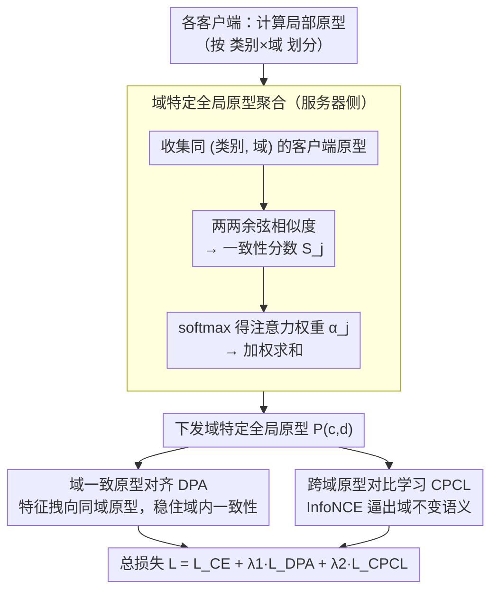

# FedDAP: Domain-Aware Prototype Learning for Federated Learning under Domain Shift

**会议**: CVPR 2026  
**arXiv**: [2604.06795](https://arxiv.org/abs/2604.06795)  
**代码**: [GitHub](https://github.com/quanghuy6997/FedDAP)  
**领域**: AI安全  
**关键词**: 联邦学习, 域偏移, 原型学习, 对比学习, 域感知

## 一句话总结

提出域感知原型联邦学习框架 FedDAP，通过构建域特定全局原型和双重原型对齐策略（域内对齐 + 跨域对比），解决联邦学习中客户端数据域偏移导致的全局模型性能退化问题。

## 研究背景与动机

联邦学习（FL）允许多客户端在不暴露私有数据的情况下协作训练模型。然而在真实场景中，不同客户端的数据往往来自不同域（如不同传感器、环境、图像风格），导致严重的域偏移（domain shift）问题。

现有原型驱动的 FL 方法存在两个关键局限：

**单一全局原型的语义稀释**：为每个类别构建单一全局原型，简单地对所有客户端的局部原型取平均，忽略了域信息。当"狗"在照片域有自然纹理，在素描域是简化线条时，平均原型无法准确代表任何一个域。

**域无关的对齐策略**：强迫所有客户端将特征与同一全局原型对齐，不考虑域来源。这种域无关监督忽略了局部分布与全局原型之间的语义差异。

## 方法详解

### 整体框架

FedDAP 框架包含三个阶段：
1. 客户端计算局部原型并上传到服务器
2. 服务器通过余弦相似度加权融合机制，为每个（类别, 域）对构建域特定全局原型
3. 客户端下载全局原型，通过双重原型对齐策略进行本地训练

### 关键设计

**1. 域特定全局原型聚合：把原型从"类别"一维扩到"类别×域"二维**

旧原型 FL 给每个类别只建一个全局原型、对所有客户端局部原型简单平均，结果是"狗"在照片域有自然纹理、在素描域是简化线条，平均出来的原型谁都不像。FedDAP 改成为每个 (class, domain) 对建独立原型：服务器收集同一域同一类别的所有客户端原型，算两两余弦相似度一致性分数 $S_j$，softmax 归一化得注意力权重 $\alpha_j$，再加权求和得域特定全局原型 $\mathbf{P}^{(c,d)}$，温度 $\tau_{agg}$ 控制权重锐利度。这样域内语义一致的原型被强调、离群原型被弱化，每个域都有自己说得清的代表。

**2. 域一致原型对齐 DPA：先把特征拽向自己域内的原型，稳住域内一致性**

域无关地强迫所有客户端对齐同一个全局原型，会忽略本地分布和全局原型之间的语义差异。DPA 只让客户端局部特征对齐**同域**原型，用余弦相似度损失 $\mathcal{L}_{DPA} = \sum_{c}(1 - \cos(z_i^c, \mathbf{P}^{(c,d_m)}))$，确保特征与类别特定、域相关的原型语义一致，且对尺度变换更鲁棒。消融显示域差异显著时（Office-10）DPA 的增益远大于 CPCL，说明域内对齐是稳定性的根基。

**3. 跨域原型对比学习 CPCL：再用别的域的原型做对比，逼出域不变语义**

只对齐域内会让表示困在各自域里、跨域泛化差。CPCL 引入其他域的原型做对比：正样本是其他域中的同类原型、负样本是其他域中的异类原型，用 InfoNCE 把特征拉向跨域同类、推离跨域异类，从而学到域不变的语义表示，增强跨域泛化。DPA 管稳定、CPCL 管泛化，两者相辅相成，组合使用效果最优。

### 损失函数 / 训练策略

总损失函数为三项加权组合：
$$\mathcal{L} = \mathcal{L}_{CE} + \lambda_1 \mathcal{L}_{DPA} + \lambda_2 \mathcal{L}_{CPCL}$$

- $\mathcal{L}_{CE}$: 标准交叉熵分类损失
- $\lambda_1 = 10$: 域内对齐权重（较大值有利于稳定域特定原型）
- $\lambda_2 = 1$: 跨域对比权重（过大会过度正则化，破坏域特定结构）
- 通信轮次 100，每轮本地训练 10 个 epoch

## 实验关键数据

### 主实验

| 数据集 | 指标 | FedDAP | FedPLVM | FedRDN | FedAvg | 提升(vs FedAvg) |
|--------|------|--------|---------|--------|--------|----------------|
| DomainNet | Avg Acc | **65.20** | 62.22 | 61.01 | 59.59 | +5.61 |
| Office-10 | Avg Acc | **72.53** | 68.77 | 65.54 | 57.47 | +15.06 |
| PACS | Avg Acc | **84.63** | 82.06 | 83.17 | 77.07 | +7.56 |

### 消融实验

| 配置 (DPA / CPCL) | DomainNet | Office-10 | PACS |
|-------------------|-----------|-----------|------|
| ✗ / ✗ (FedAvg) | 59.59 | 57.47 | 77.07 |
| ✗ / ✓ | 62.86 | 62.18 | 81.87 |
| ✓ / ✗ | 62.61 | 68.53 | 78.74 |
| ✓ / ✓ (Full) | **65.20** | **72.53** | **84.63** |

### 关键发现

1. **两个组件互补且必要**：DPA 通过域内一致性提升表现，CPCL 通过跨域对比提升泛化，组合使用效果最优。值得注意的是，DPA 在 Office-10 上的提升（+11.06）远大于 CPCL（+4.71），表明域内对齐在域差异显著时尤其重要。

2. **域特定原型聚合 vs 简单平均**：使用余弦相似度加权融合比简单平均分别提升 1.05%/1.04%/1.41%。即使用简单平均的域感知原型也显著优于域无关原型，证明域特定原型的核心价值。

3. **收敛更快**：在三个数据集上，FedDAP 在更少通信轮次内达到更高精度。

4. **跨域泛化**：在 leave-one-domain-out 评估下，FedDAP 在 DomainNet 和 Office-10 上分别领先次优方法 +1.88% 和 +1.17%。

5. **t-SNE 可视化**：相比 FedProto 的特征弥散和交叉重叠，FedDAP 产生更紧凑、分离更好的类别簇。

## 亮点与洞察

- 核心设计理念很清晰：将原型空间从"类别"一维扩展到"类别×域"二维，是处理 FL 域偏移的自然且有效的方式。
- 双重对齐策略的设计哲学值得借鉴：域内对齐保持稳定性，跨域对比增强泛化性，两者相辅相成。
- 余弦相似度加权融合比简单平均更好，但提升比较温和（~1%），说明域特定原型的构建本身比聚合方式更关键。

## 局限与展望

- 假设每个客户端的域标签已知（需要域标识符 $d$），在隐式域偏移场景下需要额外的域发现机制
- 域的数量 $D$ 需要预先设定，对于域边界模糊的真实场景可能不适用
- 实验仅在图像分类任务上验证，未扩展到检测、分割等更复杂的视觉任务
- 对客户端数量的可扩展性分析不足（最多 20 个客户端）
- 原型通信增加了额外带宽开销，但论文未量化分析

## 相关工作与启发

- FedProto 首先引入原型到 FL，但采用域无关的单一全局原型
- FedPLVM、FPL 改进了原型质量，但仍忽略域信息
- FedRDN (CVPR'25) 是最近的域偏移 FL 方法，但在本文实验中不如 FedDAP
- 与域泛化方法（COPA、FedGA）的区别：FedDAP 直接建模域特定语义结构，而非学习域不变表示

## 评分

- 新颖性: ⭐⭐⭐⭐ （域特定原型 + 双重对齐策略是对原型 FL 的有意义扩展）
- 实验充分度: ⭐⭐⭐⭐ （3 个数据集，丰富的消融实验和参数分析）
- 写作质量: ⭐⭐⭐⭐ （结构清晰，动机阐述充分）
- 价值: ⭐⭐⭐⭐ （实用性强，代码开源，对 FL 域偏移问题有实际意义）

<!-- RELATED:START -->

## 相关论文

- [\[CVPR 2026\] Domain-Skewed Federated Learning with Feature Decoupling and Calibration](domain-skewed_federated_learning_with_feature_decoupling_and_calibration.md)
- [\[ICML 2026\] FedHPro: Federated Hyper-Prototype Learning via Gradient Matching](../../ICML2026/ai_safety/fedhpro_federated_hyper-prototype_learning_via_gradient_matching.md)
- [\[CVPR 2026\] Federated Active Learning Under Extreme Non-IID and Global Class Imbalance](federated_active_learning_extreme_noniid.md)
- [\[CVPR 2026\] FedAFD: Multimodal Federated Learning via Adversarial Fusion and Distillation](fedafd_multimodal_federated_learning_via_adversarial_fusion_and_distillation.md)
- [\[CVPR 2026\] Frequency-domain Manipulation for Face Obfuscation](frequency-domain_manipulation_for_face_obfuscation.md)

<!-- RELATED:END -->
