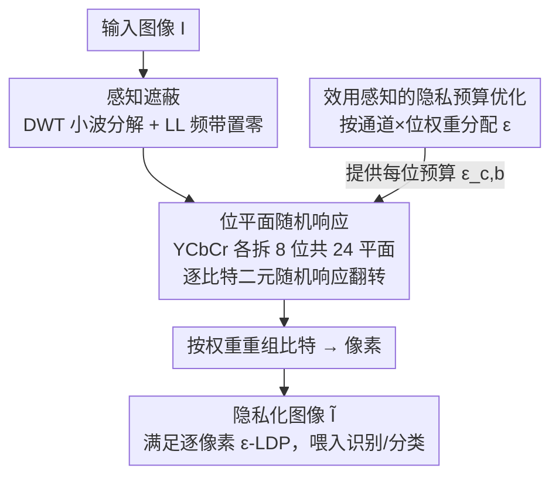

# LDP-Slicing: Local Differential Privacy for Images via Randomized Bit-Plane Slicing

**会议**: CVPR 2026  
**论文**: [CVF Open Access](https://openaccess.thecvf.com/content/CVPR2026/html/Cao_LDP-Slicing_Local_Differential_Privacy_for_Images_via_Randomized_Bit-Plane_Slicing_CVPR_2026_paper.html)  
**代码**: 待确认  
**领域**: AI安全 / 图像隐私 / 局部差分隐私  
**关键词**: 局部差分隐私, 位平面切分, 随机响应, 隐私预算分配, 人脸识别

## 一句话总结
把每个像素拆成 8 个二进制位平面、对每个比特独立做随机响应，再配上小波域感知遮蔽和按位重要度分配隐私预算的优化，LDP-Slicing 第一次让"逐像素 $\varepsilon$-LDP"在标准图像上既严格可证又能保住下游任务精度，且零额外存储、毫秒级开销。

## 研究背景与动机

**领域现状**：要让"上传图像 → 服务器跑人脸识别 / 医学诊断"这件事不泄露隐私，主流有三条路。一是视觉遮蔽（模糊、像素化、频域裁剪），简单但**没有形式化保证**，已被深度学习反演攻击反复打穿；二是密码学方法，安全但算不动大模型、也挡不住推理攻击；三是差分隐私（DP），是当下"金标准"。

**现有痛点**：DP 又分两种信任模型。**中心化 DP**（DP-SGD 等）假设有一个可信的中央 curator 先收集原始图像再加噪，效用高，但这个"可信 curator"假设在零信任世界里站不住——curator 一旦被攻破，所有原始数据隐私就不可逆地全丢了。**局部差分隐私（LDP）** 在数据源头就加噪、不需要可信 curator，信任模型更强；但它撞上了"维度灾难"：一个 8-bit 像素有 $k=256$ 种取值，$k$-元随机响应报告真值的概率是 $p=\frac{e^\varepsilon}{e^\varepsilon+k-1}$，$k=256$ 时哪怕预算不算小，$p$ 也小到几乎全是噪声，把任务相关信息彻底毁掉。

**核心矛盾**：正因为这个维度灾难，过去做"可证明的视觉隐私"的工作都绕开原始像素——要么退回中心化 DP，要么把 LDP 施加在**低维表示**上（latent embedding、特征描述子、特征向量、eigenvector）。但这等于放弃了 LDP "直接在高维像素上提供源头保证"的初衷，留下一个空白：能不能不把图像压成低维，就在原始高维像素上拿到逐像素 LDP？

**切入角度**：作者的关键观察是——这个效用损失**不是 LDP 的固有缺陷，而是把 LDP 用错了数据表示**。一个有 256 个离散态的像素，本质是 8 个比特的二进制编码，而每一位的"重要性"恰好对应像素的语义结构（高位 MSB 携带粗结构，低位 LSB 多是噪声纹理）。如果换到**比特层**这个表示，LDP 的最小操作单元就从"256 元"变成"2 元"，随机响应天然友好。

**核心 idea**：用一句话概括——把像素切成位平面、对每个比特独立做二元随机响应，从而在不坍缩维度的前提下满足逐像素 $\varepsilon$-LDP；再叠加感知遮蔽和按比特重要度分配预算两个增强模块，换来强隐私-效用权衡。整个框架 **training-free**（无需训练）、输出仍是一张标准图像。

## 方法详解

### 整体框架
LDP-Slicing 的目标是设计一个局部机制 $\mathcal{M}$，把原图 $I$ 变成隐私化版本 $\tilde I$，使 $\tilde I$ 满足逐像素 $\varepsilon$-LDP 又仍对下游视觉任务有用。整条管线由三个有序模块串成：① **感知遮蔽**——先用小波变换把图像低频信息裁掉，挡住"人眼直接看"这条威胁；② **位平面随机响应**——把遮蔽后的图像按 YCbCr 三通道各拆成 8 个二进制位平面（共 24 个），对每个比特独立做随机响应翻转，这是提供形式化 LDP 保证的核心；③ **效用感知的预算优化**——决定总预算 $\varepsilon_{\text{total}}$ 怎样非均匀地分给这 24 个位平面，让最重要的比特拿到最多预算（噪声最小）。最后把扰动后的比特重组回像素，输出一张标准图像，可直接喂进现成识别/分类模型，无需改架构。

### 关键设计

**1. 感知遮蔽：用小波 LL-剪枝挡住人眼这条威胁通道**

核心 LDP 机制保护的是"算法推理攻击"，但在较弱隐私设置（$\varepsilon$ 较大）下，加噪后的图像仍可能残留被人眼识别的结构。作者引入一个**预处理**的感知遮蔽来补这个洞，动机来自一条研究充分的感知不对称性：人眼主要靠**低频线索**（大致形状、平滑区域）识别内容，而现代 CNN 更多利用**细节高频**信息。于是用 1 级 Haar 离散小波变换（DWT）把每个图像通道分解成一个低频近似子带 LL 和三个高频细节子带（LH、HL、HH），再做 **LL-剪枝**——把 LL 子带所有系数置零，然后逆变换（IDWT）重建图像。这样人眼赖以辨认的低频内容被抹掉，而机器学习需要的高频细节大体保留。相比按块操作的 DCT，DWT 是多分辨率分解，在激进裁掉频率系数时不会引入 DCT 常见的块状伪影，从而更好地保住有用高频（消融表 3 里 DWT 优于 DCT 验证了这点）。值得强调：这一步是**公开、确定性**的预处理，**不消耗隐私预算**——它只防人眼、不提供形式化保证，真正的 LDP 保证来自下一步。

**2. 位平面随机响应：把"256 元 LDP"换成"24 个二元 LDP"，拿到逐像素形式化保证**

这是整篇论文的灵魂。直接对 256 元像素做随机响应会被噪声淹没，作者先用**位平面切分（BPS）** 改数据表示：对一个 $d$ 位像素（通常 $d=8$）$x\in[0,2^d-1]$，拆成比特序列 $\{x_1,\dots,x_d\}$，

$$x_\ell = \left\lfloor \frac{x}{2^{d-\ell}} \right\rfloor \bmod 2, \quad \ell\in\{1,\dots,d\}.$$

整张图在 Y、Cb、Cr 三通道上共得到 24 个位平面。然后在这个**二元域**里，对每个比特 $x_\ell\in\{0,1\}$ 独立施加随机响应，输出隐私化比特 $\tilde x_\ell$：

$$\Pr[\mathcal{M}_{RR}(x_\ell)=\tilde x_\ell] = \begin{cases} \dfrac{e^{\varepsilon_\ell}}{e^{\varepsilon_\ell}+1}, & \tilde x_\ell = x_\ell,\\[6pt] \dfrac{1}{e^{\varepsilon_\ell}+1}, & \text{否则}, \end{cases}$$

其中 $\varepsilon_\ell$ 是分给该位平面的预算。注意此处分母是 $e^{\varepsilon_\ell}+1$ 而非 256 元的 $e^\varepsilon+255$——这正是"换表示"带来的效用跃升：每个比特只在 2 个取值里混淆，报告真值的概率远高于原始 256 元。扰动后按位权重重组回像素 $\tilde x = \sum_{\ell=1}^{8} 2^{8-\ell}\cdot \tilde x_\ell$。

形式化保证由两条 LDP 基本性质给出（定理 3）：**逐像素组合**——一个彩色像素的 24 个比特各自独立做随机响应，按序列组合定理，整条管线对该像素是 $\big(\sum_{c,b}\varepsilon_{c,b}\big)$-LDP，即 $\varepsilon_{\text{total}}$-LDP；**后处理免疫**——最后的重组重建是数据无关函数，按后处理定理不会削弱隐私。作者还给出隐私的"操作含义"：$\varepsilon$-LDP 给攻击者区分任意两张隐私化图像的能力一个硬上界，用总变差距离 $\mathrm{TV}(P,Q)\le \frac{e^\varepsilon-1}{e^\varepsilon+1}=\tanh(\varepsilon/2)$ 刻画，从而身份区分攻击（Definition 1）的优势被 $\mathrm{Adv}\le \tfrac12\tanh(\varepsilon/2)$ 上界住。一个微妙但重要的点：虽然把逐像素界组合到整图是"宽松的最坏情况"保证，但语义身份本就依赖空间相关性（轮廓、纹理），逐像素独立扰动严重破坏了这种结构依赖，实测攻击优势很低（表 2）。

**3. 效用感知的隐私预算优化：把预算按比特/通道的重要度非均匀分配**

朴素做法是把 $\varepsilon_{\text{total}}$ 均匀分给 24 个位平面（$\varepsilon_\ell=\varepsilon_{\text{total}}/24$），但作者论证这是次优的：并非所有比特平等——Luma(Y) 通道的高位 MSB 携带绝大多数结构信息，把预算浪费在噪声般的低位 LSB 和不重要的色度通道上，既换不来有意义的隐私、又白白损失效用。于是把分配建成**约束优化**：设 $\varepsilon_{c,b}$ 是通道 $c\in\{Y,Cb,Cr\}$ 第 $b\in\{1,\dots,8\}$ 位的预算，目标是在总预算固定下最小化加权失真

$$\min_{\{\varepsilon_{c,b}\}} \sum_{c,b}\frac{W_{c,b}}{\varepsilon_{c,b}} \quad \text{s.t.}\ \sum_{c,b}\varepsilon_{c,b}=\varepsilon_{\text{total}},\ \varepsilon_{c,b}\ge 0.$$

重要度权重 $W_{c,b}=w_c\cdot w_b$ 由两条数字图像/感知性质给出：**通道敏感度** $w_c$——CNN 对降低的色度信息鲁棒（借鉴 JPEG 色度子采样），故给 Y 通道更高权重，设 $w_Y=4,\ w_{Cb}=w_{Cr}=1$；**位平面重要度** $w_b$——第 $b$ 位对像素值的贡献是 $2^{b-1}$，故 $w_b=2^{b-1}$。失真与预算成反比，用拉格朗日乘子求解得闭式分配

$$\varepsilon_{c,b}=\varepsilon_{\text{total}}\cdot \frac{\sqrt{W_{c,b}}}{\sum_{i\in\{Y,Cb,Cr\}}\sum_{j=1}^{8}\sqrt{W_{i,j}}}.$$

直观即：最关键的信息（Y 通道高位）拿到最多预算、噪声最少，最不重要的位拿最少。消融里它是掉点最狠的组件（去掉换成均匀分配，AgeDB-30 绝对掉 6.86%），印证了"按比特/通道重要度分配预算"这一核心假设。

### 损失函数 / 训练策略
LDP-Slicing 本身是 **training-free** 的隐私机制，不含可学习参数；"训练"发生在下游模型侧。人脸识别用预训练 ResNet-50 + ArcFace 损失，SGD 训 24 个 epoch；小预算（如 $\varepsilon=2.4$）时用梯度裁剪（max norm = 1）缓解梯度消失；默认测试预算 $\varepsilon_{\text{total}}=20$。图像分类从头训 ResNet-56。由 LDP 的后处理性质，任何在隐私化图上训练的模型都继承严格隐私保证。

## 实验关键数据

评测覆盖两大任务：隐私保护人脸识别（PPFR，训练 MS1MV2，测 LFW/CPLFW/CALFW/AgeDB-30）与隐私保护图像分类（CIFAR-10/100）；反演攻击在公开 BUPT 数据集上训。

### 主实验：人脸识别精度（表 1，%，$\varepsilon_{\text{total}}=20$）

| 方法 | 隐私保证 | AgeDB-30 | LFW | CPLFW | CALFW |
|------|----------|----------|-----|-------|-------|
| ArcFace（非隐私上界） | 无 | 97.88 | 99.77 | 92.77 | 96.05 |
| PEEP | 特征级 | 87.47 | 98.41 | 79.58 | 90.06 |
| DCTDP | 块级 | 94.37 | 99.48 | 90.60 | 93.47 |
| **LDP-Slicing（本文）** | **逐像素** | **96.68** | **99.75** | **91.08** | **96.02** |

在所有 DP/LDP 方法里 LDP-Slicing 全面领先（粗体为 DP/LDP 内最优），且在 LFW、CALFW 上几乎追平非隐私 ArcFace。注意本文的隐私语义比 DCTDP 更强：DCTDP 报的是**块级**预算，作者在附录给出理论上界换算，本文的逐像素保证比 DCTDP **严格约 5 倍**。图像分类上，CIFAR-10 在 $\varepsilon\le 12$、CIFAR-100 在所有预算下都明显胜过中心化 DP-SGD（$\delta=10^{-10}$ 逼近纯 DP），凸显"局部模型打败可信 curator 模型"的反直觉优势。

### 消融实验（表 3，人脸识别精度 %，$\varepsilon_{\text{total}}=20$）

| 配置 | AgeDB-30 | LFW | CPLFW | CALFW | 说明 |
|------|----------|-----|-------|-------|------|
| ArcFace（基线） | 97.88 | 99.77 | 92.77 | 96.05 | 非隐私上界 |
| (A) 去掉 LL 剪枝 | 96.90 | 99.77 | 91.67 | 96.05 | 精度略升但人眼可辨认 |
| (B) LL 剪枝 + 均匀预算 | 89.82 | 99.35 | 86.73 | 94.13 | 去掉预算优化，灾难性掉点 |
| (C) DCT-DC 剪枝 + 效用优化 | 95.58 | 99.53 | 89.53 | 95.77 | 把 DWT 换成 DCT，效用变差 |
| **(D) LL 剪枝 + 效用优化（完整）** | **96.68** | **99.75** | **91.08** | **96.02** | 完整 LDP-Slicing |

### 攻击鲁棒性：身份区分攻击优势（表 2，%，越低越强）

| 方法 | CIFAR10 | CIFAR100 | AgeDB-30 | LFW | CALFW | CPLFW |
|------|---------|----------|----------|-----|-------|-------|
| PartialFace | 3.55 | 4.34 | 0.43 | 16.28 | 9.0 | 6.18 |
| DuetFace | 5.07 | 7.14 | 6.97 | 19.75 | 12.98 | 8.89 |
| DCTDP | 4.97 | 5.98 | 5.65 | 12.58 | 10.92 | 10.36 |
| **LDP-Slicing（本文）** | **0.25** | **0.1** | **0.42** | **4.5** | **3.87** | **1.62** |

### 关键发现
- **预算优化是最大功臣**：去掉它换均匀分配（B），AgeDB-30 绝对掉 6.86%（96.68→89.82），证明"按比特/通道重要度非均匀分配预算"是效用的命脉。
- **LL 剪枝是为人眼隐私付的小代价**：去掉它（A）机器精度甚至略升，但 Fig.4 显示大 $\varepsilon$ 时图像对人眼可辨认——它换的是感知隐私不是机器精度。
- **DWT 优于 DCT**：(C) 用 DCT-DC 剪枝全面低于 (D) 的 DWT，印证 DWT 多分辨率分解少伪影、更保高频。
- **隐私-效用平滑可控**（表 4）：$\varepsilon_{\text{total}}$ 从 58→1，AgeDB-30 从 97.45 平滑降到 50.95，PSNR 也随预算单调相关，趋势符合理论预期。
- **白盒/黑盒/StyleGAN(Map2V) 三种反演攻击下**，即便放松到 $\varepsilon_{\text{total}}=58$，本文隐私化图仍高度失真，而 DCTDP 等竞品会被还原出近可辨认的脸。
- **几乎零开销**：Apple M4 上处理 112×112 图均值 5.5 ms（232 img/s），比 MinusFace 的 68 ms 快一个量级；时间复杂度 $\Theta(N)$ 线性于像素数；输出仍是标准图像，**存储/传输零额外开销**（×1），而 DCTDP/DuetFace 分别是 ×63/×54。

## 亮点与洞察
- **"换表示而非换机制"这一招最漂亮**：维度灾难的锅不在 LDP 而在数据表示——把 256 元像素拆成 8 个二元比特，随机响应分母从 $e^\varepsilon+255$ 直接降到 $e^\varepsilon+1$，效用问题不攻自破。这种"把难题归因到表示空间错配"的思路可迁移到其他高基数 LDP 场景（如离散化的传感器/类别数据）。
- **预算分配做成闭式优化**：用"比特贡献 $2^{b-1}$ + 色度子采样鲁棒性"两条先验定义权重 $W_{c,b}$，再用拉格朗日乘子得到 $\varepsilon_{c,b}\propto\sqrt{W_{c,b}}$ 的优雅闭式解，可解释、可计算、无需训练。
- **逐像素独立扰动破坏空间相关性**这个洞察很关键：图像级最坏情况界虽宽松，但身份语义依赖空间结构，逐比特独立加噪恰好打掉结构依赖，理论与实测攻击优势在此对上了。
- **training-free + 标准图输出**让它天然兼容现成 pipeline、可零样本跨数据集/跨域（VGGFace2、CelebA、胸片 X-Ray）迁移，且任何下游模型由后处理性质自动继承隐私保证——工程落地性极强，适合端侧部署。

## 局限与展望
- 作者承认逐像素界组合到整图是**宽松的最坏情况保证**，真正的图像级安全更多靠"独立扰动破坏空间相关性"这一经验论证而非紧界——理论保证与实际安全之间存在 gap，强依赖 LL 剪枝 + 攻击实验来兜底。
- **感知遮蔽（LL 剪枝）不进隐私预算**，它只是确定性预处理、防的是人眼；一旦攻击者训练 LL 恢复网络，这部分本身没有形式化保证（作者用白盒攻击实验说明难以恢复，但这是经验性的，⚠️ 以原文为准）。
- 隐私语义的横向可比性有 caveat：表 1 把"逐像素"和 DCTDP 的"块级"、PEEP 的"特征级"放一起比，预算口径不同，需经附录的上界换算才能公平比较，直接看 $\varepsilon$ 数值会误导。
- 多数对比里默认 $\varepsilon_{\text{total}}=20$ 属较宽松预算；表 4 显示强隐私（$\varepsilon\le 2.4$）时人脸精度断崖式跌到 50% 量级，强隐私区间的实用性仍有限。
- 展望：作者提出向**视频流**扩展（逐帧位平面 LDP 如何利用/不泄露时序相关性是开放问题）；医学影像等高分辨率域的零样本效用已初步验证，但更系统的高分辨率评测留待后续。

## 相关工作与启发
- **vs 视觉遮蔽（模糊/像素化/InstaHide/Cloak）**：它们做启发式视觉混淆，无形式化保证、已被现代反演攻击（Carlini 等近完美重建）打穿；本文用可证明的 $\varepsilon$-LDP，设计上就抗反演。
- **vs 频域隐私（DCTDP/DuetFace/PPFR-FD）**：它们扰动/丢弃 DCT 频率系数，但低频移除是可逆的、且需 ×54–×63 的表示开销；本文 DWT 多分辨率剪枝少伪影、输出标准图零开销，且攻击优势更低。
- **vs 中心化 DP（DP-SGD/DP-GAN/DP-Diffusion）**：它们依赖可信 curator、curator 被攻破即全盘泄露；本文是源头 LDP、无需可信第三方，且 CIFAR 上多数预算区间直接打败 DP-SGD。
- **vs 低维 LDP（PEEP 特征级 / 特征向量 / eigenvector）**：它们把图像压成低维表示再加噪以躲维度灾难，牺牲了"直接保护原始像素"的初衷；本文不坍缩维度、在原始像素层拿到逐像素保证，填补了这块空白。

## 评分
- 新颖性: ⭐⭐⭐⭐⭐ 把"维度灾难"重新诊断为"数据表示错配"，用位平面切分让逐像素 LDP 首次在标准图像上可行，视角清新。
- 实验充分度: ⭐⭐⭐⭐ 6 个基准 + 三类攻击 + 消融 + 开销分析齐全；但强隐私区间和图像级紧界仍偏经验论证。
- 写作质量: ⭐⭐⭐⭐⭐ 动机层层递进、定理-推论-攻击实验闭环，公式与图表呼应清晰。
- 价值: ⭐⭐⭐⭐⭐ training-free、零存储开销、毫秒级、标准图输出、跨域可迁移，端侧零信任部署落地性强。

<!-- RELATED:START -->

## 相关论文

- [\[CVPR 2026\] Improving Adversarial Transferability with Local Perturbation Augmentation](improving_adversarial_transferability_with_local_perturbation_augmentation.md)
- [\[CVPR 2026\] Detecting Compressed AI-Generated Images via Phase Spectrum Robustness](detecting_compressed_ai-generated_images_via_phase_spectrum_robustness.md)
- [\[NeurIPS 2025\] Sequentially Auditing Differential Privacy](../../NeurIPS2025/ai_safety/sequentially_auditing_differential_privacy.md)
- [\[ICML 2026\] Mind the Gap: Mixtures of Gaussians in Approximate Differential Privacy](../../ICML2026/ai_safety/mind_the_gap_mixtures_of_gaussians_in_approximate_differential_privacy.md)
- [\[NeurIPS 2025\] Mitigating Privacy-Utility Trade-off in Decentralized Federated Learning via f-Differential Privacy](../../NeurIPS2025/ai_safety/mitigating_privacy-utility_trade-off_in_decentralized_federated_learning_via_f-d.md)

<!-- RELATED:END -->
