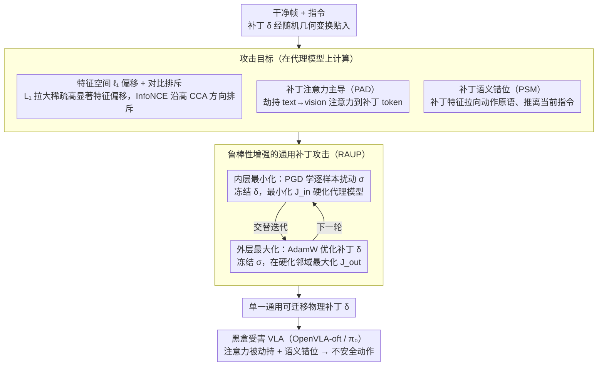

# When Robots Obey the Patch: Universal Transferable Patch Attacks on Vision-Language-Action Models

**会议**: CVPR 2026  
**arXiv**: [2511.21192](https://arxiv.org/abs/2511.21192)  
**代码**: [有](https://github.com/yuyi-sd/UPA-RFAS)  
**领域**: AI安全  
**关键词**: 对抗攻击, VLA模型, 通用对抗补丁, 黑盒迁移攻击, 机器人安全

## 一句话总结

提出 UPA-RFAS 框架，学习一个单一物理对抗补丁，通过特征空间偏移、注意力劫持和语义错位三管齐下，实现对 VLA 机器人策略的通用、可迁移黑盒攻击。

## 研究背景与动机

**VLA 模型的快速发展**：Vision-Language-Action (VLA) 模型将视觉编码器、语言理解和动作头耦合，能够解析自然语言指令并在仿真/真实世界执行多步操作，代表包括 OpenVLA、π₀ 等。

**对抗脆弱性的实际危害**：在机器人场景中，视觉对抗攻击不仅会误导感知，还会级联传播为不安全动作——碰撞、任务约束违反等，后果远比分类错误严重。

**现有攻击的局限**：已有的 VLA 对抗补丁（如 RoboticAttack）假设白盒访问，补丁高度过拟合到单一模型/数据集/prompt 模板，在黑盒设置（未知架构、微调变体）下攻击效果急剧下降。

**通用可迁移攻击的空白**：跨模型族（OpenVLA、OpenVLA-oft、π₀）的通用可迁移补丁攻击几乎未被探索，现有评估因此可能高估安全性。

**跨模态瓶颈的利用**：VLA 模型中视觉-语言的跨模态对齐机制是可被利用的结构性弱点，但缺乏系统性研究。

**安全评估的现实需求**：实际部署中攻击者不会有白盒访问权限，需要在黑盒条件、不同视角、sim-to-real 迁移等现实约束下评估安全基线。

## 方法详解

### 整体框架

UPA-RFAS（Universal Patch Attack via Robust Feature, Attention, and Semantics）是一个统一的两阶段 min-max 优化框架：

- **阶段一（内层最小化）**：固定补丁 δ，学习一个不可见的逐样本扰动 σ（通过 PGD），使其最小化特征空间攻击目标 $\mathcal{J}_{\text{in}}$，相当于在代理模型上模拟对抗训练，"硬化"代理模型。
- **阶段二（外层最大化）**：固定 σ，在硬化后的邻域上用 AdamW 优化单一物理补丁 δ，最大化综合目标 $\mathcal{J}_{\text{out}} = \mathcal{L}_1 + \lambda_{\text{con}}\mathcal{L}_{\text{con}} + \lambda_{\text{PAD}}\mathcal{L}_{\text{PAD}} + \lambda_{\text{PSM}}\mathcal{L}_{\text{PSM}}$。

补丁通过随机几何变换（位置、倾斜、旋转）pasting 到输入帧上，保证位置无关性。

### 关键设计

**1. 特征空间 ℓ₁ 偏移 + 对比排斥（Feature-space Objective）**

- 理论基础：证明代理和目标模型特征空间之间存在近似线性对齐关系 $f_\pi(\mathbf{x}) = f_{\hat{\pi}}(\mathbf{x})A^* + e(\mathbf{x})$，CCA 分析和线性回归探针（$R^2 \approx 0.654$）验证了这一假设。
- $\mathcal{L}_1 = \|\Delta\mathbf{z}_i\|_1$ 最大化代理侧稀疏高显著性特征偏移，由 Proposition 1 保证目标侧偏移的下界。
- $\mathcal{L}_{\text{con}}$ 采用 repulsive InfoNCE loss，将补丁特征推离其干净锚点，沿批次一致的高 CCA 方向集中变化。

**2. 鲁棒性增强的通用补丁攻击（RAUP）**

- 核心思想：对抗训练的模型产生的对抗样本迁移性更强，但直接对抗训练大规模 VLA 模型不现实。
- 替代策略：内层学习逐样本不可见扰动 σ（ℓ∞ 约束下 PGD），模拟对抗训练效果；外层在硬化邻域上优化通用补丁，提取跨输入的稳定攻击方向。

**3. 补丁注意力主导损失（Patch Attention Dominance, PAD）**

- 从干净和补丁运行中提取 LLM 最后 N 层的 text→vision 注意力矩阵，计算补丁引起的注意力份额增量 Δ。
- 通过 TopKMask 选出动作相关文本查询（clean attention 最高的 top-ρ token）。
- PAD 损失三项组成：(i) 增大补丁 token 的注意力增量 $d_{\text{patch}}$；(ii) 惩罚非补丁 token 的正增量 $d_{\text{non}}$；(iii) margin 项强制补丁增量超过最强非补丁增量至少 m。

**4. 补丁语义错位损失（Patch Semantic Misalignment, PSM）**

- 池化补丁覆盖的视觉 token 得到补丁语义描述符 $\hat{\mathbf{v}}_{\text{patch}}$。
- 定义探针短语锚点（"put"、"pick up"、"left"、"right"等通用动作/方向原语）作为跨架构稳定语义锚。
- PSM 损失：LogSumExp 项将补丁特征拉向探针原型，余弦项将补丁特征推离当前指令嵌入，造成持久的上下文相关语义错配。

### 损失函数/训练策略

- **内层目标**：$\mathcal{J}_{\text{in}} = \mathcal{L}_1 + \lambda_{\text{con}}\mathcal{L}_{\text{con}}$（特征空间目标）
- **外层目标**：$\mathcal{J}_{\text{out}} = \mathcal{L}_1 + \lambda_{\text{con}}\mathcal{L}_{\text{con}} + \lambda_{\text{PAD}}\mathcal{L}_{\text{PAD}} + \lambda_{\text{PSM}}\mathcal{L}_{\text{PSM}}$
- 内层用 PGD 更新 σ（ℓ∞ 投影），外层用 AdamW 更新 δ（clamp 到 [0,1]）
- 每轮随机采样几何变换 $T_t \sim \mathcal{T}$（位置、倾斜、旋转），增强位置鲁棒性

## 实验关键数据

### 主实验

**表1：OpenVLA-7B → OpenVLA-oft-w 迁移攻击（LIBERO 基准，成功率 %）**

| 方法 | 仿真 Spatial | 仿真 Object | 仿真 Goal | 仿真 Long | 仿真 Avg | 物理 Avg |
|------|:---:|:---:|:---:|:---:|:---:|:---:|
| Benign | 99 | 99 | 98 | 97 | 98.25 | 98.25 |
| UMA₁ | 25 | 86 | 40 | 31 | 45.50 | 80.25 |
| TMA₁ | 69 | 89 | 58 | 61 | 69.25 | 81.75 |
| TMA₇ | 47 | 78 | 47 | 34 | 51.50 | 91.25 |
| **UPA-RFAS (Ours)** | **7** | **0** | **10** | **6** | **5.75** | **40.25** |

**表2：OpenVLA-7B → OpenVLA-oft 迁移攻击（物理设置，成功率 %）**

| 方法 | Spatial | Object | Goal | Long | Avg |
|------|:---:|:---:|:---:|:---:|:---:|
| **UPA-RFAS (Ours)** | **69** | **74** | **76** | **27** | **61.50** |
| UMA₁ | 96 | 90 | 90 | 83 | 89.75 |
| TMA₁ | 98 | 92 | 84 | 86 | 90.00 |

### 消融实验

| 消融变体 | Spatial | Object | Goal | Long | Avg |
|---------|:---:|:---:|:---:|:---:|:---:|
| 完整 UPA-RFAS | 69 | 74 | 76 | 27 | **61.50** |
| w/o RAUP | 70 | 75 | 71 | 33 | 62.25 |
| w/o PAD | 68 | 67 | 77 | 38 | 62.50 |
| w/o PSM | 69 | 72 | 81 | 32 | 63.50 |
| w/o $\mathcal{J}_{\text{tr}}$ | 90 | 86 | 94 | 73 | 85.75 |
| w/o $\mathcal{L}_{\text{con}}$ | 93 | 63 | 79 | 48 | 70.75 |
| w/o $\mathcal{L}_1$ | 74 | 74 | 77 | 31 | 64.00 |

### 关键发现

1. **压倒性优势**：在仿真 OpenVLA-oft-w 迁移中，UPA-RFAS 将任务成功率从 98.25% 降至 5.75%（降幅 > 92pp），而最强基线仅降至 41.25%。
2. **特征空间目标是核心**：去掉 $\mathcal{J}_{\text{tr}}$ 后成功率从 61.50% 飙升至 85.75%（+24pp），说明特征空间偏移是迁移攻击的关键引擎。
3. **对比损失不可或缺**：去掉 $\mathcal{L}_{\text{con}}$ 后 Spatial 任务成功率从 69% 涨至 93%，表明 InfoNCE 排斥在强制方向一致性上至关重要。
4. **各组件贡献互补**：PAD、PSM、RAUP 各贡献约 1-2pp 改善，但组合后产生显著协同效应。
5. **跨架构迁移有效**：补丁可迁移至完全不同架构的 π₀ 模型（非 OpenVLA 系列），证明攻击的架构无关性。

## 亮点与洞察

- **理论-实验一致**：通过 CCA 分析和线性回归探针验证了跨 VLA 模型特征空间的线性对齐假设（$R^2 \approx 0.654$），为 Proposition 1 提供了实证支撑，使迁移攻击有理论依据。
- **无需对抗训练的鲁棒性模拟**：RAUP 用不可见逐样本扰动巧妙替代了昂贵的 VLA 对抗训练，保留了鲁棒模型产生更可迁移扰动的优势。
- **跨模态攻击的系统性设计**：PAD 劫持注意力 + PSM 错位语义的双管齐下，既控制了模型"看哪里"，又控制了"看到什么"，是对 VLA 跨模态瓶颈的全面利用。
- **实际部署威胁验证**：补丁在 sim-to-real 迁移、不同视角、不同微调配方下均有效，揭示了 VLA 机器人面临的现实安全威胁。

## 局限性

- **领域分类存疑**：论文核心是 VLA 模型的对抗安全而非传统人体理解，分类为 human_understanding 可能不精准。
- **代理模型依赖**：仍需对一个代理模型的白盒访问，并非完全黑盒。
- **评估场景有限**：主要在 LIBERO 仿真和 BridgeData 物理环境上测试，尚未扩展到更多样的真实机器人场景（如移动机器人、多机协作）。
- **防御讨论不足**：论文专注攻击，未深入探讨可能的防御策略（如注意力正则化、对抗补丁检测）。
- **计算开销**：双层优化（内循环 PGD + 外循环 AdamW）在大规模 VLA 模型上的计算成本未充分讨论。

## 相关工作

- **VLA 模型**：OpenVLA（自回归 token 化动作）、π₀/π₀-FAST（扩散策略连续轨迹生成）、OpenVLA-oft（优化微调配方，成功率 76.5%→97.1%）
- **对抗攻击**：RoboticAttack（白盒 VLA 攻击基线，UMA/UADA/TMA 目标）、迁移攻击方法（MI-FGSM、DIM、SSA 等增强梯度信号/输入多样性）
- **特征空间方法**：FIA/NAA（中间特征攻击促进跨模型不变性）、CCA 分析（度量表征相似性）
- **物理对抗补丁**：AdvPatch（物理世界可部署补丁）、注意力引导攻击

## 评分

- 新颖性: ⭐⭐⭐⭐（首个系统研究 VLA 通用可迁移补丁攻击的工作，PAD+PSM 设计具有原创性）
- 实验充分度: ⭐⭐⭐⭐（多模型、多任务、仿真+物理、完整消融，但防御实验缺失）
- 写作质量: ⭐⭐⭐⭐（理论推导清晰，符号系统完整，结构严谨）
- 价值: ⭐⭐⭐⭐（揭示 VLA 机器人面临的实际安全威胁，为后续防御研究建立基线）

<!-- RELATED:START -->

## 相关论文

- [\[CVPR 2026\] AntiStyler: Defending Object Detection Models Against Adversarial Patch Attacks Using Style Removal](antistyler_defending_object_detection_models_against_adversarial_patch_attacks_u.md)
- [\[CVPR 2026\] FlowHijack: A Dynamics-Aware Backdoor Attack on Flow-Matching Vision-Language-Action Models](flowhijack_a_dynamics-aware_backdoor_attack_on_flow-matching_vision-language-act.md)
- [\[CVPR 2026\] Towards Highly Transferable Vision-Language Attack via Semantic-Augmented Dynamic Contrastive Interaction](towards_highly_transferable_vision-language_attack_via_semantic-augmented_dynami.md)
- [\[CVPR 2026\] VCP-Attack: Visual-Contrastive Projection for Transferable Black-Box Targeted Attacks on Large Vision-Language Models](vcp-attack_visual-contrastive_projection_for_transferable_black-box_targeted_att.md)
- [\[CVPR 2026\] Hierarchically Robust Zero-shot Vision-language Models](hierarchically_robust_zero-shot_vision-language_models.md)

<!-- RELATED:END -->
