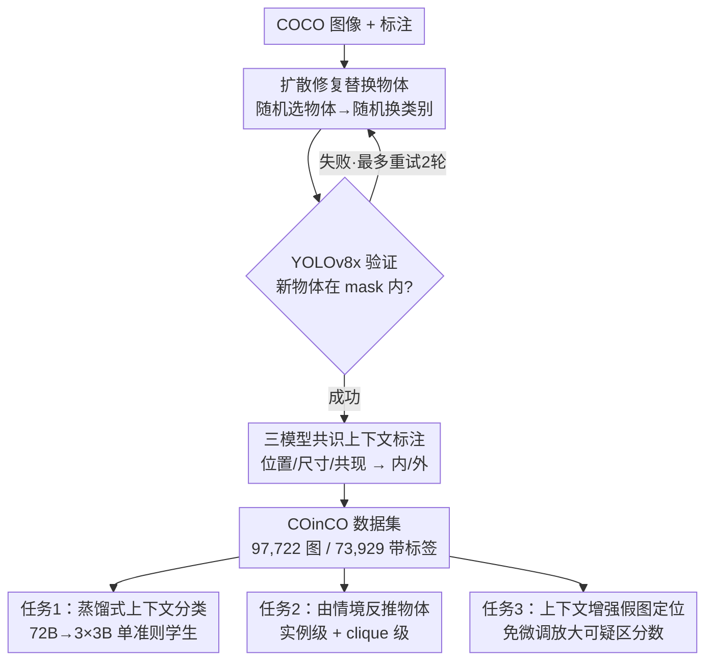

# Common Inpainted Objects In-N-Out of Context

**会议**: CVPR 2026  
**论文**: [CVF Open Access](https://openaccess.thecvf.com/content/CVPR2026/html/Yang_Common_Inpainted_Objects_In-N-Out_of_Context_CVPR_2026_paper.html)  
**代码**: https://co-in-co.github.io/  
**领域**: AIGC检测 / 图像取证 / 上下文推理  
**关键词**: 上下文推理, 扩散修复, 假图检测, 数据集, COCO

## 一句话总结
作者用扩散修复（Stable Diffusion inpainting）系统性地替换 COCO 图像里的物体，造出 9.7 万张「同一物体在情境内 / 情境外」的图，再用 72B 多模态大模型三模型共识标注「位置 / 尺寸 / 共现」三维上下文标签，构建出首个带上下文标注的修复假图数据集 COinCO，并演示了细粒度上下文分类、由情境反推物体、以及无需微调就能增强 SOTA 假图定位三个下游任务。

## 研究背景与动机
**领域现状**：上下文（context）是人类视觉理解的核心——草地上的马很自然，但海滩上和人并排的迷你斑马一眼就「不对劲」。这种「物体到底属不属于这个场景」的判断对识别被篡改 / 伪造的内容是一条互补线索。COCO 系列数据集（COCO-Stuff、LVIS、RefCOCO 等）在物体、场景、文本对齐上不断扩展，但都没有去**操纵物体与场景的上下文关系**。

**现有痛点**：想训练能识别「上下文违例」的模型，最大障碍是**反常场景在真实世界里极其稀少**。常见视觉数据集里的物体几乎都待在它们该待的地方，缺乏「情境外」样本。而现有的扩散修复假图数据集（COCOGlide、TGIF）要么图量极小（COCOGlide 仅 512 张），要么替换物体被限制成**与原物体同类别**——这样上下文根本没变，也就没有情境外物体，更没有上下文标签。

**核心矛盾**：模型需要大量「情境外」样本来学上下文推理，但这种样本天生罕见，无法靠采集获得。

**本文目标**：(1) 造一个**可控生成**、规模够大、既含情境内又含情境外物体、且带细粒度上下文标注的数据集；(2) 证明这个数据集能驱动一批以「上下文」为核心的下游任务。

**切入角度**：与其去野外捞罕见样本，不如**在真实场景里精确替换一个物体**——既保留整体场景结构，又能注入受控的「物体—场景」关系变化。COCO 正好提供 80 个日常类别、可靠的实例 mask 和丰富标注，是做上下文操纵的理想底座。

**核心 idea**：用扩散修复把 COCO 图里随机一个物体换成随机一个类别，再用多模态大模型按「位置 / 尺寸 / 共现」三准则共识打上下文标签，从而**用生成代替采集**，批量造出带标注的情境内 / 情境外样本。

## 方法详解

### 整体框架
COinCO 的核心是一条「构建数据集 + 三个下游任务」的流水线。构建侧：从 COCO 图像出发，每张图随机选一个物体，用 Stable Diffusion 把它替换成随机一个 COCO 类别（修复），再用目标检测器验证「新物体确实被画进 mask 区域」，最后让三个 72B 级多模态大模型按位置 / 尺寸 / 共现三准则独立判定并取共识，给每个修复物体打上「情境内 / 情境外」标签和逐准则推理文本。任务侧：用这批数据演示三件事——把 72B 教师蒸馏成可部署的 3B 上下文分类器、训练「由情境反推该出现什么物体」的模型、以及把上下文信号免微调地注入 SOTA 假图定位器。

### 关键设计

**1. 扩散修复造可控情境外样本：选物体 → 膨胀 mask → 随机换类别**

痛点是情境外样本采集不到，作者就用 Stable Diffusion 在真实场景里「精准换一个物体」来人工制造。每张 COCO 图随机选一个标注物体，把它的实例 mask 略微膨胀后用 bounding box 包成修复区域——膨胀和外扩框是为了**消除原物体的残留痕迹**，否则新物体会和旧轮廓打架。替换文本提示从 COCO 80 类里随机抽一个，这样新物体类别和原物体常常不同，自然制造出尺寸 / 位置 / 共现上的违例。针对香草修复管线常画不好小物体的问题，作者先在放大的修复区域附近裁剪、修复后再缩放回原尺寸，并用 alpha 混合把修复块无缝贴回原图。作者还观察到一个反直觉现象：Flux、Qwen-Image 这类更强的修复模型反而更偏向「画得逼真、画成情境内物体」，牺牲了生成情境外物体的能力，对修复区域的空间控制也更差——所以追求逼真度的更强模型在这里并不更好用。

**2. 目标检测把关「修复成功」+ 三轮重试**

修复经常会失败（物体没画进去、或画得乱七八糟），需要自动筛掉。作者把这一步交给目标检测器：如果检测器在修复 mask 区域内检到了目标类别物体，就判定修复成功。选哪个检测器是个权衡——GroundingDINO 精度最高（96.14%）但召回只有 38.66%，会误杀太多其实成功的样本；YOLOv8x 以 F1 78.75%（精度 93.78% / 召回 67.86%）取得最佳平衡，最终被选作把关器。失败样本最多再补两轮修复 + 验证，三轮全失败的丢弃，最终得到 97,722 张成功图。作者还指出误检往往对应「物体在但画质差」的低质量修复，而非彻底失败。

**3. 三模型共识 + 三准则上下文标注：位置 / 尺寸 / 共现**

打「情境内 / 外」标签如果只信一个大模型不够可靠，作者用**多模型共识**。三个 SOTA 多模态大模型（Molmo-72B、Qwen2.5-VL-72B、InternVL3.5-38B）各自按结构化 prompt 对每张修复图独立做三准则推理：① 位置——物体的空间摆放对场景布局是否合理；② 尺寸——物体尺度是否符合场景几何；③ 共现——它和场景里已有物体同时出现是否说得通。**只要违反任一准则就判为情境外**，三准则都满足才算情境内。每个模型先给逐准则分析、再给二元终判，**只保留三模型终判完全一致**的图作为带标签数据，得到 73,929 张（其中 64,879 情境外、9,050 情境内），并同时释放三模型的逐准则推理文本。人工抽检 1,000 张显示共识标签与人类一致率达 95.10%，其中 Qwen2.5-VL-72B 在准则分歧样本上准确率最高（87.80%）、推理质量被偏好 94.70%，因此被采纳为主标注，另两个模型用于多模型交叉校验。

**4. 单准则蒸馏：72B 教师 → 3 个 3B 学生（位置 / 尺寸 / 共现各一个）**

72B 教师虽然分类好，但太大、推理太慢，无法实际部署。作者用知识蒸馏把它压成可用尺寸，且**按准则拆成三个独立的 Qwen2.5-VL-3B 学生模型**——一个管位置、一个管尺寸、一个管共现。模型体积缩小 24×，每个学生不仅学终判（内 / 外），还学**该准则对应的推理过程**，从而保留可解释的自然语言解释。这种「把复杂上下文理解拆成聚焦的单准则推理」的模块化设计，让每个准则可以单独优化。训练用 73,929 张共识图里平衡采样的 24,000 张（情境内:外 = 1:1，20k 训 / 2k 验 / 2k 测），以 Qwen2.5-VL-72B 的推理回答作 ground truth。

**5. 由情境反推物体（Objects-from-Context）：VAE latent + MLP，实例级 + clique 级**

这是一个新任务，反向问「**什么物体适合这个情境**」，用来检验模型对真实图像的上下文理解。模型吃两个输入：修复后的图像 + 标记目标区域的二值 mask，用 Stable Diffusion 的 VAE 编码器抽两者的 latent，再用一个 MLP 在 COCO 80 类上预测。训练时用原物体膨胀 bounding box 当 mask、原物体类别当标签。预测分两层：**实例级**直接预测 80 类中的具体类别；**clique 级**把预测类别映射到 COCO 超类（动物、家电、电子、食物、家具、运动、交通工具等 12 个）再比对。模型支持任意 mask 尺寸 / 位置，可用于「反推被篡改前是什么物体」（取证）、「按位置推荐合适物体」（智能编辑）等应用。

**6. 上下文增强假图定位：在情境外区域放大分数，免微调**

最后把上下文当作假图定位的互补信号，且不动原模型。做法很简单：对每个像素，若它落在被判为情境外物体的 mask 区域 $M_{OC}$ 内，就把原假图定位器输出的伪造分数 $P(x,y)$ 乘以一个增强因子 $\gamma$ 并截断到 1，否则保持原分数：

$$P'(x, y) = \begin{cases} \min(P(x, y) \times \gamma,\ 1.0), & (x, y) \in M_{OC} \\ P(x, y), & \text{otherwise} \end{cases}$$

实验中 $\gamma = 5$。两种设定：oracle 用 ground-truth 情境外 mask（性能上界）；practical 设定里假物体未知，用 Molmo-7B 只按尺寸和位置找可疑物体（**刻意排除共现准则以防误报**，比如图里只有一个苹果和一个被插入的红绿灯时，共现会两个都怀疑），多个可疑物体的 mask 取并集作 $M_{OC}$。这个方法之所以稳健：即便大模型误把真实物体当成情境外，增强也只是**强化基模型本就给出的预测**，不会凭空造假——因为上下文检测和假图定位本质互补。

## 实验关键数据

### 主实验

单准则蒸馏后的上下文推理准确率（%），在 COinCO 测试集和未经修改的原始 COCO 图上都做了验证——后者用于证明模型学到的是真正的语义 / 上下文，而非修复伪影：

| 准则 | COinCO 蒸馏前 | COinCO 蒸馏后 | Δ | 原始COCO 前 | 原始COCO 后 | Δ |
|------|--------------|--------------|------|------------|------------|------|
| 尺寸 Size | 55.4 | 65.9 | +10.5 | 52.6 | 83.2 | +30.6 |
| 位置 Location | 67.6 | 75.4 | +7.8 | 47.6 | 91.4 | +43.8 |
| 共现 Co-occurrence | 75.5 | 79.9 | +4.4 | 89.0 | 87.0 | −2.0 |
| 平均 | 66.2 | 73.7 | +7.6 | 63.1 | 87.2 | +24.1 |

由情境反推物体任务（在 2,402 张 COCO2017 验证集修复图上评测），显著超过随机和共现频率基线：

| 方法 | 实例 Top-1 | 实例 Top-3 | 实例 Top-5 | clique Top-1 | clique Top-3 | clique Top-5 |
|------|-----------|-----------|-----------|-------------|-------------|-------------|
| Random | 1.25 | 3.75 | 6.25 | 8.33 | 25.00 | 41.67 |
| Co-occurrence [40] | 1.54 | 4.70 | 7.29 | 9.37 | 30.72 | 52.91 |
| Ours | **16.32** | **31.89** | **42.80** | **35.10** | **61.41** | **78.31** |

SOTA 假图定位器在 COinCO 上的表现（伪定位 GT 为原物体整个 bounding box）：

| 方法 | Acc | F1 | AUC | AP |
|------|-----|-----|-----|-----|
| ManTraNet [60] | 85.4 | 30.7 | 84.9 | 50.7 |
| Trufor [20] | 89.7 | 55.9 | 93.4 | 73.6 |
| PSCC-Net [39] | 89.5 | 46.8 | 95.4 | 79.5 |
| CAT-Net [32] | **92.7** | **76.5** | **97.4** | **90.3** |

### 关键发现
- **蒸馏后在原始 COCO 上提升远大于在 COinCO 测试集上**：位置 +43.8、尺寸 +30.6（平均 +37.2），说明 3B 学生学到的是**可迁移到真实图的通用上下文原则**，而非记住数据集特有的修复伪影。共现准则蒸馏前在原始 COCO 上就有 89.0%，蒸馏后微降到 87.0%——它本来就已经学好了自然共现关系，不需要再调。
- 假图定位上 Acc 和 AUC 普遍 >84% 但有偏差：因为修复区域平均很小、大部分像素是真实的，这两个指标天然偏高；**F1 和 AP 更能反映真实定位精度**，模型间差距在这两个指标上才显现（CAT-Net F1 76.5 vs ManTraNet 30.7）。
- 上下文增强对所有 SOTA 定位器都有提升且**完全免微调**，oracle 设定给出性能上界，practical 设定用 Molmo-7B 只看尺寸 / 位置也能稳定见效。

## 亮点与洞察
- **「用生成造稀缺样本」的范式很干净**：情境外样本采不到，就用扩散修复在真实场景里精准换一个物体，既保住场景结构又注入受控违例——这套「可控操纵真实数据」的思路可迁移到任何「反常 / 长尾样本稀缺」的任务。
- **多模型共识 + 逐准则推理标注**比单模型打标更可靠（95.10% 对齐人类），而且释放的不只是二元标签，还有三模型的**逐准则解释文本**，这正是后续蒸馏出可解释学生模型的燃料。
- **把上下文理解按准则拆开蒸馏**很巧妙：位置 / 尺寸 / 共现各训一个 3B 学生，既缩小 24× 又保住可解释性，还能按准则单独迭代——复杂语义推理被分解成聚焦子任务。
- **上下文增强假图定位的「只增不减」性质**：因为上下文与定位互补，即便大模型误判真实物体为情境外，乘 γ 也只强化基模型已有预测，不会凭空制造假阳——这让一个极简的后处理变得鲁棒。
- practical 设定里**刻意丢掉共现准则**防误报，是个朴素但实用的工程判断：物体少时共现会把正常物体也判成情境外。

## 局限与展望
- **受限于 COCO 80 类闭集**：替换物体和上下文准则都建立在 COCO 预定义类别上，开放词表 / 罕见物体场景下上下文期望本就更模糊，作者也把开放词表上下文推理列为未来工作。
- **情境内 / 外标签严重不均衡**：73,929 张里 64,879 情境外、仅 9,050 情境内（随机换类别天然更容易造出违例），虽然蒸馏时做了 1:1 平衡采样，但「情境内」样本的多样性可能受限。
- **依赖更弱的修复模型**：作者发现更强的 Flux/Qwen-Image 反而更难生成情境外物体、空间控制更差，所以数据集质量某种程度上绑定在特定 Stable Diffusion 修复行为上，修复伪影的分布也会随模型而变。
- **伪定位 GT 用整个原物体 bounding box**：这会把框内的真实背景像素也算进伪造区域，可能高估 / 低估细粒度定位精度。
- 上下文增强是后处理 trick，γ 是手调超参（设 5），不同检测器 / 场景的最优值未必一致。

## 相关工作与启发
- **vs COCOGlide [20] / TGIF [41]**：同样在 COCO 上做扩散修复，但它们图量小（COCOGlide 仅 512 张）、替换物体被限制成与原物体同类别（上下文不变、没有情境外物体）、且无上下文标签；COinCO 有 97,722 张、跨类别替换、带三准则上下文标注。
- **vs COCO 系扩展（COCO-Stuff / LVIS / RefCOCO 等）**：这些只扩展标注 / 类别 / 文本对齐，**不操纵上下文关系**；COinCO 首个在大规模数据里混入情境内 + 情境外物体。
- **vs 传统上下文推理（Biederman 的 support/probability/size 原则、Graph Contextual Reasoning Network [1]）**：前人用共现 / 支撑关系或图网络做情境外检测，COinCO 首次用多模态大模型做上下文推理，并首次把它用于基于上下文的假图检测。
- **vs SOTA 假图定位器（PSCC-Net / CAT-Net / ManTra-Net / TruFor）**：它们各用空间-通道相关、JPEG 伪影、篡改痕迹、RGB+噪声指纹做定位；COinCO 不替换它们，而是用上下文信号在情境外区域**免微调地增强**它们的预测。

## 评分
- 新颖性: ⭐⭐⭐⭐⭐ 首个带细粒度上下文标注的修复假图数据集，「用生成造稀缺情境外样本」+「多模型共识三准则标注」组合很扎实
- 实验充分度: ⭐⭐⭐⭐ 三个下游任务都有量化结果 + 人工 1,000 张验证 + 原始 COCO 迁移验证，但 γ、修复模型选择等分析放在补充材料
- 写作质量: ⭐⭐⭐⭐ 流水线清晰、动机讲得透，图文对照好读
- 价值: ⭐⭐⭐⭐⭐ 数据集 + 三任务 + 可解释蒸馏模型可直接被图像取证 / 上下文推理社区复用，且代码与数据公开

<!-- RELATED:START -->

## 相关论文

- [\[ACL 2026\] Frame In, Frame Out: Measuring Framing Bias in LLM-Generated News Summaries](../../ACL2026/aigc_detection/frame_in_frame_out_measuring_framing_bias_in_llm-generated_news_summaries.md)
- [\[CVPR 2026\] Enabling Supervised Learning of Generative Signatures for Generalized AI-Generated Images Detection](enabling_supervised_learning_of_generative_signatures_for_generalized_ai-generat.md)
- [\[CVPR 2026\] PPM-CLIP: Probabilistic Prompt Modeling for Generalizable AI-Generated Image Detection](ppm-clip_probabilistic_prompt_modeling_for_generalizable_ai-generated_image_dete.md)
- [\[CVPR 2026\] Learning Forgery-Aware Lip Representations Without Forgery Priors](learning_forgery-aware_lip_representations_without_forgery_priors.md)
- [\[CVPR 2026\] Inconsistency-aware Multimodal Schrodinger Bridge for Deepfake Localization](inconsistency-aware_multimodal_schrodinger_bridge_for_deepfake_localization.md)

<!-- RELATED:END -->
