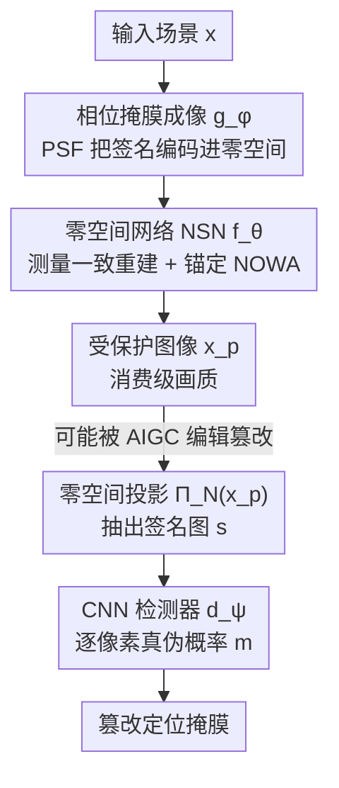

# NOWA: Null-space Optical Watermark for Invisible Capture Fingerprinting and Tamper Localization

**会议**: CVPR 2026  
**论文**: [CVF Open Access](https://openaccess.thecvf.com/content/CVPR2026/html/Vargas_NOWA_Null-space_Optical_Watermark_for_Invisible_Capture_Fingerprinting_and_Tamper_CVPR_2026_paper.html)  
**代码**: 无  
**领域**: AIGC 检测 / 图像取证 / 篡改定位 / 光学水印 / 计算摄影  
**关键词**: 光学水印, 零空间, 篡改定位, 相位掩膜, 端到端联合优化

## 一句话总结
在相机光圈处插入一块可学习的相位掩膜，把认证信号编码进成像算子的**零空间**（拍摄时完全不可见），再用一个保证测量一致性的零空间网络（NSN）重建高质量图像并锚定该水印；篡改会破坏零空间投影里的统计结构，从而在像素级被检测器定位，在 AIGC 编辑下 F1 超过 EditGuard（0.993 vs 0.97）且对未知伪造者天然不可伪造。

## 研究背景与动机
**领域现状**：图像真实性/版权保护目前主流靠**数字水印**——HiDDeN 这类编码器-解码器在图像里嵌入不可见码，后续靠解码验证；近年 EditGuard、OmniGuard 等还把版权验证和篡改定位统一进"双不可见水印"，对 AIGC 编辑有较强鲁棒性。另一条线是**光学水印**，在成像那一刻就把认证线索写进硬件（结构光、相位编码等）。

**现有痛点**：数字水印几乎都在**拍摄之后**加，天然暴露于编辑/压缩/重新生成的攻击面，容易被去除或覆盖；而已有光学水印大多为"版权追溯"服务，设计目标是**鲁棒**（经得起打印、扫描、压缩），这恰恰和安全任务相反——安全任务要的是对**任何微小篡改都敏感**的"脆弱水印"。脆弱光学水印几乎没人做，少数用编码光圈的尝试图像质量很差，而且只能给出"真/假"二值判断，无法定位篡改在哪。

**核心矛盾**：鲁棒水印 vs 脆弱水印的目标天生对立；要在光学域做脆弱水印，又卡在两个物理难题上——① 光学编码后的原始图像本身是糊的，没法直接看也没法常规处理；② 一旦攻击者拿到原始传感器数据，就有机会反推/伪造光学签名。

**本文目标**：造一个**混合光学-数字**的端到端系统，既在成像瞬间嵌入物理认证线索，又能输出消费级画质的图像，还能像素级定位篡改、并对伪造者天然免疫。

**切入角度**：作者抓住一个数学事实——由相位掩膜定义的成像算子 $A_\phi$ 是病态的，它有一个**零空间** $N(A_\phi)$：落在这里面的信号"数学上存在、但物理上传感器测不到"。这正是一个理想的隐藏信道。

**核心 idea**：把水印**编码进成像算子的零空间**（拍摄时被算子湮灭、完全不可见），再用零空间网络在重建时把它"锚回"图像；验证时只要把图像投影回零空间，篡改就会暴露成异常残差。由于零空间由真实物理掩膜决定，没有掩膜就无法生成合法签名——天然不可伪造。

## 方法详解

### 整体框架
整套系统是一条**可微的端到端流水线**，把光学前端和数字后端拼成一个能联合训练的整体。一束光经过普通镜头 + 自定义相位掩膜（PM）后打到传感器，得到带特定 PSF 调制的编码测量 $y$；这步用傅里叶光学完整仿真，所以掩膜参数 $\phi$ 和后端网络可以一起被梯度优化。编码图是糊的、不能直接用，于是零空间网络 $f_\theta$ 做**测量一致**的重建，输出消费级画质的受保护图像 $x_p$，同时把零空间水印 NOWA 锚在里面。验证时把 $x_p$ 投影回零空间 $N(A_\phi)$ 得到签名图 $s$，再交给一个 CNN 检测器 $d_\psi$ 输出逐像素真实性概率，从而定位篡改。整条链路用一个总损失联合训练：

$$x_p = f_\theta(g_\phi(x))$$

其中 $g_\phi(\cdot)$ 是相位掩膜参数化的光学成像，$f_\theta(\cdot)$ 是 NSN 重建。

### 关键设计

**1. 零空间光学水印 NOWA：把签名藏进"传感器测不到"的子空间**

数字水印的死穴是它写在图像可见域里，任何重新生成/编辑都可能覆盖它。作者换了个信道：成像过程建模成 $y = A_\phi x + n$，由于衍射和采样极限，$A_\phi$ 病态，存在零空间 $N(A_\phi) = \{z \mid A_\phi z = 0\}$——这部分信号对传感器完全不可见，但数学上完全确定。NOWA 就把认证信号编码在这里：它的能量被 $A_\phi$ 湮灭（所以拍出来看不见），却能通过投影算子 $\Pi_N$ 精确恢复。这带来一个天然的**安全非对称性**：零空间由真实相位掩膜 $\phi$ 决定，任何不掌握 $A_\phi$ 的攻击者都无法生成与之一致的签名。和数字水印相比，NOWA 是在数字生命周期**之前**、成像那一刻就物理写入的，无法被后续编辑去除或精确复刻。

**2. 零空间网络 NSN：在重建时把水印锚回去，否则它会被当噪声删掉**

光学编码图是糊的、不能直接给用户看，而任何常规重建算法都会把 NOWA 当噪声去掉——这正是脆弱光学水印过去做不出高画质的原因。NSN 用一种结构化重建解决：先用正则化逆（伪逆/Tikhonov/Wiener 反卷积）得到可测分量的估计 $\hat{x}_r = r(y) \in N(A_\phi)^\perp$，再让网络只在零空间里补回不可测分量：

$$x_p = f_\theta(\hat{x}_r) = \hat{x}_r + \Pi_N\, U_\theta(\hat{x}_r),\quad \Pi_N = I - A_\phi^\dagger A_\phi$$

这里 $\Pi_N$ 是到零空间的正交投影。这个结构强制了**严格测量一致性** $A_\phi f_\theta(\hat{x}_r) = A_\phi \hat{x}_r = y$：网络只能动零空间分量，可测分量原封不动。于是 $U_\theta$ 既能学到逆光学映射、重建出高画质图像，又把 NOWA 稳稳锚进零空间——画质和水印第一次能兼得。

**3. 零空间投影做篡改定位：让检测器只看"物理不变量"，过滤掉自然图像的干扰**

直接拿 $x_p$ 喂检测器会被自然图像的纹理变化淹没，篡改线索很弱。作者把验证整个搬进零空间域：对受保护图投影

$$s = \Pi_N(x_p) = \Pi_N\, U_\theta(\hat{x}_r)$$

利用 $\Pi_N(\hat{x}_r)=0$（$\hat{x}_r$ 在零空间正交补里）和 $\Pi_N^2 = \Pi_N$，这一步干净地隔离出"受光学模型约束、但测量上不可见"的学习分量，也就是这套光学的内在签名。真图的 $s$ 有稳定、可预测的空间模式；篡改区域会破坏这个结构、产生异常零空间响应。再用一个 CNN 检测器把 $s$ 映射成逐像素真实性概率 $m = d_\psi(s)$，$m_i \in [0,1]$ 表示像素 $i$ 属于真实区域的置信度。关键在于：检测器要分辨的是"系统可预测噪声 vs 违反物理成像约束的对抗误差"，而不是去判断图像内容像不像真的——这让它对未知编辑方式天然泛化（消融显示用图像域直接判 F1 只有约 0.75，换成零空间投影逼近满分）。

### 损失函数 / 训练策略
光学前端 $g_\phi$、零空间网络 $f_\theta$、检测器 $d_\psi$ 三者**端到端联合优化**，让光学和神经模块协同适配。相位掩膜的高度面用截断 Zernike 多项式参数化 $h_\phi(x,y) = \sum_{k=1}^K \phi_k Z_k(x,y)$，把优化约束在物理可制造、可微的曲面上。总目标：

$$L_{\text{total}} = L_{\text{rec}} + \beta L_{\text{perc}} + \lambda L_{\text{cls}}$$

- 重建保真 $L_{\text{rec}} = \|x - x_p\|_2^2$；
- 感知一致 $L_{\text{perc}} = \sum_i \|\varphi_i(x) - \varphi_i(x_p)\|_2^2$（预训练网络特征空间）；
- 逐像素真伪分类 $L_{\text{cls}} = -[c\log m + (1-c)\log(1-m)]$，$c\in\{0,1\}^n$ 是真值掩膜。

这套联合训练同时逼着系统：① 重建出与光学前向模型一致的图像、② 编码出独属本相机相位掩膜的可验证零空间签名、③ 检出违反物理约束的数字篡改。由于物理掩膜 $\phi$ 和神经模块共同优化，系统继承了一种"数字生命周期之前"的内在不可伪造性：即便 NSN 被攻破，缺了真实光学路径也产不出合法 NOWA。

## 实验关键数据

**实验设置**：训练用 FFHQ 高分辨率人脸；篡改用 BiSeNetV2 解析人脸 + Stable Diffusion Inpainting 做真实编辑；评测在 EditGuard 测试集（COCO 2017 采样 1000 张），即**跨域评测**（FFHQ 训、COCO 测）。相位掩膜 2.835 mm × 2.835 mm / 256×256，AdamW（lr 1e-4），单张 H100。

### 主实验：AIGC 编辑下的篡改定位（F1 / AUC / IoU，越高越好）

| 编辑方式 | 指标 | EditGuard | NOWA |
|----------|------|-----------|------|
| Stable Diffusion | F1 / AUC / IoU | 0.966 / 0.971 / 0.936 | **0.993 / 0.999 / 0.987** |
| ControlNet | F1 / AUC / IoU | 0.968 / 0.987 / 0.940 | **0.992 / 0.999 / 0.985** |
| SDXL | F1 / AUC / IoU | **0.965** / 0.989 / **0.936** | 0.929 / **0.997** / 0.867 |
| RePaint | F1 / AUC / IoU | 0.967 / 0.977 / 0.938 | **0.974 / 0.999 / 0.949** |
| Lama | F1 / AUC / IoU | 0.965 / 0.969 / 0.934 | 0.965 / **0.999** / 0.933 |

纯数字检测器（MVSS-Net / OSN / PSCC-Net / IML-ViT）在生成式编辑下 F1 普遍 < 0.2，连内容保持型篡改都扛不住；HiFi-Net 稍好（F1 0.48~0.68）但 IoU 很不稳。NOWA 在多数编辑上反超已经很强的 EditGuard，且 AUC 几乎都到 0.999。

### 消融实验

| 配置 | 关键指标 | 说明 |
|------|----------|------|
| 完整模型（检测器吃零空间投影 $\Pi_N(x_p)$） | F1≈0.99 | 标准设置 |
| 检测器直接吃图像 $x_p$ | F1≈0.75 / AUC≈0.82 / IoU≈0.69 | 篡改在图像域线索弱、误报散乱 |
| 去掉学习相位掩膜（仍有零空间） | F1=0.89 / IoU=0.81 | 签名结构性差、检测难分辨自然变化 |

抗退化（F1↑）：Gaussian σ=1/5 下 NOWA 0.984/0.982，JPEG Q=70/80/90 下 0.885/0.893/0.890，全面高于 EditGuard（JPEG Q=70 仅 0.552），而 HiFi-Net 大幅退化。

抗对抗（1000 张伪造图 F1）：相机模仿 0.901、受保护图模仿 0.913、盲反卷积 0.946——即便 NSN 暴露给攻击者，缺真实光学系统也产不出合法 NOWA。

### 关键发现
- **零空间投影是性能命门**：把检测输入从图像换成零空间投影，F1 从 ~0.75 跳到 ~0.99——$\Pi_N$ 压住自然图像变化、暴露不变水印，这是"物理域取证 vs 内容域取证"的本质差别。
- **掩膜要"学"出来才稳**：即使没有掩膜、光学系统也有零空间能塞 NOWA，但签名结构性差、F1 掉到 0.89；可学习相位掩膜让签名强、稳、可判别。
- **物理嵌入带来跨域与抗退化优势**：FFHQ 训、COCO 测仍近满分，且压缩/噪声下基本不掉，说明水印挂在光学层而非内容层。
- **真机验证可行**：把仿真前向模型迁到 Canon EOS 5D Mark IV + 50mm 镜头 + 双光子光刻熔石英相位掩膜的真实原型，微调 30 epoch 后能定位 Photoshop 生成式填充的真实篡改。

## 亮点与洞察
- **把"病态成像算子的零空间"当成安全信道**：这是最漂亮的一步——零空间的能量被算子湮灭（拍摄不可见）却数学可恢复，天生满足"隐蔽 + 可验证"，比往图像可见域硬塞水印优雅得多。
- **测量一致性 = 内在不可伪造性**：NSN 的结构强制 $A_\phi f_\theta(\hat{x}_r)=y$，使得合法签名必须经过真实光学路径才能产生；安全性不靠保密算法而靠**物理硬件**，即便整条数字管线泄露也伪造不出来。
- **取证从"看内容像不像真"转向"看物理约束有没有被违反"**：检测器只判零空间残差是否符合相机物理模型，因而对未见过的编辑方式天然泛化——这套"物理不变量取证"的思路可迁移到视频、其他成像模态的真实性验证。
- **光学-算法协同设计的端到端可微范式**：用傅里叶光学 + Zernike 参数化把硬件设计纳入梯度优化，是计算摄影范式在"认证"这个新目标上的延伸。

## 局限与展望
- **作者承认**：相位掩膜孔径小且固定，限制了进光量；更大孔径下 PSF 的深度相关行为需纳入零空间计算；真机里光学未对准/标定误差会破坏零空间估计与测量一致性。
- **攻击模型有边界**：只假设攻击者能拿到受保护图 $x_p$ 或相机原始测量 $y$；若攻击者能拿到大规模配对 $(x_p, y)$ 数据近似成像算子，当前防护未必扛得住，作者把"随机化/基于密钥的数字嵌入"列为未来工作。
- **自己发现的局限**：主要在人脸（FFHQ）域训练、篡改也偏人脸/物体级 inpainting，对极小区域或全局风格化篡改的敏感性、以及不同相机/镜头间的可迁移性，论文未充分覆盖；需要专门制造相位掩膜硬件也提高了落地门槛。

## 相关工作与启发
- **vs 数字水印（HiDDeN / EditGuard / OmniGuard）**：它们在拍摄后往图像可见域嵌码，暴露于编辑/压缩攻击面；NOWA 在成像瞬间把水印写进物理零空间，无法被后续编辑去除，且安全性来自硬件而非算法保密。指标上 NOWA 多数编辑反超 EditGuard，JPEG 鲁棒性差距尤其大。
- **vs 纯数字篡改检测（MVSS-Net / OSN / PSCC-Net / IML-ViT / HiFi-Net）**：它们靠纹理/语义不一致找伪造，对内容保持型 AIGC 编辑几乎失效（F1<0.2~0.68）；NOWA 不看内容、只看是否违反光学物理约束，泛化和稳定性更好。
- **vs 已有光学水印 / 编码光圈（结构光、彩色编码光圈等）**：前者多为鲁棒版权追溯、硬件复杂或画质差、且只能二值判真假；NOWA 用标准成像器件 + 单块相位掩膜做**脆弱**水印，画质可用且能像素级定位篡改。

## 评分
- 新颖性: ⭐⭐⭐⭐⭐ 把成像算子零空间当安全信道、用测量一致性换来物理级不可伪造，是认证范式上的真创新
- 实验充分度: ⭐⭐⭐⭐ 五种 AIGC 编辑 + 退化/对抗/跨域评测齐全，还做了真机原型；但主要限于人脸域、缺更多场景与硬件可迁移性验证
- 写作质量: ⭐⭐⭐⭐ 物理建模与动机讲得清楚，零空间机制推导完整
- 价值: ⭐⭐⭐⭐ 在 AIGC 伪造泛滥背景下提供了一条硬件级真实性保证路线，对相机厂商/取证有现实意义，但需专用光学掩膜限制了普适落地

<!-- RELATED:START -->

## 相关论文

- [\[CVPR 2026\] Inconsistency-aware Multimodal Schrodinger Bridge for Deepfake Localization](inconsistency-aware_multimodal_schrodinger_bridge_for_deepfake_localization.md)
- [\[ACL 2026\] GigaCheck: Detecting LLM-generated Content via Object-Centric Span Localization](../../ACL2026/aigc_detection/gigacheck_detecting_llm-generated_content_via_object-centric_span_localization.md)
- [\[CVPR 2026\] Enabling Supervised Learning of Generative Signatures for Generalized AI-Generated Images Detection](enabling_supervised_learning_of_generative_signatures_for_generalized_ai-generat.md)
- [\[CVPR 2026\] Investigating Self-Supervised Representations for Audio-Visual Deepfake Detection](investigating_self-supervised_representations_for_audio-visual_deepfake_detectio.md)
- [\[CVPR 2026\] Learning Forgery-Aware Lip Representations Without Forgery Priors](learning_forgery-aware_lip_representations_without_forgery_priors.md)

<!-- RELATED:END -->
