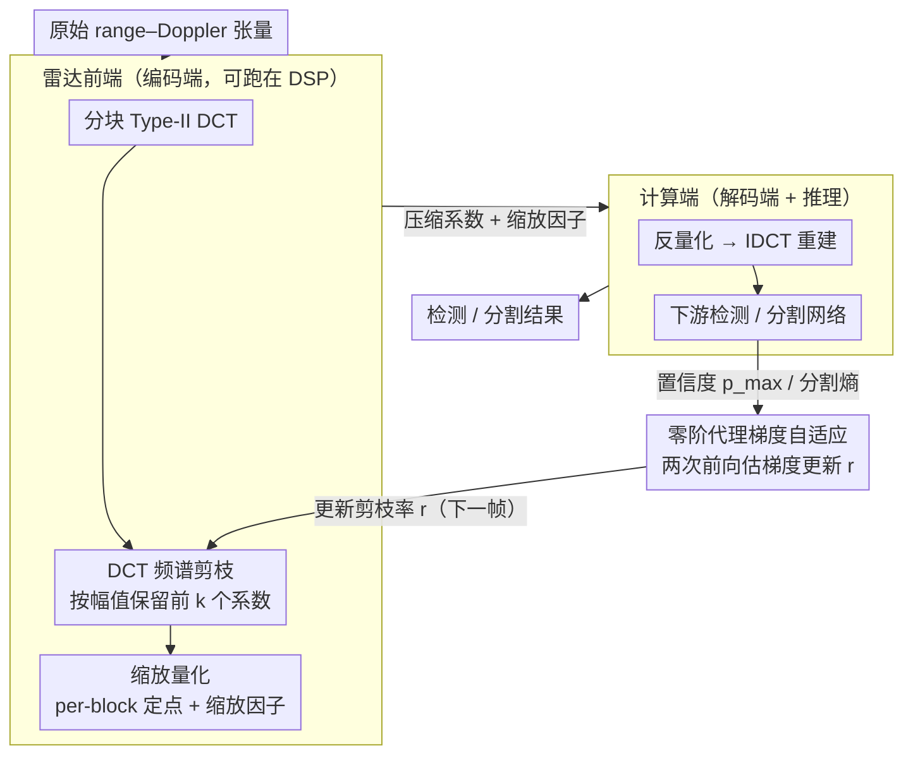

# AdaRadar: Rate Adaptive Spectral Compression for Radar-based Perception

**会议**: CVPR2026  
**arXiv**: [2603.17979](https://arxiv.org/abs/2603.17979)  
**代码**: [项目主页](https://jp4327.github.io/adaradar/)  
**领域**: 自动驾驶  
**关键词**: 雷达感知, 自适应压缩, 频谱剪枝, 零阶梯度, 码率控制, 量化, DCT, 目标检测, 语义分割

## 一句话总结

提出 AdaRadar——基于 DCT 频谱剪枝与零阶代理梯度的在线自适应雷达数据压缩框架，在 100× 以上压缩率下仅损失 ~1%p 检测/分割性能，有效缓解雷达传感器到计算端的带宽瓶颈。

## 研究背景与动机

**雷达在自动驾驶中的核心地位**：相比相机和 LiDAR，毫米波雷达具有全天候、全光照的鲁棒性，可直接测量距离和多普勒速度，是感知系统不可或缺的模态。

**原始雷达数据量爆炸**：现代 MIMO 雷达数据量随 Tx/Rx 天线数二次增长。例如 16×12 级联 MIMO 配置下单帧约 100 MB，10 fps 吞吐量达数 Gbps，远超 CAN 总线等低带宽链路的传输能力。

**缺乏专用雷达编解码器**：视觉领域有成熟的 JPEG/学习压缩方案，但雷达领域尚无通用 codec。现有做法多用 CFAR 压缩为稀疏点云，不可避免地丢失丰富的张量级信息。

**已有方法无法自适应**：RadarOcc 等基于能量的 index-value 压缩方案以固定压缩率工作，无法在测试时根据场景动态调整——低复杂场景浪费带宽，高复杂场景则性能退化。

**传统反向传播在此场景不可行**：剪枝和量化操作不可微；即使能估计梯度，其张量大小与原始雷达数据相当，传输梯度本身就会抵消压缩收益。

**自编码器方案部署受限**：学习类压缩模型参数量往往比下游检测/分割模型还大，无法部署在计算和存储资源极其有限的雷达前端 DSP 上。

## 方法详解

### 整体框架

AdaRadar 把雷达前端（编码端）和计算端（解码端 + 推理网络）连成一个反馈环路，让压缩率能随场景在线调整。一帧原始 range–Doppler 张量在前端先做 DCT、自适应频谱剪枝、缩放量化，只把压缩后的系数和缩放因子传过去；计算端反量化、IDCT 重建后送进下游检测/分割网络拿到结果。关键在于这条环路会把检测置信度（或分割熵）当反馈信号，用零阶代理梯度更新下一帧的剪枝率，从而做到在线码率自适应——简单场景多压、复杂场景少压。

### 关键设计

**1. DCT 频谱剪枝：按幅值自适应保留，贴合雷达频谱的稀疏性**

雷达领域没有像 JPEG 那样的通用 codec，而 CFAR 点云又会丢掉张量级信息。AdaRadar 把实部/虚部拼接后的雷达特征图切成 $M \times M$ 块、对每块做 Type-II DCT，利用一个关键观察：雷达 DCT 系数的能量高度集中在少数频率分量上（如 RADIal 的高频区），天然稀疏。给定剪枝率 $r$，每块只保留幅值最大的 $k = \lfloor M^2 / r \rfloor$ 个系数、其余置零。和 JPEG 用固定量化表统一衰减高频不同，这里是按幅值排序自适应保留，更能适配雷达信号多样的频率结构。

**2. 缩放量化：per-block 定点量化，几乎零开销保住高动态范围**

雷达信号动态范围很大，统一量化会损失精度。方案对每块算出峰值幅度 $Q_{c,b}$，以它为基准做 per-block 的均匀定点量化（如 8-bit）。代价是每块多传一个缩放因子，但开销只有 $s_{\text{FP}} / (s_{\text{FxP}} \cdot M^2)$——64×64 块 + 8-bit 下仅 0.097%，几乎可忽略，却把高动态范围保了下来。

**3. 零阶代理梯度自适应：两次前向就调好码率，绕开不可微和梯度传输**

在线调码率有两个拦路虎：剪枝/量化不可微、没法反传；就算估出梯度，其张量大小和原始雷达数据相当，传梯度本身就抵消了压缩收益。AdaRadar 用零阶优化绕过两者：拿 bounding-box 最大置信度 $p_{\max}$（分割任务用平均像素级熵）当代理目标，对当前压缩率施加一个微小负扰动 $\epsilon$ 再前向一次得到 $p^-$，用有限差分估梯度 $\hat{\nabla}_r h \approx (p - p^-) / \epsilon$，再梯度下降更新 $r_{t+1} = r_t - \eta \hat{\nabla}_{r_t} J$。整个过程每步只要**两次前向推理**、无需反向传播、也不用在带宽受限的链路上传梯度张量，因此能直接跑在前端 DSP 上。

### 损失函数 / 训练策略

在线优化目标是 $\max_{\{r_t\}} \mathbb{E}[J_t(r_t)]$，其中 $J_t = h(\mathbf{x}_t, r_t) - \lambda \cdot B(r_t)$，$\lambda$ 控制精度–带宽权衡、$B(\cdot)$ 为瞬时码率。训练阶段则用随机采样的剪枝率 $r \sim U(r_{\min}, r_{\max})$ 和量化位宽做 on-the-fly 压缩增强，让下游网络对不同压缩率都具有鲁棒性。

## 实验

### 主要结果

**RADIal 数据集（检测 + 分割）**

| 方法 | 位宽 | 码率 (bpp) | 压缩率 | Precision | Recall | F1 | mIoU |
|------|------|-----------|--------|-----------|--------|-----|------|
| 未压缩基线 | 32 | 32 | 1× | 97.24 | 95.93 | 96.58 | 75.97 |
| Index-value [RadarOcc] | 32 | 2.67 | 12× | 97.55 | 62.12 | 75.91 | 49.86 |
| **AdaRadar (Ours)** | 4 | **0.32** | **101×** | 96.25 | 94.04 | **95.13** | **79.34** |

**CARRADA 数据集（语义分割）**

| 方法 | 位宽 | 压缩率 | mIoU | mDice |
|------|------|--------|------|-------|
| 未压缩基线 | 32 | 1× | 55.25 | 67.13 |
| Index-value | 32 | 29× | 38.96 | 46.90 |
| **AdaRadar (Ours)** | 8 | **117×** | **54.03** | **65.87** |

**Radatron 数据集（目标检测）**

| 方法 | 位宽 | 压缩率 | mAP | AP50 | AP75 |
|------|------|--------|-----|------|------|
| 基线 | 32 | 1× | 46.07 | 83.60 | 44.16 |
| Index-value | 32 | 7.5× | 45.72 | 80.44 | 47.54 |
| **AdaRadar (Ours)** | 8 | **30×** | **48.46** | **83.69** | **49.07** |

### 消融与关键发现

- **频谱剪枝 vs. 空间 Index-value**：频谱剪枝在 5× 压缩以内几乎无性能损失，且 roll-off 梯度（23.1%/dec）远优于 index-value 的 46.6%/dec，鲁棒性显著更强。
- **码率–精度权衡**：精度在 1 bpp 以上几乎不变，可据此设定自适应控制的下界 $r_{\min}$。
- **压缩即去噪**：在 Radatron 上，压缩后检测 AP75 反而提升 ~5%，作者推测频谱剪枝起到了过滤噪声和杂波的作用。
- **在线自适应效果**：自适应控制达到平均 0.279 bpp（115× 压缩），AR 为 93.91%；码率随场景复杂度在线波动，复杂场景自动降低压缩率以保性能。

## 亮点

- **实用性极高**：编码端仅需 DCT + 排序 + 取整，可在现有嵌入式 DSP 上直接运行，无需神经网络部署。
- **100×+ 压缩率**：在 RADIal 上实现 101× 压缩，仅 ~1.5%p F1 下降；在 CARRADA 上达 117×，mIoU 仅降 ~1%p。
- **零阶梯度巧妙避开两大难题**：非可微操作与梯度传输开销，仅用两次前向推理即完成在线码率调整。
- **通用性好**：适用于不同 FMCW 雷达、不同任务（检测/分割）、不同数据集（RADIal/CARRADA/Radatron），且可无修改地嵌入现有 DNN 流水线。

## 局限性

- 未考虑相机图像的联合压缩，实际多模态系统中雷达–相机的协同压缩仍有空间。
- 自适应控制依赖帧间时序连续性假设，若帧序列被打断或场景剧变，码率跟踪可能滞后。
- 仅使用无损比特流编码（如 Huffman/RLE）可进一步提升压缩率，但本文为降低延迟未采用。
- 评估主要针对 2D range-Doppler / range-azimuth 切面，对完整 4D 雷达张量的压缩效果有待验证。

## 相关工作

- **雷达感知**：FFTRadNet、T-FFTRadNet 等直接使用原始雷达张量输入 DNN，性能优于点云方案但面临数据量挑战。
- **雷达压缩**：RadarOcc 的 index-value 对方案压缩率有限且性能下降明显；自编码器方案模型过大无法部署在传感器端。
- **图像压缩**：JPEG 的固定量化表和 Ballé 等人的端到端学习压缩针对视觉感知设计，不适合雷达信号的多通道、高动态范围特性。
- **自适应码率控制**：现有工作多为离线优化固定 I/O 约束下的率失真权衡，本文首次在雷达场景实现基于任务反馈的在线测试时码率自适应。

## 评分

- 新颖性: ⭐⭐⭐⭐ — 零阶代理梯度驱动在线码率自适应思路新颖，DCT 频谱剪枝在雷达压缩中的系统性应用为首创
- 实验充分度: ⭐⭐⭐⭐ — 三个数据集、两类任务、定量定性分析齐全，消融充分
- 写作质量: ⭐⭐⭐⭐ — 问题动机清晰，算法描述严谨，图表精心设计
- 价值: ⭐⭐⭐⭐⭐ — 解决了雷达传感器到计算端的关键工程瓶颈，方案轻量可部署，对车载雷达系统极具实用价值
- 综合: ⭐⭐⭐⭐ — 问题重要、方案实用、实验扎实，是雷达数据压缩方向的标杆性工作

<!-- RELATED:START -->

## 相关论文

- [\[NeurIPS 2025\] V2X-Radar: A Multi-Modal Dataset with 4D Radar for Cooperative Perception](../../NeurIPS2025/autonomous_driving/v2x-radar_a_multi-modal_dataset_with_4d_radar_for_cooperative_perception.md)
- [\[AAAI 2026\] RadarMP: Motion Perception for 4D mmWave Radar in Autonomous Driving](../../AAAI2026/autonomous_driving/radarmp_motion_perception_for_4d_mmwave_radar_in_autonomous_driving.md)
- [\[CVPR 2026\] Learning Mutual View Information Graph for Adaptive Adversarial Collaborative Perception](learning_mutual_view_information_graph_for_adaptive_adversarial_collaborative_pe.md)
- [\[CVPR 2026\] Hybrid Robust Collaborative Perception with LiDAR-4D Radar Fusion under Adverse Weather Conditions](hybrid_robust_collaborative_perception_with_lidar-4d_radar_fusion_under_adverse_.md)
- [\[CVPR 2026\] DSERT-RoLL: Robust Multi-Modal Perception for Diverse Driving Conditions with Stereo Event-RGB-Thermal Cameras, 4D Radar, and Dual-LiDAR](dsert-roll_robust_multi-modal_perception_for_diverse_driving_conditions_with_ste.md)

<!-- RELATED:END -->
