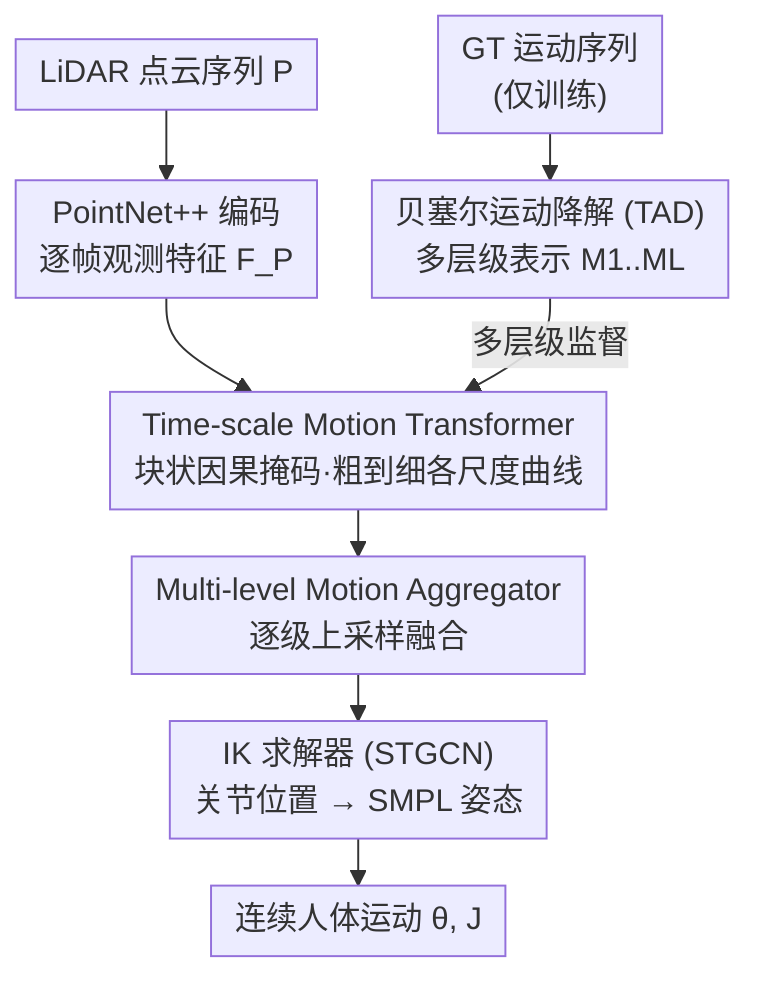

# Bezier Degradation Modeling for LiDAR-based Human Motion Capture

**会议**: CVPR 2026  
**论文**: [CVF Open Access](https://openaccess.thecvf.com/content/CVPR2026/html/An_Bezier_Degradation_Modeling_for_LiDAR-based_Human_Motion_Capture_CVPR_2026_paper.html)  
**代码**: 无  
**领域**: 3D人体理解 / LiDAR动作捕捉  
**关键词**: LiDAR动捕, 贝塞尔曲线, 运动表示, 粗到细重建, 抗遮挡

## 一句话总结
针对 LiDAR 点云稀疏、遮挡严重导致动捕预测抖动甚至失败的问题，本文提出 BMLiCap：先用可压缩的贝塞尔曲线把人体运动表示成"粗趋势 + 细节控制点"的多层级结构，再用一个 Time-scale Motion Transformer 在单次前向里粗到细地重建各时间尺度运动曲线，在 4 个 LiDAR 动捕基准上同时刷新精度（MPJPE）和时序连续性（加速度误差）。

## 研究背景与动机
**领域现状**：3D 人体动作捕捉要从传感器数据里恢复随时间变化的人体姿态。传统方案靠 marker 或 IMU 穿戴设备，精度高但要昂贵设备；后来 RGB/RGB-D 方案便宜，但受光照限制、缺绝对深度，基本只能室内用。自动驾驶和机器人对大尺度开放场景人体理解的需求，把 LiDAR 动捕推成了一个有前途的方向——它对光照鲁棒、能给可靠的全局深度。

**现有痛点**：LiDAR 单视角只能采到稀疏深度，对遮挡和噪声极其敏感。代表方法 LiveHPS 用 SMPL 顶点特征当 teacher 信号处理部分点云观测，LiveHPS++ 加了速度预测来压噪声，但它们仍然在关键关节长时间被遮挡时栽跟头，输出抖动、有偏的预测。

**核心矛盾**：这些方法本质上是直接从"不完整的点云特征"里学动作先验——它们依赖的是特定点云 pattern 里蕴含的动作规律，一旦输入帧缺失/被遮挡，特征本身就坏了，再怎么学也补不回来。也就是说，它们把"动作"和"观测"绑得太死。

**本文目标**：要在 LiDAR 观测不稳定（稀疏 + 遮挡 + 噪声）时仍能重建出连续、准确的人体运动，关键是要有一种即使观测断了也能撑住的运动表示。

**切入角度**：作者改走 kinematics-driven 的路子——不直接学点云特征，而是用贝塞尔曲线对人体运动本身建模。这种参数化显式暴露了位置、速度、加速度，即使长时间遮挡也能平滑稳定地插值。作者用实验观察支撑这个直觉（Fig.2）：把控制点激进地剪掉（只保留 12%~25%），运动的全局趋势依然保留，JPE 误差很小。这恰好对应人类运动的自然层级——"抬腿、迈步、落地、蹬地"一串动作可以粗略概括成"从 A 走到 B"。

**核心 idea**：用贝塞尔曲线的"层级可降解"表示替代"直接学点云特征"——粗层级捕捉运动意图、附加控制点细化细节，再设计一个粗到细的重建过程（恰好是"删除控制点"的逆过程），让粗层趋势去填补遮挡造成的"观测断点"。

## 方法详解

### 整体框架
BMLiCap 是一个粗到细（coarse-to-fine）框架，由两大模块组成：训练时用 **(a) 层级贝塞尔运动降解模块** 把真值运动序列加工成多个时间尺度的运动表示（这部分只在训练时跑），推理/训练共用的 **(b) 渐进式运动重建模块** 则以 LiDAR 点云特征为条件，从粗到细地重建出各尺度运动曲线并融合成最终精细运动。

输入是 $T$ 帧 LiDAR 点云序列 $P=\{P_t\in\mathbb{R}^{N\times3}\}$，输出是对应的 3D 人体运动 $M=\{\theta_t, J_t\}$（$\theta_t$ 是标准 SMPL 姿态参数，$J_t$ 是关节位置）。流程是：点云经 PointNet++ 编码成逐帧观测特征 $F_P$；同时把真值运动经贝塞尔降解得到从粗到细的多层级表示 $\{M_1,\dots,M_L\}$ 作为监督目标；Time-scale Motion Transformer (TMT) 把 $F_P$ 和各层运动 token 一起喂进去，单次前向预测出各尺度运动曲线；Multi-level Motion Aggregator (MMA) 把多尺度曲线自上而下逐级融合，取最细层的位置部分作为关节预测；最后一个 STGCN 的逆运动学（IK）求解器把关节位置转成 SMPL 姿态参数。

### 关键设计

**1. 贝塞尔曲线运动表示 + 轨迹感知降解（TAD）：把运动压成可学、可监督的粗到细层级**

直接学点云特征的方法在遮挡时会崩，根因是没有一个"即使丢帧也能撑住"的运动先验。本文先用三次贝塞尔曲线拟合每个关节 $k$ 的原始轨迹 $J^{(k)}\in\mathbb{R}^{T\times3}$，把每帧位置当锚点，构造 $T-1$ 段三次曲线并在控制点处强制 $C^1$ 连续：

$$\mathcal{B}_t^{(k)}(u)=(1-u)^3 J_t^{(k)}+3(1-u)^2 u\,C_{t,2}^{(k)}+3(1-u)u^2 C_{t+1,1}^{(k)}+u^3 J_{t+1}^{(k)}$$

通过设初始加速度为 0，控制点可用 Thomas 算法解出，得到最细粒度的贝塞尔链。

关键创新在**轨迹感知降解（Trajectory-Aware Degradation, TAD）**：给定下采样步长 $s$，把轨迹长度降到 $M_s=\lceil T/s\rceil$，均匀采新锚点 $\tilde J_i^{(k)}=J_{t_i}^{(k)}$，并从最细曲线上提取该锚点的单位切向量 $\hat d_i^{(k)}$，把新控制点定义为沿切向偏移 $\tilde C_{i,1}^{(k)}=\tilde J_i^{(k)}-\ell_{i,1}\hat d_i^{(k)}$、$\tilde C_{i,2}^{(k)}=\tilde J_i^{(k)}+\ell_{i,2}\hat d_i^{(k)}$。这里的精髓是：不只重采样控制点位置，还通过最小二乘求最优臂长 $\ell_i$（有闭式解），让降解后的曲线段尽量逼近原始细曲线上的采样点 $Y_{i,m}^{(k)}$：

$$\min_{\{\ell_{i,2},\ell_{i+1,1}\}}\sum_m\|\tilde{\mathcal{B}}_i^{(k)}(u_{i,m})-Y_{i,m}^{(k)}\|_2^2$$

用一组步长 $S=\{s_1,\dots,s_L\}$（$s_L=1$ 保留最细）就得到一个粗到细的运动表示金字塔 $\{M_l\in\mathbb{R}^{M_{s_l}\times K\times9}\}$。相比线性插值（只有 $G^0$ 连续，速度不连续）、B-Spline/VAE（过度平滑）、DCT 频率分解（激进降解时引入相位滞后和振铃），$C^1$ 连续的贝塞尔参数化天然抑制速度拐点和加速度尖峰——这正是后面加速度误差大幅下降的原因。

**2. Time-scale Motion Transformer（TMT）：单次前向 + 块状因果掩码实现粗到细信息流**

以往渐进式回归运动的方法（逐级 refine）虽然能提精度和平滑度，但靠迭代推理，慢。TMT 改用 encoder-only 的单阶段架构：把每个尺度的运动表示当成一段独立 token 序列，给定多层级运动嵌入 $\{E_l\}$ 和 LiDAR 特征 $F_P$，一次前向就联合建模它们的交互并输出各尺度的重建曲线 $\{\hat M_l\}=\mathrm{MLP}(\mathrm{TMT}(F_P,\{E_l\}))$。

让它"粗到细"而不是乱成一团的关键是**块状因果掩码（block-wise causal mask）**：在自注意力层上约束每个运动 token 只能 attend 到所有更粗层级的 token 和所有点云特征 token。这样粗层运动趋势能有效引导细层 refine，同时各层都能取用 LiDAR 视觉线索。作者的注意力可视化（Fig.9）佐证了这个机制：正常序列里跨层注意力趋于对角化（只看同时刻/相邻位置就够）；重遮挡序列里注意力变得分散，某些运动 token 在多个尺度和时刻被激活，相当于被模型当成"关键帧"来参与补全——也就是遮挡触发了跨层级的双向修复。

**3. Multi-level Motion Aggregator（MMA）：逐级上采样融合，把多尺度线索收成一条精细运动**

TMT 预测出多尺度曲线后，需要把它们融合成最终的精细序列。MMA 用一个 reduction 机制自上而下逐级整合：

$$\hat M_{l+1}'=\mathrm{MLP}(\mathrm{Resample}(\hat M_l'),\,\hat M_{l+1}),\quad l=2,\dots,L-1$$

其中 $\mathrm{Resample}(\cdot)$ 用预测出的贝塞尔曲线参数把更粗的运动表示上采样到与更细层等长，再用 MLP 融合两者。注意上采样不是简单插值，而是借助贝塞尔参数化重建出连续曲线再采样——这保证了粗层趋势在补到细层时仍然平滑连续。最后取最细层融合结果 $\hat M_L'$ 的位置部分作为关节位置预测 $\{\hat J_t\}$。这一步是"粗趋势填补遮挡断点"真正落地的地方：当某些细层时刻没有可靠观测时，粗层趋势经 Resample 提供了一个合理的运动 prior。

### 损失函数 / 训练策略
监督分三块。运动重建用多层级的 Frobenius 范数监督预测曲线：$\mathcal{L}_M=\sum_{l=1}^L \frac{1}{M_{s_l}}\|\hat M_l-M_l\|_F^2$。IK 求解器侧用姿态参数损失 $\mathcal{L}_\theta=\frac{1}{KT}\sum_t\|\theta_t-\hat\theta_t\|_F^2$ 和前向运动学损失 $\mathcal{L}_{FK}=\frac{1}{KT}\sum_t\|J_t-\hat J_{t;FK}\|_F^2$（$\hat J_{t;FK}=\mathrm{SMPL}(\hat\theta_t,\beta)$）。总损失 $\mathcal{L}=\lambda_M\mathcal{L}_M+\lambda_\theta\mathcal{L}_\theta+\lambda_{FK}\mathcal{L}_{FK}$，权重设 $\lambda_M=0.5$、$\lambda_\theta=\lambda_{FK}=1.0$。TMT 为 12 层、512 维、16 头的标准 Transformer encoder；PointNet++ 在合成人体实例上预训练；AdamW，学习率 $2.5\times10^{-4}$，训 50 epoch，4×RTX 4090。

## 实验关键数据

### 主实验
四个主流 LiDAR 动捕基准（LiDARHuman26M、FreeMotion、NoiseMotion、SLOPER4D），三个指标：MPJPE/JPE（关节位置误差, mm）、MPVPE/VPE（顶点位置误差, mm）、Accel Err/AE（加速度误差, cm/s²，衡量时序连贯性）。`†` 是 32 帧变体。

| 数据集 | 指标 | 本文(默认) | 本文† | 之前最好 (LiveHPS++) |
|--------|------|-----------|-------|----------------------|
| LiDARHuman26M | JPE↓ | 70.1 | **66.8** | 71.9 (LiveHPS) |
| FreeMotion | JPE↓ | 49.6 | **47.2** | 61.9 |
| FreeMotion | AE↓ | 27.1 | **22.5** | 54.2 |
| NoiseMotion | JPE↓ | **34.0** | 36.9 | 34.0 |
| SLOPER4D | JPE↓ | 39.7 | **36.5** | 42.7 |
| SLOPER4D | AE↓ | 22.3 | **13.6** | 43.4 |

在最具挑战的 FreeMotion 上，BMLiCap† 相比 LiveHPS++ 提升 14.7 MPJPE / 16.3 MPVPE / 31.7 Accel Err。NoiseMotion 上反而短窗口更好——作者归因于该数据集视角跳变多，长时间窗会聚合更多被破坏/轻微错位的位置标注，而 JPE/VPE 对对齐很敏感。

运动表示对比（LiDARHuman26M，验证表示本身的价值）：

| 表示方法 | MPJPE | MPVPE | Accel Err |
|----------|-------|-------|-----------|
| Frequency-DCT | 76.4 | 97.8 | 35.4 |
| VAE-smooth | 78.2 | 100.1 | 36.8 |
| Linear | 75.7 | 96.3 | 35.5 |
| B-Spline | 70.5 | 90.4 | 30.0 |
| **Bézier+TAD (Ours)** | **66.8** | **85.4** | **28.8** |

### 消融实验

| 配置 | MPJPE | Accel Err | 说明 |
|------|-------|-----------|------|
| L=1 {32} | 68.0 | 28.9 | 单层级 |
| L=3 {32,16,8} | 67.9 | 28.9 | 三层级无 TAD |
| L=3 {32,16,8} +TAD | **66.8** | 28.8 | 最优配置 |
| L=4 {32,16,8,4} +TAD | 67.3 | 28.8 | 层级过多反退 |

组件消融（baseline = [34] 把 GRU 换成 Transformer，排除架构红利干扰）：

| 配置 | MPJPE | Accel Err |
|------|-------|-----------|
| Base ([34] w/ transformer) | 79.0 | 42.6 |
| + Bézier & TAD (表示) | 72.3 | 30.7 |
| + Tokens & Mask (架构) | 72.2 | 30.7 |
| + m.s. + m.l. + b.m. | 68.9 | 29.4 |
| Full (+ MMA) | **66.8** | **28.8** |

### 关键发现
- **贝塞尔表示本身贡献最大**：单加 Bézier+TAD 表示就把 MPJPE 从 79.0 降到 72.3、Accel Err 从 42.6 降到 30.7（加速度误差降幅最猛），证明"换表示"比"换架构"更关键。
- **层级数不是越多越好**：L=3 的 {32,16,8} 调度最优，L=4 反而退化，说明各阶段时间分辨率要平衡。TAD 在所有层级数下都稳定带来增益（L=3 时 MPJPE −1.1）。
- **抗丢帧鲁棒**：推理时随机丢最多 50% 点云帧（被丢帧用 90% 无意义占位符填充），方法仍保持稳定性能，验证粗层趋势确实能补观测断点。
- **块状掩码触发跨层修复**：注意力图显示重遮挡时跨层级双向交互被激活，把可信帧当"关键帧"参与补全。

## 亮点与洞察
- **"可降解"是这篇最妙的点子**：把"训练目标的构造"和"推理时的重建"统一成一对互逆过程——降解是删控制点，重建是粗到细加控制点。多层级监督信号不是人为设计的辅助 loss，而是从同一条贝塞尔曲线自然导出的，干净自洽。
- **TAD 调臂长而非只挪锚点**：很多降采样会丢动态信息，TAD 用闭式最小二乘求切向臂长去逼近原曲线，相当于在低分辨率下尽量"留住"速度信息，这是它优于线性/B-Spline 的直接原因。
- **用单次前向取代迭代 refine**：把"渐进式"从串行迭代搬进 Transformer 的块状因果掩码里，既保留了粗引导细的层级性，又避免了迭代推理的慢——这个把"过程"编码进"注意力结构"的思路可迁移到其他需要 coarse-to-fine 的生成/重建任务。
- **kinematics-driven 而非 data-driven**：核心赌的是"运动本身有低维平滑结构"，所以遮挡时不依赖观测、依赖运动 prior，这是它在丢 50% 帧时不崩的根本原因。

## 局限与展望
- 贝塞尔曲线对**剧烈非平滑运动**（如突变、碰撞、高频抖动的真实动作）可能过度平滑，论文主打的是抗遮挡/抗噪，对"该抖的地方"是否会被抹平没有充分讨论。
- TAD 求最优臂长依赖最小二乘闭式解，前提是降解曲线段能较好逼近原始片段；当原始运动在一段内方向剧烈变化、单段三次曲线表达力不足时，逼近误差会上升（论文把详细推导放在附录，正文未给该情形的误差分析）。
- 层级调度 $S$ 是手调超参（{32,16,8} 最优来自网格搜索），换数据集/帧率可能要重调，缺少自适应选层级的机制。
- NoiseMotion 上长窗口反而掉点，暴露方法对标注对齐和视角跳变敏感，时间窗长度的选择目前是经验性的。
- 展望可扩展到更丰富的骨架拓扑、更多传感模态融合，以及更广的应用场景。

## 相关工作与启发
- **vs LiveHPS / LiveHPS++**: 它们靠点云的时空一致性先验 + 速度预测来抗噪，本质仍是从点云特征学动作；本文转而对运动本身建贝塞尔层级先验，遮挡时不靠观测靠 prior，因此在长时间关键关节遮挡上更稳（FreeMotion AE 从 54.2 降到 22.5）。
- **vs 频率分解 / 残差多阶段表示 (DCT, VQ-VAE 类)**: 这类方法各阶段信号正交，早期信号的错误难以被后续修正；贝塞尔的二次/三次曲线易调整、易纠错（受 motion inbetweening 工作启发），且 $C^1$ 连续避免了 DCT 的相位滞后和振铃。
- **vs 迭代式渐进回归 [40,45]**: 思路同样是 coarse-to-fine，但它们迭代推理慢；本文用块状因果掩码在单次前向里实现等价的层级引导。
- **vs LiDARCap [34]**: 首个 LiDAR 动捕基准用 GCN 逆运动学求解器，但受限于理想采集环境；本文沿用其 IK 求解器设定但前端换成贝塞尔多尺度重建，扩到了复杂室外遮挡场景。

## 评分
- 新颖性: ⭐⭐⭐⭐⭐ 用"可降解贝塞尔曲线"把运动表示与粗到细重建统一成互逆过程，角度新且自洽
- 实验充分度: ⭐⭐⭐⭐ 四基准 + 表示对比 + 组件/层级消融 + 丢帧鲁棒性 + 注意力可视化，相当扎实；自定义指标少、可复现代码未放
- 写作质量: ⭐⭐⭐⭐ 动机—观察—方法链条清晰，图示丰富；部分降解推导压在附录
- 价值: ⭐⭐⭐⭐ 给 LiDAR 动捕在遮挡/噪声下的稳健重建提供了可迁移的"表示即先验"思路

<!-- RELATED:START -->

## 相关论文

- [\[CVPR 2026\] FlashCap: Millisecond-Accurate Human Motion Capture via Flashing LEDs and Event-Based Vision](flashcap_millisecond-accurate_human_motion_capture_via_flashing_leds_and_event-b.md)
- [\[CVPR 2026\] Neuro-Cognitive Reward Modeling for Human-Centered Autonomous Vehicle Control](neuro-cognitive_reward_modeling_for_human-centered_autonomous_vehicle_control.md)
- [\[CVPR 2026\] U4D: Uncertainty-Aware 4D World Modeling from LiDAR Sequences](u4d_uncertainty-aware_4d_world_modeling_from_lidar_sequences.md)
- [\[CVPR 2026\] EMDUL: Expanding mmWave Datasets for Human Pose Estimation with Unlabeled Data and LiDAR Datasets](expanding_mmwave_datasets_for_human_pose_estimation_with_unlabeled_data_and_lida.md)
- [\[CVPR 2026\] Efficient Equivariant Transformer for Self-Driving Agent Modeling](efficient_equivariant_transformer_for_self-driving_agent_modeling.md)

<!-- RELATED:END -->
