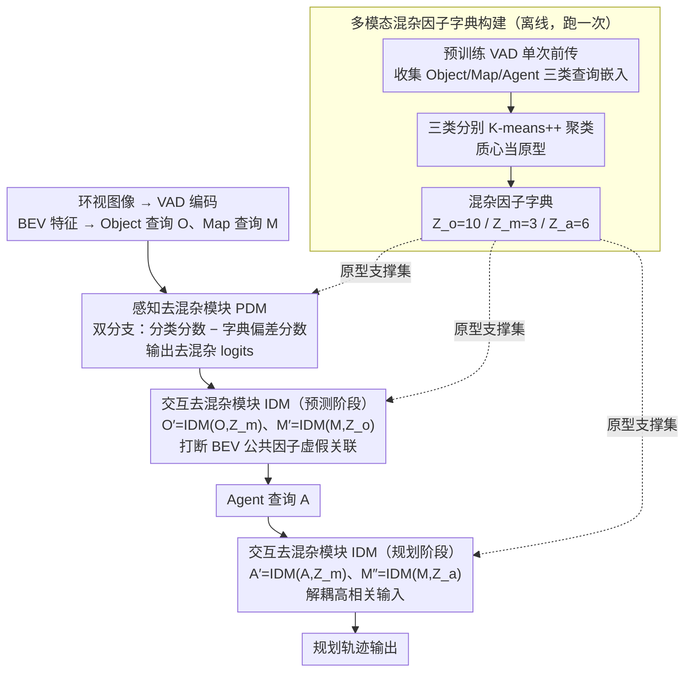

# CausalVAD: De-confounding End-to-End Autonomous Driving via Causal Intervention

**会议**: CVPR2026  
**arXiv**: [2603.18561](https://arxiv.org/abs/2603.18561)  
**代码**: 待公开  
**领域**: 自动驾驶  
**关键词**: 因果推断, 后门调整, 去混杂, 端到端自动驾驶, 稀疏向量化表示, VAD

## 一句话总结

提出 CausalVAD，通过将 Pearl 后门调整理论参数化为即插即用模块（SCIS），在 VAD 架构的感知-预测-规划三个阶段进行多级因果干预，消除虚假关联，实现更安全、更鲁棒的端到端自动驾驶。

## 研究背景与动机

**端到端模型学的是相关性而非因果性**：当前规划导向的端到端驾驶模型（UniAD、VAD 等）本质上通过标准监督学习拟合 $P(Y|S)$，学到的是统计相关而非真正的因果关系，容易受数据集偏差影响产生"捷径学习"。

**因果混淆导致安全隐患**：模型可能把自车历史状态（速度、加速度）当作预测未来决策的捷径（虚假自相关），在开环评测上表现好，但闭环部署时一旦偏离专家轨迹就会灾难式崩溃。

**VLM 方案存在幻觉与伪忠实性**：用大型视觉语言模型提供自然语言解释看似合理，但其推理过程可能与实际决策完全脱钩（pseudo-faithfulness），在安全关键领域引入新风险。

**nuScenes 数据集严重不平衡**：约 75% 为直行场景，模型易学到"直行是默认行为"的虚假关联，转弯等少数场景性能大幅下降。

**混杂因素是系统性级联问题**：通过结构因果模型（SCM）分析可发现，VAD 中感知的共现偏差、预测的 BEV 公共因子、规划的输入相关性是三个不同信息节点上的混杂问题，需要多阶段针对性干预。

**现有去混杂方法局限**：启发式方法（状态丢弃、数据增强）缺乏理论保证；因果发现/反事实方法多用于离线分析或简化场景，难以高效嵌入大规模端到端模型的在线训练中。

## 方法详解

### 整体框架

CausalVAD 想治的是端到端驾驶“学到相关、没学到因果”的毛病。它在 VAD 架构上加了一套稀疏因果干预方案（SCIS）：先用结构因果模型（SCM）把 VAD 的模块化流水线形式化、识别出三类后门路径，再用后门调整 $P(Y|\text{do}(S)) = \sum_z P(Y|S=s, Z=z) P(Z=z)$ 切断虚假路径，其中潜在混杂因子 $Z$ 用一个可学习的原型字典来近似、把 do 算子参数化进神经网络。落到结构上，就是先离线构建混杂因子字典，再在感知、预测、规划三个阶段分别插入去混杂模块（感知用 PDM、预测与规划用 IDM），全程复用字典里的原型作为 do 算子的求和支撑集。

### 关键设计

**1. 多模态混杂因子字典构建：用原型近似看不见的混杂因子 Z**

后门调整要对混杂因子 $Z$ 求和，但 $Z$ 在驾驶场景里是隐变量、拿不到。作者用一个离线两步过程（只跑一次）把它近似出来：先用预训练 VAD 对整个训练集单次前传，收集 Object/Map/Agent 三类查询的稀疏嵌入；再对三类嵌入分别做 K-means++ 聚类，质心当原型，构成字典 $\{\mathcal{Z}\} = \{\{\mathcal{Z}_o\}, \{\mathcal{Z}_m\}, \{\mathcal{Z}_a\}\}$，大小分别为 $(k_o, k_m, k_a) = (10, 3, 6)$。这组原型就是后面 do 算子里“对 $Z$ 求和”的离散支撑集。

**2. 感知去混杂模块（PDM）：用双分支抵消分类里的共现偏差**

感知阶段的分类路径 $\mathcal{O} \to \mathcal{Y}_o$ 和 $\mathcal{M} \to \mathcal{Y}_m$ 会被共现偏差带偏（某些物体/地图元素总一起出现，模型就走捷径）。PDM 用双分支结构应对：一支是直接分类分数，另一支基于混杂因子字典算出偏差分数，相减输出去混杂后的 logits，对称地用在目标分类和地图元素分类上。

**3. 交互去混杂模块（IDM）：估出虚假成分再减掉，打断跨阶段的伪关联**

预测和规划阶段的问题是查询之间高度相关——BEV 公共因子、输入相关性会制造虚假关联。IDM 是一个可多次实例化的统一模块：用交叉注意力估计查询中“可由上下文预测出来的”虚假成分，经门控单元缩放后从原始查询里减掉。预测阶段用 $\mathcal{O}' = \text{IDM}(\mathcal{O}, \{\mathcal{Z}_m\})$、$\mathcal{M}' = \text{IDM}(\mathcal{M}, \{\mathcal{Z}_o\})$ 打断 BEV 公共因子引发的虚假关联；规划阶段用 $\mathcal{A}' = \text{IDM}(\mathcal{A}, \{\mathcal{Z}_m\})$、$\mathcal{M}'' = \text{IDM}(\mathcal{M}, \{\mathcal{Z}_a\})$ 解耦高度相关的输入。把“能被上下文预测的部分”减掉，留下的才是不依赖捷径的因果信号。

### 损失函数 / 训练策略

插入 PDM 和 IDM 后从头端到端训练（而非微调），确保从一开始就学去混杂的因果关系；损失函数与原始 VAD 完全一致、无需额外损失设计。优化器 AdamW，初始学习率 $2 \times 10^{-4}$，权重衰减 0.01，CosineAnnealing 调度，60 epochs，8×RTX 3090。

## 实验

### 主要结果

**nuScenes 开环规划（Table 1）**：

| 方法 | L2 Avg (m) ↓ | CR Avg (%) ↓ | FPS |
|------|-------------|-------------|-----|
| UniAD | 0.73 | 0.61 | 1.8 |
| VAD-tiny | 0.74 | 0.44 | 5.6 |
| VAD | 0.62 | 0.38 | 3.1 |
| BridgeAD | 0.58 | 0.08 | 3.9 |
| SparseDrive | 0.61 | 0.10 | 6.1 |
| **CausalVAD** | **0.54** | **0.11** | 5.4 |

- 相比基线 VAD-tiny，L2 下降 27%，碰撞率下降 75%，几乎无额外计算开销
- 在所有方法中取得最低平均 L2 误差

**NAVSIM & Bench2Drive（Table 4）**：

| 方法 | NAVSIM PDMS ↑ | B2D DS ↑ | B2D SR (%) ↑ |
|------|-------------|---------|-------------|
| VAD-tiny | 80.5 | 42.73 | 14.18 |
| UniAD | 83.4 | 45.81 | 16.36 |
| **CausalVAD** | **87.2** | **49.83** | **19.42** |

### 因果鲁棒性分析

**场景分布偏差鲁棒性（Table 2）**：VAD-tiny 在转弯场景 L2 从 0.75→1.07m 严重退化；CausalVAD 转弯场景 L2 仅 0.69m，甚至优于 VAD-tiny 直行时的表现。

**自车状态捷径依赖（Table 3）**：将自车速度置零时，VAD-tiny L2 从 0.74→6.94m 暴涨，CausalVAD 从 0.54→4.80m，碰撞率从 0.11→1.20%（VAD-tiny 为 0.44→4.02%），对速度扰动的鲁棒性显著更强。

### 消融实验

**模块贡献（Table 5）**：

| 配置 | PDM | IDM | L2 Avg ↓ | CR Avg ↓ |
|------|-----|-----|---------|---------|
| 基线 | × | × | 0.74 | 0.44 |
| +PDM | ✓ | × | 0.63 | 0.26 |
| +IDM | × | ✓ | 0.57 | 0.19 |
| **完整** | **✓** | **✓** | **0.54** | **0.11** |

- PDM 主要降低碰撞率，IDM 主要提升规划精度，两者互补
- 字典大小 $(10,3,6)$ 为最优配置，过小不足以捕获多样上下文，过大引入冗余
- 聚类算法选择（K-means/K-medoids/K-means++）对性能不敏感，方法鲁棒

### 关键发现

1. T-SNE 可视化表明 CausalVAD 成功将不同导航意图（直行/左转/右转）解纠缠为可分离的聚类
2. 定性分析中，面对加塞场景 VAD-tiny 注意力过度关注自车历史轨迹导致碰撞，CausalVAD 正确聚焦加塞车辆并安全减速
3. VLA 模型（Senna）虽然动作安全但给出幻觉解释（将减速归因于不存在的限高问题），凸显 CausalVAD 内部逻辑的忠实性

## 亮点

- **理论扎实**：将 Pearl 后门调整理论严格形式化地引入端到端驾驶，非启发式
- **即插即用**：PDM 和 IDM 模块轻量且通用，FPS 从 5.6 几乎不降（5.4），可作为其他架构的插件
- **多维度鲁棒性验证全面**：场景分布偏差、自车状态扰动、跨数据集泛化三个角度系统证明因果干预的有效性
- **揭示了稀疏向量化表示与因果干预的内在协同**：VAD 的稀疏查询天然适合作为因果干预的操作对象

## 局限性

- 仅在 VAD 的顺序式架构上验证，尚未扩展到并行或迭代交互架构（如 SparseDrive 的并行解码）
- 混杂因子字典通过离线聚类构建，无法捕获训练集外的新型驾驶上下文
- 闭环评测（Bench2Drive）相比专门优化的方法（DriveMoE DS=74.22）仍有较大差距
- 原型数量 $(k_o, k_m, k_a)$ 需要网格搜索，缺乏自适应选择机制

## 相关工作

- **端到端驾驶架构**：UniAD（光栅化 BEV）、VAD/SparseDrive（稀疏向量化）、BridgeAD——本文方法与架构探索正交
- **因果混淆缓解**：状态丢弃 [6]、数据增强 [21]（启发式）；反事实推理 [30]、因果发现 [26]（离线分析）——本文填补了在线后门调整的空白
- **VLM 驾驶模型**：Senna、OmniDrive、ORION——存在幻觉和伪忠实性问题，本文从因果内部一致性出发

## 评分

- 新颖性: ⭐⭐⭐⭐ — 首次系统地将后门调整参数化为端到端驾驶的即插即用模块
- 实验充分度: ⭐⭐⭐⭐ — 三个数据集 + 多维鲁棒性分析 + 详尽消融
- 写作质量: ⭐⭐⭐⭐ — 因果分析逻辑链清晰，图示精良
- 价值: ⭐⭐⭐⭐ — 为自动驾驶提供了因果推断的实际落地范式，插件化设计实用性强

<!-- RELATED:START -->

## 相关论文

- [\[CVPR 2026\] ResAD: Normalized Residual Trajectory Modeling for End-to-End Autonomous Driving](resad_normalized_residual_trajectory_modeling_for_end-to-end_autonomous_driving.md)
- [\[CVPR 2026\] Scaling-Aware Data Selection for End-to-End Autonomous Driving Systems](scaling-aware_data_selection_for_end-to-end_autonomous_driving_systems.md)
- [\[CVPR 2026\] ActiveAD: Planning-Oriented Active Learning for End-to-End Autonomous Driving](activead_planning-oriented_active_learning_for_end-to-end_autonomous_driving.md)
- [\[CVPR 2026\] DriveMoE: Mixture-of-Experts for Vision-Language-Action Model in End-to-End Autonomous Driving](drivemoe_mixture-of-experts_for_vision-language-action_model_in_end-to-end_auton.md)
- [\[CVPR 2026\] E3AD: An Emotion-Aware Vision-Language-Action Model for Human-Centric End-to-End Autonomous Driving](e3ad_an_emotion-aware_vision-language-action_model_for_human-centric_end-to-end_.md)

<!-- RELATED:END -->
