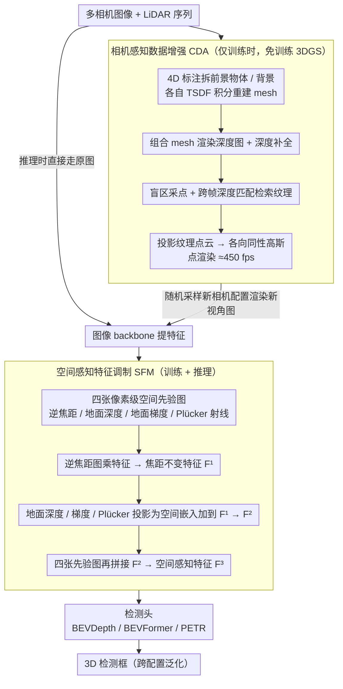

# CoIn3D: Revisiting Configuration-Invariant Multi-Camera 3D Object Detection

**会议**: CVPR2026  
**arXiv**: [2603.05042](https://arxiv.org/abs/2603.05042)  
**代码**: [GitHub](https://github.com/) (作者声明已开源，链接待确认)  
**领域**: 自动驾驶  
**关键词**: 多相机3D目标检测, 跨配置泛化, 空间先验调制, 3D高斯数据增强, BEV感知

## 一句话总结

提出 CoIn3D 框架，通过空间感知特征调制（SFM）和相机感知数据增强（CDA）两个模块，显式建模相机内参/外参/阵列布局的空间先验差异，实现多相机3D检测模型从源配置到未见目标配置的强泛化迁移，适用于 BEVDepth / BEVFormer / PETR 三大主流范式。

## 背景与动机

1. **多相机3D检测（MC3D）广泛部署**：自动驾驶车辆和机器人平台越来越多地使用多相机环视方案进行3D目标检测，对模型的跨平台部署能力提出了迫切需求。
2. **跨配置泛化困难**：当前 MC3D 模型在训练配置上表现优异，但迁移到新平台（不同内参、外参、相机数量和布局）时性能急剧下降，例如 NuScenes→Waymo 的 BEVDepth 直接迁移 mAP 仅 0.040。
3. **现有方案不完整**：先前方法要么通过图像 warping 对齐到 meta-camera（分辨率损失、3D场景结构畸变），要么仅处理焦距差异（虚拟焦距+深度重缩放），未全面考虑外参和阵列布局。
4. **焦距歧义问题**：不同焦距下同一目标在像素空间的尺寸不同，导致深度估计和特征聚合的歧义，模型无法一致地理解目标距离。
5. **地面几何先验随外参变化**：不同安装高度和朝向的相机产生不同的地面深度分布和深度增长率，模型训练时会过拟合到特定的透视效果。
6. **阵列布局差异影响多相机融合**：不同平台的相机数量和重叠区域不同，直接影响多相机特征关联和融合的模式，现有方法未对此建模。

## 方法详解

### 整体框架

CoIn3D 包含两个核心模块：**空间感知特征调制 (SFM)** 和 **相机感知数据增强 (CDA)**。训练时，CDA 先通过 3DGS 渲染随机配置的新视角图像，再经 SFM 将空间先验嵌入特征；推理时仅用 SFM 即可泛化到新配置。框架可即插即用到 bottom-up BEV（BEVDepth）、top-down BEV（BEVFormer）、稀疏查询（PETR）三大范式。

### 关键设计

**1. 空间感知特征调制（SFM）：把相机配置差异显式写进特征**

跨配置迁移之所以崩，是因为模型把焦距、安装位姿这些「相机自己的参数」也偷偷学进了特征里，换个平台就失效。SFM 的做法是用四张像素级空间先验图把这些差异显式编码、再注入特征，让网络学到的是「场景」而非「这台相机」：

- **逆焦距图（Inverse Focal Map）**：焦距差 $k$ 倍会让目标像素面积差 $k^2$ 倍，于是用 $M_{IF} = \mathbf{1} \cdot \frac{1}{f^2}$ 乘以图像特征做归一化，消除焦距歧义，消融里它贡献最大。
- **地面深度图（Ground Depth Map）**：假设地面平坦，由至少 3 个非共线地面点拟合平面 $Ax+By+Cz+D=0$，再推出逐像素地面深度 $z(u,v) = -\frac{D}{AX+BY+C}$，给模型一个显式的场景空间先验。
- **地面梯度图（Ground Gradient Map）**：对地面深度图做行间差分并施加 log-逆变换 $M_{GG} = \log(\frac{1}{\Delta z} + 1)$，编码不同安装高度下的深度增长率，避免过拟合某种特定透视。
- **Plücker 射线图（Plücker Raymap）**：每个像素算从光心出发的射线方向 $\mathbf{d} = \mathbf{R}\mathbf{K}^{-1}\mathbf{p}$ 和力矩 $\mathbf{m} = \mathbf{t} \times \mathbf{d}$，得到 6 通道 Plücker 坐标，统一表征 FoV、旋转、平移以及跨相机像素的连续空间位置。

融合是渐进的：先用逆焦距图乘特征得到焦距不变特征 $F^1$；再把 GD/GG/PR 拼接后经浅层投影器编码为空间嵌入、加到 $F^1$ 得 $F^2$；最后把四张原始先验图与 $F^2$ 再拼接，得到最终的空间感知特征 $F^3$。

**2. 相机感知数据增强（CDA）：用免训练 3DGS 现场造出各种配置的训练图**

光有 SFM 还不够——训练数据本身只见过源配置，模型没机会见到别的相机布局。CDA 提出一条**无需训练的自中心 3DGS 流水线**来动态生成多样配置的图像：先用 4D 标注把 LiDAR 序列拆成前景物体和背景，各自用 TSDF 积分重建 mesh（物体 mesh 补成封闭曲面）；再按帧组合 mesh 渲染深度图并做深度补全；接着从物体 mesh 和相机盲区采点，靠跨帧深度匹配检索纹理、补全不可见部分；最后把 RGB-D 投影为纹理点云，设成各向同性高斯（固定半径、不旋转、不透明度为 1），以点渲染方式跑出 ≈450 fps 的高速渲染。训练时随机采样新相机配置渲染新视角图，对原图则做随机焦距缩放。免训练 + 点渲染让它能在线现场造数据，而不必为每个场景重训一个 3DGS。

### 损失函数

沿用各基础模型（BEVDepth / BEVFormer / PETR）的原有检测损失，SFM 和 CDA 作为即插即用模块不引入额外训练损失。

## 实验关键数据

### 主实验：基于 BEVDepth 的跨数据集泛化

| 设置 | 方法 | mAP↑ | mATE↓ | mAOE↓ | NDS*↑ |
|------|------|------|-------|-------|-------|
| NuScenes→Waymo | Direct Transfer | 0.040 | 1.303 | 0.790 | 0.178 |
| NuScenes→Waymo | UDGA-BEV (前SOTA) | 0.349 | 0.754 | 0.250 | 0.459 |
| NuScenes→Waymo | **CoIn3D (Ours)** | **0.381** | **0.687** | **0.155** | **0.513** |
| NuScenes→Lyft | Direct Transfer | 0.112 | 0.997 | 0.389 | 0.296 |
| NuScenes→Lyft | UDGA-BEV | 0.324 | 0.709 | 0.180 | 0.487 |
| NuScenes→Lyft | **CoIn3D (Ours)** | **0.375** | **0.660** | **0.101** | **0.534** |
| Waymo→NuScenes | **CoIn3D (Ours)** | **0.349** | 0.727 | 0.179 | **0.481** |
| Lyft→NuScenes | **CoIn3D (Ours)** | **0.303** | **0.647** | 0.377 | **0.452** |

所有设置均取得 SOTA，NDS* 相比 UDGA-BEV 分别提升 +0.054 / +0.047 / +0.004 / +0.031。

### 跨范式泛化：BEVFormer 与 PETR

| 设置 | 方法 | mAP↑ | NDS*↑ |
|------|------|------|-------|
| N→L (BEVFormer) | Direct Transfer | 0.149 | 0.115 |
| N→L (BEVFormer) | **CoIn3D** | **0.237** | **0.377** |
| N→L (PETR) | Direct Transfer | 0.013 | 0.046 |
| N→L (PETR) | **CoIn3D** | **0.332** | **0.456** |

CoIn3D 是首个统一适用于三大 MC3D 范式的跨配置泛化框架。

### 消融实验

**模块消融 (NuScenes→Waymo)**：

| CDA | SFM | NDS*↑ |
|-----|-----|-------|
| ✗ | ✗ | 0.178 |
| ✗ | ✓ | 0.358 |
| ✓ | ✗ | 0.224 |
| ✓ | ✓ | **0.513** |

- SFM 单独即有效（+0.180），CDA 单独增益有限（+0.046），二者结合产生强协同效果。
- BEVDepth 原有 Camera-Aware SE 模块与 SFM 冲突，去掉 CA 后反而更优（0.513 vs 0.504）。

**SFM 空间先验消融**：逆焦距图贡献最大（+0.238），地面深度/梯度/Plücker 逐步累加贡献 +0.036 / +0.008 / +0.007。

**CDA 增强消融**：焦距增强 +0.060，新视角合成增强额外 +0.095，说明 NVS 对多样化配置的增强效果远超简单焦距缩放。

## 亮点

- **全面剖析配置差异根因**：系统性地将跨配置泛化问题分解为内参（焦距/FoV）、外参（安装位姿）、阵列布局三个维度，提出针对性的四种空间先验表示。
- **逆焦距归一化简洁有效**：一个简单的 $1/f^2$ 乘法操作即可将 NDS* 从 0.224 提升到 0.462，消融中贡献最大。
- **无需训练的 3DGS 数据增强**：避免了传统 3DGS 的高训练成本，以点渲染方式利用预定义参数直接构建高斯表示，渲染速度 ≈450 fps，适合在线动态增强。
- **范式无关的统一框架**：同一套 SFM+CDA 可即插即用到 BEVDepth / BEVFormer / PETR，不依赖特定的深度预测设计。
- **大幅缩小与 Oracle 的差距**：NuScenes→Waymo 的 NDS* 从 0.178 提升到 0.513（Oracle 为 0.649），弥合了约 71% 的性能差距。

## 局限与展望

- **语义分布差异未解决**：当前只处理配置差异，不同数据集的类别分布/场景分布差异仍影响跨域泛化，作者将此列为未来工作。
- **依赖 LiDAR 点云构建 3DGS**：CDA 模块需要 LiDAR 数据来重建 mesh 和深度，限制了在纯视觉数据集上的应用。
- **地面平面假设**：假设地面平坦以推导深度图和梯度图，在非平地场景（坡道、起伏路面）中可能失效。
- **单类评估为主**：主实验主要在统一的 "car" 类上验证，多类别场景下的泛化效果有待进一步探索。
- **CDA 的存储开销**：每帧需要构建和存储自中心高斯点云，对大规模数据集的存储和预处理成本有一定要求。

## 与相关工作的对比

| 方法 | 焦距处理 | 外参处理 | 阵列布局 | 适用范式 | NDS* (N→W) |
|------|---------|---------|---------|---------|------------|
| DG-BEV | 虚拟焦距 | ✗ | ✗ | Bottom-up BEV | 0.415 |
| PD-BEV | 虚拟焦距+深度重缩放 | ✗ | ✗ | Bottom-up BEV | — |
| UDGA-BEV | 虚拟焦距+深度/光度一致性 | ✗ | ✗ | Bottom-up BEV | 0.459 |
| UniPAD [47] | 图像 warping 到球面 | 球面对齐 | ✗ | Bottom-up BEV | — |
| **CoIn3D (本文)** | **逆焦距图** | **地面深度/梯度+Plücker** | **Plücker 连续编码** | **全范式** | **0.513** |

本文首次全面显式建模三种配置先验，且是唯一同时适用于三大 MC3D 范式的方案。

## 评分

- 新颖性: ⭐⭐⭐⭐ — 四种空间先验的组合设计和无训练 3DGS 增强具有新意，逆焦距归一化简洁优雅
- 实验充分度: ⭐⭐⭐⭐⭐ — 三个数据集×三个范式×四种设置，消融详尽，对比全面
- 写作质量: ⭐⭐⭐⭐ — 问题分析系统清晰，配图直观，公式推导完整
- 价值: ⭐⭐⭐⭐ — 解决了 MC3D 跨平台部署的实际痛点，工业应用潜力大

<!-- RELATED:START -->

## 相关论文

- [\[AAAI 2026\] Exploring Surround-View Fisheye Camera 3D Object Detection](../../AAAI2026/autonomous_driving/exploring_surround-view_fisheye_camera_3d_object_detection.md)
- [\[CVPR 2026\] SToRe3D: Sparse Token Relevance in ViTs for Efficient Multi-View 3D Object Detection](store3d_sparse_token_relevance_in_vits_for_efficient_multi-view_3d_object_detect.md)
- [\[CVPR 2026\] R4Det: 4D Radar-Camera Fusion for High-Performance 3D Object Detection](r4det_4d_radar-camera_fusion_for_high-performance_3d_object_detection.md)
- [\[CVPR 2025\] RaCFormer: Towards High-Quality 3D Object Detection via Query-based Radar-Camera Fusion](../../CVPR2025/autonomous_driving/racformer_towards_high-quality_3d_object_detection_via_query-based_radar-camera_.md)
- [\[CVPR 2026\] CCF: Complementary Collaborative Fusion for Domain Generalized Multi-Modal 3D Object Detection](ccf_complementary_collaborative_fusion_for_domain_generalized_multi-modal_3d_obj.md)

<!-- RELATED:END -->
