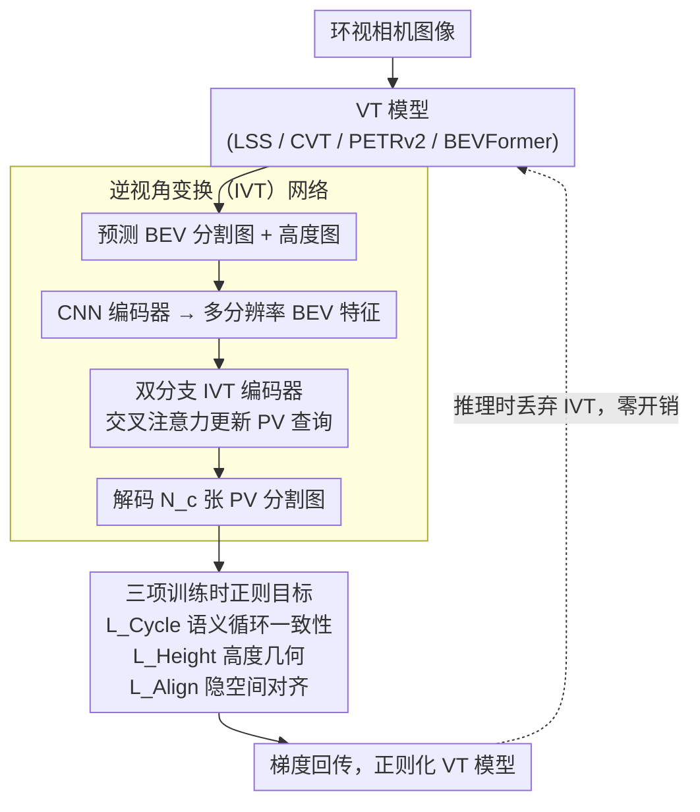

# CycleBEV: Regularizing View Transformation Networks via View Cycle Consistency for Bird's-Eye-View Semantic Segmentation

**会议**: CVPR2026  
**arXiv**: [2602.23575](https://arxiv.org/abs/2602.23575)  
**代码**: [JeongbinHong/CycleBEV](https://github.com/JeongbinHong/CycleBEV)  
**领域**: 自动驾驶  
**关键词**: BEV语义分割, 视角变换, 循环一致性, 逆视角变换, 正则化

## 一句话总结

提出 CycleBEV 正则化框架：训练时引入逆视角变换（IVT）网络将 BEV 分割图映射回透视图（PV）分割图，通过循环一致性损失及高度感知几何正则化、跨视角隐空间对齐两项新目标来增强现有 BEV 语义分割模型，推理时不增加任何开销。

## 背景与动机

1. **BEV 表征是自动驾驶基础**：环视相机图像 → BEV 语义地图是运动规划/控制的核心前端，但透视到正射的映射受深度模糊和遮挡影响很大。
2. **三大视角变换范式各有局限**：LSS（逐像素深度估计 + 3D 投影）、CVT/PETRv2（Transformer 交叉注意力）、BEVFormer（可变形注意力）在小目标和被遮挡物体上表现不佳。
3. **循环一致性在 BEV 中尚未被充分利用**：CycleGAN 的循环一致性思想天然适合 PV↔BEV 的正–逆映射关系，但先前方法 CVTM 和 FocusBEV 只做部分利用或隐式利用，效果有限。
4. **已有方法将逆映射嵌入推理路径**：CVTM/FocusBEV 把 BEV→PV 模块集成到推理架构中，增加了计算复杂度和模型尺寸。
5. **特征空间的循环一致性语义模糊**：CVTM 在特征空间而非语义空间施加一致性约束，语义信号弱；FocusBEV 甚至未施加显式循环损失。
6. **BEV 空间缺少高度信息**：标准 BEV 地图只有 x-y 平面，缺少物体高度，使逆映射学习困难，需要额外几何约束来弥补。

## 方法详解

### 整体框架

BEV 语义分割的难点在于透视到正射的映射受深度模糊和遮挡影响，小目标和被遮挡物体常常丢失。CycleBEV 不改推理结构，而是在**训练时**加一圈正则：训练一个逆视角变换（IVT）网络把预测的 BEV 图再「翻译」回多视角透视（PV）分割图，用循环一致性逼着主模型把 BEV 学准；同时配上高度几何正则和跨视角隐空间对齐两项辅助目标。推理时 IVT 和所有辅助分支全部丢弃，只跑原始 VT 模型，**零额外推理开销**。

### 关键设计

**1. 逆视角变换（IVT）网络：给 PV↔BEV 补上「逆映射」这一环**

循环一致性的前提是有一条逆向通路，但标准 BEV 图只有 x-y 平面、缺高度，逆映射很难学。IVT 受 CVT 启发用双分支结构来做这件事：输入是 GT BEV 分割图（训练初期）或「VT 预测 BEV 图 + 高度图」的拼接 $[\mathbf{H}; \mathbf{O}]$，先用 CNN 编码器生成多分辨率 BEV 特征 $\{\bar{\mathbf{B}}_s\}$，两个 IVT 编码器分别处理高/低分辨率特征，通过 Transformer 交叉注意力去更新随机初始化的 PV 查询图，融合后解码出 $N_c$ 张 PV 分割图。为了让注意力知道 BEV 网格对应图像哪里，还用相机内外参 $\mathbf{K}_i, \mathbf{R}_i, \mathbf{T}_i$ 把 BEV 坐标投影到图像坐标、经 MLP 后作为位置编码加进去。消融显示双分支优于单分支（41.78 vs 41.67）。

**2. 三项训练时正则目标：循环一致性 + 高度几何 + 隐空间对齐**

光有逆映射网络还不够，得用合适的约束把信号传回主模型。CycleBEV 在**语义空间**（而非 CVTM 那样的特征空间）施加循环一致性 $\mathcal{L}_{Cycle}$：VT 预测 → IVT 逆映射 → PV 分割图，与 GT PV 分割图算 BCE，语义信号更直接。高度感知几何正则 $\mathcal{L}_{Height}$ 用高度图 MSE，逼 VT 学出物体高度、补上 BEV 缺失的 z 轴信息；跨视角隐空间对齐 $\mathcal{L}_{Align}$ 用 Smooth-L1 把 BEV 特征与 IVT 的多分辨率特征对齐。消融显示三者逐项正向累加（39.70 → 40.55 → 41.40 → 41.78）。

### 损失函数 / 训练策略

总损失为：

$$\mathcal{L}_{Overall} = \mathcal{L}_{BCE}^1 + \lambda_1 \mathcal{L}_{Height} + \lambda_2 \mathcal{L}_{Align} + \lambda_3 \mathcal{L}_{Cycle} + \lambda_4 \mathcal{L}_{BCE}^2$$

| 损失 | 作用 | 权重 |
|------|------|------|
| $\mathcal{L}_{BCE}^1$ | BEV 分割主损失 | 1.0 |
| $\mathcal{L}_{Height}$ | 高度图 MSE，迫使 VT 学习物体高度信息 | $\lambda_1=1.0$ |
| $\mathcal{L}_{Align}$ | BEV 特征与 IVT 多分辨率特征的 Smooth-L1 对齐 | $\lambda_2=10^{-3}$ |
| $\mathcal{L}_{Cycle}$ | 循环一致性：VT 预测 → IVT 逆映射 → PV 分割图 BCE | $\lambda_3=0.4$ |
| $\mathcal{L}_{BCE}^2$ | IVT 网络自身的 PV 分割 BCE | $\lambda_4=1.0$ |

训练分两阶段：先用 GT BEV 图 → GT PV 分割图预训练 IVT（PV 伪标签由 Mask2Former 生成）；再把 VT 模型与预训练好的 IVT 联合训练，IVT 输入加高斯噪声以适应 VT 的噪声预测，通过 $\mathcal{L}_{Overall}$ 联合优化。

## 实验关键数据

### 主实验 — nuScenes 验证集（mIoU）

| 模型 | Drivable | Vehicle | Pedestrian | Avg |
|------|----------|---------|------------|-----|
| CVT | 76.80 | 31.41 | 10.89 | 39.70 |
| **CVT+Ours** | **77.40** (+0.6) | **34.24** (+2.83) | **13.69** (+2.8) | **41.78** (+2.08) |
| PETRv2 | 78.80 | 31.51 | 8.31 | 39.54 |
| **PETRv2+Ours** | **79.54** (+0.74) | **34.25** (+2.74) | **11.74** (+3.43) | **41.84** (+2.3) |
| LSS | 67.58 | 16.85 | 1.34 | 28.59 |
| **LSS+Ours** | **67.87** (+0.29) | **21.71** (+4.86) | **5.08** (+3.74) | **31.55** (+2.96) |
| BEVFormer | 78.06 | 33.23 | 11.70 | 41.00 |
| **BEVFormer+Ours** | **78.20** (+0.14) | **34.46** (+1.23) | **13.39** (+1.69) | **42.02** (+1.02) |

对比 CVTM 最大增益仅 0.65/0.2/0.6，FocusBEV 多数情况甚至降低性能。

### 消融实验 — CVT 基线

| VCC | Height | Align | Avg mIoU |
|-----|--------|-------|----------|
| ✗ | ✗ | ✗ | 39.70 |
| ✔ | ✗ | ✗ | 40.55 |
| ✔ | ✔ | ✗ | 41.40 |
| ✔ | ✔ | ✔ | **41.78** |
| 单分支 ✔ | ✔ | ✔ | 41.67 |

每个组件贡献均正向累加；双分支 IVT 优于单分支。

### 遮挡鲁棒性

对低可见度 (<40%) 物体，CVT+Ours 在 Vehicle/Pedestrian 上分别提升 0.54/0.36 mIoU，而 CVTM 几乎无效。CVT+Ours 甚至在低可见度场景上超越原版 BEVFormer。

### 与数据增强兼容性

BEVFormer + 数据增强 + CycleBEV：Vehicle 36.38（+3.15），Pedestrian 15.19（+3.49），与增强策略互补。

## 亮点

- **通用即插即用正则化**：适用于 LSS / CVT / PETRv2 / BEVFormer 三大范式四种模型，全部取得一致提升。
- **推理零开销**：IVT 仅在训练时使用，推理时完全丢弃，不增加模型大小和延迟。
- **语义级循环一致性**：在分割图语义空间施加约束，比 CVTM 的特征空间一致性更直接有效。
- **高度信息作为辅助几何监督**：首次在 BEV 分割中引入物体高度图预测作为正则化信号，弥补 BEV 的 z 轴信息缺失。
- **对遮挡物体提升显著**：低可见度物体类别提升最大（Pedestrian 最高 +3.74），CVT+Ours 超过更复杂的 BEVFormer。
- **实验极为充分**：消融、遮挡分析、AE 对比、SA 对比、数据增强兼容性、时序扩展，覆盖面广。

## 局限与展望

1. **Drivable area 提升有限**（最高仅 +0.74），说明框架对大面积静态区域的改善空间小。
2. **未涉及时序建模**：当前框架关注空间正则化，忽略了相邻帧的时间一致性（作者在结论中提到未来方向）。
3. **IVT 预训练需要 PV 伪标签**：需先训练 Mask2Former 生成全部 PV 分割伪标签，引入额外预处理流程和误差传播。
4. **仅在 nuScenes 验证**：未在 Waymo、Argoverse 等其他数据集进行泛化测试。
5. **BEVFormer 上增益相对较小**（Avg +1.02），可能因 BEVFormer 本身较强，正则化边际效益递减。
6. **高度图 GT 构造未详细说明**：如何从 3D 框生成归一化高度图的细节不够清晰。

## 与相关工作的对比

| 方法 | IVT 使用方式 | 推理开销 | 循环一致性类型 | CVT Avg mIoU |
|------|-------------|---------|---------------|-------------|
| CVTM | 嵌入推理路径 | +计算+参数 | 特征空间（部分） | 39.95 (+0.25) |
| FocusBEV | 嵌入推理路径 | +计算+参数 | 隐式（无显式损失） | 39.49 (-0.21) |
| **CycleBEV** | **仅训练** | **零** | **语义空间（显式）** | **41.78 (+2.08)** |

与 BEV Auto-Encoder 监督相比，IVT 提供的多分辨率 BEV 特征作为监督信号更有效（CVT Avg 40.47 vs 39.88）。

## 评分

- 新颖性: ⭐⭐⭐⭐ — 循环一致性思想不新但在 BEV 分割中的系统化应用（训练时正则化 + 高度 + 隐空间对齐）设计精巧
- 实验充分度: ⭐⭐⭐⭐⭐ — 四模型三范式、全面消融、多维度分析，实验设计堪称典范
- 写作质量: ⭐⭐⭐⭐ — 结构清晰，与 CVTM/FocusBEV 的对比图示直观
- 价值: ⭐⭐⭐⭐ — 即插即用且零推理开销的正则化框架具有较高实用价值

<!-- RELATED:START -->

## 相关论文

- [\[CVPR 2026\] BEV-CAR: Enhancing Monocular Bird's Eye View Segmentation with Context-Aware Rasterization](bev-car_enhancing_monocular_birds_eye_view_segmentation_with_context-aware_raste.md)
- [\[CVPR 2026\] VIRD: View-Invariant Representation through Dual-Axis Transformation for Cross-View Pose Estimation](vird_view-invariant_representation_through_dual-axis_transformation_for_cross-vi.md)
- [\[CVPR 2026\] Spe-BEVHead: Rethinking the Detection Head Design for Bird's-Eye-View Object Detection](spe-bevhead_rethinking_the_detection_head_design_for_birds-eye-view_object_detec.md)
- [\[CVPR 2026\] BEV-SLD: Self-Supervised Scene Landmark Detection for Global Localization with LiDAR Bird's-Eye View Images](bev-sld_self-supervised_scene_landmark_detection_for_global_localization_with_li.md)
- [\[CVPR 2026\] SToRe3D: Sparse Token Relevance in ViTs for Efficient Multi-View 3D Object Detection](store3d_sparse_token_relevance_in_vits_for_efficient_multi-view_3d_object_detect.md)

<!-- RELATED:END -->
