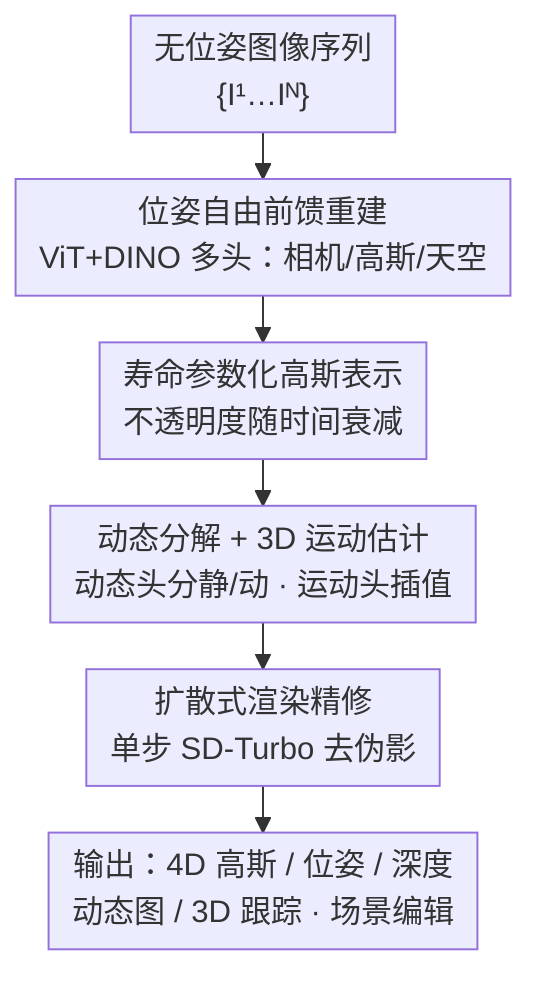

# DGGT: Feedforward 4D Reconstruction of Dynamic Driving Scenes using Unposed Images

**会议**: CVPR 2026  
**论文**: [CVF Open Access](https://openaccess.thecvf.com/content/CVPR2026/html/Chen_DGGT_Feedforward_4D_Reconstruction_of_Dynamic_Driving_Scenes_using_Unposed_CVPR_2026_paper.html)  
**代码**: https://github.com/xiaomi-research/dggt (有)  
**领域**: 自动驾驶 / 3D视觉  
**关键词**: 4D重建, 前馈高斯泼溅, 无位姿重建, 动态场景, 自动驾驶仿真

## 一句话总结
把"相机位姿"从输入变成输出，用一个 ViT 多头网络一次前向就从**无位姿**的稀疏图像直接重建出动态驾驶场景的 4D 高斯表示（含位姿、深度、动态图、3D 运动），再用单步扩散精修渲染，在 Waymo 上达到 27.41 PSNR、单场景 0.39 秒，且支持任意输入帧数和跨数据集零样本迁移。

## 研究背景与动机

**领域现状**：自动驾驶要大规模训练和评测感知/规划栈，就需要把海量原始驾驶日志快速变成"可编辑、可重渲染"的场景表示（4D 重建 + re-simulation）。现有动态场景重建主流是 NeRF/3DGS 类方法，分两派：一派把时间当显式输入（如 PVG 的周期振动信号），另一派把场景建成"场景图"，每个动态物体单独建模。

**现有痛点**：第一派缺乏物体级解耦表示，做不了"删车/加人"这类编辑；第二派虽能物体级操作，但依赖外部 3D 标注（如包围框），获取成本高。更致命的是，绝大多数方法都是**逐场景优化**（per-scene optimization），重建一个场景要十几分钟到半小时（EmerNeRF 14min、DeformableGS 29min），根本没法当成日志预处理的常规步骤。

**核心矛盾**：前馈（feedforward）方法是出路——训练一个网络，一次前向就能泛化到新场景、实时推理。但现有前馈 3DGS（MVSplat、NoPoSplat、DepthSplat）只能重建**静态**场景；唯一面向动态驾驶的前馈方法 STORM 又有两个硬伤：① 仍然**需要相机位姿**作为输入，② 被**固定且短的输入帧窗口**约束，长序列会退化。把位姿当输入这件事本身就限制了跨数据集、无标定部署的灵活性。

**本文目标**：做一个既前馈、又能处理动态、还能扩展到任意序列长度、且完全不需要位姿输入的 4D 重建框架。

**切入角度**：作者的高层设计哲学是"一次前向预测整个 4D 场景状态，同时干净地把静态背景和运动物体分开、并保持时序一致"。关键的观念转变是——**把相机位姿重新表述为模型的输出而非前提**。

**核心 idea**：用一个共享 ViT 主干 + 多个预测头，把"位姿 / 像素对齐高斯 / 动态图 / 3D 运动"全部当成网络输出一次性预测；再用寿命参数稳住静态区随时间的外观变化、用显式 3D 运动场做稀疏时间戳之间的插值，最后用单步扩散精修去除插值伪影。

## 方法详解

### 整体框架

DGGT 的输入是一段**无位姿**的 RGB 图像序列 $\{I^t\}_{t=1}^N$，目标是一次前向输出时序一致的 4D 表示。整条流水线分四步走：① **位姿自由前馈重建**——ViT 主干融合 DINO 特征后分发给多个头，同时吐出每帧相机参数、像素对齐高斯图、寿命参数；② 高斯表示里给每个 primitive 加一个**寿命参数**，让它的不透明度随时间衰减，专门吃下静态区的外观变化；③ **动态分解 + 3D 运动**——动态头把高斯分成静态/动态两部分，运动头预测稠密 3D 位移，用来在稀疏时间戳之间插值出中间帧的动态高斯；④ **扩散式渲染精修**——单步扩散网络拿渲染图 + 一张参考图，去掉鬼影和遮挡空洞。整套设计天然支持任意输入帧数、任意长序列，无需重标定或逐场景优化，且因为高斯被显式分解成动静两部分，可以在高斯层面直接做"删车/加车/移车"的实例级编辑。

### 关键设计

**1. 位姿自由的前馈重建：把相机位姿从"前提"改成"输出"**

现有前馈方法把位姿当必需输入，导致无标定场景、跨数据集部署很受限，而且驾驶日志要先跑一遍 SfM/标定才能用。DGGT 直接让网络预测位姿：用 ViT 主干把输入图像切 patch、过 DINO 预训练特征提取器得到 $F_{\text{dino}}$，再经交替注意力（alternating attention）细化成 $F_{\text{attn}}$，然后分发给多个头——相机头 $H_{\text{cam}}$ 出每帧内外参 $\Pi^t = H_{\text{cam}}(F_{\text{attn}})$，高斯头 $H_{\text{gs}}$ 出像素对齐高斯，寿命头 $H_{\text{life}}$ 出寿命参数，还有专门处理远景天空的轻量天空头 $H_{\text{sky}}$。第一帧 $I^1$ 的相机原点被指定为世界坐标原点，后续帧都对齐到它，保证跨时间 3D 位置一致。

一个关键观察是：$F_{\text{attn}}$ 主要编码高层语义、缺乏外观重建所需的细节，所以高斯头不只吃 $F_{\text{attn}}$，而是把它和原始 DINO 特征**融合**后再用，即 $G^t = H_{\text{gs}}(F_{\text{dino}}, F_{\text{attn}})$，补回空间保真度。天空部分单独处理：在固定半径 $r_{\text{sky}}$ 的半球上均匀采一组天空高斯，投影到图像取像素颜色作初值，再用轻量 MLP $H_{\text{sky}}$ 精修。训练时冻结特征提取器和相机头（复用预训练先验），其余头从头训。位姿自由的设计还带来一个意外收益——作者把跨数据集的强泛化归功于此：不依赖显式位姿，模型就不会过拟合到某个数据集特有的轨迹模式或相机配置，从而缩小 domain gap。

**2. 寿命参数化的高斯表示：让静态高斯也能表达随时间变化的外观**

每帧场景用像素对齐高斯图 $G^t \in \mathbb{R}^{H\times W\times 15}$ 表示，每个 primitive 除了常规的颜色 $c$、3D 位置 $\mu$、旋转四元数 $r$、尺度 $s$、不透明度 $o$ 之外，多了一个寿命参数 $\sigma^t \in \mathbb{R}^+$。它的作用是让一个高斯的不透明度随时间衰减——给定时刻 $t$ 预测的参数，在另一时刻 $t'$ 的不透明度为：

$$o^{t'} = o^t \cdot e^{-\frac{1}{2}\cdot\frac{(t'-t)^2}{\sigma^t}}$$

$\sigma$ 越大高斯在时间上存活越久，越小则衰减越快。痛点在于：驾驶场景里"静态"区域其实外观也在变（光照变化、车灯、阴影），如果一个静态高斯在整段序列里一成不变地累加，反而会让动态分解不稳定。寿命参数等于给每个高斯一个时间上的高斯衰减窗，让它只在自己"活着"的时间段内主导渲染，从而精确捕捉静态区的外观渐变。消融显示这是贡献最大的组件——去掉它 PSNR 从 27.41 直接掉到 24.21。

**3. 动态分解 + 显式 3D 运动插值：用运动场对齐稀疏时间戳间的动态物体**

直接把各帧高斯图跨时间累加，运动物体会产生鬼影（ghosting）。DGGT 加一个动态头 $H_{\text{dy}}$ 预测每像素属于动态区域的概率 $M_d^t = H_{\text{dy}}(F_{\text{attn}})$，据此把每帧高斯图分解为静态分量 $G_s^t = G^t \odot (1-M_d^t)$ 和动态分量 $G_d^t = G^t \odot M_d^t$。任意时刻 $t$ 的完整表示由"所有帧的静态高斯并集 + 当前帧动态高斯 + 天空高斯"组成：

$$\hat{G}^t = \left(\bigcup_{t'=1}^{N} G_s^{t'}\right) \cup G_d^t \cup G_{\text{sky}}$$

再经可微渲染器 $\hat{I}^t = \text{Renderer}(\hat{G}^t, \Pi^t)$ 出图。难点是输入时间戳很稀疏，中间时刻 $t_i$ 没有现成的动态高斯。和只建模高斯速度的 STORM 不同，DGGT 用一个 transformer 运动头 $H_{\text{motion}}$ 显式预测**完整 3D 运动轨迹**：对一对时刻 $(t_a, t_b)$ 估计查询像素的 3D 位移 $F(t_a, t_b)\in\mathbb{R}^{q\times3}$，做法是把图像编码成多尺度特征、和高斯图里的 3D 点关联成时空特征云，对动态图中值为 1 的像素反投影初始化 3D 位置、再用邻域到邻域注意力迭代细化轨迹。有了 3D 运动，中间时刻动态高斯的均值坐标按线性插值得到 $\mu_d^{t_i} = \mu_d^{t_a} + \omega^{t_i}\cdot F(t_a, t_b)$（$\omega^{t_i} = \frac{t_i - t_a}{t_b - t_a}$）；相机位姿则平移做线性插值、旋转用四元数 SLERP。显式 3D 轨迹比只建速度能更准地捕捉非线性运动，这也是它 3D 跟踪 EPE3D 0.183m 远超 STORM 0.276m 的原因。

**4. 扩散式插值精修：用单步扩散修掉运动插值留下的鬼影和空洞**

即便运动场给出了合理的物体动态，插值结果仍会有鬼影和**遮挡暴露**（disocclusion gap）伪影——源于运动估计偏差和 3DGS 在大旋转/平移下的脆弱性。DGGT 在渲染后加一个图像空间精修阶段：基于单步扩散框架（SD-Turbo），由冻结 VAE 编码器、UNet 去噪器、LoRA 微调的解码器组成。给定渲染图 $\hat{I}^{t_i}$ 和从输入序列里**随机采**的一张参考图 $I_{\text{ref}}$，把两者按帧拼接编码进隐空间，经 UNet 去噪、解码得到精修图 $\tilde{I}^{t_i} = f_{\text{diffusion}}(\hat{I}^{t_i}, I_{\text{ref}})$。为保留预训练生成先验又能高效适配去伪影任务，只用 LoRA 微调 UNet 解码器、其余权重冻结，保证快速推理。训练数据是从 798 个 Waymo 场景里整理的约 2000 个含伪影片段，损失为重建 $\ell_2$ + LPIPS + 基于 VGG-16 Gram 矩阵的风格损失（增强锐度细节）。值得注意：这一步在 PSNR/SSIM 上数值收益很小（27.32→27.41），但定性上明显去掉了天空和动态物体的伪影、补回缺失内容——因为 PSNR/SSIM 看逐像素保真，而扩散修的是结构性缺陷，对下游编辑和稀疏输入鲁棒性提升明显，所以作者保留它。

### 损失函数 / 训练策略
前馈重建端到端训练（含运动头）。每次迭代随机采 $N\in[4,8]$ 张输入图 + $2N$ 张 GT 目标图，模型预测 $2N$ 张插值帧做监督。重建损失 $\mathcal{L}_{\text{rgb}} = \mathcal{L}_{\ell_2} + \lambda_{\text{LPIPS}}\mathcal{L}_{\text{LPIPS}}$；不透明度和动态图用 BCE 监督 $\mathcal{L}_{\text{opacity}} = \mathrm{BCE}(M_{\text{sky}},\hat{M}_{\text{sky}})$、$\mathcal{L}_{\text{dynamic}} = \mathrm{BCE}(M_d,\hat{M}_{\text{dynamic}})$；寿命参数施加 $\ell_1$ 正则 $\mathcal{L}_{\text{lifespan}} = \lVert\frac{1}{\sigma}\rVert_1$（假设场景大部分是静态）。总目标为各项加权和 $\mathcal{L}_{\text{feedforward}} = \mathcal{L}_{\text{rgb}} + \lambda_{\text{opacity}}\mathcal{L}_{\text{opacity}} + \lambda_{\text{dynamic}}\mathcal{L}_{\text{dynamic}} + \lambda_{\text{lifespan}}\mathcal{L}_{\text{lifespan}}$。扩散模块单独训练。

## 实验关键数据

### 主实验

Waymo 上的 4D 重建对比（3 视角、插值中间帧）。DGGT 在质量上全面领先，速度仍有竞争力（0.39s vs 优化类十几到几十分钟）：

| 方法 | PSNR↑ | SSIM↑ | D-RMSE↓ | 推理时间 | 动态 | 无位姿 |
|------|-------|-------|---------|---------|------|--------|
| EmerNeRF | 24.51 | 0.738 | 33.99 | 14min | ✓ | ✗ |
| DeformableGS | 25.29 | 0.761 | 14.79 | 29min | ✓ | ✗ |
| NoPoSplat | 24.31 | 0.751 | 9.08 | 23.22s | ✗ | ✓ |
| DepthSplat | 23.26 | 0.696 | 10.05 | 0.11s | ✗ | ✗ |
| STORM | 26.38 | 0.794 | 5.48 | 0.18s | ✓ | ✗ |
| VGGT++ | 22.50 | 0.749 | 3.80 | 0.24s | ✗ | ✓ |
| **DGGT (本文)** | **27.41** | **0.846** | **3.47** | 0.39s | ✓ | ✓ |

跨数据集泛化（仅在 Waymo 训练做零样本，或在目标集上训练）——零样本就大幅超过 STORM：

| 方法 | 设置 | nuScenes PSNR↑ | Argoverse2 PSNR↑ |
|------|------|----------------|------------------|
| STORM | 零样本 | 17.77 | 20.83 |
| **DGGT** | 零样本 | **25.31** | **26.34** |
| STORM | 训练 | 24.54 | 24.97 |
| **DGGT** | 训练 | **26.63** | **26.96** |

3D 运动估计（Waymo Scene Flow），全指标 SOTA：

| 方法 | EPE3D(m)↓ | Acc5(%)↑ | Acc10(%)↑ | θ(rad)↓ |
|------|-----------|----------|-----------|---------|
| STORM | 0.276 | 81.12 | 85.61 | 0.658 |
| **DGGT** | **0.183** | **85.42** | **90.42** | **0.328** |

### 消融实验

| 配置 | PSNR↑ | SSIM↑ | LPIPS↓ | 说明 |
|------|-------|-------|--------|------|
| w/o lifespan | 24.21 | 0.774 | 0.169 | 去掉寿命参数，掉 3.2 PSNR（贡献最大）|
| w/o diffusion | 27.32 | 0.844 | 0.108 | 去掉扩散精修，数值掉得少但定性差 |
| **Full** | **27.41** | **0.846** | 0.109 | 完整模型 |

输入视角数鲁棒性（NVS 列，DGGT 随视角增加稳定，STORM 急剧退化）：

| 方法 | 4 视角 | 8 视角 | 16 视角 |
|------|--------|--------|---------|
| STORM | 26.05 | 25.44 | 22.98 |
| **DGGT** | **27.41** | **27.74** | **28.14** |

### 关键发现
- **寿命参数是头号功臣**：去掉它 PSNR 直接掉 3.2（27.41→24.21），因为它负责捕捉静态区随时间的外观变化（如光照），没有它静态高斯无法建模这些细微变化，重建变得不稳定。
- **扩散精修是"定性 > 定量"的典型**：PSNR/SSIM 只涨一点点，但 PSNR/SSIM 偏逐像素保真，而扩散修的是结构性缺陷、补缺失内容（天空、动态物体伪影、编辑后的空洞），对下游可用性提升明显，所以保留。
- **可扩展性是相对 STORM 的硬优势**：16 视角时 STORM 掉到 22.98，DGGT 反而升到 28.14，长序列不退化。
- **零样本泛化归功于位姿自由设计**：不依赖显式位姿就不会过拟合数据集特有的轨迹/相机配置，零样本 PSNR 比 STORM 高 7~8 个点。

## 亮点与洞察
- **"位姿即输出"是最核心的观念翻转**：把相机位姿从必需输入改成网络预测的输出，一举解决了无标定部署、跨数据集泛化、任意帧数三个问题——既是工程便利也是泛化的根源，思路可迁移到任何依赖 SfM 预处理的重建任务。
- **寿命参数用一个高斯时间衰减窗优雅地处理"静态区也在变"**：这是动态场景重建里常被忽略的细节，单参数 $\sigma$ 既稳住了动静分解又捕捉了外观渐变，性价比极高。
- **显式 3D 运动轨迹 vs 只建速度**：建完整轨迹（而非 STORM 的瞬时速度）让稀疏时间戳间的非线性运动插值更准，3D 跟踪 EPE3D 几乎砍半，这个"建什么量"的选择很值得借鉴。
- **高斯层面的动静解耦天然支持实例编辑**：删车/移车/插入其他场景的车与骑行者，无需重训，再用扩散修补空洞——把"重建"和"仿真编辑"在一个表示里打通。

## 局限与展望
- **作者承认的局限**：当动态掩码不准、或在重度遮挡运动下跟踪失败时，会出现失败案例。未来工作聚焦于改进动态建模和提升跟踪鲁棒性。
- **自己发现的局限**：① 整套精修依赖一个单独在 Waymo ~2000 片段上训的扩散模型，跨数据集/跨相机的精修泛化未充分验证；② 动态分解、运动估计、扩散精修都强依赖动态掩码质量，掩码错了误差会沿流水线放大；③ 主结果多为 3 视角、20 帧设置，更极端稀疏（如单视角）下的表现只在 teaser 图里示意，缺系统量化；④ 寿命参数的 $\ell_1$ 正则假设"场景大部分静态"，在拥堵/路口多动态物体场景下这个先验可能偏弱。
- **改进思路**：把扩散精修也做成跨数据集自适应（而非单 Waymo 训练）；引入动态掩码的不确定性估计，让下游对错误掩码更鲁棒。

## 相关工作与启发
- **vs STORM（ICLR 2025）**：都是前馈动态驾驶场景重建，但 STORM 需要位姿输入、被固定短窗口约束、只建高斯速度，长序列退化；DGGT 位姿自由、支持任意帧数、建完整 3D 运动轨迹 + 寿命参数 + 扩散精修，质量和可扩展性全面超越（16 视角 28.14 vs 22.98）。
- **vs NoPoSplat / DepthSplat / MVSplat**：同为前馈 GS 且部分无位姿，但都只能重建**静态**场景，捕捉不了动态物体；DGGT 通过动态头+运动头把动态吃进来。
- **vs EmerNeRF / DeformableGS（优化类）**：优化类逐场景要十几到几十分钟，DGGT 单次前向 0.39 秒，且质量更高，适合做日志预处理的常规步骤。
- **vs PVG / 场景图类方法**：PVG 缺物体级解耦表示做不了编辑；场景图类需外部 3D 标注（包围框）；DGGT 用动态图自动解耦动静、无需标注即可实例级编辑。

## 评分
- 新颖性: ⭐⭐⭐⭐⭐ "位姿即输出 + 寿命参数 + 显式 3D 运动 + 扩散精修"四件套，把前馈动态驾驶重建推进了一大步
- 实验充分度: ⭐⭐⭐⭐ 三大数据集 + 零样本 + 视角扩展 + 跟踪 + 编辑都有，但稀疏/单视角的系统量化偏弱
- 写作质量: ⭐⭐⭐⭐ 动机与方法讲得清晰，公式齐全，框架图到位
- 价值: ⭐⭐⭐⭐⭐ 0.4 秒把驾驶日志变成可编辑 4D 场景，对自动驾驶 re-simulation 是很实用的基础设施

<!-- RELATED:START -->

## 相关论文

- [\[CVPR 2026\] Unposed-to-3D: Learning Simulation-Ready Vehicles from Real-World Images](unposed-to-3d_learning_simulation-ready_vehicles_from_real-world_images.md)
- [\[AAAI 2026\] Understanding Dynamic Scenes in Egocentric 4D Point Clouds](../../AAAI2026/autonomous_driving/understanding_dynamic_scenes_in_ego_centric_4d_point_clouds.md)
- [\[AAAI 2026\] LiDARCrafter: Dynamic 4D World Modeling from LiDAR Sequences](../../AAAI2026/autonomous_driving/lidarcrafter_dynamic_4d_world_modeling_from_lidar_sequences.md)
- [\[CVPR 2026\] TopoHR: Hierarchical Centerline Representation for Cyclic Topology Reasoning in Driving Scenes with Point-to-Instance Relations](topohr_hierarchical_centerline_representation_for_cyclic_topology_reasoning_in_d.md)
- [\[CVPR 2026\] GenieDrive: Towards Physics-Aware Driving World Model with 4D Occupancy Guided Video Generation](geniedrive_towards_physics-aware_driving_world_model_with_4d_occupancy_guided_vi.md)

<!-- RELATED:END -->
