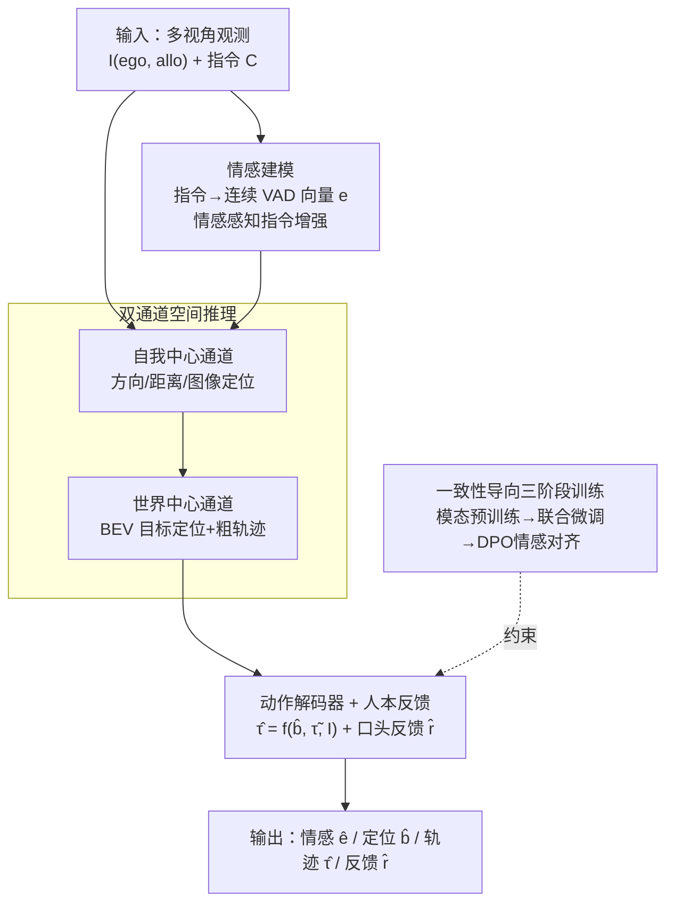

# E3AD: An Emotion-Aware Vision-Language-Action Model for Human-Centric End-to-End Autonomous Driving

**会议**: CVPR 2026  
**论文**: [CVF Open Access](https://openaccess.thecvf.com/content/CVPR2026/html/Tang_E3AD_An_Emotion-Aware_Vision-Language-Action_Model_for_Human-Centric_End-to-End_Autonomous_Driving_CVPR_2026_paper.html)  
**代码**: 无  
**领域**: 自动驾驶 / 视觉-语言-动作  
**关键词**: 情感感知, VLA, 端到端自动驾驶, VAD情感空间, DPO偏好对齐  

## 一句话总结
E3AD 把"乘客情感"塞进端到端自动驾驶的 VLA 框架：用连续的 Valence-Arousal-Dominance（VAD）情感空间从自然语言指令里读出语气与紧迫度，配合双通道（自我中心+世界中心）空间推理，再用一致性导向的三阶段训练（含 DPO 情感-动作对齐）让规划轨迹既听懂"说什么"又听懂"怎么说的"，在视觉定位、情感估计和轨迹规划上全面超过 SOTA。

## 研究背景与动机
**领域现状**：端到端自动驾驶（E2E AD）正从模块化流水线走向 Vision-Language-Action（VLA）范式——把感知、预测、规划统一进一个多模态大模型，直接从传感器输入映射到车辆控制。这一范式效率高、泛化好。

**现有痛点**：但现有 VLA 自动驾驶模型几乎都是"情感无感知"的：它们只做闭环理性控制，把指令当成纯语义来解析，完全忽略乘客的情绪状态。问题是，"stop here" 和 "stop here now!" 在语义上几乎一样，但后者携带的紧迫感应该让车辆做出不同响应。乘客对把决策交给一个"不理会人类意图与情绪"的黑盒算法天然不安，而大量行为学研究都指出情感交互恰恰是用户舒适感和信任感的关键决定因素。作者把这种"计算推理"与"情感理解"之间的脱节称为自动驾驶的 **emotion gap（情感鸿沟）**。

**核心矛盾**：现有第三类 VLA 方法（VLM 感知 + 专门规划模块直接出轨迹，性能最强）有两个根本缺陷——一是**空间理解弱**，基本只在 2D 里推理，没有显式的 3D 或地图级（allocentric）空间认知；二是**纯理性的序列预测视角**，把情感完全丢掉。

**本文目标**：定义并求解 Open-Domain End-to-End AD（OD-E2E）任务——车辆要解析自由形式自然语言指令，推断其中的情感，并规划一条物理可行、且与乘客情感意图一致的轨迹，同时联合做语义、情感、空间三方面推理。

**切入角度**：作者从认知科学借了两个工具。其一是情感心理学里的连续 VAD 模型（效价-唤醒-支配三维向量），用它取代"开心/愤怒/悲伤"这种粗粒度离散标签，才能捕捉细微但影响行为的语气变化。其二是人类空间感知的双系统模型——人导航时会把第一人称观察（egocentric）和脑中的认知地图（allocentric）结合起来。

**核心 idea**：用一个 VAD 情感向量同时去引导"指令歧义消解"和"轨迹规划生成"，并通过一致性导向的微调让情感与驾驶行为对齐——把自动驾驶从"情感识别"推进到"情感驱动的人本规划"。

## 方法详解

### 整体框架
E3AD 建立在 Qwen2.5-VL-7B-Instruct 之上，输入是多视角观测 $I=\{I_{\text{ego}}, I_{\text{allo}}\}$（自我中心视图 + 世界中心 BEV 视图）和一条自然语言指令 $C$，输出是一条统一自回归链 $(\hat{e}, \hat{b}, \hat{\tau})$——预测的情感状态 $\hat{e}$、定位到的目标 $\hat{b}$、未来轨迹点 $\hat{\tau}$，外加一段面向乘客的口头反馈 $\hat{r}$。整个系统由三大模块组成：**情感建模**（把指令编码进连续 VAD 空间）、**双通道空间推理**（融合自我中心与世界中心线索）、**一致性导向的动作规划**（动作解码器 + 情感感知反馈）。这三者通过一个三阶段训练策略串起来：先分模态预训练打底、再联合微调统一成单次前向、最后用 DPO 做情感-动作对齐。关键在于把语言定位（grounding）从"辅助感知任务"提升为端到端决策目标的核心一环——情感 $\hat{e}$ 和定位 $\hat{b}$ 会直接喂给后面的轨迹生成，形成一条"情感感知的思维链"。

### 关键设计

**1. 连续 VAD 情感建模 + 情感感知指令增强：让模型读懂"怎么说的"而非只读"说什么"**

现有系统要么完全忽略情感，要么用"happy/angry/sad"几个离散标签，无法捕捉那种"小但行为上有意义"的语气变化。E3AD 改用连续的 Valence-Arousal-Dominance 模型，把情感表示为 $e\in\mathbb{R}^3$：valence 衡量正负态度（平静 vs 焦虑）、arousal 衡量激活/警觉度（疲惫 vs 警醒）、dominance 衡量掌控感（自信 vs 不知所措）。VAD 标签从两个来源融合得到：先用 GoEmotions 分类器得到指令在离散情感上的分布，再用 label-VAD 字典映射成句子级 VAD；同时去掉停用词、对剩余 token 的词级 VAD 分数取平均得到词级向量；两者结合，使全局语义和"带情感的关键短语"都能反映出来。

但这里有个致命陷阱：驾驶指令大多情感中性，朴素训练会让模型直接忽略情感。作者用**情感感知指令增强**破解：对每条指令 $C^{(i)}$，让 Qwen2.5-VL 生成 $K$ 个改写 $C^{(i)}_{aug}=\{C^{(i)}_1,\dots,C^{(i)}_K\}$，它们**保持驾驶目标不变、只改变态度或强度**，每个改写再用同样流程打 VAD 标签。这就构造出一簇"语义等价但情感不同"的邻域，逼着模型把 $e$ 的变化归因到语气而非意图。训练时把情感预测当成条件生成（而非外挂一个情感回归头），损失为

$$\mathcal{L}_{\text{emo}} = -\mathbb{E}_{(C^{(i)}_k, e^{(i)}_k)\sim \mathcal{C}^*}\big[\log p_\theta(e^{(i)}_k \mid C^{(i)}_k)\big]$$

这样情感 $e$ 就嵌进和其他输出同一条生成推理链里，能既表达细粒度情感漂移、又把底层意图固定住，并直接用推断出的情感去调控规划行为。

**2. 双通道空间推理：用人类的"自我中心+世界中心"双系统补齐 VLA 的空间盲区**

针对现有 VLA "基本在 2D 里推理、缺 3D/地图级认知"的痛点，E3AD 仿照人类空间感知的双系统模型，让骨干在两条互补的空间通道上推理。**自我中心通道**捕捉第一人称感知场：从 $(I_{\text{ego}}, C)$ 预测到目标的相对 3D 方向、距离、以及图像坐标里的定位，提供精细的短程空间线索（直接支撑即时控制），用约 30K 样本训练。**世界中心通道**编码一张类似认知地图的世界级表示：给定 BEV 输入 $I_{\text{allo}}$，预测目标在 BEV 坐标里的位置，并从自车位姿到目标生成一条粗轨迹 $\tilde{\tau}=\{y_t\}_{t=1}^T$，提供长程结构、道路拓扑、遮挡和多智能体布局等地图一致的先验，用约 17K 样本训练。两条通道一个管"局部、动作导向"、一个管"全局、地图结构"，合在一起给下游规划在杂乱、部分可观测场景下做定位和轨迹生成提供互补的局部+全局线索。

**3. 动作解码器 + 人本口头反馈：把高层语义落成可执行轨迹，并消解乘客的"黑盒焦虑"**

VLA 骨干出的是高层 token，需要变成精确可执行的轨迹。E3AD 在骨干后接一个轻量动作解码器 $f_{act}$，以定位目标 $\hat{b}$、粗轨迹 $\tilde{\tau}$ 和视觉观测 $I$ 为条件输出最终轨迹 $\hat{\tau}=f_{act}(\hat{b}, \tilde{\tau}, I)$，$\hat{\tau}\in\mathbb{R}^{T\times2}$ 是各路点的空间坐标。更有特色的是**人本口头反馈** $\hat{r}$：规划完路点后，用训练好的 Qwen2.5-VL 骨干、在结构化 prompt 引导下，以完整 pipeline 输出（情感 $\hat{e}$、目标 $\hat{b}$、路点 $\hat{\tau}$）为条件生成一段反馈。反馈策略会随情感和紧迫度调整语气、长度和具体程度——平静状态给简短确认，高唤醒状态给直接、时间敏感的指引。这个情感感知反馈闭环把自动驾驶车从一个不透明工具变成一个有共情的人本智能体。

**4. 一致性导向的三阶段训练（含 DPO 情感-动作对齐）：从单条真值轨迹里"造"出偏好对，强制行为与情感意图一致**

训练分三步渐进式注入能力。**Stage-1 模态预训练**：分别用监督微调装备情感与空间感知——情感建模在增强数据集 $\mathcal{C}^*$ 上用 $\mathcal{L}_{\text{emo}}$ 训练，空间推理在合成的自我/世界中心数据上用下一 token 预测的负对数似然 $\mathcal{L}_{\text{spatial}}$ 训练。**Stage-2 联合微调**：把这些能力统一成单次前向的连贯推理，模型自回归预测完整序列 $T=(\hat{e},\hat{b},\hat{\tau})$，损失为

$$\mathcal{L}_{\text{Joint}} = -\mathbb{E}_{(I,C,T)}\sum_{t=1}^{|T|}\log p_\theta(T_t\mid T_{<t}, I, C)$$

让 VLA 形成"先情感、再定位、后路点"的情感感知思维链。**Stage-3 情感-动作对齐（DPO）**：联合损失只对齐了任务、没强制行为对不同情感意图保持一致。难点在于自动驾驶数据集对每条指令通常只有一条真实轨迹 $\tau^{(i)}$，没有现成的偏好排序对。作者用情感增强造伪偏好对：对每条指令找出 VAD 嵌入偏离原指令最远的增强变体作为"负指令"

$$C^{(i)}_{k^-} = \arg\max_k \|e^{(i)}_k - e^{(i)}\|_2, \quad \tilde{\tau}^{(i)}_{k^-} \sim p_\theta(\tau\mid C^{(i)}_{k^-}, I^{(i)})$$

用它生成一条被嫌弃的、情感漂移的轨迹 $\tilde{\tau}^{(i)}_{k^-}$，从而得到偏好对 $(\tau^{(i)}\succ\tilde{\tau}^{(i)}_{k^-})$，再用 DPO 优化：

$$\mathcal{L}_{\text{dpo}} = -\mathbb{E}_i\Big[\log\sigma\Big(\beta\big(\log p_\theta(\tau^{(i)}\mid C^{(i)}) - \log p_\theta(\tilde{\tau}^{(i)}_{k^-}\mid C^{(i)})\big)\Big)\Big]$$

这鼓励模型给"与原指令意图一致的轨迹"更高似然、压制被情感扰动的替代轨迹，得到稳定又情感感知的驾驶行为。

### 一个完整示例
给定一条中性指令 "Tom is right ahead. Let's get there!"，E3AD 在 `<EmoThink>` 块里先估出 VAD ≈ (0.59, 0.36, 0.51)，判断乘客"中等积极、有动力、轻微兴奋"，据此规划一条标准的前进轨迹，并在 `<Feedback>` 块给出简短确认 "Got it! Tom's just ahead, let's move steadily forward. All under control!"。而在 case study 里，同一意图的指令加上 "Be more cautious" 后，VAD 从 (0.60, 0.39, 0.45) 漂移到 (0.60, 0.49, 0.51)（arousal 和 dominance 升高），DPO 对齐后的策略就**直接放弃了变道动作**、改走更保守的路径，反馈也变成安抚性解释。这说明情感监督不只改语言、还实打实地改了运动几何：固定意图下，高唤醒推动更直、横向摆动更少、避险更早；低唤醒则更慢接近、留更大安全裕度。

## 实验关键数据

### 主实验
在 Talk2Car、DrivePilot、MoCAD、Talk2Car-Trajectory 等真实数据集上评测，并按 ThinkDeeper 协议引入 Long-Text 和 Corner-Case 两个挑战子集。骨干固定为冻结的 Qwen2.5-VL-7B，只训 LoRA（rank 16, scale 32），可训参数预算不大于 baseline——增益主要来自方法本身而非模型规模。

端到端轨迹规划（vs 最强 baseline PTPC）：

| 指标 | E3AD | 之前SOTA(PTPC) | 提升 |
|--------|------|----------|------|
| ADE ↓ | 3.88 | 4.54 | 17.01% |
| Fréchet ↓ | 7.23 | 8.55 | 18.26% |
| SSPD ↓ | 1.86 | 2.18 | 17.20% |
| DTW ↓ | 60.07 | 72.09 | 16.67% |
| FDE ↓ | 6.64 | 7.75 | 20.00% |
| PA2 ↑ | 36.21 | 24.46 | 16.71% |
| PA4 ↑ | 55.62 | 45.55 | 18.10% |

值得注意的是通用大模型（Qwen2.5-VL-72B、Qwen3-VL-8B）在此任务上表现很差（ADE 12~14、PA2 仅 1~2%），印证"任务对齐的结构和目标比裸算力更重要"。

视觉定位（vs 最强 baseline CAVG，IoU）：Talk2Car +6.86%、MoCAD test/val +10.50%/+8.72%、DrivePilot +6.79%/+7.36%；在 corner-case（遮挡/多智能体/歧义）上 +8.26%/+6.95%/+7.48%，在 Long-text 上更是 +11.63%——挑战场景增益尤为突出。

情感识别（Spearman ρ / Kendall τ，与真值 VAD 的相关性）：E3AD 在 valence/arousal/dominance 上达 0.95/0.84、0.94/0.82、0.94/0.81，远超最好的 Qwen3-Emb-4B+Ridge（0.83/0.64 一档）；而直接用 Qwen2.5-7B 几乎是随机相关（0.11/0.08）。空间推理上，E3AD 目标定位 MAE 仅 0.47（Qwen2.5-VL-72B 为 10.1）、深度 MAE 4.25（72B 为 22.68），PA2 达 97.7%（定位）/53.1%（深度）。

### 消融实验
视觉定位（Talk2Car / 各挑战集 IoU）：

| 配置 | T2C | Constr. | Ambg. | Long | 说明 |
|------|------|---------|-------|------|------|
| Full model | 80.12 | 76.62 | 77.05 | 77.86 | 完整模型 |
| w/o 自我中心 | 74.48 | 71.60 | 72.24 | 72.47 | 掉点最多(↓7.0% T2C)，第一人称定位最关键 |
| w/o 世界中心 | 76.48 | 73.92 | 74.65 | 74.76 | 移除全局空间语义/拓扑 |
| w/o 情感建模 | 78.78 | 74.41 | 73.57 | 74.12 | 歧义/长文本上掉得最多 |
| w/o DPO | 79.55 | 75.58 | 77.09 | 76.44 | 提升温和 |

轨迹规划（ADE/FDE）消融里则是**世界中心通道最关键**：去掉它 ADE/FDE 涨 10.0%/10.1%，说明全局先验对空间感知和路线一致性的价值。

### 关键发现
- **不同子任务的"命门"不同**：视觉定位最依赖自我中心通道（去掉掉 7% IoU），而轨迹规划最依赖世界中心通道（去掉 ADE/FDE 涨 10%）——双通道确实在做互补的事，不是冗余。
- **情感建模的收益集中在"难"指令上**：在歧义和长文本指令上贡献最大（↑4.5%/↑4.8%），印证它主要帮模型读懂细微/情感丰富的语言线索。
- **DPO 的数值增益温和但改变了运动几何**：高 arousal 对应更直、更平滑的运动，低 arousal 对应更谨慎、更弯曲的运动——即便数字提升不大，DPO 实质增强了"情感-轨迹一致性"。
- 任务对齐结构 > 裸算力：7B 的 E3AD 全面碾压 72B 通用 VLM。

## 亮点与洞察
- **把心理学的连续 VAD 空间工程化进 VLA**：用三维连续向量取代离散情感标签，并把它当成生成链里的一个 token 而非外挂回归头，既能表达细微语气、又天然和规划耦合——这是"情感真正影响动作"而非"情感只是个旁路标签"的关键。
- **"情感增强造伪偏好对"巧解 DPO 数据缺失**：自动驾驶数据每条指令只有一条真值轨迹，没法直接做偏好学习；作者用"VAD 偏离最远的增强变体生成负轨迹"凭空造出偏好对，这个 trick 可迁移到任何"只有单条正样本、却想做偏好对齐"的回归/生成任务。
- **认知科学双系统直接落到模块设计**：egocentric/allocentric 双通道不是噱头，消融显示两者对定位和规划各有不可替代的贡献，给"如何给 VLA 补 3D/地图空间认知"提供了一个清晰可复用的拆法。
- **人本口头反馈闭环**：随情感调节语气/长度的反馈把黑盒焦虑这一"非技术但人本"的痛点纳入系统设计，是少见的把"信任/接受度"显式做进 loss 之外的设计。

## 局限与展望
- **VAD 标签来自现成分类器+词典映射**：句子级 VAD 依赖 GoEmotions + label-VAD 字典，词级靠停用词过滤后平均，标签本身的噪声/偏差会传导到整个情感监督，论文未深究标签质量上限。
- **情感增强用 Qwen2.5-VL 自我生成改写**：改写"保持目标不变只改语气"的假设由生成模型保证，若改写漂移了意图，伪偏好对就可能引入错误监督。
- **情感真值难界定**：VAD 真值本身来自映射而非人工逐条标注，"SOTA VAD 相关性"是相对这套伪标签而言，与真实乘客主观情感的吻合度仍待人因实验验证。
- **DPO 数值增益温和**：作者也承认 DPO 在数字上提升不大，主要体现在轨迹几何一致性上，其实际驾乘体验收益需要真人评测支撑。
- 改进方向：引入真实乘客生理/主观情感标注做闭环校准；把情感反馈做成可交互的多轮对话而非单向反馈。

## 相关工作与启发
- **vs 第一类"解说员"VLA（DriveGPT-4 / OpenEMMA / CoT-Drive）**: 它们用 QA 式 prompt 产出场景级解释、可解释性好，但缺精确空间定位和直接控制保真；E3AD 把 grounding 提升为决策目标核心，直接出可执行轨迹。
- **vs 第二类"元行为"VLA（Senna / VLP / LMDrive）**: 它们用 VLM 生成离散"元行为"指导底层控制器，只提供稀疏引导、连续空间推理能力受限；E3AD 在统一网络里直接做连续轨迹规划。
- **vs 第三类"VLM感知+规划模块"VLA（Simlingo / AutoVLA / FSDrive）**: 同属性能最强的第三类，但它们空间理解弱（基本 2D）、且纯理性忽略情感；E3AD 在此基础上补了双通道 3D/地图空间推理 + 情感建模，实验里 FSDrive-Finetuned 的 FDE（10.45）明显落后于 E3AD（6.64）。
- **vs 自动驾驶情感计算**: 早期工作多做驾驶员状态监测（疲劳/分心/压力）靠生理信号或面部/视线，且大多是"被动检测+离散标签、与下游控制解耦"；E3AD 是（据作者所知）第一个用 VAD 向量同时引导"歧义消解"和"轨迹生成"、并通过一致性微调把情感与驾驶行为对齐的框架。

## 评分
- 新颖性: ⭐⭐⭐⭐⭐ 首次把连续 VAD 情感建模深度耦合进端到端 VLA 自动驾驶，并定义 OD-E2E 新任务，情感增强造伪偏好对的 DPO 用法很巧。
- 实验充分度: ⭐⭐⭐⭐ 多数据集+多挑战子集、轨迹/定位/情感/空间四类任务全覆盖、消融清晰；唯情感真值依赖伪标签、缺真人主观评测。
- 写作质量: ⭐⭐⭐⭐⭐ 动机（情感鸿沟）讲得透，认知科学动机到模块设计的映射清晰，图文对照完整。
- 价值: ⭐⭐⭐⭐ 把"信任/接受度"这一人本痛点工程化进 VLA，对人机共驾、情感感知 agent 有较强迁移价值。

<!-- RELATED:START -->

## 相关论文

- [\[CVPR 2026\] DriveMoE: Mixture-of-Experts for Vision-Language-Action Model in End-to-End Autonomous Driving](drivemoe_mixture-of-experts_for_vision-language-action_model_in_end-to-end_auton.md)
- [\[CVPR 2026\] Percept-WAM: Perception-Enhanced World-Awareness-Action Model for Robust End-to-End Autonomous Driving](percept-wam_perception-enhanced_world-awareness-action_model_for_robust_end-to-e.md)
- [\[CVPR 2026\] EE-RL: Vision Language Guided Reinforcement Learning with Explorer and Expert model for End-to-End Autonomous Driving](ee-rl_vision_language_guided_reinforcement_learning_with_explorer_and_expert_mod.md)
- [\[CVPR 2026\] Scaling-Aware Data Selection for End-to-End Autonomous Driving Systems](scaling-aware_data_selection_for_end-to-end_autonomous_driving_systems.md)
- [\[CVPR 2026\] Counterfactual VLA: Self-Reflective Vision-Language-Action Model with Adaptive Reasoning](counterfactual_vla_self-reflective_vision-language-action_model_with_adaptive_re.md)

<!-- RELATED:END -->
