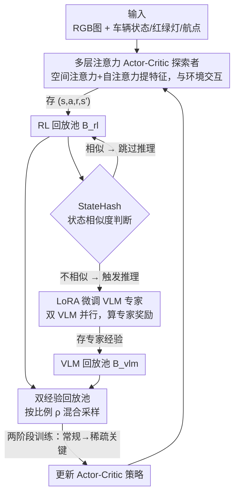

# EE-RL: Vision Language Guided Reinforcement Learning with Explorer and Expert model for End-to-End Autonomous Driving

**会议**: CVPR 2026  
**论文**: [CVF Open Access](https://openaccess.thecvf.com/content/CVPR2026/html/Li_EE-RL_Vision_Language_Guided_Reinforcement_Learning_with_Explorer_and_Expert_CVPR_2026_paper.html)  
**代码**: https://github.com/CAVTestLab/EE-RL  
**领域**: 自动驾驶 / 端到端驾驶  
**关键词**: 端到端自动驾驶, 强化学习, 视觉语言模型, 稀疏关键场景, 经验回放

## 一句话总结
EE-RL 用一个 RL「探索者」+ 两个 LoRA 微调的 VLM「专家」+ 双经验回放池组成端到端驾驶框架，让 VLM 专门为红灯、行人横穿这类「稀疏但要命」的场景生成奖励与经验，再配合 StateHash 跳过冗余 VLM 推理，在 CARLA Leaderboard 上把 Town03 的驾驶分和违规分各拉高约 20%，并在红灯闯行场景做到 0% 事故率。

## 研究背景与动机
**领域现状**：端到端自动驾驶把原始传感器数据直接映射到油门、转向等控制指令，主流是两条路线——模仿学习（IL，如 Transfuser、InterFuser、UniAD）和强化学习（RL，如 Roach、WOR）。近来视觉语言模型（VLM）兴起，「VLM 辅助 RL」成了热点：用 VLM 的语义推理能力给 RL 提供奖励标注或高层规划，缓解 RL 的稀疏奖励问题。

**现有痛点**：不管 IL 还是 RL，在 **sparse-critical scenarios（稀疏关键场景）**——即障碍物避让、行人横穿、红绿灯识别这类「出现频率低但一旦出错就是安全事故」的场景——表现都会明显退化。IL 受限于演示数据质量、泛化差；RL 苦于这些场景样本太少、奖励太稀疏，靠试错很难学会。

**核心矛盾**：稀疏关键场景的本质矛盾是「样本稀少 vs 需要精确决策」。RL 探索能覆盖到的经验里，这类场景占比极低，导致策略在常规驾驶上学得不错、却在关键时刻翻车。而直接让 VLM 全程参与又会被推理延迟拖垮——VLM 对每一帧都推理一次，根本喂不动 RL 的训练速度。

**本文目标**：拆成两个子问题——（1）如何让稀疏关键场景的经验「变密」，使 RL 学得动；（2）如何在不被 VLM 推理延迟卡死的前提下，持续产出高质量专家经验。

**切入角度**：作者借鉴 RL 里「behavior policy 负责探索、target policy 负责优化」的思路，把它升级成「探索者 + 专家」分工：RL 探索者负责常规场景的试错，VLM 专家专门盯着稀疏关键场景做语义推理、生成奖励。两路经验存进**两个独立的回放池**，混合采样去更新策略。

**核心 idea**：用「RL 探索者负责广度探索 + VLM 专家负责稀疏关键场景的语义推理与奖励」的协同范式，再用 StateHash 跳过相似状态上的重复 VLM 推理，把昂贵的专家经验「攒密」，从而专治端到端驾驶在安全关键场景下的崩盘。

## 方法详解

### 整体框架
EE-RL 的输入是单目 RGB 图像 + 自车运动状态（速度、油门、转向、红绿灯、航点），输出是连续的油门和转向指令。整套系统由三块协同：一个基于 actor-critic 的 **RL 探索者**实时和 CARLA 环境交互、把 $(s,a,r,s')$ 存入 RL 回放池 $B_{rl}$；一组**两个 VLM 组成的专家**从 $B_{rl}$ 取最新状态做语义推理、算专家奖励，存入 VLM 回放池 $B_{vlm}$，但每次推理前先用 **StateHash** 判断当前状态和历史是否高度相似、相似就跳过、不相似才真推理；最后**双经验回放池**按比例混合采样两路经验去更新 Actor-Critic 网络。训练分两个阶段：先在常规场景把基本驾驶学会，再加入稀疏关键事件、靠双回放池的混合批次专攻安全关键场景。

### 关键设计

**1. 探索者-专家协同范式 + 双经验回放池：让稀疏关键经验「变密」**

直接拿 RL 在稀疏关键场景里试错，等于在大海里捞针——这类经验占比太低，策略根本学不动。EE-RL 把学习拆成两路角色：**RL 探索者**（behavior policy）负责和环境交互、广度探索常规驾驶；**VLM 专家**（两个 VLM）专门对稀疏关键场景做语义推理、生成额外的「专家奖励」和经验。关键是用**两个独立的回放池** $B_{rl}$ 和 $B_{vlm}$ 分开存这两类经验，更新策略时从两者混合采样一个 batch，采样数由比例 $\rho$ 控制：

$$n_{rl}=\left\lceil\frac{\rho}{\rho+1}n\right\rceil,\quad n_{vlm}=n-n_{rl}$$

其中 $n$ 是总 batch size。这样每个训练批次里既有试错探索的经验、又有专家针对关键场景的高质量经验，二者平衡。智能体的总奖励也是「规则奖励 + 专家奖励」两部分相加 $r_t=r_t^r+r_t^e$，再归一化对齐量纲。这个设计的妙处在于：它没有让 VLM 去接管整个驾驶决策（那会被延迟和幻觉拖垮），而是只让 VLM 在最缺数据的稀疏关键场景里「补经验」，把昂贵的语义推理用在刀刃上。

**2. 多层注意力 Actor-Critic 主干：先把关键局部特征和跨模态信息抽对**

探索者要从单目 RGB + 多种车辆状态里做出精确控制，普通卷积编码容易丢掉红绿灯这种关键但小的局部信息。作者在 actor-critic 的视觉编码器里加了**两级注意力**。一是**空间注意力池化**，对五层卷积得到的图像嵌入 $z_{img}$ 先用 $1\times1$ 卷积 + Sigmoid 算空间注意力图，再加权自适应池化：

$$A_{spatial}=\mathrm{Sigmoid}(\mathrm{Conv}_{1\times1}(z_{img})),\quad f_{img}=\mathrm{AdaptiveAvgPool}(A_{spatial}\odot z_{img})$$

这一步强化对关键局部区域（如交通灯）的感知。二是**自注意力**，把图像、车辆状态、红绿灯状态、航点序列的多模态嵌入拼成联合特征 $h_0$，再做标准缩放点积注意力 $h'=\mathrm{Softmax}(QK^\top/\sqrt{d_k})V$ 融合跨模态信息。消融显示这是贡献最大的模块——去掉多层注意力后 CoR 从 3.72 暴涨到 9.36（恶化约 60%），因为图像比车辆运动学和航点携带的信息丰富得多，注意力机制是抽取这些关键特征的核心。

**3. StateHash：用图像 + 状态双相似度跳过冗余 VLM 推理**

VLM 推理慢，如果对每一帧都调用，专家经验的产出速度根本跟不上 RL 训练，延迟成了瓶颈。StateHash 的思路是：如果当前状态和历史某个已推理过的状态高度相似，就没必要再让 VLM 推一遍。它**分别**度量 RGB 图像相似度和车辆状态相似度，再加权合成：

$$S_{total}=0.7\,S_{image}+0.3\,S_{state}$$

图像侧用改进的感知哈希——把图像缩放平滑后，对 RGB 三通道**各自**做 2D 离散余弦变换（DCT），取左上角 $16\times16$ 低频块、按通道均值阈值二值化生成 256 位哈希，两图通道相似度用归一化汉明距离衡量，再按 $S_{image}=0.4S_R+0.4S_G+0.2S_B$ 加权（绿/蓝通道权重的差异化是为了对含红绿灯的场景更敏感）。状态侧对速度、油门、转向等连续量做带容差 $\tau_i$ 的归一化相似度、对挡位和红绿灯颜色等离散量做指示函数匹配，权重和为 1 且给速度、油门更大权重。实测：单 VLM 在 $10^6$ 步后只攒了约 8126 条专家经验，加上 StateHash 后跃升到约 53783 条；双 VLM 从 17733 涨到约 90566 条——StateHash 把省下的推理算力全用在了「攒密」专家经验上。

**4. LoRA 微调 VLM 专家 + 双 VLM 并行 + 两阶段课程训练：让专家可靠且学得稳**

通用 VLM 直接上场容易幻觉、推理不一致，无法当可靠的奖励来源。作者用自建的 CARLA 数据集（通过 DeepSeek-R1 标注构造）对 **Qwen2.5-VL-32B-Instruct** 做 LoRA 微调：只更新低秩适配器 $W\leftarrow W+BA$（$B\in\mathbb{R}^{m\times r},A\in\mathbb{R}^{r\times n}$），秩 $r=64$、约 120M 可训练参数，微调后合并权重并量化到 INT4 加速推理，同时把思维链（CoT）推理模式固定下来，保证专家指导的一致与高质量。专家用了**两个 VLM 并行**：常规阶段两个 VLM 一起产专家经验填满 $B_{vlm}$；进入稀疏关键阶段后，其中一个 VLM 专注于稀疏关键场景的推理与奖励生成。训练也是**两阶段课程**：先只用回放池样本学常规驾驶，再加入稀疏关键事件、用双回放池混合批次专攻关键场景。消融显示 LoRA 微调 + 量化主要拉高 IS 和 DS（违规分和驾驶分），对 CoR（碰撞率）影响较小。

### 损失函数 / 训练策略
智能体总奖励 $r_t=r_t^r+r_t^e$（规则奖励 + 专家奖励），并做 min-max 归一化 $\hat r_t=(r_t-r_{min})/(r_{max}-r_{min})$ 对齐不同量纲。框架不绑死单一 RL 算法，用 DDPG / TD3 / SAC 三种 off-policy actor-critic 都能跑通，其中 SAC（最大熵带来稳定性）和 TD3（双 Q 网络 + 延迟更新缓解 Q 值高估）整体优于 DDPG。

## 实验关键数据

实验全部在 CARLA 0.9.11 上做，Town01–04 训练、Town05–06 测试，仅用两张 RTX 4090D。指标：CoR（碰撞率，↓）、IS（违规分，↑）、DS（驾驶分，↑）、CS（Town05/06 平均 DS 的综合分，↑）。

### 主实验

| 基准 / 场景 | 指标 | EE-RL(SAC) | 最强基线 VLM-RL | 提升 |
|------|------|------|------|------|
| Town03（训练，最难） | DS ↑ | 69.81 | 58.92 | +19.82%（论文口径） |
| Town03（训练，最难） | IS ↑ | 72.33 | 60.02 | +20.98%（论文口径） |
| Town05/06 泛化综合分 CS ↑ | CS | 80.09 | 65.50 | +22.27% |
| Town05 测试 | IS ↑ | 86.27 | 71.52 | +20.62% |
| 红灯闯行事故率 ↓ | 概率 | 0.00（TD3 变体） | 0.10 | 降到 0 |

EE-RL 在所有 Town 上 DS 均最优；泛化测试里 SAC 变体 CS 80.09 领先 VLM-RL 22.27%，TD3 变体紧随（78.66）。稀疏关键场景测试（50 条路线的事故概率）中，TD3 变体在静态障碍和红灯闯行上做到 **0% 事故率**，四类场景里三类最低。长短路线测试中，TD3 变体在 Town05 长路线上 IS 71.09、DS 69.57，超过模仿学习强基线 InterFuser（短路线 IS/DS 最高但 CoR 更高）。

### 消融实验

| 配置 | CoR ↓ | IS ↑ | DS ↑ | 说明 |
|------|------|------|------|------|
| Full（注意力+LoRA+量化） | 3.72 | 83.43 | 81.94 | 完整模型 |
| w/o 多层注意力 | 9.36 | 58.18 | 51.80 | CoR 恶化约 60%，掉点最狠 |
| w/o LoRA + w/o 量化 | 4.45 | 66.42 | 64.93 | 只留注意力 |
| w/o 量化 | 4.26 | 77.04 | 75.82 | 量化主要影响 IS/DS |

### 关键发现
- **多层注意力贡献最大**：去掉后 CoR 从 3.72 恶化到 9.36（约 60%），因为图像比运动学/航点信息丰富，注意力是抽关键局部特征（尤其红绿灯）的核心。
- **双回放池的专家采样比例有甜区**：专家经验占比 <10% 时智能体根本停不下来（红灯/障碍都过不了）；红绿灯识别在 19% 时训练时长最短、障碍避让在 24% 最短；占比再高反而因「过度依赖专家、探索不足」而变差——说明比例需按场景动态调。
- **StateHash + 多 VLM 并行大幅增产专家经验**：单 VLM 8126→53783、双 VLM 17733→90566 条，直接缓解推理延迟瓶颈。
- **SAC/TD3 优于 DDPG**：双 Q 网络 + 延迟更新（TD3）、最大熵（SAC）带来更稳的连续控制。

## 亮点与洞察
- **「让 VLM 只补稀疏场景经验」的定位很聪明**：没把 VLM 塞进主决策回路（会被延迟和幻觉拖垮），而是当一个「专门攒关键场景经验」的旁路专家，既吃到语义推理的好处、又不卡训练速度。这个「贵的东西只用在刀刃上」的分工思路可迁移到任何「主模型快、辅助模型慢但精」的协同场景。
- **StateHash 把 perceptual hashing 玩出了新用法**：用分通道 DCT 感知哈希 + 状态相似度做「推理去重」，本质是给昂贵推理加了一层廉价的缓存命中判断；对红绿灯场景特意调高对颜色变化的敏感度，细节到位。这个「相似就跳过」的 gating 思路可直接用到任何高频调用大模型的 pipeline 里做降本。
- **双回放池采样比例的甜区现象很有启发**：专家经验不是越多越好，过多会压制探索导致策略次优——这其实是 imitation vs exploration 的经典张力在回放池层面的体现。

## 局限与展望
- **sim-to-real 是最大短板**：所有实验都在 CARLA 仿真里，作者自己承认仿真到真实的迁移仍是端到端 RL 的主要挑战，留作未来工作；红绿灯颜色、障碍物分布等都是仿真理想化的。
- **依赖 VLM 标注与算力**：专家 VLM 是 32B 量级、靠 DeepSeek-R1 标注自建数据集 LoRA 微调，复现门槛不低；论文也提到 VLM 推理存在 API 调用瓶颈，专家经验增速随训练步数递减。
- **采样比例需手工调甜区**：不同稀疏关键场景的最优专家采样比例不同（19% vs 24%），目前看是靠实验扫出来的，缺一个自动自适应机制。
- **碰撞率并非全场景最优**：在 Town01–03 上 CoR 略高于专为避障设计的 VLM-RL，作者解释为 EE-RL 采用更激进的探索策略——但这意味着探索-安全的权衡仍需打磨。

## 相关工作与启发
- **vs VLM-RL / VLM-RM**: 它们主要用 VLM 通过视觉-文本对齐提供语义奖励、且 VLM-RL 专为避障设计；EE-RL 不止给奖励，而是让 VLM 专家独立产出整段经验存进专用回放池，并用 StateHash 解决推理延迟，覆盖红绿灯等多类稀疏关键场景更全面（Town03 DS 比 VLM-RL +19.82%）。
- **vs Revolve / RL-VLM-F**: 这类用 LLM/VLM 直接生成奖励函数或偏好奖励来训 RL；EE-RL 的区别是引入「双经验回放池 + 两阶段课程」的训练结构，把常规与稀疏关键场景显式分离学习，而非只在奖励侧做文章。
- **vs InterFuser / Transfuser（IL 强基线）**: 它们靠多模态多视角融合 + 大规模模仿学习；EE-RL 仅用单目相机就在长路线上反超 InterFuser 的 CoR/DS，说明 RL 探索 + VLM 专家对未见场景的泛化优于纯模仿。
- **vs Roach / WOR（RL 基线）**: 它们用 BEV/高清地图构建专家策略；EE-RL 用 VLM 当语义专家，对稀疏关键场景的处理能力明显更强。

## 评分
- 新颖性: ⭐⭐⭐⭐ 「探索者-专家 + 双回放池 + StateHash 推理去重」的组合在 VLM 辅助 RL 驾驶里定位清晰、解决的痛点具体，虽各组件都有前作影子但拼装合理。
- 实验充分度: ⭐⭐⭐⭐ 10 个基线、3 种 RL backbone、训练/泛化/长短路线/稀疏关键/采样比例/加速/消融多角度验证，CARLA 上较扎实；但全为仿真、缺真实车验证。
- 写作质量: ⭐⭐⭐⭐ 公式与图表交代清楚，方法可复述；部分表格排版较密、个别提升口径需对照原文。
- 价值: ⭐⭐⭐⭐ 对「安全关键场景下端到端 RL 崩盘」给出可落地的工程方案，StateHash 推理去重思路有较强可迁移性。

<!-- RELATED:START -->

## 相关论文

- [\[CVPR 2026\] DriveMoE: Mixture-of-Experts for Vision-Language-Action Model in End-to-End Autonomous Driving](drivemoe_mixture-of-experts_for_vision-language-action_model_in_end-to-end_auton.md)
- [\[CVPR 2026\] E3AD: An Emotion-Aware Vision-Language-Action Model for Human-Centric End-to-End Autonomous Driving](e3ad_an_emotion-aware_vision-language-action_model_for_human-centric_end-to-end_.md)
- [\[CVPR 2026\] ActiveAD: Planning-Oriented Active Learning for End-to-End Autonomous Driving](activead_planning-oriented_active_learning_for_end-to-end_autonomous_driving.md)
- [\[CVPR 2026\] W2W: Language-Model-Based Trajectory Prediction with Reinforcement Learning](w2w_language-model-based_trajectory_prediction_with_reinforcement_learning.md)
- [\[CVPR 2026\] LEAD: Minimizing Learner-Expert Asymmetry in End-to-End Driving](lead_minimizing_learner-expert_asymmetry_in_end-to-end_driving.md)

<!-- RELATED:END -->
