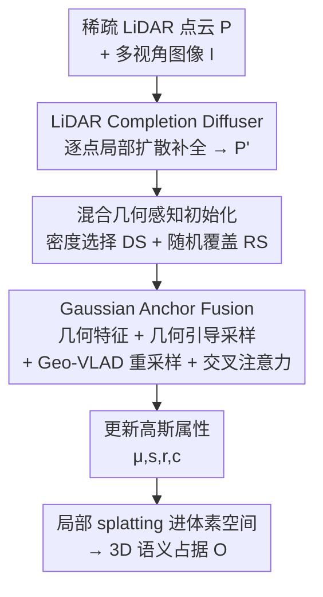

# Gau-Occ: Geometry-Completed Gaussians for Multi-Modal 3D Occupancy Prediction

**会议**: CVPR 2026  
**论文**: [CVF Open Access](https://openaccess.thecvf.com/content/CVPR2026/html/Lv_Gau-Occ_Geometry-Completed_Gaussians_for_Multi-Modal_3D_Occupancy_Prediction_CVPR_2026_paper.html)  
**代码**: 无  
**领域**: 自动驾驶 / 3D语义占据预测  
**关键词**: 3D占据预测, 多模态融合, 语义高斯, LiDAR补全, 扩散模型

## 一句话总结
Gau-Occ 把自动驾驶场景建模成一组紧凑的语义 3D 高斯锚点，用一个"逐点局部扩散"的 LiDAR 补全模块先把稀疏点云补全成几何完整的结构，再用 Gaussian Anchor Fusion 把多视角图像语义高效灌进每个锚点，从而绕开昂贵的稠密体素/BEV 张量，在 SurroundOcc / Occ3D / KITTI-360 三个基准上取得 SOTA 且计算高效。

## 研究背景与动机
**领域现状**：3D 语义占据预测（semantic occupancy prediction）是自动驾驶感知的基础能力，要给周围 3D 空间的每个体素打上"占据 + 语义类别"标签。纯相机方案在 BEV 平面或 3D 体素网格上操作，多模态方案则引入 LiDAR/雷达提供几何线索，精度更高。

**现有痛点**：作者点出两个并存的硬伤。其一，原始 LiDAR 点云**稀疏且有遮挡偏置**——激光只能打到可见表面，大量"被占据但未观测"的区域是空的，导致远处和遮挡区的占据估计残缺、自由空间预测粗糙。其二，主流融合管线**算力沉重**：早融合要么把点投到多个图像视角、要么把稠密图像特征抬升进体素网格；基于 transformer 的体素/BEV 空间融合内存和计算开销巨大，难以扩展到更高分辨率或更长时序。

**核心矛盾**：既想保留 LiDAR 的几何保真度、又想做有效的跨模态融合，但传统做法都绑在**稠密体素张量**上——表达力和算力天然冲突。3D 高斯（3D Gaussian）原语只对非空区域建模、紧凑又有表达力，是个有希望的折中，但现有高斯方法几乎都是纯视觉的，在多模态占据预测、尤其是稀疏 LiDAR + 有限算力的真实约束下几乎没人探索。

**本文目标**：用一套紧凑统一的 3D 表示同时编码 LiDAR 几何和多视角语义，分解为两个子问题——(1) 怎么从稀疏 LiDAR 恢复出几何完整、度量对齐的结构来初始化可靠锚点；(2) 怎么把多视角图像语义高效精准地融进这些锚点而不引入稠密体素开销。

**核心 idea**：把场景表示成可学习的语义高斯锚点，用补全后的 LiDAR 初始化它们，再以前馈方式选择性地融入多视角图像特征，最后把精化后的高斯 splat 进体素空间生成占据——全程不碰稠密体素。

## 方法详解

### 整体框架
Gau-Occ 的输入是稀疏 LiDAR 点云 $P=\{P_i\in\mathbb{R}^3\}$ 和多视角图像 $I$，输出是体素化的语义占据网格 $O\in\mathbb{R}^{|C|\times X\times Y\times Z}$。整条管线是一个"先补几何、再灌语义、最后 splat"的串行流程：稀疏 LiDAR 先被 **LiDAR Completion Diffuser (LCD)** 补全成几何完整的稠密点云 $P'$；$P'$ 被体素化成稀疏特征，并通过**混合几何感知初始化**生成一组密度感知的语义 3D 高斯锚点；每个锚点作为 3D query，通过 **Gaussian Anchor Fusion (GAF)** 把多视角图像语义采样、聚合、融进自身；精化后的高斯属性被局部 splat 进体素空间，累加所有高斯的语义贡献得到最终稠密占据。

场景的语义高斯定义为 $G=\{G_i\}$，每个 $G_i$ 由中心 $\mu\in\mathbb{R}^3$、旋转四元数 $r$、尺度 $s$、语义向量 $c\in\mathbb{R}^{|C|}$ 参数化。某查询位置 $x$ 处单个高斯的语义贡献为

$$g(x;G_i)=\exp\left(-\tfrac{1}{2}(x-\mu)^\top\Sigma^{-1}(x-\mu)\right)\cdot c,\quad \Sigma=RSS^\top R^\top,$$

最终占据 $\hat{o}(x)=\sum_{G_i\in G} g(x;G_i)$。为效率起见采用**局部高斯 splatting**：每个体素只聚合其空间邻域内的高斯，既保精度又避免全场景累加。

### 关键设计

**1. LiDAR Completion Diffuser（LCD）：用逐点局部扩散补全稀疏 LiDAR，而不破坏绝对尺度**

针对"原始点云稀疏且遮挡偏置"这个痛点，LCD 是一个**局部扩散模型**，从稀疏扫描重建出稠密、几何一致的点云。它和常规 DDPM 的关键区别在于：DDPM 对整体施加全局噪声和缩放，会扭曲度量几何（对自动驾驶这种要精确尺寸的任务是灾难）；LCD 改成**逐点局部扩散**——对每个 3D 点在其局部邻域内独立加噪，严格保住绝对尺度和细节。前向过程对每个监督目标点 $T_j$ 加噪 $T^{(t)}_j=T_j+\sqrt{1-\bar\alpha_t}\,\epsilon$（线性噪声调度，**不加全局缩放项**）；反向过程让去噪网络 $\hat\epsilon_\theta$ 在稀疏输入 $P$ 条件下预测注入的噪声，$L_{diff}=\|\epsilon-\hat\epsilon_\theta(T^{(t)},P,t)\|_2^2$。稠密监督目标 $T$ 由同场景下 $K$ 个时序相邻、做了 ego-motion 对齐的 LiDAR 扫描聚合而成，相当于免费的稠密 ground truth。通过迭代去噪，LCD 学到了"表面连续性、结构规律性"这类空间先验，能在遮挡或未观测区合理地补出度量对齐的几何，给后续高斯推理提供几何忠实的锚点。消融显示这个全局几何先验不仅救了远处/遮挡区，连可见区也涨点。

**2. 混合几何感知高斯初始化：密度选择 + 随机覆盖，兼顾结构集中与场景全覆盖**

补全后的点云 $P'$ 要初始化一组紧凑的高斯锚点，但怎么放锚点很讲究。GaussianFormer 用纯随机采样，作者认为这会漏掉高密度结构区或低纹理稀疏区。Gau-Occ 改用**混合策略**：**密度选择（DS）**——对每个点估计半径 $R_d$ 内的局部密度，迭代挑密度最高的位置当高斯中心，并抑制 $R_d$ 内的邻居防冗余，直到取够 $N_d$ 个中心 $P_d$，专门抓细节丰富、被频繁观测的表面；**随机覆盖采样（RS）**——从剩余点里均匀采 $N_r$ 个中心 $P_r$，覆盖稀疏或低纹理区域。两者并集 $P_{init}=P_d\cup P_r$ 形成初始高斯集，每个中心配一个轴对齐初始尺度。这样得到的高斯空间分布均衡、几何对齐，比纯 RS 更能重建远距离和易被忽略的目标（如可行驶面、车辆）——消融里 RS-only 比 DS+RS 在 IoU/mIoU 上都掉。

**3. Gaussian Anchor Fusion（GAF）：让每个高斯锚点当 3D query，几何引导地把多视角图像语义灌进来**

这是把"LiDAR 精确几何"和"图像稠密语义"桥接起来的核心模块，只在锚点上操作，所以既保空间精度又大幅省算力。它由三步串成：

*几何特征提取*：把补全点云 $P'$ 体素化成稀疏网格（每体素最多留 $T_p=10$ 个点），过 3D 稀疏 CNN 得体素特征 $F_v$。对中心 $\mu_i$、尺度 $s_i$ 的高斯，按 $R_{geo}=k\sqrt[3]{(s_x+s_y+s_z)}$ 定自适应邻域半径，用指数距离核 $w_v=\exp(-\gamma\|p_v-\mu_i\|^2)$ 加权聚合邻域体素特征，得几何感知锚点描述子 $f_{pc,i}$。

*几何引导图像采样*：用 ResNet-50+FPN 抽多尺度图像特征。把高斯中心 $\mu_i$ 通过可微投影 $\Pi_v$ 投到各相机得参考像素 $\text{pix}_{i,v}$，再用一个以 $f_{pc,i}$ 为条件的两层 MLP 预测 $N_{off}$ 个归一化 2D 偏移 $\Delta_{i,r}$，在参考像素周围采一小块局部区域 $x^{(r)}_{i,v,l}=\tfrac{\text{pix}_{i,v}}{s_l}+\Delta_{i,r}R_l$。**把偏移条件在 LiDAR 几何特征上**，让采样跟场景几何对齐，改善跨视角的空间一致性和长程对应——这是 GGS（Geometry-Guided Sampling），消融里换成几何无关采样会明显损害长程特征关联。

*Geo-VLAD 重采样与融合*：从所有视角和金字塔层采到的 token $X_i\in\mathbb{R}^{N\times d}$（$N=216$），不再叠一个 attention，而是用**几何感知的 VLAD 式重采样器**压缩成 $Z_i\in\mathbb{R}^{M\times d}$（$M=32$ 个可学习语义码字）。软分配 $\alpha_{i,n,m}=\text{softmax}_m([W_a x_{i,n}]_m+[U_a f_{pc,i}]_m+b_m)$ **把分配条件在 LiDAR 特征上**，使聚合本身几何感知；残差 $Z_i=\text{stack}_m W_z\,\text{normalize}(\sum_n\alpha_{i,n,m}(x_{i,n}-C_m))$。随后 FiLM 调制 $\tilde Z_i=\gamma_i\odot Z_i+\beta_i$ 让融合更自适应。最后 LiDAR 锚点当 query、调制后的视觉 token 当 key/value 做单层交叉注意力，注意力里还加了编码重投影一致性的空间权重 $\log w^{(l)}_i$（$w^{(l)}_i=\exp(-\|\text{pix}_{i,v}-\Pi_v(\mu_i)\|^2/2\sigma_l^2)$），多尺度结果按可学习权重 $\lambda_l$ 加权得 $f_{img,i}$。融合特征 $[f_{pc,i};f_{img,i}]$ 过两层 FFN 输出高斯属性增量 $[\hat\mu_i,\hat s_i,\hat r_i,\hat c_i]$ 更新锚点。GVR（Geo-VLAD Resampling）的价值在消融里很直接：去掉它直接把 $N$ 个原始 token 喂交叉注意力，延迟和显存都大涨（attention map 要在 $N$ 个 key 上算），精度还因 token 冗余略降。

### 损失函数 / 训练策略
占据预测部分沿用 [14] 的联合目标 $L_{CE}+L_{Lov}$，即交叉熵 + Lovász-Softmax 损失，提升分割精度和类别平衡。LCD 作为预训练模块单独以扩散去噪损失 $L_{diff}$（公式 5）训练，其稠密监督目标由 $K$ 个 ego-motion 对齐的时序扫描聚合得到。整套稀疏、完全可微的表示既保细粒度几何细节，又保持高效聚合与梯度传播。

## 实验关键数据

### 主实验
在 SurroundOcc-nuScenes、Occ3D-nuScenes、KITTI-360 三个基准上评测，指标为 IoU 和 mIoU。

| 数据集 | 指标 | Gau-Occ | 之前SOTA | 提升 |
|--------|------|---------|----------|------|
| SurroundOcc-nuScenes | IoU / mIoU | 44.3 / 32.7 | DAOcc 42.8 / 32.1 | +1.5 / +0.6 |
| Occ3D-nuScenes | mIoU | 55.1 | DAOcc 54.3 | +0.8 |
| Occ3D-nuScenes | mIoU vs SDGOcc | 55.1 | 51.7 | +3.4 |
| Occ3D-nuScenes | mIoU vs OccFusion(+radar) | 55.1 | 48.7 | +6.4 |
| KITTI-360 | IoU / mIoU | — | L2COcc(LiDAR-only) | +1.3 / +0.6 |

在 SurroundOcc 上，多模态 Gau-Occ 不靠 DAOcc 所依赖的检测级监督就反超后者；在 Occ3D 上对 bus、car、bicycle、motorcycle 等安全攸关类别有明显增益，作者归因于 Geo-VLAD 重采样和几何感知 FiLM 调制把多视角图像证据稳健对齐到 LiDAR 锚点。

### 消融实验
**(a) 点云来源 + 高斯初始化（SurroundOcc-nuScenes）**

| 配置 | IoU↑ | mIoU↑ | 说明 |
|------|------|-------|------|
| 原始 P + DS+RS | 41.5 | 29.6 | 不补全，掉最多 |
| LiDPM 补全 + DS+RS | 43.1 | 31.9 | 换扩散补全 baseline |
| P′ + RS only | 43.9 | 32.4 | 补全但纯随机初始化 |
| P′ + DS+RS（完整） | 44.3 | 32.7 | 完整模型 |

**(b) GAF 组件（nuScenes）**

| 配置 | IoU↑ | mIoU↑ | 说明 |
|------|------|-------|------|
| 无 GAF | 35.2 | 24.9 | 图像只做初始化，掉 ~9 IoU |
| GAF, 无 GGS | 40.6 | 31.2 | 几何无关采样，损长程关联 |
| GAF, 无 GVR | 43.9 | 32.4 | 原始 token 直喂注意力，延迟/显存大涨、略掉点 |
| 完整 GAF（GGS+GVR） | 44.3 | 32.7 | 最优 |

### 关键发现
- **补全是大头**：用原始 P 替换补全 P′（表 3a 行 1 vs 行 4）掉 2.8 IoU / 3.1 mIoU，且 LCD 优于 LiDPM 这类扩散补全 baseline，说明 LCD 的几何先验对远处/遮挡区乃至可见区都有用。
- **GAF 是另一个大头**：完全去掉 GAF（图像只用于初始化）从 44.3 暴跌到 35.2 IoU，证明跨模态深度融合的必要性。
- **GVR 的价值更多在效率**：去掉它精度只略降，但延迟和显存显著上升——它把 $N=216$ 个 token 压成 $M=32$ 个码字，省掉了在大量 key 上算注意力的开销。

## 亮点与洞察
- **"先补几何再灌语义"的解耦很干净**：把补全（LCD）和融合（GAF）拆成两个独立可预训练的模块，几何完整性问题和算力问题各个击破，而不是在一个臃肿的体素 transformer 里一锅炖。
- **逐点局部扩散保尺度是关键 trick**：常规 DDPM 的全局噪声+缩放对自动驾驶的度量几何是有害的；改成每点在局部邻域内独立扩散，既享受扩散补全的表达力又不破坏绝对尺寸——这个观察可迁移到任何需要度量保真的点云生成/补全任务。
- **高斯锚点当 3D query 的范式**：把可学习 3D 高斯既当场景表示又当融合 query，只在稀疏锚点上做跨模态采样和注意力，天然绕开稠密体素，是"紧凑表示驱动高效融合"的好例子。
- **几何条件贯穿始终**：从采样偏移（GGS）到 VLAD 软分配（GVR）再到注意力空间权重，都把 LiDAR 几何特征作为条件——"让图像采样听几何的"这个一致设计哲学值得借鉴。

## 局限与展望
- **依赖时序聚合的稠密监督**：LCD 的训练目标 $T$ 靠聚合 $K$ 帧 ego-motion 对齐的扫描，这要求精确的位姿和静态场景假设；动态物体在多帧聚合下可能产生拖影/重影，论文未深入讨论对动态目标补全的影响。
- **效率"高效"缺硬数字**：正文反复强调计算高效，但主表里没给出延迟/显存/FLOPs 的定量对比表，只在 GVR 消融的文字里定性提到"延迟和显存大涨"，读者难以量化它到底比 DAOcc/体素 transformer 省多少。
- **无开源代码**：截至笔记撰写未见代码，VLAD 码字数、采样偏移数、邻域半径常数 $k,\gamma,\kappa$ 等超参的敏感性无从复现验证。
- **改进方向**：可把 LCD 升级为时序/运动感知补全以处理动态物体；补上端到端的延迟-精度帕累托曲线；探索把高斯锚点数随场景复杂度自适应的机制。

## 相关工作与启发
- **vs GaussianFormer / GaussianFormer-2**：它们是纯视觉高斯占据方法、用随机采样初始化；Gau-Occ 引入 LiDAR 模态，用补全点云做混合几何感知初始化，并设计 GAF 做跨模态融合。在 SurroundOcc 上 Gau-Occ（44.3/32.7）大幅超过 GaussianFormer-2（31.7/20.8）。
- **vs DAOcc**：DAOcc 是上一代多模态 SOTA，但依赖检测级监督先验；Gau-Occ 不用额外先验就在 SurroundOcc（+1.5 IoU）和 Occ3D（+0.8 mIoU）上反超，靠的是几何完整的高斯锚点和结构感知融合。
- **vs Co-Occ / OccMamba / SDGOcc 等多模态体素/BEV 融合**：这些方法在稠密 3D 空间做特征融合，内存/运行时开销大；Gau-Occ 只在稀疏高斯锚点上融合，保空间精度的同时显著降开销。
- **vs 传统 DDPM 点云补全（如 LiDPM）**：全局扩散会扭曲度量几何；LCD 的逐点局部扩散严格保尺度，消融里优于 LiDPM 补全。

## 评分
- 新颖性: ⭐⭐⭐⭐ 把"逐点局部扩散补全 + 高斯锚点 + 几何条件 VLAD 融合"组合成统一多模态占据框架，思路新颖且自洽。
- 实验充分度: ⭐⭐⭐⭐ 三基准 SOTA + 两组细致消融，但缺定量效率对比表、KITTI-360 主表挪到补充材料。
- 写作质量: ⭐⭐⭐⭐ 动机清晰、公式完整、模块职责分明，效率论证偏定性。
- 价值: ⭐⭐⭐⭐ 对追求精度-算力平衡的占据预测有直接借鉴价值，"几何先验贯穿融合"的设计哲学可迁移。

<!-- RELATED:START -->

## 相关论文

- [\[CVPR 2026\] TT-Occ: Test-Time 3D Occupancy Prediction](test-time_3d_occupancy_prediction.md)
- [\[CVPR 2026\] Generalizing Visual Geometry Priors to Sparse Gaussian Occupancy Prediction](generalizing_visual_geometry_priors_to_sparse_gaussian_occupancy_prediction.md)
- [\[ECCV 2024\] OccGen: Generative Multi-modal 3D Occupancy Prediction for Autonomous Driving](../../ECCV2024/autonomous_driving/occgen_generative_multi-modal_3d_occupancy_prediction_for_autonomous_driving.md)
- [\[CVPR 2026\] Dr.Occ: Depth- and Region-Guided 3D Occupancy from Surround-View Cameras for Autonomous Driving](drocc_depth_region_guided_3d_occupancy.md)
- [\[ECCV 2024\] GaussianFormer: Scene as Gaussians for Vision-Based 3D Semantic Occupancy Prediction](../../ECCV2024/autonomous_driving/gaussianformer_scene_as_gaussians_for_vision-based_3d_semantic_occupancy_predict.md)

<!-- RELATED:END -->
