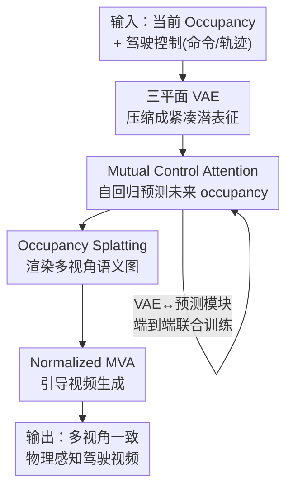

# GenieDrive: Towards Physics-Aware Driving World Model with 4D Occupancy Guided Video Generation

**会议**: CVPR 2026  
**论文**: [CVF Open Access](https://openaccess.thecvf.com/content/CVPR2026/html/Yang_GenieDrive_Towards_Physics-Aware_Driving_World_Model_with_4D_Occupancy_Guided_CVPR_2026_paper.html)  
**代码**: 待确认（项目主页有可视化）  
**领域**: 自动驾驶 / 驾驶世界模型 / 视频生成  
**关键词**: 驾驶世界模型, 4D 占据栅格, 三平面 VAE, 多视角视频生成, 物理感知

## 一句话总结
GenieDrive 把"驾驶动作直接生成视频"的黑盒拆成两段——先用一个仅 3.47M 参数的轻量占据世界模型，从历史 4D occupancy 和驾驶控制预测未来 occupancy（物理约束），再把 occupancy 投影成语义图去引导预训练视频模型生成多视角驾驶视频——在占据预测上 mIoU 相对提升 7.2%、推理 41 FPS，在视频生成上 FVD 相对下降 20.7%，并能生成长达 241 帧（约 20s）的可编辑、多视角一致的物理感知驾驶视频。

## 研究背景与动机

**领域现状**：物理感知的驾驶世界模型是自动驾驶规划、长尾数据合成和闭环评测的关键基础设施。当前主流做法（Vista、Epona、MagicDrive 系列）是用一个视频扩散模型当黑盒，直接把驾驶动作等条件映射到视频，靠在驾驶视频数据上学去噪过程来"理解"驾驶场景。

**现有痛点**：这种黑盒缺乏任何物理建模和约束，极易被视频数据分布带偏。一个非常具体的例子是——几乎所有公开驾驶视频数据集里，自车绝大多数时间都在直行；在这种数据上训出来的模型会形成"偏向直行"的世界模型，于是当你命令它"右转"时，它仍可能生成一段直行视频。模型是在过拟合训练数据，而不是真正理解驾驶场景的 4D 表征和"条件↔视频"之间的物理关系。

**核心矛盾**：直接从低维动作映射到高维视频，缺少一个能承载 3D 结构和动力学的中间物理表征，导致"可控性"和"物理一致性"无法保证。而如果引入 4D occupancy 作为中间表征，又会遇到一个新的 trade-off：occupancy 是高分辨率 3D 体素，既要**高效压缩**（否则后续 4D 生成代价太大），又要**精确重建**（否则丢失物理细节），现有方法很难同时做到。

**本文目标**：(1) 构造一个既准又快又小的占据世界模型，从驾驶控制精确预测未来 occupancy；(2) 让这份 occupancy 真正去约束视频生成，得到多视角一致、物理可信、可长时、可编辑的驾驶视频。

**切入角度**：作者把问题解耦为"先建模物理（occupancy），再渲染外观（video）"两阶段。occupancy 同时提供高分辨率 3D 布局和动态演化，是驾驶场景的天然物理载体；让它先把"右转该往哪走"这件物理事实定下来，视频模型就只需负责"长什么样"，从而把难学的端到端映射拆成两个更易学的子问题。

**核心 idea**：用"4D occupancy 中间表征"替换"动作→视频黑盒"，让 occupancy 充当物理约束与物理先验，引导后续的多视角视频生成。

## 方法详解

### 整体框架
GenieDrive 是一个两阶段生成管线。**第一阶段（轻量占据世界模型）**：当前 occupancy 经一个三平面 VAE 编码成紧凑潜表征，再由 Mutual Control Attention（MCA）结合驾驶控制（命令、轨迹、角度、速度）自回归地预测下一时刻的潜表征，VAE 与预测模块端到端联合训练；解码出的未来 occupancy 通过 splatting 投影渲染成多视角语义图。**第二阶段（物理感知视频生成）**：把这些语义图作为物理条件，输入一个预训练视频扩散模型（Wan2.1-1.3B），其 DiT block 后插入 Normalized Multi-View Attention（MVA）模块，学习多视角间的空间关系，最终输出多视角、时序一致的驾驶视频。

输入是初始 occupancy + 初始多视角帧 + 驾驶控制，输出是物理可信的多视角驾驶视频。整条管线的关键在于：occupancy 把"物理对不对"这件事在 3D 空间里先定死，再投影到低维视频空间生成外观，从而保证渲染结果天然满足物理约束。

### 关键设计

**1. 4D occupancy 物理中间表征：把"动作→视频"黑盒拆成"先建物理、再渲外观"**

这是全文的范式级设计，直接针对黑盒被数据分布带偏（命令右转却直行）这个痛点。作者不再让单个扩散模型硬学"驾驶动作 $\to$ 视频"的高维映射，而是插入 4D occupancy 作为中间表征：第一阶段用一个轻量占据世界模型，仅凭历史观测和给定驾驶动作预测未来 occupancy（注意不像 UniScene/InfiniCube 那样还需要 BEV 图当输入，它们更像"翻译器"；也不像 WoVoGen 只能预测 6 帧的极短序列），occupancy 同时编码了高分辨率 3D 结构和动态演化，于是"右转时车该往哪走"这件物理事实在 3D 空间里就被先确定；第二阶段视频模型只需把这份已满足物理的 occupancy 渲染成外观。这样既把难学的端到端映射拆成两个更易学的子问题，又因为 occupancy 是可编辑的 3D/4D 结构，天然支持在 occupancy 空间增删物体后再生成对应视频（图 5c 的 Remove/Insert），为分布外（OOD）驾驶数据合成提供了抓手。

**2. 紧凑三平面 VAE：用 58% 的潜表征尺寸打破"压缩 vs 重建"的 trade-off**

针对 occupancy 高分辨率体素难以同时高效压缩与精确重建的矛盾，作者观察到 occupancy 存在大量冗余，借鉴低秩分解思想，提出把 occupancy 压成三平面表征。给定 occupancy $O \in \mathbb{R}^{H\times W\times D}$，先用 3D 卷积 $g_\phi$ 下采样成体素特征 $S \in \mathbb{R}^{h\times w\times d\times C}$，再沿 X/Y/Z 三个轴分别投影成三张潜平面 $Z_{yz}, Z_{xz}, Z_{xy}$。投影操作借鉴 BERT 的 `[CLS]` token：以 $Z_{xy}$ 为例，先把特征重排为 $S' = \mathrm{rearrange}(S,\, hwdC \to (hw)\,d\,C)$，再拼接一个可学习 token $P_{xy}\in\mathbb{R}^{C}$ 得到 $S''=\mathrm{cat}(P_{xy}, S')$，过一个 Transformer 自注意力 $Z_{xy}=F_{xy}(S'')$，把那个可学习 token 的输出当作投影结果。解码时用 Hadamard 积融合三平面再加位置编码：

$$\hat{O} = f_\psi\big(Z_{xy}\odot Z_{yz}\odot Z_{xz} + \mathrm{PE}(x,y,z)\big)$$

VAE 用交叉熵 + Lovász-softmax + KL 散度三项损失自监督训练（公式 3）。结果是潜表征尺寸只有以往方法的 58%，却仍保持更优重建，这份紧凑表征也是后续 41 FPS 快速推理和 3.47M 极小参数量的根源。⚠️ 公式以原文为准。

**3. Mutual Control Attention + 端到端训练：让控制真正"咬住"occupancy 演化，并对齐重建与预测目标**

占据世界模型自回归预测下一帧潜表征 $\hat{Z}_{t+1}=\mathcal{F}_{pred}(Z_t, c, [Z_{t-1},\ldots,Z_{t-k}])$，其中 $c$ 是命令、轨迹等控制信号。为了精确建模"控制如何影响场景演化"这个核心，作者设计 MCA：在每层让 occupancy 潜表征 $Z^l$ 与控制 $c^l$ 双向交互——先让 $Z$ 去 attend 控制（$Z^{l'}=Z^l+\mathrm{Attn}(Q_{Z^l},K_{c^l},V_{c^l})$），再 occupancy 自注意力，最后让控制反过来 attend 更新后的 occupancy（$c^{l+1}=c^l+\mathrm{Attn}(Q_{c^l},K_{Z^{l+1}},V_{Z^{l+1}})$）。同时借用 I2-World 的中间变换监督：在某中间层用 MLP 头 $f_{trans}$ 把控制潜信号解码成变换矩阵，用真值变换矩阵 $T$ 监督 $\mathcal{L}_{reg}=\|T_t^{t+1}, f_{trans}(c_t^m)\|^2$。

更关键的训练设计是**端到端联合训练**。作者指出以往所有 4D occupancy 方法都两段式训练——先以重建目标训 VAE/VQ-VAE，再在固定潜空间里做预测——但重建学到的表征未必对预测最优。于是把三平面 VAE 与预测模块端到端联合优化（公式 10），直接用未来 occupancy 真值监督整条链路。有意思的是，这个看似简单的端到端在别人方法上会崩：扩散式的 DOME 端到端后几乎归零（diffusion loss 倾向于把潜空间压简单，训练 loss 更低但生成更差），离散表征的 I2-World 端到端后大幅退化；而 GenieDrive 因为用连续表征（CR），端到端反而显著涨点——作者还做了去掉 CR 的变体验证了这一点。

**4. Normalized Multi-View Attention：让单视角预训练模型稳定学会多视角一致**

占据投影到视频空间后，预训练视频模型是为单视角设计的，逐视角独立生成会导致同一辆车在不同视角下外观不一致；而把时间、空间、多视角全部展平做自注意力又因二次复杂度过于昂贵。作者观察到"驾驶场景的一致性主要存在于不同视角的同一高度上"，据此设计高效 MVA：把特征重排为 $\mathrm{rearrange}(Z,\, n(thw)C \to (th)(nw)C)$，只在不同视角的相同高度上做注意力，再把 MVA block 插在 DiT block 之后，让感受野横跨所有时刻、特征块和视角。但新插入模块未经训练，直接接入会摧毁预训练先验，于是作者加 cross normalization 稳定微调：记 $M=\mathrm{SelfAttn}(Z)$，

$$Z' = Z + \eta\left(\frac{M-\mu_M}{\sigma_M}\sigma_Z + \mu_Z\right)$$

即先把 $M$ 归一化再 rescale 回 $Z$ 的分布，$\eta$ 调节多视角注意力强度。这样 MVA 能在不破坏预训练先验的前提下被优化——消融显示去掉这个归一化时 FVD 从 98 暴涨到 213、出现明显网格伪影和模糊。视频侧用 flow-based v-prediction 损失微调（公式 12）。

## 实验关键数据

数据集为 NuScenes（700 训练 / 150 验证场景），occupancy 用 Occ3D 的 2Hz 标注，视频底座为 Wan2.1-1.3B，多视角视频 12Hz 生成，指标用 FVD / mIoU / mAP，8×48GB GPU 训练。

### 主实验

**4D occupancy 预测（Table 1，关键列）**：相对前 SOTA I2-World，平均 mIoU 提升约 7.2%、平均 IoU 提升约 4%，且参数最小、速度最快。

| 方法 | 输入 | Recon. mIoU | Avg mIoU↑ | Avg IoU↑ | FPS↑ | 参数 |
|------|------|-------------|-----------|----------|------|------|
| OccWorld | Occ | 66.38 | 17.14 | 26.63 | 18.00 | 72.39M |
| DOME | Occ | 83.08 | 27.10 | 36.36 | 6.54 | 397.55M |
| COME | Occ | 83.08 | 34.23 | 44.13 | 0.30 | 692.97M |
| I2-World | Occ | 81.22 | 39.73 | 49.80 | 37.04 | 22.71M |
| **GenieDrive** | Occ | **86.15** | **42.59** | **51.80** | **41.38** | **3.47M** |

**多视角视频生成（Table 4，关键行）**：在 8 帧 Occ 条件下相对 UniScene 的 70.52，GenieDrive-S 的 FVD 降到 55.93（相对下降约 20.7%），mIoU/mAP 也显著优于此前 SOTA MagicDrive-V2，并能 rollout 到 241 帧。

| 方法 | 帧数 | 条件 | FVD↓ | mIoU↑ | mAP↑ |
|------|------|------|------|-------|------|
| MagicDrive-V2 | 241 | BEV & 3D Box | 94.84 | 20.40 | 18.17 |
| UniScene | 8 | Occ | 70.52 | 21.75 | 10.32 |
| **GenieDrive-S** | 8 | Occ | **55.93** | **31.00** | **21.23** |
| GenieDrive-M | 37 | Occ | 98.06 | 31.44 | 19.84 |
| GenieDrive-L Rollout | 241 | Occ | 137.25 | 31.03 | 18.89 |

### 消融实验

**占据世界模型（Table 3，平均 mIoU/IoU）**：端到端训练只对连续表征的本方法有效，对扩散式 DOME、离散式 I2-World 反而崩溃。

| 配置 | Avg mIoU | Avg IoU | 说明 |
|------|----------|---------|------|
| DOME | 27.10 | 36.36 | 基线 |
| DOME + E2E | 0.43 | 0.51 | 端到端直接崩溃 |
| I2-World + E2E | 10.09 | 20.25 | 离散表征端到端大幅退化 |
| w/o MCA | 38.96 | 48.68 | 去掉互控注意力，3s 掉点明显 |
| w/o E2E | 39.79 | 50.46 | 不端到端训练 |
| w/o CR | 39.09 | 50.23 | 改用离散表征 |
| **Full** | **42.59** | **51.80** | 完整模型 |

**视频生成（Table 5，37 帧）**：归一化比 MVA 本身更关键，去掉归一化 FVD 几乎翻三倍。

| 配置 | FVD↓ | mIoU↑ | mAP↑ |
|------|------|-------|------|
| w/o Normalized MVA | 120.16 | 30.12 | 18.77 |
| w/o Normalization | 212.67 | 21.49 | 10.04 |
| **Full** | **98.06** | **31.44** | **19.84** |

### 关键发现
- **端到端训练是"方法专属红利"而非通用技巧**：同样的端到端在 DOME 上归零、在 I2-World 上腰斩，只有用连续三平面表征的 GenieDrive 能吃到红利（39.79→42.59）。作者的解释是扩散 loss 会把潜空间压得过简、离散量化损失叠加端到端会放大误差，这点很值得做生成式世界模型时警惕。
- **归一化比多视角注意力本身更不可或缺**：去掉 MVA 只是多视角不一致（FVD 120），去掉归一化则直接出网格伪影、FVD 飙到 213，说明把未训练模块接进预训练先验时，分布对齐的稳定性比新模块的表达力更要命。
- **MCA 对长时预测增益最大**：去掉 MCA 在 3s 处掉点尤其明显，印证控制与 occupancy 的双向交互对长时程演化建模的价值。
- **长时外推优势**：在 4s/5s/6s 测试（Table 2）中，本方法 6s 的 mIoU（23.66）甚至超过多数方法的 4s，而 OccWorld/DOME/UniScene 随时间急剧退化。

## 亮点与洞察
- **用 occupancy 当"物理草稿"再渲外观**：把难学的"动作→视频"拆成"动作→occupancy→视频"，让物理正确性在 3D 空间被强约束，是对抗"数据分布偏置导致命令右转却直行"的干净思路，可迁移到任何"高维生成被分布带偏"的可控生成任务。
- **三平面 + BERT [CLS] 风格投影**：用可学习 token 做轴向投影压缩 occupancy，把潜尺寸压到 58% 还涨重建，是一个轻巧且可复用的 3D 体素压缩 trick。
- **Cross Normalization 稳定接新模块**：把新插模块输出归一化再 rescale 回原分布的做法，为"在预训练大模型上插入未训练注意力模块"提供了一个即插即用的稳定化范式。
- **可编辑性是免费午餐**：因为中间表征是 3D occupancy，增删车辆/护栏后再生成视频几乎零成本，天然适合 OOD 长尾驾驶数据合成与闭环评测。

## 局限与展望
- **依赖 occupancy 真值与底座模型**：训练需要 Occ3D 这类高质量 4D occupancy 标注，迁移到无 occupancy 标注的场景成本高；视频质量也受预训练底座 Wan2.1-1.3B 上限约束。
- **误差两段传递**：第一阶段 occupancy 预测的误差会直接传给第二阶段渲染，长 rollout（241 帧）时 FVD 从 92.78 升到 137.25 已能看到累积退化。
- **评测局限于 NuScenes 单数据集**：跨城市/跨传感器配置的泛化性、以及真实闭环规划下的下游收益尚未充分验证。
- **改进方向**：联合优化两阶段以抑制误差传递、引入更强的物理一致性约束（如显式动力学）、以及把可编辑能力系统化用于长尾场景自动生成。

## 相关工作与启发
- **vs Vista / Epona（视频黑盒驾驶世界模型）**：它们直接动作→视频且仅支持单视角，命令转向时易直行或场景不一致；GenieDrive 用 occupancy 物理约束，原生多视角且能为 Turn Left/Right 生成物理可信视频（图 3）。
- **vs UniScene / InfiniCube（occupancy 引导视频生成）**：它们需要 BEV 图当输入、更像"翻译器"，且视频较短；GenieDrive 的 occupancy 由世界模型仅凭历史观测和驾驶动作生成，并能支撑到 241 帧长视频。
- **vs I2-World / DOME / OccWorld（occupancy 世界模型）**：扩散式（DOME）算力大、自回归式（I2-World/OccWorld）受离散量化有损表征所累；GenieDrive 用连续三平面 VAE 兼顾保真与低训练成本，并靠端到端训练对齐重建与预测，在更小参数下取得更高 mIoU。

## 评分
- 新颖性: ⭐⭐⭐⭐⭐ 用 4D occupancy 中间表征把驾驶视频生成做成物理约束的两阶段，范式清晰且解决真问题
- 实验充分度: ⭐⭐⭐⭐ occupancy 预测、视频生成、长时外推、端到端可迁移性都有对比与消融，但仅 NuScenes 单数据集
- 写作质量: ⭐⭐⭐⭐ 动机（直行偏置）讲得具体、设计与消融对应清楚
- 价值: ⭐⭐⭐⭐⭐ 轻量（3.47M/41FPS）+ 可编辑 + 长时多视角，对闭环评测与长尾数据合成有直接价值

<!-- RELATED:START -->

## 相关论文

- [\[CVPR 2026\] GaussianDWM: 3D Gaussian Driving World Model for Unified Scene Understanding and Multi-Modal Generation](gaussiandwm_3d_gaussian_driving_world_model_for_unified_scene_understanding_and_.md)
- [\[CVPR 2026\] U4D: Uncertainty-Aware 4D World Modeling from LiDAR Sequences](u4d_uncertainty-aware_4d_world_modeling_from_lidar_sequences.md)
- [\[CVPR 2026\] SparseWorld-TC: Trajectory-Conditioned Sparse Occupancy World Model](sparseworld_tc_trajectory_conditioned_sparse_occupancy_world_model.md)
- [\[CVPR 2026\] WorldLens: Full-Spectrum Evaluations of Driving World Models in Real World](worldlens_full-spectrum_evaluations_of_driving_world_models_in_real_world.md)
- [\[CVPR 2026\] DrivePI: Spatial-aware 4D MLLM for Unified Autonomous Driving Understanding, Perception, Prediction and Planning](drivepi_spatial-aware_4d_mllm_for_unified_autonomous_driving_understanding_perce.md)

<!-- RELATED:END -->
