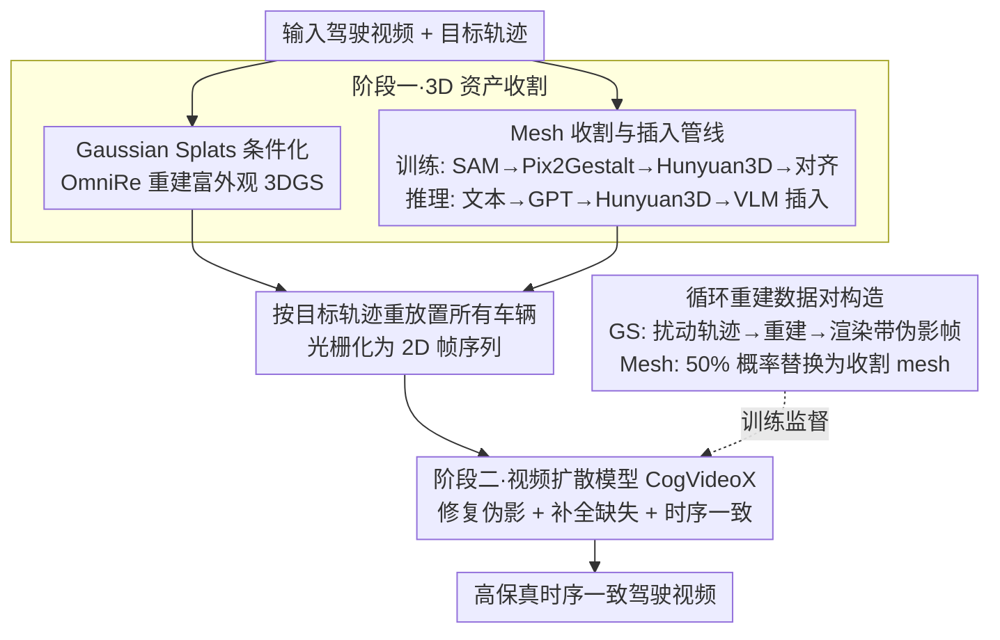

# HorizonForge: Driving Scene Editing with Any Trajectories and Any Vehicles

**会议**: CVPR2026  
**arXiv**: [2602.21333](https://arxiv.org/abs/2602.21333)  
**代码**: [项目主页](https://horizonforge.github.io/)  
**领域**: 自动驾驶 / 场景生成与编辑  
**关键词**: 驾驶场景编辑, 3D Gaussian Splatting, 视频扩散模型, 轨迹控制, Mesh插入, 多智能体仿真

## 一句话总结

HorizonForge 提出一个统一框架，将驾驶场景重建为可编辑的 Gaussian Splats + Mesh 表示，通过轨迹控制实现精细 3D 操控和语言驱动的车辆插入，再经视频扩散模型渲染生成时空一致的高质量驾驶视频，在用户偏好率上以 91.02% 碾压所有对比方法。

## 研究背景与动机

**长尾场景稀缺**：自动驾驶系统需在激进变道、急刹等安全关键场景中评估，但此类场景在实际采集中极度稀少且成本高昂，亟需仿真生成。

**重建方法泛化差**：基于 3DGS/NeRF 的重建方法（如 OmniRe）几何精度高，但在未见视角下容易产生伪影，难以泛化到新轨迹。

**生成方法缺乏物理约束**：纯生成方法（扩散模型）可以幻想新内容，但缺少显式 3D 结构先验，导致场景结构不一致、无法精细控制交通参与者。

**混合方法过于复杂**：已有混合方法（如 Difix3D、StreetCrafter）依赖复杂架构或需对每条新轨迹做昂贵的逐轨迹优化，可扩展性差。

**缺少统一评估基准**：现有评测集（如 StreetCrafter 的 ego lane change）仅覆盖单一操作类型，缺少涵盖 ego 和 agent 级多种编辑任务的综合基准。

**3D 表示选择缺乏系统研究**：对 "哪种 3D 表示最适合作为扩散模型条件" 这一关键设计问题，此前没有系统的对比分析。

## 方法详解

### 整体框架

HorizonForge 包含两个阶段：**3D 资产收割（3D Assets Harvesting）** 和 **视频渲染（Video Rendering）**。

- **阶段一**：将输入驾驶视频重建为可编辑的 3D 资产——Gaussian Splats（通过 OmniRe 获取）+ 3D Mesh（通过 Hunyuan3D 生成），在 3D 空间中按目标轨迹 $\mathcal{T}=\{\tau_i\}_{i=1}^N$ 重新放置所有车辆。
- **阶段二**：将编辑后的 3D 场景光栅化为 2D 帧序列，再通过微调的视频扩散模型（基于 CogVideoX 骨干）修复伪影、补全缺失区域，生成高保真、时序一致的驾驶视频。

### 关键设计

**1. Gaussian Splats 条件化**

- 使用 OmniRe 从输入视频重建 3DGS 场景表示，编码连续密度和颜色信息，为扩散模型提供丰富的中层先验。
- 通过系统对比发现：Gaussian Splats >> 彩色点云 >> 3D BBox，表示越丰富，生成质量越高。

**2. Mesh 收割与插入管线**

- **训练阶段**：从 Waymo 数据集中利用 GT 3D 框 + LiDAR 点选最佳观测帧，SAM 分割 → Pix2Gestalt 补全遮挡 → Hunyuan3D 生成 mesh → GPT 推理朝向 → 深度+IoU 联合优化尺度对齐。
- **推理阶段**：用户输入文本描述 → GPT 生成参考图 → Hunyuan3D 生成 mesh → VLM 推理旋转和尺度 → 插入到场景中，实现**任意文本驱动的车辆插入**。

**3. 循环重建数据对构造**

- 对 Gaussian Splats：扰动原始轨迹 $\tilde{\mathcal{T}} = \mathcal{T} + \Delta\mathcal{T}$，渲染扰动帧 → 重建新 GS 场景 → 在原始轨迹下渲染得到带伪影的帧，与 GT 配对训练。
- 对 Mesh：以 50% 概率随机替换 GS 资产为抽取的 mesh，构造 mesh-GS 混合数据对，缩小 mesh 与真实图像的光照/纹理差距。

### 损失函数

标准扩散去噪损失：

$$\mathcal{L}_{\text{vdm}} = \mathbb{E}_{t,\epsilon}\left[\|\epsilon - \epsilon_\theta(x_t, t, v_c)\|_2^2\right]$$

其中 $v_c$ 是从 Gaussian Splats/Mesh 渲染的条件视频帧。模型基于 TrajectoryCrafter 预训练权重在 CogVideoX 骨干上微调 60k 步。

## 实验

### 主实验：HorizonSuite 基准对比

在自建的 **HorizonSuite** 基准（109 条高质量编辑轨迹，涵盖 ego/agent 级速度变化、变道、转向、插入、删除）上与 StreetCrafter、Difix3D、OmniRe 对比：

| 方法 | Overall FID↓ | Overall FVD↓ | 最佳指标数 |
|------|-------------|-------------|-----------|
| StreetCrafter | 91.16 | 1245.96 | 0 |
| Difix3D | 80.84 | 991.23 | 0 |
| OmniRe | 44.37 | 546.00 | 少量 |
| **HorizonForge** | **33.19** | **536.49** | **绝大多数** |

- HorizonForge 在几乎所有任务和指标上取得最优，Overall FID 较第二名 OmniRe 提升 **25.19%**。
- 在车辆插入任务中 FID 从 182.29 降至 117.46（↓35.5%），OSR 从 4.23 提升至 5.86。

### 消融实验

| 条件表示 | Overall FID↓ | Overall FVD↓ |
|---------|-------------|-------------|
| 3D BBox + Mesh | 81.74 | 1521.07 |
| 彩色点云 + Mesh | 54.14 | 813.67 |
| Image DM（同条件） | 75.83 | 837.99 |
| **Gaussian + Mesh (Ours)** | **33.19** | **536.49** |

**关键发现**：
- **3D 表示很重要**：Gaussian Splats 编码的富外观先验比稀疏表示（BBox、点云）优势巨大，BBox 在所有指标上最差。
- **时序先验很重要**：视频扩散模型显著优于图像扩散模型，后者虽保真度尚可但帧间闪烁严重。

### 用户研究

| 方法 | 胜出次数/总数 | 胜率 |
|------|------------|------|
| StreetCrafter | 2/501 | 0.40% |
| Difix3D | 4/501 | 0.80% |
| OmniRe | 39/501 | 7.78% |
| **HorizonForge** | **456/501** | **91.02%** |

用户偏好率碾压所有对比方法，验证了生成视频在真实感、稳定性和轨迹一致性方面的综合优势。

## 亮点

- **简单统一的框架**：不需要复杂条件管线或逐轨迹优化，一旦 3D 场景重建完成即可前馈式生成任意轨迹变体。
- **任意车辆插入**：纯文本描述即可生成并插入 3D 车辆 mesh，打通了语言→3D→视频的全链路。
- **系统性设计洞察**：首次在统一基准上系统对比 3D 表示和时序建模的影响，给出明确设计指南。
- **HorizonSuite 基准**：覆盖 ego/agent 级 5 类编辑任务 + 5 种评价指标（含 VIMS、BAS、OSR），填补了多智能体可控驾驶场景评价空白。
- **压倒性用户偏好**：91.02% 的胜率和 25.19% 的 FID 提升充分证明方法有效性。

## 局限性

- **依赖高质量 3DGS 重建**：OmniRe 重建质量直接影响下游生成效果，在 LiDAR 稀疏或遮挡严重的区域可能出现退化。
- **Mesh 生成的光照/纹理差距**：虽然训练时随机化光照缓解了部分问题，Hunyuan3D 生成的 mesh 仍可能与真实场景存在明显纹理差异。
- **仅Waymo数据集验证**：未在 nuScenes 等其他数据集上验证泛化性。
- **方向变化任务表现相对弱**：在 ego Direction Change 任务上 FID=144.83，远高于其他编辑类型，大角度转向仍是挑战。
- **计算开销**：需要先运行 OmniRe 重建 + Hunyuan3D mesh 生成 + 60k 步扩散模型微调，整体流程偏重。

## 相关工作

- **重建方案**：OmniRe、3DGS 等提供高保真重建但可控性有限。
- **生成方案**：Stable Video Diffusion、VideoCrafter2 等缺乏显式物理约束，输出不稳定。
- **混合方案**：StreetCrafter（彩色点云+图像扩散）、Difix3D（重建去噪+图像扩散）受限于稀疏条件或缺乏时序建模。
- **HorizonForge** 的核心差异：用最丰富的 3D 表示（GS+Mesh）+ 最有效的时序模型（视频扩散），以最简架构达到最优效果。

## 评分

- 新颖性: ⭐⭐⭐⭐ — 框架设计并非全新（重建+扩散修复范式已有先例），但 Mesh 收割/插入管线和系统性表示对比有独到贡献
- 实验充分度: ⭐⭐⭐⭐⭐ — 自建基准 HorizonSuite 覆盖全面，消融细致，用户研究规模大
- 写作质量: ⭐⭐⭐⭐ — 结构清晰，图表丰富，但部分符号定义较仓促
- 价值: ⭐⭐⭐⭐⭐ — 给出自动驾驶仿真场景编辑的明确设计指南，基准和框架均有较大实用价值

<!-- RELATED:START -->

## 相关论文

- [\[CVPR 2026\] TerraSeg: Self-Supervised Ground Segmentation for Any LiDAR](terraseg_self-supervised_ground_segmentation_for_any_lidar.md)
- [\[ICLR 2026\] SEAL: Segment Any Events with Language](../../ICLR2026/autonomous_driving/segment_any_events_with_language.md)
- [\[CVPR 2025\] SceneCrafter: Controllable Multi-View Driving Scene Editing](../../CVPR2025/autonomous_driving/scenecrafter_controllable_multi-view_driving_scene_editing.md)
- [\[NeurIPS 2025\] Towards Predicting Any Human Trajectory in Context](../../NeurIPS2025/autonomous_driving/towards_predicting_any_human_trajectory_in_context.md)
- [\[NeurIPS 2025\] OpenBox: Annotate Any Bounding Boxes in 3D](../../NeurIPS2025/autonomous_driving/openbox_annotate_any_bounding_boxes_in_3d.md)

<!-- RELATED:END -->
