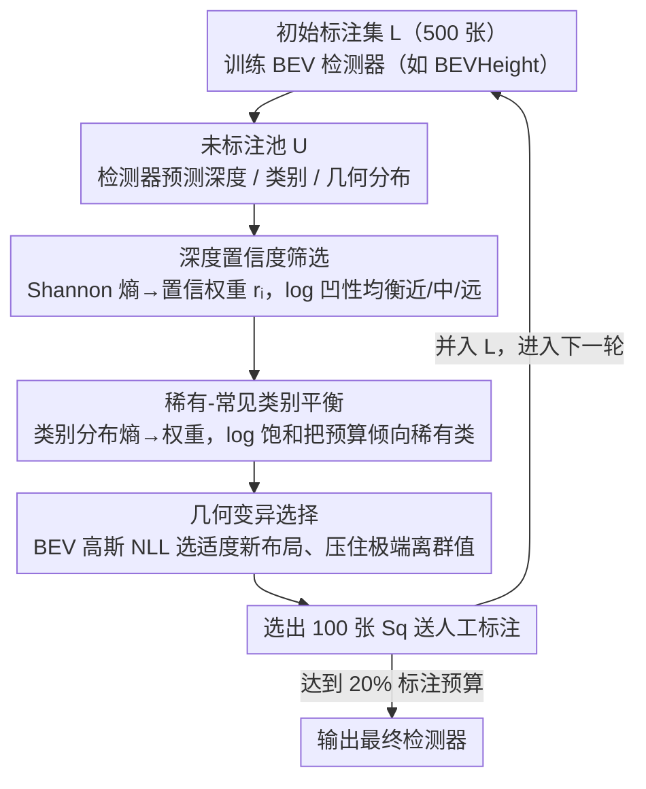

# Learnability-Driven Submodular Optimization for Active Roadside 3D Detection

**会议**: CVPR2026  
**arXiv**: [2601.01695](https://arxiv.org/abs/2601.01695)  
**代码**: 未公开  
**领域**: 自动驾驶  
**关键词**: 主动学习, 路侧感知, 单目3D检测, BEV, 子模优化, 可学习性, 数据选择

## 一句话总结

提出 LH3D 框架，通过「深度置信度→语义平衡→几何多样性」三阶段子模优化的主动学习策略，抑制路侧单目 3D 检测中固有歧义样本的选取，仅用 20% 标注预算即显著优于传统不确定性/多样性 AL 方法。

## 背景与动机

1. **路侧感知是 L5 自动驾驶的关键补充**：自车传感器存在遮挡、交叉口盲区和远距离感知不足的问题，路侧固定摄像头可大幅扩展视野覆盖
2. **标注成本是部署瓶颈**：路侧场景中目标密集、远距离小目标多、遮挡严重，单帧 3D 标注需推理深度与遮挡关系，人工标注成本极高
3. **传统主动学习在路侧场景失效**：基于不确定性的 AL 方法会优先选择高不确定性样本，而这些恰好是路侧场景中「固有歧义样本」——远距离模糊或严重遮挡的目标，单视角根本无法可靠标注
4. **固有歧义样本的发现**：人类专家在缺少车端配对数据时也难以准确标注路侧远距离物体的 3D 属性，揭示了根本性的可学习性问题
5. **人类实验验证**：在相同标注预算和类别分布下，用歧义样本训练的检测器在 Vehicle 和 Pedestrian 上 AP 明显低于可学习样本训练的模型，证明歧义样本提供的监督信号更弱
6. **需要新范式**：应从「选不确定的」转向「选可学的」，将主动学习的核心目标从不确定性转为可学习性

## 方法详解

### 整体框架

LH3D（Learnable Hierarchical 3D）要解决的是路侧主动学习的一个反常识困境：传统不确定性 AL 专挑"最不确定"的样本，可在路侧场景里这些恰恰是远距离模糊、严重遮挡的**固有歧义样本**——人都标不准，拿来训练只会拖后腿。LH3D 因此把目标从"选不确定的"换成"选可学的"。它建在 LSS-style 的 BEV 检测器（如 BEVHeight）之上，设计了一个三阶段层次化子模选择器，按深度 → 语义 → 几何的优先级依次过滤；每阶段都用 concave-over-modular 形式的子模函数建模，既支持贪心优化又自带 $(1-1/e)$ 近似保证。三阶段共享一个统一目标：

$$F(S_q) = [\Phi_A(S_q) - \Phi_A(\mathcal{U})] + [\Phi_B(\mathcal{L}_q \cup S_q) - \Phi_B(\mathcal{L}_q)] + [\Phi_C(\mathcal{L}_q \cup S_q) - \Phi_C(\mathcal{L}_q)]$$

每轮主动学习从当前检测器的预测出发，依次跑完三阶段子模贪心选择，挑出一批图像送人工标注、并入已标注集后重训检测器，循环到预算耗尽。

### 关键设计

**1. Stage 1 深度置信度筛选：先挡掉深度都估不准的歧义场景**

深度是 BEV 检测的地基，深度估不准的样本本身就不可靠，应当第一道就滤掉。对每张图像的深度预测分布算归一化 Shannon 熵 $h_i$，映射成置信度权重 $r_i = e^{-\tau h_i}$；再统计每张图像的 argmax 深度 bin 直方图 $m_i$，加权聚合成深度覆盖向量。子模目标取 $\Phi_A(S) = \sum_{d=1}^{D} \log(\epsilon + Z_d(S))$，log 的凹性保证近/中/远各距离段都能被均衡覆盖，而不是一窝蜂选近处。效果上，深度估计不靠谱的歧义场景被挡在门外，优先留下深度可信的样本。

**2. Stage 2 稀有-常见类别平衡：别让 Vehicle 一家独大**

路侧目标长尾严重，按部就班选会被海量 Vehicle 主导，Pedestrian、Cyclist 等稀有类几乎曝光不到。用当前检测器预测每张图像各类别的目标数量、归一化成类别分布 $p_i(c)$，再算每张图的语义多样性熵 $\delta_i$ 映射成权重 $\alpha_i = 1 + \gamma \delta_i$。子模目标 $\Phi_B(S) = \sum_{c \in \mathcal{C}} \log(\epsilon + N_c(S))$ 借 log 的饱和特性，让已经覆盖充分的类别边际收益急剧递减，从而把选择预算倾向稀有类，提升 Ped/Cyc 的曝光。

**3. Stage 3 几何变异选择：要新布局，但别被极端离群值带偏**

光有深度和类别还不够，模型还需要见到新的几何布局才能泛化，但又不能去追极端离群样本。对已标注集为各类别拟合 BEV 中心和高度的高斯模型 $\mathcal{N}(\mu_c, \Sigma_c)$，对候选图像算其预测框在该高斯下的负对数似然（NLL）作为几何新颖性分数 $s_{i,c}$。子模目标 $\Phi_C(S) = \sum_{c \in \mathcal{C}} \log(\epsilon + U_c(S))$ 鼓励选与已学模式有**适度**偏差的新布局，同时压住极端离群值，避免引入噪声。

### 损失函数与训练

- 检测器采用标准 BEV 管线的检测损失训练
- AL 每轮从前一轮 checkpoint 继续训练 5 个 epoch，AdamW (lr=2e-4)，batch=8
- 初始标注集 500 张图像，每轮选择 100 张，总标注预算 32K 个目标

## 实验关键数据

### DAIR-V2X-I 验证集（BEVHeight 骨干，20% 预算，Hard）

| 方法 | Vehicle | Pedestrian | Cyclist | Average |
|------|---------|------------|---------|---------|
| RANDOM | 51.41 | 13.42 | 39.38 | 34.74 |
| ENTROPY | 54.51 | 16.72 | 38.57 | 36.53 |
| BADGE | 51.33 | 14.98 | 35.35 | 33.89 |
| PPAL | 51.44 | 18.07 | 39.71 | 36.41 |
| HUA | 51.48 | 13.33 | 34.48 | 33.10 |
| **LH3D (Ours)** | **56.03** | **17.67** | **41.79** | **38.50** |

LH3D 在 Hard 模式下平均 AP 比 PPAL 高 +2.09，比 HUA 高 +5.40。

### Rope3D 验证集（BEVHeight 骨干，20% 预算，Hard）

| 方法 | Vehicle | Pedestrian | Cyclist | Average |
|------|---------|------------|---------|---------|
| RANDOM | 19.65 | 1.50 | 14.80 | 11.99 |
| PPAL | 24.12 | 1.73 | 14.80 | 13.55 |
| **LH3D (Ours)** | **26.12** | **2.04** | **16.69** | **14.95** |

### 消融实验：阶段顺序（BEVHeight，Hard）

| 顺序 | Car | Ped | Cyc | Avg |
|------|-----|-----|-----|-----|
| DC→GV→SB | 50.62 | 16.83 | 37.10 | 34.85 |
| SB→DC→GV | 55.90 | 12.46 | 35.95 | 34.77 |
| GV→DC→SB | 40.04 | 13.02 | 32.67 | 28.58 |
| **DC→SB→GV (Ours)** | **56.03** | **17.67** | **41.79** | **38.50** |

DC 必须在第一阶段（深度是 BEV 的基础），GV 在首位时性能最差（缺乏深度过滤的几何选择引入大量歧义样本）。

### 跨骨干泛化（DAIR-V2X-I，Hard，Average AP）

- BEVHeight: 38.50（最优）
- BEVSpread: 36.07（最优）
- BEVDet: 33.01（最优）

LH3D 在三种 BEV 检测器上均取得最佳结果，验证了方法的通用性。

## 亮点

1. **问题定义新颖**：首次明确提出路侧 BEV 感知中的「固有歧义样本」概念，并通过人类实验验证其对训练的负面影响
2. **可学习性驱动的范式转换**：从传统 AL 的「不确定性最大化」转向「可学习性最大化」，在路侧场景中更有实际意义
3. **理论保证完备**：三个子模目标均有单调性和子模性证明，贪心算法有 $(1-1/e)$ 近似比保证
4. **层次化设计合理**：深度→语义→几何的优先级顺序经消融验证为最优，符合 BEV 管线的依赖关系
5. **多数据集多骨干验证充分**：在 DAIR-V2X-I 和 Rope3D 上、3 种 BEV 检测器上均一致优于 7 种 AL 基线

## 局限与展望

1. **仅评估了单目 BEV 检测**：未扩展到 LiDAR 点云或多模态融合场景，适用范围受限
2. **类别数量极少**：仅 3 类（Car/Ped/Cyc），更细粒度的类别（如不同车辆类型）可能需要更复杂的语义平衡策略
3. **远距离和严重遮挡仍是瓶颈**：失败案例分析显示远距离车辆和被遮挡的行人/骑行者仍会漏检
4. **深度置信度依赖初始模型**：Stage 1 的深度筛选质量受初始小样本训练模型的影响，冷启动阶段效果可能有限
5. **计算开销未详细对比**：虽然声称选择开销可忽略，但三阶段级联对大规模池的实际耗时未充分报告
6. **未考虑时序信息**：路侧摄像头的视频流中存在时间冗余，选择策略未利用帧间相关性去重

## 与相关工作的对比

- **vs BADGE/CORESET**：这些经典 AL 方法关注不确定性或嵌入空间多样性，在路侧场景中会被歧义样本误导，LH3D 通过深度置信度显式过滤歧义
- **vs PPAL**：PPAL 是近期 SOTA 检测 AL 方法，结合难度校准的不确定性与类别匹配相似度，但未考虑路侧场景特有的深度歧义问题
- **vs HUA**：HUA 用贝叶斯深度学习做层次化不确定性估计，但不确定性高的样本在路侧往往是不可学的，导致性能反而下降
- **vs BEVHeight/BEVSpread**：这些是检测器骨干而非 AL 方法，LH3D 是即插即用的数据选择模块，可搭配任意 BEV 检测器

## 评分

- 新颖性: ⭐⭐⭐⭐ — 首次将可学习性概念引入路侧 AL，固有歧义样本的定义和人类实验设计有创新
- 实验充分度: ⭐⭐⭐⭐ — 2 数据集 × 3 骨干 × 7 基线 + 多组消融，但缺少计算开销对比
- 写作质量: ⭐⭐⭐⭐ — 逻辑清晰、理论严谨，补充材料详尽
- 价值: ⭐⭐⭐⭐ — 对路侧感知的数据效率有实际意义，但适用范围限于单目 BEV 检测

<!-- RELATED:START -->

## 相关论文

- [\[CVPR 2026\] LiDAS: Lighting-driven Dynamic Active Sensing for Nighttime Perception](lidas_lighting-driven_dynamic_active_sensing_for_nighttime_perception.md)
- [\[CVPR 2026\] ActiveAD: Planning-Oriented Active Learning for End-to-End Autonomous Driving](activead_planning-oriented_active_learning_for_end-to-end_autonomous_driving.md)
- [\[CVPR 2026\] Probabilistic Discrepancy Learning for Roadside LiDAR Scene Completion](probabilistic_discrepancy_learning_for_roadside_lidar_scene_completion.md)
- [\[ICCV 2025\] Adaptive Dual Uncertainty Optimization: Boosting Monocular 3D Object Detection under Test-Time Shifts](../../ICCV2025/autonomous_driving/adaptive_dual_uncertainty_optimization_boosting_monocular_3d_object_detection_un.md)
- [\[CVPR 2026\] Lipschitz Optimization for Formal Verification of Homographies](lipschitz_optimization_for_formal_verification_of_homographies.md)

<!-- RELATED:END -->
