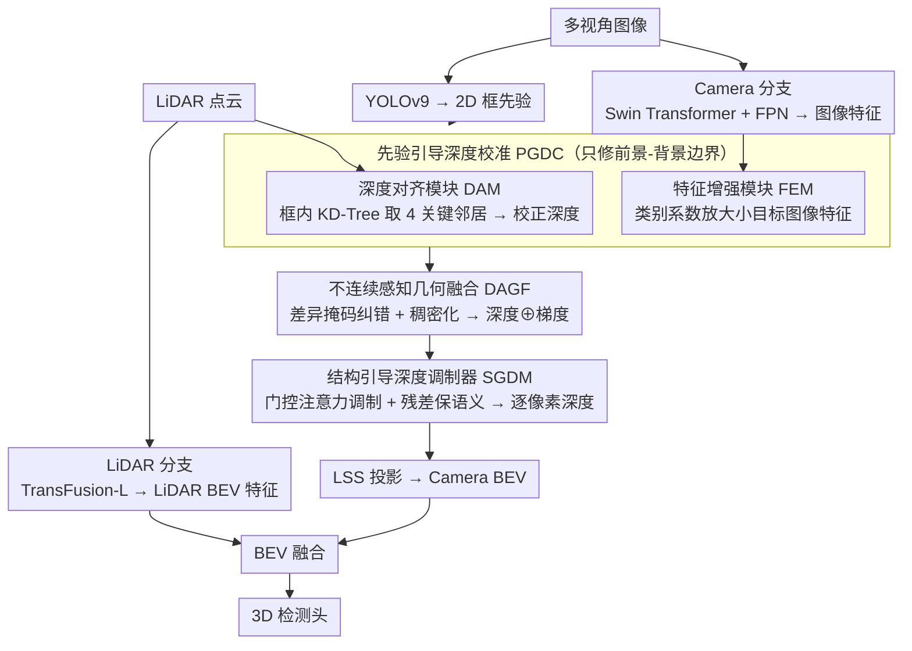

# Look Before You Fuse: 2D-Guided Cross-Modal Alignment for Robust 3D Detection

**会议**: CVPR 2026  
**arXiv**: [2507.16861](https://arxiv.org/abs/2507.16861)  
**代码**: 无  
**领域**: 自动驾驶  
**关键词**: 3D目标检测, LiDAR-Camera融合, 跨模态对齐, BEV感知, 深度估计

## 一句话总结

揭示了LiDAR-Camera融合中特征不对齐主要集中在**前景-背景深度突变边界**，提出PGDC（2D先验引导深度校准）+DAGF（不连续感知几何融合）+SGDM（结构引导深度调制器）三个协同模块，在融合前主动修正不对齐问题，在nuScenes验证集达到mAP 71.5%、NDS 73.6%的SOTA。

## 研究背景与动机

LiDAR-Camera融合是自动驾驶3D感知的主流范式。Camera提供丰富的语义信息但缺少准确深度，LiDAR提供精确几何但稀疏且缺少语义。将两者融合到统一的BEV表示中是当前SOTA方法（BEVFusion等）的核心做法。

然而，这些方法面临一个**根本性的技术瓶颈：跨模态空间不对齐**。不对齐来源于两方面：

**外参标定误差**：传感器之间的相对位姿不够精确

**滚动快门效应**：CMOS相机逐行曝光导致的运动畸变

这种不对齐产生**投影误差**，带来两个后果：
- **深度监督被污染**：错误的LiDAR投影为Camera分支提供了有噪声的深度标签
- **特征融合被破坏**：语义不匹配的图像和几何特征在BEV空间被关联

现有方法的应对策略各有根本性缺陷：
- **TransFusion**：用注意力机制查询单一模态特征，避免了投影误差但**牺牲了互补信息**
- **MetaBEV/RobBEV**：设计更鲁棒的融合模块，但**无法修正已错位的特征**——相当于"巧妙地融合了错误的数据"
- **GraphBEV**：全局对齐技术，能消除深度梯度大的区域的不对齐，但**过度平滑了本身已对齐的区域**，破坏了正确的深度值

本文的**核心洞察**是：**不对齐不是随机分布的，而是高度可预测的**——它集中在前景物体与背景之间存在剧烈深度跳变的边界处。远距离的投影误差更大，且在深度不连续处最为严重。而**2D目标检测器可以可靠地定位这些区域**。

因此，本文的策略是"**先看再融合(Look Before You Fuse)**"——用2D目标先验在融合发生之前主动定位和修正不对齐，同时保持已对齐区域不变。

## 方法详解

### 整体框架

这篇论文要解决 LiDAR-Camera 融合里的跨模态空间不对齐——传感器标定误差和滚动快门让 LiDAR 点投到图像上时错位，错位的深度既污染了 Camera 分支的深度监督、又让语义和几何在 BEV 空间被错误关联。它的核心主张是“先看再融合”：在融合发生之前，先用 2D 目标检测先验定位并修正不对齐，再去做 BEV 融合。整体构建在 BEVFusion 之上——LiDAR 分支经 TransFusion-L 得 LiDAR BEV 特征，Camera 分支经 Swin Transformer + FPN 得图像特征；随后 PGDC 用 2D 框定位错位区做局部深度校正与特征增强，DAGF 把校正后的稀疏深度变成密集的深度+梯度表示，SGDM 用门控注意力融合图像特征与几何表示预测逐像素深度，最后经 LSS 投到 BEV 与 LiDAR BEV 融合做 3D 检测。

### 关键设计

**1. 先验引导深度校准 PGDC：只在前景-背景边界这种错位高发区做修正**

不对齐不是随机散布的，而是高度集中在前景物体与背景的深度突变边界处，且 2D 检测器能可靠地框出这些区域，所以 PGDC 把修正限定在 2D 框内、不动已对齐的区域。它含两个子模块：深度对齐模块（DAM）让 YOLOv9 生成 2D 框 $\{B_j^{(i)}\}$，对框内每个 LiDAR 投影点 $p$（深度 $d_p$）用 KD-Tree 找 10 个最近邻，再从中挑出深度最小的 2 个和最大的 2 个组成 4 个关键邻居 $\mathcal{N}_{\text{critical}}$——这样既抓住物体自身的深度一致性、又抓住前景-背景的深度突变；把原始深度和 4 个邻居深度拼成 5 通道特征 $f_p = \text{concat}(d_p, \{d_q\}_{q \in \mathcal{N}_{\text{critical}}})$，过轻量卷积得到校正深度 $d'_{\text{aligned}}(p) = \text{ReLU}(\text{BN}(\text{Conv}(f_p)))$。特征增强模块（FEM）则用类别特定系数 $\alpha_k$ 放大框内图像特征 $F_{\text{enhanced}}(p,c) = \alpha_k \cdot F_{\text{img}}(p,c)$，小目标（行人、锥桶）给更大的 $\alpha_k$、大目标（卡车、巴士）给更小的，再经 SE block 做通道重标定——因为小目标特征最容易在融合里被淹没。

**2. 不连续感知几何融合 DAGF：自带纠错的稀疏深度稠密化**

PGDC 的校正依赖 2D 先验，先验不准时反而会过度平滑，所以 DAGF 先做一道自纠正：算原始深度和校正深度的差异 $\Delta = |D_{\text{raw}} - D_{\text{aligned}}|$，差异超过原深度 10% 的像素被判为不可靠直接掩除——2D 先验错得越离谱、差异越大、越会被自动抑制。掩除后把稀疏图切成 20×20 不重叠块，每块算两个量：平均深度 $d_{\text{avg}}$ 广播到整块完成稠密化，最大梯度 $g_{\max}$（块内点对间最大深度差）标识深度突变区域，最终拼出 2 通道特征 $F_{\text{FA}} = [D_{\text{dense}} \oplus G_{\text{dense}}]$，把“哪里是边界”这条结构信息显式带进后续融合。

**3. 结构引导深度调制器 SGDM：用几何线索调制深度、残差保住语义**

光有几何表示还不够，得让它去引导 Camera 分支的深度预测而不冲掉语义。SGDM 把 Camera 图像特征和 DAGF 的几何表示各过并行卷积编码、拼接后用门控注意力生成空间注意力图来调制深度预测，并用残差连接保留原始 Camera 特征、避免融合过程稀释语义信息；输出是逐像素的离散深度分布，把深度估计转成分类问题，再交给 LSS 投影。

### 损失函数 / 训练策略

$$\mathcal{L}_{\text{total}} = \mathcal{L}_{\text{focal}} + \mathcal{L}_{\text{edge}} + \mathcal{L}_{\text{cls}} + \mathcal{L}_{\text{box}}$$

- **Focal Loss** $\mathcal{L}_{\text{focal}}$：以稠密深度图 $D_{\text{dense}}$ 作为监督目标（$\gamma=2.0, \alpha=0.25$）
- **Edge-Critical Loss** $\mathcal{L}_{\text{edge}}$：用梯度图 $G_{\text{dense}}$ 作为权重放大深度突变区域的损失——迫使网络在结构关键区域更准确

   $$\mathcal{L}_{\text{edge}} = \frac{1}{|\mathcal{V}|}\sum_{(u,v) \in \mathcal{V}} G^{(i)}(u,v) \cdot l_{\text{focal}}(u,v)$$

- 训练：8×RTX 4090 GPU，Swin Transformer backbone (heads: 3/6/12/24)

## 实验关键数据

### 主实验 — nuScenes验证集

| 方法 | 会议 | mAP(%) | NDS(%) |
|------|------|--------|--------|
| TransFusion-L | CVPR 22 | 65.5 | 70.2 |
| BEVFusion-PKU | NeurIPS 22 | 67.9 | 71.0 |
| BEVFusion-MIT | ICRA 23 | 68.5 | 71.4 |
| BEVDiffuser | CVPR 25 | 69.2 | 71.9 |
| GraphBEV | ECCV 24 | 70.1 | 72.9 |
| **Ours** | — | **71.5** | **73.6** |

相比GraphBEV: mAP +1.4%, NDS +0.7%。Argoverse 2上达到41.7% mAP。

### 消融实验 — 三模块贡献（nuScenes）

| PGDC | DAGF | SGDM | mAP(%) | NDS(%) | 延迟增加(ms) |
|------|------|------|--------|--------|-------------|
| ✗ | ✗ | ✗ | 67.9 | 71.0 | +0.0 |
| ✓ | ✗ | ✓ | 69.8 | 72.5 | +13.0 |
| ✗ | ✓ | ✓ | 69.0 | 71.6 | +7.0 |
| ✓ | ✓ | ✓ | **71.5** | **73.6** | +15.0 |

### 细粒度消融 — 模块内部

| DAM | FEM | $D_{\text{dense}}$ | $G_{\text{dense}}$ | mAP(%) | NDS(%) |
|-----|-----|-----|-----|--------|--------|
| ✗ | ✗ | ✗ | ✗ | 67.9 | 71.0 |
| ✓ | ✗ | ✗ | ✗ | 69.4 | 72.1 |
| ✓ | ✓ | ✗ | ✗ | 69.8 | 72.5 |
| ✓ | ✓ | ✓ | ✗ | 70.8 | 73.1 |
| ✓ | ✓ | ✓ | ✓ | **71.5** | **73.6** |

### 2D先验质量的影响

| 2D先验来源 | mAP(%) | NDS(%) |
|-----------|--------|--------|
| 随机先验 | 68.5 | 71.2 |
| 无先验 | 69.0 | 71.6 |
| 全图先验 | 69.4 | 71.8 |
| YOLO-X | 70.3 | 72.5 |
| YOLOv9 | 71.5 | 73.6 |
| Ground Truth | 73.5 | 74.2 |

### 关键发现

- **每个模块独立贡献显著**：DAM单独+1.5 mAP，FEM再+0.4，稠密化+1.0，梯度图+0.7，层层递进
- **2D检测质量直接影响最终性能**：从随机先验(68.5)到GT先验(73.5)，差距5% mAP——2D检测器的进步会直接传导到3D检测
- **随机先验 < 无先验**：随机框不仅无用还有害（68.5 < 69.0），因为它错误地修改了已对齐的区域
- **PGDC加速明显物超所值**：仅增加15ms延迟就换来了3.6% mAP提升
- **DAGF的自纠正机制有效**：差异掩码能自动过滤PGDC因2D先验不准而引入的误差

## 亮点与洞察

- **"不对齐是可预测的"**这一洞察非常深刻：将看似随机的传感器误差与结构化的场景属性（前景-背景边界）联系起来
- **"先看再融合"的范式**比"直接融合后修补"在根本上更合理——在错误传播之前就将其消除
- DAGF的差异掩码设计很巧妙：当PGDC过度校正时自动回退，提供了安全网
- Edge-Critical Loss用梯度图加权Focal Loss的设计，将结构先验引入了训练目标
- 细粒度消融（Table 4）展示了教科书式的模块贡献分析

## 局限与展望

- 依赖2D目标检测器的质量——在2D检测困难的场景（极端天气、严重遮挡）可能退化
- YOLOv9引入的额外计算开销未量化（文中只报告了模块增加的延迟，不包含2D检测器）
- 分块稠密化使用固定20×20块大小，未分析对不同距离/密度区域的影响
- 类别特定增强参数 $\alpha_k$ 是手动设定的超参数，可否自动学习？
- 仅在nuScenes和Argoverse 2上验证，缺少Waymo等更大规模数据集的结果

## 相关工作与启发

- **GraphBEV** (ECCV 2024) 是最直接的对比对象：它做全局对齐但过度平滑，本文做局部精确对齐
- **BEVFusion-PKU/MIT** 作为基线证明了不对齐对融合性能的限制
- 2D先验→3D提升的思路可推广：例如用2D跟踪先验辅助3D跟踪的融合
- LSS范式（Lift-Splat-Shoot）的深度估计质量是Camera-BEV方法的瓶颈，本文从对齐角度攻克了这个问题

## 评分

- **新颖性**: ⭐⭐⭐⭐ 问题洞察深刻（不对齐集中在边界），"先看再融合"范式有原创性
- **实验充分度**: ⭐⭐⭐⭐⭐ 消融极其细致（5个表格），2D先验敏感性分析、跨数据集验证齐全
- **写作质量**: ⭐⭐⭐⭐ 图1的示例非常直观，motivation讲述清晰
- **价值**: ⭐⭐⭐⭐ BEV融合是工业界主流方案，对齐改进有直接工程价值

## 评分
- 新颖性: 待评
- 实验充分度: 待评
- 写作质量: 待评
- 价值: 待评

<!-- RELATED:START -->

## 相关论文

- [\[CVPR 2026\] RPGFusion: 4D Radar Prior-Guided Multi-Modal Fusion for 3D Detection](rpgfusion_4d_radar_prior-guided_multi-modal_fusion_for_3d_detection.md)
- [\[CVPR 2026\] Think Before You Drive: World Model-Inspired Multimodal Grounding](think_before_you_drive_world_model-inspired_multimodal_grounding.md)
- [\[CVPR 2026\] LiDAR-to-4DRadar Diffusion Bridge via Cross-Modal Alignment and Translation in Latent Space](lidar-to-4dradar_diffusion_bridge_via_cross-modal_alignment_and_translation_in_l.md)
- [\[ECCV 2024\] GraphBEV: Towards Robust BEV Feature Alignment for Multi-Modal 3D Object Detection](../../ECCV2024/autonomous_driving/graphbev_towards_robust_bev_feature_alignment_for_multi-modal_3d_object_detectio.md)
- [\[CVPR 2026\] CCF: Complementary Collaborative Fusion for Domain Generalized Multi-Modal 3D Object Detection](ccf_complementary_collaborative_fusion_for_domain_generalized_multi-modal_3d_obj.md)

<!-- RELATED:END -->
