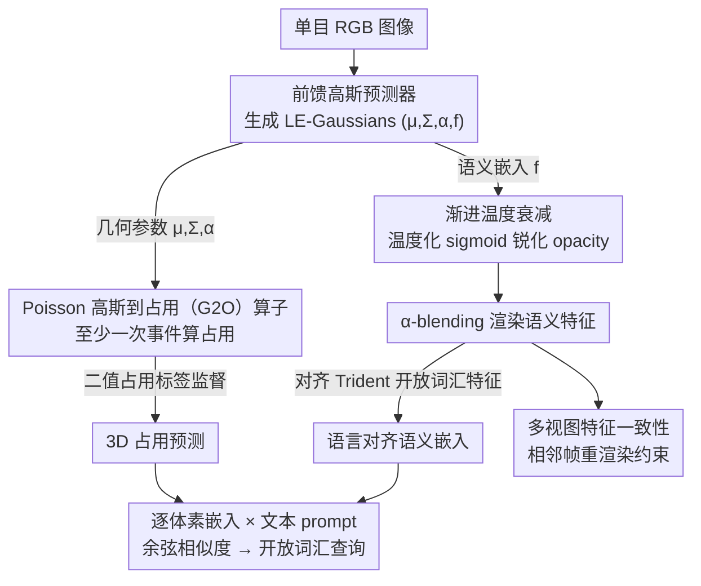

# Monocular Open Vocabulary Occupancy Prediction for Indoor Scenes (LegoOcc)

**会议**: CVPR 2026  
**arXiv**: [2602.22667](https://arxiv.org/abs/2602.22667)  
**代码**: [https://github.com/JuIvyy/LegoOcc](https://github.com/JuIvyy/LegoOcc)  
**领域**: 自动驾驶 / 室内场景理解  
**关键词**: 开放词汇占用预测, 3D高斯表示, Poisson聚合, 温度衰减, 室内场景

## 一句话总结

提出 LegoOcc，利用语言嵌入高斯（LE-Gaussians）作为统一的几何-语义中间表示，结合基于 Poisson 过程的高斯到占用（G2O）算子和渐进温度衰减策略，在仅使用二值占用标签（无语义标注）的情况下实现室内场景的单目开放词汇占用预测，在 Occ-ScanNet 上达到 59.50 IoU / 21.05 mIoU。

## 研究背景与动机

室内场景的 3D 语义占用预测对具身智能体至关重要，但面临三大挑战：

**室内 vs 室外差异大**：室内场景几何更密集、布局更复杂、语义类别更细粒度且长尾分布严重。已有的户外开放词汇占用方法（如 POP-3D、LOcc）直接迁移到室内效果很差（mIoU 仅 5.96/9.25）。

**闭集词汇限制**：现有室内占用方法（ISO、EmbodiedOcc 等）依赖固定类别标注训练，无法识别训练集外的物体，不适合真实部署。

**语义标注成本高**：室内场景类别多且分布长尾，密集语义标注代价极高。相比之下，二值占用标签可以通过深度重建自动获取，成本低得多。

因此本文采用 **geometry-only supervision**（仅二值占用标签，无语义标注）的范式，探索如何在此弱监督条件下实现开放词汇占用预测。

## 方法详解

### 整体框架

LegoOcc 以单目 RGB 图像为输入，由前馈高斯预测器生成一组语言嵌入高斯（LE-Gaussians），每个高斯参数化为：

$$\mathcal{G}_i = (\boldsymbol{\mu}_i, \boldsymbol{\Sigma}_i, \alpha_i, \mathbf{f}_i)$$

其中 $\boldsymbol{\mu}_i, \boldsymbol{\Sigma}_i, \alpha_i$ 编码几何信息，$\mathbf{f}_i \in \mathbb{R}^d$ 是语言对齐的语义嵌入。同一组高斯同时用于：
- **几何学习**：通过 Poisson-based G2O 算子预测 3D 占用，用二值标签监督
- **语义学习**：将高斯特征渲染到图像平面，与开放词汇分割模型（Trident）的特征对齐

推理时，对每个被占用体素的嵌入与文本 prompt 计算余弦相似度，即可实现任意类别的语义查询。

### 关键设计

**1. Poisson 高斯到占用（G2O）算子：用“至少发生一次事件”算占用，避免重叠饱和**

弱监督下体素聚合很容易不稳定，而已有 G2O 算子各有硬伤：GaussianFormer2 聚合时干脆不看 opacity $\alpha_i$、只用空间核 $p_i(\mathbf{x})$，导致几何聚合和渲染对不上；Bernoulli 方法用 $\tilde{\alpha}_i = \alpha_i p_i(\mathbf{x})$ 的互补概率规则，可多个高斯一重叠并集就迅速饱和到 1，逼着 opacity 学成很小的值、反过来毁掉特征渲染。LegoOcc 换个视角，把每个高斯的局部贡献看成非齐次 Poisson 过程的事件强度 $h_i(\mathbf{x}) \triangleq \alpha_i p_i(\mathbf{x}),\ z(\mathbf{x}) = \sum_{i=1}^N h_i(\mathbf{x})$，占用概率就是“至少发生一个事件”的概率 $p(\mathbf{x}) = 1 - \exp\left(-\sum_{i=1}^N \alpha_i p_i(\mathbf{x})\right)$。相比 Bernoulli 的乘积形式 $1 - \prod(1-\alpha_i p_i)$，这个指数加和形式在多高斯重叠时不会饱和，opacity 能保持有区分度的值，几何聚合和语义渲染因此同时稳住——消融里换成 GaussianFormer2 算子直接崩到 0 IoU。

**2. 渐进温度衰减：让渲染特征从“混合物”逐步收敛成单体素表示**

标准 $\alpha$-blending 渲染出的特征是沿光线多个高斯嵌入的加权混合，于是像素特征成了一锅混合物、而不是某个高斯干净的语言对齐表示，语义就糊了。方法给 opacity 套一个温度化 sigmoid $\alpha_i = \sigma\left(\frac{\alpha_i^{\text{logit}}}{\tau}\right)$，再让温度按指数调度衰减 $\tau(r) = \max\{T_{\min}, T_{\max} \cdot (T_{\min}/T_{\max})^r\}$（$r \in [0,1]$ 为训练进度，默认 $T_{\max}=1, T_{\min}=10^{-3}$）。训练初期温度高、优化平滑；后期温度压低、opacity 趋向 $\{0,1\}$ 二值，特征混合被压住。它相比 Dr. Splat 那种硬 Top-k 选择保持了端到端可微，相比线性衰减又在低温区分到更多迭代步——消融里指数衰减的 mIoU 21.05 远高于线性衰减的 2.30。

**3. 多视图特征一致性：用相邻帧重渲染白嫖跨视角约束**

单帧渲染的语义对齐容易在视角变化下漂移，方法顺手利用相邻帧（默认 5 帧）重渲染、施加同一套特征对齐损失，不需要任何额外 2D 标注就把跨视角语义一致性也约束上，是低成本的稳定项。

### 损失函数 / 训练策略

$$L_{\text{total}} = \lambda_{\text{focal}} L_{\text{focal}} + \lambda_{\text{lov}} L_{\text{lov}} + \lambda_{\text{scal}} L_{\text{scal}} + \lambda_{\text{feat}} L_{\text{feat}} + \lambda_{\text{depth}} L_{\text{depth}}$$

- $L_{\text{focal}}$：Focal Loss，二值占用监督
- $L_{\text{lov}}$：Lovász-Softmax 损失，优化 IoU
- $L_{\text{scal}}$：场景类别亲和正则化，促进空间一致性
- $L_{\text{feat}}$：余弦对齐损失，渲染特征 vs 开放词汇分割特征（Trident）
- $L_{\text{depth}}$：Huber 深度损失，稳定几何学习

训练配置：Depth-Anything V2 作为深度 backbone，AdamW 优化器，lr $2 \times 10^{-4}$ + cosine decay，4×RTX 4090，10 epochs。

## 实验关键数据

### 主实验

| 方法 | Setting | IoU | mIoU | FPS |
|------|---------|-----|------|-----|
| ISO | 闭集（全标注） | 42.16 | 28.71 | 3.81 |
| EmbodiedOcc | 闭集（全标注） | 53.55 | 45.15 | 11.48 |
| RoboOcc | 闭集（全标注） | 56.48 | 47.76 | - |
| POP-3D† | 开放词汇 | 35.32 | 5.96 | 10.21 |
| LOcc† | 开放词汇 | 36.70 | 9.25 | 8.93 |
| **LegoOcc (Ours)** | **开放词汇** | **59.50** | **21.05** | **22.47** |

开放词汇设定下，LegoOcc 在 IoU 上超越所有方法（包括闭集），mIoU 比之前最佳开放词汇方法高 11.80（2 倍以上），且推理速度最快。

### 消融实验

| G2O 算子 | Setting | IoU | mIoU | 说明 |
|----------|---------|-----|------|------|
| GaussianFormer2 | 开放词汇 | 0.00 | 0.00 | 完全崩溃，opacity 不一致 |
| Bernoulli | 开放词汇 | 46.65 | 17.25 | 可用但 opacity 被压缩 |
| **Poisson** | **开放词汇** | **59.50** | **21.05** | 最优，稳定聚合 |

| 温度策略 | $T_{\min}$ | $T_{\max}$ | IoU | mIoU | 说明 |
|----------|------------|------------|-----|------|------|
| 无调度 ($\tau=1$) | 1.0 | 1.0 | 59.19 | 18.15 | 几何好但语义差 |
| 常数低温 ($\tau=10^{-3}$) | 1e-3 | 1e-3 | 0.00 | 0.00 | 优化崩溃 |
| 线性衰减 | 1e-3 | 1.0 | 7.60 | 2.30 | 低温迭代不够 |
| **指数衰减** | **1e-3** | **1.0** | **59.50** | **21.05** | 最优配置 |

### 关键发现

- G2O 算子选择对开放词汇至关重要：GaussianFormer2（不含 opacity）在开放词汇下直接崩溃到 0
- 温度调度是语义学习的核心：不做调度 mIoU 仅 18.15，加入指数衰减提升到 21.05
- 开放词汇 LegoOcc 的 IoU（59.50）甚至超越了所有闭集全标注方法的 IoU
- 当前开放词汇 mIoU 与闭集仍有 ~26 的差距，主要源于室内细粒度类别的文本歧义

## 亮点与洞察

1. **Poisson 过程建模占用的思路很优雅**：将高斯贡献视为事件强度，体素占用为"至少一次事件"，物理直觉清晰，数学形式简洁，且自然兼容 opacity
2. **温度调度弥合了渲染与聚合的 gap**：渐进锐化 opacity 使特征从"混合物"逐步变为"单体素特征"，是 differentiable 版的 hard assignment
3. **弱监督超越强监督的 IoU**：开放词汇模型在几何精度上超过了闭集全标注方法，证明 language-embedded Gaussians 作为中间表示的表达能力很强
4. **推理速度最快**（22.47 FPS），比 ISO（3.81）快 6 倍，兼顾性能和效率

## 局限与展望

1. **mIoU 仍有提升空间**：开放词汇 mIoU（21.05）与闭集（47.76）差距大，尤其是 tvs（5.36）、furniture（5.88）、objects（6.94）等细粒度类别识别困难
2. **依赖外部模型**：需要 Depth-Anything V2 提供深度先验 + Trident 提供开放词汇分割特征 + Qwen2.5-VL 提取物体名词，pipeline 较长
3. **仅验证单一数据集**：所有实验在 Occ-ScanNet 上进行，泛化到其他室内场景（如 Matterport3D、Replica）未验证
4. **细粒度语义对齐困难**：当多个语义相近的类别在图像空间重叠时（如 furniture vs objects），即使有温度衰减也难以完全消除混淆
5. **单目设置限制**：未探索多视图输入对开放词汇占用的增益

## 相关工作与启发

- **EmbodiedOcc / EmbodiedOcc++**：闭集室内占用SOTA，使用高斯体积预测，本文在此基础上扩展到开放词汇
- **GaussianFormer2**：提出 G2O 算子但不含 opacity，本文分析其在开放词汇下的失效原因并提出 Poisson 改进
- **Dr. Splat**：用硬 Top-k 注册 CLIP 特征到高斯，本文用连续温度衰减替代，保持可微性
- **POP-3D / LOcc**：户外开放词汇占用方法，本文实验证明其迁移室内效果差
- **启发**：Poisson 过程建模可推广到其他神经隐式表示的占用估计；温度调度技巧可用于任何涉及 $\alpha$-blending 特征渲染的场景

## 评分

- 新颖性: ⭐⭐⭐⭐ Poisson G2O + 温度衰减的组合有理论深度，分析透彻
- 实验充分度: ⭐⭐⭐ 在 Occ-ScanNet 上做了全面消融，但仅一个数据集
- 写作质量: ⭐⭐⭐⭐ 问题分析清晰，从 GaussianFormer2→Bernoulli→Poisson 层层递进
- 价值: ⭐⭐⭐⭐ 首次在大规模室内场景实现实用的开放词汇占用预测，推动具身智能落地

<!-- RELATED:START -->

## 相关论文

- [\[ECCV 2024\] Monocular Occupancy Prediction for Scalable Indoor Scenes](../../ECCV2024/autonomous_driving/monocular_occupancy_prediction_for_scalable_indoor_scenes.md)
- [\[CVPR 2026\] Open-Vocabulary Domain Generalization in Urban-Scene Segmentation](open-vocabulary_domain_generalization_in_urban-scene_segmentation.md)
- [\[CVPR 2026\] ReScene4D: Temporally Consistent Semantic Instance Segmentation of Evolving Indoor 3D Scenes](rescene4d_temporally_consistent_semantic_instance_segmentation_of_evolving_indoo.md)
- [\[CVPR 2025\] O3N: Omnidirectional Open-Vocabulary Occupancy Prediction](../../CVPR2025/autonomous_driving/o3n_omnidirectional_open-vocabulary_occupancy_prediction.md)
- [\[CVPR 2026\] ProOOD: Prototype-Guided Out-of-Distribution 3D Occupancy Prediction](proood_prototype-guided_out-of-distribution_3d_occupancy_prediction.md)

<!-- RELATED:END -->
