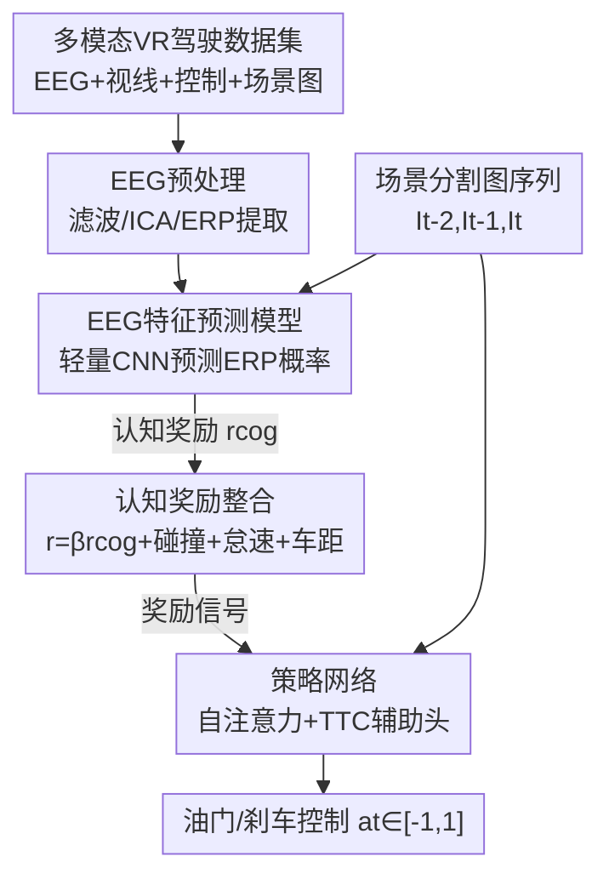

# Neuro-Cognitive Reward Modeling for Human-Centered Autonomous Vehicle Control

**会议**: CVPR 2026  
**论文**: [CVF Open Access](https://openaccess.thecvf.com/content/CVPR2026/html/Zhuang_Neuro-Cognitive_Reward_Modeling_for_Human-Centered_Autonomous_Vehicle_Control_CVPR_2026_paper.html)  
**代码**: 项目页 https://alex95gogo.github.io/Cognitive-Reward/  
**领域**: 自动驾驶 / 强化学习 / 人类反馈对齐  
**关键词**: 脑电信号、事件相关电位、认知奖励、RLHF、碰撞避免

## 一句话总结
这篇论文用脑电信号（EEG）里的事件相关电位（ERP）作为"人类认知反馈"，训练一个能从场景图像直接预测 ERP 强度的轻量 CNN，把它的输出当作奖励项注入强化学习（TD3），让自动驾驶智能体在紧急制动和左转两个高难度场景里学会更安全、更像人的避撞行为——而且推理时完全不需要再采 EEG。

## 研究背景与动机
**领域现状**：端到端自动驾驶（E2E-AD）借助深度网络直接把相机图像映射到控制信号，在 CARLA leaderboard 上已经能逼近规则专家系统。但这套范式的主力训练方式是模仿学习（IL），靠复现专家轨迹来学。

**现有痛点**：IL 有个老毛病——分布偏移（distribution shift）。模型只学到了专家演示的那个特定分布，没见过足够多的失败案例，所以一到分布外场景（比如急刹、交互式驾驶）就容易翻车。研究表明 leaderboard 上的顶尖 E2E-AD 模型在紧急制动这类交互场景里表现很差，本质是缺乏对"决策"和"交互动态"的显式指导，更多是在机械复制轨迹而非像人那样推理。

**核心矛盾**：强化学习（RL）靠试错能缓解分布偏移，但 RL 和 IL 都不保证和人类期望对齐——RL 只会盲目优化预设的奖励函数，而人工设计的奖励往往捕捉不到人类价值的复杂性。RLHF（带人类反馈的强化学习）是对齐的主流答案，但传统 RLHF 要让标注员对生成片段排序/两两比较，既耗时又"间接"：这种显式打分未必能反映人在驾驶时真实的认知反应。论文里那次 RLHF 基线就花了三个人约 10 小时做 2000 对偏好标注。

**本文目标**：找一种既能反映人类认知、又不打断驾驶行为、还能规模化的反馈信号，把它喂给 RL。

**切入角度**：作者盯上了 ERP——尤其是刺激出现后 300–500ms 出现的 P3 正峰。神经科学早已证明 P3 是大脑对"意外/罕见/突发刺激"的可靠生物标记，幅度随认知负荷（任务难度）增大而升高，且具有毫秒级时间分辨率，还能捕捉到眼动追踪测不到的"隐性注意"。关键观察是：作者在 20 名真实驾驶被试上发现 **ERP 峰潜伏期与驾驶员反应时间显著正相关**（Pearson $p=0.0438$）——这说明 ERP 确实编码了"这一刻有多危急、人有多紧张"。

**核心 idea**：与其在推理时实时采 EEG（既不可扩展、ErrP 又只在出错后才出现、有延迟），不如训一个**从场景图像直接预测 ERP 是否发生**的网络，把这个预测概率当成"认知奖励"塞进 RL 奖励函数——用图像当代理，推理时彻底甩掉 EEG 采集。

## 方法详解

### 整体框架
整套系统要解决的是"如何把人脑对危险的本能反应变成 RL 能用的奖励"。它分三段串起来：**先离线采 EEG 并提取 ERP（只在训练认知奖励模型时用）→ 训一个轻量 CNN 从场景分割图预测 ERP 发生概率，得到认知奖励 $r_\text{cog}$ → 把 $r_\text{cog}$ 与环境奖励加权合成总奖励，驱动一个带自注意力和 TTC 辅助头的策略网络做 TD3 训练**。推理时只剩图像 → 策略网络 → 油门/刹车，EEG 整条链路都不再需要。

### 关键设计

**1. 多模态 VR 驾驶数据集：给认知奖励提供"危险时刻"的脑电真值**

要从图像预测 ERP，得先有图像-ERP 的配对数据，而现有驾驶数据集要么只有眼动、要么用平面屏幕，没人同时采主动控制 + EEG + 视线 + 场景图。作者用 HTC Vive Pro Eye VR 头显 + CARLA + Logitech G923 方向盘踏板，让被试沉浸式真实驾驶，64 通道 Synamps2 以 1000Hz 采 EEG。最终从 32 人中保留 20 人（12 人因 VR 晕动症或参与度不足被剔除），共 **720K 帧**，是表 1 里帧数最多、且唯一同时具备主动控制 + EEG + 视线 + 多模态相机（RGB/深度/语义）的 VR 数据集。两个场景专门设计来"诱发失败"：紧急制动（前车以最高 8 m/s 行驶、随机在上次事件后 4–7 秒突然刹车，且有尾车施压制造紧迫感）和左转（在路口左转、避让 3–5 m/s 不让行的对向来车）。ERP 分析以"前车刹车起始"为事件标记，并用眼动剔除当时没看车的试次。

**2. EEG 特征预测模型：把脑电反应变成图像可推断的认知奖励**

这是甩掉推理期 EEG 的核心。作者先把 ERP 试次二分类——用窗长 20 的滑动平均滤波，再以 **1.7 µV 的峰峰阈值**切成高 ERP / 低 ERP 两类（这个阈值既让训练集 50/50 平衡，也对应文献报告的最小 ERP 峰幅）。然后设计一个**三层卷积 + 平均池化的轻量 CNN**，输入语义分割图序列，输出"该试次是否诱发 ERP"的二分类概率 $\hat{y}_i$，用二元交叉熵训练：

$$L_\text{BCE} = -\frac{1}{N}\sum_{i=1}^{N}\big[y_i\log(\hat{y}_i) + (1-y_i)\log(1-\hat{y}_i)\big]$$

其中 $y_i$ 为真值标签（高 ERP 为 1）。轻量设计的意义不只是省参数防过拟合，更是为了**实时**——它跑到 204 FPS，远高于 ResNet-18 等骨干，因而能作为预训练模型嵌进 RLHF 循环而不拖慢 RL 训练。这个 $\hat{y}_i$ 就是下一步认知奖励 $r_\text{cog}$ 的来源。

**3. 认知奖励整合：用负权重把"高认知负荷"翻译成惩罚**

预测出 ERP 概率后，怎么用？作者把任务建模成目标导向的避撞 MDP $\{S,A,P,R\}$，状态是连续三帧单通道语义分割图 $s_t=\{I_{t-2},I_{t-1},I_t\}$，动作是纵向控制标量 $a_t\in[-1,1]$（$-1$ 全力刹车、$1$ 全油门）。关键在奖励函数把认知信号和环境信号合成：

$$r_t = \beta\, r_\text{cog}(s_t) + r_\text{collide}\cdot(s_t\in C_\text{collide}) + \omega\, r_\text{idle}\cdot(s_t\in C_\text{idle}) + \delta\, r_\text{gap}(s_t)$$

这里 $r_\text{cog}(s_t)$ 就是上一步预测的 ERP 概率 $\hat{y}_i$，权重 $\beta=-1$ 是**负的**——因为高 ERP 意味着大脑感知到了高认知负荷/危险，所以应当惩罚智能体进入这种状态，引导它远离让人脑紧张的处境。其余项是常规环境奖励：碰撞重罚 $r_\text{collide}=-100$，车速低于 0.2 m/s 的怠速轻罚 $r_\text{idle}=-1$，以及鼓励保持理想跟车距离的时间间隔奖励 $r_\text{gap}$。这个设计的巧妙之处是：人脑的危险直觉（ERP）被转译成了一个稠密、可微的奖励整形项，缓解了 RL 奖励稀疏的问题。

**4. 带自注意力与 TTC 辅助头的策略网络：扩大感受野并用碰撞时间正则化**

策略网络（图 3）吃三帧语义分割图 $s_t\in\mathbb{R}^{h\times w\times 3}$，先用浅层 CNN 编码成特征图 $F\in\mathbb{R}^{h/16\times w/16\times f}$，展平为 $N\in\mathbb{R}^{n\times f}$（$n=\frac{h}{16}\times\frac{w}{16}$），再过一层自注意力来扩大感受野：通过全连接 $f_Q,f_K,f_V$ 得到 $Q,K,V$，计算 $\text{SelfAttention}=\text{softmax}(QK^\top/\sqrt{d})V$。之所以加自注意力，是因为避撞需要"全局看清前车在哪"，卷积局部感受野不够。网络有**两个 MLP 头**：一个出动作 $a_t\in[-1,1]$，另一个出碰撞时间（TTC）作为辅助正则：

$$\text{TTC} = \text{clip}\big(\text{Dis}/(V_\text{ego}-V_\text{front}),\, 0,\, 5\big)$$

其中 Dis 是与最近车辆的距离，TTC 裁剪到 $[0,5]$ 秒让模型聚焦危急情形。TTC 头用 MSE 对齐真值，总损失 $L_\text{total}=L_\pi + \alpha L_\text{mse}$（$\alpha=0.1$，$L_\pi$ 为 RL 策略损失）。TTC 辅助任务的作用是给策略注入"还有几秒撞上"的物理先验，起到训练正则化的效果。RL 算法本身用的是 TD3（off-policy，连续控制更稳更省样本）。

### 损失函数 / 训练策略
认知奖励模型用 BCE（式 1）做五折交叉验证训练；策略网络用 $L_\text{total}=L_\pi+0.1\,L_\text{mse}$，其中 $L_\pi$ 是 TD3 的策略损失、$L_\text{mse}$ 是 TTC 辅助回归损失。RL 训练 1M 步；为评估泛化，训练与测试在不同 town 进行（紧急制动训 town 7 测 town 4，左转训 town 1 测 town 5；⚠️ 数据集章节另处提到左转训 Town01 测 Town05，以原文为准），并用五个随机种子训练五个模型取统计量。

## 实验关键数据

### 主实验
EEG 特征预测模型五折交叉验证准确率（%）与推理速度对比：本文模型平均准确率最高且 FPS 远超骨干网络，按 1M 步训练比 ResNet-18 省约 2.1 小时。

| 方法 | F1 | F2 | F3 | F4 | F5 | Mean | FPS |
|------|----|----|----|----|----|------|-----|
| ResNet-18 | 82 | 89 | 79 | 79 | 76 | 81 | 73 |
| Swin-ViT | 80 | 85 | 75 | 80 | 77 | 79 | 62 |
| ConvNeXt | 82 | 89 | 75 | 81 | 76 | 80 | 74 |
| **Ours** | 80 | 85 | 77 | 86 | 81 | **82** | **204** |

驾驶性能（紧急制动 / 左转两个场景，三项 CARLA 指标，越高越好）：本文方法在两个场景的路线完成率、驾驶得分、违规惩罚分上全面领先，紧急制动场景尤为明显。

| 方法 | 急刹·完成率↑ | 急刹·驾驶分↑ | 急刹·违规分↑ | 左转·完成率↑ | 左转·驾驶分↑ | 左转·违规分↑ |
|------|------|------|------|------|------|------|
| Vanilla | 23 ± 27 | 16 ± 19 | 0.66 | 60 ± 16 | 45 ± 19 | 0.68 |
| BC | 65 ± 31 | 55 ± 29 | 0.72 | 48 ± 5 | 29 ± 3 | 0.62 |
| PHIL | 59 ± 23 | 44 ± 29 | 0.67 | 38 ± 32 | 31 ± 30 | 0.68 |
| RLHF | 73 ± 32 | 66 ± 39 | 0.80 | 63 ± 21 | 49 ± 28 | 0.71 |
| TD3-lag | 44 ± 33 | 35 ± 34 | 0.72 | 40 ± 28 | 32 ± 22 | 0.68 |
| **Ours** | **85 ± 43** | **79 ± 31** | **0.84** | **67 ± 8** | **57 ± 10** | **0.77** |

### 消融 / 分析实验
论文未给传统"去掉模块"的消融表，而是用对照与可视化来佐证认知奖励的价值。下表整理几个关键对照分析：

| 分析 | 结果 | 说明 |
|------|------|------|
| ERP 峰潜伏期 vs 反应时间 | Pearson $p=0.0438$ | 显著正相关，证明 ERP 编码了驾驶危急程度 |
| 主动反应 vs 无需反应的 ERP 波形 | 300–500ms 区间显著差异 | 1 万次置换检验，主动避撞时 P3 幅度更高 |
| 机器注意力可视化 | 始终聚焦前车 | 本文策略网络注意力集中于 lead vehicle，基线更分散 |
| 推理期是否需 EEG | 否 | 用图像预测 ERP，省去推理采集，更可扩展 |

### 关键发现
- **认知奖励项贡献了安全性提升**：相比 Vanilla RL，本文在紧急制动场景驾驶分从 16 提到 79，路线完成率从 23 提到 85，提升幅度最大；这正是 $\beta=-1$ 把"高认知负荷状态"作为惩罚引导出来的避撞能力。
- **图像预测 ERP 既快又准**：82% 平均准确率与 ResNet-18/Swin/ConvNeXt 相当甚至略高，但 204 FPS 让它能嵌进 RL 循环、训练 1M 步省 2.1 小时——准确率不掉、速度大赢是它能落地 RLHF 的关键。
- **比传统 RLHF 更省人力**：RLHF 基线要三人约 10 小时标 2000 对偏好，本文用自然神经反应代替显式排序，且推理零 EEG。
- **自注意力让策略"盯住"威胁源**：机器注意力图显示模型跨三个时间步持续聚焦前车，而基线注意力分散，间接说明认知奖励改善了策略的内部表征。

## 亮点与洞察
- **用"脑信号"代替"鼠标点击"做偏好反馈**：传统 RLHF 的偏好来自人工排序，本文把它换成人脑对危险的本能 ERP 反应——更直接、不打断驾驶、还自带"危急程度"的连续强弱信息，这是把神经科学的 P3 知识工程化进 RL 的漂亮一招。
- **"训练用 EEG、推理甩 EEG"的代理范式**：通过训一个图像→ERP 的预测器，把昂贵且不可扩展的脑电采集压缩到训练阶段，推理只剩图像。这个"用易得模态预测难得模态、再当奖励"的思路可迁移到任何有生理信号但部署受限的人机协同任务（如机器人遥操作、辅助医疗）。
- **负权重奖励的直觉很妙**：$\beta=-1$ 把"让人脑紧张"直接定义成"该惩罚"，等于把人类的危险直觉做成稠密奖励整形，天然缓解 RL 奖励稀疏。
- **TTC 辅助头是低成本正则**：用一个可由物理量算出的碰撞时间当辅助监督，几乎零额外标注成本就给策略注入了时间-危险先验。

## 局限与展望
- **作者承认**：只有两个场景、20 名被试（部分人 VR 晕动症导致样本受限）；EEG 特征预测模型是**场景特定**的，泛化性有限。作者提出未来用注视点渲染（foveated rendering）缓解晕动症以扩大采集，并随更大更多样数据集训出更通用的模型。
- **自行发现的局限**：① 没有标准"去模块"消融表，认知奖励项的边际贡献只能从 Vanilla→Ours 的整体对比间接推断，无法精确分离自注意力、TTC 辅助头、认知奖励三者各自的功劳；② 横向比较里各方法误差棒很大（如 Ours 急刹完成率 $85\pm43$），方差大说明稳定性仍有挑战，不同种子间结果波动明显；③ ERP 二分类阈值 1.7 µV、$\beta=-1$ 等关键超参偏经验设定，缺乏敏感性分析；④ 全程在 CARLA 仿真，真车迁移未验证。

## 相关工作与启发
- **vs 传统 RLHF（人工排序偏好）**：传统 RLHF 让标注员两两比较片段、用 Bradley-Terry 损失训偏好模型（本文 RLHF 基线即如此，10 小时标 2000 对）；本文用 ERP 自然神经反应替代显式排序，反馈更直接、不打断行为，且推理无需人在环。
- **vs RL with ErrP/EEG 反馈**：以往用错误相关电位（ErrP）给 RL 反馈的工作（grid-world 导航等）都需要**推理期实时采 EEG**，且 ErrP 只在出错后才出现、有纠正延迟；本文从图像预测 EEG 特征，既免去持续采集、又能在事件前依据视觉线索预判。
- **vs 从图像预测脑响应（EEG/MEG/fMRI 编码模型）**：已有工作把视觉刺激映射到脑活动主要用于神经科学建模；本文首次把"图像→ERP 预测"用于**奖励建模**，服务下游自动驾驶控制。
- **vs IL-based E2E-AD**：IL 复现专家轨迹、受分布偏移困扰、缺乏决策推理；本文用 RL+认知奖励，靠试错与人脑危险直觉对齐，针对急刹/左转等分布外交互场景。

## 评分
- 新颖性: ⭐⭐⭐⭐⭐ 首次把 EEG/ERP 引入自动驾驶奖励建模，"训练用脑电、推理用图像"的代理范式很新。
- 实验充分度: ⭐⭐⭐⭐ 两场景、五种基线、五折交叉验证 + 注意力可视化较扎实，但缺模块级消融、方差偏大、仅仿真。
- 写作质量: ⭐⭐⭐⭐ 动机链条清晰、神经科学背景交代到位，公式与奖励设计讲得明白。
- 价值: ⭐⭐⭐⭐ 为"人类生理信号驱动的对齐"开了一条可扩展路径，对人机协同 RL 有迁移价值。

<!-- RELATED:START -->

## 相关论文

- [\[CVPR 2026\] Bezier Degradation Modeling for LiDAR-based Human Motion Capture](bezier_degradation_modeling_for_lidar-based_human_motion_capture.md)
- [\[CVPR 2026\] CogDriver: Integrating Cognitive Inertia for Temporally Coherent Planning in Autonomous Driving](cogdriver_integrating_cognitive_inertia_for_temporally_coherent_planning_in_auto.md)
- [\[CVPR 2026\] ColaVLA: Leveraging Cognitive Latent Reasoning for Hierarchical Parallel Trajectory Planning in Autonomous Driving](colavla_leveraging_cognitive_latent_reasoning_for_hierarchical_parallel_trajecto.md)
- [\[AAAI 2026\] Unlocking Efficient Vehicle Dynamics Modeling via Analytic World Models](../../AAAI2026/autonomous_driving/unlocking_efficient_vehicle_dynamics_modeling_via_analytic_world_models.md)
- [\[CVPR 2026\] ResAD: Normalized Residual Trajectory Modeling for End-to-End Autonomous Driving](resad_normalized_residual_trajectory_modeling_for_end-to-end_autonomous_driving.md)

<!-- RELATED:END -->
