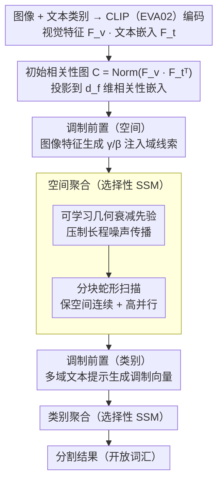

# Open-Vocabulary Domain Generalization in Urban-Scene Segmentation

**会议**: CVPR 2026  
**arXiv**: [2602.18853](https://arxiv.org/abs/2602.18853)  
**代码**: [DZhaoXd/s2_corr](https://github.com/DZhaoXd/s2_corr)  
**领域**: 自动驾驶  
**关键词**: 开放词汇分割, 域泛化, 状态空间模型, 文本-图像相关性, 城市场景分割

## 一句话总结

提出 OVDG-SS 新设定，统一处理语义分割中的未见域和未见类别问题，并设计基于状态空间模型的 S2-Corr 模块来修复域偏移导致的文本-图像相关性退化，在自动驾驶场景中实现高效且鲁棒的跨域开放词汇分割。

## 研究背景与动机

**DG-SS 局限于闭集**：传统域泛化语义分割（DG-SS）方法虽能提升跨域鲁棒性，但只能识别训练集中出现过的固定类别，无法应对开放世界中的新语义（如夜间出现的路障、交通锥）。

**OV-SS 对域偏移敏感**：现有开放词汇分割（OV-SS）模型（如 CAT-Seg、MaskAdapter）在 COCO-Stuff 上训练后可识别广泛概念，但迁移到驾驶场景时性能急剧下降——即使类别重叠，换域后 mIoU 下降显著（Table 1 所示，COCO 训练的 CAT-Seg 在 Dv-19 仅 31.6%，而 Cityscapes 训练后提升到 49.3%）。

**两种能力未被统一**：DG-SS 处理域偏移但不识别新类别，OV-SS 识别新类别但不抗域偏移，自动驾驶需要两者兼备——模型必须同时适应恶劣天气/不同地域等未见域，并识别训练中未出现的物体。

**缺乏评估基准**：此前不存在同时涵盖未见域和未见类别的驾驶场景分割基准，研究者无法系统评估 OVDG-SS 能力。

**域偏移破坏 VLM 相关性**：实验分析发现，域偏移会使预训练 VLM 的文本-图像相关性图变得嘈杂和失对齐（如 Fig. 3 所示，"sky" 类的相关性随域偏移增大而扩散到无关区域），这是 OV-SS 在 OVDG 中失败的根本原因。

**交叉注意力传播噪声**：CAT-Seg 使用交叉注意力进行相关性聚合，在域偏移下损坏的相关性会作为 noisy keys/values 进入注意力计算，误差沿空间和类别维度逐步放大。

## 方法详解

### 整体框架

S2-Corr 构建在 CAT-Seg 的相关性聚合流水线之上。给定图像-文本对，通过 CLIP（EVA02）提取视觉特征 $\mathbf{F}_v \in \mathbb{R}^{HW \times d}$ 和文本类别嵌入 $\mathbf{F}_t \in \mathbb{R}^{N_C \times d}$，计算初始相关性图 $\mathbf{C} = \text{Norm}(\mathbf{F}_v \mathbf{F}_t^\top)$。然后通过可学习投影将相关性提升到 $d_f$ 维嵌入空间，再依次进行**空间聚合**和**类别聚合**两阶段修复。核心创新是将原有的交叉注意力聚合替换为选择性状态空间模型（SSM），并在两阶段聚合的前置调制、SSM 状态传递、扫描方式上引入三项增强设计。

### 关键设计

**1. 调制前置：在聚合之前先注入域线索，让模型知道“现在是夜里/雨天”**

域偏移会让 VLM 的文本-图像相关性图变脏，如果直接拿去聚合就是在放大噪声，所以 S2-Corr 在两阶段聚合之前各加一道调制。空间聚合前，用图像特征 $\mathbf{F}_{\pi(t)}$ 经线性投影生成调制因子 $(\gamma, \beta)$，对相关性嵌入做仿射变换 $\hat{\mathbf{E}} = \mathbf{E} \odot (1 + \gamma) + \beta$，把域相关的视觉线索注进去；类别聚合前，用多域文本提示模板（“a photo of {class} at night”、“in the rain” 等 10 种）编码出域感知文本特征 $\mathbf{t}^{(d)}$，生成调制向量对类别嵌入做域自适应调整。等于在聚合前先告诉模型当前处于哪种域，让后续聚合带着这个先验走。

**2. 可学习几何衰减先验：给 SSM 的状态传递装一个抑制长程噪声的闸**

SSM 的动态门控 $\mathbf{A}_t$ 在域偏移下仍可能把长距离噪声一路传下去，于是引入一个几何衰减先验 $\boldsymbol{\gamma} \in (0,1)^K$，把有效衰减系数写成动态门控和固定先验的可学习混合：$\mathbf{A}_t^{\text{eff}} = \sigma(\mathbf{w}) \cdot \sigma(\mathbf{W}_a \mathbf{x}_t + \mathbf{b}_a) + (1 - \sigma(\mathbf{w})) \cdot \boldsymbol{\gamma}$。它保持几何衰减模式 $\|\partial \mathbf{h}_t / \partial \mathbf{h}_{t-d}\| \propto (\mathbf{A}_t^{\text{eff}})^d$——越远的状态影响指数级衰减，从而压住远处噪声传播，但衰减率本身可学，不至于把有用的长程上下文也一刀切掉。

**3. 分块蛇形扫描：在保住空间连续性的同时拿回并行度**

把 2D 相关性图拉成 1D 序列做 SSM，最怕行边界处出现空间不连续、以及全序列顺序扫描带来的低并行。S2-Corr 把扁平化序列按行切成等长 chunk（chunk 数 16）、每块内顺序更新，块间传递末尾隐状态 $\mathbf{h}_{k+1}^{\text{init}} \leftarrow \mathbf{h}_k^{\text{end}}$ 保持空间连续；行间走蛇形遍历（奇数行正向、偶数行反向），让相邻行在边界处自然衔接、避免跳变。分块既保留了高并行度、大幅降算力，又不牺牲空间连续性，这也是它在大词汇量下 FPS 仍远超 CAT-Seg 的原因。

### 损失函数/训练策略

- 基于 Detectron2 实现，使用 AdamW 优化器，聚合模块学习率 $2 \times 10^{-4}$，EVA-CLIP 编码器学习率 $2 \times 10^{-6}$
- 相关性嵌入维度 128，2 个空间块 + 2 个上采样阶段，chunk 数 16，衰减先验 $\gamma = 0.8$
- 视觉编码器仅更新选定的注意力投影层，文本编码器仅训练残差块内的投影权重
- ViT-B/16 仅更新 26M 参数，ViT-L/14 更新 76.8M 参数
- batch size=4，20k 迭代，单张 RTX 3090 训练 2 小时（ViT-B）/ 4 小时（ViT-L）

## 实验关键数据

### 主实验

**Real-to-Real OVDG-SS（CS-7 训练，表 2）：**

| 方法 | Backbone | Dv-19 Ave. | Dv-58 Ave. |
|------|----------|-----------|-----------|
| CAT-Seg | ViT-B/16 | 43.5 | 43.5 |
| MaskAdapter | ViT-B/16 | 45.5 | 43.8 |
| CLIPSelf | ViT-B/16 | 45.7 | 45.0 |
| **S2-Corr** | **ViT-B/16** | **50.3** | **47.9** |
| CAT-Seg | ViT-L/14 | 49.3 | 50.0 |
| CLIPSelf | ViT-L/14 | 53.3 | 51.5 |
| **S2-Corr** | **ViT-L/14** | **55.8** | **53.2** |

**Synthetic-to-Real OVDG-SS（GTA-7 训练，表 3）：**

| 方法 | Backbone | Dv-19 Ave. | Dv-58 Ave. |
|------|----------|-----------|-----------|
| CAT-Seg | ViT-B/16 | 43.9 | 45.6 |
| CLIPSelf | ViT-B/16 | 46.2 | 44.4 |
| **S2-Corr** | **ViT-B/16** | **48.2** | **46.7** |
| CAT-Seg | ViT-L/14 | 47.5 | 48.2 |
| **S2-Corr** | **ViT-L/14** | **49.9** | **49.4** |

### 消融实验

**组件逐步添加消融（CS-7 → Dv-19 / Dv-58，表 4）：**

| 设计 | ViT-B Dv-19 | ViT-B Dv-58 | ViT-L Dv-19 | ViT-L Dv-58 | 平均 |
|------|------------|------------|------------|------------|------|
| Base (Cross-Attn) | 43.5 | 43.5 | 49.3 | 50.0 | 46.6 |
| +Selective SSM | 45.6 | 44.1 | 50.7 | 50.5 | 47.7 |
| +Modulation | 47.6 | 45.3 | 52.1 | 50.9 | 49.0 |
| +Geometric Decay | 48.3 | 46.4 | 53.2 | 51.8 | 49.9 |
| +Chunk | 49.6 | 47.3 | 55.3 | 52.7 | 51.2 |
| +Snake Scanning | **50.3** | **47.9** | **55.8** | **53.2** | **51.8** |

**效率对比（ViT-B/16，表 5）：**

| 方法 | FPS@19类 | FPS@58类 | FPS@150类 | GPU 显存 | 训练时间 |
|------|---------|---------|----------|---------|---------|
| CAT-Seg | 15.4 | 10.6 | 5.7 | 13.8 GB | 180 min |
| ESC-Net | 15.0 | 9.9 | 5.1 | 15.7 GB | 220 min |
| **S2-Corr** | **26.1** | **22.2** | **18.3** | **9.2 GB** | **140 min** |

### 关键发现

- SSM 替换交叉注意力即可带来 +1.1 mIoU 平均提升，验证顺序聚合优于窗口注意力
- 噪声抑制组件（几何衰减 + 分块机制）带来最大增益，尤其在大词汇量 Dv-58 设定下
- 词汇量从 19 扩大到 150 时，CAT-Seg 的 FPS 从 15.4 降到 5.7（-63%），而 S2-Corr 仅从 26.1 降到 18.3（-30%），体现线性复杂度的可扩展性
- S2-Corr 在所有 7 个未见目标域上均一致超越所有基线，无论合成到真实还是真实到真实设定

## 亮点与洞察

- **新问题定义**：首次将 DG-SS 和 OV-SS 统一为 OVDG-SS，提出了一个更贴近真实自动驾驶需求的研究设定
- **系统性基准**：构建首个 OVDG-SS 驾驶基准，涵盖 7 个目标域（恶劣天气、不同地区、施工场景）和 58 个扩展类别，包含合成到真实和真实到真实两种评估范式
- **根因分析驱动设计**：先分析 OV-SS 在域偏移下失败的根因（相关性图噪声 + 注意力传播放大），再针对性设计解决方案，逻辑链清晰
- **效率优势突出**：S2-Corr 在大词汇量下 FPS 是 CAT-Seg 的 3.2 倍，显存仅需 9.2 GB，训练仅 2 小时，极具实用性
- **SSM 的新应用场景**：将状态空间模型用于文本-图像相关性修复是新颖的切入点，衰减门控天然适合抑制噪声传播

## 局限性

- 训练数据仅使用 7 类 Cityscapes/GTA 子集，基础词汇量较小，更大的训练词汇量是否影响方法有效性未知
- ACDC-41 和 BDD-41 的扩展类由 Stable Diffusion 2.1 合成 inpaint 生成，与真实场景的未见物体分布可能有差距
- 蛇形扫描固定为行方向，未探索列方向或多方向扫描的互补性
- 10 种域感知文本提示为手工设计，未探索可学习 prompt tuning
- 仅在 EVA02-CLIP 上验证，未涉及其他 VLM backbone（如 SigLIP、InternVL）

## 相关工作

- **DG-SS**：数据增强类（AdvStyle、DGInStyle）和 PEFT 类（适配器微调、参数选择）方法，但均限于闭集
- **OV-SS Training-free**：ClearCLIP、ProxyCLIP、CLIP-DINOiser 等无需训练但不抗域偏移
- **OV-SS Training-based**：CAT-Seg（相关性 + 交叉注意力）、MaskAdapter、ESC-Net 等在 COCO 上训练但迁移到驾驶域退化
- **OV-SS + DG 结合**：CAT-Seg+AdvStyle、CAT-Seg+DGInStyle 简单组合两种方法，被 S2-Corr 大幅超越
- **状态空间模型**：Mamba/VMamba 用于视觉任务，本文将 SSM 首次用于文本-图像相关性聚合修复

## 评分

- 新颖性: ⭐⭐⭐⭐ (OVDG-SS 是有意义的新设定，S2-Corr 的设计动机清晰且方法新颖)
- 实验充分度: ⭐⭐⭐⭐⭐ (7 个目标域、两种训练设定、两种 backbone、完整消融、效率分析、可视化)
- 写作质量: ⭐⭐⭐⭐ (问题分析 → 基线建立 → 逐步增强的叙事结构清晰)
- 价值: ⭐⭐⭐⭐ (基准和方法对自动驾驶开放世界感知有实际参考价值)

<!-- RELATED:START -->

## 相关论文

- [\[NeurIPS 2025\] Leveraging Depth and Language for Open-Vocabulary Domain-Generalized Semantic Segmentation](../../NeurIPS2025/autonomous_driving/leveraging_depth_and_language_for_open-vocabulary_domain-generalized_semantic_se.md)
- [\[CVPR 2026\] Monocular Open Vocabulary Occupancy Prediction for Indoor Scenes (LegoOcc)](monocular_open_vocabulary_occupancy_prediction_for_indoor_scenes.md)
- [\[CVPR 2026\] FedBPrompt: Federated Domain Generalization Person Re-Identification via Body Distribution Aware Visual Prompts](fedbprompt_federated_domain_generalization_person_re-identification_via_body_dis.md)
- [\[CVPR 2026\] PanDA: Unsupervised Domain Adaptation for Multimodal 3D Panoptic Segmentation in Autonomous Driving](panda_unsupervised_domain_adaptation_for_multimodal_3d_panoptic_segmentation_in_.md)
- [\[CVPR 2026\] CCF: Complementary Collaborative Fusion for Domain Generalized Multi-Modal 3D Object Detection](ccf_complementary_collaborative_fusion_for_domain_generalized_multi-modal_3d_obj.md)

<!-- RELATED:END -->
