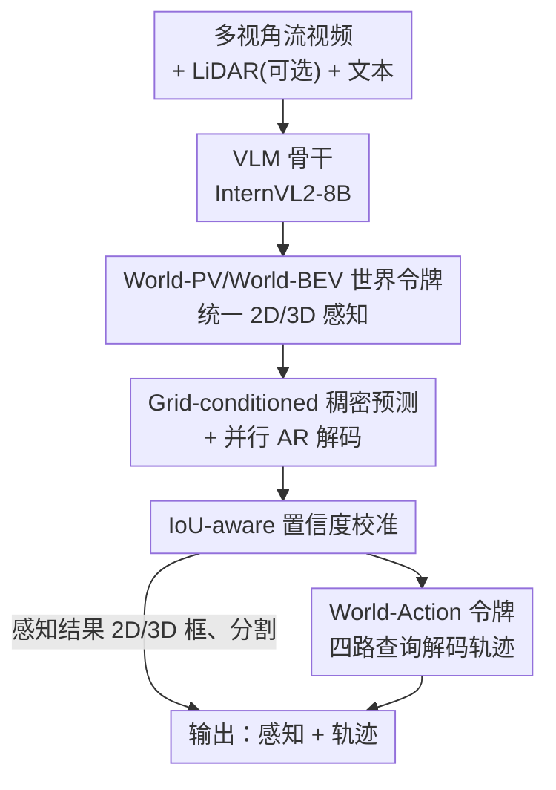

# Percept-WAM: Perception-Enhanced World-Awareness-Action Model for Robust End-to-End Autonomous Driving

**会议**: CVPR 2026  
**论文**: [CVF Open Access](https://openaccess.thecvf.com/content/CVPR2026/html/Han_Percept-WAM_Perception-Enhanced_World-Awareness-Action_Model_for_Robust_End-to-End_Autonomous_Driving_CVPR_2026_paper.html)  
**代码**: 无  
**领域**: 自动驾驶 / 端到端驾驶 / 视觉-语言-动作模型  
**关键词**: 端到端自动驾驶, VLA, BEV 感知, 置信度校准, 轨迹规划  

## 一句话总结
Percept-WAM 把 2D/3D 感知任务统一编码成 World-PV、World-BEV 两类「世界令牌」塞进单个 VLM（InternVL2-8B），再接一组 World-Action 令牌直接吐轨迹，做到「感知-推理-规划」在同一个骨干里端到端跑通，COCO 2D 检测 51.7 mAP、nuScenes BEV 3D 检测 58.9 mAP，NAVSIM 闭环 PDMS 90.2 超过 DiffusionDrive 2.1 分。

## 研究背景与动机
**领域现状**：当前把 VLM/LLM 引入自动驾驶的 VLA（Vision-Language-Action）系统主要走两条路。一条是「QA 式监督」（如 EMMA），把空间理解包装成问答——「前方移动物体距离多少？」，靠语言回答间接定位；另一条是「编码器-扩散解码器」管线（如 Diffusion Planner、DiffusionDrive），直接从特征生成轨迹。

**现有痛点**：QA 式监督只提供**间接**的定位信号，很难产出持久、可复用、可定位的世界状态，在拥挤场景里还会产生重复检测且置信度严重失准；扩散式管线虽然生成能力强，却**抛弃了 LLM 的推理能力**，且因为缺失显式的空间任务学习，端到端性能反而下降。两条路都在「精确几何感知」和「高层语义推理」之间二选一。

**核心矛盾**：通用 VLM 在「广义视觉-语言对齐」上很强，但这**不等于**几何能力——评测反复显示通用 VLM 在 3D 定位漂移、时序一致性、置信度可靠性这些核心空间能力上都不行。而自动驾驶里一个小几何误差（检测偏移、yaw 漂移、BEV/occupancy 错误）会在长尾场景（夜间、雨天、小目标、罕见物体）里雪球式放大成脆弱决策。

**本文目标**：在**单个 VLM** 内嵌入显式、持久的世界状态，并联合优化感知与轨迹，让模型既能推理又能精确定位。

**切入角度**：作者认为问题不在于「VLM 能不能感知」，而在于「怎么把感知结果表征成 VLM 原生能读写、还能给下游复用的东西」。于是把所有 2D/3D 感知任务**隐式**地表征成两套带度量坐标和校准置信度的令牌，让骨干能在这些「空间锚定的证据」上做推理，再把令牌喂给规划。

**核心 idea**：用「World-PV + World-BEV + World-Action」三类令牌，把感知、3D 场景理解、轨迹生成统一进一个 VLM 骨干，并用 grid-conditioned 解码 + IoU 置信度校准把稠密感知做稳。

## 方法详解

### 整体框架
Percept-WAM 以预训练 VLM（InternVL2-8B）为骨干保留通用推理能力，输入多视角流视频、可选 LiDAR 点云和文本查询，依次产出三类令牌再落到感知结果和轨迹：图像经骨干编码成 **World-PV 令牌**（透视图/像平面），承担 2D 检测、实例/语义分割、单目 3D 检测；一组可学习的 **World-BEV 令牌**通过 cross-attention 把 PV 证据「抬升」到鸟瞰图空间，承担 BEV 3D 检测和地图分割；最后 **World-Action 令牌**用四路 point-level 查询对齐多模态信息，经轻量 MLP 解码出未来轨迹。整条链路里稠密感知靠 grid-conditioned 并行 AR 解码维持吞吐，置信度靠 IoU-aware 令牌校准，部署时再叠一套流式 KV cache。最终单骨干既能同时输出感知（2D/3D 框）+ 轨迹，也能只输出轨迹。

### 关键设计

**1. World-PV / World-BEV 世界令牌：把 2D/3D 感知统一进单个 VLM**

针对「QA 式监督只能间接定位、产不出持久世界状态」的痛点，作者不再让模型用自然语言回答空间问题，而是把感知结果直接表征成两套令牌。**World-PV 令牌**是骨干对图像编码后的特征，按 $H\times W$ patch 化成网格，每个网格位置编码一处局部图像坐标；**World-BEV 令牌**是一组以自车为中心、铺成 $H\times W$ 鸟瞰网格的可学习查询令牌，每个网格输出高维 embedding 编码该处的物体/地图元素。两套令牌的共同点是都**显式编码度量坐标 + 校准置信度**，因此是可定位、可复用的「世界状态」，下游推理和规划都能直接拿来用。

关键的「抬升」机制在 BEV 侧：World-BEV 令牌通过 cross-attention 去查询 World-PV 令牌的特征，纯数据驱动地把 2D 证据提升成 3D BEV 表示，不依赖显式的深度估计或几何投影。当有 LiDAR 时，先用 PointPillars 提点云特征、经 PixelUnshuffle 下采样 + MLP，再拿来**初始化** World-BEV 令牌的词嵌入，把度量上锚定的 3D 先验注入 BEV 表征；纯相机时这些嵌入就随机初始化再训出来。这让同一套 BEV 令牌既支持纯相机也支持多模态融合。

**2. Grid-conditioned 稠密预测 + 并行 AR 解码：把多目标稠密推理结构化**

VLM 做检测最大的工程难题是「一张图几十个目标怎么稳定、高效地一次吐出来」。作者把每个网格令牌当成一个**局部单目标查询**：World-PV 令牌按坐标插值出 grid token，每个 grid token 只负责预测与自己坐标对齐的那一个框/掩码。检测输出被序列化成类语言 token 序列，2D 框写成 `cls,<box>x,y,w,h</box>,<conf>s</conf>`，3D 框的 `<box>` 字段扩成 $x,y,z,w,h,\ell,\theta,v_x,v_y$（中心、尺寸、yaw、速度）；连续值归一化后离散化进整数 bin（$[0,1024)$），用交叉熵监督（沿用 Pix2Seq 路线）。分割则复用 UFO 思路当作特征检索——预测 $K=16$ 个 `<MASK>` 令牌，靠 World-PV 令牌与掩码令牌的点积相似度一次前向取出所有类别掩码，不加新参数。

效率的关键是**并行**：不同 grid token 之间通过控制 attention mask 互不干扰，各自独立地以并行 AR 方式解码，而不是一个接一个串行生成，吞吐大幅提升却不掉精度。又因为类别是以文本给出的，检测器天然支持开放词表，对长尾路面物体更鲁棒。

**3. IoU-aware 置信度校准：用模型自己的预测分布造数据，治住过自信**

MLLM 做感知有个老毛病——训练/推理不匹配导致重复框，而像 UFO 那样直接拿类别 logits 的 softmax 当框置信度又会**系统性过自信**：哪怕是模糊检测，softmax 也会饱和到很高，于是拥挤场景里冒出一堆高分假阳性。作者为每个预测框额外加一个**IoU 置信度令牌**，让置信度对齐到框的定位质量而非类别概率。

最巧的是数据怎么造。作者不用「对 GT 框随机扰动」来生成置信度训练样本（那样得到的 IoU 分布近似均匀，不真实），而是拿**训练中途的模型**去推理训练图，把与 GT 匹配上的预测框配上它们真实的 IoU（离散成 20 bin）当训练样本——这个「模型预测分布」更贴近真实推理时的置信度形态，能压住假检测。训练时混用 GT 数据（IoU 固定为 1，只学类别和框、不监督 IoU 以免坍塌）和置信度数据（只在置信度 token 上算 loss），靠 loss mask 区分。推理时最终分数取**类别置信度 × 预测 IoU 分数**，给出更统一、可解释、对定位敏感的可靠度度量。消融显示这套「真实模型预测分布」方案带来 +1.5 AP / +2.3 AP75，而「随机扰动」和「均匀模型预测」两个变体反而低于 baseline。

**4. World-Action 令牌与四路查询：感知证据对齐到轨迹**

有了 World-PV（丰富语义）和 World-BEV（精确动静态上下文）之后，作者引入 World-Action 令牌走 query-based 轨迹解码（模仿学习训练）。难点是「轨迹该信哪个模态」——只信图像会丢 3D 几何，只信 BEV 会丢语义。作者用四组 point-level 查询解耦这件事：$Q_{pv}$、$Q_{bev}$、$Q_{ego}$ 通过 attention mask **只**和各自对应的模态特征（World-PV / World-BEV / 自车状态）交互，而 $Q_{full}$ 能访问全部特征。四组查询 $Q\in\mathbb{R}^{N\times C}$（$N$ 为轨迹点数）随机初始化，由 Percept-WAM 编码后各自经 MLP 解码出轨迹，训练时**并行**解码四组、用 Smooth-L1 监督，推理时只取 $Q_{full}$ 解出的轨迹做最终输出。这样既保证动作充分对齐各模态、又避免过度依赖单一模态。

部署侧再叠一层**流式推理**：用流式 KV cache，配合「长片段训练 + 双重重算 KV cache」缓解训练/推理范式不匹配带来的分布漂移，把帧延迟压到 707 ms。

### 损失函数 / 训练策略
- **PV 感知**：检测用离散化标签的 token 级交叉熵（Pix2Seq 式）；实例/语义分割用交叉熵 + sigmoid focal loss + Dice loss 组合。
- **BEV 感知**：BEV 检测用交叉熵；BEV 地图分割同样 CE + focal + Dice，且因地图类别会重叠（人行横道是可行驶区域子集），把地图分割拆成**每类独立二值分割**。
- **轨迹**：四组查询并行解码，Smooth-L1 监督。
- **优化**：从 InternVL2-8B 起训，AdamW（base LR 2e-4，weight decay 0.01），cosine 衰减 + 1000 步线性 warmup，混合精度 + 梯度检查点省显存。World-PV 用 $10\times10$ 网格；World-BEV 检测用 $40\times40$、分割用 $10\times10$。采用**两阶段课程**：先巩固 PV/BEV 的空间锚定，再通过端到端 VLA 微调对齐规划器。

## 实验关键数据

### 主实验
PV 感知上 Percept-WAM 匹配或超过专用检测/分割模型；BEV 与规划上也具竞争力。

| 任务 / 数据集 | 指标 | 本文 | 对比基线 |
|--------------|------|------|----------|
| 2D 检测 nuImages | mAP | 49.9 | Mask R-CNN 47.8 |
| 2D 检测 COCO | mAP | 51.7 | LMM-Det 47.5 |
| 单目 3D 检测 nuScenes | mAP / NDS | 33.0 / 38.6 | FCOS3D 32.1 / 39.5 |
| 2D 实例分割 nuImages | mAP | 41.7 | Mask R-CNN 38.6 |
| BEV 3D 检测 nuScenes | mAP / NDS | 0.589 / 0.645 | PointPillars 0.523 / 0.613 |
| BEV 地图分割（行人横道 IoU）| IoU | 70.9 | BEVFusion 60.5 |

规划（nuScenes 开环 L2 + NAVSIM 闭环 PDMS）：

| 方法 | nuScenes L2 Avg.↓ | NAVSIM PDMS↑ |
|------|-------------------|--------------|
| UniAD | 0.46 | 83.4 |
| DiffusionDrive | 0.57 | 88.1 |
| Percept-WAM | 0.38 | 88.6 |
| Percept-WAM*（两阶段）| 0.36 | 90.2 |

两阶段训练的 Percept-WAM* 在 NAVSIM 上 PDMS 90.2，超过 DiffusionDrive 2.1，印证「感知更强 → 下游端到端规划更好」。

### 消融实验

IoU 置信度数据构造方式（nuImages 2D 检测）：

| 配置 | AP | AP50 | AP75 | 说明 |
|------|----|----|----|------|
| Baseline（类别分数）| 48.1 | 70.9 | 51.4 | 仅 softmax 类别置信度 |
| + IoU Conf.（随机扰动）| 46.9 | 70.0 | 50.7 | 反而掉点 |
| + IoU Conf.（均匀模型预测）| 46.2 | 69.1 | 49.3 | 反而掉点 |
| + IoU Conf.（真实模型预测）| **49.6** | 70.4 | **53.7** | +1.5 AP / +2.3 AP75 |

BEV 3D 检测逐组件（nuScenes val）：

| 配置 | mAP | NDS | 说明 |
|------|-----|-----|------|
| Baseline（纯相机）| 25.0 | 25.7 | — |
| + LiDAR 编码器初始化 | 33.2 | 32.2 | +8.2% |
| + 数据增强 | 41.3 | 39.2 | +8.1% |
| + 增大采样网格（20→40）| 50.4 | 46.6 | +9.1% |
| + MLP 并行（16× 提速）| 50.4 | 43.7 | 保精度提速 |

解码机制与流式推理（nuScenes val 轨迹）：

| 解码方式 | L2 Avg.↓ | 延迟(ms)↓ |
|----------|----------|-----------|
| AR | 0.3970 | 2700 |
| Query-base | 0.3822 | 1174 |
| Query-base + 流式 | 0.3839 | **707** |

### 关键发现
- **置信度数据构造方式比加不加 IoU 令牌更关键**：随机扰动和均匀采样两个变体反而低于 baseline，只有「用模型真实预测分布」才有效，说明校准的核心是让训练分布贴近推理分布。
- **2D 与 3D PV 检测有协同**：统一建模后 2D 检测涨了 3.2 mAP，联合训练全部 PV 任务在各 benchmark 一致受益。
- **BEV 提升主要来自 LiDAR 先验 + 网格分辨率**：从纯相机 25.0 mAP 一路加到 50.4 mAP，三个因素各贡献约 8-9%；MLP 并行在保精度前提下提速 16×。
- **Query-based 解码 + 流式推理**把延迟从 2700 ms 压到 707 ms（约 3.8×），L2 几乎不变。
- 作者明确表示 BEV 感知不追求逐子任务 SOTA，目的是**强化骨干的 3D 空间理解**以服务规划。

## 亮点与洞察
- **「把感知表征成令牌而非问答」是范式层面的转变**：World-PV/BEV/Action 三类令牌让感知结果成为骨干原生可读写、可跨任务复用的中间表征，绕开了 QA 式监督「只能间接定位」的根本缺陷。
- **IoU 置信度数据构造的洞察很可迁移**：用「模型中途自己的预测分布」而非「GT 随机扰动」造校准数据，本质是对齐训练与推理的分布——这个思路可以搬到任何存在训练/推理 mismatch 的序列化检测/MLLM 感知任务。
- **四路查询解耦模态依赖**：用 attention mask 让 $Q_{pv}/Q_{bev}/Q_{ego}$ 各管一摊、$Q_{full}$ 总成，是一种轻巧的「强制多模态对齐、防止偷懒只看单模态」的手段。
- **并行 AR + grid-conditioned** 让 VLM 做稠密检测变得工程可行：用 attention mask 隔离 grid token、把串行生成改成并行，是 VLM 落地实时感知的关键 trick。

## 局限与展望
- **依赖 8B 量级 VLM 骨干**，即便流式推理压到 707 ms，对真正的车载实时（多帧、多任务并发）部署仍偏重，论文也只报告了单帧级别的延迟。
- **BEV 子任务并未全面 SOTA**（BEV 3D 检测 mAP 0.589 仍落后 BEVFusion 0.685），作者坦言 BEV 任务主要是为强化 3D 理解而非刷分，但这意味着纯感知场景下未必是最优选择。
- **闭环评测仅在 NAVSIM 的数据驱动伪仿真上**，缺少 Bench2Drive/CARLA 这类真闭环交互的安全性验证；nuScenes 开环 L2 也已被指出与真实规划质量相关性有限。
- 很多关键细节（流式 KV cache 的双重重算、attention mask 具体设计）放在 Appendix，正文不足以完全复现。
- **改进方向**：蒸馏到更小骨干以满足车规算力；把世界令牌接入真闭环规划做端到端 RL 微调；探索 World-Action 令牌对更长时域、多智能体交互轨迹的建模。

## 相关工作与启发
- **vs EMMA / DriveVLM（QA 式 VLA）**: 他们把空间理解当问答、靠语言间接定位，本文直接把感知编码成带坐标和置信度的世界令牌，区别在于产出的是持久可复用的世界状态而非一次性文本回答，定位更精确、置信度更可校准。
- **vs DiffusionDrive / Diffusion Planner（扩散解码）**: 他们抛弃 LLM 直接生成轨迹，本文在单个 VLM 内保留推理能力同时显式学空间任务，NAVSIM PDMS 90.2 vs 88.1 体现了「不丢推理 + 显式感知」的收益。
- **vs UniAD（规划导向全栈学习）**: 概念上对齐——都联合优化感知与规划减少误差累积，但本文把这套思路**实例化进 VLM 骨干**，从而额外获得开放词表和通用推理能力。
- **vs UFO（VLM 统一感知）**: 借鉴了 grid token 插值和 16 个 mask token 的分割表征，但 UFO 用类别 logits 的 softmax 当置信度会过自信，本文用独立 IoU 令牌 + 模型预测分布数据做校准，针对性解决了重复框/假阳性问题。

## 评分
- 新颖性: ⭐⭐⭐⭐⭐ 首个把 2D/3D 感知隐式统一进单 VLM 并端到端接轨迹的 World-Awareness-Action 框架，令牌化感知表征是范式级创新。
- 实验充分度: ⭐⭐⭐⭐ 覆盖 PV/BEV 感知 + nuScenes/NAVSIM 规划 + 多组消融，但缺真闭环（CARLA/Bench2Drive）验证。
- 写作质量: ⭐⭐⭐⭐ 动机清晰、图示到位，关键工程细节（流式 cache、attention mask）下放 Appendix 略影响复现。
- 价值: ⭐⭐⭐⭐⭐ 给「VLM 做精确几何感知」提供了可落地的令牌化方案，IoU 置信度数据构造和四路查询解耦都很可迁移。

<!-- RELATED:START -->

## 相关论文

- [\[CVPR 2026\] E3AD: An Emotion-Aware Vision-Language-Action Model for Human-Centric End-to-End Autonomous Driving](e3ad_an_emotion-aware_vision-language-action_model_for_human-centric_end-to-end_.md)
- [\[CVPR 2026\] DriveMoE: Mixture-of-Experts for Vision-Language-Action Model in End-to-End Autonomous Driving](drivemoe_mixture-of-experts_for_vision-language-action_model_in_end-to-end_auton.md)
- [\[CVPR 2026\] EE-RL: Vision Language Guided Reinforcement Learning with Explorer and Expert model for End-to-End Autonomous Driving](ee-rl_vision_language_guided_reinforcement_learning_with_explorer_and_expert_mod.md)
- [\[ICLR 2026\] ResWorld: Temporal Residual World Model for End-to-End Autonomous Driving](../../ICLR2026/autonomous_driving/resworld_temporal_residual_world_model_for_end-to-end_autonomous_driving.md)
- [\[CVPR 2026\] ActiveAD: Planning-Oriented Active Learning for End-to-End Autonomous Driving](activead_planning-oriented_active_learning_for_end-to-end_autonomous_driving.md)

<!-- RELATED:END -->
