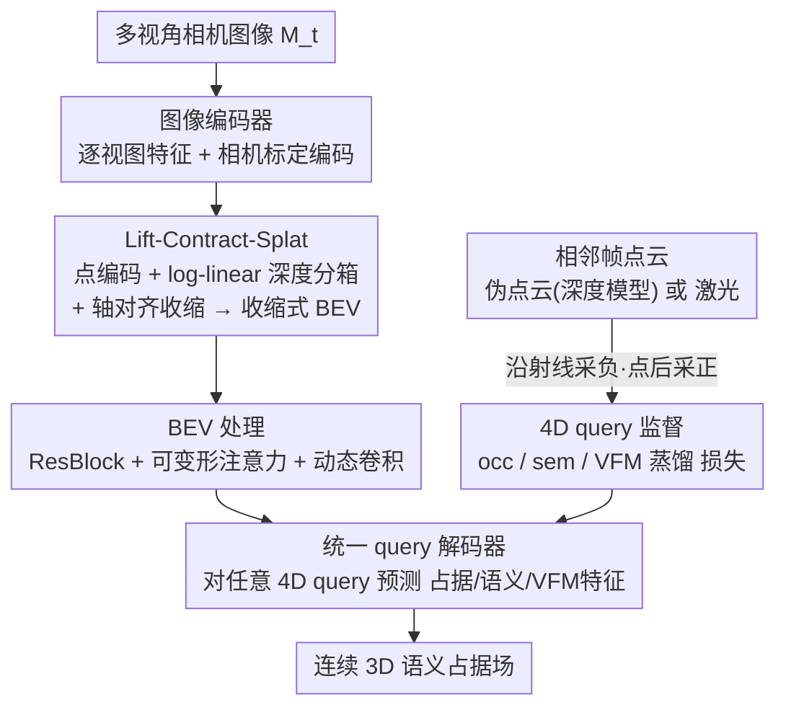

# QueryOcc: Query-based Self-Supervision for 3D Semantic Occupancy

**会议**: CVPR 2026  
**论文**: [CVF Open Access](https://openaccess.thecvf.com/content/CVPR2026/html/Lilja_QueryOcc_Query-based_Self-Supervision_for_3D_Semantic_Occupancy_CVPR_2026_paper.html)  
**代码**: 无（仅 Project page）  
**领域**: 自动驾驶 / 3D 语义占据 / 自监督  
**关键词**: 3D 语义占据、自监督、4D query 监督、收缩式 BEV、自动驾驶感知

## 一句话总结
QueryOcc 用从相邻帧采样的独立 4D 时空 query 直接在连续 3D 空间监督几何与语义，配上一个可处理无界场景的收缩式 BEV 表示，在自监督 Occ3D-nuScenes 上把语义 RayIoU 提了 26%，同时保持 11.6 FPS 实时推理。

## 研究背景与动机

**领域现状**：3D 语义占据（semantic occupancy）是现代自动驾驶感知的核心表示——它同时刻画几何、语义和可行驶自由空间。但给 3D 场景做体素级标注极其昂贵（nuScenes 850 个序列的占据标注花了约 4000 小时人工），于是直接从传感器数据学、不依赖人工标注的自监督方法成为主流追求。

**现有痛点**：现有自监督占据方法分两类，各有硬伤。**渲染派**（SelfOcc / OccNeRF / GaussianFlowOcc 等纯相机方法）把隐式体积当辐射场，靠 2D 图像重建的光度/语义一致性来监督——几何信号只是图像合成的副产品，是**间接**的，3D 结构"顺带"涌现而非显式学习目标，而且往往还得依赖外部估计的深度图才能稳定训练。**激光派**（MinkOcc / POP3D）虽然在 3D 里给直接监督，却要把累积的激光点云**离散成预定义范围和分辨率的体素栅格**，限制了空间精度与可扩展性。

**核心矛盾**：监督信号的"直接性"和场景表示的"无界 + 高精度"很难兼得。渲染派直接性差；激光派被体素化和固定栅格范围卡死，BEV 栅格大小（即显存和算力）会随场景距离平方增长。

**本文目标**：(1) 给出在连续 4D 时空里**直接**监督几何与语义的信号，而非走渲染或体素化；(2) 设计一个能覆盖无界真实世界、显存恒定却保留近场细节的场景表示。

**切入角度**：作者假设——**在连续 4D 时空里直接监督，比渲染或体素化激光提供更清晰的几何反馈**。点云（不管来自真激光还是相机深度模型）本质就是空间中一组带标签的观测点，那就别把它们塞进体素，而是把它们当成可在任意 4D 点采样的监督源。

**核心 idea**：用从相邻帧采样的**独立 4D query**（`q = [x, y, z, t]`）直接监督一个连续占据场——沿传感器射线采"未占据"负样本、在点后方缓冲区采"占据"正样本；再用一个**轴对齐收缩式 BEV** 在恒定显存下把无界场景压进固定栅格。

## 方法详解

### 整体框架
QueryOcc 要解决的是"怎么不靠标注、也不靠渲染或体素化，就把多视角相机图像学成一个连续的 3D 语义占据场"。整体走一条清晰的四阶段前向管线：多视角图像先逐视图编码，再通过 **Lift-Contract-Splat** 模块 lift 成收缩式 BEV 特征，经 BEV 编码器处理后，由一个**统一 query 解码器**对任意 4D 点 `q` 预测占据 `ô` 和语义 `ŝ`。形式上 $\langle\hat{o},\hat{s}\rangle = F_\omega(M_t, q) = D_\varrho(H_\varpi(G_\vartheta(E_\varepsilon(M_t))), q)$。

监督端是另一条线：从相邻帧的真实激光点云或相机深度模型生成的伪点云出发，沿射线和点后缓冲区采样出带占据/语义/VFM 特征标签的正负 4D query，喂给同一个解码器算损失。整套训练端到端，推理时把连续场在 Occ3D 体素中心处采样即可得到体素化结果。

### 关键设计

**1. 4D 时空 query 自监督：把连续点云当直接监督源，绕开渲染与体素化**

这是全文的核心创新，直击渲染派"几何只是副产品"和激光派"必须体素化"两个痛点。给定一帧点云（来自相机深度模型的伪点云 $P_{pseudo}$、激光 $P_{lidar}$ 或二者并集 $P_{uni}$），作者不去聚合、不去栅格化，而是把每个点 $p_i$ 连同传感器原点 $o_i$ 当成一条几何证据射线，从中采样监督 query。**负样本（未占据）** 沿原点到点之间的射线段采：$D^- = \{\langle o_i + r(p_i - o_i),\, 0\rangle \mid r \in (0,1)\}$，因为这段射线被穿过、必然是空的。**正样本（占据）** 在点后方一段长度 $\zeta$ 的缓冲区内采：$D^+ = \{\langle p_i + r\frac{p_i-o_i}{\|p_i-o_i\|},\, a_i\rangle \mid r \in (0,\zeta)\}$，带上该点的占据/语义/特征标签 $a_i$。

这样每个 query 都是一个独立、连续的 4D 监督点，跨相邻帧 $t \in \{T_{min},\dots,T_{max}\}$ 采样，正负均衡。它的妙处在于：监督直接发生在 3D 空间，几何和语义是**显式学习目标**而非渲染的产物，也不需要把点云离散成固定分辨率的体素——天然支持任意稀疏度、任意距离、任意传感器配置。消融里把这套换成在图像空间做 alpha-blending 的渲染监督，mRayIoU 从 23.6 暴跌到 15.0，直接验证了"直接 3D 监督 > 间接 2D 监督"。

**2. Lift-Contract-Splat：把图像特征抬进一个无界但显存恒定的收缩 BEV**

光有直接监督还不够——要监督远距离场景，BEV 栅格会随范围平方膨胀，显存撑不住。作者在 LSS（Lift-Splat-Shoot）基础上加了三处改造，合成一个能覆盖无界场景的 lift 模块。**(a) 点编码**：不直接 splat 原始特征 $f_d = p_d \cdot \omega$，而是显式编码可见性、不确定性和时间线索 $f_d = P_\varsigma(p_d\cdot\omega + (1-p_d)e,\, p_v,\, p_d,\, t_c)$，其中 $e$ 是可学习的空区嵌入、$p_v$ 是累积深度概率（即预测可见性）——这让模型能显式表达"被占据"和"未观测"两种状态，改善 lift 空间里的几何推理。**(b) log-linear 深度分箱**：用指数增长的深度间距替换均匀分箱，$d(r) = (1-\varsigma)d_{near}(d_{far}/d_{near})^r + \varsigma[d_{near}+r(d_{far}-d_{near})]$，在不增加分箱数的前提下，把高分辨率留给近场、又能覆盖远处。**(c) 轴对齐收缩**：借鉴 NeRF 场景参数化，定义一个连续收缩函数把坐标映射到 $[-1,1]$——

$$f_{contr.}(\bar{\phi}) = \begin{cases} \kappa \cdot \bar{\phi}, & |\bar{\phi}| \le 1 \\ \mathrm{sign}(\bar{\phi})\left(1 - \frac{1-\kappa}{|\bar{\phi}|}\right), & |\bar{\phi}| > 1 \end{cases}$$

近场（$|\bar\phi|\le1$）线性保真、远场平滑压缩。与球面收缩不同，**轴对齐**变体保持矩形几何，正好契合 BEV 栅格。三者合力让模型在固定栅格里编码无界场景：近场细节不丢，远场（点稀疏、深度本就不准）被压缩反而提效，显存和算力恒定。消融里逐项加这四个组件（log-linear / 长程监督 / 收缩 / 点编码），RayIoU 从 21.7 单调升到 23.6。

**3. 统一 query 解码器：占据、语义、VFM 特征蒸馏共享一套参数**

收缩后的 BEV 特征图 $Z$ 是一个空间锚定的场，可在任意 4D 点查询。解码器先把 query 用 Eq.(3) 同样收缩到 BEV 空间对齐，经小 MLP 编码后与对应位置的插值 BEV 特征融合；再预测偏移 $\Delta q_{x,y}$ 去邻近位置额外采特征（模仿可变形注意力的动态空间推理），经浅层残差迭代细化后输出 $\hat{a} = D_\varrho(q, Z)$。标准配置预测 $\hat{a}=\langle\hat o,\hat s\rangle$，可扩展加上 VFM 特征向量蒸馏 $\hat v$ 变成 $\langle\hat o,\hat s,\hat v\rangle$。一套共享参数的轻量解码器统一了几何、语义、高层视觉监督，既省算力又促成跨任务一致性——这也是它能在恢复连续 3D 表达力的同时保住 BEV 计算效率的关键。

### 损失函数 / 训练策略
每个 query 按可用监督贡献一项或多项损失：

$$L = \lambda_{occ}L_{occ}(\hat o(q), o) + \lambda_{sem}L_{sem}(\hat s(q), s) + \lambda_{vfm}L_{vfm}(\hat v(q), v)$$

其中 $L_{occ}$ 为二元交叉熵、$L_{sem}$ 为类别交叉熵、$L_{vfm}$ 为 L1。主模型 **QueryOcc** 用 Metric3D 提供深度监督、Grounded-SAM 提供语义伪标签，输入 224×704，ConvNeXt-Base 主干，每样本采 30k 点生成 80 万 query，4×A100 训练约 13 小时（约 30GB 显存）。增强版 **QueryOcc+** 额外加激光监督、DinoV3 ViT-base 特征（PCA 降到 16 维）蒸馏、900×1600 高分辨率。

## 实验关键数据

### 主实验
在自监督 Occ3D-nuScenes 上，QueryOcc 全面刷新 SOTA（节选 RayIoU / IoU 的语义、动态、占据三项）：

| 方法 | Sem.RayIoU | Dyn.RayIoU | Occ.RayIoU | Sem.IoU | Occ.IoU |
|------|-----------|-----------|-----------|---------|---------|
| GaussTR -T2D | 14.2 | 17.7 | 33.8 | 13.9 | 44.5 |
| GaussianFlowOcc（最强基线） | 18.7 | – | – | 17.1 | 46.9 |
| **QueryOcc** | **23.6** | **21.7** | **45.2** | **21.3** | **55.0** |
| **QueryOcc+** | **25.8** | **23.8** | **47.4** | **23.5** | **56.9** |

相对最强基线 GaussianFlowOcc，语义 RayIoU +26%、占据 RayIoU +25%，同时实时 11.6 FPS（总延迟 86ms，对比 GaussianFlowOcc 10.2 FPS、GaussTR 仅 0.2 FPS）。逐类 IoU 显示它在细小目标（交通锥、行人）和大面积类（可行驶面、人行道、地形）都领先，只在极稀有类（自行车，占数据 0.03%）吃力。

### 消融实验

| 监督方式 | Sem.RayIoU | Dyn.RayIoU | Occ.RayIoU | 说明 |
|---------|-----------|-----------|-----------|------|
| 仅渲染监督 | 15.0 | 9.8 | 41.7 | 同源信号但在图像空间算损失 |
| Query 监督 | 23.6 | 21.7 | 45.2 | 直接 3D 监督 |
| Query + VFM 特征 | 24.0 | 22.0 | 45.7 | 加特征蒸馏再涨 |
| Query + 渲染 | 23.3 | 21.3 | 45.6 | 叠加渲染无增益 |

组件消融（固定显存/算力）：log-linear 分箱、长程监督、空间收缩、点编码逐项叠加，Sem.RayIoU 从 21.7 → 21.7 → 22.9 → 23.1，去掉收缩则掉到 22.5，全开 23.6——四个组件各自都有正贡献。

### 关键发现
- **直接 3D 监督是性能主引擎**：把 query 监督换成渲染监督，mRayIoU 从 23.6 崩到 15.0；而 query 上叠加渲染损失毫无增益（23.3），说明一旦有了强 3D 监督，2D 渲染损失就是冗余。
- **监督源互补**：伪点云（密度高、与相机时间完美对齐）语义更好，激光（深度精确）几何更好，二者并集（QueryOcc+ 的 Unified）全面最优（Sem. 24.6 / Occ. 48.7）。
- **数据高效 + 可扩展**：每帧点云从 1.4M 子采样到 <100k，性能几乎不变但训练时间大降；输入分辨率从 256×256 到 900×1600 稳定 +3 mRayIoU；加入 Argoverse 2 数据后语义 RayIoU 从 22.9 → 26.0，无需任何域适配或标签对齐。

## 亮点与洞察
- **把"点云=带标签的空间证据"这件事用到极致**：沿射线采负、点后采正这一套，把"哪里被穿过=空、哪里有点=占"的物理直觉直接变成连续监督，比渲染一致性清晰、比体素化无损——是个可迁移到任何点云驱动占据/重建任务的采样范式。
- **轴对齐收缩**比常见的球面收缩更契合 BEV：保持矩形几何的同时压远场，让"无界场景 + 恒定显存"真正落地，远场本就稀疏不准、压缩几乎无损反而提效，这个 trade-off 拿捏得很聪明。
- **一个解码器统三任务**：占据、语义、VFM 特征蒸馏共享参数，既是效率设计也促成跨任务一致性，VFM 蒸馏还提供了与输入分辨率无关的互补线索。
- 最"啊哈"的点：连续 query 表示让框架对传感器配置、数据集来源几乎无感——换激光/相机、加新数据集都不用改架构或损失，这是体素化方法做不到的。

## 局限与展望
- **作者承认**：所有此类方法都受限于"只能监督传感器观测到的部分"，对遮挡区域无能为力；未来可加在不可观测区给信号的表示学习目标（一致性 / 特征重建），或做多智能体协同监督（不同车/不同时刻的重叠视角"看穿拐角"）。
- **自己发现**：极稀有类（自行车 0.03%）表现差，说明自监督伪标签对长尾类别天然弱；评测全在 Occ3D-nuScenes 体素中心采样，连续场的真实"连续性"优势没被独立量化；伪点云质量强依赖外部深度模型（Metric3D）和分割模型（Grounded-SAM），这两个上游误差会直接传导。
- **改进思路**：把遮挡补全做成显式的自监督目标（如时序一致性约束）；对长尾类引入主动采样或重加权；探索把连续场用于下游规划而非仅回退到体素评测。

## 相关工作与启发
- **vs GaussianFlowOcc / SelfOcc（渲染派）**：它们靠 2D 渲染一致性间接学几何，3D 结构是副产品且常需外部深度；本文直接在 3D 采 query 监督，几何/语义是显式目标，消融证明同源信号下直接监督 23.6 远超渲染 15.0。
- **vs MinkOcc / POP3D（激光体素派）**：它们把激光累积成固定范围/分辨率的体素栅格再学，受限于精度和范围；本文从连续点云直接采样、不聚合不体素化，且通过收缩 BEV 支持无界长程。
- **vs GASP / UnO / ALSO（query-based 激光感知）**：这些把 query 范式用于激光预训练；本文首次把 query 自监督带到**纯相机**语义占据，解决了图像派生几何噪声、语义监督、长程高效推理三个新挑战。

## 评分
- 新颖性: ⭐⭐⭐⭐⭐ 把 4D query 直接监督引入相机语义占据，加无界收缩 BEV，角度新且自洽
- 实验充分度: ⭐⭐⭐⭐⭐ 主表 + 监督方式/组件/源/采样/分辨率/数据多维消融，证据链完整
- 写作质量: ⭐⭐⭐⭐ 方法叙述清晰、图示到位，公式略密但可读
- 价值: ⭐⭐⭐⭐⭐ SOTA +26% 还实时 11.6 FPS，且跨传感器/数据集免改架构，落地价值高

<!-- RELATED:START -->

## 相关论文

- [\[CVPR 2026\] ShelfOcc: Native 3D Supervision beyond LiDAR for Vision-Based Occupancy Estimation](shelfocc_native_3d_supervision_beyond_lidar_for_vision-based_occupancy_estimatio.md)
- [\[CVPR 2026\] OneOcc: Semantic Occupancy Prediction for Legged Robots with a Single Panoramic Camera](oneocc_semantic_occupancy_prediction_for_legged_robots_with_a_single_panoramic_c.md)
- [\[CVPR 2026\] OccAny: Generalized Unconstrained Urban 3D Occupancy](occany_generalized_unconstrained_urban_3d_occupancy.md)
- [\[ECCV 2024\] Equivariant Spatio-Temporal Self-Supervision for LiDAR Object Detection](../../ECCV2024/autonomous_driving/equivariant_spatio-temporal_self-supervision_for_lidar_object_detection.md)
- [\[CVPR 2026\] ProOOD: Prototype-Guided Out-of-Distribution 3D Occupancy Prediction](proood_prototype-guided_out-of-distribution_3d_occupancy_prediction.md)

<!-- RELATED:END -->
