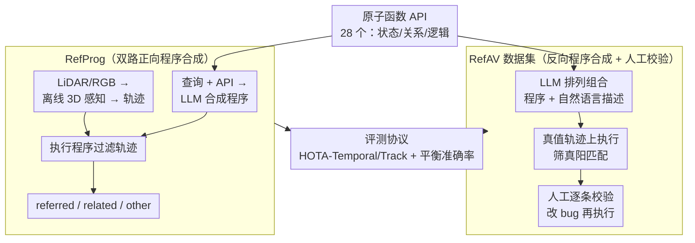

# RefAV: Towards Planning-Centric Scenario Mining

**会议**: CVPR 2026  
**论文**: [CVF Open Access](https://openaccess.thecvf.com/content/CVPR2026/html/Davidson_RefAV_Towards_Planning-Centric_Scenario_Mining_CVPR_2026_paper.html)  
**代码**: 有（论文称已在 GitHub 与 Argoverse 开源，原文未给具体 URL）  
**领域**: 自动驾驶 / 场景挖掘 / 指代追踪  
**关键词**: 场景挖掘、指代多目标追踪、程序合成、Argoverse 2、VLM

## 一句话总结
本文把"从海量自动驾驶日志里捞出安全攸关场景"这件事重新表述为**时空场景挖掘**任务：给定一句自然语言描述，判断它是否出现在某段 20 秒驾驶日志里、并在 3D 时空中精确定位被指代的目标；为此作者构建了 RefAV 数据集（基于 Argoverse 2 的 10,000 条多智能体交互查询），并提出 RefProg——用 LLM 把复杂查询合成为可执行程序、再去过滤现成 3D 轨迹的双路方法，在零样本设置下大幅超过直接套用 VLM 的各种基线。

## 研究背景与动机
**领域现状**：自动驾驶车队在日常路测中会采集 TB 级多模态数据（RGB、LiDAR、HD 地图），并伪标注出 3D 轨迹。要给端到端自动驾驶建立"安全论证（safety case）"，就必须从真实路测数据里找出那些有意思、又安全攸关的场景（如别人抢左转穿过本车路径）。和这件事相关的研究分散在三条线：指代多目标追踪（RMOT）、多模态视觉问答（VQA）、以及基于 VLM 的运动规划。

**现有痛点**：传统场景挖掘靠人手写结构化查询，既容易出错又极其耗时——在海量未筛选日志里找一个特定场景，本质是"大海捞针"。而把现成的指代追踪器或 VLM 直接拿来用，在简单查询（如"找出所有车"）上还行，一旦涉及**组合推理 + 运动理解**（如"找出所有变道时加速的车"）就崩了。

**核心矛盾**：场景挖掘和这三条相邻任务都不一样，不能直接套。RMOT 假设被指代目标一定存在于序列中，而场景挖掘里很多日志根本不含该场景（需要支持负样本）；VQA 输出文本答案，而场景挖掘必须输出 3D 轨迹；VLM 规划器只估计本车未来轨迹，而场景挖掘要推理**非本车之间**的交互。换句话说，场景挖掘要求：从原始传感器数据出发，判断描述的场景是否发生，若发生则在时空中精确定位**所有被指代目标**的 3D 轨迹。

**本文目标**：把这个被忽视的任务正式立起来——既要有一个能覆盖动态多智能体交互的基准（数据），又要有一个能真正处理组合查询的方法。

**切入角度**：作者注意到，复杂场景（"变道时加速的车"）总能拆成更简单的原子动作（"找车"+"加速"+"变道"），而大量原子动作可以组合出海量多样场景。这个"可组合性"既能用来**程序化生成数据**，也能用来**程序化解析查询**。

**核心 idea**：定义一套描述物体状态/关系/逻辑的原子函数 API，让 LLM 在两个方向上做程序合成——反向用来造数据集（程序→描述），正向用来做推理（查询→程序→过滤轨迹）。

## 方法详解

### 整体框架
本文有两个互相咬合的产物，共享同一套**原子函数 API**：

1. **RefAV 数据集（离线、反向）**：基于 nuPlan 的 80 个规划场景模板，定义 28 个原子函数；让 LLM 排列组合这些函数生成"程序 + 对应自然语言描述"，在全部 1000 条日志的真值轨迹上执行筛出真阳匹配，再经人工逐条校验，最终得到 8000 条真阳 + 2000 条真阴的查询-日志对。
2. **RefProg 方法（在线、正向）**：双路并行——一路用离线 3D 感知模型把原始 LiDAR/RGB 变成高质量 3D 轨迹；另一路把查询连同原子函数 API 喂给 LLM，让它合成 Python 程序；最后执行程序去过滤 3D 轨迹，把所有目标分成**被指代目标（referred）/ 相关目标（related）/ 其他目标（other）**三类。

两者的关键区别在于程序合成的方向与是否校验：数据集生成是"先有程序、后配描述、且人工修订"，RefProg 推理是"先有查询、后合程序、且不加校验直接执行"。作者论证反向更容易——一段程序有很多种合法的自然语言说法，但一句话对应的合法程序却少得多，所以让生成器走反向、人工兜底，让推理器走正向、考验 LLM。

### 关键设计

**1. 原子函数 API：把复杂场景拆成可组合的运动原语**

场景挖掘的难点是组合推理与运动理解，直接让模型端到端回答既不可控也定位不准。作者据此定义了 28 个原子函数（论文图 2 与附录 J），分三类：① **物体状态**，如 `moving`、`accelerating`、`changing_lanes`、`turning`、`category`；② **物体关系**，建立在一张底层场景图上，如 `near`、`in_direction`、`heading_toward`、`in_same_lane`、`on_intersection`；③ **逻辑算子**，如 `scenario_and` / `scenario_or` / `scenario_not`，支持函数组合与负条件。这套 API 是全文的基石——数据集生成和 RefProg 推理都靠它把"自然语言 ↔ 可执行程序"打通。例如"车跟在自行车后面"被表达为 `behind(moving(car), moving(bike)) and in_same_lane(car, bike)`。因为这些原子是**通用运动基元**而非数据集特有，作者后续才能几乎零改动地迁移到 nuPrompt。

**2. RefAV 数据集：反向程序合成 + 人工校验的可扩展构建**

人手写结构化查询不可扩展，但纯 LLM 生成又不可靠。作者走了一条"机器量产、人工兜底"的路：把全部 28 个原子函数 API、外加真实组合的 in-context 示例喂给 LLM（具体用 Claude 3.7 Sonnet），让它排列组合出新程序并配上自然语言描述；在全部 1000 条日志的真值轨迹上执行该程序，筛出真阳的日志-查询匹配（累计 >50K），再采样 8000 条**最大化场景多样性**的真阳对，外加随机采样 2000 条真阴对。自动生成的平均成功率约 70%。关键是人工校验环节：作者发现 LLM 有两类高频错误——一是只覆盖了场景的"典型情形"却漏掉/误纳边缘情形（如"车跟自行车"会误纳两者反向行驶的假阳），二是常把"被指代物体"和"相关物体"的关系搞反（如把"自行车在车前"写成"车在自行车后"）。标注员逐条看视频、改程序、重新执行，平均每条约 3 分钟，总计投入约 200 小时。此外，验证集与测试集还人工逐视频标注了天气（晴/多云/雨/雪/雾）与光照（白天/黄昏黎明/夜间），因为这些属性对安全论证很关键。

**3. RefProg：双路程序合成做指代追踪**

直接让 VLM 端到端做场景挖掘表现很差，作者因此把"语言理解"和"几何定位"解耦成两条独立的路（论文图 4）。一路是**离线 3D 感知**：用现成的高精度 3D 追踪器（如 Le3DE2E）从原始 LiDAR/RGB 产出 3D 轨迹，保证几何定位质量；另一路是 **LLM 程序合成**：把查询连同原子函数 API（以及 SigLIPv2 等视觉工具，用于判断颜色等视觉属性）喂给 LLM，让它针对该查询生成可执行代码。最后执行代码、在 3D 轨迹上做过滤，输出 referred / related / other 三类目标。RefProg 比"LLM 当黑盒"多给了**代码脚手架**（明确的 API 列表），这正是它大幅领先黑盒方案的原因——黑盒 GPT-5 其实也会从零写代码解析输入，但缺脚手架导致准确率受限。这条路线把可解释、可组合的程序逻辑和现成感知模型的几何精度结合了起来。

**4. 评测协议：HOTA-Temporal/Track + 平衡准确率 + 负样本**

场景挖掘既要评"追得准不准"，又要评"判得对不对（该场景到底有没有发生）"，单一指标说不清。作者用三组指标：**HOTA-Temporal** 是 HOTA 的时间变体，只把轨迹中"真正发生被指代动作"的时间戳算作真阳（如"右转的车"只算右转那几帧）；**HOTA-Track** 类似但不惩罚动作起止时刻预测错（整条被指代轨迹的所有帧都算真阳）；再加 **log 平衡准确率**（日志级分类：该日志是否含匹配目标）和 **timestamp 平衡准确率**（时间戳级分类）。因为正负样本不平衡，用平衡准确率而非 $F_1$。所有目标被分成 referred / related / other 三类，主表只对 referred 类算 HOTA。负样本（2000 条真阴）的引入让"是否误报场景"能被量化——这是 RefAV 区别于多数 RMOT 基准的一点。

## 实验关键数据

### 主实验
五个零样本基线对比（HOTA-Temporal/Track 越高越好；表中"Ground Truth"表示用真值轨迹做 oracle 上界分析，Le3DE2E 等为预测轨迹）。RefProg 全面领先：

| 方法（轨迹来源） | HOTA | HOTA-Temporal | HOTA-Track | Log 平衡Acc | Timestamp 平衡Acc |
|------|------|------|------|------|------|
| 全部当 referred（盲基线，GT） | 100.0 | 13.3 | 20.5 | 50.0 | 50.0 |
| Filter by Referred Class（Le3DE2E） | 74.4 | 19.2 | 30.0 | 53.4 | 55.0 |
| Image-Embedding 相似度（Le3DE2E） | 74.4 | 17.2 | 24.4 | 51.1 | 51.1 |
| ReferGPT（Le3DE2E） | 74.4 | 20.2 | 30.8 | 57.0 | 57.1 |
| LLM 黑盒 GPT-5（Le3DE2E） | 74.4 | 37.2 | 39.2 | 58.4 | 62.3 |
| **RefProg（Le3DE2E）** | 74.4 | **50.1** | **51.1** | 71.8 | 74.6 |
| RefProg（GT 轨迹上界） | 100.0 | 64.8 | 68.7 | 81.1 | 80.7 |

RefProg 用 Le3DE2E 轨迹得到 50.1 HOTA-Temporal，比"LLM 当黑盒"的 37.2 高出约 13 个百分点（原文表述为 13.8% 提升，⚠️ 以原文为准）。比赛 Top3（Zeekr UMCV 53.4 / Mi3 UCM 52.4 / ZXH 52.1 HOTA-Temporal）也都构建在 RefProg 之上。值得注意的几个反直觉点：朴素的"按指代类别过滤"是出乎意料强的基线，反而超过了 Image-Embedding 相似度（CLIP 图像特征对预测框 3D 位置太敏感，且单帧裁剪缺乏多智能体上下文）；直接把 LLM 当黑盒也明显优于手工设计的 ReferGPT。

### LLM 消融
固定用 Le3DE2E 轨迹和同一套 prompt，只换 RefProg 里做程序合成的 LLM（失败率 = 生成程序运行时抛异常的比例）：

| LLM | 失败率↓ | HOTA-Temporal↑ | HOTA-Track↑ | Log平衡Acc | Timestamp平衡Acc |
|------|------|------|------|------|------|
| Qwen-2.5-7B-Instruct | 18.1 | 31.6 | 34.4 | 62.1 | 62.0 |
| gemini-2.0-flash | 2.6 | 45.2 | 46.6 | 72.1 | 74.6 |
| gemini-2.5-flash-preview | 15.4 | 47.8 | 47.6 | 71.0 | 73.8 |
| claude-3.5-sonnet | **0.5** | 46.1 | 47.5 | 71.8 | 71.8 |
| claude-3.7-sonnet | 2.9 | **50.1** | 51.1 | 71.8 | 74.6 |

Claude 3.5 Sonnet 失败率最低（99.5% 程序合法），Claude 3.7 Sonnet 的 HOTA-Temporal 最高（50.1，作者归因于它针对代码生成和指令遵循做过专门调优）。Gemini-2.5-Flash 和 Qwen 反而容易写出含非法 import 的整段程序导致失败率偏高。

### 跨数据集泛化（nuPrompt 零样本）
仅把 AV2 类别表换成 nuScenes 类别表、移除依赖 HD 地图的原子函数，**不改任何原子动作定义**，RefProg 在 nuPrompt 上零样本即超过在该数据上训练的 SOTA：

| 方法 | 解码器 | AMOTA↑ | AMOTP↓ | Recall↑ | MOTA↑ |
|------|------|------|------|------|------|
| PromptTrack（训练版 SOTA） | PETR | 0.259 | 1.513 | 0.366 | 0.280 |
| RefProg（Ours） | PETR | 0.265 | 1.278 | 0.498 | 0.274 |
| RefProg（Ours） | StreamPETR | **0.321** | **1.238** | **0.504** | **0.329** |

### 关键发现
- **代码脚手架是 RefProg 制胜关键**：同样让 LLM 推理，给定原子函数 API 后 HOTA-Temporal 从黑盒的 37.2 跳到 50.1，说明把可组合逻辑显式化能极大提升组合推理的可靠性。
- **CLIP/VLM 的硬伤是缺时间上下文**：Image-Embedding 和 ReferGPT 表现差，根因是单帧 2D 投影裁剪只含被追踪物体本身，没有过去/未来帧信息，无法理解多智能体交互。
- **失败模式可定位**：RefProg 失效集中在 API 表达力不够的查询上（如涉及天气/光照的 prompt）；虽然可以不断加新原子动作，但作者明确指出这条路"不可扩展"。
- **高时间分辨率有用**：选 AV2（10Hz）而非 nuScenes（2Hz），是因为细粒度运动（加速/变道/转弯）需要高帧率才能可靠判别（附录 F 有消融）。

## 亮点与洞察
- **同一套原子 API 双向复用**：反向用于"程序→描述"造数据、正向用于"查询→程序"做推理，一套抽象同时解决了数据稀缺和方法可控两个问题，设计上非常经济。
- **"机器量产 + 人工兜底"的务实数据工程**：作者没有迷信 LLM 能直接造好数据，而是诚实地量化了 70% 成功率、两类典型错误、3 分钟/条、200 小时总投入——这套"反向生成更容易验证"的论证（一段程序有很多说法、一句话却少有合法程序）是可迁移到其他指令数据集构建的洞察。
- **解耦"语言"与"几何"**：把脆弱的语言理解交给可执行程序、把定位交给成熟 3D 感知器，避免了端到端 VLM 的不可控；这种"程序合成 + 现成感知工具"的范式可直接迁移到其他需要时空定位的视频理解任务。
- **任务定义本身的价值**：把场景挖掘从 RMOT/VQA/规划三者中清晰切分出来（要 3D 轨迹、要支持负样本、要推理非本车交互），并配上负样本和平衡准确率指标，为社区立了一个可比的基准。

## 局限与展望
- **数据质量受限于 AV2 真值感知标签**：抖动的轨迹会在短时窗内导致运动分类错误；作者靠大量后处理与人工校验缓解，但这本身就说明 pipeline 对标签噪声敏感。
- **规模与范围有限**：AV2 相对工业级数据集仍偏小，且把目标轨迹裁到 50m 内——因为现有 3D 感知在远距离检测追踪上还不行，"社区尚未准备好做远距离时空场景挖掘"。
- **API 表达力天花板**：RefProg 无法处理原子函数覆盖不到的查询（天气、光照等），靠不断加原子动作不可扩展——如何让方法自动扩展可表达的场景空间是开放问题。
- **零样本但依赖强 LLM**：性能对所用 LLM 的代码生成能力高度敏感（Claude 3.7 显著优于 Qwen/Gemini），换弱模型会明显掉点。

## 相关工作与启发
- **vs RMOT（ReferKITTI / nuPrompt）**：RMOT 假设被指代目标一定存在且多基于静态属性（颜色、朝向）；RefAV 要求支持负样本、聚焦动态多智能体交互、且输出多模态 3D 轨迹，难度更高。RefProg 还在 nuPrompt 上零样本超过其训练版 SOTA。
- **vs VQA 类（DriveLM / OmniDrive / nuScenes-QA）**：它们输出文本答案、做场景级分析；本文要求实例级 3D 时空定位，二者目标不同。
- **vs 程序合成（VisProg / ViperGPT）**：同样用 LLM 生成可执行代码调用工具，但前者主要做单帧推理；RefProg 把这一范式拓展到视频序列的动态多智能体交互。
- **vs 黑盒 VLM 规划/接地**：直接套用 VLM 在组合查询上表现差，本文证明"显式原子 API + 程序执行 + 现成 3D 感知"是更可靠的路径。

## 评分
- 新颖性: ⭐⭐⭐⭐ 任务定义清晰、原子 API 双向复用很巧；方法本身是程序合成范式的迁移而非全新机制。
- 实验充分度: ⭐⭐⭐⭐ 五基线 + LLM 消融 + 跨数据集泛化 + 失败分析齐全，oracle 上界拆解很到位。
- 写作质量: ⭐⭐⭐⭐⭐ 任务动机、数据工程细节（含成功率/工时/错误模式）、指标设计都讲得诚实清楚。
- 价值: ⭐⭐⭐⭐⭐ 为安全攸关场景挖掘立了可比基准 + 强基线，对自动驾驶安全论证有直接工程价值。

<!-- RELATED:START -->

## 相关论文

- [\[CVPR 2026\] URScenes: A Multi-scenario Dataset for Unstructured Road Environments](urscenes_a_multi-scenario_dataset_for_unstructured_road_environments.md)
- [\[CVPR 2026\] TrafficAlign: Aligning Large Language Models for Traffic Scenario Generation](trafficalign_aligning_large_language_models_for_traffic_scenario_generation.md)
- [\[CVPR 2026\] An Instance-Centric Panoptic Occupancy Prediction Benchmark for Autonomous Driving](an_instance-centric_panoptic_occupancy_prediction_benchmark_for_autonomous_drivi.md)
- [\[CVPR 2026\] E3AD: An Emotion-Aware Vision-Language-Action Model for Human-Centric End-to-End Autonomous Driving](e3ad_an_emotion-aware_vision-language-action_model_for_human-centric_end-to-end_.md)
- [\[CVPR 2026\] DLWM: Dual Latent World Models enable Holistic Gaussian-centric Pre-training in Autonomous Driving](dlwm_dual_latent_world_models_enable_holistic_gaussian-centric_pre-training_in_a.md)

<!-- RELATED:END -->
