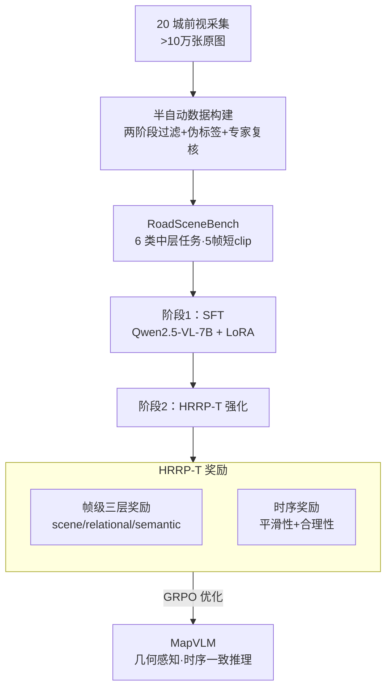

# RoadSceneBench: A Lightweight Benchmark for Mid-Level Road Scene Understanding

**会议**: CVPR 2026  
**论文**: [CVF Open Access](https://openaccess.thecvf.com/content/CVPR2026/html/Liu_RoadSceneBench_A_Lightweight_Benchmark_for_Mid-Level_Road_Scene_Understanding_CVPR_2026_paper.html)  
**代码**: https://github.com/XiyanLiu/RoadSceneBench  
**领域**: 自动驾驶 / 多模态VLM  
**关键词**: 道路场景理解, 中层语义, VLM, 时序一致性, 强化学习奖励

## 一句话总结
针对自动驾驶里夹在"像素感知"与"高层规划"之间、长期被忽视的**中层道路语义**（车道数、自车所在车道、变道可行性、匝道、拥堵等），本文造了一个轻量但标注密集的 benchmark **RoadSceneBench**（11,705 张图 / 2,341 段 5 帧短视频 / 16 万标注），并提出 **MapVLM**：在 Qwen2.5-VL-7B 上先 SFT、再用带时序一致性的分层关系奖励 **HRRP-T**（帧级三层奖励 + 时序平滑/合理性奖励，用 GRPO 训）做强化，把整体 P/R 从最强基线 Gemini-2.5-Pro 的 60.6/52.7% 提到 75.8/72.2%。

## 研究背景与动机
**领域现状**：自动驾驶感知和高精地图构建，主流是检测、分割、3D 重建这类**低层感知**任务，Cityscapes、BDD100K、nuScenes 等大规模数据集提供的也是密集的像素级/框级标注，回答的是"哪里有什么"。近年又有 NuScenes-QA、DriveLM、VLADBench 等把 VLM 引进来做 VQA / 指令跟随 / 交通图推理的高层语言任务。

**现有痛点**：低层感知数据集只关注局部、低层的"what is where"，几乎不编码"中层语义"——比如能不能往旁边车道变道、前方是不是匝道入口/出口、当前是不是拥堵。这些恰恰是连接感知与规划的关键。而高层 VLM benchmark 的标注又往往**稀疏、松散耦合**，很少在**每一帧**上定义车道数、自车车道这类带**明确逻辑依赖**的中层属性，因此无法评估模型是否维持了一个"自洽、几何感知"的局部道路拓扑表示。

**核心矛盾**：高精地图重建方法虽能精确恢复车道线/连通性，但**多传感器、计算贵、标注重**；很多工业场景（地图新鲜度监控、变化检测）其实只需要**轻量、纯相机**的语义判断（车道数变了没、是否新增出口匝道）。"重感知"和"轻语义判断"之间存在错配——既有 benchmark 不为后者服务。

**本文目标**：（1）造一个紧凑、可解释、reasoning 导向的中层语义 benchmark；（2）让 VLM 在这套任务上不仅每帧答得准，还要在帧内逻辑自洽、跨帧时序连贯。

**切入角度**：把中层任务设计成**相互依赖**而非独立——车道数约束自车车道（只有 3 条车道就不可能在第 4 条），匝道线索影响连通性推理，拥堵又常和匝道这种几何复杂处相关。这种结构性依赖正好对应工业 HD 地图流水线里的中层表示，于是可以用"结构一致性"作为监督之外的额外约束。

**核心 idea**：把 VLM 的推理过程当成一个**结构化决策序列**，用一个分层、带时序的强化奖励（HRRP-T）去奖励"帧内拓扑合法 + 跨帧演化合理"的预测，不需要额外人工标注就把静态识别器变成几何感知、时序一致的推理体。

## 方法详解

### 整体框架
全文有两条主线：先有数据集 **RoadSceneBench**，再有训练范式 **MapVLM**。数据侧：用车队在中国 20 城采集 >10 万张前视图，经"自动模型筛除低质 + 20 名标注员人工复核"两阶段过滤，得到 2,341 段、每段 5 帧连续画面，再用"伪标签 + 专家修正"的半自动协议按 6 类任务打 Q&A 标注，强制任务间逻辑一致与帧间时序连贯。模型侧：以 Qwen2.5-VL-7B 为底，第一阶段 LoRA SFT 建立基础的中层语义回答能力（直接输出车道数、自车车道、匝道、变道可行性、拥堵、场景类型的结构化描述）；第二阶段用 **HRRP-T** 强化——它把每帧拆成 scene/relational/semantic 三层算**帧级奖励**，再在 5 帧短窗上算**时序奖励**（平滑性 + 合理性），两路奖励合并后用 GRPO 优化。

### 关键设计

**1. 三层层级任务分类法：把"中层道路语义"拆成 6 个相互依赖的可推理任务**

benchmark 的核心不是堆数据，而是把"中层语义"形式化成一组**结构上相互约束**的任务，分三层组织：**scene-level**（低层空间拓扑：车道数 Lane Count、自车车道 Ego-lane Index）、**relational-level**（中层关系：匝道入口/出口识别、变道可行性 Lane-change Feasibility）、**semantic-level**（高层场景：道路类型 urban/suburban/highway、交通状况 free-flow/moderate/congestion）。关键在于这些任务**不是独立分类**：车道数约束自车车道的取值范围，匝道影响连通性，几何复杂处更易拥堵。这种显式逻辑依赖让 benchmark 能直接考"模型有没有维持一个自洽的局部拓扑表示"，而不是各任务各答各的——这正是后面强化奖励能发力的前提。论文实测 Ego-lane Index 和 Lane-change Feasibility 是最难的两类（多数 VLM 在这两项 P/R 都很低），而它们恰恰最贴近真实驾驶决策。

**2. 半自动数据构建：伪标签打底、专家强制逻辑/时序一致**

为在标注成本和质量间取平衡，作者用此前工作里的分类/分割模型先生成伪标签，再由专家复核修正，并显式要求标注员**强制任务间逻辑一致**（如自车在最左车道则不允许"向左变道"）与**帧序列内时序连贯**。数据规格上选了"每段 5 帧、1 FPS"的短 clip 而非单图，原图 4096×2160 高分辨率，2,341 段共 11,705 图、超 16 万标注。短 clip 的设计是有意为之：它既保留了时序连续性（为 HRRP-T 的时序奖励提供素材），又把标注工作量控制在可承受范围，体现了 benchmark "lightweight yet information-rich"的取向。

**3. 帧级分层奖励：按 scene/relational/semantic 三层分别给分**

SFT 后的模型缺的是**帧内的跨任务一致性**。HRRP-T 在每帧产出一个分层奖励向量，把上面三层各自和帧级 ground truth 比对后加权求和：

$$\mathcal{R}_{frame}^{t}=\alpha \mathcal{R}_{sce}^{t}+\beta \mathcal{R}_{rel}^{t}+\gamma \mathcal{R}_{sem}^{t}$$

其中 $t$ 是 clip 内第 $t$ 帧，$\mathcal{R}_{sce}$ 评低层拓扑（车道数、自车车道），$\mathcal{R}_{rel}$ 评关系推理（匝道识别、基于实线/动态障碍的变道可行性），$\mathcal{R}_{sem}$ 评高层语义（场景类型、拥堵）。分层而非一个总分的好处是：不同层的正确性来源不同（几何 vs 语义），分开奖励能让 RL 信号针对性地纠正每一层，避免高层语义答对就把低层拓扑错误"平均掉"。

**4. 时序分层奖励：平滑性 + 合理性，给推理装一个轻量有限状态机约束**

真实道路是非平稳的（车在动、车道合并/分叉、遮挡随时出现），所以时序奖励**不强求逐帧严格连续**，而是评判短时窗内的演化是否"合理"。它拆成两项，用 $\lambda$ 加权：

$$\mathcal{R}_{temp}=\lambda \mathcal{R}_{smooth}+(1-\lambda)\mathcal{R}_{plaus}$$

**平滑性** $\mathcal{R}_{smooth}=1-\frac{1}{T-1}\sum_{t=1}^{T-1}|y_t-y_{t-1}|$ 惩罚相邻帧的突变/震荡，主要正则车道数这类有序离散变量——预测从 3→2→2 这种渐变给高分，3→1→3 这种乱跳给低分。但光平滑不保证语义合法，于是**合理性** $\mathcal{R}_{plaus}=\frac{1}{T-1}\sum_{t=1}^{T-1}\mathbb{I}\big(V(y_t,y_{t+1})\big)$ 用一个逻辑函数 $V(\cdot)$ 判断每步转移是否符合领域先验：比如变道可行性从"可变"切到"不可变"（遇到实线）是允许的，但在两态间快速来回横跳则被压制。$V$ 相当于把一个**轻量有限状态机**约束嵌进时序，保证预测既平滑又物理/语义上自洽。最终把帧级和时序两路奖励合并，用 GRPO 训练：

$$\mathcal{R}_{\text{HRRP-T}}=\lambda_{frame}\frac{1}{T}\sum_{t=1}^{T}\mathcal{R}_{frame}^{t}+\lambda_{temp}\mathcal{R}_{temp}$$

> ⚠️ 公式 (1)-(5) 在 CVF 缓存的 OCR 文本里 LaTeX 有断裂，此处按论文语义重组，符号以原文为准。

### 损失函数 / 训练策略
两阶段：第一阶段 Qwen2.5-VL-7B + LoRA 做监督微调，建立中层语义的基础对齐；第二阶段冻结/复用 SFT 权重后用 HRRP-T 做 self-critical 强化，奖励信号即上面 $\mathcal{R}_{\text{HRRP-T}}$，优化器用 GRPO，全程不需要额外人工标注。训练在 A800 集群上用 ms-swift 框架完成；评测推理用确定性解码（temperature=0.0、top_p=1.0）。

## 实验关键数据

### 主实验
评测覆盖 3 个闭源 VLM（GPT-4o、Gemini-2.5-Pro、Claude-3.7-Sonnet）和跨 5 大家族的 12 个开源 VLM（ERNIE / DeepSeek / LLaVA / InternVL / Qwen 系列），指标为 Precision(P) / Recall(R)，闭源走官方 API 零样本。Overall 主结果（%）：

| 模型 | Lane Count P/R | Ego-lane Index P/R | Lane-change P/R | Overall P | Overall R |
|------|------|------|------|------|------|
| GPT-4o | 51.0/32.4 | 23.6/24.5 | 42.2/35.6 | 51.8 | 42.1 |
| Gemini-2.5-Pro（最强基线） | 52.8/43.1 | 72.7/46.5 | 59.3/53.0 | 60.6 | 52.7 |
| Claude-3.7-Sonnet | 28.6/28.3 | 27.5/25.2 | 41.1/44.9 | 47.3 | 41.4 |
| InternVL3-78B | 53.4/36.8 | 29.0/25.4 | 50.9/47.7 | 55.5 | 45.3 |
| Qwen3-VL-8B | 55.0/34.9 | 29.8/31.5 | 47.2/40.9 | 57.3 | 43.8 |
| **MapVLM (SFT)** | 66.0/61.6 | 69.3/50.4 | 87.6/88.3 | 72.1 | 67.3 |
| **MapVLM (SFT+HRRP-T)** | 63.4/65.9 | 75.4/84.7 | 83.8/84.7 | **75.8** | **72.2** |

MapVLM 在几乎所有 6 个任务上都拿到最高 P/R，Overall 比最强基线 Gemini-2.5-Pro（60.6/52.7）高出约 15 个点，且在最难的 Ego-lane Index、Lane-change Feasibility 两项优势最明显。

### 消融实验
论文的消融即 SFT vs SFT+HRRP-T（HRRP-T 强化阶段的增量）：

| 配置 | Overall P/R | Ego-lane Index P/R | 说明 |
|------|------|------|------|
| MapVLM (SFT) | 72.1 / 67.3 | 69.3 / 50.4 | 仅监督微调，缺帧内/时序一致性 |
| MapVLM (SFT+HRRP-T) | 75.8 / 72.2 | 75.4 / 84.7 | 加 HRRP-T 后整体 +3.7/+4.9 |

### 关键发现
- **HRRP-T 的增益集中在"靠时序救回来"的任务**：Ego-lane Index 的 Recall 从 50.4% 暴涨到 84.7%（+34 点），而 Lane Count 的 P 只是小幅波动甚至略降——说明时序一致性奖励主要帮的是"单帧遮挡/歧义下靠多帧证据稳住自车车道"，而非提升单帧像素级精度。
- **最难任务定位准确**：Ego-lane Index 和 Lane-change Feasibility 是所有模型的共同短板（如 Qwen2.5-VL-3B 在 Road Scene 上 P 71.8% 但 Ego-lane Index 只有 9.7%），而这两项恰是驾驶决策最相关的，凸显 benchmark 的针对性。
- **闭源整体强于开源，但开源内部 P/R 权衡明显**：Qwen3-VL-8B 拿最高开源 P（57.3%），InternVL3-78B 拿最高开源 R（45.3%）。
- 定性上（Fig.5）5 帧拥堵城市场景里前两帧清晰显示 5 车道、后三帧被遮挡，SFT 会随帧外观漂移、车道数和自车车道乱跳，SFT+HRRP-T 靠时序证据和"no lane-change"先验维持稳定的 5 车道拓扑。

## 亮点与洞察
- **把"benchmark 的结构依赖"直接复用成 RL 奖励**：任务间逻辑依赖（车道数约束自车车道、变道受实线约束）既是数据集设计原则，又被 $V(\cdot)$ 合理性函数和分层奖励直接编码进训练信号，数据和方法是同一套结构观，非常自洽。
- **平滑 + 合理性两项拆得巧**：只做平滑会把"合法的状态切换"也压平，加一个 FSM 式合理性项区分"渐变 vs 乱跳"和"合法转移 vs 非法横跳"，是处理离散有序变量时序一致性的可复用 trick。
- **"轻量、纯相机、中层语义"的定位有工业价值**：对地图新鲜度监控/变化检测这种场景，不需要重建 HD 地图，只判断"车道数变没变、有没有新匝道"即可，这个 benchmark 正好服务这层需求。
- 可迁移：分层奖励 + 短时窗时序一致性的范式，能搬到任何"逐帧结构化预测 + 帧间应连贯"的视频理解任务（如手术阶段识别、运动状态估计）。

## 局限与展望
- **地域受限**：受政策限制只在中国 20 城采集，泛化到其他国家的道路标线/规则未验证。
- **时序窗很短**（5 帧 / 1 FPS），$V(\cdot)$ 的合理性转移先验依赖人工/经验统计设定，规则覆盖度和可扩展性存疑；论文也未给 $\alpha,\beta,\gamma,\lambda,\lambda_{frame},\lambda_{temp}$ 等众多超参的敏感性分析。
- **消融偏薄**：只有 SFT vs SFT+HRRP-T 一档，没有拆开帧级三层奖励、平滑项、合理性项各自的贡献，无法判断 HRRP-T 内部哪一块最关键。
- **OCR 公式可靠性**：CVF 文本里公式有断裂，复现需以原始 PDF 为准。
- 作者展望：扩到更广地域、加入施工/事故/临时封道等动态事件，并引入物体 grounding 与交互级推理。

## 相关工作与启发
- **vs Cityscapes / BDD100K / nuScenes（低层感知）**：它们做密集像素/3D 标注回答"哪里有什么"，本文做中层关系语义回答"能不能变道、是不是匝道"，定位互补、标注量轻得多。
- **vs NuScenes-QA / DriveLM / VLADBench（高层 VLM 推理）**：它们标注稀疏松散、少有逐帧带逻辑依赖的中层属性，本文每帧定义结构相互约束的 6 任务，能考"局部拓扑自洽性"。
- **vs 向量化 HD 地图方法**：HD 地图重建精确但多传感器、计算贵、标注重；本文走轻量纯相机语义判断路线，服务地图变化检测等"足够用"的工业场景。
- **vs 普通 RLHF / self-critical 序列训练**：通用 RL 优化全局行为/人类偏好，本文把奖励细化到帧内拓扑合法 + 帧间转移合理的细粒度结构约束，是把"结构语义"显式耦合进多模态推理过程。

## 评分
- 新颖性: ⭐⭐⭐⭐ 中层道路语义这一空白点切得准，分层+时序一致的奖励设计与 benchmark 结构高度统一。
- 实验充分度: ⭐⭐⭐ 横向覆盖 15 个 VLM 很充分，但内部消融只有一档，缺奖励分项与超参敏感性分析。
- 写作质量: ⭐⭐⭐⭐ 动机—任务—方法逻辑链清晰；公式因 OCR 略有断裂，原文应更规整。
- 价值: ⭐⭐⭐⭐ 提供了轻量、可复现、贴近工业地图更新需求的中层语义评测基座与一套时序一致 RL 范式。

<!-- RELATED:START -->

## 相关论文

- [\[CVPR 2026\] GaussianDWM: 3D Gaussian Driving World Model for Unified Scene Understanding and Multi-Modal Generation](gaussiandwm_3d_gaussian_driving_world_model_for_unified_scene_understanding_and_.md)
- [\[CVPR 2026\] OccuFly: A 3D Vision Benchmark for Semantic Scene Completion from the Aerial Perspective](occufly_a_3d_vision_benchmark_for_semantic_scene_completion_from_the_aerial_pers.md)
- [\[CVPR 2026\] URScenes: A Multi-scenario Dataset for Unstructured Road Environments](urscenes_a_multi-scenario_dataset_for_unstructured_road_environments.md)
- [\[ICCV 2025\] MCAM: Multimodal Causal Analysis Model for Ego-Vehicle-Level Driving Video Understanding](../../ICCV2025/autonomous_driving/mcam_multimodal_causal_analysis_model_for_ego-vehicle-level_driving_video_unders.md)
- [\[CVPR 2026\] CARD: A Multi-Modal Automotive Dataset for Dense 3D Reconstruction in Challenging Road Topography](card_a_multi-modal_automotive_dataset_for_dense_3d_reconstruction_in_challenging.md)

<!-- RELATED:END -->
