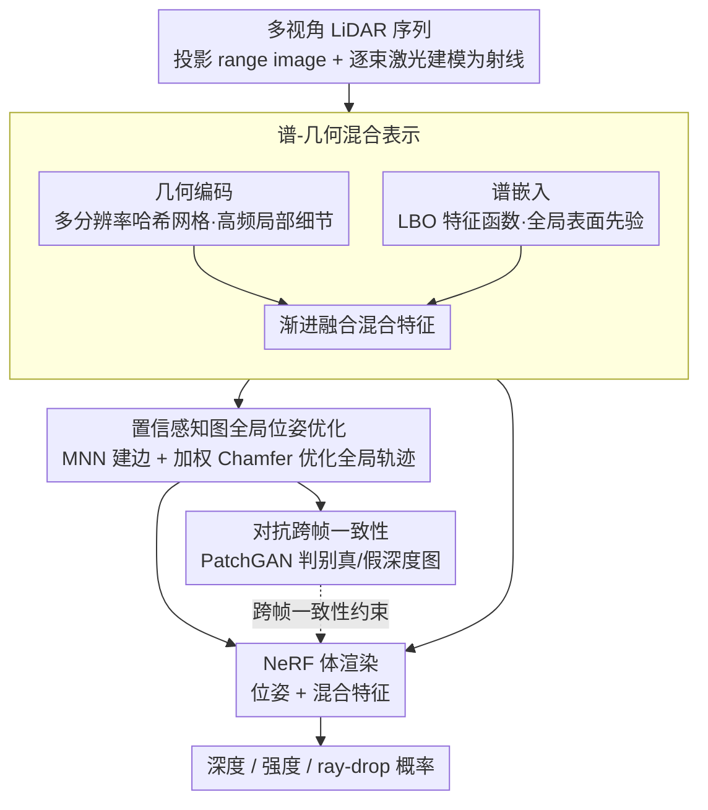

# SG-NLF: Spectral-Geometric Neural Fields for Pose-Free LiDAR View Synthesis

**会议**: CVPR 2026  
**arXiv**: [2603.12903](https://arxiv.org/abs/2603.12903)  
**代码**: 无  
**领域**: 自动驾驶  
**关键词**: 无位姿LiDAR, NeRF, 谱嵌入, 置信感知图优化, 对抗跨帧一致性  

## 一句话总结
SG-NLF提出一种无需精确位姿的LiDAR NeRF框架，通过谱-几何混合表示解决LiDAR稀疏数据导致的几何空洞问题，利用置信感知图实现全局位姿优化，并引入对抗学习强化跨帧一致性，在nuScenes上重建质量和位姿精度分别比SOTA提升35.8%和68.8%。

## 背景与动机
LiDAR新视角合成(NVS)对自动驾驶感知至关重要，可以扩展感知视野和增强系统鲁棒性。现有方法面临两大核心挑战：(1) 大多数LiDAR NeRF方法依赖精确的相机位姿，但在真实场景中难以获取；(2) LiDAR点云天然稀疏且无纹理信息，传统几何插值编码（如多分辨率哈希编码）在无观测区域难以重建连续完整的表面，导致几何空洞和不连续。已有的无位姿方法GeoNLF虽然尝试同时做配准和重建，但只用逐对对齐约束，全局轨迹精度受限。这些问题在低频LiDAR序列（帧间运动大、重叠少）中更加突出。

## 核心问题
如何在不依赖精确位姿的前提下，从稀疏的LiDAR点云序列中同时实现高质量的场景重建和精确的全局位姿估计？关键难点在于LiDAR数据的稀疏无纹理特性使得纯几何插值表示无法填补未观测区域的几何信息，而逐对的位姿对齐无法保证全局轨迹一致性。

## 方法详解

### 整体框架

SG-NLF 要在没有精确位姿的前提下，从稀疏 LiDAR 序列里同时做高质量重建和全局位姿估计。输入多视角 LiDAR 序列 $\{S_i\}$，先把点云投影成 range image、每束激光建模为一条射线；随后谱-几何混合表示提取场景特征，置信感知图基于这些特征做全局位姿优化，对抗学习再从跨帧尺度收紧一致性。优化后的位姿与混合特征一起喂进 NeRF，通过体渲染合成深度、强度和 ray-drop 概率。

### 关键设计

**1. 谱-几何混合表示：给稀疏 LiDAR 补上全局表面先验**

LiDAR 点云天然稀疏且无纹理，纯几何插值编码（多分辨率哈希网格）在没观测到的区域填不出连续表面，留下几何空洞与不连续。SG-NLF 在几何编码 $f_{geo}$ 之外引入 Laplace-Beltrami 算子(LBO)的可微谱嵌入 $f_{spe}$：用 MLP 近似前 $K$ 个 LBO 特征函数，通过最小化 Rayleigh 商求解，并施加正交性与归一化约束保证嵌入有效。谱嵌入具有内在的等距不变性，天然编码全局表面结构先验，恰好弥补几何插值在未观测区的不足。两者渐进融合成混合特征 $f_{hyb}$——低频谱嵌入给出平滑连续的全局几何，高频几何编码保留局部细节。

**2. 置信感知图全局位姿优化：把逐对对齐换成全局一致的位姿图**

GeoNLF 只用逐对对齐约束，全局轨迹精度受限，在低频（帧间运动大、重叠少）序列里尤其吃亏。SG-NLF 构建位姿图 $G=(V,E)$，顶点是各帧点云及其位姿，边除了时序相邻帧，还根据混合特征的兼容性分数加入非相邻帧的连边：用粗到细的互最近邻(MNN)策略建立点级对应，以余弦相似度作为兼容性分数决定是否建边。每条边再用空间一致性分数加权（检查对应点对之间的距离保持性），最终以加权 Chamfer Distance 损失优化全局位姿。相比逐对约束，图结构让远距离但可靠的帧对也能互相约束，从而拿到全局轨迹精度。

**3. 对抗跨帧一致性：用判别器同时检验重建质量和位姿精度**

现有方法只在单帧 range image 上做像素级监督，跨帧的结构信息被忽略，重建和位姿的不一致无从暴露。SG-NLF 把重建点云用估计的相对位姿变换到相邻帧坐标系、渲染出"假"深度图，与真实变换得到的"真"深度图配成对，送入 multi-scale PatchGAN 判别器做对抗训练。判别器要分辨真假，就必须同时盯住重建质量和位姿精度，从全局和局部两个尺度检出几何不对齐，相当于给 pose-free 训练加了一个自监督的一致性裁判。

### 损失函数 / 训练策略

总体损失 = 谱损失(Rayleigh 商 + 正交 + 归一化) + 图优化损失(加权 CD) + 跨帧一致性损失(对抗 hinge loss) + range image 监督损失。训练 60k 迭代，batch size 4096 rays，Adam 优化器，学习率 0.01 线性功率衰减。位姿在 Lie 代数空间优化，省略 Jacobian 实现更稳定收敛。

## 实验关键数据

### 低频场景（KITTI-360, 2Hz采样）

| 方法 | CD↓ | Depth PSNR↑ | Intensity PSNR↑ |
|------|------|-------------|-----------------|
| LiDAR4D (有GT pose) | 0.276 | 24.728 | 16.951 |
| GeoNLF (pose-free) | 0.236 | 25.276 | 16.581 |
| **SG-NLF (Ours)** | **0.170** | **28.707** | **19.265** |

### 低频场景（nuScenes, 2Hz采样）

| 方法 | CD↓ | Depth PSNR↑ | Intensity PSNR↑ |
|------|------|-------------|-----------------|
| LiDAR4D (有GT pose) | 0.567 | 17.092 | 24.475 |
| GeoNLF (pose-free) | 0.241 | 22.947 | 28.608 |
| **SG-NLF (Ours)** | **0.155** | **28.409** | **30.499** |

### 位姿估计（ATE, m）

| 方法 | KITTI-360 | nuScenes |
|------|-----------|----------|
| GeoNLF | 0.170 | 0.228 |
| **SG-NLF** | **0.074** | **0.071** |

### 消融实验要点
- **谱嵌入贡献最大**: 去掉几何编码只用谱嵌入(w/o GE)仍比GeoNLF好很多(CD: 0.181 vs 0.241)，说明谱先验是核心
- **混合表示最优**: 加上几何编码进一步提升(CD: 0.155)，因为高频细节需要几何编码补充
- **三模块协同必要**: 去掉任一模块(HR/GP/CFC)都导致显著性能下降，去掉混合表示(w/o HR)掉到CD 0.217，去掉全局位姿优化(w/o GP)掉到CD 0.463
- **跨帧一致性有效**: 即使没有位姿优化，加入CFC也能通过正则化改善训练(对比baseline和w/o GP)

## 亮点 / 我学到了什么
- **谱嵌入用于LiDAR NeRF是很聪明的设计**: 利用LBO本征函数的等距不变性来补偿LiDAR数据稀疏造成的几何空洞，把微分几何的工具引入到体素渲染中，比纯靠哈希编码插值有结构先验优势
- **GAN判别器检验跨帧一致性**: 通过变换后的深度图真/假对比，让判别器同时验证重建质量和位姿精度，这种"用判别器做自监督"的思路可以迁移到其他多视角重建任务
- **图优化中的兼容性评分**: 用学到的特征相似度决定是否建边，比固定连接时序相邻帧更灵活，特别适合低频(大运动)场景

## 局限与展望
- 目前只处理静态场景，未考虑动态物体（LiDAR4D和STGC已扩展到动态场景）
- 谱嵌入需要额外的Monte Carlo采样和特征函数MLP，增加了计算开销，论文未详细讨论效率
- 只在KITTI-360和nuScenes两个数据集上验证，未测试其他LiDAR传感器配置
- 论文声称"一种有效实现"，暗示该框架还有其他可能的实现方式未探索

## 与相关工作的对比
- **vs GeoNLF**: 最直接的对比，同为pose-free LiDAR NeRF。GeoNLF用纯几何插值+逐对对齐，SG-NLF用谱-几何混合+全局图优化+对抗学习，全方位超越（CD降35.8%，ATE降68.8%在nuScenes）
- **vs LiDAR4D**: 虽然LiDAR4D用GT位姿，SG-NLF无位姿仍超过它（CD降38.5%），说明表示能力的提升比位姿精度更关键
- **vs BARF/HASH等image pose-free方法**: 这些方法适配LiDAR后效果差，说明LiDAR稀疏数据需要专门设计的方法

## 与我的研究方向的关联
- 谱嵌入作为几何先验的思路可迁移到其他3D任务，如3D占据预测、点云配准
- 置信感知图优化的边选择策略可参考，在多视角融合中动态选择可靠的视角对

## 评分
- 新颖性: ⭐⭐⭐⭐ 谱嵌入+LiDAR NeRF的组合是新颖的，但各独立组件(谱分析、图优化、GAN)都不是新的
- 实验充分度: ⭐⭐⭐⭐⭐ 两个数据集、低频/标准频率、大量消融、定性定量对比全面
- 写作质量: ⭐⭐⭐⭐ 结构清晰，公式推导完整，图表信息量大
- 对我的价值: ⭐⭐⭐ 谱嵌入思路有启发，但LiDAR NVS非核心关注方向

<!-- RELATED:START -->

## 相关论文

- [\[ICLR 2026\] Spectral-Geometric Neural Fields for Pose-Free LiDAR View Synthesis](../../ICLR2026/autonomous_driving/spectral-geometric_neural_fields_for_pose-free_lidar_view_synthesis.md)
- [\[CVPR 2026\] VGGDrive: Empowering Vision-Language Models with Cross-View Geometric Grounding for Autonomous Driving](vggdrive_empowering_vision-language_models_with_cross-view_geometric_grounding_f.md)
- [\[CVPR 2026\] Neural Distribution Prior for LiDAR Out-of-Distribution Detection](neural_distribution_prior_for_lidar_ood_detection.md)
- [\[CVPR 2026\] Test-Time Training for LiDAR Semantic Segmentation under Corruption via Geometric Inlier Discrimination](test-time_training_for_lidar_semantic_segmentation_under_corruption_via_geometri.md)
- [\[CVPR 2026\] LiREC-Net: A Target-Free and Learning-Based Network for LiDAR, RGB, and Event Calibration](lirec-net_a_target-free_and_learning-based_network_for_lidar_rgb_and_event_calib.md)

<!-- RELATED:END -->
