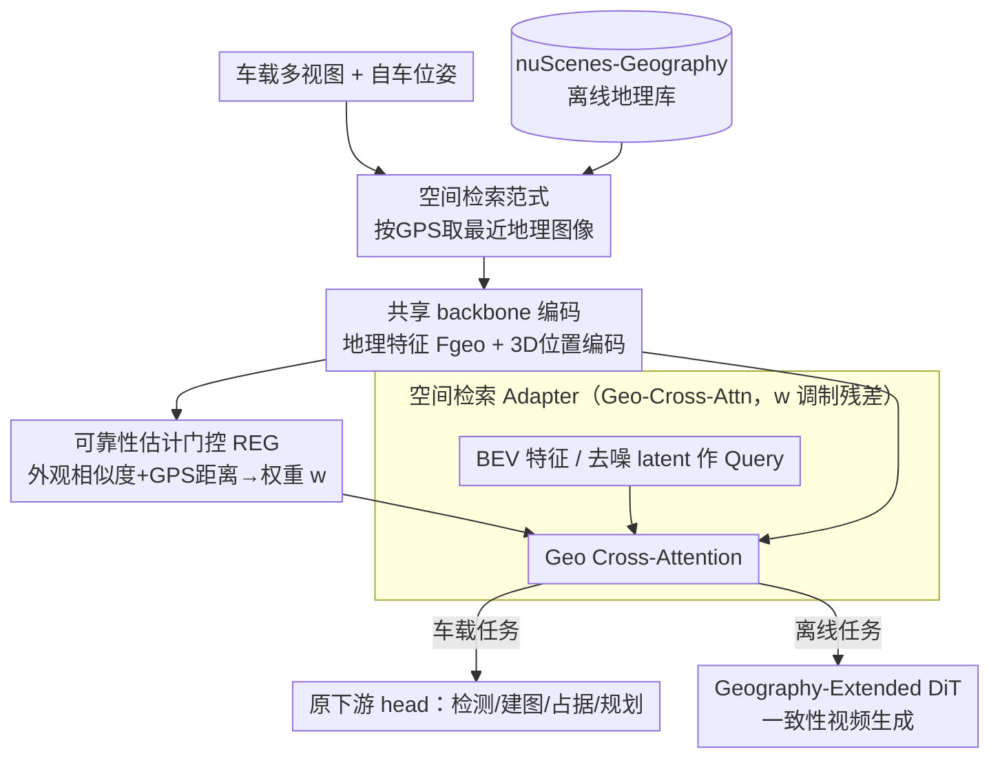

# Spatial Retrieval Augmented Autonomous Driving

**会议**: CVPR 2026  
**论文**: [CVF Open Access](https://openaccess.thecvf.com/content/CVPR2026/html/Jia_Spatial_Retrieval_Augmented_Autonomous_Driving_CVPR_2026_paper.html)  
**代码**: https://github.com/SpatialRetrievalAD  
**领域**: 自动驾驶 / BEV 感知 / 世界模型  
**关键词**: 空间检索、地理图像、即插即用、nuScenes-Geography、可靠性门控

## 一句话总结
本文提出"空间检索（spatial retrieval）"范式，把离线缓存的地理街景图像作为一种额外输入模态喂给自动驾驶模型，用一个即插即用的跨注意力 adapter（带可靠性门控）补全车载传感器在遮挡/暗光/雨雾下看不到的背景结构，并在在线建图、占据预测、规划、世界模型等多个任务上验证有效。

## 研究背景与动机

**领域现状**：现代自动驾驶（AD）感知几乎全部依赖车载传感器——相机、LiDAR、IMU——来在线获取环境信息，端到端、多传感器融合、时序建模等方法都建立在"drive-time 在线感知"之上。

**现有痛点**：在线感知本质上受限于**有限的感知视距和视线遮挡**。一旦遇到遮挡、视野受限、过曝/暗光、雨雪雾等恶劣条件，在线建图和占据预测就会严重退化，进而拖累规划；自动驾驶世界模型在自车轨迹偏离录制日志较大时则容易"幻觉"出不存在的场景，无法可靠地做闭环评测或强化学习环境。

**核心矛盾**：车载传感器获取的是"此刻、此视角"的信息，缺乏**长程、与地点绑定的先验**。可视条件一差，模型就没有任何外部参照来锚定背景几何。

**本文目标**：让 AD 模型像人类司机一样具备"回忆"能力——当前视觉输入不足时，能回想起这条路之前长什么样，从而补全超出车载传感器即时范围的更广上下文。

**切入角度**：地理图像（Google Maps 街景/卫星图，或自动驾驶公司自己的离线缓存）天然带经纬度坐标，**离线、全球可得、不受行车时扰动影响**。它们从自车之外的视角提供丰富背景线索，且无需新增传感器或人工标注。

**核心 idea**：用"按 GPS 坐标检索离线地理图像 → 即插即用注入现有模型"来替代"只靠在线传感器"，给 AD 任务补一个稳定的背景先验。

## 方法详解

### 整体框架
方法围绕三件事展开：①**检索**——在每个时间步用自车位姿 $P_t$ 从离线地理库 $D_{geo}$ 取回最相关的地理图像；②**融合**——用一个即插即用的跨注意力 adapter 把地理特征注入现有模型的 BEV 表征（或世界模型 DiT 的去噪 latent），下游 head、训练目标、网络结构全部保持不变；③**鲁棒**——用一个可靠性估计门控（REG）在检索缺失/错位时自动把地理特征的贡献压到接近零。同时，为了让这套范式能被研究，作者还构造了 nuScenes-Geography 数据集（把 nuScenes 扩展上对齐的地理图像）。

检索定义为 $\text{RetrievedGeoData}_t = \mathcal{R}(I_t, I_{geo}, P_t, P_{geo})$：本文为简化只取每个相机、每个时间步**最近邻**的一张地理图像，3D 距离超过阈值则 API 返回 NONE。对世界模型这种离线任务，因为整条目标轨迹已知，可以沿轨迹**预取**起止帧位置的多张地理图像，作为全局一致性的"空间脚手架"。

### 关键设计

**1. 空间检索范式：把离线地理图像当作一个新增输入模态**

针对车载在线感知"看不到遮挡/暗光下的背景"这一根本痛点，本文不去改感知 backbone，而是引入一类全新的输入——离线地理图像。它的关键性质是与在线传感器**正交**：街景/卫星图是离线缓存的，全球可得，不会因为行车时下雨、逆光、被遮挡而失效，且自带经纬度元数据可以和自车位姿对齐。检索函数对车载任务取每步最近邻地理图像，对世界模型则沿已知轨迹预取多张。和 HD 地图相比，地理图像不需要厘米级标注与维护，且包含植被、建筑立面、路面纹理等几何之外的丰富视觉细节——这些恰恰对占据预测、世界模型这种需要"背景长什么样"的任务有用。作者强调它是**对 HD 地图的补充而非替代**。

**2. 空间检索 Adapter：用 Geo-Cross-Attention 即插即用注入 BEV**

痛点是"如何在不动现有模型的前提下用上这个新模态"。作者设计了一个模型无关（model-agnostic）的 adapter：地理图像先用与车载相机**同一个 backbone** 编码得到 $F_{geo}$，再用 PETR 风格的 3D 位置编码 $F^{pos}_{geo}$ 表达地理图块与当前自车位置的相对空间关系。融合用一次跨注意力，以标准 BEV 特征 $F_{BEV}$ 作 query、地理特征加位置编码作 key/value，并用可靠性权重 $w$ 调制后做残差更新：

$$\mathbf{F}_{\text{BEV}}' = \mathbf{F}_{\text{BEV}} + w \cdot \text{CrossAttn}(\mathbf{F}_{\text{BEV}}, \mathbf{F}_{\text{geo}} + \mathbf{F}^{\text{pos}}_{\text{geo}}, \mathbf{F}_{\text{geo}})$$

增强后的 $F_{BEV}'$ 直接送回原始下游 head。这个残差+门控的设计让训练目标和网络结构**完全不变**，因此能直接套到 MapTR、FBOcc、BEVDet、VAD 等多种 BEV 任务上，真正做到"即插即用"。

**3. Geography-Extended DiT：给世界模型沿轨迹注入一致性脚手架**

世界模型常跑在服务器上做数据生成/闭环评测/RL 环境，痛点是自车轨迹偏离录制日志时容易幻觉、长时序场景会漂移。由于离线生成时整条未来轨迹已知，作者可以沿路径预取起止帧的地理图像，在广泛使用的 DiT block 原始注意力层之后**额外插一层地理跨注意力**：

$$\mathbf{F}' = \mathbf{F} + w \cdot \text{CrossAttn}(\mathbf{F}, \mathbf{F}_{\text{geo}}+\mathbf{F}^{\text{pos}}_{\text{geo}}, \mathbf{F}_{\text{geo}})$$

其中 $F$ 是去噪 latent，$F_{geo}$ 是该生成片段起止帧对应的地理特征。这样模型在生成每个未来位置时都有持续的地理上下文作为结构脚手架，从而维持长时序、全局一致的场景生成、减少幻觉。

**4. 带可靠性估计门控的自适应融合：让模型对错检索免疫**

地理检索的现实难题是**缺失或错位**——地图过时（施工改了路但缓存没更新）或 GPS/定位误差导致取回的街景和车载图对不上。如果照单全收，错误先验反而会污染模型。为此作者设计可靠性估计门控（REG），输出一个 $w \in [0,1]$ 的可靠性分数：

$$w = \sigma(\text{MLP}([\text{ZNCC}(\mathbf{F}_{\text{onboard}}, \mathbf{F}_{\text{geo}}), d_{\text{GPS}}]))$$

其中 ZNCC 是车载特征与地理特征的零均值归一化互相关（衡量外观相似度），$d_{GPS}$ 是街景位置与自车位置的距离，$\sigma$ 为 sigmoid。训练时用二值标签监督（错位/缺失为 0、有效为 1，负样本来自人工标注的 1800 个错位案例）。测试时这个学到的门控能自动给不可靠的地理特征降权——当检索缺失或错位时，前述两个残差式中的 $w \to 0$，残差更新趋近于零，模型退化回纯车载基线，保证不被坏先验带偏。

### 一个完整示例：nuScenes-Geography 数据是怎么造出来的
为了让范式可研究，作者把 nuScenes 扩展成 nuScenes-Geography，关键在于**高效且几何正确地**对齐地理图像：① 用 nuScenes 地图原点 + 自车位姿算出每帧的经纬度，去查 Google Maps API；② 由于街景采样频率远低于 nuScenes 关键帧率，多帧会对应同一街景位置，于是每个唯一街景**只下载一次**，对它取 18 个偏航角（覆盖 360°、pitch 固定 0°）的透视图，投影成等距柱状全景（equirectangular panorama）存储；③ 对每帧每个车载相机，实例化一个**虚拟相机**（内参同 nuScenes 相机、外参由自车与街景采集点的经纬度偏移推出），从全景图重投影合成与该帧几何对齐的街景图。这一"下载一次、按需重投影"的流程相比逐帧下街景裁剪**节省 70%+ 存储**，并保证车载帧与合成街景一一对应。数据集覆盖率较高（如某 split 可用约 94.32%、错位 4.93%、缺失 0.75%）。

## 实验关键数据

在 nuScenes-Geography 上跨五个任务评测（检测、在线建图、占据预测、端到端规划、生成式世界模型），围绕三点验证：增强静态场景理解、提升规划鲁棒性、提升世界模型空间一致性。

### 主实验

**在线建图（ResNet50，复现）**——地理先验带来最显著收益：

| 方法 | Epoch | mAP↑ | 提升 |
|------|-------|------|------|
| MapTR | 24 | 50.3 | — |
| MapTR+Geo | 24 | 61.2 | +10.9 |
| MapTR | 110 | 59.3 | — |
| MapTR+Geo | 110 | 72.7 | +13.4 |
| MapTRv2 | 110 | 68.7 | — |
| MapTRv2+Geo | 110 | 78.2 | +9.5 |

**占据预测（Occ3D-nuScenes）**——整体 mIoU 小幅提升，静态地形类别提升更明显：

| 方法 | Overall mIoU↑ | driveable | terrain |
|------|---------------|-----------|---------|
| FBOcc | 39.11 | 80.07 | 55.13 |
| FBOcc+Geo | 39.74 (+0.63) | 82.47 (+2.4) | 57.7 (+2.57) |

**生成式世界模型**——FVD/FID 同步下降，证明地理先验抑制场景漂移：

| 方法 | FVD↓ | FID↓ |
|------|------|------|
| UVG (UniMLVG) | 36.10 | 5.82 |
| UVG+Geo | 29.97 (+6.13) | 5.60 (+0.22) |
| MDD (MagicDriveDit) | 84.43 | 18.38 |
| MDD+Geo | 81.52 (+2.91) | 18.10 (+0.28) |

**端到端规划（VAD）**——L2 轨迹精度相当，但安全性提升，夜间子集尤其明显：夜间平均碰撞率从 0.55% 降到 0.48%。

**目标检测**——提升基本可忽略（BEVDet+Geo 的 NDS +0.02、mAP −0.16；BEVFormer+Geo NDS +0.10），因为地理图像主要补背景信息，对前景物体帮助有限。

### 消融实验
（占据任务静态 mIoU / 世界模型 FVD，FlashOcc + UniMLVG）

| 配置 | 静态 mIoU↑ | FVD↓ | 说明 |
|------|-----------|------|------|
| w/o Geo Images | 46.66 | 35.42 | 不用地理图像 |
| w Geo Images | 47.86 | 29.97 | 加地理图像，两项都明显变好 |
| w/o 3DPE | 46.22 | 32.82 | 去掉 3D 位置编码 |
| w/o REG | 47.65 | 30.95 | 去掉可靠性门控 |
| Full (3DPE+REG) | 47.86 | 29.97 | 完整模型 |

### 关键发现
- **地理图像本身贡献最大**：去掉后静态 mIoU 47.86→46.66、FVD 29.97→35.42，是收益主来源。
- **3D 位置编码很关键**：去掉后 FVD 从 29.97 涨到 32.82，说明只有特征不够，必须把"地理图像在自车坐标系里的空间关系"编码进去。
- **任务依赖性强**：凡涉及背景/静态结构的任务（建图、占据、世界模型）收益大；前景主导的检测几乎无提升——这与"地理先验只补背景"的直觉一致。
- **REG 的价值在鲁棒**：去掉后指标仅小幅下降（数据集本身覆盖率高、错位样本少），但它保证了缺失/错位时不被坏先验带偏，是范式能落地的安全阀。

## 亮点与洞察
- **把"离线地图"重新定义为一种传感模态**：不是去做更强的在线感知，而是引入一类正交、廉价、抗扰动的输入，这个 reframing 很巧妙——天气再差，缓存的街景不会变差。
- **门控残差让"新模态"零风险接入**：$w$ 调制的残差式保证检索失败时模型平滑退化回原基线，这种"加得上也去得掉"的设计是即插即用能成立的关键，可迁移到任何"不可靠外部先验"的融合场景。
- **数据工程同样是贡献**：等距全景 + 虚拟相机重投影把"逐帧下街景"的存储砍掉 70%+，并保证几何对齐，是复现这套范式的实际门槛所在。
- **诚实地报告了负结果**：检测几乎没涨、规划 L2 持平，作者没有粉饰，反而点出"用地理图像区分前景/背景再辅助检测"是未来方向。

## 局限与展望
- **检索极其朴素**：只取最近邻一张图，作者自己承认更高级的检索（取邻域多张做全局上下文）留给未来。
- **收益高度偏背景任务**：对前景目标检测帮助微乎其微，规划也只在夜间安全性上见效、L2 精度不变。
- **依赖外部地图质量与定位精度**：过时地图、GPS 误差会引入错位，虽有 REG 缓解，但数据集里仍需人工标注 1800 个错位负样本来训练门控，规模化到新城市的标注成本未讨论。
- **仅在 nuScenes-Geography 验证**：是否能泛化到其他数据集/真实路网、以及在线实时检索的延迟开销，论文未充分覆盖。
- 改进思路：把检索升级为可学习的 top-k 邻域聚合、用门控的可靠性分数反过来做主动建图更新、或把前景/背景分离显式建模以让检测也吃到红利。

## 相关工作与启发
- **vs HD 地图**：HD 地图给厘米级几何但标注/维护昂贵且只编码预定义信息（车道拓扑）；地理图像易采集、含几何之外的视觉细节（植被、立面、路面纹理），本文定位为对 HD 地图的**补充而非替代**。
- **vs AD 中已有的检索方法**：以往检索多用于视觉地点识别、规则理解（LLM）、定位、轨迹采样，或用历史遍历数据做视觉里程计/神经地图先验/历史 LiDAR 检测——都是**任务特定**用法；本文的空间检索取位置对齐的地理图像作为**通用互补感知输入**，可跨五个任务复用。
- **vs Bench2Drive-R**：世界模型沿轨迹预取地理图像的思路借鉴了 Bench2Drive-R，但本文把它统一进一个带 REG 门控的跨注意力 adapter，并扩展到车载感知任务。

## 评分
- 新颖性: ⭐⭐⭐⭐ 把离线地理图像作为新输入模态的 reframing 清晰且实用，但单个组件（cross-attn adapter、PETR PE、门控残差）都是成熟件的组合。
- 实验充分度: ⭐⭐⭐⭐ 覆盖五大任务 + 多 baseline + 消融，诚实报告负结果；但仅限 nuScenes-Geography 一个数据集。
- 写作质量: ⭐⭐⭐⭐ 动机生动（"人类司机回忆道路"），图表清晰，数据工程交代到位。
- 价值: ⭐⭐⭐⭐ 提出新范式 + 开源数据/基线，对建图/占据/世界模型社区有即用价值，前景任务收益有限。

<!-- RELATED:START -->

## 相关论文

- [\[CVPR 2026\] SpaceDrive: Infusing Spatial Awareness into VLM-based Autonomous Driving](spacedrive_infusing_spatial_awareness_into_vlm-based_autonomous_driving.md)
- [\[CVPR 2026\] RAG-TP: A General Framework for Vehicle Trajectory Prediction via Retrieval-Augmented Generation](rag-tp_a_general_framework_for_vehicle_trajectory_prediction_via_retrieval-augme.md)
- [\[CVPR 2026\] SearchAD: Large-Scale Rare Image Retrieval Dataset for Autonomous Driving](searchad_large-scale_rare_image_retrieval_dataset_for_autonomous_driving.md)
- [\[CVPR 2026\] KnowVal: A Knowledge-Augmented and Value-Guided Autonomous Driving System](knowval_a_knowledge-augmented_and_value-guided_autonomous_driving_system.md)
- [\[AAAI 2026\] RAST: A Retrieval Augmented Spatio-Temporal Framework for Traffic Prediction](../../AAAI2026/autonomous_driving/rast_a_retrieval_augmented_spatio-temporal_framework_for_traffic_prediction.md)

<!-- RELATED:END -->
