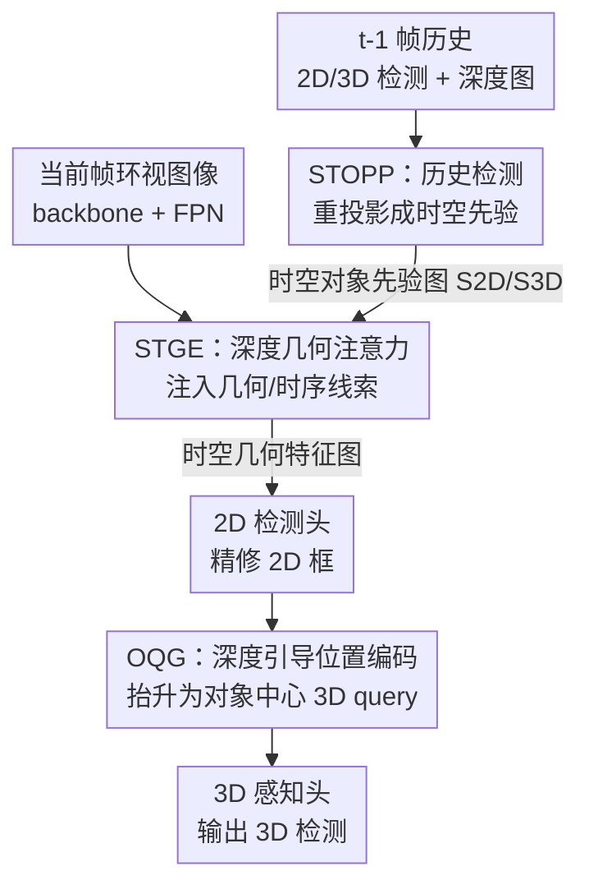

# STUR3D: Spatio-Temporal Unified Representation Learning for 3D Object Detection

**会议**: CVPR 2026  
**论文**: [CVF Open Access](https://openaccess.thecvf.com/content/CVPR2026/html/Fan_STUR3D_Spatio-Temporal_Unified_Representation_Learning_for_3D_Object_Detection_CVPR_2026_paper.html)  
**代码**: https://github.com/snowindog/STUR3D  
**领域**: 自动驾驶 / 3D视觉  
**关键词**: 环视3D目标检测, 时空对齐, 2D-to-3D, 历史先验传播, 深度几何编码

## 一句话总结
STUR3D 针对相机环视 3D 检测中"过度依赖当前 2D 线索、忽视历史 3D 信息"导致的时空不一致问题，把上一帧的 2D/3D 检测结果显式重投影回当前图像平面作为时空先验，再用深度感知的几何注意力把这些先验注入 2D 检测头，最后用带伪深度的位置编码把精修后的 2D 框抬升为 3D query，在 nuScenes test 集上达到 57.9% mAP / 64.6% NDS 的 SOTA。

## 研究背景与动机
**领域现状**：相机环视 3D 目标检测（surrounding-view 3D detection）是自动驾驶感知的核心任务之一——只用六路相机、不依赖昂贵 LiDAR，就要在世界坐标系下框出周围所有车辆/行人并估计其 3D 尺寸、朝向、速度。主流方案沿用 DETR3D 的 query 范式：初始化一批 3D query，跨帧传播以累积时序上下文（如 StreamPETR）。近期更进一步出现了 **2D-to-3D 流水线**（MV2D、Far3D、QAF2D、DVPE 等），思路是先用成熟的 2D 检测器找出物体，再把 2D 结果抬升成 3D query 作为可靠先验。

**现有痛点**：这类 2D-to-3D 方法有一个共同的"偏心"——它们给"由当前 2D 信息初始化的 3D query"分配高置信度，却把"历史传播过来的 3D 线索"当作次要参考。这带来两类具体问题。从**空间**看，2D 特征本身不显式建模深度、尺度、朝向这些 3D 几何量，仅凭 2D 表征生成的 3D query 缺乏几何依据，抬升（lifting）后定位偏差大；而且后续 query 精修阶段 2D 线索继续主导，误差被进一步放大。从**时间**看，这些方法没有充分利用历史 3D 检测里编码的时序动态，一旦目标被遮挡，模型无法借助累积的 3D 线索维持对目标的注意，导致漏检（object omission）和时序不一致。

**核心矛盾**：2D 表征和 3D 表征之间存在一道**跨维度、跨帧的鸿沟**——2D 强于外观语义但缺几何，历史 3D 强于几何与时序连续性但被现有 pipeline 边缘化。两者没有被显式对齐，于是空间定位和时序鲁棒性都吃亏。

**本文目标**：建立 2D 与 3D 之间的时空对齐，具体分解为三个子问题——(1) 如何把可靠的历史 2D/3D 检测显式变成当前帧能用的先验；(2) 如何让 2D 检测头直接学到 3D 定位所需的几何表征，而不是把 3D 线索绕着 2D 头跨帧中转；(3) 如何把精修后的 2D 框抬升成几何依据充分的 3D query。

**切入角度**：作者的关键观察是——在前几帧被验证过的检测结果，几何上可靠、语义上稳定，与其用隐式特征传播或全局融合，不如**显式复用**这些历史检测，把它们重投影回当前图像平面。这样既能抑制背景噪声、聚焦一致的前景区域，又能在遮挡时靠历史证据"记住"目标。

**核心 idea**：用"历史 2D/3D 检测显式重投影 → 几何深度注入 2D 头 → 对象中心抬升 3D query"这条统一时空管线，替代"2D 主导、3D 历史次要"的旧 pipeline，让异构的 2D 与 3D 时空表征对齐。

## 方法详解

### 整体框架
STUR3D 是一个端到端的环视 3D 检测框架。在第 $t$ 帧，输入包括：当前帧的环视图像（经 backbone + FPN neck 提特征），以及来自第 $t{-}1$ 帧的深度图、2D 检测和 3D 检测作为先验信息。整体跑三个核心模块再接 3D 感知头：

1. **STOPP（Spatio-Temporal Object Prior Propagator，时空对象先验传播器）**：吃历史 2D/3D 检测，做 2D-to-2D 和 3D-to-2D 的时序传播，把历史框重投影到当前图像平面，生成结构化的"时空对象先验图"，实现 2D 与 3D 时序信息的空间对齐。
2. **STGE（Spatio-Temporal Geometry Encoder，时空几何编码器）**：在深度引导下把 STOPP 产出的时空先验与当前图像特征融合，用深度感知几何注意力注入几何/时序线索，过滤不可靠的前景假设，输出时空几何特征图供 2D 检测。
3. **OQG（Object-center Query Generator，对象中心 query 生成器）**：把精修后的 2D 框用深度引导的位置编码抬升为对象中心的 3D query，注入伪深度线索补强几何依据，再送入 3D decoder。

整条链路把"历史 3D 信息"从被边缘化的角色，提升为显式驱动当前 2D 检测与 3D query 生成的主线，从而同时缓解空间错位和时序漏检。

### 关键设计

**1. STOPP — 显式重投影历史检测，造时空对象先验**

针对"历史 3D 线索被边缘化、遮挡即漏检"的痛点，STOPP 不再靠隐式特征传播，而是把上一帧高置信度的检测结果**显式重投影**回当前帧。它定义历史先验为高置信度的 2D 检测 $D^{2D}_{t-1}=\{(B^{2D}_{i,t-1}, c_{i,t-1}, f^{2D}_{i,t-1})\}$ 和 3D 检测 $D^{3D}_{t-1}=\{(B^{3D}_{j,t-1}, c_{j,t-1}, f^{3D}_{j,t-1})\}$，其中框特征 $f$ 由 RoIAlign 抽取，3D 框还要先经几何投影算子 $\Pi(\cdot)$ 投到图像平面。

模块走两条并行分支做**时序几何对齐与投影**：用自车运动矩阵 $T_{t-1\to t}$ 把历史框对齐到当前帧。3D 分支直接把 3D 框变换并重投影到当前各视角图像：$B^{3D|2D}_{j,t}=\Pi(K_t, T_{t-1\to t}\cdot B^{3D}_{j,t-1})$；2D 分支则在框中心 $(\bar u_i,\bar v_i)$ 处采样上一帧深度图的深度 $d_{i,t-1}$，构造伪 3D 中心后再投回当前帧：$B^{2D}_{i,t}=\Pi(K_t, T_{t-1\to t}\cdot K_{t-1}^{-1}\cdot[\bar u_i,\bar v_i,1]d_{i,t-1})$。投影后超出视野的框被丢弃。最后做**先验图生成**：把框特征与类别编码拼接过 MLP 得对象嵌入 $e_o=\mathrm{MLP}(f_{o,t-1}\oplus\mathrm{CatEnc}(c_{o,t-1}))$，再用对象空间掩码 $M_o$ 把嵌入注入对应区域、跨对象聚合归一化：

$$S_t=\frac{\sum_{o=1}^{O} e_o\otimes M_o}{\max\left(1,\ \sum_{o=1}^{O} M_o\right)}$$

同一流程分别作用于 2D 与 3D 框特征，产出两张先验图 $S^{2D}_t$ 和 $S^{3D}_t$。这样做有三重好处：抑制背景干扰聚焦前景、用时序线索缓解遮挡、消除 2D 与 3D 检测间的差异实现跨模态对齐——而且因为是显式重投影而非隐式融合，历史 3D 的几何与时序信息得以"原汁原味"地参与当前帧。

**2. STGE — 深度感知几何注意力，让 2D 头直接产出 3D 所需表征**

拿到先验图后，STGE 要解决的痛点是"2D 特征空间和 3D 特征空间有表征鸿沟，3D 线索过去只能绕着 2D 头跨帧中转"。它先用一个轻量 DepthNet（残差+卷积块）预测逐像素深度回归和概率深度分布，训练时由 LiDAR 深度信号监督、推理时纯视觉运行。受 Deformer 系列启发，利用"每个像素有唯一 2D 坐标、深度值编码与其他像素的相对距离"这一观察，构造图像平面先验和深度距离先验，合成几何先验 $X$（形状 $H_fW_f\times H_fW_f$），并用**几何注意力**把它注入特征：

$$\mathrm{GeoAtten}(F,X)=\big(\mathrm{Softmax}(QK^\top)\odot\beta X\big)V$$

其中 $\beta\in(0,1)$ 是可学习衰减率，控制几何先验的影响强度。当前图像特征 $F_t$ 与合并先验 $S^{2D}_t+S^{3D}_t$ 先各过卷积，再分别走 Image-GeoAtten 和 Prior-GeoAtten 得 $F'_t$ 和 $S_t$。然后用**自适应阈值门（ATG）**生成空间掩码强调高置信前景区域，得到最终时空几何特征图：

$$F_{sp,t}=F'_t+F'_t\odot\sigma\big(\mathrm{ATG}((S_t-\gamma)\tau)\big)+S_t$$

ATG 用两个可学习参数 $\gamma$（阈值偏移）和 $\tau$（掩码平滑度）。⚠️ 公式（13）原文括号配对略显歧义，以原文为准。STGE 的关键意义在于：它让 2D 检测器**直接蒸馏并供给 3D 头实际消费的特征表征**，包括那些过去必须跨帧经 2D 头中转的 3D 线索，从而缩小 2D-3D 表征鸿沟；同时深度值增强了物体边界清晰度，引导 2D 检测器更精确定位。

**3. OQG — 对象中心 + 伪深度，抬升出几何依据充分的 3D query**

STGE 的时空几何特征图送入 2D 检测头得到精修 2D 框后，OQG 负责把它们抬升为 3D query，解决"仅凭外观 2D 特征抬升、3D query 缺几何依据"的痛点。对每个检测框，先经 RoIAlign + MLP 得特征嵌入 $e^{2d}_t$，再用相机内参逆 $K_t^{-1}$ 生成粗位置编码 $Pe'\in\mathbb{R}^{3\times M}$。同时从深度图取框中心下方的深度值，与中心坐标拼成**伪 3D 点**，经 $K_t^{-1}$ 变换得对象中心 3D 位置 $Po\in\mathbb{R}^{3\times M}$。两者送入线性层得偏移并叠加，得精修位置编码：

$$Pe=\mathrm{Linear}(\mathrm{concat}(Pe', Po))+Pe'$$

它的两点贡献：一是可靠的 2D 检测为伪点云提供修正线索（消除其固有偏差）；二是借位置编码生成精修后的 3D 点，抑制误差向 3D 检测流水线传播。本质上 OQG 在 2D 感知与 3D 推理间架起了一座显式桥梁，让 3D query 自带几何 grounding 而非全靠外观猜测。

### 损失函数 / 训练策略
深度由 LiDAR 点投影到相机视图形成稀疏深度图（下采样 ×16）监督，DepthNet 用有效像素上的 masked regression loss 训练；推理时纯视觉。backbone 用 ResNet50/ResNet101/V2-99，AdamW + cosine annealing，学习率 $4\times10^{-4}$，batch size 8，4 张 A6000；val 集训 90 epoch、test 集训 60 epoch；不用 CBGS、TTA、未来帧。每帧保留 top-128 个 2D 检测、top-256 个 3D 检测；$\beta,\gamma,\tau$ 均初始化为 0.5。

## 实验关键数据

### 主实验
在 nuScenes 上评测，报告 mAP 和 NDS（及 mATE/mASE/mAOE/mAVE/mAAE）。test 集上 STUR3D 用 V2-99 backbone、640×1600 输入达到新 SOTA，超基线 StreamPETR +2.8% mAP / +1.0% NDS，超 SOTA 方法 DVPE +0.6% mAP / +0.2% NDS：

| 数据集 | Backbone / 分辨率 | 方法 | mAP↑ | NDS↑ |
|--------|------------------|------|------|------|
| nuScenes test | V2-99 / 640×1600 | StreamPETR (基线) | 55.0 | 63.6 |
| nuScenes test | V2-99 / 640×1600 | DVPE (旧 SOTA) | 57.2 | 64.4 |
| nuScenes test | V2-99 / 640×1600 | RayDN | 56.5 | 64.5 |
| nuScenes test | V2-99 / 640×1600 | **STUR3D** | **57.9** | **64.6** |

val 集上不同 backbone 一致领先：ResNet50/704×256（nuImages 预训练）达 48.6% mAP / 57.9% NDS，超 OPEN +1.6% mAP / +1.4% NDS、超基线 StreamPETR +3.7% mAP / +2.9% NDS；ResNet101/1408×512 达 53.1% mAP / 61.3% NDS，超 Sparse4Dv2 +1.0% mAP / +0.5% NDS。

### 消融实验
组件消融（V2-99 backbone，320×800 输入，重训 24 epoch；基线无任何模块 a = 48.2/57.1）：

| 配置 | STOPP | STGE | OQG | mAP↑ | NDS↑ | 说明 |
|------|:---:|:---:|:---:|------|------|------|
| a | - | - | - | 48.2 | 57.1 | 基线 |
| b | ✓ | - | - | 48.9 | 58.1 | +STOPP，时序先验稳定表征 |
| c | - | ✓ | - | 48.7 | 58.0 | +STGE，几何一致性 |
| d | - | - | ✓ | 50.2 | 59.2 | +OQG，对象中心 query 增益最大 |
| e | ✓ | - | ✓ | 52.1 | 60.5 | 时序+几何先验协同 |
| f | - | ✓ | ✓ | 51.7 | 60.2 | 深度引导几何 |
| g | ✓ | ✓ | ✓ | **53.0** | **61.2** | 完整模型，超基线 +4.8 mAP / +4.1 NDS |

深度编码方式对比（Table 6）：STGE 在所有指标上稳超 Linear / MLP 编码；带 LiDAR 监督时 NDS 再 +1.0%；即便完全无 LiDAR 监督，纯相机也能到 52.7% mAP / 60.2% NDS：

| 深度编码 | LiDAR 监督 | mAP↑ | NDS↑ |
|----------|:---:|------|------|
| Linear | - | 52.5 | 59.8 |
| MLP | - | 51.7 | 60.1 |
| STGE | - | 52.7 | 60.2 |
| STGE | ✓ | **53.0** | **61.2** |

### 关键发现
- **OQG 单模块增益最大**（d：+2.0% mAP / +2.1% NDS），说明带深度先验的对象中心 query 生成对 3D 初始化最关键；三模块叠加才把基线从 48.2 推到 53.0 mAP。
- **STOPP 即插即用**：接到 DVPE 上 +0.3% mAP/NDS、接到 OPEN 上让其到 52.4% mAP / 60.7% NDS，证明时空先验传播是可迁移模块。
- **历史帧缓存适度即可**（Table 5）：去掉 2D 或 3D 检测先验都明显掉点（B/C），说明 2D+3D 先验需联合使用；缓存帧从 1 增到 2（F）精度持平，增到 4（G）反而因累积时序噪声无增益。
- **精度-效率平衡好**：STUR3D 在 7.8 FPS 下达 53.0% mAP / 61.2% NDS，比 QAF2D 快约 2× 且更准；虽然 OPEN 吞吐最高（10.3 FPS），STUR3D 的 mAP 最佳、NDS 与之持平。
- **遮挡鲁棒**：可视化显示 STUR3D 能恢复基线和 QAF2D 都漏掉的严重遮挡目标，得益于时空传播结构利用前帧信息维持时序一致。

## 亮点与洞察
- **把"历史检测"当显式先验而非隐式特征**：核心巧思是不传播抽象特征，而是直接把上一帧高置信度的 2D/3D 框重投影回当前图像平面、编成空间先验掩码。这让历史几何信息"看得见摸得着"，遮挡时还能靠历史证据维持注意——这套显式重投影的思路可迁移到任何带时序的检测/跟踪任务。
- **几何注意力里的可学习衰减 $\beta X$**：把深度距离/图像平面先验 $X$ 以乘性项注入 attention（$\mathrm{Softmax}(QK^\top)\odot\beta X$），用一个标量 $\beta$ 学几何先验该用多强，比硬编码几何 bias 更灵活。
- **让 2D 头"直接产出 3D 头要吃的特征"**：STGE 的设计哲学很有启发——与其让 3D 线索跨帧绕道 2D 头中转，不如让 2D 头在深度引导下直接蒸馏 3D 定位所需表征，从源头缩小 2D-3D 鸿沟。
- **STOPP 的即插即用性**：作为独立模块接到 OPEN/DVPE 上都能涨点，说明"时空对象先验传播"是一个解耦良好、可复用的组件。

## 局限与展望
- **作者承认的局限**：几何注意力机制的效率与可扩展性还有提升空间（几何先验 $X$ 是 $H_fW_f\times H_fW_f$ 的大矩阵，开销不小），作者把这列为未来工作。
- **依赖历史帧质量**：方法建立在"上一帧高置信度检测可靠"的假设上，若前帧检测本身错误（如突然出现的目标、剧烈运动），重投影先验可能引入误导；缓存超过 2 帧反而掉点也印证了时序噪声的累积风险。
- **深度监督的两面性**：训练阶段仍需 LiDAR 监督深度才能拿到最佳精度（带监督比无监督 NDS 高约 1%），虽然推理纯视觉，但训练数据采集门槛未完全消除。
- **改进思路**：可探索更轻量的几何先验近似（如低秩/稀疏注意力）降低 $X$ 的开销；或引入不确定性估计对历史先验加权，缓解错误历史检测的负面传播。

## 相关工作与启发
- **vs StreamPETR（基线，object-centric 时序融合）**：StreamPETR 传播历史 3D decoder embedding 作上下文，属隐式特征传播；STUR3D 把历史 2D/3D 检测显式重投影成空间先验，几何信息更可见，test 集上 +2.8% mAP / +1.0% NDS。
- **vs MV2D / Far3D / QAF2D（2D-to-3D 先验）**：这些方法把 2D 检测结果抬升初始化 3D query，但 2D 主导、历史 3D 次要，缺几何 grounding 且遮挡易漏检；STUR3D 通过 STOPP+STGE 显式对齐 2D/3D 时空表征，并用 OQG 注入伪深度补强几何，遮挡场景明显更稳，且比 QAF2D 快约 2×。
- **vs DVPE（旧 SOTA，2D RoI 进对象中心时序建模）**：DVPE 把 2D RoI 特征纳入时序建模；STUR3D 不仅用 2D，还把历史 3D 显式投回 2D 平面做跨模态一致性约束，test 集上 +0.6% mAP / +0.2% NDS，且 STOPP 可直接插到 DVPE 上再涨点。
- **vs OPEN（高吞吐方法）**：OPEN 吞吐更高（10.3 vs 7.8 FPS），但 STUR3D mAP 最佳、NDS 持平，且 STOPP 接到 OPEN 上还能让其涨点，体现精度-效率上的折中优势。

## 评分
- 新颖性: ⭐⭐⭐⭐ "历史 2D/3D 显式重投影成时空先验"思路清晰、有针对性，但三模块均建立在 2D-to-3D 与几何编码已有工作之上，属扎实的组合式创新。
- 实验充分度: ⭐⭐⭐⭐⭐ nuScenes val/test 多 backbone 多分辨率全覆盖，组件/深度编码/历史帧/即插即用/运行时多维消融，数字自洽。
- 写作质量: ⭐⭐⭐⭐ 动机清晰、模块职责分明，图文配合到位；个别公式（如 ATG 式 13）括号配对略有歧义。
- 价值: ⭐⭐⭐⭐ 在纯相机环视 3D 检测刷到 SOTA 且保持 7.8 FPS，STOPP 即插即用，对自动驾驶感知有实际参考价值。

<!-- RELATED:START -->

## 相关论文

- [\[CVPR 2026\] STRNet: Visual Navigation with Spatio-Temporal Representation through Dynamic Graph Aggregation](strnet_visual_navigation_with_spatio-temporal_representation_through_dynamic_gra.md)
- [\[AAAI 2026\] Rethinking the Spatio-Temporal Alignment of End-to-End 3D Perception](../../AAAI2026/autonomous_driving/rethinking_the_spatio-temporal_alignment_of_end-to-end_3d_perception.md)
- [\[CVPR 2026\] TACO: Task-Aware Contrastive Learning for Joint LiDAR Localization and 3D Object Detection](taco_task-aware_contrastive_learning_for_joint_lidar_localization_and_3d_object_.md)
- [\[ECCV 2024\] Equivariant Spatio-Temporal Self-Supervision for LiDAR Object Detection](../../ECCV2024/autonomous_driving/equivariant_spatio-temporal_self-supervision_for_lidar_object_detection.md)
- [\[CVPR 2026\] R4Det: 4D Radar-Camera Fusion for High-Performance 3D Object Detection](r4det_4d_radar-camera_fusion_for_high-performance_3d_object_detection.md)

<!-- RELATED:END -->
