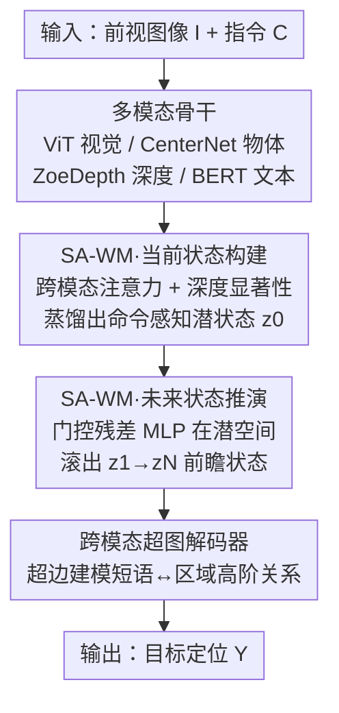

# Think Before You Drive: World Model-Inspired Multimodal Grounding

**会议**: CVPR 2026  
**论文**: [CVF Open Access](https://openaccess.thecvf.com/content/CVPR2026/html/Liao_Think_Before_You_Drive_World_Model-Inspired_Multimodal_Grounding_CVPR_2026_paper.html)  
**代码**: 无  
**领域**: 自动驾驶 / 视觉定位（Visual Grounding） / 世界模型  
**关键词**: 自动驾驶, 视觉定位, 世界模型, 深度先验, 超图

## 一句话总结
ThinkDeeper 把"世界模型"引入自动驾驶视觉定位：先把当前场景+指令蒸馏成一个命令感知的潜状态 $z_0$，再在潜空间里"预演"未来若干步状态 $z_1,\dots,z_N$，最后用跨模态超图解码器融合这些前瞻状态做定位，并配套发布了用 RAG+CoT 自动标注的 DrivePilot 数据集，在六个 benchmark 上刷到 SOTA，39ms 推理满足车载实时要求。

## 研究背景与动机
**领域现状**：自动驾驶里的视觉定位（Visual Grounding, VG）让车辆理解"在人行横道后并到白色 SUV 后面"这类自然语言指令，并在图像里框出目标。现有方法分两条路：传统 VG（一阶段/两阶段检测匹配）追求效率，近期则有人直接上 Qwen2-VL、MiniGPT-v2 这类大 VLM 拼语义推理。

**现有痛点**：传统 VG 方法是为高分辨率、受控数据集设计的，遇到真实路面的低光、运动模糊、快速变化场景就频频丢失关键线索；更要命的是它们普遍缺乏 3D 空间意识，分不清"前方那个骑车人"到底是迫在眉睫需要避让的、还是远处背景里随便一个骑车人。而大 VLM 虽然语义强，却带来海量数据需求、高算力和高延迟，根本塞不进车载实时系统。

**核心矛盾**：自动驾驶 VG 同时需要**空间感知 + 抗歧义鲁棒 + 实时高效**三者兼得，但现有方法要么牺牲鲁棒性（传统 VG），要么牺牲效率（大 VLM），没有一个方法同时满足。而且所有这些方法都只看"当下这一帧"，缺少对场景"接下来会怎么演化"的前瞻推理——而很多指令（"避开前面的骑车人""并到人行横道后的 SUV 后面"）本质上是关于未来时空状态的。

**本文目标**：设计一个 VG 模型，既有 3D 空间意识、对歧义指令鲁棒，又轻量到能实时车载运行。

**切入角度**：作者借鉴世界模型（World Model）的思想——智能体在决策前先在脑中"想象"未来状态、评估候选动作。把这套搬到 VG：在做定位决策**之前**，先推演场景未来若干步会怎么变，用这种前瞻视角消解歧义。同时引入单目深度作为 3D 先验，让纯视觉 pipeline 也能按"远近+相关性"排序实体，模仿人类的空间感知。

**核心 idea**：用"世界模型先在潜空间预演未来状态、再做定位"替代"只看当前帧直接定位"，并用超图解码器捕捉文本短语与空间区域之间的高阶关系。

## 方法详解

### 整体框架
ThinkDeeper 要解决的任务是：给一张前视图像 $I$ 和一条自然语言指令 $C$，框出指令所指的目标区域。它彻底抛弃了传统"先生成候选框再排序"的范式，整条 pipeline 分三块串行：**(i) 多模态骨干网络**把图像和指令编码成丰富向量；**(ii) Spatial-Aware World Model (SA-WM)** 是核心，先把当前场景蒸馏成一个滤掉背景杂波的紧凑潜状态 $z_0$，再迭代推演出未来潜状态序列 $z_1,\dots,z_N$；**(iii) 多模态解码器**用跨模态超图网络融合这些前瞻状态与多模态特征，最终定位出最匹配指令的目标。

### 关键设计

**1. Spatial-Aware World Model 当前状态构建：用深度先验把场景蒸馏成命令感知潜状态**

这一步针对的痛点是"模型分不清哪些区域和指令相关、哪些只是背景杂波，也没有 3D 距离感"。SA-WM 第一阶段构建一个紧凑潜状态 $z_0$ 来表示当前场景。给定视觉特征图 $F_v$ 和深度图 $F_d$，先用一组双向跨模态注意力把视觉、文本投影到统一语义空间，得到 text→visual 和 visual→text 的亲和传播 $A_t,A_v$ 及融合向量 $O_t,O_v$（公式 1-3）。关键在于显著性打分：对每个视觉 patch $k$ 算一个细粒度显著性分数 $s_k$，其中乘入了一个**从深度图导出的先验** $P(k)$，把注意力偏向"物理上合理的区域"（公式 4，⚠️ OCR 公式以原文为准）：

$$s_k = \frac{\sigma^2 \cdot \vec{a}^T P(k)}{\exp\!\big( (1-\textstyle\sum_j F_v(k,j)^T O_v(k,j))^2 / 2\mu \big)}$$

文本-视觉亲和低、或深度几何不一致的区域会被打低分、被抑制。把各层显著图收集成 $S$、做 Region Pooling 得到聚合图 $\tilde{S}$，再用它去 gate 物体向量 $F_o$：$z_0 = \phi_{\text{MLPs}}(F_o \odot \tilde{S} + F_o)$。这样得到的潜状态高亮了"命令相关的物体、几何、意图线索"，压掉了路边建筑这类无关元素。深度先验是让纯视觉模型也获得"近大远小、按距离排序"空间感的关键——消融里去掉它直接掉 6.3%。

**2. Future States Rollout：在潜空间预演未来，把"先想后定位"落地**

光理解当前帧不够，很多指令需要预判场景演化。第二阶段从 $z_0$ 出发，用一个**门控残差 MLP** 实现潜空间里的递归转移 $f_\theta$：$z_{k+1} = f_\theta(\{z_k\}_{k=1}^{N-1}, O_t)$，逐步产出未来潜状态序列 $Z_v=\{z_1,\dots,z_N\}$，其中 $O_t$ 提供语言条件并编码几何约束。要强调的是预测发生在**潜空间而非像素空间**——它不去生成未来的图像帧，而是捕捉对最终定位最有用的"前瞻显著性、几何感知注意力、意图线索"。这正是世界模型思想的精髓：决策前先在脑中 roll out 想象状态。这一设计的价值在消融里最突出——去掉未来推演（只用静态 $z_0$）暴跌 11.7%，证明静态推理不足以消解动态场景的空间歧义，前瞻推理是必需的。

**3. 跨模态超图解码器：用超边捕捉短语与区域的高阶关系**

普通图（GCN）只能建模成对（pairwise）关系，但"白色 SUV + 人行横道之后 + 多个相似车辆"这种指令涉及短语与多个空间区域之间的高阶依赖。解码器构建超图 $G=(V,E)$，节点 $V = Z_v \cup X_t$ 由 $N$ 个视觉节点（未来潜状态）和 $L$ 个文本节点组成。对每个视觉节点 $z_i$，按视觉-文本亲和 $A_{ij}=(\vec{a}^T[W_v z_i \| W_t x_j])$ 选 top-$k$ 文本节点组成一条超边 $E_j$，超边特征取其成员文本节点均值（公式 5）。超边权重 $h_{ij}$ 用 LeakyReLU 注意力算（公式 6），再通过超图卷积做节点间消息传递（公式 7）：

$$X^{(l+1)} = \phi\big(D_v^{-1/2} H W_e D_e^{-1} H^T D_v^{-1/2} X^{(l)} \Theta_g^l\big)$$

输出拆成视觉/文本节点特征，最后经多层动态注意力（MLD）输出对各视觉节点的概率分布 $P(Y|\tilde{X})$ 完成定位。消融里把超图换成标准 GCN 掉 8.9%（−6.85 IoU），印证了高阶关系建模优于成对更新。

**4. DrivePilot 数据集：RAG + CoT 自动标注的自动驾驶 VG benchmark**

现有 AD VG 数据集语义标注稀薄，难以支撑复杂关系推理。作者基于 nuScenes 构建 DrivePilot，覆盖新加坡/波士顿城市场景、多种天气和昼夜。标注由三步流水线完成：**Step-1 In-Context RAG**——从 1200 个精选 nuScenes 样本建知识库，对新场景按余弦相似度检索 top-$k$ 相似情景作为 in-context 线索（如相似天气下的历史车辆行为），引导 Qwen2-VL 生成上下文感知的结构化标注，借此压制幻觉；**Step-2 CoT Prompting**——用零样本思维链让 Qwen2-VL 渐进式推理（先理解整体场景与空间关系、再分析指令关键词意图、再逐步考虑路况/车流密度/各 agent 行为），经 $h$ 轮迭代综合成连贯语义标注；**Step-3 人工交叉校验**——13 位领域专家（AV 安全工程师、持证教练、研究生）逐样本核对，与传感器真值和当地交规一致，不符触发重标。最终每条数据含一条平均 14.72 词的指令、配对的前视图+BEV 图、14 个语义维度（天气、信号灯状态、情绪上下文等）的 LLM 标注、以及精确目标位置。

## 实验关键数据

### 主实验
六个 benchmark（Talk2Car、MoCAD、DrivePilot + RefCOCO/+/g），统一用 IoU@0.5 指标。ThinkDeeper 全面超越 SOTA：

| 数据集 / 设置 | 指标 | ThinkDeeper | 最佳基线 | 提升 |
|--------|------|------|----------|------|
| Talk2Car (test) | IoU@0.5 | 76.64 | UNINEXT 70.87 | +7.9% |
| DrivePilot (test) | IoU@0.5 | 75.76 | CAVG | +2.7% |
| MoCAD | IoU@0.5 | — | — | 误差↓≥3.8% |
| Corner-case 集 | IoU@0.5 | — | UNINEXT | +7.2% |
| Long-text 集 | IoU@0.5 | 74.08 | VLTVG 68.80 | +5.28（绝对） |
| RefCOCO/+/g | IoU@0.5 | SOTA | — | +2.9%/3.0%/3.5% |

值得注意的是大 VLM（MiniGPT-v2、LLaVA-NeXT、Qwen2.5-VL）在这些定位任务上反而落后 SOTA 15-25 分——它们缺乏高精度定位的归纳偏置，也用不上 3D 深度线索消歧。即便只用 50% 训练数据，ThinkDeeper 在多数测试集上仍能击败用全量数据训练的多数基线。

### 效率对比（Talk2Car，A40 GPU）

| 方法 | 骨干 | 参数量 | 推理时间 | IoU@0.5 |
|------|------|--------|---------|---------|
| VLTVG | ResNet-101 | 152.18M | 55ms | 69.72 |
| CAVG | ViT | 172.78M | 69ms | 74.50 |
| **ThinkDeeper** | ViT | **135.81M** | **39ms** | **78.93** |

参数更少、最快（39ms），精度还最高，满足 L3 自动驾驶（20-30 TOPS）的算力要求。（注：正文一处写 78.64、表格写 78.93，⚠️ 以原文为准。）

### 消融实验（DrivePilot）

| 配置 | IoU@0.5 | 说明 |
|------|---------|------|
| E 完整模型 | 77.27 | 参考基线 |
| A w/o 深度先验 | 72.33 | 去掉 Vision Encoder 深度先验，掉 6.3% |
| B w/o 未来推演 | 68.27 | 只用静态 $z_0$，暴跌 11.7% |
| C w/o 整个 SA-WM | 62.70 | 灾难性崩塌 −14.57 |
| D 超图→GCN | 70.42 | 换成成对图卷积，掉 8.9%（−6.85） |

### 关键发现
- **SA-WM 是命脉**：整体去掉直接崩 14.57 分，证明"蒸馏命令感知当前状态 + 推演未来状态"是鲁棒定位不可或缺的中间线索。
- **未来推演 > 深度先验 > 超图**：三个贡献里，去掉未来 rollout 掉得最狠（11.7%），说明"先想后定位"的前瞻推理价值高于单纯加深度或换图结构。
- **大 VLM 不适合精定位**：通用 VLM 在 VG 上反而大幅落后，印证了为 AD 实时定位定制轻量空间感知世界模型的必要性。
- **数据高效**：50%/75% 数据下仍打败多数全量基线，corner-case 上尤其稳。

## 亮点与洞察
- **把"世界模型"从规划/仿真迁到 VG 是真新颖**：作者明确是第一个把 world model 用于 AD 视觉定位的工作。关键巧思是"预测在潜空间而非像素空间"——不去生成未来帧（贵且没必要），只 roll out 对定位有用的潜状态，既保留前瞻性又保住实时性。
- **深度显著性门控的工程感**：用单目深度（ZoeDepth）导出空间先验 $P(k)$ 去 gate 注意力，让纯视觉 pipeline 几乎免费获得 3D 排序能力，这个 trick 可迁移到任何需要"按物理距离筛区域"的纯视觉任务。
- **超图 vs 普通图**：当一句指令同时绑定多个空间区域时，超边天然能把"一个短语连一组区域"建模成一条边，比 pairwise GCN 更贴合多 agent 交通语义——这是个可复用的关系建模视角。
- **RAG+CoT+人工三段标注流水线**：用检索压幻觉、CoT 提语义深度、再用 13 位专家按交规校验，是低成本造高质量 AD VG 标注的可复制范式。

## 局限与展望
- **依赖外部专家网络**：pipeline 串了 CenterNet、ZoeDepth 等多个预训练专家网络，深度估计或物体检测在极端天气下失准时，误差会顺着传到 SA-WM。
- **未来推演步数 $N$ 的设定**：论文用固定步数 roll out 未来状态，但不同场景"需要看多远"应是自适应的，固定 $N$ 可能在静态场景浪费算力、在高动态场景前瞻不足。
- **缺真值监督的"未来"**：未来潜状态没有显式的未来帧真值监督，全靠端到端定位 loss 反传隐式学习，其"想象"是否真对应物理演化、还是只是有利于定位的捷径特征，论文未深究。
- **OCR 公式可信度**：显著性打分公式（4）较复杂，建议对照原文核对。

## 相关工作与启发
- **vs 传统 VG（VLTVG / TransVG / UNINEXT）**：它们只看当前帧、缺 3D 空间感与前瞻推理；本文用 SA-WM 加深度先验+未来推演，在 corner-case/long-text 上拉开 7-12 分。
- **vs 大 VLM（Qwen2.5-VL / MiniGPT-v2 / LLaVA-NeXT）**：大 VLM 语义强但定位精度差、延迟高；本文以 135.81M 参数、39ms 实现远超它们的精度，证明 AD VG 更需要定制的轻量空间归纳偏置而非堆大模型。
- **vs AD 里的世界模型（Drive-WM / DriveDreamer / Vista）**：那些 world model 用于端到端规划、场景仿真或表示学习（多在像素/视频层面生成未来）；本文首次把 world model 用于 VG，且只在潜空间预演，定位场景独特。

## 评分
- 新颖性: ⭐⭐⭐⭐⭐ 首个把世界模型引入 AD 视觉定位，"潜空间预演未来+超图解码"的组合有原创性。
- 实验充分度: ⭐⭐⭐⭐⭐ 六 benchmark + corner-case/long-text 专项 + 效率/数据效率/消融/超参，覆盖很全。
- 写作质量: ⭐⭐⭐⭐ 动机清晰、图示充分；个别数字（78.64/78.93）和 OCR 公式略有出入。
- 价值: ⭐⭐⭐⭐⭐ 兼顾精度与 39ms 实时、附带高质量 DrivePilot 数据集，对车载 VG 落地实用价值高。

<!-- RELATED:START -->

## 相关论文

- [\[CVPR 2026\] Look Before You Fuse: 2D-Guided Cross-Modal Alignment for Robust 3D Detection](look_before_you_fuse_2d-guided_cross-modal_alignment_for_robust_3d_detection.md)
- [\[AAAI 2026\] Drive As You Like: Strategy-Level Motion Planning Based on A Multi-Head Diffusion Model](../../AAAI2026/autonomous_driving/drive_as_you_like_strategy-level_motion_planning_based_on_a_multi-head_diffusion.md)
- [\[CVPR 2026\] SparseWorld-TC: Trajectory-Conditioned Sparse Occupancy World Model](sparseworld_tc_trajectory_conditioned_sparse_occupancy_world_model.md)
- [\[CVPR 2026\] Drive My Way: Preference Alignment of Vision-Language-Action Model for Personalized Driving](drive_my_way_preference_alignment_of_vision-language-action_model_for_personaliz.md)
- [\[CVPR 2026\] SimScale: Learning to Drive via Real-World Simulation at Scale](simscale_learning_to_drive_via_real-world_simulation_at_scale.md)

<!-- RELATED:END -->
