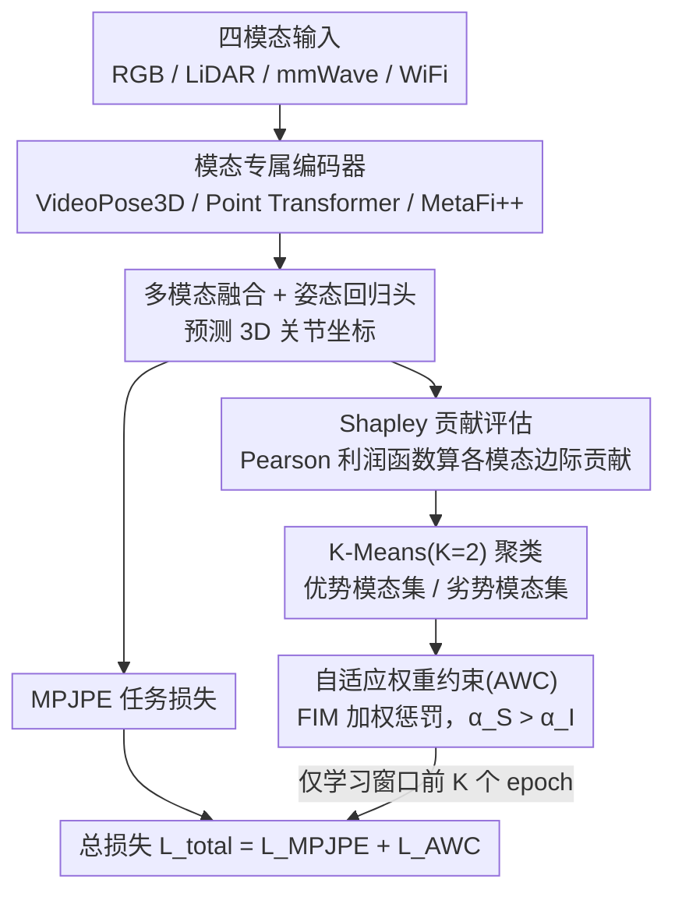

# Towards Balanced Multi-Modal Learning in 3D Human Pose Estimation

**会议**: CVPR2026  
**arXiv**: [2501.05264](https://arxiv.org/abs/2501.05264)  
**代码**: [MICLAB-BUPT/AWC](https://github.com/MICLAB-BUPT/AWC)  
**领域**: 自动驾驶  
**关键词**: 3D human pose estimation, multi-modal learning, modality imbalance, Shapley value, Fisher Information Matrix

## 一句话总结

提出基于 Shapley 值的模态贡献评估和 Fisher 信息矩阵加权的自适应权重约束（AWC）正则化，解决多模态（RGB/LiDAR/mmWave/WiFi）3D 人体姿态估计中的模态不平衡问题，无需引入额外可学习参数即可实现平衡优化。

## 研究背景与动机

### 问题背景

3D 人体姿态估计（3D HPE）是计算机视觉的重要任务，广泛用于人机交互、动作评估和康复监控。传统方法主要依赖 RGB 图像，但在遮挡和隐私场景下受限。因此，融合非侵入式传感器（LiDAR、mmWave 雷达、WiFi）的多模态方法成为趋势。

### 核心动机

多模态联合训练存在**模态不平衡**问题：优势模态（如 RGB、LiDAR）在训练早期快速收敛，抑制了弱势模态（mmWave、WiFi）的优化。现有平衡方法存在三大缺陷：

**任务适配性差**：G-Blending、OGM-GE 等方法基于交叉熵损失或显式类别归属设计，仅适用于分类任务，无法直接迁移到回归任务

**引入额外参数**：MMPareto 等方法需要单模态辅助头，增加模型复杂度

**忽视弱模态过拟合**：仅调节优势模态梯度，未考虑弱模态对噪声信号的过拟合风险

作者的关键观察：在回归任务中，弱模态（mmWave、WiFi）的预测标准差趋近于零（预测坍塌为常数值），若用 MSE/MAE 作为 Shapley 利润函数会产生误导性评估——常数预测反而被误判为高贡献。

## 方法详解

### 整体框架

模型用模态专属编码器分别提特征（RGB 用 VideoPose3D、LiDAR/mmWave 用 Point Transformer、WiFi 用 MetaFi++），经多模态融合后由姿态回归头预测 3D 关节坐标。在此之上挂两个组件来治"模态不平衡"：一个 Shapley 模态贡献评估模块，用 Shapley 值 + Pearson 相关系数量化每个模态的贡献、检测谁强谁弱；一个自适应权重约束(AWC)正则化，用 Fisher 信息矩阵给参数重要性加权，在训练早期的"学习窗口"里平衡各模态的学习速度。

### 关键设计

**1. 回归任务的 Shapley 贡献评估：把利润函数从 MSE 换成 Pearson**

直接套用分类任务的模态贡献评估会在回归里翻车。对特征拼接融合，最终预测可分解为各模态预测之和 $\hat{y} = \hat{y}^R + \hat{y}^L + \hat{y}^M + \hat{y}^W$；分类中弱模态 logits 接近均匀分布，加减它对 softmax 影响极小，所以交叉熵能当 Shapley 的利润函数。但作者观察到，回归里弱模态(mmWave、WiFi)的预测会坡缩成近似常数（标准差趋近于零），此时用 MSE 评估反而偏向大输出模态、把常数预测误判成高贡献。解决办法是改用 Pearson 相关系数当利润函数：

$$s(y, \hat{y}) = \sum_{i=1}^{j \times 3} \rho(y_i, \hat{y}_i), \quad \rho(y_i, \hat{y}_i) = \frac{\text{cov}(y_i, \hat{y}_i)}{\sigma_{y_i} \cdot \sigma_{\hat{y}_i}}$$

Pearson 衡量的是预测与真值的线性相关性而非数值距离，天然免疫常数偏置和尺度差异——当弱模态产出常数预测时其相关系数接近零，准确反映它信息贫乏。缺失模态的特征用零填充，Shapley 值遍历所有模态子集组合算出各模态的边际贡献。

**2. 自适应权重约束(AWC)：用 Fisher 信息矩阵给优势模态"踩刹车"**

知道谁强谁弱之后，还得有手段抑制优势模态过快收敛、同时别让弱模态过拟合噪声。AWC 先把 4 个模态的 Shapley 分数做 K-Means(K=2)聚类，高分簇为优势模态集 $\mathcal{M}_\mathcal{S}$、低分簇为劣势模态集 $\mathcal{M}_\mathcal{I}$，分别给不同正则化系数 $\alpha_\mathcal{S}$ 和 $\alpha_\mathcal{I}$。正则项用 Fisher 信息矩阵(FIM)对角线对参数偏离量加权惩罚：

$$\mathcal{L}_{AWC} = \sum_{m \in \mathcal{M}} \left[\alpha_\mathcal{S} \cdot \mathbf{1}_{\{m \in \mathcal{M}_\mathcal{S}\}} + \alpha_\mathcal{I} \cdot \mathbf{1}_{\{m \in \mathcal{M}_\mathcal{I}\}}\right] \cdot \mathcal{L}_W^m, \quad \mathcal{L}_W^m = \sum_i \frac{[\mathcal{I}_\mathcal{D}]_{ii} (\theta_{t,i}^m - \theta_{0,i}^{m,*})^2}{2}$$

巧妙之处在于 FIM 对角线 $[\mathcal{I}]_{ii}$（梯度平方均值）本身就度量了参数的经验重要性：优势模态训练初期梯度大、FIM 高，参数偏移被惩罚得更重，自然减速；弱模态梯度小、FIM 低，惩罚轻、得到保护。再配上 $\alpha_\mathcal{S} > \alpha_\mathcal{I}$，就同时实现了"压优势 + 护弱势"，且全程不引入任何额外可学习参数。

### 损失函数与训练策略

- **总损失**：$\mathcal{L}_{total} = \mathcal{L}_{MPJPE} + \mathcal{L}_{AWC}$（仅在学习窗口内）
- **学习窗口**：前 $K$ 个 epoch 施加 AWC 正则化，之后仅用任务损失。依据"关键学习期"理论——大部分任务相关信息在训练早期被获取
- **FIM 更新频率**：每个 epoch 开头重新计算一次
- **训练设置**：Adam 优化器，lr=1e-3，batch=192，50 epoch，lr 在第 30 epoch 衰减 10 倍

## 实验关键数据

### 主实验：与现有平衡方法对比（MM-Fi 数据集）

| 方法 | 融合策略 | P1 MPJPE↓ | P1 PA-MPJPE↓ | P3 MPJPE↓ | P3 PA-MPJPE↓ |
|------|----------|-----------|-------------|-----------|-------------|
| MM-Fi baseline | - | 72.90 | 47.70 | 89.80 | 63.20 |
| Concatenation | concat | 53.87 | 35.09 | 48.17 | 32.18 |
| + G-Blending | concat | 58.40 | 37.20 | 53.13 | 33.28 |
| + OGM-GE | concat | 55.51 | 35.92 | 51.68 | 32.84 |
| + AGM | concat | 55.80 | 38.10 | 53.88 | 36.30 |
| + Modality-level | concat | 53.24 | 34.81 | 53.98 | 31.85 |
| **+ Ours** | **concat** | **51.16** | **34.46** | **47.55** | **31.79** |
| Attention | attn | 53.35 | 35.20 | 49.97 | 32.33 |
| **+ Ours** | **attn** | **51.29** | **34.65** | **49.08** | **32.10** |

关键发现：(1) 本方法在 concat 融合下 P1 MPJPE 降低 2.71mm；(2) G-Blending 和 AGM 反而劣于 baseline，说明分类任务的平衡策略迁移到回归会适得其反；(3) 方法在所有协议和融合策略下均有效。

### 消融实验：AWC 超参数敏感性（Protocol 1, Concat）

| $\alpha_\mathcal{S}$ | $\alpha_\mathcal{I}$ | MPJPE↓ | PA-MPJPE↓ |
|------|------|--------|-----------|
| - (baseline) | - | 53.87 | 35.09 |
| 0 | 10k | 52.92 (-0.95) | 34.94 (-0.15) |
| 10k | 0 | 52.09 (-1.78) | 34.81 (-0.28) |
| 10k | 10k | 51.88 (-1.99) | 34.84 (-0.25) |
| **20k** | **10k** | **51.16 (-2.71)** | **34.46 (-0.63)** |
| 20k | 20k | 51.69 (-2.18) | 34.84 (-0.25) |
| 30k | 20k | 51.34 (-2.53) | 34.56 (-0.53) |

关键发现：(1) 最佳配置为 $\alpha_\mathcal{S}=20k, \alpha_\mathcal{I}=10k$，即优势模态的正则化强度为劣势模态的 2 倍；(2) 仅约束优势模态（$\alpha_\mathcal{I}=0$）效果不如两端都约束，说明弱模态也需要适度防止过拟合；(3) 学习窗口 $K=20$（占总 epoch 的 40%）为最优。

### 模态融合分析

| 模态组合 | MPJPE↓ | PA-MPJPE↓ |
|---------|--------|-----------|
| RGB only | 63.61 | 35.75 |
| LiDAR only | 66.95 | 45.70 |
| mmWave only | 102.89 | 52.21 |
| WiFi only | 166.92 | 97.39 |
| R+L | 52.93 | 34.96 |
| R+L+M+W（四模态） | 53.87 | 35.09 |

**重要结论**：四模态融合（53.87）反而劣于 RGB+LiDAR 双模态（52.93），直接证明了模态竞争的存在——弱模态不仅未提供增益，反而干扰了强模态的学习。

### 计算开销

Shapley 贡献评估的开销极低：在 Concat/MLP 融合下仅占训练时间的 0.41%–0.93%；Attention 融合下约 3.5%–5.4%，不构成瓶颈。

## 亮点与洞察

1. **回归任务 Shapley 值的关键洞察**：弱模态在回归中预测坍塌为常数（标准差≈0），MSE/MAE 会误判其贡献，Pearson 相关系数是更合理的利润函数——这个发现对所有回归类多模态任务都有指导价值
2. **FIM 作为自适应正则化权重**：FIM 天然捕捉了参数重要性的模态差异——优势模态梯度大→FIM 高→惩罚重→减速；弱模态梯度小→FIM 低→惩罚轻→保护，无需人工设计不同模态的调节策略
3. **零额外参数**：不同于 MMPareto 等需要辅助单模态头的方法，AWC 完全基于已有参数的统计量（梯度平方均值），优雅且轻量
4. **模态竞争的直接证据**：四模态融合 MPJPE 劣于双模态，是多模态学习中"more is not always better"的有力实证

## 局限性与可改进方向

1. **仅在 MM-Fi 单一数据集验证**：缺乏在更多数据集和场景下的泛化性验证
2. **模态固定为四种**：模态数量扩展性未验证，Shapley 值计算复杂度随模态数呈阶乘增长，超过 5-6 个模态可能需要近似算法
3. **学习窗口 K 需手动调参**：K=20 对 50 epoch 是最优的，但不同任务/数据规模下的自适应 K 选取机制缺失
4. **K-Means 聚类硬划分**：二分（优势/劣势）过于粗糙，更细粒度的连续分组可能更优
5. **弱模态本身的提升空间**：当前方法缓解了弱模态被抑制的问题，但未从特征提取层面增强弱模态的表达能力

## 相关工作与启发

- **模态不平衡理论**：OGM-GE (CVPR 2022)、G-Blending (ICLR 2020) 开创性地揭示了多模态竞争问题，但局限于分类任务
- **Shapley 值在多模态中的应用**：SHAPE (IJCAI 2022) 首次引入 Shapley 值评估模态贡献，本文将其扩展到回归场景
- **Fisher 信息与持续学习**：AWC 正则化的设计灵感来自 EWC（Elastic Weight Consolidation），在持续学习中用 FIM 保护重要参数，本文将其反转——用 FIM 约束优势模态的过快学习
- **启发**：Pearson 相关系数替代 MSE 的思路可推广至其他回归类多模态任务（如深度估计、光流）；FIM 自适应正则化可作为即插即用模块

## 评分

| 维度 | 分数 (1-10) | 说明 |
|------|------------|------|
| 创新性 | 7 | Shapley+Pearson 的回归适配和 FIM 自适应正则化有新意，但核心组件均基于已有理论 |
| 实验充分性 | 6 | 单一数据集（MM-Fi），但消融全面 |
| 写作质量 | 7 | 分析透彻，动机阐述清晰，公式推导完整 |
| 实用价值 | 7 | 无额外参数、即插即用，对多模态回归任务有通用参考价值 |
| **总分** | **7** | 方法设计精巧，但泛化验证不足 |

<!-- RELATED:START -->

## 相关论文

- [\[CVPR 2026\] EMDUL: Expanding mmWave Datasets for Human Pose Estimation with Unlabeled Data and LiDAR Datasets](expanding_mmwave_datasets_for_human_pose_estimation_with_unlabeled_data_and_lida.md)
- [\[CVPR 2026\] VIRD: View-Invariant Representation through Dual-Axis Transformation for Cross-View Pose Estimation](vird_view-invariant_representation_through_dual-axis_transformation_for_cross-vi.md)
- [\[CVPR 2026\] LA-Pose: Latent Action Pretraining Meets Pose Estimation](la-pose_latent_action_pretraining_meets_pose_estimation.md)
- [\[CVPR 2026\] PTC-Depth: Pose-Refined Monocular Depth Estimation with Temporal Consistency](ptc-depth_pose-refined_monocular_depth_estimation_with_temporal_consistency.md)
- [\[CVPR 2026\] Gau-Occ: Geometry-Completed Gaussians for Multi-Modal 3D Occupancy Prediction](gau-occ_geometry-completed_gaussians_for_multi-modal_3d_occupancy_prediction.md)

<!-- RELATED:END -->
