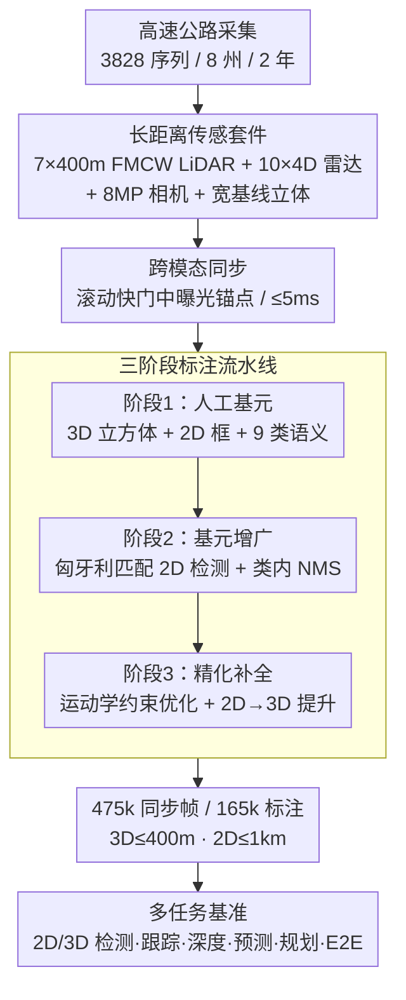

# TruckDrive: Long-Range Autonomous Highway Driving Dataset

**会议**: CVPR 2026  
**论文**: [CVF Open Access](https://openaccess.thecvf.com/content/CVPR2026/html/Ghilotti_TruckDrive_Long-Range_Autonomous_Highway_Driving_Dataset_CVPR_2026_paper.html)  
**代码**: light.princeton.edu/TruckDrive（数据集主页 + devkit，非 GitHub 代码）  
**领域**: 自动驾驶 / 多模态感知数据集  
**关键词**: 长距离感知、高速公路自动驾驶、重型卡车、FMCW LiDAR、多模态基准

## 一句话总结
TruckDrive 是首个面向重型卡车高速公路场景、专为长距离感知设计的大规模多模态数据集——用 7 路 400m FMCW LiDAR + 10 路 4D 雷达 + 8MP 环视相机采集 475k 同步帧（165k 人工标注），把 3D 标注推到 400m、2D 标注推到 1km，并实证现有 SOTA 在 150m 之外性能崩塌（3D 任务掉点 31%–99%），暴露出城市数据集训练的架构无法迁移到长距离高速场景这一系统性缺口。

## 研究背景与动机
**领域现状**：过去十年自动驾驶的进步几乎完全由数据集驱动——KITTI、Cityscapes、nuScenes、Waymo、Argoverse 等基准定义了感知、预测、规划的研究范式。但这些数据集压倒性地聚焦城市、低速场景，标注范围通常只到 ego 车前方 70–100m。

**现有痛点**：城市短距离感知对乘用车够用，因为低速把有限的空间范围折算成了足够的时间预见量（5–10s 规划窗口）。但对高速公路上的重型卡车完全不成立：满载卡车 120 km/h 下需要 150–200m 才能刹停，等价于 4.5–6s 的前视需求。而 80m 感知范围只给 2.4s 预见、100m 也仅 3.0s——这点时间全被传感和规划延迟吃光，留给制动执行的安全裕度被压成负数，变道/汇入这类策略性机动直接变得不可行。换句话说，城市数据集的短距离偏置让整个领域的模型都"看不远"。

**核心矛盾**：长距离感知本身是非平凡的工程难题。BEV 和稠密体素表示的计算/内存随距离呈二次方增长，远处物体的信噪比又因传感器分辨率和大气衰减急剧下降；而长距离监督信号本身稀疏、标定漂移和时间不确定性更严重。同时城市短距离基准已经饱和（提交数下降、性能增益趋平），继续刷 100m 内的榜单对解决卡车高速安全没有帮助。

**本文目标**：不是提出新模型，而是**造一个能逼出长距离问题的数据集和基准**——把有效感知范围相对城市基准扩大 5 倍，覆盖高速、长序列、重卡专属的驾驶模式，并系统量化现有方法在长距离下到底差多少、差在哪。

**切入角度**：作者认为长距离能力的瓶颈首先是"没有合适的数据"——既没有 400m 的真值标注、也没有专为远距离设计的传感器原始流。只要把传感与标注这两件事做到位，就能把"长距离泛化"这个隐性难题显式化，给社区一个可比较、可优化的靶子。

**核心 idea**：用一套专为长距离打造的多模态传感套件（远程 FMCW LiDAR + 4D 雷达 + 高分辨率/长焦相机）+ 一条人工+自动混合的三阶段标注流水线，构建覆盖 400m 3D / 1km 2D 的高速公路基准，并把它当"压力测试台"暴露现有架构的长距离失效。

## 方法详解

### 整体框架
TruckDrive 的"方法"是一条数据集生产管线：**采集域设计 → 长距离传感套件 → 跨模态同步 → 三阶段标注（人工基元 → 基元增广 → 精化补全）→ 多任务基准评测**。整体逻辑是：先用专门的传感硬件把"看得远、测得准"的原始信号采下来（475k 同步帧、跨 8 个州 2 年采集），再用一条混合标注流水线把昂贵的人工标注通过几何投影 + 运动学约束放大成稠密的 400m 3D / 1km 2D 真值，最后在这套真值上训练并评测 8 类驾驶任务的 SOTA 模型，量化它们在长距离的崩塌。

下图给出从采集到基准的主干流向，其中"长距离传感套件""跨模态同步""三阶段标注"是本文真正的贡献节点：

### 关键设计

**1. 长距离多模态传感套件：用对的硬件把感知范围拉到 400m / 1km**

城市数据集"看不远"的根因在硬件：64 线 LiDAR 在 200m 外点云稀疏到无法形成物体，低分辨率宽 FOV 相机让远处目标变成亚像素。TruckDrive 直接重做传感配置：7 路 AEVA Aeries II 的 4D **FMCW LiDAR**（可测 400m 并逐点输出径向速度）+ 3 路 Ouster 短程 LiDAR（补盲区）+ 10 路 Continental ARS540 **4D 雷达** + 11–15 路 8MP RCCB 相机（9 短中焦 + 1–3 长焦立体），共 37 个异构传感器，是第二丰富数据集（18 个）的两倍。FMCW 的关键优势是每个点都带瞬时径向速度 $v_r$，由多普勒相移 $\Delta\phi$ 直接解出：

$$v_r = \Delta\phi \cdot \frac{\lambda}{4\pi}\cos\theta$$

其中 $\lambda$ 是波长、$\theta$ 是入射角。这让远处运动物体不靠多帧关联就能直接判断动静，也为后面"用 FMCW 过滤动态点构建稠密深度真值"打下基础。8MP 相机则保证 1km 外目标仍可分辨（城市基准里它们早已亚像素化），所以 2D 标注才能推到 1km。位姿上用 2 路 GNSS + 4 路 IMU 的后处理动态学（PPK）管线得到全局位姿，失败帧用 LiDAR SLAM 补，保证 400m 标注所需的高精定位。

**2. 跨模态同步：用图像中曝光时刻当锚点消除滚动快门系统偏移**

高速场景下同步误差会被速度放大——130 km/h 时 5ms 误差就是 18cm 的物体位移，对 400m 标注是致命的。难点在于 8MP 相机是**滚动快门**（逐行读出），如果把其他模态对齐到图像起始时刻，会在不同图像行之间引入系统性时间偏移。TruckDrive 的做法是把参考时间戳定义在**图像中曝光时刻**，再把 LiDAR 对齐到这个锚点：

$$t_{ref} = t^{start}_{img} + \tfrac{1}{2}T_{readout}, \qquad |t_{LiDAR} - t_{ref}| \le 5\,\text{ms}$$

其中读出时间 $T_{readout}$ 典型值 54ms。各传感器组触发到统一时钟、组内单元间不超过 5ms，跨模态触发再做时间对齐实现近同时采集。这个看似细节的设计是 475k 帧"跨模态同步时间戳"质量的保证，也是高速长距离真值可信的前提。

**3. 三阶段标注流水线：用几何投影 + 运动学约束把稀疏人工标注放大成稠密 400m 真值**

400m 范围逐帧手标 3D 立方体成本不可承受，本文用一条"人工种子 + 自动放大"的三阶段流水线解决：

- **阶段1（人工基元）**：标注员只在 2000+ 个含复杂交互/边缘情况的精选序列上手标 3D 立方体和 2D 框（带遮挡/截断参数），并赋 85 个细类、归并为 9 大类（交通标志、乘用车、道路障碍物、行人、半挂卡车、两轮车、应急车辆、各尺寸车辆等）。3D 框通过反复投影到相机来减小偏移、消除"鬼影"。
- **阶段2（基元增广）**：把初始 3D 立方体投影到所有相机视图，与 2D 检测器的检测结果用**匈牙利算法**做二分匹配（以 IoU 为代价矩阵）；无对应的 2D 检测回退到几何投影或已有 2D 标签，并做类内 NMS 提升高置信检测，产出匹配好的 3D 检测 + 仅 2D 候选。
- **阶段3（精化补全）**：把匹配的 3D 标注变换到全局坐标系，对轨迹做**运动学约束优化**，强制物理合理的运动、抑制偏航抖动。优化目标融合位置/朝向/尺寸/平滑四项：

$$\min_{\{s^k_t, d^k_t\}}\sum_{t\in T_k}\big(\lambda_o L^o_t + \lambda_\psi L^\psi_t + \lambda_d L^d_t + \lambda_{smooth} L^{sm}_t\big)$$

各项用 Huber 鲁棒损失 $\rho(\cdot)$ 度量中心位置、角度差、尺寸残差，平滑项 $L^{sm}_t = \|\Delta v^k_t\|^2_2 + \|\Delta^2\psi^k_t\|^2_2$ 约束速度一阶差和朝向二阶差；整体服从**单车（unicycle）运动模型**约束（状态 $s^k_t=(x,y,\psi,v,\omega)$）。短缺帧用线性/球面插值（位置线性、朝向 slerp）初始化后再联合精化。同时把阶段2 的仅 2D 候选**提升到 3D**：对每个 3D 假设投影八个角点得轴对齐 2D 框 $\hat b_c(p)$，只保留与阶段2 检测 IoU≥0.3 的相机视图，再优化使投影框拟合检测：

$$\sum_{c\in C}\big[\lambda_{iou}(1-\text{IoU}(\hat b_c(p), b_c)) + \lambda_g(z_{min}(p)-z_g)^2\big]$$

其中 $z_g$ 是累积 LiDAR 地图给出的局部地面高度（约束物体落在地面上）。最后用离线跟踪器关联、与平滑后的真值框合并形成最终标注集。这条流水线是把"少量人工种子"放大成"165k 稠密 400m 标注"的核心，也是数据集得以低成本规模化的关键。

### 损失函数 / 训练策略
本文是数据集论文，无统一训练目标；上文阶段3 的运动学优化（式中四项加权 + 单车模型约束）和 2D→3D 提升优化（IoU + 地面约束）是标注流水线内部的优化目标，超参 $\lambda_o,\lambda_\psi,\lambda_d,\lambda_{smooth},\lambda_{iou},\lambda_g$ 控制各项权重，鲁棒损失尺度为 $\delta_\rho$。基准评测统一用 140k 训练 / 25k 验证划分，所有被测模型都在 TruckDrive 上从头训练，遵循各任务标准指标与协议。

## 实验关键数据

实验的核心不是"我们的方法多好"，而是"现有 SOTA 在长距离有多差"。所有模型都在 TruckDrive 上训练，按距离分箱评测：短（SR, 0–50m）、中（MR, 50–150m）、长（LR, 150–250m）、超长（UR, 250m+）。

### 主实验

**2D 目标检测（mAP，距离分箱）**——8MP 高分辨率让 2D 检测器在 1km 仍可工作，但超长距离全线崩溃：

| 方法 | mAP | SR(0–50m) | MR(50–150m) | LR(150–250m) | UR(250m+) |
|------|-----|-----------|-------------|--------------|-----------|
| DETR | 12.7% | 41.2% | 24.7% | 8.9% | 1.0% |
| ViTDet | 27.3% | 58.3% | 51.8% | 33.9% | 3.3% |
| YOLO11x | 28.9% | 36.3% | 29.4% | 8.2% | 2.0% |
| DINO | 37.8% | 63.9% | 54.6% | 43.2% | **15.3%** |

**3D 目标检测（mAP）**——纯相机方法（Far3D）在长距离几乎归零，融合方法也大幅掉点：

| 方法 | 模态 | Full | SR | MR | LR(150–250m) |
|------|------|------|------|------|------|
| Far3D | C | 14.04% | 35.54% | 11.07% | **0.33%** |
| TransFusion-L | L | 25.24% | 30.12% | 22.25% | 22.25% |
| BEVFusion | L+C | 26.45% | 32.32% | 22.77% | 22.69% |

相机方法在 LR 段的 3D mAP 相对崩塌幅度高达 **99%**（Far3D 35.54%→0.33%），印证"城市架构无法迁移到长距离"。

**3D 多目标跟踪**——长时序 + 高相对速度让关联崩溃，平均 AMOTA 仅约 10%：

| 方法 | 模态 | AMOTA↑ | AMOTP↓ | Recall↑ |
|------|------|--------|--------|---------|
| MUTR3D | Query | 6.1% | 79.0% | 11.4% |
| Immortal Tracker | 3D Box | 12.8% | 77.2% | 20.7% |
| CenterPoint | 3D Box | 13.0% | 76.9% | 21.5% |

**深度估计（距离分箱 MAE，米）**——立体方法 BridgeDepth 从 SR 的 2.53m 暴涨到 UR 的 69.10m（约 8× 恶化），超长距离深度基本失效：

| 任务/方法 | SR↓ | MR↓ | LR↓ | UR↓ |
|-----------|-----|-----|-----|-----|
| 环视 MapAnything | 5.05 | 16.73 | 39.19 | 121.15 |
| 立体 BridgeDepth | 2.53 | 8.34 | 20.21 | 69.10 |
| 单目 UniDepthv2(单视) | 2.66 | 10.63 | 28.37 | 102.58 |

**LiDAR 预测 / 运动分割 / E2E 规划**：LiDAR 预测（LRS4Fusion 融合最好，1s CD 15.82）、移动物体分割 4DMOS 在 LR 段 IoU 仅 5.6%（FULL 21.6%），E2E 规划 UniAD 平均 L2 误差 2.00m（3 步已达 1.71m），均显示长距离失效。

### 消融实验

本文无传统消融，但**距离分箱本身就是最有信息量的"消融"**——它把"模型在哪个距离段失效"显式拆开：

| 现象 | 关键指标 | 说明 |
|------|---------|------|
| 2D 检测 LR→UR | DINO 43.2%→15.3% | 8MP 让 UR 仍可检，但掉点剧烈 |
| 3D 检测纯相机 LR | Far3D 0.33% | 相机方法长距离 3D 近乎归零（相对掉 99%） |
| 立体深度 UR vs SR | BridgeDepth 2.53→69.10m | 8MP 被迫 3× 下采样致视差锐减，MAE 约 8× |
| 移动物体分割 LR | 4DMOS IoU 5.6% | 城市预训练 ckpt 跨域几乎失效（掉 83%） |
| BEVFusion 3D LR | 相对掉 31% | 稠密 BEV 扩大网格致二次内存增长或粗化 |

### 关键发现
- **失效随距离单调发生**：所有任务的得分都随距离单调下降，没有例外，说明这不是个别模型问题而是城市架构的系统性偏置。
- **稠密 BEV 表示是长距离的结构性瓶颈**：扩大范围要么用固定分辨率的更大网格（内存二次增长），要么用固定维度的更粗格子（小物体/远物体定位与关联恶化）——UniAD 把 250×250m ROI 压进 200×200 BEV 网格，粗到无法编码有用驾驶信息。
- **算力约束逼出下采样代价**：相机方法因算力把 8MP 原图 3× 下采样，远处视差锐减，这是立体深度长距离 8× 恶化的直接原因。
- **规划模块保守化**：规划模块因城市低速假设表现保守，UniAD 在 TruckDrive 上即使近期时间步 L2 误差也偏高，难以支撑高速安全裕度。

## 亮点与洞察
- **用"问题驱动"而非"模型驱动"立题**：不卷新架构，而是造一个能把"长距离泛化"这一隐性难题逼成显式榜单的数据集——这种"先定义问题再交给社区"的工作往往比单点 SOTA 更有长期价值。
- **FMCW 逐点测速是被低估的杀手锏**：每个 LiDAR 点直接带径向速度，既让远处动静判断不依赖多帧关联，又能在构建深度真值时直接过滤动态点累积稠密静态地图，一举两得。
- **滚动快门中曝光锚点同步**：把一个常被忽略的工程细节（逐行读出导致的系统时偏）显式建模到同步公式里，是高速长距离真值可信的关键，这个 trick 可直接迁移到任何含高分辨率滚动快门相机的多模态采集系统。
- **"人工种子 + 几何/运动学放大"的标注范式**：只在少量复杂序列上人工标，再靠匈牙利匹配 + 单车模型约束 + 2D→3D 提升把标注放大到 400m，给所有"标注成本随范围爆炸"的数据集工程提供了可复用模板。

## 局限与展望
- **作者承认的局限**：现有方法在该数据集上全面失效本身就是论文的"结论"，但论文未提出能闭合这一缺口的新架构——它把解法留给社区，自身只是基准。
- **基准评测深度有限**：每个任务只测 2–3 个 SOTA、无超参敏感性或多种子统计，距离分箱结论虽强但样本面偏窄；E2E 仅 UniAD 一个方法、且为适配长距离改了 backbone，可比性需谨慎。
- **重卡专属性带来的迁移问题**：数据强偏高速公路（3244/3828 序列）和重卡视角，夜间/恶劣天气占比低（夜间 367、雨雾各约 10%），对城市/乘用车场景的迁移价值有限。
- **改进思路**：作者明确指向三条研究方向——高效的长距离表示学习（替代二次增长的稠密 BEV）、稀疏/range-aware 的传感融合、长时序推理，以摆脱城市短距离先验。

## 相关工作与启发
- **vs nuScenes / Waymo / KITTI**：这些是城市、低速、≤100m 的"短距离基准"，已饱和；TruckDrive 把有效范围扩 5 倍（3D 400m / 2D 1km）、速度到 130 km/h、序列到 900m，本质是换了一个"长距离高速"的问题域，二者互补而非替代。
- **vs Argoverse V2（±250m）/ MAN TruckScenes（±226m）**：此前最远的几个基准也只到 220–250m，且 3D 标注密度在 80m 后骤降；TruckDrive 用 7 路 FMCW LiDAR 把 3D 真值密度平滑维持到 400m，并新增 4D 雷达 + 宽基线立体，是首个"专为长距离设计"而非"恰好稍远"的数据集。
- **vs ONCE（自监督）/ aiMotive（高速 12k 帧）**：前者推动减少标注依赖、后者尝试高速场景但标注量小；TruckDrive 同时提供 165k 标注 + 310k 无标注帧 + 全量原始流，覆盖监督/半监督/自监督全谱研究。

## 评分
- 新颖性: ⭐⭐⭐⭐⭐ 首个专为长距离高速重卡设计的多模态数据集，定义了一个被忽视但安全攸关的新问题域。
- 实验充分度: ⭐⭐⭐⭐ 覆盖 8 类驾驶任务、距离分箱评测信息量大，但每任务方法数偏少、无统计显著性分析。
- 写作质量: ⭐⭐⭐⭐⭐ 动机推导（刹车距离→预见时间→感知范围）严密，传感/同步/标注三大设计讲得清晰可复现。
- 价值: ⭐⭐⭐⭐⭐ 暴露城市架构长距离崩塌的系统性缺口，为 range-aware 高效感知提供基准与原始数据，长期价值高。

<!-- RELATED:START -->

## 相关论文

- [\[CVPR 2026\] WOD-E2E: Waymo Open Dataset for End-to-End Driving in Challenging Long-tail Scenarios](wod-e2e_waymo_open_dataset_for_end-to-end_driving_in_challenging_long-tail_scena.md)
- [\[CVPR 2026\] FoSS: Modeling Long-Range Dependencies and Multimodal Uncertainty in Trajectory Prediction via Fourier–State Space Integration](foss_modeling_long_range_dependencies_and_multimodal_uncertainty_in_trajectory_p.md)
- [\[CVPR 2026\] SearchAD: Large-Scale Rare Image Retrieval Dataset for Autonomous Driving](searchad_large-scale_rare_image_retrieval_dataset_for_autonomous_driving.md)
- [\[CVPR 2026\] Perceiving the Near, Reasoning the Distant: Coherent Long-Horizon Trajectory Prediction for Autonomous Driving](perceiving_the_near_reasoning_the_distant_coherent_long-horizon_trajectory_predi.md)
- [\[ICCV 2025\] Self-Supervised Sparse Sensor Fusion for Long Range Perception](../../ICCV2025/autonomous_driving/self-supervised_sparse_sensor_fusion_for_long_range_perception.md)

<!-- RELATED:END -->
