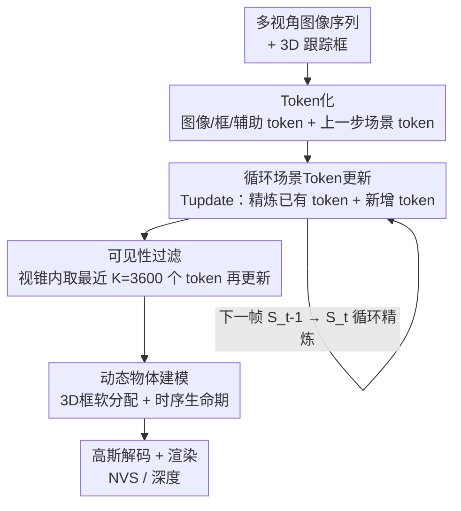

# UFO: Unifying Feed-Forward and Optimization-based Methods for Large Driving Scene Modeling

**会议**: CVPR 2026  
**论文**: [CVF Open Access](https://openaccess.thecvf.com/content/CVPR2026/html/Tan_UFO_Unifying_Feed-Forward_and_Optimization-based_Methods_for_Large_Driving_Scene_CVPR_2026_paper.html)  
**代码**: 待确认  
**领域**: 自动驾驶 / 3D视觉 / 新视角合成  
**关键词**: 4D场景重建, 驾驶场景, 循环更新, 前馈高斯, 长序列建模

## 一句话总结
UFO 把"逐场景优化"的 render-compare-update 迭代精炼过程抽象进一个前馈 Transformer，维护一组随新帧到来不断被精炼的"场景 token"，配合可见性过滤把复杂度从二次降到近线性，并用 3D 框引导的软分配 + 高斯生命期建模动态物体，在 Waymo 上的 2s/8s/16s（含 16s zero-shot）长序列驾驶场景重建上全面超过逐场景优化和前馈两类基线。

## 研究背景与动机
**领域现状**：驾驶场景的新视角合成（NVS）是自动驾驶闭环仿真和端到端强化学习的关键基础设施。目前主流有两条技术路线：一是基于 NeRF / 3DGS 的**逐场景优化**方法，靠光度损失反复迭代优化场景参数，质量高但每个 driving log 都要从头优化数小时；二是**前馈**方法（如 GS-LRM、STORM），用数据驱动先验一次前向就从图像预测出 3D 表示，推理快、泛化好。

**现有痛点**：把前馈方法搬到长程驾驶场景上有三个硬伤。其一，现有前馈架构用**全局注意力**，在空间分辨率和时间长度上都是二次复杂度，导致只能处理大幅下采样的短序列——尽管一个 3D 点的位置与外观只取决于它投影到的少数像素，方法却对所有像素做注意力，把算力浪费在无关区域。其二，长时段的动态物体建模需要捕捉复杂的长程运动，但很多方法依赖**匀速等限制性运动学假设**。其三，当前前馈管线**一次预测即定型**：远处或被遮挡视角带来的早期误差会沿长序列累积，没有机制在新观测到来后回头修正。

**核心矛盾**：优化方法可扩展、可迭代精炼但慢且不泛化；前馈方法快且泛化但一锤定音、复杂度二次。两者的优点互斥，长序列驾驶场景恰恰同时需要"快+泛化"和"可精炼+可扩展"。

**本文目标**：在一个前馈框架内同时拿到两类方法的优点——既要前馈的速度与泛化，又要优化方法那种"随观测增加逐步精炼、互相纠错"的能力，并把长序列复杂度压到近线性。

**切入角度**：作者的关键观察是 3DGS 的迭代精炼本质是一个 render→compare→update 的循环；那么与其一次性重建整个场景，不如维护一个由场景 token 构成的 4D 表示，随新帧到来**渐进式精炼**，但把整个 render-compare-update 抽象进一个学到的前馈 Transformer，省掉显式渲染和梯度反传。再利用 3D-到-像素对应的**局部性**只更新少量相关 token。

**核心 idea**：用"循环精炼场景 token 的前馈 Transformer"代替"显式渲染+梯度优化"，配可见性过滤实现近线性复杂度，配 3D 框软分配+生命期建模动态物体。

## 方法详解

### 整体框架
给定一段沿运动相机拍摄的 RGB 图像序列 $\{I_t\}_{t=1}^{T}$ 及对应相机位姿 $\{P_t\}_{t=1}^{T}$，UFO 的目标是高效重建一个支持高质量 NVS 和深度估计的 4D 场景表示 $S$。整个系统是一个**循环范式**，建立在三块组件上：

1. **基于 token 的场景表示**：把 4D 场景表示成一组紧凑的场景 token $S_t=\{s_t^i\}_{i=1}^{N_t}$，每个 token $s_t^i\in\mathbb{R}^{3+D}$ 由世界坐标下的 3D 位置 $(x,y,z)$ 和一个 $D=768$ 维特征向量构成，编码外观、几何与运动信息，可被解码成 3D 高斯用于渲染。

2. **循环场景更新**：每来一帧，更新模块 $T_{\text{update}}$（一个 ViT 式 Transformer 编码器）在前馈中做两件事——基于新视觉证据**精炼**已有 token，以及**新增** token 来捕捉此前未观测的内容。这模仿了 3DGS 的优化循环，但去掉了显式渲染和梯度计算。为了让长序列可扩展，引入**可见性过滤**，每步只挑最相关的 token 来更新。

3. **动态物体建模**：用现成检测器给出的 3D 框 + 可学习的高斯生命期参数，建模复杂物体运动，无需运动学假设。

整条管线按时间步循环展开：当前帧图像被切 patch 编码成图像 token，跟踪框编码成 box token，再加上共享的辅助 token（天空、逐相机颜色变换），与从世界系变换到当前相机系的可见场景 token 一起送进 $T_{\text{update}}$，产出更新后的 $S_t$，最后由高斯解码器结合动态运动解码成 3D 高斯并渲染。

### 关键设计

**1. 循环场景 Token 更新：把优化方法的 render-compare-update 抽象成一次前馈**

这是 UFO 的灵魂，针对"前馈方法一次预测即定型、无法纠错"的痛点。当新帧 $I_t$（位姿 $P_t$）到来，更新模块把当前观测与已有场景 token 一起处理，得到新表示：

$$S_t = T_{\text{update}}(I_t, S_{t-1}).$$

这一步同时做两件互补的事：(1) 用 $I_t$ 的新视觉证据精炼 $S_{t-1}$ 里的旧 token；(2) 创建新 token 捕捉此前未观测的场景内容。和优化方法必须显式渲染再反传梯度不同，UFO 直接从图像特征学着更新 token，因而推理快几个数量级。它的双向性是与流式重建（如 CUT3R、Point3R）的本质区别——后者把记忆当作固定历史上下文，一旦预测就不能改；UFO 则允许后到的高质量视角去**修正**早期不确定的预测（例如远处物体第一次只在低分辨率被看到）。消融（Tab. 3）显示，正是这个"精炼"能力比单纯有记忆再多带来 +0.31 dB PSNR，证明学到的 render-compare-update 抽象才是性能关键，而非记忆本身。此外，每步更新前会把选中的场景 token 从世界系变换到**当前相机为中心的局部坐标系**，把 token 位置和 Plücker 射线编码约束在紧凑数值范围内，避免自车长距离行驶时全局坐标的大幅数值波动——作者发现这对长序列稳定训练至关重要。

**2. 可见性过滤：利用 3D-到-像素对应的局部性把复杂度降到近线性**

直接对所有 token 套用 $T_{\text{update}}$ 在长序列上不可行：token 数 $N_t$ 随时间增长，而 Transformer 注意力是二次复杂度。作者的观察是，对每一帧而言并非所有 token 都同等相关——视锥外或离相机太远的 token 对当前更新贡献甚微。于是对每帧 $I_t$ 先筛出落在相机视锥内的场景 token，再按到相机中心的距离取最近的 $K$ 个，构成可见集 $V_{t-1}=\{s_{t-1}^i\}_{i=1}^{K}$。更新只在这个子集上做：

$$\Delta S_t, V'_{t-1} = T_{\text{update}}(I_t, V_{t-1}),$$

随后把可见 token 替换为精炼版、追加新建 token，其余保持不变：

$$S_t = (S_{t-1}\setminus V_{t-1})\cup V'_{t-1}\cup \Delta S_t.$$

由于每步只处理固定预算 $K$ 个 token（实测 $K=3600$），总复杂度随序列长度 $T$ **线性**增长，而非二次。这正是 UFO 能扩展到长序列、且在 16s 上几乎不掉点的根本原因。

**3. 动态物体建模：3D 框引导的软分配 + 时序生命期，去掉运动学假设**

针对"长程动态物体运动复杂、靠匀速假设建不好"的痛点，UFO 把粗运动和细运动分开建模。粗运动用 3D 框引导：朴素做法是按 3D 位置硬分配 token 到物体，但这不可微且对框误差敏感；UFO 改让模型学**软分配**。跟踪框经中心与角点的 Fourier 嵌入编码成 box token，与场景/图像 token 一同送入模型联合推理几何、外观与物体级运动。软分配矩阵 $A\in\mathbb{R}^{N\times N_{\text{obj}}}$ 由场景 token 与 box token 的点积相似度行 softmax 得到：

$$A_{s,i} = \frac{\exp(s^\top b_{t,i})}{\sum_{j=1}^{N_{\text{obj}}}\exp(s^\top b_{t,j})}.$$

每个解码出的高斯按权重 $A_{s,i}$ 继承一个**混合刚体变换**：平移线性混合、旋转在 SO(3) 上用半球对齐的四元数平均混合，得到创建时刻 $t_0$ 和目标渲染时刻 $t_1$ 的变换 $T_{t_0}, T_{t_1}$，再用相对运动 $\Delta T = T_{t_1}T_{t_0}^{-1}$ 更新高斯中心与旋转 $\mu_{t_1}=\Delta T\,\mu_{t_0},\ r_{t_1}=R(\Delta T)\,r_{t_0}$。为防止软分配去拟合静态背景，加物体分配正则 $L_{\text{obj}}=-\sum_s\sum_i y_{s,i}\log A_{s,i}$，鼓励落在框内的 token 分配给对应物体（$y_{s,i}$ 为框内指示）。

细运动则靠**时序生命期**补足刚体框变换之外的细节。仿照 PVG，给每个高斯一个生命期参数 $\beta$ 控制其时序不透明度，让行人、骑行者等瞬态物体和时变光照得到准确表达。高斯不透明度随时间高斯衰减：

$$\sigma(t) = \sigma_0 \cdot \exp\!\left(-\frac{(t-t_0)^2}{2\beta^2}\right),$$

其中 $\beta>0$ 由 token 特征经 SoftPlus 解码以保正。为避免所有高斯都退化成瞬态，加生命期正则 $L_{\text{lifespan}}=\frac{1}{N}\sum_i \frac{1}{\beta_i}$ 鼓励更长的时序持久性。两者结合，让模型在长序列上既能跟住物体的整体刚体运动，又能刻画瞬态与精细变化。

### 损失函数 / 训练策略
端到端训练，外观损失含 L2 光度损失和 LPIPS 感知损失；几何监督用 LiDAR 点的 L1 深度损失；天空 mask 损失防止高斯拟合天空区域；再加生命期与物体分配两个正则：

$$L = L_2 + L_{\text{LPIPS}} + L_{\text{depth}} + L_{\text{lifespan}} + L_{\text{obj}} + L_{\text{sky}}.$$

$T_{\text{update}}$ 由 ViT 改造（patch size 8，嵌入维度 768），用 DPT head 预测 token 深度与属性，box 编码器/token 编码器/高斯解码器都是 tiny MLP，高斯渲染用 gsplat、注意力用 PyTorch flex attention 实现自定义掩码。每帧保留按内含 LiDAR 点数排序的前 32 个框。在 16 张 H200 上以总 batch 64 训练约一天。**渐进式训练**很关键：先在 2s 短片段上训，再展开到更长序列，消融显示只用短片段训练无法泛化到长序列。

## 实验关键数据

数据集为 Waymo Open Dataset，每段约 20 秒、10 Hz 同步；遵循 STORM 用前/前左/前右三相机，每第 5 帧作上下文、其余帧作监督与评测。16s 序列为 8s 模型的 zero-shot 泛化（在 16s 上训练成本过高）。

### 主实验
在 2s/8s/16s 三种序列长度上与逐场景优化（3DGS、PVG、DeformableGS、Street Gaussians）和前馈（GS-LRM、STORM）基线比 PSNR/SSIM/深度 RMSE。UFO 全面领先，且随序列变长几乎不掉点，而 STORM 等前馈方法在 16s 上大幅退化。

| 方法 | 2s PSNR↑ | 2s D-RMSE↓ | 8s PSNR↑ | 8s D-RMSE↓ | 16s(zero-shot) PSNR↑ | 16s D-RMSE↓ |
|------|---------|-----------|---------|-----------|---------------------|------------|
| 3DGS | 21.07 | 13.52 | 19.57 | 14.42 | 17.18 | 17.01 |
| PVG | 23.81 | 13.82 | 22.90 | 18.24 | 21.79 | 17.21 |
| Street Gaussians | 22.96 | 12.15 | 21.69 | 13.17 | 22.67 | 14.88 |
| GS-LRM | 25.18 | 7.94 | 21.81 | 7.37 | 16.98 | 9.81 |
| STORM | 26.38 | 5.48 | 24.48 | 8.11 | 22.02 | 7.91 |
| STORM(iterative) | 26.38 | 5.48 | 21.25 | 12.35 | 19.88 | 11.65 |
| **UFO（本文）** | **27.26** | **5.45** | **27.39** | **5.10** | **27.04** | **5.08** |

最醒目的是 UFO 在 2s/8s/16s 上 PSNR 几乎恒定（27.26 / 27.39 / 27.04），而最强前馈基线 STORM 从 2s 的 26.38 跌到 16s 的 22.02；STORM-iterative（独立合并短片段）因缺全局时序上下文退化更严重。

### 动态物体建模
固定 2s 时间窗内改变输入帧密度（帧越多、时序上下文越近、越易建模物体运动），只评测动态物体上的 PSNR；为隔离动态建模效果，关掉循环更新、用单步预测。UFO 全面优于 STORM，且优势随上下文帧数增大——从 1 帧 +0.32 dB 涨到 10 帧 +2.16 dB，说明框引导+生命期比 STORM 的匀速假设更能抓长程复杂运动。

| 方法 | 1 帧 | 2 帧 | 4 帧 | 6 帧 | 10 帧 |
|------|------|------|------|------|-------|
| STORM | 19.04 | 20.71 | 22.09 | 22.56 | 22.92 |
| **Ours** | **19.36** | **21.72** | **23.08** | **24.16** | **25.08** |
| Gain | +0.32 | +1.01 | +0.99 | +1.60 | +2.16 |

### 消融实验
在 8s WOD 序列上消融关键组件（16 帧均匀采样）。两张表分别拆"循环更新设计"和"其余组件"。

| 配置 | PSNR↑ | SSIM↑ | D-RMSE↓ | 说明 |
|------|-------|-------|---------|------|
| (1) Independent（独立处理片段） | 21.25 | 0.609 | 12.35 | 类似 STORM-iterative，最差 |
| (2) Implicit Mem.（CUT3R 式隐式记忆） | 26.67 | 0.804 | 5.22 | 有记忆即大涨 |
| (3) 3D-Aware Mem.（Point3R 式显式记忆） | 27.08 | 0.824 | 5.13 | 3D 感知记忆更好 |
| (4) 3D-Aware Mem.+Refine（本文完整） | 27.39 | 0.830 | 5.10 | 加"精炼"再 +0.31 dB |

| 配置 | PSNR↑ | SSIM↑ | D-RMSE↓ | 说明 |
|------|-------|-------|---------|------|
| w/o 渐进式训练 | 20.67 | 0.625 | 11.81 | 只用 2s 短片段训，掉最多 |
| w/o 历史 token | 26.31 | 0.787 | 5.31 | 去掉持久场景表示，明显掉点 |
| w/o 生命期 | 26.47 | 0.790 | 5.21 | 去掉时序不透明度建模 |
| w/o 3D 框引导 | 26.88 | 0.818 | 5.12 | 缺物体级运动线索 |
| Ours (full) | **27.39** | **0.830** | **5.10** | 完整模型 |

### 可扩展性
在单张 H20 上、batch 1、排除高斯渲染阶段，UFO 推理时间随序列近线性增长而 STORM 二次增长（图 5 给出 0.44s vs 1.47s 的对比点 ⚠️ 具体对应序列长度以原文图为准）；显存两者都近线性但 UFO 更慢、在 16s 上约省 25% 显存。

### 关键发现
- **"能精炼"比"有记忆"更关键**：从 3D-Aware Mem.（27.08）到加 Refine（27.39）的 +0.31 dB，是与流式重建方法的本质分水岭——后到视角能纠正早期不确定预测。
- **渐进式训练不可省**：同样架构下只用 2s 训练（20.67）严重退化，短序列训练无法外推到长序列。
- **持久场景表示是地基**：去掉历史 token 掉到 26.31，跨时间步维护一份持久表示至关重要。
- **框引导与生命期互补**：去掉任一都掉点，框给物体级刚体运动线索，生命期补瞬态/精细变化，单靠生命期补不全。

## 亮点与洞察
- **把迭代优化"蒸馏"成一次前馈**：UFO 最"啊哈"的地方是认出 3DGS 的优化本质是 render-compare-update 循环，然后用一个学到的 Transformer 把这个循环抽象掉，既保留"可反复精炼"的优点又拿到前馈的速度——这是一种很有迁移性的"把迭代算法折叠进网络"的思路。
- **用对应的局部性换近线性复杂度**：可见性过滤抓住"3D 点只取决于它投影到的少数像素"这一几何先验，用固定 token 预算 $K$ 把二次降到线性，简单但直击长序列瓶颈，可迁移到任何需要长程 3D token 注意力的任务。
- **软分配优于硬分配**：把"token 属于哪个物体"做成可微的注意力软分配而非硬几何分配，绕开了框误差敏感与不可微问题，再用 SO(3) 四元数平均混合刚体变换，是处理"离散物体归属+连续运动"的漂亮工程。
- **双向精炼**：相比流式方法只能用过去帧，UFO 的双向更新让"未来高质量观测纠正过去低质预测"成为可能，这对远处/遮挡物体特别有用。

## 局限与展望
- **依赖现成检测器/标注的 3D 框**：动态建模建立在 off-the-shelf 检测或标注框上，框质量与跟踪误差会传导到运动建模；虽用软分配缓解，但极端检测失败下的鲁棒性未充分讨论。
- **相机配置受限**：实验只用前/前左/前右三相机、每第 5 帧作上下文，对全环视、更稀疏/更密采样的泛化性待验证。
- **16s 为 zero-shot 外推**：超长序列没有直接训练（成本过高），更长（>16s）场景的精度与稳定性仍是开放问题。
- **可扩展性测量排除渲染阶段**：时间/显存对比刻意排除高斯渲染，端到端实际部署开销需另算 ⚠️ 以原文为准。
- 改进方向：把 3D 框替换成自监督/在线检测形成闭环、引入不确定性引导的 token 预算自适应（按场景复杂度动态调 $K$）、把循环精炼扩展到多 log 共享先验。

## 相关工作与启发
- **vs STORM**：STORM 也把前馈重建扩到多视角动态驾驶场景，但受限于序列长度二次复杂度和匀速等运动学假设，长序列退化严重；UFO 用循环精炼实现线性复杂度，用框软分配+生命期建复杂长程运动，8s/16s 上大幅领先（27.39/27.04 vs 24.48/22.02）。
- **vs 流式重建（CUT3R / Point3R / Spann3R / StreamVGGT）**：这些方法缓存历史特征做单向流式查询、记忆一旦写入不可改，且不支持照片级 NVS；UFO 双向、可回头精炼，并直接产出可渲染高斯。消融里 3D-Aware Mem.（Point3R 式）+ Refine 的对比量化了"可精炼"的额外收益。
- **vs ReSplat / SplatFormer（learning-to-optimize）**：ReSplat 用渲染误差做反馈无梯度地学优化高斯，但每步仍要显式渲染且面向静态场景；SplatFormer 用点 Transformer 精炼初始化高斯但限于物体中心数据、仍慢。UFO 在场景 token 空间操作、抽掉显式渲染，面向动态长程驾驶场景。
- **vs 逐场景优化（PVG / Street Gaussians / DeformableGS）**：这些方法质量靠数小时逐场景优化、每个新 log 从头来；UFO 一次前馈即得，速度与泛化全面胜出，质量也更高。生命期参数化思路借鉴 PVG，框引导分解思路借鉴显式分解类方法，但都改造为可学的前馈形式。

## 评分
- 新颖性: ⭐⭐⭐⭐⭐ "把优化方法的 render-compare-update 循环抽象进前馈 Transformer + 可见性过滤近线性"是清晰且原创的统一视角。
- 实验充分度: ⭐⭐⭐⭐ Waymo 上覆盖 2s/8s/16s、动态物体、可扩展性、两组消融，论证扎实；但仅单数据集、三相机配置。
- 写作质量: ⭐⭐⭐⭐⭐ 动机三个痛点—对应三个设计的结构清晰，公式与图示到位。
- 价值: ⭐⭐⭐⭐⭐ 长程驾驶场景的可扩展 4D 重建对闭环仿真有直接落地价值。

<!-- RELATED:START -->

## 相关论文

- [\[CVPR 2026\] Unifying Language-Action Understanding and Generation for Autonomous Driving](unifying_language-action_understanding_and_generation_for_autonomous_driving.md)
- [\[CVPR 2025\] PanSplat: 4K Panorama Synthesis with Feed-Forward Gaussian Splatting](../../CVPR2025/autonomous_driving/pansplat_4k_panorama_synthesis_with_feed-forward_gaussian_splatting.md)
- [\[NeurIPS 2025\] Unifying Appearance Codes and Bilateral Grids for Driving Scene Gaussian Splatting](../../NeurIPS2025/autonomous_driving/unifying_appearance_codes_and_bilateral_grids_for_driving_scene_gaussian_splatti.md)
- [\[CVPR 2026\] Efficient Equivariant Transformer for Self-Driving Agent Modeling](efficient_equivariant_transformer_for_self-driving_agent_modeling.md)
- [\[CVPR 2026\] Lipschitz Optimization for Formal Verification of Homographies](lipschitz_optimization_for_formal_verification_of_homographies.md)

<!-- RELATED:END -->
