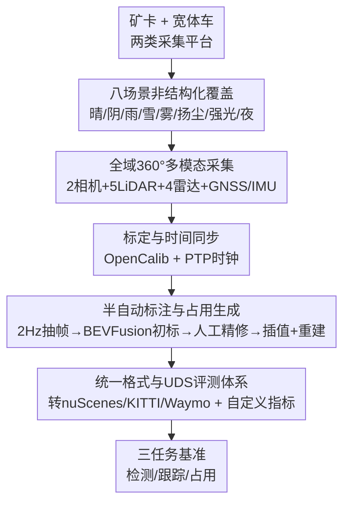

# URScenes: A Multi-scenario Dataset for Unstructured Road Environments

**会议**: CVPR 2026  
**论文**: [CVF Open Access](https://openaccess.thecvf.com/content/CVPR2026/html/Liu_URScenes_A_Multi-scenario_Dataset_for_Unstructured_Road_Environments_CVPR_2026_paper.html)  
**代码**: http://www.sav-lab.com （数据与工具包，⚠️ 以原文为准）  
**领域**: 自动驾驶 / 感知数据集  
**关键词**: 非结构化道路, 露天矿场, 多模态感知, 3D目标检测, 占用预测

## 一句话总结
URScenes 是首个面向非结构化道路环境（以露天矿场为代表）的多场景开源多模态感知数据集，用矿卡和宽体车两类平台采集了覆盖晴/阴/雨/雪/雾/扬尘/强光/夜间八种天气光照条件的 472 个场景，统一支持 3D 目标检测、多目标跟踪和 3D 占用预测三大任务，并提供针对矿区物体尺寸特点重新设计的评测指标和到 nuScenes/KITTI/Waymo 的格式转换工具。

## 研究背景与动机

**领域现状**：自动驾驶感知严重依赖大规模标注数据集，但 KITTI、Cityscapes、nuScenes、Waymo 等主流数据集几乎全部聚焦于**结构化的城市道路和高速公路**，且大多在晴好天气下采集。

**现有痛点**：当自动驾驶/无人化作业向露天矿、地质勘探、大规模农业等更苛刻环境扩展时，现有数据集就不够用了。已有的非结构化数据集各有缺口——ORFD、OFFSEG、CARL-D、IDD 主要针对林区或乡村土路这类"简单"非结构化场景；R²100K、RELLIS-3D 虽然定义了多样路面特征，但**几乎不考虑恶劣天气**（RELLIS-3D 没有按天气划分子集，R²100K 只有晴、阴、扬尘三种，且重心在语义分割）；2022 年的 AutoMine 是首个露天矿数据集，但**只支持 3D 检测与定位**，不覆盖矿区常见的暴雪、浓雾等极端天气。

**核心矛盾**：到目前为止，**没有任何一个数据集能同时做到**：① 全面覆盖非结构化道路环境及其恶劣天气；② 支持 3D 检测、多目标跟踪、占用预测三大关键感知任务；③ 与主流 benchmark 的数据结构和工具链对齐，让模型能低成本迁移。这三者凑不齐，就成了非结构化感知研究的瓶颈。

**本文目标**：构建一个多场景、多模态、多任务的非结构化道路感知数据集，并把它做成"开箱即用"——能直接转成主流格式、配套评测指标。

**切入角度**：作者以**露天矿场**作为非结构化道路环境的代表性案例（物体尺寸跨度极大、天气极端、地形复杂），用两类真实矿用车辆历时两年采集。

**核心 idea**：用一套统一的 360° 多模态采集 + 半自动标注 + 格式转换流水线，造出首个"八天气 × 三任务"的非结构化感知数据集，并配套为矿区物体尺寸量身定做的检测指标 UDS。

## 方法详解

### 整体框架

这篇是数据集论文，"方法"即**数据集构建流水线**。整体可以看成五步串行：用矿卡/宽体车两类平台搭载 360° 多模态传感器套件采集原始数据 → 对所有传感器做标定并用 PTP 时钟做时间同步 → 在 LiDAR 序列上以 2 Hz 抽关键帧、用预训练 BEVFusion 生成初始 3D 框再人工精修 → 把精修框插值传播到非关键帧、并通过动静分离与多视图重建生成占用栅格真值 → 用统一标注结构存储，提供到 nuScenes/KITTI/Waymo 的自动转换，并在转成 nuScenes 格式后用自定义指标做基准评测。

### 关键设计

**1. 八场景非结构化覆盖：把"恶劣天气 × 矿区地形"一次性补齐**

针对"现有非结构化数据集要么缺天气、要么缺任务"这个最核心的缺口，URScenes 首次在非结构化道路环境中覆盖**八种典型大气与光照条件**——雨、雪、雾、扬尘、强光（glare）、夜间、阴天、晴天，其中晴/阴为正常场景，其余六类为恶劣条件。数据以露天矿为代表性场景，路面涵盖泥泞、积水、湿滑、碎石等，物体类别包括宽体车、矿卡、推土机、挖掘机、行人等共 36 个语义类别。表 1 的横向对比里，URScenes 是唯一一个在"雾/雪/雨/扬尘/强光/夜间"六个恶劣天气列以及"非结构化道路"列上**全部打钩**的数据集——AutoMine 虽然也是矿区但缺雪/雾，nuScenes/Waymo 等城市数据集则在"非结构化"列直接是 No。这种覆盖度直接决定了它能支撑恶劣条件下的鲁棒性研究。

**2. 全域 360° 多模态采集平台：让远近、强弱光都有冗余信号**

矿区物体尺寸跨度极大（行人 1.1 m 对角线 vs 挖掘机 20.1 m）、扬尘浓雾会衰减 LiDAR，单一传感器扛不住。作者用矿卡和宽体车两类平台，各配一套同步的 360° 套件：1 个 128 线长距 LiDAR（120° HFOV、200 m）+ 4 个 32 线盲区 BPearl LiDAR（360° HFOV、50 m）补近场盲区，1 个 60° 长焦相机 + 1 个 200° 鱼眼相机覆盖远近视野，4 个 76–77 GHz 毫米波雷达提供恶劣天气下的穿透信号，外加 GNSS+IMU 做定位。数据以 10 Hz 录制，两年采集累计 472 个场景（每个约 30 s）、约 294K 图像、736K LiDAR 扫描、589K 雷达帧。标定上用 OpenCalib 在平地走"8 字"轨迹求 LiDAR–车体外参，相机内参用张正友标定法，相机–LiDAR 外参用 QR 码靶标的 PnP 角点检测；时间同步靠一个部署在 Jetson 域控制器上的 PTP 主时钟，接 INS 的 PPS 与 GPRMC 信号对齐到 UTC，保证多源原始数据时间一致。

**3. 半自动标注与占用栅格生成：用预训练模型 + 插值压标注成本**

逐帧手标 28K+ 关键帧成本极高。作者的做法是：从 LiDAR 序列里以 **2 Hz 采样关键帧**，先用预训练的 BEVFusion 模型生成初始 3D 框，再**人工精修**；精修后的边界框通过**插值**传播到非关键帧，大幅降低标注量（最终 28K+ 关键帧标注 + 119K 非关键帧）。占用真值的生成同时利用关键帧和非关键帧：先做**动静分离**，再用多视图重建在复杂环境里做稠密建图，最后用定位数据把有效区域裁剪并体素化，得到准确的占用栅格。整套流程让"高质量标注"和"可承受成本"之间不再二选一。

**4. 统一格式与 UDS 评测体系：为矿区尺寸重新定义"算对没对"**

为了让模型能低成本迁移，所有数据用统一结构标注，并支持自动转成 nuScenes、KITTI、Waymo 格式（实验里就先转成 nuScenes 格式再跑）。更关键的是检测指标：nuScenes 的固定中心距阈值对尺寸差异巨大的矿区物体不公平，于是作者按类别统计 GT 框 2D 对角线均值 $Dia_c$，据此构造类别相关的距离阈值 $Th{d}_c=\{0.125Dia_c,\,0.25Dia_c,\,0.5Dia_c,\,Dia_c\}$（如挖掘机 $Dia_c=20$ m、行人 $Dia_c=1$ m），再在各阈值与类别上累计算 AP，取均值得 mAP（积分时设 $P_{min}=R_{min}=0.1$）。在 TP 物体上选 nuScenes 的 ATE/ASE/AOE 三项位姿误差求类均得 mTP。最后定义综合分数 URScenes Dataset Score：

$$UDS=\frac{1}{6}\Big[3\,mAP+\sum_{mTP}\big(1-\min(1,mTP)\big)\Big]$$

即把 mAP 加权 3 倍、再叠加三个被归一化为"越大越好"的位姿误差项。跟踪沿用 AMOTA/AMOTP，占用用 mIoU。这套指标让"恶劣天气下虽然 mAP 掉但近场位姿仍准"这种情况也能被合理评价。

### 一个完整示例

以**扬尘子集**为例走一遍这套指标怎么解释现象：扬尘悬浮颗粒严重衰减 LiDAR 穿透，导致远距离目标检不到，于是 mAP 极低——最好的融合模型 BEVFusion 在扬尘子集只有 16.7% mAP，纯 LiDAR 的 FUTR3D 更低至 15.3%。但近处目标仍能可靠检测、位姿（ATE/ASE/AOE）较准，于是 UDS 被位姿项拉高到 44.3%/34.6%。论文用 $UDS-mAP$ 这个差值量化"远场失效但近场尚可"的程度：扬尘 27.3%、雾 29.1%、雪 24.2% 是全部子集里差值最大的三个，正好对应 LiDAR 受悬浮颗粒影响最重的三种天气。这说明 UDS 的设计意图——不因远场掉点就把一个近场仍可用的模型一棍子打死——确实在数据上体现出来了。

## 实验关键数据

实验在 472 个场景（从原始 900 个场景中筛除目标过少/过密/严重遮挡的，如停车场）上做 8:2 训练/测试划分，跑了 12 个检测、6 个跟踪、7 个占用模型。

### 主实验：检测跨天气子集（UDS%/mAP%）

| 模型 | 阴天 Cloudy | 晴天 Sunny | 扬尘 Dust | 雾 Fog | 雪 Snow |
|------|------|------|------|------|------|
| PointPillars（L） | 79.6/71.9 | 67.3/62.2 | 48.9/17.3 | 57.3/28.5 | 60.0/35.3 |
| BEVFusion*（L+C） | 78.0/70.2 | 61.4/61.3 | 44.3/16.7 | 59.4/27.8 | 60.3/34.9 |
| CenterPoint（L） | 78.7/69.6 | 62.0/57.9 | 46.5/15.6 | 59.2/27.8 | 60.7/34.4 |
| FUTR3D（L，纯LiDAR） | 62.9/66.5 | 56.7/52.3 | 34.6/15.3 | 52.7/33.8 | 52.2/34.8 |

正常场景（阴/晴/雨）所有模型表现都好，扬尘/雾/雪显著掉点——阴天 BEVFusion 达 78.0/70.2，扬尘子集骤降到 44.3/16.7，纯 LiDAR 的 FUTR3D 在扬尘更是全场最低 34.6/15.3，印证了恶劣天气对 LiDAR 点云质量的破坏。

### 模态对比（阴天子集，Table 5）

| 模型 | 模态 | UDS↑% | mAP↑% | ATE↓m | ASE↓ | AOE↓rad |
|------|------|------|------|------|------|------|
| BEVFusion | L+C | 78.0 | 70.2 | 0.18 | 0.07 | 0.17 |
| FUTR3D | L+C | 75.7 | 69.6 | 0.34 | 0.11 | 0.10 |
| BEVFusion | L | 75.8 | 69.4 | 0.23 | 0.08 | 0.22 |
| FUTR3D | L | 62.9 | 66.5 | 0.98 | 0.12 | 0.12 |
| FUTR3D | C+R | 54.5 | 32.2 | 0.56 | 0.09 | 0.04 |
| BEVDepth | C | 67.4 | 58.5 | 0.63 | 0.05 | 0.04 |

LiDAR+相机融合一致优于单模态：融合 BEVFusion(78.0)/FUTR3D(75.7) 都高于其纯 LiDAR 版本(75.8/62.9)，说明在非结构化环境中传感器融合有效。

### 占用预测（Table 6，mIoU%）与跟踪（Table 7）

| 占用方法 | 模态 | mIoU | 工程车 | 路面 | 小障碍 |
|------|------|------|------|------|------|
| FB-Occ | C | 30.94 | 15.14 | 35.28 | 19.74 |
| SparseOcc | C | 26.83 | 11.83 | 30.69 | 18.36 |
| Co-Occ | C&L | 25.41 | 24.70 | 23.80 | 7.40 |
| SurroundOcc | C | 17.13 | 13.23 | 19.97 | 6.24 |

占用上多模态总体占优；纯视觉里 FB-Occ 以 30.94% mIoU 领先、在丘陵地形(Hill 43.46%)出色但在车辆类受单目深度限制；SparseOcc 用极低分辨率(704×256)却拿到有竞争力的小障碍分(18.36%)，说明高效设计胜过堆分辨率。跟踪上端到端方法稳定，ADA-Track 取得最高 MOTA(35.2%)与 AMOTA(33.9%)，两阶段里 MCTrack 在 MOTA(34.6%)/AMOTA(34.7%)/AMOTP(1.37m) 全面领先。

### 关键发现
- **UDS−mAP 差值是恶劣天气诊断器**：扬尘(27.3%)、雾(29.1%)、雪(24.2%)差值最大，对应 LiDAR 远场失效但近场仍准的物理事实。
- **类别不均衡直接影响检测难度**：宽体车实例多，五模型平均 UDS 最高(60.6%)；挖掘机数据少且分布不均，平均 UDS 仅 32.4%。
- **融合>单模态在恶劣环境更明显**，但相机+雷达(C+R)组合 mAP 仅 32.2%，远逊含 LiDAR 的方案。

## 亮点与洞察
- **指标随数据特性重做**：不照搬 nuScenes 固定阈值，而是按类别 2D 对角线 $Dia_c$ 设自适应距离阈值并定义 UDS，是这篇最值得借鉴的工程思路——当物体尺寸跨一个数量级时，固定阈值评测会系统性偏袒小目标或大目标。
- **半自动标注闭环可复用**：用预训练检测器初标 + 人工精修 + 关键帧到非关键帧插值，是大规模 3D 数据集降本的成熟范式，占用真值用动静分离+多视图重建+定位裁剪体素化的组合也可直接迁移到其他多模态采集。
- **"八天气×三任务"一张表**：把恶劣天气覆盖度做成可量化的对比维度（表 1 全打钩），让数据集的差异化贡献一目了然。

## 局限与展望
- **作者承认**：当前未含 4D 雷达，也缺少场景/物体的标准化文本描述；未来计划补这两块以丰富多样性。
- **仍以露天矿为单一代表**：虽称"非结构化道路"，实际数据高度集中在矿区车辆与地形，林区/农田/勘探等其他非结构化类型未覆盖，泛化到这些场景的能力存疑。
- **数据规模与类别不均衡**：挖掘机等少数类样本不足导致检测难度大；不同子集天气样本量是否均衡论文未充分披露（⚠️ 以原文为准）。
- **基准只跑现成模型**：未针对非结构化/恶劣天气提出新方法，仅做 benchmark，恶劣天气下的最佳实践仍待后续工作探索。

## 相关工作与启发
- **vs nuScenes / Waymo / KITTI**：它们是大规模结构化城市/高速数据集，天气覆盖有限且无非结构化道路；URScenes 专攻非结构化矿区 + 八天气，并提供向这些主流格式的转换工具以复用其生态。
- **vs AutoMine**：同为露天矿数据集，但 AutoMine（2022）只支持 3D 检测与定位、不含暴雪浓雾；URScenes 扩展到检测+跟踪+占用三任务并补齐极端天气。
- **vs R²100K / RELLIS-3D**：它们定义了丰富的非结构化路面特征但重心在语义分割、几乎不考虑恶劣天气；URScenes 以多模态 3D 感知 + 系统化天气子集为差异点。

## 评分
- 新颖性: ⭐⭐⭐⭐ 首个"八天气×三任务"非结构化多模态数据集，UDS 指标设计有亮点，但单点创新是数据而非方法
- 实验充分度: ⭐⭐⭐⭐ 12检测+6跟踪+7占用模型横扫三任务八子集，基准扎实
- 写作质量: ⭐⭐⭐⭐ 表格清晰、对比维度明确，部分公式 OCR 略乱需对照原文
- 价值: ⭐⭐⭐⭐ 填补非结构化恶劣天气感知数据空白，配套转换工具与指标实用性强

<!-- RELATED:START -->

## 相关论文

- [\[CVPR 2026\] CARD: A Multi-Modal Automotive Dataset for Dense 3D Reconstruction in Challenging Road Topography](card_a_multi-modal_automotive_dataset_for_dense_3d_reconstruction_in_challenging.md)
- [\[CVPR 2026\] RefAV: Towards Planning-Centric Scenario Mining](refav_towards_planning-centric_scenario_mining.md)
- [\[CVPR 2025\] Scenario Dreamer: Vectorized Latent Diffusion for Generating Driving Simulation Environments](../../CVPR2025/autonomous_driving/scenario_dreamer_vectorized_latent_diffusion_for_generating_driving_simulation_e.md)
- [\[CVPR 2026\] RoadSceneBench: A Lightweight Benchmark for Mid-Level Road Scene Understanding](roadscenebench_a_lightweight_benchmark_for_mid-level_road_scene_understanding.md)
- [\[CVPR 2026\] TrafficAlign: Aligning Large Language Models for Traffic Scenario Generation](trafficalign_aligning_large_language_models_for_traffic_scenario_generation.md)

<!-- RELATED:END -->
