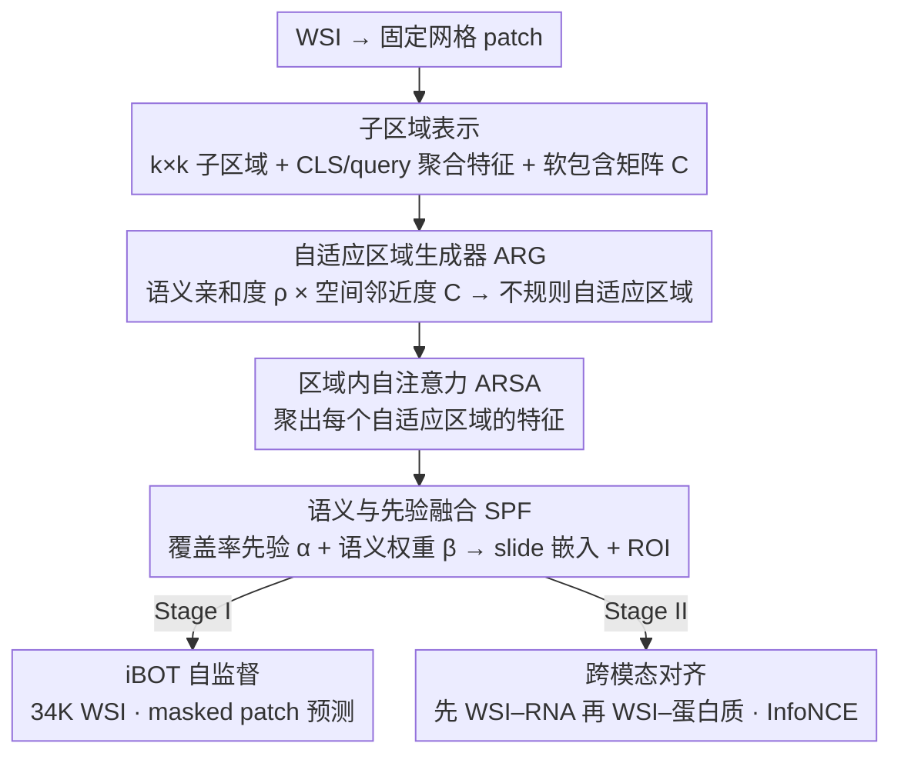

# CARE: A Molecular-Guided Foundation Model with Adaptive Region Modeling for Whole Slide Image Analysis

**会议**: CVPR2026  
**arXiv**: [2602.21637](https://arxiv.org/abs/2602.21637)  
**代码**: [zdipath/CARE](https://github.com/zdipath/CARE)  
**领域**: 计算生物  
**关键词**: 计算病理学, 全切片图像分析, 基础模型, 自适应区域建模, 跨模态对齐, RNA/蛋白质引导

## 一句话总结

提出 CARE，一种病理学 slide-level 基础模型，通过自适应区域生成器（ARG）将 WSI 划分为形态学相关的不规则区域（类似 NLP 中的词级 token），并结合 RNA/蛋白质表达谱的跨模态对齐进行两阶段预训练，仅用主流模型约 1/10 的数据即在 33 个下游任务上取得最优平均性能。

## 研究背景与动机

**现有病理基础模型的 patch 依赖问题**：当前 slide-level 基础模型沿用自然图像 backbone，将 WSI 视为大量固定大小 patch 的集合，缺乏对组织形态学异质性和空间结构的建模能力。

**缺乏显式 ROI 概念**：临床病理医生读片时首先定位诊断关键的 ROI，但典型基础模型要么对所有 patch 做全局注意力，要么施加固定规则的划分，无法模拟这一临床流程。

**patch 到 WSI 直接聚合的困难**：直接从数千个 patch 聚合到 WSI 级特征会产生超长距离交互，使聚合器难以学习；层级化的 patch→region→WSI 方案更符合组织结构。

**现有区域划分过于粗糙**：固定网格的 patch chunk（字符级 token）语义短视，固定大小的 region chunk（定长切分）容易造成语义错位，都无法对齐真实组织边界。

**分子信息与形态学的脱节**：已有模型的区域构建不受生物学信号引导，无法保证所学区域与潜在分子模式（基因表达、蛋白质丰度）一致。

**数据效率低下**：主流病理基础模型通常需要数十万张 WSI 进行预训练，数据获取和计算成本极高，亟需更高效的预训练范式。

## 方法详解

### 整体框架

CARE（Cross-modal Adaptive Region Encoder）想解决病理 slide-level 基础模型的一个老问题：把 WSI 当成一堆固定大小 patch 的集合，既不贴合组织的形态异质性，也学不出临床医生读片时"先定位 ROI"的层级。它的思路是借一个"词级 tokenization"的类比——先在固定网格上备好带空间先验的子区域"积木"（子区域表示），再把 patch 按语义和空间重组成形态学一致的不规则自适应区域（ARG），在区域内做自注意力提特征（ARSA），用覆盖率先验加语义注意力把区域聚成 slide 级嵌入（SPF），并让区域构建受 RNA/蛋白质表达谱引导、使区域边界带上生物学意义。预训练分两阶段：Stage I 做 iBOT 式自监督（34,277 WSI），Stage II 做跨模态对比（先 WSI-RNA 对齐、再 WSI-蛋白质对齐）。

### 关键设计

**1. 子区域表示：给自适应区域准备一套带空间先验的"积木"**

ARG 不能凭空切区域，得先有一组带特征和空间关系的基本单元。CARE 在 patch 网格上定义 $M$ 个不重叠的 $k \times k$ 正方形子区域，每个子区域通过区域内自注意力得到两份聚合特征——CLS 聚合特征 $g_i^{\text{CLS}}$，以及用可学习 query 做交叉注意力的 query 聚合特征 $g_i^Q$。同时用基于锚点距离的软包含矩阵 $C$ 量化 patch 与子区域的空间关系。这两类特征加一个空间先验，正好是下一步算"某个 patch 该归到哪个区域"所需的全部材料。

**2. 自适应区域生成器（ARG）：让 patch 按"语义像不像 + 空间近不近"重新归队**

固定网格切片会把一块完整组织拦腰切断、造成语义错位。ARG 改成对每个 patch 选软包含得分最高的 top-3 候选子区域，算 4 路余弦相似度（原始/增强 patch 特征 × CLS/query 子区域特征），softmax 归一后取平均得到语义亲和度 $\rho_{ji}$，再乘空间邻近度得到选择得分 $w_{ji} = \rho_{ji} \cdot C_{ji}$，把 patch 分给得分最高的子区域，形成不规则自适应区域。语义乘空间这一步是关键：只看语义会让区域在空间上碎掉，只看空间又退回固定网格，相乘才能切出既连贯又贴合组织边界的区域。

**3. 语义与先验融合（SPF）：聚成 slide 嵌入的同时顺手选出 ROI**

数千 patch 直接聚到 WSI 级会产生超长距离交互、聚合器学不动，所以 CARE 在区域这一层聚合，并把两种权重融起来——覆盖率先验 $\alpha_i$（区域含 patch 的比例）和 gated attention 语义权重 $\beta_i$：

$$z_{\text{WSI}} = \sum_i (\lambda_{\text{SPF}} \alpha_i + (1 - \lambda_{\text{SPF}}) \beta_i) g_i^{\text{AR}}$$

先验保证大区域不被忽略、语义权重突出诊断关键区，二者加权后 SPF 权重最大的区域自然就是 ROI，不需要额外监督就支持 ROI 级分析。

**4. 跨模态对齐：用分子信号反向校准区域，而不只是对齐特征**

区域构建若不受生物学信号引导，学出来的区域未必和潜在分子模式（基因表达、蛋白质丰度）一致。CARE 的 RNA 分支在 Hallmark 基因集指导下选 3,999 个基因、用 scGPT 初始化的 Transformer 编码；蛋白质分支取每样本丰度最高的 10 个蛋白、用 ESM-2 初始化嵌入表；两阶段都用 CLIP 式对称 InfoNCE 对齐。和只做特征对齐的 TANGLE 不同，这里的分子信号会通过对比梯度回流影响区域边界，让"自适应区域"真正具备分子层面的可解释性。

### 损失函数

- **主损失 $\mathcal{L}_{\text{main}}$**：Stage I 为 iBOT 的 masked patch 预测 + 多视图一致性；Stage II 为 InfoNCE 对比损失
- **区域结构化损失 $\mathcal{L}_{\text{RSL}}$**：防止 patch 总是选择最近的区域导致退化，通过将全局平均期望排名 $\bar{E}$ 拉向目标值 $E^\star$ 实现：$\mathcal{L}_{\text{RSL}} = (\bar{E} - E^\star)^2$
- **总损失**：$\mathcal{L}_{\text{total}} = \mathcal{L}_{\text{main}} + \lambda_{\text{RSL}} \mathcal{L}_{\text{RSL}}$

## 实验

### 主实验结果

在 33 个下游任务（形态分类、分子预测、生存分析）上的平均表现：

| 任务类别 | 评估方式 | CHIEF | GigaPath | TITAN | **CARE** |
|---------|---------|-------|----------|-------|----------|
| 形态分类 | LR | 75.6 | 78.3 | 85.4 | **85.7** |
| 形态分类 | FT | 81.4 | 84.9 | 87.7 | 87.0 |
| 分子预测 | LR | 69.1 | 66.6 | 67.8 | **69.5** |
| 分子预测 | kNN | 65.2 | 62.0 | 66.9 | **68.0** |
| 生存分析 | linear | 42.1 | 49.8 | 47.2 | **58.0** |

在 33 个 LR 基准中，CARE 在 7 个任务上 SOTA，15 个任务上第二；在 AUC/F1/C-index 指标上，12 个任务 SOTA，9 个第二。

### ROI 特征分析

| 方法 | CCRCC-BAP1 AUC | HNSCC-CASP8 AUC | Cross-LUNG AUC |
|------|---------------|-----------------|----------------|
| WSI 特征 | 65.8 | 58.7 | 77.0 |
| ROI 特征 | **69.1** | **61.5** | **81.2** |

ROI 特征在依赖局部信号的任务上优于全局 WSI 特征，与临床知识一致。

### 消融实验

- **ARG 必要性**：去掉自适应区域（用固定子区域）在 EBRAINS-fine 上 ACC 从 72.5→71.6，BCNB-HER2 ACC 从 64.8→61.4
- **超参数**：最优配置为 $k=8$, $\lambda_{\text{RSL}}=0.1$, $E^\star=0.5$, $\lambda_{\text{SPF}}=0.5$
- **预训练阶段**：iBOT→RNA→蛋白质逐步提升，扩大自监督数据量带来显著初始性能提升

### 关键发现

- CARE 仅用约 34K WSI（主流模型的 ~1/10）即取得最优平均性能，证明自适应区域建模的数据效率
- 分子引导预训练在分子预测任务上优势尤为明显，同时不损害形态分类性能
- 热力图可视化表明 CARE 关注区域与病理专家标注的核异型性/有丝分裂高频区域吻合
- 在 RCC 亚型分类任务上，CARE 的平衡准确率比次优模型高 3.8 个百分点，F1 高 0.7 个百分点
- 生存分析任务上 CARE 的 C-index 58.0 显著优于所有基线（次优 PRISM 55.7），表明分子引导对预后建模的价值
- 跨模态阶段中 RNA 对齐带来的提升大于蛋白质对齐，但蛋白质提供了更高特异性的互补信号

## 亮点

- **自适应区域 ≈ 词级 tokenization**：将病理图像分析中的 patch 划分类比为 NLP tokenization，提出的自适应区域方案语义更连贯、更符合组织结构
- **分子引导的区域构建**：RNA/蛋白质表达谱不仅用于特征对齐，还反向优化区域边界，使学到的区域具有生物学意义
- **极高数据效率**：~34K WSI 预训练超越使用数十万 WSI 的 GigaPath、CHIEF 等模型
- **ROI 自动选取**：SPF 权重最大的自适应区域自然成为 ROI，无需额外监督即支持 ROI 级分析

## 局限性

- ROI 特征并非在所有任务上优于 WSI 特征，说明自适应区域的"最重要区域"定义可能与部分任务需求不完全匹配
- 预训练数据来源（TCGA + GTEx）以欧美人群为主，泛化到其他人种、罕见癌种和非 H&E 染色组织的能力有待验证
- DBSCAN 切分 sub-WSI 的策略引入了额外超参数（≤360 patches），对碎片化组织的处理效果未详细讨论
- 蛋白质分支仅取 top-10 丰度蛋白，信息利用可能不够充分；蛋白质数据量（8,225 对）也相对较少
- 未与最新的视觉-语言病理模型（如基于报告/对话的 PRISM）在生成任务上对比
- Patch 编码器固定为 CONCH v1.5，未探索与其他 patch 编码器（如 UNI、Virchow）的组合效果

## 相关工作

- **Patch 级基础模型**：UNI、CONCH、PLIP、BiomedCLIP — 提供高质量 patch 编码但不支持 slide 级推理
- **Slide 级基础模型**：CHIEF（解剖感知注意力）、GigaPath（LongNet 处理超长序列）、TITAN（坐标感知特征网格）、FEATHER（轻量 ABMIL）、PRISM（报告监督）、TANGLE（转录组对齐）
- **层级化方法**：HIPT 引入 region 级 Transformer 但使用固定划分，CARE 的自适应区域是对其的显著改进
- **MIL 聚合器**：ABMIL、DSMIL、DTFD-MIL 等关注 patch 间交互，但均在固定 patch 集合上操作
- **跨模态病理学**：MUSK（视觉-语言 tile 编码器）与 TANGLE（转录组对齐）是最相关的跨模态工作，CARE 进一步将分子信号用于区域构建而非仅做特征对齐

## 评分

- 新颖性: ⭐⭐⭐⭐ — 自适应区域生成器和分子引导区域构建是有意义的创新
- 实验充分度: ⭐⭐⭐⭐⭐ — 33 个下游任务 + 多种评估设置 + 详尽消融
- 写作质量: ⭐⭐⭐⭐ — 结构清晰，NLP tokenization 类比直观
- 价值: ⭐⭐⭐⭐ — 为病理基础模型提供了更高效、更符合临床的区域建模范式

<!-- RELATED:START -->

## 相关论文

- [\[CVPR 2025\] Unsupervised Foundation Model-Agnostic Slide-Level Representation Learning](../../CVPR2025/computational_biology/unsupervised_foundation_model-agnostic_slide-level_representation_learning.md)
- [\[ICML 2025\] Scalable Generation of Spatial Transcriptomics from Histology Images via Whole-Slide Flow Matching](../../ICML2025/computational_biology/scalable_generation_of_spatial_transcriptomics_from_histology_images_via_whole-s.md)
- [\[ICLR 2026\] Zatom-1: A Multimodal Flow Foundation Model for 3D Molecules and Materials](../../ICLR2026/computational_biology/zatom-1_a_multimodal_flow_foundation_model_for_3d_molecules_and_materials.md)
- [\[NeurIPS 2025\] Uncertainty-Guided Model Selection for Tabular Foundation Models in Biomolecule Efficacy Prediction](../../NeurIPS2025/computational_biology/uncertainty-guided_model_selection_for_tabular_foundation_models_in_biomolecule_.md)
- [\[CVPR 2026\] BiGMINT: Biologically-guided Hierarchical Multimodal Integration for Modeling Multiple Compound Activities in Drug Discovery](bigmint_biologically-guided_hierarchical_multimodal_integration_for_modeling_mul.md)

<!-- RELATED:END -->
