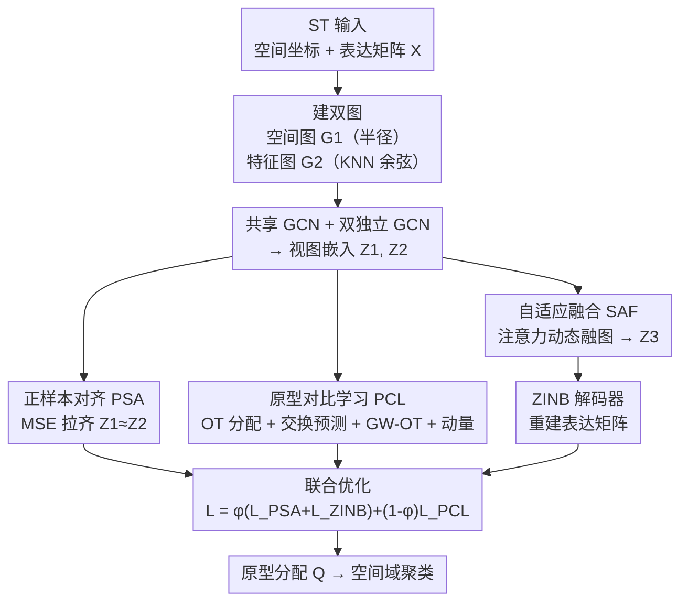

# Multi-View Hierarchical Alignment Learning for Spatial Transcriptomics

**会议**: CVPR 2026  
**论文**: [CVF Open Access](https://openaccess.thecvf.com/content/CVPR2026/html/Zhu_Multi-View_Hierarchical_Alignment_Learning_for_Spatial_Transcriptomics_CVPR_2026_paper.html)  
**代码**: 无  
**领域**: 计算生物学 / 空间转录组 / 多视图聚类  
**关键词**: 空间转录组、空间域识别、多视图对比聚类、原型对比学习、最优传输

## 一句话总结
MHAL 把空间转录组的"空间坐标视图"和"基因表达视图"做两级对齐——样本级用 MSE 拉齐同一 spot 的双视图嵌入，语义级用一组可学习原型 + 最优传输做交换预测对比，再配自适应图融合和 ZINB 解码器，在 DLPFC、人乳腺癌、小鼠脑前部三套数据集上的空间域识别（ARI）显著超过 11 个现有方法。

## 研究背景与动机
**领域现状**：空间转录组（Spatial Transcriptomics, ST）同时给出每个 spot 的空间坐标和基因表达谱，"空间域识别"（spatial domain identification，本质是给 spot 做聚类）是核心任务。主流做法是用图神经网络（GNN）把空间邻接和表达相似性建成图再做无监督聚类，代表方法有 SpaGCN、DeepST、GraphST、MAFN、stGCL 等。

**现有痛点**：作者指出两个一直没解决的硬伤。其一，多数方法把"空间视图"和"表达视图"各自独立地学嵌入，由于视图各自带噪声、结构信息不完整，**同一个 spot 在两个视图里学出来的嵌入往往对不上**——也就是没有样本级（sample-level）的跨视图一致性，导致判别力下降。其二，现有方法**缺语义级监督**：GCN 只能捕捉局部邻域模式，且容易过平滑（oversmoothing）/过挤压（over-squashing）破坏结构，而且 SpaGCN 这类方法隐含假设"空间邻居一定同类"，没有任何机制去刻画全局语义关系。

**核心矛盾**：局部一致（GCN 擅长）和全局语义判别（需要高层抽象）之间缺一座桥。原型（prototype）建模本可提供这种语义抽象，但现有方法很少把原型和节点表示对齐，语义一致性很弱。

**本文目标**：在一个端到端框架里同时做到两件事——(1) 让两个视图对同一个 spot 给出一致的嵌入；(2) 引入显式的语义级监督，让聚类结构在全局上更清晰可分。

**切入角度**：把"对齐"分成两个层级来做（hierarchical alignment）——样本级负责局部一致、语义级负责全局判别，两级递进。

**核心 idea**：样本级用最朴素的 MSE 直接拉齐双视图嵌入（positive sample alignment），语义级用一组可学习原型作语义锚点、通过最优传输（OT）做跨视图交换预测的对比学习（prototype contrastive learning），两级对齐合起来既保证局部一致又强化全局语义判别。

## 方法详解

### 整体框架
MHAL 的输入是一张组织切片的 ST 数据（spot 的空间坐标 + 基因表达矩阵 $\mathbf{X}\in\mathbb{R}^{N\times D}$），输出是每个 spot 的聚类标签（空间域）。整条 pipeline 是这样转的：先从空间坐标和基因表达分别建两张图（空间图 $\mathbf{G}_1$、特征图 $\mathbf{G}_2$）；用一个共享 GCN 编码器学出 intra-view 初表示，再各自用独立 GCN 精炼成空间视图嵌入 $\mathbf{Z}_1$、表达视图嵌入 $\mathbf{Z}_2$；在这两个嵌入上**样本级**做正样本对齐（PSA，MSE 拉齐），**语义级**做原型对比学习（PCL，OT 交换预测）；同时用自适应融合（SAF）把两张图按节点动态加权合成一张融合图、学出融合表示 $\mathbf{Z}_3$；最后把 $\mathbf{Z}_3$ 喂给 ZINB 解码器重建基因表达矩阵作正则。训练时 PSA、PCL、ZINB 三个损失联合优化，推理时用原型分配 $Q$ 得到聚类结果。

### 关键设计

**1. 正样本对齐：用一行 MSE 强制双视图描述同一个 spot**

针对"同一 spot 在空间视图和表达视图里嵌入对不上"这个痛点，MHAL 没有去搞复杂的相关矩阵对齐，而是直接把两视图对应节点的嵌入当成天然的正样本对，用最朴素的均方误差拉近：

$$\mathcal{L}_{PSA} = \lVert \mathbf{Z}_1 - \mathbf{Z}_2 \rVert_2^2$$

其中 $\mathbf{Z}_1$、$\mathbf{Z}_2$ 分别是空间图、特征图经独立 GCN 精炼后的节点嵌入。之所以有效：它直接在隐空间里把"同一个细胞/spot 的两种描述"对齐，让模型无论从哪个视图看都给出相似表示，既增强了视图一致性又提升判别力，还顺带提高了簇内紧致度（within-cluster compactness）。简单粗暴但作者实测它是必要的——消融去掉它 ARI 会掉。

**2. 原型级对比学习：用最优传输把节点和语义原型对齐**

这是补"语义级监督"短板的核心。MHAL 设 $S$ 个可学习原型代表语义类别，节点到原型的软分配不是简单算 softmax，而是解一个带熵正则的最优传输问题：

$$\min_{\pi\in\Pi}\ \langle\pi, -\mathbf{R}\rangle - \epsilon H(\pi)$$

其中 $\mathbf{R}=\mathbf{Z}\mathbf{S}^\top$ 是节点投影到原型上的上下文表示（当代价矩阵取 $-\mathbf{R}$），$\Pi$ 受节点边缘分布 $\mu$ 和原型边缘分布 $\nu$ 约束，用可扩展的 Sinkhorn-Knopp 高效求解，归一化得软分配 $Q$。关键在于**交换预测（swapped prediction）**机制做跨视图一致性：第一视图的 OT 分配 $Q_1$ 当作第二视图预测 $P_2^\tau$ 的伪标签，反之亦然，预测分布 $P^\tau$ 是节点嵌入与原型相似度的温度 softmax（式 10），对比损失为对称交叉熵：

$$\mathcal{L}_{PCL} = -\frac{1}{2N}\sum_{n=1}^N\left(\langle\mathbf{q}_{1,n}, \log\mathbf{p}_{2,n}^\tau\rangle + \langle\mathbf{q}_{2,n}, \log\mathbf{p}_{1,n}^\tau\rangle\right)$$

更进一步，作者把原型之间的关系编成原型图 $\mathbf{B}=\mathbf{P}^\top\mathbf{P}$，用 **Gromov–Wasserstein 最优传输（GW-OT）** 把数据图 $\mathbf{A}$ 和原型图 $\mathbf{B}$ 在拓扑上对齐（式 12–13），再用 Fused GW-OT（式 14，融合系数 $\alpha=0.7$）同时利用上下文节点嵌入 $\mathbf{R}$ 和图结构 $\mathbf{A}$ 得到最终分配。为什么有效：原型当语义锚点，迫使节点不只学局部邻域、还要服从全局一致的语义结构，从而长出边界清晰、簇内紧致的聚类。消融里它是贡献最大的模块（去掉后某些切片 ARI 直接腰斩）。

**3. 原型动量更新：让语义锚点随训练平稳演化**

原型图和边缘分布如果每步硬更新会抖动，作者用指数滑动平均（EMA）平稳地更新它们。原型图 $\mathbf{B}$ 初始化为单位阵，按当前预测矩阵 $\mathbf{P}$ 更新：

$$\mathbf{B}^{(t)} = \beta_1\mathbf{B}^{(t-1)} + (1-\beta_1)(\mathbf{P}^\top\mathbf{P})$$

边缘分布 $\nu$（代表期望的各簇大小）均匀初始化后类似更新：$\nu^{(t)}=\beta_2\nu^{(t-1)}+(1-\beta_2)(\mathbf{P}^\top\mathbf{1}_N/N)$，动量系数 $\beta_1=0.9$、$\beta_2=0.99$。这样原型结构在整个训练过程中稳定且自适应地演化，避免 OT 分配随单批预测剧烈漂移。它服务于设计 2，是 PCL 能稳定收敛的保障。

**4. 自适应图融合 + ZINB 重建：动态配权融图、用生成模型抑制 ST 噪声**

空间图和特征图的可靠性因 spot 而异，固定权重融合不合理。SAF 用多头注意力在堆叠的 $(\mathbf{Z}_1,\mathbf{Z}_2)$ 上算出节点级注意力矩阵 $\mathbf{A}_{\text{attn}}$，对所有节点平均得全局平衡系数 $\eta$（式 18），融合邻接矩阵为 $\mathbf{A}_f=\eta\mathbf{A}_2+(1-\eta)\mathbf{A}_1$；融合特征 $\mathbf{H}$ 再过一层 GCN 得拓扑感知嵌入 $\mathbf{Z}_f$，配合自注意力增强的 $\mathbf{Z}_1^a,\mathbf{Z}_2^a$，经权重感知层（$\ell_2$ 归一化的 $\tilde{\mathbf{w}}$）加权融合、最后 MLP 投影出终表示 $\mathbf{Z}_3$（式 21–22）。

为应对 ST 数据离散、稀疏、多噪声的特性，作者把 $\mathbf{Z}_3$ 喂给 **ZINB（零膨胀负二项）解码器** 重建基因表达矩阵——假设表达 $x$ 服从 ZINB 分布（式 23–24，输出零膨胀参数 $\pi_{ij}$、均值 $v_{ij}$、离散度 $\theta_{ij}$），用负对数似然作重建损失 $\mathcal{L}_{ZINB}$。ZINB 专门刻画"大量零 + 过离散计数"的基因表达分布，比普通 MSE 重建更贴合 ST 数据的统计本质，从而抑制噪声、稳住表示。

### 损失函数 / 训练策略
总损失把样本级对齐、语义级对比、表达重建三者加权组合：

$$\mathcal{L} = \varphi(\mathcal{L}_{PSA} + \mathcal{L}_{ZINB}) + (1-\varphi)\mathcal{L}_{PCL}$$

其中 $\varphi$ 是权重因子。训练用 PyTorch 2.1.0、单张 RTX 5090D，学习率固定 0.001、权重衰减 $5\times10^{-4}$，每个数据集训练 250 epoch 后记录指标；预处理跟 MAFN 一致（去掉组织主区外的 spot，用 SCANPY 保留 3000 个高变基因）。

## 实验关键数据

### 主实验
评测三套基准：DLPFC（8 切片，33,538 基因，5–7 个标注区域）、10x Visium 人乳腺癌 HBC（20 区域）、小鼠脑前部 MBA（52 区域），指标为 ARI（Adjusted Rand Index，聚类与标注的一致性，越高越好）。对比 11 个方法（SpaGCN / DeepST / GraphST / MAFN / stGCL / stCluster / Spatial-MGCN / Tsctc 等）。

| 数据集 | 本文 MHAL | stGCL | MAFN | Tsctc | 说明 |
|--------|-----------|-------|------|-------|------|
| DLPFC-151507 | **78.94** | 74 | 68 | 68.53 | +4.94 vs stGCL |
| DLPFC-151671 | **82.45** | 67 | 82 | 72.11 | 比 stGCL/stCluster 高 14–17% |
| DLPFC-151672 | **86.04** | 82 | 76 | 75.36 | 全场最高 |
| HBC | **68.96** | 68 | - | 63.83 | +1.42 vs 最强基线 |
| MBA | **49.30** | 45 | - | 44.82 | 显著超 stGCL(38.42)/stCluster(31.65) |

MHAL 在 DLPFC 的 8 个切片上几乎全面领先，HBC、MBA 上也都拿到最佳 ARI；ARI 箱线图显示其中位数更高、分布更集中，说明跨切片更稳定。

### 消融实验
在 10 个数据集上逐模块拆解（节选三个代表切片 + 两套数据集，单位 ARI %）：

| 配置 | 151672 | 151507 | HBC | MBA | 说明 |
|------|--------|--------|-----|-----|------|
| Full (Ours) | **86.04** | **78.94** | **68.96** | **49.30** | 完整模型 |
| w/o $\mathcal{L}_{PCL}$ | 24.73 | 27.77 | 53.31 | 30.46 | 去原型对比，崩塌最严重 |
| w/o $\mathcal{L}_{PSA}$ | 76.38 | 62.56 | 66.92 | 42.09 | 去样本对齐，普遍掉点 |
| w/o SAF | 39.26 | 49.14 | 58.74 | — | 去自适应融合，大幅下降 |
| w/o $\mathcal{L}_{ZINB}$ | 79.25 | 56.01 | 61.70 | 42.48 | 去 ZINB 解码器 |

### 关键发现
- **原型对比学习（PCL）贡献最大**：去掉它后 151672 从 86.04 暴跌到 24.73、151507 从 78.94 跌到 27.77，几乎丧失聚类能力——印证了"语义级监督"是这套方法的命门。
- 样本对齐（PSA）和自适应融合（SAF）各自去掉都稳定掉点（如 SAF 去掉后 151672 掉到 39.26），说明局部一致和动态融图都有实质贡献。
- ⚠️ 关于 ZINB：正文有一句"removing $\mathcal{L}_{ZINB}$ leads to an improvement of over 9.9% in average performance"，但消融表里 w/o $\mathcal{L}_{ZINB}$ 在所有列都低于 Full（如 151507 56.01 < 78.94），表述与表格自相矛盾，**以表格为准**——ZINB 实际是有正贡献的。
- 下游可视化（UMAP / 轨迹推断 / marker 基因分布）显示 MHAL 簇间分离更清晰、皮层分层结构（layer 3/4/5/6 + WM）更有序，重建的 marker 基因空间分布也更贴合既有生物学结论。

## 亮点与洞察
- **"两级对齐"框架干净利落**：样本级用最朴素的 MSE、语义级用 OT 交换预测，一个管局部一致、一个管全局判别，分工明确且消融证明缺一不可——这种"先拉齐个体、再对齐语义"的层级思路可迁移到任何多视图/多模态聚类。
- **把 SwAV 式交换预测 + GW-OT 图对齐搬进 ST**：用原型当语义锚点、最优传输求软分配，再用 Gromov–Wasserstein 把数据图和原型图在拓扑层面对齐，是这篇把"图结构语义"显式注入对比学习的巧点。
- **ZINB 解码器贴合数据统计本质**：ST 计数数据天然零膨胀 + 过离散，用 ZINB 而非 MSE 重建是领域内"对的工具"，对抑制稀疏噪声很关键。

## 局限与展望
- 方法以 ARI 为唯一主指标，缺 NMI/ACC 等多指标交叉验证，对"是否只是 ARI 友好"留有疑问。
- 模块偏多（双 GCN + PSA + PCL + GW-OT + 动量 + SAF + ZINB），超参（$\alpha=0.7$、$\beta_1=0.9$、$\beta_2=0.99$、$\varphi$、原型数 $S$）不少，论文未给充分的敏感性分析，复现与调参成本偏高。
- 正文关于 ZINB 消融的表述与表格冲突（见上），写作存在自相矛盾，削弱了说服力。
- 只在 DLPFC/HBC/MBA 三套常规基准上验证，对更大规模、更高分辨率（如 Stereo-seq、Visium HD）数据的可扩展性未知。

## 相关工作与启发
- **vs MAFN / stGCL（同类 ST 聚类）**：它们也做跨视图融合或异构对比，但缺显式的样本级 MSE 对齐和原型级语义监督；MHAL 用两级对齐补齐这两点，DLPFC 多切片上普遍 +5%~+17% ARI。
- **vs SpaGCN / DeepST / GraphST**：这些方法隐含"空间邻居同类"假设、只学局部结构，遇到边界模糊就失效；MHAL 用原型 + GW-OT 引入全局语义关系，边界识别更清晰。
- **vs SwAV / 原型对比学习一脉**：MHAL 把交换预测从图像自监督搬到 ST 图数据，并叠加 GW-OT 图拓扑对齐和动量原型更新，是对原型对比在图聚类上的具体化。

## 评分
- 新颖性: ⭐⭐⭐⭐ 两级对齐 + GW-OT 原型对齐的组合在 ST 聚类里较新，但各组件多为已有技术的迁移拼装
- 实验充分度: ⭐⭐⭐ 三数据集 + 11 基线 + 完整消融覆盖到位，但只用单一 ARI 指标、超参敏感性缺失
- 写作质量: ⭐⭐⭐ 框架讲清楚了，但 ZINB 消融表述自相矛盾、公式排版（OCR）较乱
- 价值: ⭐⭐⭐⭐ 在空间域识别上拿到稳定 SOTA，两级对齐思路对多视图聚类有借鉴价值

<!-- RELATED:START -->

## 相关论文

- [\[CVPR 2026\] HyperST: Hierarchical Hyperbolic Learning for Spatial Transcriptomics Prediction](hyperst_hierarchical_hyperbolic_learning_for_spatial_transcriptomics_prediction.md)
- [\[CVPR 2026\] Bulk RNA-seq Guided Multi-modal Detection of Anomalous Regions in Human Cancer via Spatial Transcriptomics](bulk_rna-seq_guided_multi-modal_detection_of_anomalous_regions_in_human_cancer_v.md)
- [\[CVPR 2026\] Predicting Spatial Transcriptomics from Histology Images via High-Order Multi-Cell Interaction Modeling](predicting_spatial_transcriptomics_from_histology_images_via_high-order_multi-ce.md)
- [\[CVPR 2026\] FEAST: Fully Connected Expressive Attention for Spatial Transcriptomics](feast_fully_connected_expressive_attention_for_spatial_transcriptomics.md)
- [\[CVPR 2026\] Cross-Slice Knowledge Transfer via Masked Multi-Modal Heterogeneous Graph Contrastive Learning for Spatial Gene Expression Inference](cross-slice_knowledge_transfer_via_masked_multi-modal_heterogeneous_graph_contra.md)

<!-- RELATED:END -->
