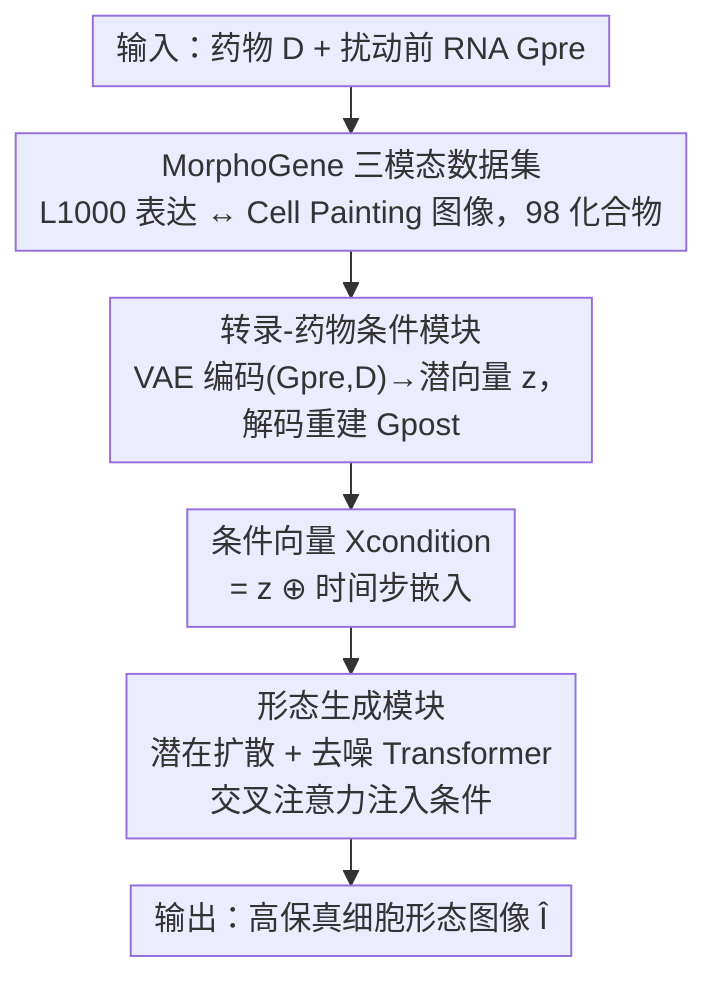

# TRIDENT: A Trimodal Cascade Generative Framework for Drug and RNA-Conditioned Cellular Morphology Synthesis

**会议**: CVPR 2026  
**论文**: [CVF Open Access](https://openaccess.thecvf.com/content/CVPR2026/html/Peng_TRIDENT_A_Trimodal_Cascade_Generative_Framework_for_Drug_and_RNA-Conditioned_CVPR_2026_paper.html)  
**代码**: 无  
**领域**: 计算生物学 / 扩散模型  
**关键词**: AI虚拟细胞, 细胞形态合成, 潜在扩散, 转录组-表型映射, 条件生成

## 一句话总结
TRIDENT 用「VAE 编码（药物+扰动前 RNA）→ 潜在条件 z → Diffusion Transformer 生成细胞形态」的级联框架，首次显式建模「RNA→形态」这条因果链，在自建的 MorphoGene 三模态数据集上把 FID 相比 SOTA 降低 5–7 倍，并能泛化到未见过的化合物。

## 研究背景与动机
**领域现状**：构建 AI 虚拟细胞（AI Virtual Cell, AIVC）需要刻画「扰动（药物/基因）→ 转录响应（RNA）→ 表型变化（细胞形态）」这条完整的因果链路。L1000 转录谱测序和 Cell Painting 形态成像两项高通量技术，已经分别催生了一批「扰动→RNA」和「扰动→形态」的预测模型，扩散模型与 VAE 在生物图像合成、RNA 重建上也展示了潜力。

**现有痛点**：现有方法几乎都只建模**直接关联**——要么 Perturbation→RNA（GEARS、chemCPA、STATE、scGen 等），要么 Perturbation→Morphology（MorphDiff、MorphoDiff、IMPA、Mol2Image 等）。它们**绕过了中间的分子状态**，把「转录变化如何编排形态改变」当成黑箱，也就是说彻底**忽略了 RNA→Morphology 这条关键的因果链**。

**核心矛盾**：细胞的真实生物学机制是「分子事件（RNA）机制性地驱动表型结果（形态）」，而把扰动直接映射到形态，相当于跳过了驱动表型的中间因果变量。缺了这一环，模型既不可解释、也难以把虚拟细胞当作一个「分子事件驱动表型」的整合系统去模拟。

**本文目标**：学习条件概率 $p(I \mid G_{pre}, D)$——在给定药物扰动 $D$ 和扰动前基因表达 $G_{pre}$ 的条件下，合成高保真细胞形态图像 $I$，并让生成过程显式经由「预测出的扰动后转录组」来引导。

**切入角度**：与其让扰动一步跳到形态，不如先把（药物 + 扰动前 RNA）压进一个**能预测扰动后转录组 $G_{post}$ 的潜在向量** $z$，再让 $z$ 作为条件去引导图像扩散。这样 $z$ 天然携带了分子层面的因果信息，图像生成就被强制对齐到「正确的转录程序」。

**核心 idea**：用一个 VAE 把「药物+RNA」编码成「能重建扰动后转录组」的条件 $z$，再用 $z$ 去条件化一个潜在扩散 Transformer 合成形态——把「转录组→表型」这条被忽略的映射显式塞进生成管线。

## 方法详解

### 整体框架
TRIDENT 是一个**两阶段级联**生成框架。第一阶段是 **Transcription-Drug Condition Module**：一个 VAE 把扰动前基因表达 $G_{pre}$ 和药物分子表示 $D$（如 SMILES）编码成潜在条件向量 $z$，并用 $z$ 去**重建扰动后基因表达** $G_{post}$，从而逼迫 $z$ 编码进真实的分子因果信息。第二阶段是 **Morphology Generation Module**：在一个预训练图像 VAE 压缩出的潜在空间里跑潜在扩散，去噪 Transformer 通过**交叉注意力**反复注入条件向量 $X_{condition}$（由 $z$ 与时间步嵌入相加而成），把噪声逐步还原成细胞形态潜表示，再经图像解码器还原成 512×512 RGB 图像。整条管线端到端联合训练，输入是（药物 $D$、扰动前 RNA $G_{pre}$），输出是一张该药物作用后的细胞形态图。

### 关键设计

**1. MorphoGene 三模态配对数据集：为「RNA→形态」造一份可训练的对应关系**

要显式学「转录组→表型」，前提是有一份把 RNA 和形态**配对**起来的数据，而此前两条数据流是分裂的。作者用 98 个小分子药物作为「桥梁」，把 BBBC021（MCF7 乳腺癌细胞系）的 Cell Painting 形态图与 L1000 转录谱对齐：形态侧把 DAPI（蓝）、tubulin（绿）、actin（红）三通道合成 RGB 并裁到 512×512；转录侧把每个化合物对应的所有 L1000 谱**平均成一个代表向量**。再把每个化合物的图像扩增到 1000 张，得到 98×1000 = 98,000 个三模态样本（药物 $D$、图像 $I$、扰动前/后表达 $G_{pre}, G_{post}$）。为评估泛化，作者把 98 个化合物切成两组：**44 个**两库都有的化合物按 8:2 划为训练集 + 同分布（ID）测试集；**剩下 54 个**完全留出做分布外（OOD）测试集，专门考验对未见化合物的外推。这份数据集本身就是论文的核心贡献之一——没有它，RNA→形态的监督信号无从谈起。

**2. Transcription-Drug 条件模块：用「能预测 Gpost」逼迫潜向量 z 携带分子因果信息**

如果只是把药物和 RNA 拼起来当条件，无法保证这个条件真的编码了「扰动会引起什么分子变化」。本模块设计成一个 VAE：RNA 与药物先各自经编码器投影成嵌入 $X_{rna}=E_{rna}(G_{pre})$、$X_{drug}=E_{drug}(D)$，拼接后送进扰动编码器 $E_{perturb}$ 参数化后验高斯 $q_\phi(z \mid G_{pre}, D)$：

$$[\mu_z, \log \sigma_z^2] = E_{perturb}([X_{rna}, X_{drug}])$$

再用重参数化采样 $z = \mu_z + \sigma_z \odot \epsilon_z$。关键在于**正则约束**：解码器 $D_{perturb}$ 被要求从 $z$ 预测出**扰动后**基因表达 $G_{post}$（也建模为高斯），整个模块用 ELBO 训练：

$$L_{VAE} = \mathbb{E}_{q_\phi(z|G_{pre},D)}[-\log p_\psi(G_{post}|z)] + D_{KL}(q_\phi(z|G_{pre},D)\,\|\,p(z))$$

其中先验 $p(z)=\mathcal{N}(0,I)$。这个「重建 $G_{post}$」的目标是设计的灵魂：它强迫 $z$ 成为一个**紧凑且能预测扰动后分子状态**的表示，把初始状态、扰动、分子结果这条因果链压进同一个向量。实验中预测转录组与真值的 Pearson 相关高达 0.957，证明这个约束确实让 $z$ 学到了生物学上正确的转录程序，而不只是图像的附属编码。

**3. 形态生成模块：用交叉注意力把分子条件反复"注射"进扩散去噪**

拿到富含因果信息的 $z$ 后，要让它真正引导高分辨率图像合成。作者在预训练图像 VAE 压出的潜空间里跑潜在扩散（LDM）：前向过程按方差表 $\{\beta_t\}$ 给初始图像潜码 $X^0_{image}$ 逐步加噪，可闭式采样 $X^t_{image} = \sqrt{\bar\alpha_t}X^0_{image} + \sqrt{1-\bar\alpha_t}\,\epsilon$；去噪 Transformer $f_\theta$ 学着预测加进去的噪声 $\epsilon$。条件注入是这里的核心机制——条件向量 $X_{condition}$ 由 $z$ 与时间步嵌入 $X_{time}$ **逐元素相加**得到，然后去噪 Transformer 的 **N 个堆叠 block 每一层都用交叉注意力**把它喂进来：图像表示出 query $Q$，$X_{condition}$ 出 key $K$ 和 value $V$。这种「贯穿整个网络深度反复施加交叉注意力」的设计，是逼迫模型学会「RNA-药物条件↔形态特征」复杂关联的关键——条件不是只在入口注入一次，而是在每一层都重新对齐。训练目标是简化 L2：

$$L_{LDM} = \mathbb{E}_{t,X^0_{image},\epsilon,z}\big[\|\epsilon - f_\theta(\hat{X}^t_{image}, X_{condition})\|^2\big]$$

### 损失函数 / 训练策略
端到端联合优化两模块之和 $L_{TRIDENT} = L_{VAE} + L_{LDM}$。这样训练同时保证 $z$ 既能预测分子结果 $G_{post}$、又对引导图像合成有效。推理时从先验 $\hat{X}^T_{image} \sim \mathcal{N}(0,I)$ 起步，先由条件模块算出 $z$，再迭代去噪 $t=T,\dots,1$：

$$\hat{X}^{t-1}_{image} = \frac{1}{\sqrt{\alpha_t}}\Big(\hat{X}^t_{image} - \frac{\beta_t}{\sqrt{1-\bar\alpha_t}}f_\theta(\hat{X}^t_{image}, X_{condition})\Big) + \sigma_t \epsilon'$$

最后由图像解码器 $D_{image}$ 还原成形态图。所有模型在 MorphoGene 上训练 10,000 步。

## 实验关键数据

### 主实验
评测指标为 FID、KID、IS（在此任务下三者**越低越好**——IS 越低说明模型为给定条件稳定生成了特定受限表型，而非发散到过宽的形态分布）。对比 MorphoDiff 与微调过的无条件 Stable Diffusion。

| 测试集 | 指标 | TRIDENT | MorphoDiff | Stable Diffusion |
|--------|------|---------|------------|------------------|
| ID | FID↓ | **49.770** | 250.290 | 354.576 |
| ID | KID↓ | **0.013** | 0.248 | 0.378 |
| ID | IS↓ | **2.240** | 2.614 | 2.792 |
| OOD | FID↓ | **126.150** | 387.135 | 393.129 |
| OOD | KID↓ | **0.222** | 0.436 | 0.543 |
| OOD | IS↓ | **2.523** | 2.747 | 2.932 |

ID 上 FID 相比 baseline 提升 5–7 倍（49.8 vs 250 / 355），OOD 上对未见化合物仍比 SOTA 好 3 倍以上（126 vs 387 / 393）。定性上 TRIDENT 能复现药物特异表型（如 cytochalasin b 的低细胞密度），而两个 baseline 都坍缩成通用的高密度单层，说明它们根本没学会条件引导。

### 消融实验

| 配置 | ID FID↓ | ID KID↓ | OOD FID↓ | OOD KID↓ | 说明 |
|------|---------|---------|----------|----------|------|
| TRIDENT (Full) | **49.770** | **0.013** | **126.150** | **0.222** | 完整模型 |
| w/o RNA | 115.770 | 0.132 | 194.239 | 0.293 | 去掉 RNA 条件，仅用药物 |

去掉 RNA 条件后 ID FID 从 49.8 飙到 115.8（KID 0.013→0.132），OOD FID 从 126 升到 194，证明 **RNA 作为中间分子状态是高保真合成不可或缺的一环**，验证了核心假设。

### 关键发现
- **RNA 条件是性能命脉**：消融显示去掉 RNA 后 ID FID 翻倍多、KID 涨约 10 倍，是所有设计里贡献最大的，直接坐实「RNA→形态」这条链的价值。
- **学到的是真生物学，不是像素拟合**：预测转录组与真值 Pearson 相关 0.957；对 docetaxel 的功能富集分析与其已知 MOA（有丝分裂抑制、促凋亡）完全吻合——下调基因富集于「细胞生长调控/DNA 复制」，上调基因富集于「凋亡信号通路」，且生成图像确实呈现稀疏细胞群（细胞死亡增多）。
- **跨模态一致性可验证**：生成图经 ViT 嵌入 + LDA 投影后按 MOA 形成清晰可分簇（如 staurosporine 的丝状形态 vs emetine 的圆缩稀疏表型分离）；UMAP 上生成图与真实图高度交织、共占同一流形；CellProfiler 的 AreaOccupied 等可解释指标分布也与真值对齐。

## 亮点与洞察
- **「让条件去预测中间因果变量」是可迁移的范式**：不是把扰动直接映射到终点，而是逼条件向量 $z$ 重建中间分子态 $G_{post}$，从而把因果信息塞进条件。任何「A→C 但真实机制是 A→B→C」的跨模态生成都可借鉴——让潜条件附带预测 B 的辅助任务。
- **数据集即贡献**：MorphoGene 用「化合物」作桥把分裂的转录组库和形态成像库对齐，并刻意切出 54 个 OOD 化合物，是这类「虚拟细胞」研究稀缺的配对资源。
- **逐层交叉注意力强制条件对齐**：条件不在入口注入一次，而在去噪 Transformer 每层重新交叉注意，是 baseline「坍缩到通用形态」与 TRIDENT「捕获药物特异表型」的分水岭。
- **生物可解释性验证做得扎实**：用转录相关性、功能富集、ViT/LDA/UMAP、CellProfiler 多角度证明生成结果在生物学上正确，而非仅 FID 漂亮。

## 局限与展望
- **数据规模和细胞系单一**：只覆盖 98 个化合物、单一 MCF7 细胞系，OOD FID（126）相比 ID（50）仍明显偏高，对全新机制化合物的外推能力有上限。
- **RNA 被平均成单一代表向量**：每个化合物把所有 L1000 谱平均成一个向量，抹掉了剂量/时间/单细胞异质性，限制了对细粒度剂量-响应或细胞亚群的刻画。
- **仅 2D 形态、固定通道合成**：把多通道荧光直接合成 RGB 并裁到 512×512，未建模 3D 结构或单通道生物学意义；扩散 10,000 步训练，推理迭代成本仍较高。
- **改进方向**：引入单细胞分辨率 RNA、多细胞系联合训练、剂量/时间作为额外条件，以及把「预测 $G_{post}$」换成更强的转录组 foundation model 编码器，可能进一步提升 OOD 泛化。

## 相关工作与启发
- **vs MorphoDiff / MorphoDiff / IMPA / Mol2Image（Perturbation→Morphology）**: 它们把扰动直接映射到形态、绕过分子中间态，把 RNA→形态当黑箱；TRIDENT 显式插入「预测 $G_{post}$ 的条件 VAE」，把因果链补全，FID 因此降 5–7 倍。
- **vs GEARS / chemCPA / STATE / scGen（Perturbation→RNA）**: 这类模型只学到分子层变化、止步于转录组，不接表型；TRIDENT 复用了「预测转录响应」的能力，但把它当作图像生成的条件枢纽而非终点。
- **vs 无条件 Stable Diffusion（微调）**: 缺乏分子条件引导，只能生成通用高密度单层、无法复现药物特异表型，凸显「正确条件 + 逐层注入」比「更强生成 backbone」更关键。

## 评分
- 新颖性: ⭐⭐⭐⭐⭐ 首个显式建模「扰动→RNA→形态」完整三模态因果链的级联生成框架，问题定义本身就是贡献
- 实验充分度: ⭐⭐⭐⭐ 主结果 + 消融 + 转录相关性 + 功能富集 + ViT/UMAP/CellProfiler 多维验证扎实，但仅单细胞系、98 化合物规模偏小
- 写作质量: ⭐⭐⭐⭐ 公式与图示清晰，因果动机讲得透；部分实现细节（编码器结构、超参）依赖补充材料
- 价值: ⭐⭐⭐⭐⭐ 为 AI 虚拟细胞提供了可用的 in silico 工具和配对数据集，跨模态因果建模思路有普适启发

<!-- RELATED:START -->

## 相关论文

- [\[ICML 2025\] Geometric Generative Modeling with Noise-Conditioned Graph Networks](../../ICML2025/computational_biology/geometric_generative_modeling_with_noise-conditioned_graph_networks.md)
- [\[CVPR 2026\] Bulk RNA-seq Guided Multi-modal Detection of Anomalous Regions in Human Cancer via Spatial Transcriptomics](bulk_rna-seq_guided_multi-modal_detection_of_anomalous_regions_in_human_cancer_v.md)
- [\[ICML 2026\] From Feasible to Practical: Pareto-Optimal Synthesis Planning](../../ICML2026/computational_biology/from_feasible_to_practical_pareto-optimal_synthesis_planning.md)
- [\[NeurIPS 2025\] Pharmacophore-Guided Generative Design of Novel Drug-Like Molecules](../../NeurIPS2025/computational_biology/pharmacophore-guided_generative_design_of_novel_drug-like_molecules.md)
- [\[CVPR 2026\] BiGMINT: Biologically-guided Hierarchical Multimodal Integration for Modeling Multiple Compound Activities in Drug Discovery](bigmint_biologically-guided_hierarchical_multimodal_integration_for_modeling_mul.md)

<!-- RELATED:END -->
