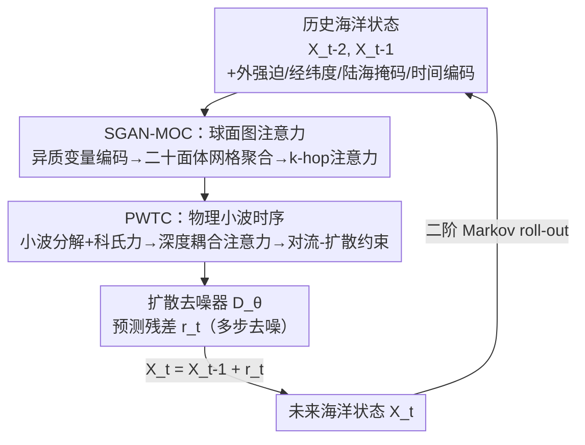

# PhyOceanCast: Global Ocean Forecasting with Physics-Informed Diffusion

**会议**: CVPR 2026  
**论文**: [CVF Open Access](https://openaccess.thecvf.com/content/CVPR2026/html/Li_PhyOceanCast_Global_Ocean_Forecasting_with_Physics-Informed_Diffusion_CVPR_2026_paper.html)  
**代码**: 无  
**领域**: 地球科学 / 时空预测 / 扩散模型  
**关键词**: 全球海洋预报, 物理约束扩散, 球面图注意力, 小波时序分解, 对流-扩散

## 一句话总结
PhyOceanCast 把全球海洋预报建模成一个**残差扩散**问题，用球面图注意力网络（SGAN-MOC）解决"高纬投影畸变 + 变量耦合"、用物理小波时序模块（PWTC）解决"多尺度动力学 + 守恒约束"，一次预报 145 个海洋变量、36 个深度层，30 天预报 RMSE 相对最优 baseline 降低约 13.7%。

## 研究背景与动机
**领域现状**：传统全球海洋预报系统（GOFS）精度高但计算极贵，且没充分利用日益增长的历史观测。深度学习把天气/海洋预报推进了一大步——GraphCast 比数值方法快上千倍、WenHai 做出涡分辨率的海洋预报——但这些模型大多是**确定性**的，给定有限初始网格只输出单一未来，无法刻画海洋本质上的混沌与不可约不确定性。

**现有痛点**：作者指出当前时空预测方法对海洋有三个系统性缺陷。其一，把温度、盐度、流速当成**互相独立的变量**分开处理，违背了把它们绑在一起的状态方程（equation of state），破坏密度驱动环流、热盐过程这类跨深度耦合的物理一致性。其二，忽略**球面几何**：等距圆柱投影在两极造成最高 5 倍的面积畸变，平面卷积也处理不了经度环绕（国际日期变更线）。其三，**单尺度时序建模**撑不起海洋的跨尺度动力学——内波是短时振荡、中尺度涡持续数月、热盐环流跨越百年，单尺度要么把高频信号抹平、要么无法在尺度之间传递信息，导致违反守恒律。

**核心矛盾**：现有工作只能各破其一。GraphCast 的二十面体网格能处理球面拓扑，但用**各向同性**处理掩盖了水平/垂直运动的尺度分离与层结；Pangu-Weather 有多变量逻辑但没有面向海洋约束的显式耦合机制；扩散模型能给概率预报却无法强制物理一致。没有任何框架同时做到"各向异性球面几何 + 跨深度变量耦合 + 多尺度时序演化 + 守恒律"。

**本文目标 / 切入角度**：作者押注**概率式（扩散）预报**这条路线——海洋是混沌系统，确定性模型从有限初值出发必然丢失自然复杂性，扩散的随机生成天然适配集合预报与不确定性量化。在此基础上把领域物理（状态方程耦合、球面拓扑、对流-扩散方程、科氏力）显式塞进网络结构和损失，而不是当成软正则。

**核心 idea**：用一个**物理约束的残差扩散模型**统一全球海洋概率预报——SGAN-MOC 负责"在球面上把多变量耦合起来"，PWTC 负责"在时间上把多尺度动力学拆开并守恒地重组"，扩散去噪迭代地生成物理上可信的集合预报。

## 方法详解

### 整体框架
PhyOceanCast 不直接预测下一时刻的绝对海洋状态，而是预测**相邻时刻的残差** $r_t = X_t - X_{t-1}$，并用二阶 Markov 假设把条件分布写成 $p(X_t \mid X_{t-1}, X_{t-2})$。训练时给目标残差加噪 $\tilde{r}_t = r_t + \sigma\epsilon$，训练去噪器 $D_\theta$ 把干净残差恢复出来；推理时从噪声出发多步去噪生成残差，再 $X_t = X_{t-1} + r_t$ 做 roll-out 往前滚。每个输入状态 $X_{t-i} \in \mathbb{R}^{V\times H\times W}$（$V=145$ 个变量），还附带外强迫项 $\mathcal{F}$、经纬度、陆海掩码以及编码年内时间位置的 $\tau_{t-i}$。

去噪器内部串了两个互补模块：**SGAN-MOC** 先在球面上做跨变量的空间耦合（保拓扑、去畸变），**PWTC** 再在时间上做多尺度分解 + 深度耦合 + 对流-扩散约束。两个模块的输出共同条件化扩散去噪，输出当前去噪阶段的残差估计。

### 关键设计

**1. 残差扩散预报框架：用概率生成代替确定性回归**

针对"确定性模型从有限初值无法刻画海洋混沌"这个根本痛点，PhyOceanCast 把预报问题改写成残差去噪。预测残差 $r_t$（而非绝对状态）让网络专注学习"状态怎么变"，配合二阶 Markov（用 $X_{t-1}, X_{t-2}$ 两帧条件）捕捉时间惯性。训练目标是一个加权的去噪分数匹配损失：

$$\mathcal{L} = \mathbb{E}_{\sigma,\epsilon}\Big[\lambda(\sigma)\sum_{v\in V}\sum_{i\in G} w_{v,d(v)}\cdot a_i \cdot \|D_\theta(\tilde{r}_t; X_{t-2}, X_{t-1}, \mathcal{F}, \tau_{t-2}, \tau_{t-1}, \sigma) - r_t\|^2\Big]$$

这里三个权重都是把物理塞进损失的手段：$w_{v,d(v)}$ 是按海洋学原理给变量 $v$ 在深度 $d(v)$ 设的**深度相关权重**（深层信号弱要重新平衡）、$a_i$ 是修正纬度网格畸变的**面积权重**（高纬格点面积小，避免被低估）、$\lambda(\sigma)$ 是噪声水平相关的损失权重。推理时跑多次去噪就得到一组集合成员（论文用 10 个），天然量化预报不确定性——这正是确定性 baseline（Video Swin、3D-Geoformer）做不到的。

**2. SGAN-MOC：在球面上把多变量耦合起来，消除高纬畸变**

针对"变量被当独立处理 + 平面投影在两极畸变"两个痛点，SGAN-MOC 分三步走。**异质变量编码**先给每个海洋变量配一个独立编码器 $\hbar_\theta^{(v,i)} = \mathcal{E}_v(X_{t-i}^{(v)})$，用级联卷积（感受野渐增）抽取从中尺度涡到盆地尺度的多尺度特征，再叠加正弦地理位置编码：$F_v = \hbar_\theta^{(v,1)} + \hbar_\theta^{(v,2)} + \alpha\cdot(\text{PE}_\text{geo}^\text{lat}\oplus\text{PE}_\text{geo}^\text{lon})$，让模型既保留变量各自的物理特征、又有纬度相关的空间上下文（科氏效应、经向热输送都随纬度强烈变化）。

**自适应球面聚合**则借鉴 GraphCast，从正二十面体递归细分出一个**二十面体网格**逼近球面、避免平面投影畸变。细分公式把每条边中点投回单位球面：$\mathcal{M}^{(l+1)} = \{v' \mid v' = \text{proj}_{\mathbb{S}^2}(\tfrac{v_i+v_j}{2})\}\cup\mathcal{M}^{(l)}$。规则网格与网格节点之间按测地距离 $d_{geo}(\mathbf{p}_g, \mathbf{m}_i) < r$ 建立双向连接，再用自适应权重 $\hat{w}_{gm}$（由测地距离导出）把格点特征聚到网格节点 $\mathbf{H}_m = \frac{\sum_g \hat{w}_{gm} F_v^{(g)}}{\sum_g \hat{w}_{gm}}$。球面域上的特征经过 **k-hop 约束图注意力**做变量间交互，再用等面积重心插值聚合、映射回格点。这样既保留规则网格与观测数据的兼容性、又借网格实现跨纬度的均匀处理，解决了平面卷积处理不了的经度环绕问题。

**3. PWTC：多尺度分解 + 深度耦合 + 对流-扩散守恒约束**

针对"单尺度时序撑不起跨尺度动力学 + 缺守恒约束"，PWTC 串了三个子机制。**多尺度小波分解**先做频域谱分析隔离周期信号 $\hat{\mathcal{S}}(\omega_h,\omega_w) = \iint X_t(h,w)e^{-2\pi i(\omega_h h+\omega_w w)}\,dh\,dw$，再对逆变换信号做 3D 离散小波变换（Daubechies-4 基）拆出近似系数 $\mathbf{A}_L$ 与各尺度的水平/垂直/对角细节系数，每个尺度过专属网络 $\mathcal{G}_j$ 学尺度特定动力学。这里还显式注入**科氏力** $f(\phi)=2\Omega\sin(\phi)$（$\Omega=7.2921\times10^{-5}$ rad/s），按 $\mathbf{H}_\text{coriolis} = \mathbf{H}_j + \beta\cdot f(\phi)\odot\mathbf{M}_\text{velocity}$ 只作用在流速分量上。

**深度耦合注意力**处理 36 个深度层的垂直结构：先用深度方向的 Conv1D 建相邻层混合 $\mathbf{M}_d = \text{Conv1D}_\text{depth}(X_t^{(v,d)})$，再给每层一个可学习嵌入 $\mathbf{E}_d = \mathbf{e}_d + \text{PE}_\text{depth}(d)$（$\text{PE}_\text{depth}$ 编码变率随深度指数衰减），跨层做多头注意力 $\mathbf{A}_{ij} = \text{softmax}(\frac{(\mathbf{M}_i+\mathbf{E}_i)(\mathbf{M}_j+\mathbf{E}_j)^T}{\sqrt{d_k}})$，聚合得到 $\mathbf{H}_\text{depth} = \mathbf{M} + \gamma\sum_j \mathbf{A}_{ij}\mathbf{M}_j$，捕捉对流羽流、内波垂直传播这类非局部垂直交互。

最后**对流-扩散约束时序演化**把守恒物理直接塞进时间模块。把小波与深度特征逐元素相加 $\mathbf{H}_\text{combined} = \mathbf{H}_\text{coriolis} + \mathbf{H}_\text{depth}$，过带时间位置编码的 ConvGRU 栈，并按对流-扩散方程 $\frac{\partial\Phi}{\partial t} = \underbrace{-\mathbf{u}\cdot\nabla\Phi}_\text{advection} + \underbrace{\kappa\nabla^2\Phi}_\text{diffusion} + \underbrace{S}_\text{source/sink}$ 把对流、扩散、源汇三项实现成**可学习的卷积算子**、自适应加权以适配不同海洋区域，产出物理上可信的特征 $F_\text{phys}$，再经金字塔尺度融合得到最终输出。这一步是 PhyOceanCast 能在 30 天长程仍守住误差的关键——纯扩散 baseline（DiffCast）没有物理引导，30 天 RMSE 直接爆炸。

### 损失函数 / 训练策略
训练目标即上文式 (1) 的加权去噪分数匹配。数据集为 GLORYS12V1 再分析数据，从原生 1/12° 重采样到 1°，选 5 个关键变量（zos 表面变量 + thetao/so/uo/vo 四个深度分辨变量）、36 个深度层（表面到 1062m）。1993–2018 训练、2019 验证、2020 测试。6 张 NVIDIA H800、总 batch=6 训 1K epochs，AdamW（初始学习率 1e-3、权重衰减 1e-2，warmup + 平方根衰减），dropout 0.13，推理用 EMA；全局模型总计 700–1500 GPU 小时。

## 实验关键数据

### 主实验
GLORYS12V1 上对比 11 个时空预测/天气预报 baseline，4 个 lead time（3/7/15/30 天）、5 个指标（RMSE↓ / MAE↓ / ACClat↑ / Pearson↑ / SSIM↑）。下表取 3 天与 30 天两端的 RMSE 看趋势（PhyOceanCast 用 10 个集合成员，括号为论文标注的相对提升）：

| 方法 | 来源 | 3天 RMSE↓ | 30天 RMSE↓ |
|------|------|-----------|------------|
| ConvLSTM | NeurIPS'15 | 0.6940 | 1.3443 |
| SimVP | CVPR'22 | 0.5503 | 1.2787 |
| Video Swin Transformer | CVPR'22 | 0.5358 | 1.2632 |
| 3D-Geoformer | Sci. Adv.'23 | 0.5433 | 1.3228 |
| GraphCast | Science'23 | 0.6003 | 1.7577 |
| DiffCast (10 members) | CVPR'25 | 0.7325 | 4.8514 |
| **PhyOceanCast (Ours, 10 members)** | CVPR'26 | **0.4558** | **1.1109 (+13.70%)** |

关键观察：(1) PhyOceanCast 在所有 lead time、所有指标上都最优；30 天 RMSE 1.1109，是表中唯一在长程不崩的方法。(2) 纯扩散的 DiffCast 在 30 天 RMSE 飙到 4.8514——验证"扩散没有物理引导会失控"，反衬 PWTC 的物理约束至关重要。(3) 确定性 baseline 里 Video Swin Transformer 拿第二多的次优，但确定性范式从有限初值无法建模随机海洋过程，且平面卷积处理不了国际日期变更线不连续。

### 消融实验
消融在 7 天 lead time 上做（结果以图 4b 的 RMSE-SSIM 散点呈现，论文未给数值表，下表为定性结论）：

| 配置 | 结论 |
|------|------|
| 完整模型 (10 members) | RMSE/SSIM 最优 |
| 完整模型 (3 members) | 减少集合成员，不确定性量化变差、指标下降 |
| w/o PWTC (3 members) | 去掉物理小波时序模块，长程物理一致性变差 |
| w/o SGAN-MOC (3 members) | 去掉球面图注意力，跨变量耦合丢失，掉点明显 |
| w/o SGAN-MOC & PWTC (3 members) | 两个核心模块全去，退化最严重 |

### 关键发现
- **两个模块都不可或缺**：SGAN-MOC 负责建异质变量间关系、PWTC 通过物理约束 + 尺度分解提升连续时间的物理一致性，去掉任一个都掉点，全去退化最严重。
- **集合成员数有效量化不确定性**：10 成员 > 3 成员，多成员能更好刻画海洋的随机本质。
- **深度耦合学到了真实物理**：深度耦合注意力的权重弦图显示温跃层与相邻层之间存在强跨层交互，符合垂直混合与层结动力学。
- **长程预报技巧保持力强**：Brazil–Malvinas 汇流区（暖流冷流相撞、动力最复杂的海域之一）20 天预报里空间相关系数到第 18 天仍 > 0.6，zos 预报误差幅度 < 0.2 m。

## 亮点与洞察
- **把"扩散范式"用对了地方**：海洋本质混沌、不确定性不可约，确定性回归从有限初值出发天然欠拟合自然复杂性。用残差扩散 + 集合成员把"概率预报"做成第一性原理，而不是事后加 dropout 估方差——这是范式层面的选择，可迁移到任何强随机性的时空预测（降水、台风路径）。
- **物理不是软正则而是硬结构**：状态方程耦合塞进 SGAN-MOC 的跨变量注意力、球面拓扑塞进二十面体网格、科氏力与对流-扩散方程塞进 PWTC 的可学习算子、纬度面积/深度权重塞进损失——每一处物理都对应具体的网络组件或权重，这种"物理-结构对齐"的拆法值得借鉴。
- **DiffCast 的反例最有说服力**：同样用扩散做 backbone，没有物理引导的 DiffCast 在 30 天 RMSE 爆到 4.85，PhyOceanCast 只 1.11。直接证明了"扩散 + 物理约束"是耦合增益、而非各自独立。
- **球面 + 各向异性**：大多数球面方法假设各向同性，本文强调海洋固有各向异性（水平/垂直运动尺度分离、斜压不稳定、垂直混合），用 k-hop 约束注意力 + 深度耦合注意力分别处理水平与垂直耦合。

## 局限与展望
- **陆地掩码割裂样本**：作者承认陆地引入海洋状态的空间不连续，减少了有效训练样本数；未来计划加速训练并从数据中抽取更高质量特征。
- **分辨率被降采样**：从原生 1/12° 重采样到 1°，牺牲了中尺度涡、近岸细节的分辨能力，与"中尺度涡分辨率"这一海洋预报核心诉求有张力。
- **评测仅单年测试**：训练 1993–2018、仅以 2020 年为测试，跨年/极端事件年的泛化与气候态漂移未充分检验。
- **消融只有图、缺数值**：核心模块消融以散点图呈现、未给数值表，难以精确量化各模块的边际贡献（建议补一张带数字的消融表）。
- **计算成本仍高**：700–1500 GPU 小时、6 张 H800，离"轻量替代 GOFS"还有距离；扩散多步去噪 + 10 成员也增加推理开销。

## 相关工作与启发
- **vs GraphCast**：都用二十面体网格处理球面拓扑，但 GraphCast 各向同性、无法建模水平/垂直尺度分离与层结；PhyOceanCast 在球面基础上加各向异性的跨变量/跨深度耦合，且为概率扩散框架而非确定性回归。
- **vs DiffCast**：都以扩散为 backbone，但 DiffCast 无物理引导、30 天误差失控；PhyOceanCast 用 SGAN-MOC + PWTC 把状态方程、球面几何、对流-扩散方程显式注入，长程稳健。
- **vs Video Swin Transformer / 3D-Geoformer**：这些确定性 Transformer 拿次优，但无法从有限初值建模海洋随机性、平面卷积处理不了经度环绕；本文的概率范式 + 球面网格直击这两点。
- **vs WenHai**：WenHai 用 bulk formula 与 tendency 预测部分处理耦合，但缺显式跨变量注意力来建密度驱动环流与热盐过程；本文用 k-hop 注意力显式建跨变量、跨深度耦合。
- **vs PhyDNet（PDE 约束 RNN）**：都想把物理约束塞进时序模型，但 PhyDNet 把 PDE 约束嵌进 RNN 隐状态；本文把对流-扩散三项实现成可学习卷积算子并自适应加权，针对海洋守恒律更具体。

## 评分
- 新颖性: ⭐⭐⭐⭐⭐ 把残差扩散 + 球面图注意力 + 物理小波时序三者系统耦合，每处物理都落到具体网络结构，是海洋预报范式级的工作。
- 实验充分度: ⭐⭐⭐⭐ 11 个 baseline、4 个 lead time、5 个指标 + 案例研究扎实，但消融只给图、单年测试、缺数值表略减分。
- 写作质量: ⭐⭐⭐⭐ 动机三问题清晰、模块对应明确；公式排版（OCR）较乱、消融呈现偏弱。
- 价值: ⭐⭐⭐⭐⭐ 全球海洋预报有明确应用价值（气候监测、海事安全、灾害预警），物理-结构对齐的拆法对地球科学 AI 有方法论启发。

<!-- RELATED:START -->

## 相关论文

- [\[CVPR 2026\] SIGMA: A Physics-Based Benchmark for Gas Chimney Understanding in Seismic Images](sigma_a_physics-based_benchmark_for_gas_chimney_understanding_in_seismic_images.md)
- [\[ICML 2026\] Scaling Laws of Global Weather Models](../../ICML2026/earth_science/scaling_laws_of_global_weather_models.md)
- [\[ICML 2026\] (Sparse) Attention to the Details: Preserving Spectral Fidelity in ML-based Weather Forecasting Models](../../ICML2026/earth_science/sparse_attention_to_the_details_preserving_spectral_fidelity_in_ml-based_weather.md)
- [\[AAAI 2026\] MdaIF: Robust One-Stop Multi-Degradation-Aware Image Fusion with Language-Driven Semantics](../../AAAI2026/earth_science/mdaif_robust_one-stop_multi-degradation-aware_image_fusion_with_language-driven_.md)
- [\[AAAI 2026\] RENEW: Risk- and Energy-Aware Navigation in Dynamic Waterways](../../AAAI2026/earth_science/renew_risk-_and_energy-aware_navigation_in_dynamic_waterways.md)

<!-- RELATED:END -->
