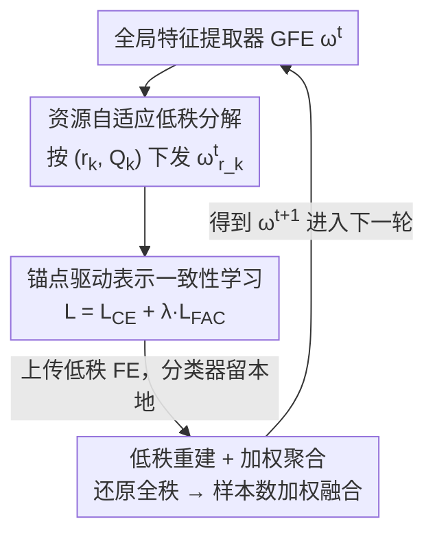

# FedARA: Resource-adaptive Low-rank Personalized Federated Learning via Anchor-driven Representation Alignment on Heterogeneous Edge Devices

**会议**: CVPR 2026  
**论文**: [CVF Open Access](https://openaccess.thecvf.com/content/CVPR2026/html/Zhao_FedARA_Resource-adaptive_Low-rank_Personalized_Federated_Learning_via_Anchor-driven_Representation_Alignment_CVPR_2026_paper.html)  
**代码**: 无  
**领域**: 联邦学习  
**关键词**: 个性化联邦学习, 低秩分解, 模型异构, 表示对齐, 边缘设备

## 一句话总结
FedARA 把"共享特征提取器"做成可被服务器按客户端资源任意分解/重建的低秩结构，让异构边缘设备各取所需的秩；同时用服务器聚合后的全局特征算"一致性锚点"约束本地表示，缓解非 IID 下的特征漂移和全局知识遗忘，在三个数据集上以更低通信/计算开销超过 17 个 SOTA 基线。

## 研究背景与动机

**领域现状**：联邦学习（FL）让边缘设备在不交换原始数据的前提下协同训练。但真实 IoT 场景下数据是非 IID 的、设备算力/内存/带宽也参差不齐，FedAvg 这类"所有客户端跑同一个同构模型"的做法会被最弱的设备拖住，同时浪费强设备的资源。个性化联邦学习（PFL）于是流行起来：把模型参数解耦成**个性化部分**（留在本地，通常是分类器）和**共享部分**（上传聚合，通常是特征提取器），在全局泛化和本地个性化之间取平衡。

**现有痛点**：当前 PFL 有两个绕不开的限制。其一，**只有个性化部分能异构，共享部分必须同构**——因为要做跨客户端聚合，共享特征提取器的结构必须对齐。pFedAFM、pFedES 这类方法试图绕开：在每个客户端额外塞一个同构小特征提取器来交互，但代价是每个资源受限设备要**串行训练两个模型**，计算负担显著上升，而且小提取器的知识传递能力有限。其二，**非 IID 下共享特征提取器会漂移**：不同客户端学到的语义表示空间不一致，进而让个性化分类器的决策边界产生偏差；服务器再把这些偏斜的提取器聚合起来会进一步损害全局泛化，形成恶性循环。更糟的是，全局特征提取器的知识只在初始化时注入一次，本地训练几个 batch 后就会退化，造成**全局知识的灾难性遗忘**。

**核心矛盾**：要做跨客户端知识融合就要求共享部分同构，但同构又把"模型级异构"这条路堵死；而想让共享提取器真正异构，又会破坏聚合所需的结构一致性。同时，本地训练越个性化、全局泛化知识丢得越快，两者天然对立。

**本文目标**：在不给客户端增加额外计算负担的前提下，同时解决（1）共享部分的同构约束，（2）非 IID 导致的特征空间不一致与全局知识遗忘。

**切入角度**：作者注意到低秩分解此前大多只被当作"压缩工具"用来省 FL 资源，但分解+重建其实有一个被忽略的性质——**不同秩的低秩矩阵都能重建回同一维度的全秩参数**。如果把分解和重建都放到服务器上做，客户端只需训练自己秩的低秩版本，服务器就能把不同秩的版本统一重建回全秩再聚合，天然打破了"共享部分必须同构"的限制。

**核心 idea**：用"服务器端低秩分解/重建"让共享提取器在客户端侧异构、在服务器侧统一聚合；再用"全局特征算出的一致性锚点"在本地训练时拉齐各客户端的表示空间。

## 方法详解

### 整体框架
FedARA 是一个模型解耦的 PFL 系统：每个客户端 $k$ 持有私有数据 $D_k$ 和本地模型 $\mathcal{F}(W_k)=\mathcal{F}(\omega_k)\circ\mathcal{H}(\theta_k)$，其中 $\mathcal{F}(\omega_k)$ 是用于跨客户端交互的特征提取器（FE），$\mathcal{H}(\theta_k)$ 是只留在本地的个性化分类器。训练前，每个客户端先根据自身资源**独立选择一个秩比例 $r_k$ 和待分解的层子集 $Q_k$**，构造出复杂度各异的低秩异构模型。

随后每一轮通信（$t>1$）走三个阶段，全部由服务器调度：**Stage1 参数分解**——服务器按客户端结构参数 $(r_k,Q_k)$ 把当前全局特征提取器（GFE）$\omega^t$ 分解成对应低秩形式 $\omega^t_{r_k}$ 下发；**Stage2 本地训练**——客户端用一致性锚点约束训练，只把更新后的低秩 FE $\tilde\omega^t_{r_k}$ 上传，分类器 $\tilde\theta^t_k$ 留本地；**Stage3 参数重建与聚合**——服务器用重建算子 $\mathcal{R}(\cdot)$ 把各客户端的低秩参数还原成全秩 $\tilde\omega^t_k$，再按样本数加权聚合成下一轮 GFE。关键巧思是：分解和重建的算力都压在服务器，客户端不背额外负担。

### 关键设计

**1. 资源自适应低秩分解与重建融合：让共享提取器在客户端异构、在服务器统一聚合**

这是为了打破"共享部分必须同构"的限制。对一个全连接层 $z'=\sigma(Wz)$，把权重 $W\in\mathbb{R}^{m\times n}$ 分解为 $UV^T$（$U\in\mathbb{R}^{m\times r}$，$V\in\mathbb{R}^{n\times r}$，秩 $r\ll\min\{m,n\}$），乘法和存储复杂度从 $O(mn)$ 降到 $O(mr+nr)$；卷积层则先 reshape 成矩阵 $W'=UV^T$ 再拆回 4D 卷积核，存储从 $O(\xi^2 c_{in}c_{out})$ 降到 $O(\xi r(c_{in}+c_{out}))$。每个客户端按本地资源自主设秩比例 $r_k$、挑参数量大（冗余多）的层子集 $Q_k$ 来分解，秩越小模型越轻、通信和计算越省。

真正点睛的是**分解和重建都放服务器**：服务器把 GFE 按 $(r_k,Q_k)$ 分解成 $\omega^t_{r_k}$ 下发，客户端只在自己的低秩空间里训练并上传 $\tilde\omega^t_{r_k}$；服务器收到后用重建算子还原成全秩 $\tilde\omega^t_k=\mathcal{R}(\tilde\omega^t_{r_k})$（即把 $U_qV_q^T$ 算出来再 reshape），不同客户端的低秩版本因此被拉回**同一维度**，可以直接按样本占比加权聚合：

$$\omega^{t+1}=\sum_{k\in S_t}\frac{n_k}{n}\,\tilde\omega^t_k.$$

这样一来，共享提取器在客户端侧可以是不同秩的异构模型，却仍能在服务器侧无缝融合知识——而以往工作要么把低秩纯当压缩、要么得逼客户端再训一个同构小模型。为保证低秩模型训练质量，分解层上额外加了 Frobenius decay 正则 $\|U_qV_q^T\|_F^2$。

**2. 锚点驱动表示一致性学习：用全局特征算"锚点"拉齐各客户端表示并防遗忘**

这是为了治非 IID 下的特征空间漂移和全局知识遗忘。核心观察是：服务器聚合后的 GFE 参数 $\omega$ 蕴含更丰富的泛化知识、能给出更准的跨类别表示，所以客户端应该拿它当一把"标尺"来对齐本地表示。具体地，客户端 $k$ 用**冻结的**低秩 GFE 参数 $\omega^t_{r_k}$ 给本地每个类别 $c$ 算一个一致性锚点（该类样本的平均特征）：

$$P^c_k=\frac{1}{|D^c_k|}\sum_{x^c_{k,i}\in D^c_k}\mathcal{F}(\omega^t_{r_k},x^c_{k,i}).$$

由于同一类别在不同客户端的锚点都源自同一个 $\omega^t$（或其低秩近似），它们天然一致，给该类别在特征空间里提供了统一稳定的参照。本地训练时引入**特征对齐一致性损失**，惩罚样本表示 $R_i=\mathcal{F}(\omega^t_{r_k},x_{k,i})$ 与其真实类别锚点的偏差：

$$\mathcal{L}_{FAC}=\|R_i-P^{y_{k,i}}_k\|_2^2,$$

总损失为 $\mathcal{L}_k=\mathcal{L}_{CE}+\lambda\cdot\mathcal{L}_{FAC}$。这个 $\mathcal{L}_{FAC}$ 一举两得：既把各客户端的特征空间往同一参照上拉、缓解漂移，又因为锚点本身嵌着 GFE 的泛化知识，相当于在本地训练全程持续把全局知识"灌"回本地模型，从而对抗灾难性遗忘——这正是以往"只在初始化注入一次全局知识"做不到的。注意 $t=1$ 时还没有聚合好的 GFE，本地训练不加锚点约束。

### 损失函数 / 训练策略
本地目标 $\mathcal{L}_k=\mathcal{L}_{CE}+\lambda\cdot\mathcal{L}_{FAC}$，分类器和低秩 FE 一起用梯度下降更新 $\tilde W^t_k\leftarrow W^t_k-\eta\nabla\mathcal{L}_k$。约束强度 $\lambda$ 在异构模型下对 CIFAR10/100/Tiny-ImageNet 分别设 2/5/20、同构下设 10；为避免前期 GFE 欠训练，$\lambda$ 在前 10 轮从 0 线性升到目标值再稳定。分解层 Frobenius 衰减固定 $1\times10^{-3}$。

## 实验关键数据

设置：客户端 $K=20$、本地 epoch 5、batch 16、学习率 $5\times10^{-3}$、通信 100 轮；非 IID 用 Dirichlet（Practical，$\alpha$ 越小越异构）和 Pathological（每客户端只见少数类）两种划分。同构设置用统一 4 层 CNN（FedARA* 是其 $r_k=0.5$ 的低秩变体）；异构设置用 CNN1–CNN5 五种复杂度递减模型，FedARA 对 CNN1 施加不同秩比例派生五档。对比 17 个 SOTA。

### 主实验

| 设置 | 数据集 | 指标 | FedARA | 最优基线 | 提升 |
|------|--------|------|--------|----------|------|
| 同构模型 | CIFAR10 | 平均准确率 | 88.21 | FedAS 86.77 | +1.44 |
| 同构模型 | CIFAR100 | 平均准确率 | 60.49 | FedAS 55.36 | +5.13 |
| 异构模型 (Practical) | CIFAR10 | 准确率 | 90.84 | FedTGP 89.39 | +1.45 |
| 异构模型 (Practical) | CIFAR100 | 准确率 | 54.54 | FedKD 48.75 | +5.79 |
| 异构模型 (Practical) | Tiny-ImageNet | 准确率 | 38.70 | FedTGP 29.19 | +9.51 |
| 异构模型 (Pathological) | CIFAR10/100/TiIM | 准确率 | 91.23 / 70.25 / 41.14 | — | +2.06 / +5.68 / +5.65 |

越难（类别更多、异构更强）的场景 FedARA 优势越大，Tiny-ImageNet 异构下直接拉开 9.51 个点。效率上：同构场景 FedARA 比最优基线 FedAS 大幅降低计算/通信成本（锚点对齐加速了收敛），FedARA* 靠只传低秩 FE 进一步压缩；异构场景相比只传类平均表示/近似梯度的 FedTGP、FedKD 通信略高，但准确率显著更优，且仍比传全模型的 FedALA 更省。

### 消融实验

约束强度 $\lambda\in\{0,0.1,0.5,1,2,5,10,20\}$（异构模型下）：

| 配置 | 现象 | 说明 |
|------|------|------|
| $\lambda=0$（去锚点约束） | 准确率显著下降 | 本地模型被非 IID 严重影响，表示空间偏差大 |
| $\lambda$ 适度增大 | 收敛更快、终精度更高 | 更强约束促进跨客户端特征对齐 |
| $\lambda=20$（过大） | 收敛变慢、过正则 | 抑制了个性化知识的提取 |

### 关键发现
- **锚点一致性约束是核心增益来源**：$\lambda=0$ 时性能明显塌陷，证明非 IID 漂移确实严重，锚点约束不可或缺。
- **$\lambda$ 存在甜区**：太小约束不住漂移、太大压死个性化，需按数据集异构程度调（异构 Tiny-ImageNet 用到 20）。
- **越难越强**：类别数多、异构强的场景（CIFAR100、Tiny-ImageNet）提升远大于 CIFAR10，说明方法主要在"难"的地方发力。

## 亮点与洞察
- **把低秩"分解+重建"从压缩工具升级成异构聚合的桥梁**：以往低秩只用来省资源，FedARA 发现"不同秩都能重建回同一维度"这一性质，正好用来让共享提取器在客户端异构、在服务器同构聚合——一个老技术的新用法，很漂亮。
- **算力转移到服务器**：分解和重建都放服务器，客户端只训自己的低秩版本，避免了 pFedAFM 那种"每个设备串行训两个模型"的额外负担，对资源受限边缘设备尤其友好。
- **一致性锚点一石二鸟**：用冻结全局特征的类均值当锚点，既对齐跨客户端表示又持续回灌全局知识防遗忘；这种"用聚合后参数现算的稳定参照来约束本地"的思路可迁移到其他有客户端漂移的协同学习任务。

## 局限与展望
- 锚点是按"真实类别标签"分组算的类内均值，依赖每个客户端本地有该类的标注样本；类别极度稀缺或标签噪声大时锚点质量会下降，论文未深入讨论。
- 客户端的秩 $r_k$ 和待分解层 $Q_k$ 需要预先选定，如何按设备资源最优地配秩、是否能训练中自适应调整，论文未给系统方案。
- 异构场景通信成本仍高于只传类表示/近似梯度的方法（FedTGP/FedKD），属于"用一点通信换大幅精度"的折中，对带宽极受限场景未必最优。
- 仅在图像分类（CIFAR10/100、Tiny-ImageNet）和 CNN 上验证，是否能推广到 Transformer、检测/分割等更复杂任务有待检验。

## 相关工作与启发
- **vs pFedAFM / pFedES（互学习类）**: 它们靠在每个客户端额外塞一个同构小特征提取器来实现跨客户端交互，但要串行训练"小共享模型 + 个性化模型"两个模型，计算负担重且小模型知识传递能力有限；FedARA 直接让共享提取器本身异构（低秩），无需额外模型，算力还压到服务器。
- **vs FedAS / FedRep / FedBABU（模型解耦类）**: 它们把模型拆成共享特征提取器 + 个性化分类器，但**共享部分仍必须同构**，且只在初始化注入一次全局知识、本地训练中会遗忘；FedARA 用低秩重建打破同构约束，并用一致性锚点在训练全程持续回灌全局知识。
- **vs FedProto / FedTGP（原型/logits 类）**: 它们上传本地类原型或 logits 到服务器聚合后回传指导训练，但上传这类敏感信息有隐私泄露风险；FedARA 只传低秩特征提取器参数、锚点在本地现算不外传。

## 评分
- 新颖性: ⭐⭐⭐⭐ 把低秩分解/重建的"维度还原"性质用作异构聚合桥梁，视角新颖，但底层组件（低秩、原型对齐）都是成熟技术的重组
- 实验充分度: ⭐⭐⭐⭐ 三数据集、两种非 IID 划分、同构/异构两类设置、17 个基线，外加效率与 $\lambda$ 消融，较扎实
- 写作质量: ⭐⭐⭐⭐ 动机层层递进、三阶段框架清晰，公式与算法完整
- 价值: ⭐⭐⭐⭐ 双异构（数据+模型）下兼顾精度与开销，对真实边缘 IoT 部署有实际意义

<!-- RELATED:START -->

## 相关论文

- [\[CVPR 2026\] HiLoRA: Hierarchical Low-Rank Adaptation for Personalized Federated Learning](hilora_hierarchical_low-rank_adaptation_for_personalized_federated_learning.md)
- [\[CVPR 2026\] GDFA: Geometry-Driven Federated Unlearning with Directional Task Vector Alignment](gdfa_geometry-driven_federated_unlearning_with_directional_task_vector_alignment.md)
- [\[CVPR 2026\] FedRG: Unleashing the Representation Geometry for Federated Learning with Noisy Clients](fedrg_unleashing_the_representation_geometry_for_federated_learning_with_noisy_c.md)
- [\[CVPR 2026\] FedHarmony: Harmonizing Heterogeneous Label Correlations in Federated Multi-Label Learning](fedharmony_harmonizing_heterogeneous_label_correlations_in_federated_multi-label.md)
- [\[CVPR 2026\] Fine-Tuning Impairs the Balancedness of Foundation Models in Long-tailed Personalized Federated Learning](fine-tuning_impairs_the_balancedness_of_foundation_models_in_long-tailed_persona.md)

<!-- RELATED:END -->
