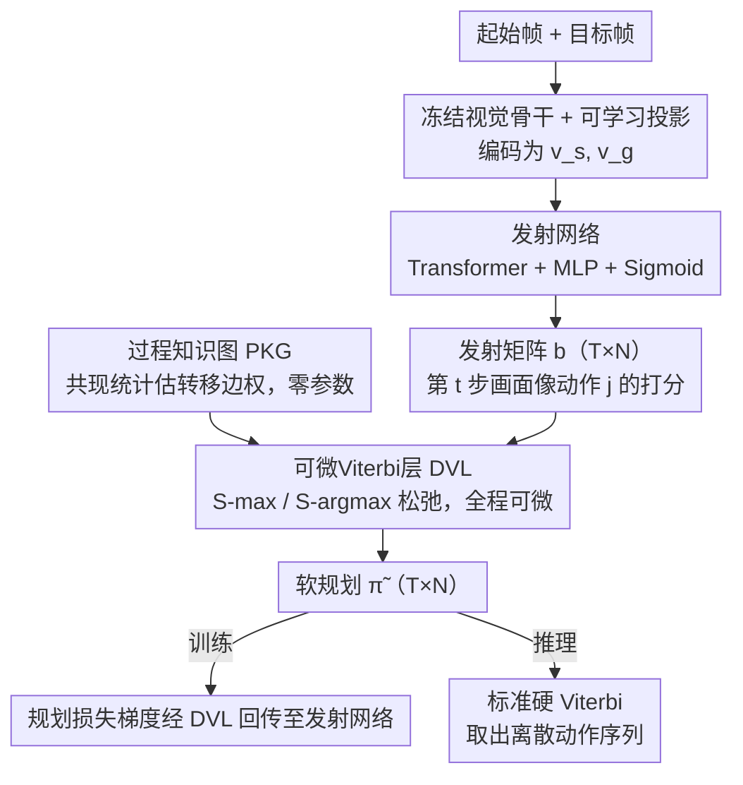

# ViterbiPlanNet: Injecting Procedural Knowledge via Differentiable Viterbi for Planning

**会议**: CVPR 2026  
**arXiv**: [2603.04265](https://arxiv.org/abs/2603.04265)  
**代码**: [Project Page](https://gigi-g.github.io/ViterbiPlanNet/)  
**领域**: 图学习  
**关键词**: 过程规划, 可微Viterbi, 过程知识图, 教学视频, 结构感知训练

## 一句话总结

将过程知识图（PKG）通过可微Viterbi层端到端嵌入规划模型，使神经网络只需学习发射概率而非记忆完整过程结构，在CrossTask/COIN/NIV上以仅5-7M参数（比扩散/LLM方法少1-3个数量级）达到SOTA成功率，并建立了统一的评估基准。

## 研究背景与动机

**领域现状**：视频过程规划是给定起始和目标视觉状态，预测中间动作序列的任务，是构建可穿戴AI助手等应用的核心能力。现有SOTA方法包括基于扩散模型（PDPP、KEPP、MTID，约42M-1B参数）、基于LLM（PlanLLM，约385M参数）和基于Transformer（SCHEMA，约6M参数）的架构。

**现有痛点**：这些方法都将过程知识隐式编码在网络参数中，需要从大量数据中学习复杂的过程结构（如"放底层面包→加火鸡→加生菜→放顶层面包"的合理顺序），导致：(1) 数据效率低——需要大量训练样本来记忆过程规则；(2) 计算成本高——需要越来越复杂和庞大的模型；(3) 泛化有限——在短于训练时的规划长度上表现急剧下降。

**核心矛盾**：人类在进行过程规划时并非从零推理，而是将内在的过程知识（动作先验、前置条件、典型顺序等）自然融入规划过程。然而现有方法即使使用了过程知识图（PKG），也仅将其作为推理时的后处理解码器，训练过程中模型仍然无法感知过程结构。

**本文目标**：如何将过程知识图从推理后处理上升为训练时的引导信号，让结构化先验直接参与端到端优化。

**切入角度**：将过程规划建模为隐马尔可夫模型（HMM）中的最优状态序列解码问题，用Viterbi算法求解。关键创新是将Viterbi中不可微的max和argmax操作替换为可微的log-sum-exp和softmax松弛，使梯度可以从规划损失流回视觉编码器。

**核心 idea**：不让网络记忆过程，只让它学习"当前视觉状态与各动作的匹配度"（发射概率），过程的合理顺序由知识图保证——可微Viterbi层使得这种分工可以端到端训练。

## 方法详解

### 整体框架

ViterbiPlanNet的核心想法是把"过程该怎么走"和"当前画面像哪个动作"这两件事彻底拆开，前者交给一张固定的过程知识图，后者才是神经网络要学的。给定起始帧和目标帧，模型先用冻结视觉骨干加可学习投影把两端视频片段编码成向量 $v_s^{enc}, v_g^{enc} \in \mathbb{R}^E$，再经一个Transformer编码器加MLP加Sigmoid预测出发射矩阵 $b \in \mathbb{R}^{T \times N}$——它逐步、逐动作地打分"第 $t$ 步看到的画面有多像动作 $j$"（$T$ 为规划步数，$N$ 为动作总数）。真正决定动作顺序的不是网络，而是一个可微Viterbi层：它以过程知识图的转移概率为固定参数、以发射矩阵为输入，沿时间轴解码出软规划 $\tilde{\pi} \in [0,1]^{T \times N}$。关键在于这个解码层全程可微，规划损失的梯度能一路回传到视觉编码器，使整套系统端到端训练。下面三个设计——概率图建模、过程知识图、可微Viterbi层——正是这条思路从形式化到落地的三块拼图。

### 关键设计

**1. 概率图建模：把规划写成 HMM 的最优序列解码**

现有方法把"动作的合理顺序"和"画面与动作的对应"混在一张网络里隐式学习，既费数据又费参数。本文先把问题严格形式化为隐马尔可夫模型：假设动作只依赖前一步（马尔可夫性 $P(a_t \mid a_{t-1})$），整条规划的联合概率就分解为

$$P(\pi = a_{1:T} \mid v_{0:T}) \propto \prod_{t=1}^{T} P(a_t \mid a_{t-1}) \cdot P(v_t \mid a_t),$$

其中转移项 $P(a_t \mid a_{t-1})$ 描述过程结构、发射项 $P(v_t \mid a_t)$ 描述视觉匹配。最优规划就是让这个乘积最大的动作序列。这一步的价值在于它把规划干净地切成两半：转移由外部知识图固定提供，神经网络只需负责发射这一半，学习目标因此大幅简化。

**2. 过程知识图（PKG）：让结构先验显式化、零参数**

既然转移这一半不该让网络去背，就把它做成一张外挂的图 $\mathcal{G} = (\mathcal{V}, \mathcal{E}, \omega)$：节点 $\mathcal{V}$ 是动作集合，有向边 $\mathcal{E}$ 表示合法转移，边权 $\omega(i,j)$ 直接由训练集里动作 $i \to j$ 的共现统计估计，每个数据集单独建一张图。这张图不含任何可训练参数，却提供了可靠的顺序先验——"放底层面包→加火鸡→加生菜→放顶层面包"这种典型顺序被直接编码进边权，网络再也不用从数据里反复记忆。这种"显式外挂"比隐式编码高效得多：消融显示同一张PKG接到本方法上能带来 +5.98% SR，而接到SCHEMA做后处理只有 +3.31%、接到KEPP做条件化只有 +2.56%。

**3. 可微Viterbi层（DVL）：让经典解码算法能回传梯度**

有了HMM形式和PKG，求最优序列本应直接套Viterbi算法，但它的 max 与 argmax 操作梯度处处为零，训练信号根本传不回视觉编码器。DVL的做法是把这两个硬操作换成平滑版本：max 换成 S-max（log-sum-exp 松弛），argmax 换成 S-argmax（softmax 松弛）。每个时间步先算各前驱的得分 $s_{i \to j}^{(t)} = \delta_{t-1}(i) \cdot \omega(i,j)$（前一步的累积分数乘以PKG里的固定转移概率），再更新状态分数

$$\delta_t(j) = b[t,j] \cdot \text{S-max}\big(\{s_{i \to j}^{(t)}\}\big),$$

同时用 $\boldsymbol{\psi}_t(j, \cdot) = \text{S-argmax}(\{s_{i \to j}^{(t)}\})$ 记下一组软回溯指针，沿时间递归组合就得到软规划 $\tilde{\pi}$。因为整条链路连续可微，规划损失的梯度能流过DVL一路回到发射网络 $f_{emiss}$，逼它产出"与过程结构相容"的发射概率——这正是训练时引导（而非推理时后处理）的本质。值得强调的是，DVL本身不带任何可训练参数，它只是把固定的图和网络预测的发射分数按Viterbi的方式组合起来；推理时再用标准（硬）Viterbi从软规划里取出离散动作序列。

### 损失函数 / 训练策略

总损失是三项之和 $\mathcal{L} = \mathcal{L}_{plan} + \mathcal{L}_{align} + \mathcal{L}_{task}$。核心监督来自 $\mathcal{L}_{plan}$——DVL输出的软规划 $\tilde{\pi}$ 与ground-truth独热规划之间的MSE，正是它把梯度经DVL压回发射网络。$\mathcal{L}_{align}$ 是视觉-语义对齐损失，让视觉编码贴近各过程状态的文本描述；$\mathcal{L}_{task}$ 是任务分类损失，引导编码器保住全局任务语义。每个配置用5个随机种子训练，报告均值与90%置信区间。

## 实验关键数据

### 主实验

| 数据集 | 指标 | ViterbiPlanNet | SCHEMA | PlanLLM | PDPP | 提升(vs次优) |
|--------|------|------|----------|------|------|------|
| CrossTask T=3 | SR↑ | **38.45±0.32** | 37.24±0.60 | 36.84±1.21 | 36.73±0.59 | +1.21±0.69 |
| CrossTask T=3 | mAcc↑ | **63.07±0.17** | 62.69±0.28 | 61.56±1.03 | 61.96±0.59 | +0.38 |
| COIN T=3 | SR↑ | **33.99±0.23** | 32.89±0.61 | 33.44±0.15 | 22.37±0.57 | +0.55±0.27 |
| NIV T=3 | SR↑ | **32.37±0.96** | 26.30±1.49 | 30.00±1.41 | 26.52±1.56 | +2.37±1.63 |
| NIV T=4 | SR↑ | **27.54±0.70** | 24.39±1.84 | 23.42±1.40 | 21.40±0.53 | +3.15±1.93 |

参数量对比：ViterbiPlanNet仅5-7M，vs PDPP 42M，PlanLLM 385M，MTID 1085M。与MTID（1B参数）对比，SR和mAcc接近但mIoU显著更高（T=3: 76.92 vs 69.17），参数减少200倍。

### 消融实验

| 配置 | 训练DVL | 推理VD | SR↑ | mAcc↑ | mIoU↑ | 说明 |
|------|---------|------|------|---------|------|------|
| Base Model | ✗ | ✗ | 32.47 | 60.63 | 82.45 | 无结构引导 |
| +推理VD | ✗ | ✓ | 32.99 | 58.57 | 82.34 | 后处理效果微弱 |
| +训练DVL+推理VD | ✓ | ✓ | **38.45** | **63.07** | **83.89** | 完整方法，+5.98 SR |
| 仅训练DVL | ✓ | ✗ | 20.05 | 54.61 | 76.99 | 发射概率≠直接预测 |

### 关键发现

- **结构感知训练是关键**：DVL在训练时引入带来+5.98% SR提升，远超推理时添加VD（+0.52%）或DVL（-0.38%）
- **PKG利用效率对比**：ViterbiPlanNet从PKG获益最大（+5.98%），远超SCHEMA（+3.31%后处理）、KEPP（+2.56%条件化）、PlanLLM（+1.97%后处理）
- **样本效率优势**：在仅用20%训练数据时，ViterbiPlanNet已超过SCHEMA用100%数据的表现
- **跨长度泛化强**：在T=6训练、T=3测试的cross-horizon实验中，ViterbiPlanNet SR达27.77%，比次优SCHEMA（16.12%）高11.65个点
- LLM/VLM基线（包括Gemini 2.5 Pro和Qwen3-30B）表现远不及训练方法，简单PKG beam search就能超过大多数LLM/VLM

## 亮点与洞察

- 思路极其简洁深刻：将复杂的规划问题分解为"视觉匹配"和"过程知识"两部分，让网络只学简单的发射概率，结构由知识图保证
- 可微动态规划的应用非常优雅，将经典算法与深度学习无缝结合，DVL不引入任何额外参数
- 建立并开源了统一评估基准，解决了该领域长期存在的数据分割和度量不一致问题，5种子+bootstrap置信区间的实验规范值得推广
- 跨长度泛化能力（cross-horizon consistency）是方法论上的重要贡献，证明结构化先验带来的是真正的泛化而非记忆

## 局限与展望

- PKG质量依赖训练数据的动作共现统计，在数据稀缺或分布偏移的场景下可能不准确
- 仅处理离散动作空间，无法直接应用于连续控制任务
- 软近似在极长序列（T>6）时精度可能下降，论文主要报告T=3,4的结果
- HMM的马尔可夫假设限制了对长程依赖的建模，虽然PKG部分缓解了这一问题
- 需要预先定义动作分类名称和构建PKG，非完全端到端的设定

## 相关工作与启发

- **vs SCHEMA**: 相似参数量（约6M），但ViterbiPlanNet在SR上持续领先（CrossTask T=3: 38.45 vs 37.24），因为SCHEMA只在推理时用PKG后处理，本文在训练时引导
- **vs PlanLLM**: PlanLLM参数量是ViterbiPlanNet的70倍（385M vs 5.5M），性能却更低。说明隐式记忆过程知识是低效的
- **vs MTID**: 参数量差200倍（1085M vs 5.5M），CR和mAcc接近但mIoU显著更高，证明轻量结构化方法可以匹敌重型生成式方法
- **vs LLM/VLM**: 即使是Gemini 2.5 Pro也只达29.18% SR（T=3 CrossTask），远不及ViterbiPlanNet的38.45%，暴露了当前大模型在结构化过程推理上的不足

## 评分

- 新颖性: ⭐⭐⭐⭐⭐ 可微Viterbi层的设计理念原创且深刻，将训练时的结构引导与推理时的后处理做出了本质区分
- 实验充分度: ⭐⭐⭐⭐⭐ 3数据集、统一评估基准、5种子bootstrap、LLM/VLM基线对比、跨长度泛化、样本效率分析，极其全面严谨
- 写作质量: ⭐⭐⭐⭐⭐ 概率框架的推导清晰自洽，问题建模→可微化→实验验证的逻辑链非常完整
- 价值: ⭐⭐⭐⭐ 方法论贡献突出，可微动态规划的范式有望推广到其他需要结构先验的序列预测任务

<!-- RELATED:START -->

## 相关论文

- [\[CVPR 2026\] Graph2Eval: Automatic Multimodal Task Generation for Agents via Knowledge Graphs](graph2eval_automatic_multimodal_task_generation_for_agents_via_knowledge_graphs.md)
- [\[ACL 2026\] What Makes AI Research Replicable? Executable Knowledge Graphs as Scientific Knowledge Representations](../../ACL2026/graph_learning/what_makes_ai_research_replicable_executable_knowledge_graphs_as_scientific_know.md)
- [\[CVPR 2026\] M3KG-RAG: Multi-hop Multimodal Knowledge Graph-enhanced Retrieval-Augmented Generation](m3kg_rag_multi_hop_multimodal_knowledge_graph_enhanced_retrieval_augmented_genera.md)
- [\[NeurIPS 2025\] MedMKG: Benchmarking Medical Knowledge Exploitation with Multimodal Knowledge Graph](../../NeurIPS2025/graph_learning/medmkg_benchmarking_medical_knowledge_exploitation_with_multimodal_knowledge_gra.md)
- [\[ACL 2025\] Croppable Knowledge Graph Embedding](../../ACL2025/graph_learning/croppable_knowledge_graph_embedding.md)

<!-- RELATED:END -->
