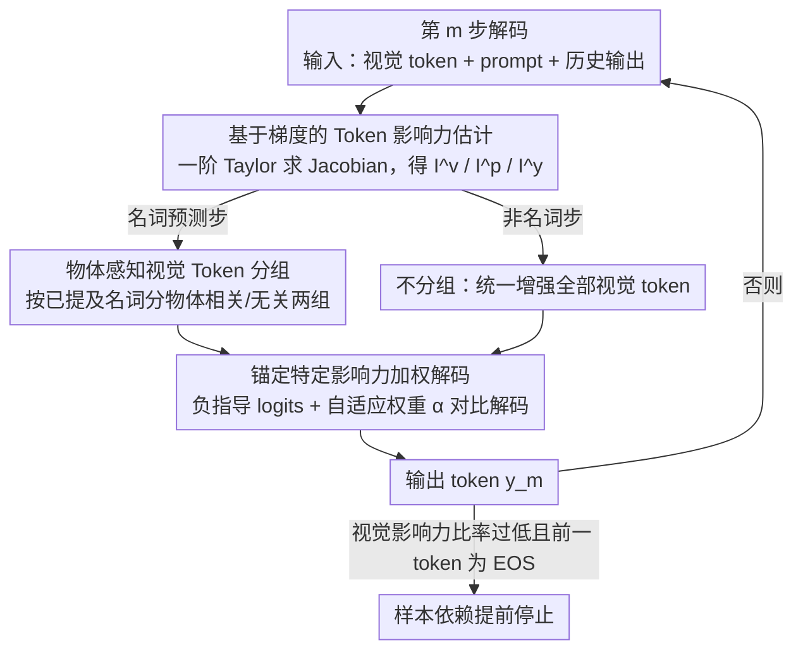

# Mitigating Multimodal Hallucinations via Gradient-based Self-Reflection

**会议**: CVPR2026  
**arXiv**: [2509.03113](https://arxiv.org/abs/2509.03113)  
**代码**: 未公开  
**领域**: 幻觉检测  
**关键词**: 多模态幻觉, 梯度归因, 约束解码, 共现偏差, 文本-视觉偏差, 推理阶段缓解

## 一句话总结

提出 GACD（Gradient-based Influence-Aware Constrained Decoding），利用一阶 Taylor 梯度估计每个 token 对输出的影响力，在推理阶段同时缓解文本-视觉偏差和共现偏差导致的多模态幻觉，无需辅助模型或微调。

## 研究背景与动机

**多模态幻觉普遍存在**：MLLM 在生成文本时常产生与视觉输入不一致的内容，严重制约了模型的可信度和实际部署。

**文本-视觉偏差（Text-Visual Bias）**：模型过度依赖文本 prompt 和已生成的历史输出，忽略视觉信息，尤其在长序列生成中愈发严重。

**共现偏差（Co-occurrence Bias）**：训练数据中频繁共现的物体对（如 chair-table、fork-beer）导致模型在只看到一个物体时也错误地预测另一个。

**已有推理方法缺乏粒度**：现有对比解码方法（VCD、M3ID 等）对所有视觉特征施加统一权重，无法在 token 级别选择性调整，对共现偏差缓解有限。

**依赖辅助模型的局限**：部分方法需要分割网络、检测器或额外 MLLM 作为辅助，引入了新的错误源和任务特定依赖。

**缺乏样本级偏差度量**：现有工作大多仅报告整体统计量，无法在单个样本层面量化偏差程度并自适应调整。

## 方法详解

### 整体框架

GACD 是一个纯推理阶段、逐 token 运行的解码框架。在每一步解码 $m$，它先用**梯度影响力估计**量化视觉/prompt/历史输出三类 token 对当前 logit 的贡献；随后根据当前要预测的是不是名词分两条支路——**名词步**走**物体感知视觉 token 分组**，把视觉 token 拆成与已提及物体相关（$\mathbf{t}^o$）和无关（$\mathbf{t}^u$）两组以瞄准共现偏差；**非名词步**则不分组、统一增强全部视觉 token 以纠正文本-视觉偏差。两条支路汇合后进入**锚定特定影响力加权解码**：用 $\mathbf{t}^o$ 构造负指导 logits 做对比解码、并由影响力自适应算出权重 $\alpha_m$。最后用**样本依赖的提前停止**在视觉依据不足时及时收尾。

### 关键设计

**1. 基于梯度的 Token 影响力估计**

对 logit 向量 $\mathbf{z}_m^* = \pi_{\theta^*}(\mathbf{t}^v, \mathbf{t}^p, \mathbf{y}_{<m})$ 进行一阶 Taylor 展开，计算每个输入 token（视觉/prompt/历史输出）对当前输出 logit 的 Jacobian，取曼哈顿范数作为影响力度量：

$$I_{ms}^v = \|\mathbf{g}_{ms}^v\|_1, \quad I_{mn}^p = \|\mathbf{g}_{mn}^p\|_1, \quad I_{mi}^y = \|\mathbf{g}_{mi}^y\|_1$$

汇聚后得到组级影响力 $\texttt{I}_m^v, \texttt{I}_m^p, \texttt{I}_m^y$，可在样本级别分解文本和视觉各自对当前 token 的贡献。

**2. 物体感知视觉 Token 分组（Object-aware Visual Token Grouping）**

共现偏差发生在物体对之间，所以这一步只在**名词预测步**触发。先用 spaCy 在已生成序列 $\mathbf{y}_{<m}$ 中检测名词，把每个名词 $y_i$ 当作一次"物体提及"；再借助设计 1 的影响力，为该名词挑出影响力最大的那个视觉 token 形成掩码 $\mathcal{M}_{is}$。累积此前所有名词的掩码得到 $\mathcal{M}_m$，并据此把视觉 token 用 Hadamard 积切成**物体相关** $\mathbf{t}^o = \mathbf{t}^v \odot \mathcal{M}_m$ 和**物体无关** $\mathbf{t}^u = \mathbf{t}^v \odot (\mathbf{1}-\mathcal{M}_m)$ 两组——前者是导致共现幻觉的"锚点"，后者才是被忽视的真实视觉证据。非名词步则令 $\mathbf{t}^o = \varnothing$、$\mathbf{t}^u$ 等于全部视觉 token，退化为纯文本-视觉偏差校正。

**3. 锚定特定影响力加权解码（Anchor-specific Influence-weighted Decoding）**

构造负指导 logits $\mathbf{z}_m^o = \pi_{\theta^*}(\mathbf{t}^o, \mathbf{t}^p, \mathbf{y}_{<m})$，调整后的 logits 为：

$$\hat{\mathbf{z}}_m = (1+\alpha_m)\mathbf{z}_m^* - \alpha_m \mathbf{z}_m^o$$

权重 $\alpha_m$ 由影响力自适应计算，使 $\mathbf{t}^u$ 的影响力对齐文本主导项 $\texttt{I}_m^t = \max(\texttt{I}_m^p, \texttt{I}_m^y)$，同时施加非负约束上界防止过度校正。

**4. 样本依赖的提前停止**

当视觉影响力比率 $r_m^v = \texttt{I}_m^v / (\texttt{I}_m^v + \texttt{I}_m^p + \texttt{I}_m^y) < \epsilon$ 且前一个 token 为 EOS 时触发停止，避免在视觉依据不足时继续生成。

### 损失/目标

GACD 是推理阶段方法，不涉及训练损失。核心优化目标是在概率空间中增大 $D_{\mathrm{KL}}(\sigma(\mathbf{z}_m^*) \| \sigma(\mathbf{z}_m^o))$，即增强物体无关视觉 token $\mathbf{t}^u$ 的贡献，同时通过上界约束保持物体相关 token 和 prompt 的非负影响。

## 实验

### 主要结果

**AMBER 数据集（生成任务 + 判别任务）**：

| 模型 | 方法 | cha↓ | cov↑ | hal↓ | cog↓ | Score↑ | F1↑ |
|------|------|------|------|------|------|--------|-----|
| LLaVA-v1.5 | Baseline | 7.8 | 51.0 | 36.4 | 4.2 | 83.5 | 74.7 |
| | GACD | **5.6** | 51.0 | **24.3** | **1.8** | **90.2** | **86.0** |
| InstructBLIP | Baseline | 8.8 | 52.2 | 38.2 | 4.4 | 86.5 | 81.7 |
| | GACD | **6.0** | 49.4 | **26.6** | **2.4** | **88.1** | 82.2 |
| mPLUG-Owl2 | Baseline | 10.6 | 52.0 | 39.9 | 4.5 | 84.0 | 78.5 |
| | GACD | **7.5** | **53.6** | **34.7** | **4.0** | **89.6** | **86.6** |
| Qwen2-VL | Baseline | 6.4 | 70.4 | 54.8 | 5.9 | 90.1 | 86.6 |
| | GACD | **4.9** | **71.8** | **44.7** | **3.7** | **91.1** | **87.1** |

**POPE MSCOCO 对抗设置（判别任务）**：

| 模型 | 方法 | Acc↑ | F1↑ |
|------|------|------|-----|
| LLaVA-v1.5 | Baseline | 80.9 | 81.6 |
| | GACD | **83.5** | **82.1** |
| mPLUG-Owl2 | Baseline | 72.5 | 77.5 |
| | GACD | **84.2** | **83.7** |
| InternVL2 | Baseline | 85.8 | 85.0 |
| | GACD | 85.8 | 85.0 |

### 消融实验

| 组件组合 | CS↓ (LLaVA-v1.5) | CI↓ | R↑ |
|----------|-------------------|------|------|
| Baseline | 48.8 | 13.4 | 78.6 |
| +VA (视觉增强) | 46.4 | 11.6 | 79.0 |
| +VA+CR (共现抑制) | 46.2 | 11.3 | 79.4 |
| +VA+CR+ES (全模型) | **41.0** | **10.9** | 77.3 |

- VA 在降低幻觉的同时还提升了召回率
- CR 进一步缓解了共现偏差带来的残余幻觉
- ES 通过缩短输出有效降低幻觉，仅有轻微召回损失

### 关键发现

1. **改进幅度与视觉影响力基线负相关**：LLaVA-v1.5 和 mPLUG-Owl2 原始视觉影响力比率低（<50%），GACD 提升显著；InternVL2 原始视觉影响力已 >50%，提升空间有限——这反过来验证了方法的动机。
2. **共现偏差的"最大影响力 token 共享"现象**：chair-table 共现实验中，31.9% 的共现幻觉案例中两个物体共享同一个最大影响力视觉 token，GACD 有效打破了这种共享。
3. **直接梯度 vs 积分梯度**：直接梯度方法在精度相当的情况下速度提升约 53 倍（385ms vs 20335ms）。
4. **信息保持能力优于竞争方法**：GACD 的召回率平均仅下降 1.1%，而其他方法平均下降 3.2%。

## 亮点

- **原理清晰**：基于一阶 Taylor 展开的梯度归因为偏差估计提供了数学基础，不依赖启发式先验
- **双偏差联合处理**：同一框架内同时解决文本-视觉偏差和共现偏差，是首个在 token 级别物体感知地缓解共现幻觉的推理方法
- **自适应 $\alpha_m$**：权重由影响力比率动态计算+上界约束，无需跨数据集调参
- **即插即用**：不改变模型参数，不需要辅助模型，适用于多种 MLLM 架构
- **LLaVA-QA90 上精度提升 92%、细节度提升 45%** 的大幅改进展示了方法的有效性

## 局限性

- **仅适用于白盒模型**：需要访问模型梯度，无法用于 API-only 模型（如 GPT-4V）
- **计算开销翻倍**：推理运算量约增加 101%，与 VCD 相当但不可忽略
- **对高视觉影响力模型效果有限**：当模型本身已较好地利用视觉信息（如 InternVL2），提升空间很小
- **关系类问题改进较少**：对需要视觉推理（而非直接视觉依据）的问题类型，方法效果受限
- **仅为后处理**：未将梯度归因信号反馈到训练中

## 相关工作

- **图像级对比解码**：VCD、M3ID 对所有视觉 token 统一增强，无法区分物体相关/无关 token
- **Token 级方法**：AVISC 缺乏物体感知的解耦；HALC 依赖外部分割模型
- **训练方法**：RLAIF-V 用 RL 对齐，但需要额外反馈数据和训练成本
- **注意力方法**：需要针对特定层做调整，引入模型特定的启发式
- GACD 的核心优势在于：物体感知 + 样本自适应 + 无外部依赖

## 评分

- 新颖性: ⭐⭐⭐⭐ — 梯度归因用于解码阶段偏差估计的思路很新颖，物体感知分组+自适应权重的设计有独创性
- 实验充分度: ⭐⭐⭐⭐⭐ — 6 个模型 × 4 个数据集，生成+判别任务全覆盖，消融细致到组件/范数/梯度方法
- 写作质量: ⭐⭐⭐⭐ — 数学推导严谨，动机清晰，公式/图示配合良好
- 价值: ⭐⭐⭐⭐ — 即插即用的推理方法实用性强，但白盒限制和倍增开销限制了适用范围

<!-- RELATED:START -->

## 相关论文

- [\[CVPR 2026\] Understanding and Mitigating Hallucinations in Multimodal Chain-of-Thought Models](understanding_and_mitigating_hallucinations_in_multimodal_chain-of-thought_model.md)
- [\[ICML 2026\] From Flat Facts to Sharp Hallucinations: Detecting Stubborn Errors via Gradient Sensitivity](../../ICML2026/hallucination/from_flat_facts_to_sharp_hallucinations_detecting_stubborn_errors_via_gradient_s.md)
- [\[CVPR 2026\] MAD: Modality-Adaptive Decoding for Mitigating Cross-Modal Hallucinations in Multimodal Large Language Models](mad_modality-adaptive_decoding_for_mitigating_cross-modal_hallucinations_in_mult.md)
- [\[CVPR 2026\] Tell Model Where to Look: Mitigating Hallucinations in MLLMs by Vision-Guided Attention](tell_model_where_to_look_mitigating_hallucinations_in_mllms_by_vision-guided_att.md)
- [\[ICML 2026\] Learning from Fine-Grained Visual Discrepancies: Mitigating Multimodal Hallucinations via In-Context Visual Contrastive Optimization](../../ICML2026/hallucination/learning_from_fine-grained_visual_discrepancies_mitigating_multimodal_hallucinat.md)

<!-- RELATED:END -->
