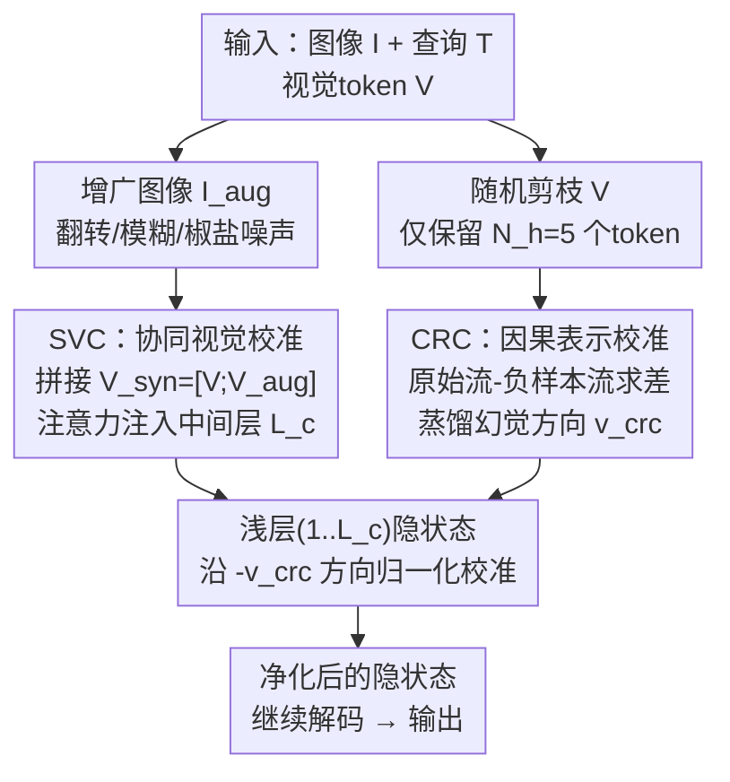

# One Token, Two Fates: A Unified Framework via Vision Token Manipulation Against MLLMs Hallucination

**会议**: CVPR 2026  
**论文**: [CVF Open Access](https://openaccess.thecvf.com/content/CVPR2026/html/Fa_One_Token_Two_Fates_A_Unified_Framework_via_Vision_Token_CVPR_2026_paper.html)  
**代码**: https://github.com/Fazhan-cs/OTT  
**领域**: 多模态VLM / MLLM幻觉缓解  
**关键词**: MLLM幻觉, 训练免调, 视觉token操控, 隐空间校准, 对比解码

## 一句话总结
本文把 MLLM 物体幻觉重新定义为"视觉-语言失衡"问题，提出一个 training-free 框架，**只在中间表示层操控视觉 token**：一边用增广图像的视觉 token 强化视觉信号（SVC），一边用剪枝后的视觉 token 在隐空间造负样本、提纯模型内部偏置（CRC），在 LLaVA-1.5 上 POPE 平均提升约 2% 绝对精度，推理只多 1.06× 延迟。

## 研究背景与动机

**领域现状**：多模态大模型（MLLM）的幻觉——生成流畅但与图像矛盾的文本——是落地的大障碍。当前主流的缓解方法都是 **training-free** 的，分成两条互不相干的路线：一条做**视觉注意力增强**（Visual Attention Enhancement，如 PAI），在注意力阶段放大图像信号；另一条做**文本解码修正**（Textual Decoding Refinement，如 VCD），在最终 logits 上用负样本做对比解码、压制语言惯性。

**现有痛点**：两条路线各有死穴。**单纯增强视觉**往往不够——语言模型有根深蒂固的"文本惯性"（text inertia），随着输出变长、图像影响自然衰减，语言先验会重新接管（作者称之为 F1：视觉注意力随生成步数急剧衰减，而幻觉恰恰在视觉接地最弱处爆发）。**单纯压制语言**则有副作用——这类方法常靠**扭曲输入图像**来造负样本（modality-gap），但扭曲后的图像内容不可靠、不稳定，给校准引入额外噪声（F3）。

**核心矛盾**：作者进一步发现，把两条路线**简单拼起来也不行**——把注意力增强（PAI）和解码修正（VCD）naive 组合，性能毫无提升甚至下降。原因在于二者根本不是为协同设计的：一个在**注意力层**增强原图细节，一个在 **logit 层**用负样本压制；干预的**层级和时机都不一样**，信号互相冲突。

**本文目标**：设计一个**真正统一**的框架，让"增强"和"压制"在同一个层级、围绕同一个核心资产协同工作，同时修复视觉-语言失衡的两端。

**切入角度**：作者把目光投向视觉-语言交互的"枢纽"——**视觉 token**。围绕它挖出两条关键洞察：(F2) **语义互补性**——增广图像的视觉 token 提供互补语义，能搭出更丰富的视觉锚点用于增强；(F3) **信息缺口优于模态缺口**——在隐空间**移除部分 token**（information-gap）造出的负样本，比像素级扭曲图像（modality-gap）更稳定、更贴近原分布，能更精准地隔离偏置。

**核心 idea**：让同一个视觉 token 扮演**两种命运**（two fates）——既当"强化视觉的素材"，又当"造负样本探测偏置的探针"——并且全部操作只在中间表示（隐状态）上完成，绕过解码，从而在统一层级实现协同校准。

## 方法详解

### 整体框架
框架（作者称 Unified Latent Calibration）的目标是：在标准 MLLM 自回归生成过程中，**只改中间层的隐状态**，同时对抗"视觉衰减"和"文本惯性"两个病根，而不动模型权重、不改解码逻辑。它把视觉 token 分给两个模块用：**SVC** 负责往一个关键中间层注入更丰富的视觉上下文（解决视觉衰减）；**CRC** 在浅层用剪枝 token 造负样本、蒸馏出一个稳定的"幻觉方向向量"，再从主计算流里减掉它（压制语言先验）。两个模块共享同一个源头（视觉 token）、都在表示层动手，所以能协同而不打架。

整体上有两条并行的前向流：**原始流**（orange path，正常的 `[V; Q]`）和**幻觉探针流**（purple path，用剪枝视觉 token `[V_neg; Q]`）。探针流只在第一步跑一次、缓存出方向向量供后续复用；SVC 在单一中间层（如第 16 层）干预，CRC 从初始层一路校准到目标层。

### 关键设计

**1. 视觉-语言失衡的统一重构：把幻觉缓解从"两条对立路线"变成"一个资产两种用法"**

这是全文的纲。作者论证：幻觉的根源是一个**系统性失衡**——视觉信号随生成衰减、语言先验接管——所以需要同时修复两端，而不是各打一边。已有方法之所以拼不起来，是因为它们在不同层级（注意力 vs logit）、不同时机干预，信号冲突。本文的破解办法是认定**视觉 token 是视觉-语言交互的唯一枢纽**，让所有校准信号都从它派生：增广它 → 得到增强素材；剪枝它 → 得到偏置探针。两个用途共享同一源头、同在表示层操作，天然协同。这个重构本身就是论文的第一贡献，后面 SVC/CRC 都是它的实例化。

**2. SVC 协同视觉校准：用增广图像的互补语义，往中间层补一针"视觉强心剂"**

针对 F1 的视觉衰减痛点。作者先构造一个"协同视觉记忆库"：给原图 $I$ 做随机水平翻转、半径 5 的高斯模糊、强度 0.2 的椒盐噪声得到增广图 $I_{aug}$，分别编码出视觉 token 后拼接成 $V_{syn}=[V; V_{aug}] \in \mathbb{R}^{2N_v \times d}$。F2 的洞察是：原图和增广图的注意力焦点**互补**（比如一个关注相机、一个补上别处），合起来能形成更丰富的视觉锚点。

注入是**无参数**的：只在单一预设中间层 $L_c$ 干预。生成第 $t$ 步时，取上一层隐状态 $H^{(L_c-1)}_t$ 当 Query，$V_{syn}$ 同时当 Key 和 Value，用缩放点积注意力算出视觉上下文 $C_t$：

$$C_t = \text{softmax}\!\left(\frac{H^{(L_c-1)}_t (V_{syn})^T}{\sqrt{d}}\right) V_{syn}$$

再用插值把它融回原隐状态：$H'^{(L_c)}_t = (1-\lambda_s)\cdot H^{(L_c)}_t + \lambda_s \cdot C_t$，其中 $\lambda_s$（默认 0.06）控制注入强度。这相当于在视觉影响开始减弱的关键层，重新把图像信号"喂"回模型，且因为只动一层、无新增参数，开销极小。

**3. CRC 因果表示校准：用剪枝 token 在隐空间造"in-distribution 负样本"，把幻觉方向减出去**

针对文本惯性，且要避开"扭曲图像造噪声"的老毛病。CRC 的关键是 F3——**信息缺口（information-gap）优于模态缺口（modality-gap）**：与其在像素层扭曲图像（造出分布外、不稳定的负样本），不如直接在隐空间**随机剪枝**视觉 token、只保留 $N_h=5$ 个，得到的负样本仍保留原图的结构属性，落在原分布附近（t-SNE 可见它们紧贴原图表示，而 masked image 则飘到很远的簇）。

具体在 $t=0$ 时跑两路并行前向：原始 $H^{(l)}_{0,org}=D^{(1..l)}([V;Q])$ 和 $K$ 个负样本 $H^{(l,k)}_{0,neg}=D^{(1..l)}([V^{(k)}_{neg};Q])$，求差 $\Delta H^{(l,k)} = H^{(l)}_{0,org}-H^{(l,k)}_{0,neg}$，再对 $K=3$ 个负样本求平均得到稳定的**幻觉方向向量** $v^{(l)}_{crc}=\frac{1}{K}\sum_k \Delta H^{(l,k)}$。这个向量缓存下来、后续每步复用。

校准在**归一化空间**做以保持表示稳定：先归一化 $h_{norm}=H^{(l)}_{t,org}/\|H^{(l)}_{t,org}\|_2$、$v_{norm}=v^{(l)}_{crc}/\|v^{(l)}_{crc}\|_2$，线性组合 $h_{crc}=h_{norm}+\lambda_c \cdot v_{norm}$，再重新归一化并缩放回原模长：

$$H^{(l)}_{t,pos} = \frac{h_{crc}}{\|h_{crc}\|_2}\cdot \|H^{(l)}_{t,org}\|_2$$

$\lambda_c$ 默认 0.1。这一步从浅层 $1$ 一路做到 $L_c$，把隐状态推离幻觉方向。

**4. 因果理论支撑：把 CRC 解释成对"纯视觉信号"的反事实估计**

作者用结构因果模型（SCM）给 CRC 一个解释：幻觉源于一条**虚假因果路径**——内在偏置 $B$（含语言先验和噪声）混淆了真正的视觉路径 $V \to H^{(l)}_t$。基于局部线性近似，隐状态可分解为 $H^{(l)}_{t,org}\approx E(V)+E_{shared}(Q,B)$、$H^{(l)}_{t,neg}\approx E(V_{neg})+E_{shared}(Q,B)$，两者相减恰好**抵消共享的查询和偏置效应**，于是 $v^{(l)}_{crc}\approx E(V-V_{neg})$——纯粹是因视觉退化而损失的信号。校准步就是用它做反事实调整、把表示推向"视觉真相"。⚠️ 这套局部线性近似的细节以原文为准。

### 损失函数 / 训练策略
本方法**完全 training-free**，无任何训练损失，只在推理时插入 SVC/CRC 两个模块。默认配置：所有模型 SVC 干预层 $L_c=16$、$\lambda_s=0.06$；CRC 剪枝保留 $N_h=5$ 个视觉 token、负样本数 $K=3$、校准强度 $\lambda_c=0.1$。

## 实验关键数据

### 主实验
在四个架构差异明显的 MLLM（LLaVA-1.5、Shikra 用线性投影；MiniGPT-4、InstructBLIP 用 Q-Former）和四个基准（POPE、CHAIR、MMHal-Bench、MME）上验证，对比 VCD、PAI、VISTA、ONLY 等强 training-free baseline。

POPE（平均 Accuracy / F1，越高越好，节选）：

| 数据集 | 方法 | LLaVA-1.5 Acc | LLaVA-1.5 F1 | Shikra Acc |
|--------|------|------|------|------|
| MSCOCO | Vanilla | 84.79 | 85.61 | 81.32 |
| MSCOCO | VISTA (ICML'25) | 86.15 | 86.29 | 82.44 |
| MSCOCO | ONLY (ICCV'25) | 86.03 | 86.22 | 82.75 |
| MSCOCO | **Ours** | **86.79** | **87.04** | **83.84** |

在更难的 GQA 划分上，LLaVA-1.5 达 81.54% Accuracy，InstructBLIP 达 78.11%，跨架构、跨数据集（COCO/AOKVQA/GQA）都稳定领先。CHAIR（越低越好）上 LLaVA-1.5 取得 CHAIR$_I$=18.1、Shikra=16.7（64 token），证明隐层校准能有效抑制无依据的物体生成。MMHal-Bench（GPT-4 打分）上全类别超过 Vanilla/PAI/VISTA，ATTR、ENV 类增益尤其明显。

### 消融实验
Table 5（LLaVA-1.5，POPE，%）评估 SVC 变体（视觉上下文）与 CRC 变体（负采样策略）：

| 配置 | 说明 | 结论 |
|------|------|------|
| Vanilla | 基线 | 两端失衡，幻觉最多 |
| only SVC（用 $V_{syn}$） | 仅视觉增强 | 单独即优于 Vanilla |
| only CRC（用剪枝 token） | 仅偏置压制 | 单独即优于 Vanilla |
| **Full（SVC+CRC）** | 完整模型 | 所有指标最佳，二者协同 |

效率：完整框架相对 Greedy 仅 1.06× 延迟增加（约 32.1 ms/token），比对比解码类方法更快。

### 关键发现
- **两模块协同 > 各自单独**：SVC、CRC 单独都能涨点，但合起来才拿到全部指标最优，验证了"统一设计"而非简单叠加的价值。
- **information-gap 完胜 modality-gap**：t-SNE 显示剪枝 token 负样本紧贴原图表示（in-distribution），而扭曲/遮挡图像的表示飘到远处簇（out-of-distribution、噪声大）——这是 CRC 比传统对比解码更精准的根因。
- **超参稳健**：$\lambda_s$、$\lambda_c$ 在较宽范围内性能平稳，最优区约 $\lambda_s=0.06$、$\lambda_c=0.10$；负样本数 $K=3$ 是精度-延迟的最佳折中（更多样本只加延迟、稳定性收益递减）。
- **SVC 为何有效**：Token Activation Mapping 可视化显示 Vanilla 注意力弥散，原图/增广图注意力互补，融合后对目标物体（如 'bulldog'）形成更聚焦的注意。

## 亮点与洞察
- **"一个 token 两种命运"的视角很巧**：把同一份视觉 token 既当增强素材又当探针，天然保证两个模块在同一层级、同一源头协同——这正是 naive 拼接做不到的，把"为什么拼不起来"的诊断直接转成了设计原则。
- **information-gap > modality-gap 的发现可迁移**：在隐空间删 token 造负样本比像素扭曲更"干净"，这个洞察对任何需要造对比/负样本的隐空间校准（不止幻觉）都有借鉴价值。
- **归一化空间做校准**：CRC 在单位球上做向量加法再缩放回原模长，避免直接加向量破坏表示稳定性，是个值得复用的小 trick。
- **全程不碰解码、不训练**：只在中间隐状态插两针，1.06× 延迟，工程上极易接入现有 MLLM。

## 局限与展望
- 方法依赖一个**预设的干预层** $L_c$（默认第 16 层）和若干超参，虽说稳健但跨架构是否始终最优、是否需要逐模型调，文中给的是统一配置而非自适应选层。
- 负样本靠**随机剪枝**保留 5 个 token，随机性对方向向量稳定性的影响、$N_h$ 的选择依据论文有专门分析但仍是经验性的。
- CRC 的因果解释基于**局部线性近似**（$H\approx E(V)+E_{shared}(Q,B)$），这是较强的简化假设，理论严谨性以原文为准；实际增益主要靠经验验证。
- 评测集中在**物体幻觉**（POPE/CHAIR）和有限的综合基准，对更复杂的属性/关系/计数类幻觉、长文本生成下的累积幻觉，泛化性仍待更广验证。

## 相关工作与启发
- **vs PAI（视觉注意力增强）**：PAI 只在注意力层放大原图信号，对长输出下的语言惯性无能为力；本文 SVC 同样增强视觉，但额外引入增广图像的互补语义，并与 CRC 配对修复另一端，单边增强的天花板被打破。
- **vs VCD（对比解码 / 文本修正）**：VCD 在 logit 层用扭曲图像造负样本做对比解码（modality-gap，噪声大、分布外）；本文 CRC 改在隐空间剪枝造 in-distribution 负样本、在表示层减方向向量，更稳更准，且不在解码阶段动手，能与视觉增强同层协同。
- **vs naive(PAI+VCD)**：作者实证这种简单拼接零提升甚至下降——两方法层级/时机冲突；本文的核心价值正是给出"为什么拼不起来"的诊断和"围绕视觉 token 统一"的解法。

## 评分
- 新颖性: ⭐⭐⭐⭐⭐ "一 token 两命运"的统一视角 + information-gap 负采样，把两条对立路线真正融成一个层级。
- 实验充分度: ⭐⭐⭐⭐ 四模型四基准 + 消融 + t-SNE/TAM 可视化 + 超参分析较完整，物体幻觉之外的泛化略欠。
- 写作质量: ⭐⭐⭐⭐⭐ 三条 Finding（F1/F2/F3）层层递进，动机到设计的因果链非常清晰。
- 价值: ⭐⭐⭐⭐⭐ Training-free、1.06× 延迟即插即用，对 MLLM 落地的幻觉缓解很实用。

<!-- RELATED:START -->

## 相关论文

- [\[CVPR 2026\] MAD: Modality-Adaptive Decoding for Mitigating Cross-Modal Hallucinations in Multimodal Large Language Models](mad_modality-adaptive_decoding_for_mitigating_cross-modal_hallucinations_in_mult.md)
- [\[CVPR 2026\] FINER: MLLMs Hallucinate under Fine-grained Negative Queries](finer_mllms_hallucinate_under_fine-grained_negative_queries.md)
- [\[CVPR 2026\] HulluEdit: Single-Pass Evidence-Consistent Subspace Editing for Mitigating Hallucinations in Large Vision-Language Models](hulluedit_single-pass_evidence-consistent_subspace_editing_for_mitigating_halluc.md)
- [\[CVPR 2026\] Envision, Attend, Then Respond: Counterfactual Hallucination Mitigation in Large Vision-Language Models](envision_attend_then_respond_counterfactual_hallucination_mitigation_in_large_vi.md)
- [\[CVPR 2026\] First Logit Boosting: Visual Grounding Method to Mitigate Object Hallucination in Large Vision-Language Models](first_logit_boosting_visual_grounding_method_to_mitigate_object_hallucination_in.md)

<!-- RELATED:END -->
