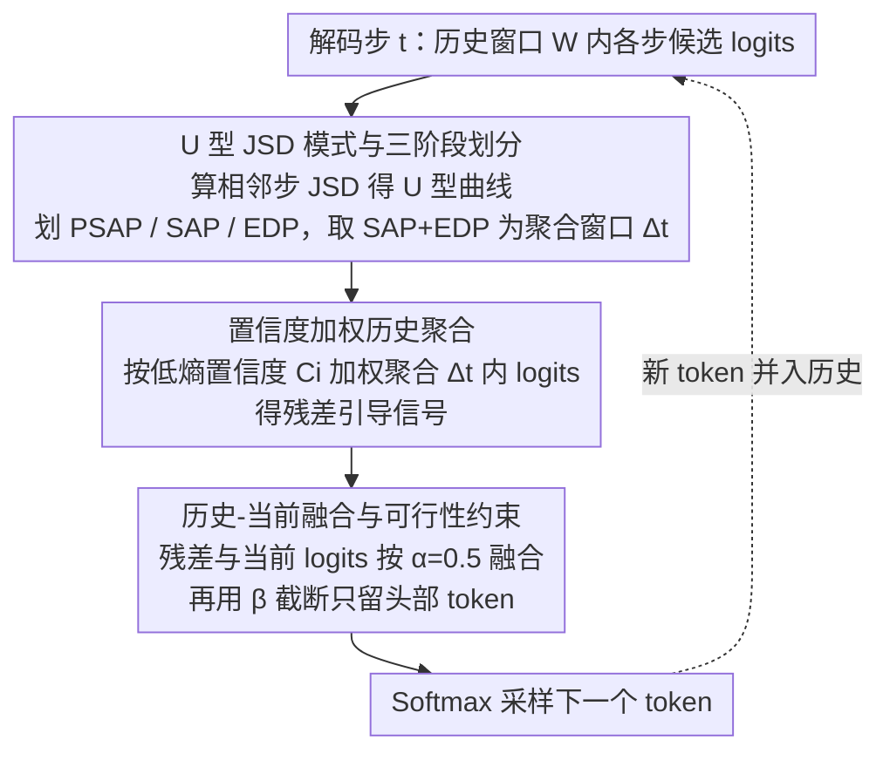

# Residual Decoding: Mitigating Hallucinations in Large Vision-Language Models via History-Aware Residual Guidance

**会议**: CVPR2026  
**arXiv**: [2602.01047](https://arxiv.org/abs/2602.01047)  
**代码**: 无  
**领域**: 幻觉检测  
**关键词**: 幻觉缓解, 解码策略, 视觉语言模型, 残差引导, 训练免

## 一句话总结
提出 Residual Decoding (ResDec)——一种训练免的即插即用解码策略，通过分析历史 token 的 logit 分布中的 U 型 JSD 模式发现语义锚定阶段，聚合该阶段的历史 logits 作为残差引导融入当前解码，以近乎零的额外推理开销有效抑制 LVLM 中的语言先验幻觉。

## 研究背景与动机
大型视觉语言模型（LVLM）虽然在多模态任务上表现优异，但深受**语言先验幻觉**困扰——在逐步生成回复时，文本上下文逐渐淹没视觉上下文，导致模型产生语法连贯但与图像不符的内容。

现有缓解方法的不足：(1) 训练型方法（数据去偏、偏好对齐等）需要额外训练和标注，扩展性差；(2) 对比解码方法（VCD、ICD 等）需要 2× 或更多推理时间和 GPU 内存；(3) 模型内部干预方法（修改注意力/FFN/层级）效率低、泛化性差。

**关键观察**：作者发现正确答案的信号已经嵌入在前序 token 的 logit 分布中。例如回答"The answer is D"时，在生成"The"、"answer"、"is"这几个引导 token 时，正确答案"D"的 logits 已经处于较高值；但在生成":"时，幻觉 token "C"的 logits 异常升高，最终超过真实 token。**幻觉的本质是幻觉 token 在某些时刻 logit 异常升高并逐步超越真实 token**。

## 方法详解

### 整体框架
ResDec 针对的是 LVLM 的“语言先验幻觉”——逐步生成时文本上下文慢慢淹没视觉上下文，吐出语法通顺但与图不符的内容。它不动模型架构、不训练，纯在解码阶段做文章：在当前解码步 $t$，分析历史窗口内 token 的 logit 演化、找到语义稳定的区间，把该区间的 logits 聚合成残差引导信号，再和当前 logits 加权融合后采样。核心依据是一个观察——正确答案的信号其实早已嵌在前序 token 的 logit 分布里（回答“The answer is D”时，“D”在生成引导词时 logit 就偏高），幻觉的本质是幻觉 token 在某些时刻 logit 异常升高、逐步反超真实 token。

整条解码回路可拆成三步串联：先用 U 型 JSD 模式从历史窗口里框出“语义已锚定”的可信区间，再对该区间做置信度加权聚合得到残差引导信号，最后把残差与当前 logits 融合并截断后采样；采出的新 token 又并入历史，驱动下一步。

### 关键设计

**1. U 型 JSD 模式与三阶段划分：定位“语义已锚定”的区间**

要复用历史 logit，先得知道哪段历史是可信的。ResDec 计算历史窗口 $\mathcal{W}$ 内相邻时间步候选分布的 Jensen-Shannon 散度，发现 JSD 呈 U 型变化，据此切成三段：**PSAP（语义前清晰阶段）**是 U 型左侧，分布从混乱走向收敛、仍有锚定不确定性；**SAP（语义锚定阶段）**是 U 型底部，JSD 接近 0、分布高度稳定，模型已牢牢锚定核心语义；**EDP（表达发散阶段）**是 U 型右侧，JSD 回升、模型追求多样表达、最易被语言先验带偏。ResDec 取 SAP+EDP 区间（U 型底部及右侧）的 logits 来构建残差引导——既拿到了已锚定的可信信号，又覆盖到容易出幻觉的发散段。

**2. 置信度加权历史聚合：让低熵、更确信的历史步说话更响**

历史各步可信度不一，简单平均会被高熵噪声拖累。在聚合窗口 $\Delta_t$ 内，对每个时间步 $i$ 先算局部置信度 $C_i = -\frac{1}{|\Omega_t|} \sum_{j=1}^{|\Omega_t|} \log P_i(j)$（低熵对应高置信），再按归一化置信权重把各步 logits 聚合成残差信号：

$$\text{logit}_\theta^{\text{res}}(y_t | T_{<t-1}) = \sum_{i \in \Delta_t} \frac{C_i}{\sum_j C_j} \cdot \text{logit}_\theta(\hat{y}_i | T_{<i})$$

这样越确信的历史步在残差里权重越大，把“语义锚定”那段的判断更干净地提取出来。

**3. 历史-当前融合与可行性约束：残差只做辅助校正，不喧宾夺主**

直接拿残差替代当前 logit 会引入不合理 token。ResDec 把历史残差和当前 logits 线性融合：

$$p_{\text{ResDec}}(y_t) = \text{Softmax}[(1-\alpha)\text{logit}_\theta(y_t) + \alpha \cdot \text{logit}_\theta^{\text{res}}(y_t)]$$

其中 $\alpha=0.5$。同时加一道截断约束 $\mathcal{V}_{\text{head}}$（$\beta=0.1$）：只保留概率不低于最大概率 $\beta$ 倍的 token，其余 token 的 logit 设为 $-\infty$。消融显示 $\alpha$ 一旦超过 0.5 性能就急剧下降，印证了历史残差是辅助校正而非替代解码这一定位。

### 损失函数 / 训练策略
- **完全训练免**，仅在解码阶段操作
- 复用推理过程中自然产生的历史 logits，无需额外前向传播
- 超参极简：$\alpha=0.5$、$\beta=0.1$、候选 token 池大小 $|\Omega_t| \in [64, 512]$

## 实验关键数据

### 主实验（POPE 平均结果）

| 模型 | 方法 | Accuracy ↑ | F1 ↑ |
|------|------|-----------|------|
| LLaVA-1.5 | Regular | 79.83 | 79.29 |
| LLaVA-1.5 | OPERA | 84.21 | 83.55 |
| LLaVA-1.5 | VISTA | 86.15 | 86.29 |
| LLaVA-1.5 | **ResDec** | **87.23** | **86.93** |
| Qwen2.5-VL | Regular | 86.11 | 84.74 |
| Qwen2.5-VL | VISTA | 88.83 | 88.99 |
| Qwen2.5-VL | **ResDec** | **90.16** | **89.56** |

### HallusionBench & CHAIR

| 模型 | 方法 | fACC ↑ | CHAIR_S ↓ | CHAIR_I ↓ |
|------|------|--------|-----------|-----------|
| LLaVA-1.5 | Regular | 17.9 | 55.0 | 16.3 |
| LLaVA-1.5 | MemVR | 17.9 | 46.6 | 13.0 |
| LLaVA-1.5 | **ResDec** | **18.2** | **42.7** | **12.6** |
| Qwen2.5-VL | Regular | 43.4 | 30.6 | 8.4 |
| Qwen2.5-VL | **ResDec** | **47.1** | **25.8** | **6.8** |

### 效率对比

| 方法 | 延迟(ms/token) | 吞吐量(token/s) | 内存(MB) |
|------|---------------|----------------|----------|
| Greedy | 28.54 | 35.04 | 14257 |
| VCD | 62.79 | 15.93 | 14967 |
| OPERA | 104.46 | 9.57 | 21300 |
| **ResDec** | **29.11** | **34.35** | **14296** |

### 消融实验

| $\alpha$ | $\beta$ | MME | POPE Acc | MMStar |
|---------|---------|-----|----------|--------|
| 0.25 | 0.1 | 2326 | 89.64 | 64.20 |
| **0.5** | **0.1** | **2348** | **90.16** | **65.40** |
| 0.75 | 0.1 | 1875 | 82.56 | 62.67 |
| 1.0 | 0.1 | 1583 | 72.50 | 61.80 |

### 关键发现
- ResDec 在三个 LVLM 上平均提升 7.84% Accuracy 和 8.01% F1（vs Regular）
- 延迟仅比 Greedy 多 0.02×，远优于 OPERA（3.7×）和 VCD（2.2×）
- $\alpha$ 超过 0.5 后性能急剧下降——历史残差是**辅助校正**而非替代解码
- 候选池大小在 64-512 之间最优，过小无法捕捉 JSD 变化，过大会引入早期噪声
- 跨多种解码策略（Nucleus、Top-K、Temperature、Greedy）均有效

## 亮点与洞察
- **洞察深刻**：发现幻觉的发生机制——幻觉 token 在解码过程中 logit 逐步升高超过真实 token——为理解和缓解幻觉提供了新视角
- **U 型 JSD 模式**：优雅地揭示了 LVLM 解码过程中"语义收敛→锚定→发散"的三阶段演化
- **极低开销**：复用已有历史 logits，无需额外前向传播，延迟仅增加 2%，是目前效率最高的幻觉缓解方法
- **即插即用**：不修改模型架构，不需要训练，兼容多种解码策略和 LVLM 架构
- 从 PMI/语言先验的贝叶斯视角提供了 ResDec 的理论支撑

## 局限与展望
- $\alpha=0.5$ 是一个全局固定值，不同任务/模型可能需要不同的最优值，自适应 $\alpha$ 调节是可改进方向
- U 型 JSD 模式在极短回复（如 Yes/No）场景下的适用性需要进一步分析
- 仅在 7B 规模模型上验证，更大规模模型上的效果未知
- 候选 token 池大小需要手动调整，自动化选择机制有待探索

## 相关工作与启发
- **vs VCD（对比解码）**：VCD 需要额外一次无图像前向传播，延迟翻倍；ResDec 复用已有信息，几乎无额外开销
- **vs OPERA（注意力惩罚）**：OPERA 延迟 3.7×，内存增加 7GB；ResDec 仅增 39MB，且效果更好
- **vs DoLa（层对比）**：DoLa 修改模型内部结构，泛化性受限；ResDec 纯解码策略，更通用

## 评分
- 新颖性: ⭐⭐⭐⭐⭐ U 型 JSD 模式的发现和历史残差引导解码的设计极具原创性，从根本机制上理解幻觉
- 实验充分度: ⭐⭐⭐⭐⭐ 11 个 benchmark、3 个 LVLM、8+ 基线方法、多维消融和效率分析
- 写作质量: ⭐⭐⭐⭐ 结构清晰，insight 表达到位，U 型 JSD 图示直观
- 价值: ⭐⭐⭐⭐⭐ 实用价值极高——训练免、无额外开销、即插即用，有望成为 LVLM 解码的标准组件

## 亮点与洞察

## 局限与展望

## 相关工作与启发

## 评分
- 新颖性: 待评
- 实验充分度: 待评
- 写作质量: 待评
- 价值: 待评

<!-- RELATED:START -->

## 相关论文

- [\[ICML 2026\] Adaptive Residual-Update Steering for Low-Overhead Hallucination Mitigation in Large Vision Language Models](../../ICML2026/hallucination/adaptive_residual-update_steering_for_low-overhead_hallucination_mitigation_in_l.md)
- [\[CVPR 2026\] Thinking in Uncertainty: Mitigating Hallucinations in MLRMs with Latent Entropy-Aware Decoding](thinking_in_uncertainty_mitigating_hallucinations_in_mlrms_with_latent_entropy-a.md)
- [\[ACL 2026\] Mitigating Hallucinations in Large Vision-Language Models without Performance Degradation](../../ACL2026/hallucination/mitigating_hallucinations_in_large_vision-language_models_without_performance_de.md)
- [\[CVPR 2026\] MAD: Modality-Adaptive Decoding for Mitigating Cross-Modal Hallucinations in Multimodal Large Language Models](mad_modality-adaptive_decoding_for_mitigating_cross-modal_hallucinations_in_mult.md)
- [\[CVPR 2026\] HulluEdit: Single-Pass Evidence-Consistent Subspace Editing for Mitigating Hallucinations in Large Vision-Language Models](hulluedit_single-pass_evidence-consistent_subspace_editing_for_mitigating_halluc.md)

<!-- RELATED:END -->
