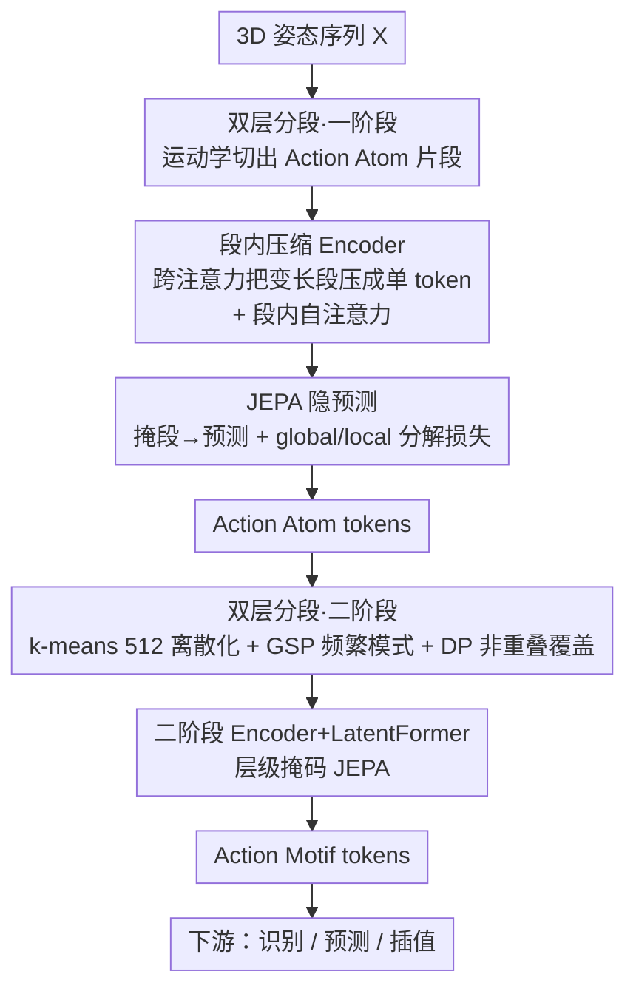

# Action Motifs: Self-Supervised Hierarchical Representation of Human Body Movements

**会议**: CVPR 2026  
**论文**: [CVF Open Access](https://openaccess.thecvf.com/content/CVPR2026/html/Kinoshita_Action_Motifs_Self-Supervised_Hierarchical_Representation_of_Human_Body_Movements_CVPR_2026_paper.html)  
**代码**: 无（项目页 https://vision.ist.i.kyoto-u.ac.jp/ ）  
**领域**: 人体理解 / 自监督表示学习 / 人体行为建模  
**关键词**: 动作基元, 层级表示, 自监督, JEPA, 3D姿态

## 一句话总结
本文提出 A4Mer，一个嵌套的隐空间 Transformer，从 3D 姿态序列中**完全自监督**地学出「Action Atoms（原子动作）→ Action Motifs（动作母题）」两级层级表示——让语义有意义、可复用的变长动作片段自下而上"涌现"出来，并用它在动作识别、长时运动预测、运动插值三项任务上显著超越现有定长表示。

## 研究背景与动机
**领域现状**：人体行为建模需要一个能刻画身体运动「组合性（compositionality）」的表示。现有自监督方法（重建、掩码建模、2D→3D 提升、对比学习等）几乎都在**固定粒度**上学表示：逐帧（像字母）、逐 clip（像 n-gram）、或整段视频（像整篇文章）。

**现有痛点**：逐帧表示太细、冗余；clip 级表示与语义边界错位；视频级表示又把可复用的运动模式整个糊掉。三者都没法表达"举手"这种既能属于"开门"又能属于"够取"的可复用中层片段。

**核心矛盾**：要抽出"短语级"的可复用运动片段，面临两个**鸡生蛋**的纠缠。其一是**分段与语义**：不同的时间分段会改变动作语义、进而改变表示空间里的距离；但不知道语义又定不出边界。其二是**表示与组合**：即使边界已知，运动表示本身和它们的时间组合也要联合学——组合决定需要什么样的表示，表示又约束组合能怎么形成。人工标注这种两级互相依赖的层级结构不现实，只能让它从数据里无监督地涌现。

**本文目标**：在没有任何动作标签的前提下，学出一个层级表示——底层 Action Atoms 捕捉原子关节运动，上层 Action Motifs 由 Atoms 的时间组合形成、编码跨不同整体动作复现的相似身体运动，并抽掉个体/情境带来的变化。

**切入角度**：把原子动作类比成语言里的"词"，那么反复出现、共同表达不同动作的时间模式就是"短语"——可在不同句子（动作）间复用。作者主张让这些短语级片段通过自下而上的层级组合**自然涌现**，而不是预先指定长度。

**核心 idea**：用一个嵌套的隐空间 Transformer（A4Mer），以掩码隐 token 预测（JEPA）为统一 pretext，自下而上地让变长、语义对齐的 Action Motifs 从 Action Atoms 的复现模式中涌现。

## 方法详解

### 整体框架
A4Mer 的输入是一段 3D 姿态序列 $X=(x_1,\dots,x_T)$，输出是两级隐表示——下层 Action Atom token、上层 Action Motif token，供下游任务使用。整个系统是一个**两阶段、共享同款架构（Encoder + LatentFormer）的嵌套结构**：第一阶段先按运动学线索把序列切成 Atom 片段并学其表示；然后把整个数据集喂进训练好的一阶段模型，挖出 Atom 的复现模式作为二阶段的 Motif 片段；最后两阶段端到端联合训练。两阶段都靠同一个 pretext——把序列里若干片段掩掉、在各自隐空间里预测被掩片段的 token。

### 关键设计

**1. 自下而上两阶段嵌套架构：让中层语义片段"涌现"而非预设**

直接定义"什么是一个可复用动作片段"很难——这正是分段-语义纠缠的根源。A4Mer 的做法是放弃预设长度，改成两级自下而上组合：先在细粒度（Atom）上学好表示，再把 Atom 的**复现模式**作为上层（Motif）片段，二阶段在这些片段上再学一遍表示。这样高层片段是作为低层运动的"反复出现的模式"自然冒出来的，而不是人为切。训练顺序也照此：先单独训一阶段 → 用它找出二阶段片段 → 两阶段端到端联合训练。这个交替过程让"学语义"和"分片段"互相喂养，从而拆开了鸡生蛋的依赖。两阶段共享 Encoder + LatentFormer 同款结构，区别只在喂进去的片段粒度不同。

**2. Encoder 把变长片段压成单 token + 段内自注意力**

一个片段（不管 Atom 还是 Motif）时长随动作类型、个体、情境而变，要在统一框架里表示变长片段并不平凡。Encoder 借鉴 BLT 的思路：对第 $k$ 个片段，先用段内输入 token $X_k=\{x_t\mid s(t)=k\}$ 的 max-pooling 初始化一个隐 token $z_k$，再以 $z_k$ 为 query、$X_k$ 为 key/value 做**跨注意力**，把整段消化成一个 token（$s(t)$ 返回帧 $t$ 所属段号，序列里段数 $K$ 随输入变化）。Encoder 用 Transformer-decoder 结构，在跨注意力之外还交替做**段内自注意力**——刻意把自注意力限制在同一片段内的 token，而不是全序列：若放开全序列自注意力，模型会对远处帧之间的细微姿态相似过度反应，妨碍语义理解。把"段内信息聚合"和"段间关系建模"显式解耦、后者交给 LatentFormer（在隐 token 之间做自注意力），让 A4Mer 在语义层面学到运动间的时间关系。

**3. 双层分段：运动学切 Atom + 频繁模式挖 Motif**

两级表示需要两套分段规则。**Atom 分段**靠运动学线索：把"线性外推的关节轨迹"与"实际观测轨迹"的偏差当作细粒度运动的起点，非线性变化处即为 Atom 边界。**Motif 分段**则要找跨不同动作共享的 Atom 复现模式：先把整个数据集过一遍一阶段模型得到 Atom 序列，用 k-means（簇数 512）把 Atom 离散成类别码（聚类只在训练时做，推理时用最近邻给每个 Atom 分簇），再用 Generalized Sequential Pattern (GSP) 算法从这些码序列里迭代扩展那些出现频率高于阈值的频繁子序列，挖出共现模式。由于一个 Atom 可能被多个模式覆盖，作者对每条序列做**动态规划**，选一组用最少模式数覆盖整条序列的非重叠模式集——得到干净的 Motif 切分。

**4. JEPA 隐 token 预测 + global/local 分解损失**

为了联合学表示和它们的时间组合，两阶段都解同一个 pretext：随机掩掉片段集合 $\mathcal{K}$，特征提取器 $f_\theta$（Encoder+LatentFormer）只看可见片段输出 token，预测器 $g_\phi$ 再补出被掩片段的隐 token。采用 JEPA：损失在**隐空间**算而非姿态空间，让模型学运动的语义本质、对琐碎姿态差异不敏感（也省去对比学习要手工设计的保语义增广）。原始 JEPA 目标为

$$\min_{\theta,\phi,M}\sum_{k\in\mathcal{K}} \mathrm{SL1}\big(\hat z_k - \mathrm{sg}(z_k)\big),\quad \hat Z=g_\phi(M, f_\theta(X_{vis})),$$

其中目标 $Z$ 用 stop-gradient 截断、目标网络 $\bar\theta$ 用 $\theta$ 的 EMA 更新以防表示坍塌，$\mathrm{SL1}$ 是 smooth L1。端到端训练时采用**层级掩码**：被选中掩掉的 Motif 段，其下属 Atom 段也一起掩，防止二阶段从一阶段泄漏的目标信息里"作弊"。

更关键的是 **global/local 分解**：原目标没约束情境信息该烘进表示里还是该由模型从序列推断，为了逼出"上下文无关、高复用"的表示，把每个预测 token 拆成代表整段总体运动的全局分量 $z_g=\frac{1}{|\mathcal{K}|}\sum_k z_k$ 与局部偏差 $z_k^l=z_k-z_g$，损失对局部分量加重：

$$L=\frac{1}{|\mathcal{K}|}\sum_{k\in\mathcal{K}} L_k^l + \frac{\alpha\lambda_k}{|\mathcal{K}|}L_g,\quad L_k^l=\mathrm{SL1}(\hat z_k^l - z_k^l),\ L_g=\mathrm{SL1}(\hat z_g - z_g),$$

其中 $\lambda_k=\mathrm{sg}(L_k^l/L_g)$、$\alpha=0.05$，动态加权保证局部项主导。消融显示：不分解会让序列内所有 token 坍缩成相似表示、导致 Motif 段被切得过长；只留局部项又丢掉全局上下文、无法反映时间组合传达的语义。

**5. AMD 数据集与足部相机标注：为层级学习提供自然长序列**

要学"日常动作里复现的运动母题"，需要在真实家居里自由活动、带逐帧 3D 标注的长序列，而现有数据集要么 MoCap 套装让外观不自然、要么 RGB 视频被自/环境遮挡严重、动作种类受限。作者构建 **Action Motif Dataset (AMD)**：50 名受试者（21–69 岁）在布置好的客厅里做家务，24 台相机、30fps、共 14.2 小时，每段 1–17 分钟、不规定动作顺序以保留自然变化。标注上扩展 SMPLify-X 做多视角优化（固定 body scan 得到的形状参数），并加一项地面相交损失 $E_f=\sum_{v\in V}\max(-v_z,0)$ 把 SMPL 顶点压在地面之上。针对腿部最常被遮挡这一观察，他们做了个巧设计：在每只脚上装微型**足部相机**、并在天花板和桌底贴 ChArUco 标记（这些标记从天花板相机看不到，不破坏场景外观），用 PnP 定位足部相机、把足部相对位姿作为约束并入 SMPL 拟合，从而在重遮挡下也能拿到准确逐帧标注。

### 损失函数 / 训练策略
核心目标即上式 $L$（局部主导的 global/local 分解 smooth L1）。训练流程：① 先以 Atom 分段训一阶段；② 全数据集过一阶段 → k-means(512) + GSP + DP 得 Motif 段；③ 两阶段端到端联合训练，配层级掩码。所有数据集下采样到 5fps，模型输入固定为 30 秒姿态序列。下游头各自轻量：识别用 1 层 Transformer encoder 做逐帧分类（或零样本加权 k-NN）；预测用"下一隐 token"自回归头（同时估计 token 与段长）+ 独立训练的解码器；插值在未观测隐位置插入可学习 token 再解码。

## 实验关键数据

### 主实验
所有方法在 AMD 上预训练；动作识别在 HiK 数据集上训/评（k-NN 零样本 + 训练头两种），预测与插值在 AMD 上评并零样本迁移到 HiK，指标用 MPJPE（mm）。

| 方法 | Pretext | 分段 | Recog k-NN(top-1/-3) | Recog head | Pred AMD↓ | Pred HiK↓ | Interp AMD↓ | Interp HiK↓ |
|------|---------|------|------|------|------|------|------|------|
| MotionBERT | 2D→3D | frame | 1.77 / 0.35 | 27.9 | 237 | 199 | 141 | 124 |
| USDRL | contrast | frame | 31.1 / 43.0 | 30.1 | 171 | 155 | 137 | 127 |
| PUMPS | recon | frame | 16.1 / 31.2 | 14.0 | 214 | 209 | 197 | 188 |
| MacDiff | denoise | clip | 22.1 / 46.5 | 30.3 | 210 | 132 | 186 | 110 |
| BehaveMAE | MAE | clip | 20.9 / 22.1 | 35.6 | 167 | 288 | 163 | 362 |
| H2OT | 2D→3D | – | 26.8 / 28.7 | 31.8 | 187 | 145 | 143 | 123 |
| **A4Mer** | **JEPA** | **variable** | **31.7 / 59.0** | **38.1** | **150** | **120** | **126** | **110** |

A4Mer 在三项任务上全面最优：识别 top-3 k-NN 达 59.0%（次优 46.5%），训练头 38.1%；预测与插值的 MPJPE 也最低，且零样本迁移到 HiK 仍领先，说明 Action Motif 的语义而非定长姿态相似在起作用。

### 消融实验
SL 为整个数据集上 Action Motif 段的平均长度。

| 配置 | 替换为 | SL | Recog k-NN↑ | Recog head↑ | Pred↓ | Interp↓ |
|------|--------|----|------|------|------|------|
| 局部+全局(动态权) | — | 10.6 | 38.1 | 59.0 | 150 | 126 |
| $L_k^l+\lambda_k L_g$ | Eq.(1) 原JEPA | 24.1 | 15.1 | 51.7 | 222 | 210 |
| 只 $L_k^l$ | — | 22.3 | 16.2 | 51.0 | 254 | 218 |
| $L_k^l+L_g$(等权) | — | 14.5 | 25.8 | 50.2 | 188 | 181 |
| 段内注意力 | 全序列注意力 | — | 22.0 | 54.8 | 212 | 197 |
| 变长 Motif 段 | 逐帧 | 1 | 31.5 | 58.8 | 309 | 154 |
| 变长 Motif 段 | clip(=平均段长) | 10 | 26.3 | 55.5 | 208 | 183 |
| JEPA | BERT 式 | — | 34.8 | 58.2 | 169 | 112 |

### 关键发现
- **global/local 分解是最大功臣**：去掉它（回到原 JEPA Eq.1）识别 k-NN 从 38.1 暴跌到 15.1、段平均长度从 10.6 膨胀到 24.1——token 坍缩导致 Motif 被切得过长；只留局部项更糟（16.2）。等权也明显不如动态加权。
- **变长 Motif 分段不可替代**：换成逐帧，预测 MPJPE 从 150 恶化到 309；换成定长 clip 三项都退化，证明语义对齐的变长片段才是收益来源。
- **JEPA 优于 BERT 式重建**：隐空间预测让表示抓语义本质、对琐碎姿态不敏感，且 smooth L1 让隐空间呈"曼哈顿几何"利于 k-means 聚类、方便二阶段分段。
- 段内注意力相比全序列注意力在识别 head（54.8→更高）等指标上更稳，因为它逼 Encoder 专注段内聚合、把段间推理留给 LatentFormer。

## 亮点与洞察
- **"涌现"而非"切分"的层级建模**：把可复用动作片段当作低层模式的频繁共现来发现，绕开了"分段-语义"鸡生蛋；语言里"词→短语"的类比也非常贴切，方法设计跟着这个隐喻走。
- **global/local 分解是点睛之笔**：用一行损失拆分 + 动态权重就把"上下文无关、高复用"这一抽象诉求落地，消融里它对防坍缩、定段长的影响最直接，是可迁移到其他 JEPA 表示学习的 trick。
- **足部相机 + 天花板标记的标注巧思**：抓住"腿最常被遮、房间有天花板"两个朴素观察，用不破坏外观的标记在重遮挡下拿到逐帧 SMPL，是数据工程层面很聪明的设计。
- 把识别/预测/插值统一在同一隐表示上、且能零样本迁移，说明 Action Motif 确实是任务无关的"行为建模基本单元"。

## 局限与展望
- **依赖自建数据集**：核心结论建立在 AMD 上，足部相机 + 天花板标记的采集方案重、不易复现，外部数据上的泛化有待验证。
- **Motif 分段是多步离线流程**：k-means(512) + GSP + DP 串联、聚类只在训练做，簇数等超参对涌现的片段质量影响未充分探究；GSP 的频率阈值也是隐含设定。
- **足部相机定量增益小**：mIoU 仅 0.906→0.910（评测用全身可见帧，对其有利），作者主要靠定性说明价值，量化证据偏弱。
- HiK 的多标签太难，作者把动作并成更粗的单标签自定义类来评识别，与原始标注协议不完全可比。
- 改进方向：把 Motif 发现端到端可微化、引入跨数据集预训练验证通用性、探索更长时序的多级（Atom→Motif→Action）扩展。

## 相关工作与启发
- **vs 定长自监督（MotionBERT/USDRL/PUMPS/MacDiff/BehaveMAE/H2OT）**：它们在帧/clip/视频固定粒度上学表示，与语义边界错位或糊掉可复用模式；A4Mer 学语义对齐的**变长**片段，三项任务全面领先且能零样本迁移。
- **vs 对比学习**：对比法需精心设计保语义增广；A4Mer 走 JEPA、在隐空间预测、无需手工增广即捕捉语义。
- **vs 既有 JEPA（掩若干关节）**：少数前作对几个关节掩码做 JEPA，A4Mer 改为掩"压缩了运动片段的隐 token"，预测的是抽象表示，从而抓住段级语义而非单纯姿态相似。
- **vs 动作标签监督方法**：标签法识别更准但标注昂贵、受限于预定义类、难泛化到未见动作；本文从大量未裁剪自然序列里直接学，无需动作标签。

## 评分
- 新颖性: ⭐⭐⭐⭐⭐ 用"涌现 + JEPA + 频繁模式挖掘"组出一套全新的层级运动表示，思路自洽且别致。
- 实验充分度: ⭐⭐⭐⭐ 三任务 + 充分消融，但主要绑定自建 AMD，外部泛化与采集可复现性偏弱。
- 写作质量: ⭐⭐⭐⭐⭐ 动机层层推导、语言隐喻贯穿、图文与公式对应清晰。
- 价值: ⭐⭐⭐⭐ 提出可作为人体行为建模基础单元的表示 + 一个带巧妙标注方案的数据集，对自监督动作理解有推动。

<!-- RELATED:START -->

## 相关论文

- [\[CVPR 2026\] PRISM: Learning a Shared Primitive Space for Transferable Skeleton Action Representation](prism_learning_a_shared_primitive_space_for_transferable_skeleton_action_represe.md)
- [\[CVPR 2026\] SAM 3D Body: Robust Full-Body Human Mesh Recovery](sam_3d_body_robust_full-body_human_mesh_recovery.md)
- [\[CVPR 2025\] FSFM: A Generalizable Face Security Foundation Model via Self-Supervised Facial Representation Learning](../../CVPR2025/human_understanding/fsfm_a_generalizable_face_security_foundation_model_via_self-supervised_facial_r.md)
- [\[CVPR 2026\] Pressure2Motion: Hierarchical Human Motion Reconstruction from Ground Pressure with Text Guidance](pressure2motion_hierarchical_human_motion_reconstruction_from_ground_pressure_wi.md)
- [\[CVPR 2026\] Interact2Ar: Full-Body Human-Human Interaction Generation via Autoregressive Diffusion Models](interact2ar_full-body_human-human_interaction_generation_via_autoregressive_diff.md)

<!-- RELATED:END -->
