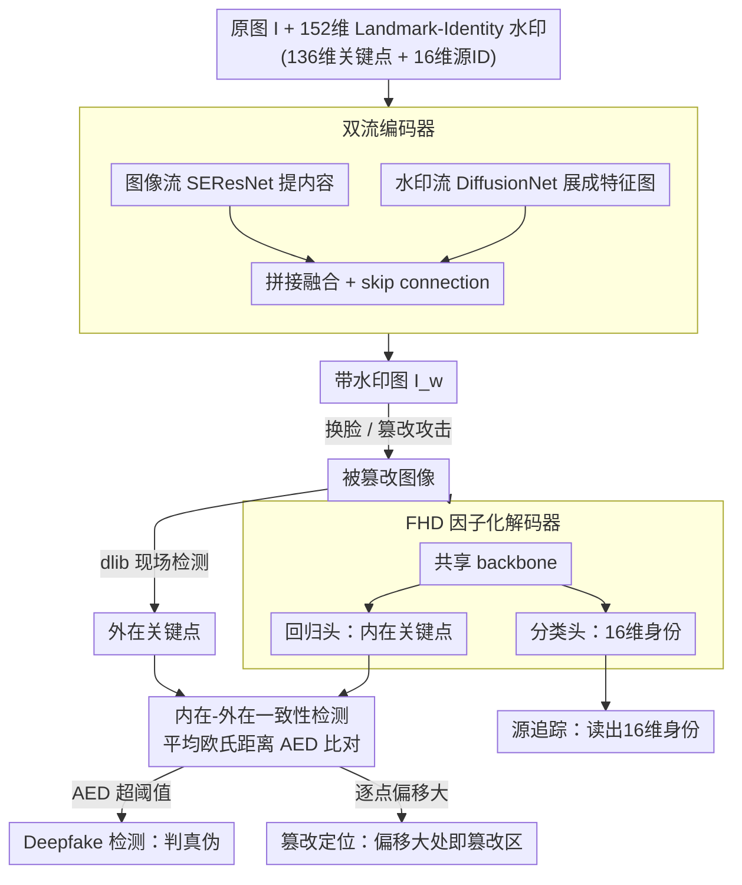

# All in One: Unifying Deepfake Detection, Tampering Localization, and Source Tracing with a Robust Landmark-Identity Watermark

**会议**: CVPR2026  
**arXiv**: [2602.23523](https://arxiv.org/abs/2602.23523)  
**代码**: [GitHub](https://github.com/vpsg-research/LIDMark)  
**领域**: 人体理解  
**关键词**: deepfake detection, watermarking, tampering localization, source tracing, proactive forensics, facial landmark

## 一句话总结

提出 LIDMark，首个将 deepfake 检测、篡改区域定位和源追踪统一到单一主动取证框架中的方法——通过嵌入 152 维 Landmark-Identity 水印（136D 面部关键点 + 16D 源 ID），利用内在/外在一致性实现三合一取证，PSNR/SSIM 和检测精度均超越现有方法。

## 研究背景与动机

深度伪造（Deepfake）技术快速发展，带来了严重的安全威胁。现有取证方法分为两大类：

**被动取证**：直接从图像中提取伪造痕迹进行检测。问题在于：(a) 仅能做二分类（真/假），无法定位篡改区域或追溯来源；(b) 泛化性差，对未见过的伪造方法性能急剧下降。

**主动取证（水印方法）**：预先在图像中嵌入水印，通过水印的破坏/保留情况进行取证。现有水印方法（如 FaceSigns、MBRS、PIMoG）的局限：
   - 大多仅支持检测，不支持篡改定位
   - 水印容量有限（通常 30 bits），难以同时编码多种信息
   - 检测和定位需要不同的水印设计，难以统一

**核心洞察**：面部关键点（landmarks）天然具备两种互补性质——(1) 对篡改敏感（swap 后关键点分布会变化），适合定位；(2) 身份 ID 需要对伪造鲁棒，适合源追踪。将两者编码为统一水印，可同时解决三大取证任务。

## 核心问题

如何设计一个统一的主动取证框架，在单一水印中同时实现：
- **Deepfake 检测**：判断图像是否经过篡改
- **篡改定位**：精确定位被篡改的面部区域
- **源追踪**：追溯图像的原始来源身份

## 方法详解

### 整体框架

LIDMark 是一套主动取证框架：在图像发布前，编码器先把一段 152 维的 Landmark-Identity 水印（136 维面部关键点 + 16 维源身份）嵌进人脸图，得到带水印图像 $I_w = E(I, m)$；当这张图被换脸或篡改后，解码器再从中恢复出当初嵌入的水印，并与对图像现状重新检测到的关键点做一致性比对。比对出的“内在 vs 外在”差异同时支撑三件事——判真伪、定位篡改区域、追溯源身份，于是过去要分三套方案的任务被收进了同一条流水线。

### 关键设计

**1. 152 维 Landmark-Identity 水印：把水印从比特串升级成语义编码**

传统主动取证把水印当成一串任意比特（通常仅 30 bits），既装不下多种信息，也无从定位篡改。LIDMark 换了思路：水印的 136 维来自 68 个面部关键点的 $(x,y)$ 坐标（归一化到 $[0,1]$），16 维来自源身份的二进制编码。两部分的物理含义恰好互补——关键点对篡改敏感（换脸后恢复出的关键点会和真实人脸对不上，天然适合定位），身份码则要求对伪造鲁棒（适合追溯来源）。正因为水印本身带语义，单张图就能同时编码“长什么样”和“是谁”，这是后面三合一取证的根基。

**2. 双流编码器 + FHD 因子化解码器：嵌得进、取得出**

编码器走双流：图像流用 SEResNet 提内容特征，水印流用 DiffusionNet 把 152 维向量摊成与图同尺寸的特征图，两者拼接融合并加 skip connection 保住画质，嵌入过程即 $I_w = E(I, m)$，$m = [m_{\text{land}}, m_{\text{id}}]$。解码端没有给关键点和身份各配一个 decoder，而是用因子化头部解码器（FHD）：共享一个 backbone 提公共特征，再分出回归头输出 136 维关键点 $\hat{m}_{\text{land}}$（L1 损失）、分类头输出 16 维身份 $\hat{m}_{\text{id}}$（BCE 损失）。共享 backbone 让两个任务互相增益，参数也比双 decoder 更省。

**3. 内在-外在一致性检测：三合一取证的枢纽**

有了可恢复的语义水印，检测就被转化成一个“对不对得上”的一致性检验。内在关键点 $\hat{m}_{\text{land}}$ 是 FHD 从水印里解出来的（即当初嵌入的原始人脸），外在关键点 $m_{\text{ext}}$ 是用 dlib 等检测器对当前图像现场测的。两者一比：全局上算平均欧氏距离 $\text{AED} = \frac{1}{68}\sum_{i=1}^{68} \| \hat{p}_i - p_i^{\text{ext}} \|_2$，超过阈值 $\tau$ 即判为伪造；区域上看哪些关键点偏移大，那片就是篡改区；来源上则直接读分类头解出的 16 维身份。一次水印恢复，三种结论顺势而出。

### 损失函数与训练策略

训练分两阶段：Stage 1 先用 JPEG 压缩、高斯噪声、裁剪等常规失真预训练编解码器，建立基础的嵌入/提取能力；Stage 2 再用 SimSwap、UniFace、CSCS、StarGAN-v2 生成的伪造图微调，专门强化对 deepfake 场景的鲁棒性。总损失把三项目标加权到一起：

$$\mathcal{L} = \lambda_1 \mathcal{L}_{\text{image}} + \lambda_2 \mathcal{L}_{\text{land}} + \lambda_3 \mathcal{L}_{\text{id}}$$

其中 $\mathcal{L}_{\text{image}}$ 为图像质量损失（L2 + LPIPS），$\mathcal{L}_{\text{land}}$ 为关键点回归 L1 损失，$\mathcal{L}_{\text{id}}$ 为 ID 分类 BCE 损失。

## 实验关键数据

### 图像质量

| 分辨率 | PSNR ↑ | SSIM ↑ | 水印容量 |
|--------|--------|--------|---------|
| 128×128 | **40.22** | **0.98** | 152 bits |
| 256×256 | **44.31** | **0.99** | 152 bits |
| 基线最佳（MBRS） | 38.76 | 0.97 | 30 bits |

在更高容量（152 bits vs 30 bits）的情况下，LIDMark 的图像质量仍超越所有基线。

### Deepfake 检测性能

| 数据集 | 方法 | AUC ↑ |
|--------|------|-------|
| CelebA-HQ | LIDMark | **最优** |
| LFW | LIDMark | **最优** |

在 CelebA-HQ 和 LFW 两个数据集上，LIDMark 的检测 AUC 均优于现有主动取证方法。

### 篡改定位精度

通过区域级关键点偏移分析，LIDMark 能够生成与换脸区域高度吻合的篡改热力图，IoU 显著优于基于全局水印差异的方法。

### 源追踪准确率

16D ID 在各种伪造攻击后的恢复准确率超过 95%，证明 ID 分量的鲁棒性设计有效。

### 消融实验

| 组件 | PSNR | 检测 AUC | 说明 |
|------|------|----------|------|
| 完整 LIDMark | 40.22 | 最优 | — |
| 去掉 skip connection | 38.5 | 下降 | 图像质量显著下降 |
| 双 decoder 替代 FHD | 39.8 | 相当 | 参数更多，质量略降 |
| 仅 Stage 1 训练 | 40.1 | 下降 | 对 deepfake 不鲁棒 |

## 亮点与洞察

1. **三合一统一框架**：首次将检测、定位、追踪统一到单个水印方案中，不需要为不同任务设计不同的水印
2. **152 维水印设计极其巧妙**：利用面部关键点的天然双重属性（篡改敏感 + 语义丰富），将水印从"信息编码"提升为"语义编码"
3. **内在-外在一致性**是核心创新——将水印恢复问题转化为一致性检验问题，自然实现了从检测到定位的扩展
4. **FHD 因子化解码设计**：共享 backbone + 任务特定头部，比分离式设计更高效且互相增益
5. **高信息容量下的高图像质量**：152 bits 远超现有方法（30 bits），而 PSNR/SSIM 反而更优

## 局限性

1. **主动取证的根本限制**：需要在图像发布前嵌入水印，对已存在的无水印图像无效
2. **分辨率限制**：实验仅在 128×128 和 256×256 上验证，对高分辨率（1024+）的可扩展性不明确
3. **伪造方法覆盖**：微调阶段仅使用 4 种 deepfake 方法，对新型伪造技术（如扩散模型生成）的泛化性需进一步验证
4. **关键点检测器依赖**：外在一致性依赖 dlib 等关键点检测器的精度，检测器失败时框架受影响
5. **对抗性攻击**：未讨论针对水印的对抗性去除攻击的鲁棒性

## 相关工作与启发

- 与 **FaceSigns**（Neekhara et al., 2022）相比：FaceSigns 仅做检测（水印有/无），LIDMark 扩展到定位和追踪
- 与 **MBRS**（Jia et al., 2021）相比：MBRS 水印容量仅 30 bits 且无篡改定位能力，LIDMark 152 bits + 定位
- 与被动方法（**Xception**、**Face X-ray**）相比：被动方法无需预处理但泛化差，LIDMark 牺牲部署便利性换取可靠三合一能力
- **启发**：水印不必是任意比特串——利用领域语义（关键点）编码水印，可以实现远超传统水印的功能。这一思路可推广到其他领域（如医学图像的解剖关键点、遥感图像的地标编码）

## 评分

- **创新性**: ⭐⭐⭐⭐⭐ — 首个三合一主动取证框架，水印设计巧妙
- **实验充分性**: ⭐⭐⭐⭐ — 多数据集多基线对比充分，但缺乏高分辨率和更多伪造方法验证
- **实用性**: ⭐⭐⭐⭐ — 主动取证场景有明确应用价值，但需预先嵌入水印
- **写作质量**: ⭐⭐⭐⭐ — 框架描述清晰，动机论证合理
- **综合评分**: ⭐⭐⭐⭐ (4.0/5)

<!-- RELATED:START -->

## 相关论文

- [\[CVPR 2026\] Unleashing Vision-Language Semantics for Deepfake Video Detection](unleashing_vision-language_semantics_for_deepfake_video_detection.md)
- [\[CVPR 2026\] Unifying Precise Keyframes and Semantic Control via Multi-level Diffusion](unifying_precise_keyframes_and_semantic_control_via_multi-level_diffusion.md)
- [\[CVPR 2026\] BarbieGait: An Identity-Consistent Synthetic Human Dataset with Versatile Cloth-Changing for Gait Recognition](barbiegait_an_identity-consistent_synthetic_human_dataset_with_versatile_cloth-c.md)
- [\[CVPR 2026\] Superman: Unifying Skeleton and Vision for Human Motion Perception and Generation](superman_unifying_skeleton_and_vision_for_human_motion_perception_and_generation.md)
- [\[CVPR 2025\] Two is Better than One: Efficient Ensemble Defense for Robust and Compact Models](../../CVPR2025/human_understanding/two_is_better_than_one_efficient_ensemble_defense_for_robust_and_compact_models.md)

<!-- RELATED:END -->
