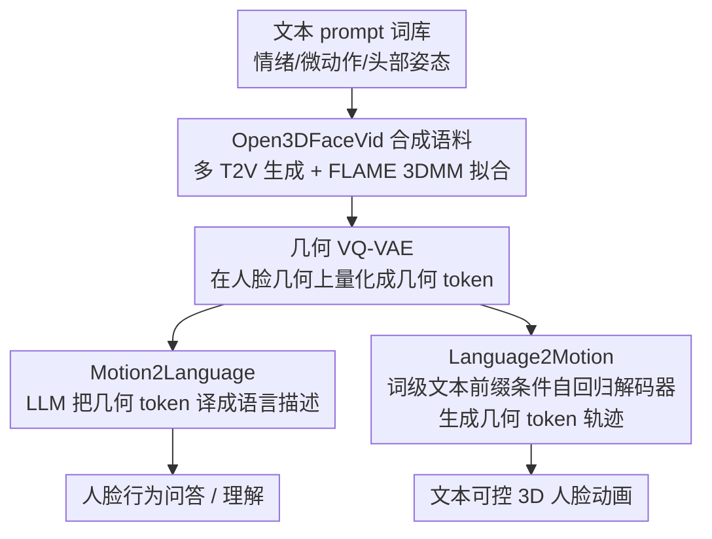

# Bridging Facial Understanding and Animation via Language Models

**会议**: CVPR 2026  
**论文**: [CVF Open Access](https://openaccess.thecvf.com/content/CVPR2026/html/Song_Bridging_Facial_Understanding_and_Animation_via_Language_Models_CVPR_2026_paper.html)  
**代码**: [项目页 TDMM-LM](https://songluchuan.github.io/TDMM-LM/)（含数据集与可视化）  
**领域**: 人体理解 / 3D 人脸动画 / 多模态  
**关键词**: 3D 人脸参数, 几何 token, Motion2Language, Language2Motion, 合成数据集

## 一句话总结
这篇论文用 T2V 大模型合成了一个约 80 小时、情绪均衡的 3D 人脸语料 Open3DFaceVid，并把每帧人脸几何用 VQ-VAE 离散成"几何 token"喂给 LLM，从而第一次把 3D 人脸参数建模当成"语言问题"——同一套 LLM 既能把人脸运动 token 翻译成自然语言描述（Motion2Language），也能从文本 prompt 生成可控的 3D 人脸运动轨迹（Language2Motion）。

## 研究背景与动机
**领域现状**：文本驱动的全身动画（text-to-motion）这几年进展飞快，靠的是大规模、文本对齐的身体动作数据集加上"把动作 tokenize、像语言一样自回归解码"的范式（如 MotionCLIP、T2M-GPT）。但同样的范式搬到人脸上就卡住了。

**现有痛点**：人脸理解/动画落后主要有两个具体原因。第一是 **token 效率灾难**：现有视频 LLM 把每一帧当成几百个图像 token 处理，为省成本只能降采样或稀疏抽关键帧；可人脸表情往往只在几帧内展开、对时间连续性极度敏感，抬眉、嘴角抽动、转瞬即逝的假笑这类微表情一抽帧就没了，剩下的帧每秒还要吃掉几百个图像 token，模型被迫忽略细微动态。第二是 **情绪分布失衡**：主流 MLLM 训练用的是 YouTube/TikTok/VoxCeleb 这类野外视频，绝大多数是中性、正脸的"说话头"，撅嘴、皱眉、大笑这种高强度表情极少。两者叠加，模型学到一个低方差、偏静态中性的人脸先验，既看不懂也生成不了富有表现力的运动。

**核心矛盾**：能不能用一种**低维几何信号（3D 人脸参数）**来表示细粒度的情绪和运动，既保留细微的时间变化，又避开冗余的视觉 token？而横在面前的根本障碍是——缺一个类别均衡、标注丰富的人脸运动数据。现有数据集要么是棚拍、只有粗糙的 one-hot 情绪标签，要么是野外视频、标注噪声大且偏中性。

**本文目标**：(1) 造一个情绪均衡、文本对齐的大规模 3D 人脸运动语料；(2) 找一种绕开图像 token 的紧凑表示；(3) 用同一个 LLM 同时打通"看懂人脸运动"和"生成人脸运动"两个方向。

**切入角度**：作者的关键观察是——如果把人脸几何离散成一串紧凑的"几何 token"，它就和文本 token 处在同一个符号空间里，那么人脸运动建模本质上就是一个语言问题，可以直接复用 LLM 的推理与生成能力。

**核心 idea**：用"几何 token 替代图像 token"把 3D 人脸运动塞进 LLM 的输入空间，让一个 LLM 双向胜任人脸运动的理解与合成。

## 方法详解

### 整体框架
方法分两大块：**先用 T2V 大模型自动造数据（Open3DFaceVid）**，再在数据上**学一个共享的"语言↔运动"空间**。数据侧：程序化构造覆盖情绪/微动作/头部姿态的 prompt，用多个 T2V 模型（Wan2.1/2.2、HuMo、Open-Sora、Veo）合成约 6 万段人脸视频，再补约 1 万段野外视频，然后用 FLAME 3DMM 逐帧拟合，得到（文本，3D 人脸参数序列）配对。建模侧：先训一个在**几何空间**（而非 3DMM 系数）上工作的 VQ-VAE，把人脸序列离散成几何 token；这串 token 此后充当 LLM 的"符号观测"。基于这个对齐接口，同一套 LLM 支撑两个相反方向——Motion2Language 把几何 token 解码成自然语言描述，Language2Motion 用词级文本前缀条件一个自回归几何解码器、预测未来的几何 token 供下游动画。

### 关键设计

**1. Open3DFaceVid：用 T2V 合成造一个情绪均衡的 3D 人脸语料**

直接痛点是现有数据"要么棚拍标签粗、要么野外偏中性"，没有语言驱动建模需要的多样性和开放式描述。作者的解法是把数据生产程序化：先策划一个约 200 词的情绪/人脸动作词库（grin、pout、smirk、squint 等），**对所有类别均匀采样**以保证类别均衡；prompt 设计拆成"人脸外观"和"视频动态"两轴——人脸侧采样丰富的情绪类型与强度并掺入眨眼、撅嘴等高频微动作，视频侧用一小套模板 prompt（如"画面保持稳定、头肩居中"）约束镜头运动、压低运镜抖动；程序生成的模板再用 ChatGPT-4.1 润色成更口语化的自然描述。为避免过拟合到单个生成器的偏置，pipeline 同时挂多个 T2V 骨干（Wan-2.1/2.2、Open-Sora、HuMo、Veo），人脸属性部分保持标准化、只轻调与视频相关的措辞。最终约 6 万段 4–6 秒合成片，再补约 1 万段野外片（用 Gemini 反标 prompt 风格的描述）。这一步直接决定了下游能不能学到"表现力"——消融里它正是性能的主要来源。

**2. 几何 VQ-VAE：在人脸几何而非 3DMM 系数上量化，消除多对一歧义**

这是绕开图像 token 的核心。一个容易想到但错误的做法是直接对 3DMM 参数离散化，但问题在于 **3DMM 系数与表情是多对一**——视觉上几乎相同的表情可能对应到不同的系数模式，量化后会把同一个表情切成不同的 token，污染码本。作者改为**直接在重建出的人脸几何上**做量化，保证视觉相似的表情被编码成一致的 token，从而缓解"多个表情码映射到几乎相同几何"的歧义。量化后每帧只用**一个几何 token**，相比图像 token 每帧 300–500 个是数量级的压缩，既保留了细微时间动态、又移除了视觉冗余，让一长串人脸运动能完整塞进 LLM 的上下文。

**3. Motion2Language：把几何 token 当符号观测，指令微调 LLM 直接读懂人脸运动**

有了和文本同处一个符号空间的几何 token，理解方向就很直接：几何 token 序列连同用户 prompt 的文本 token 一起喂进 LLM，**LLM 完全不看图像、只凭这串几何 token** 就生成对情绪、强度、微表情（眨眼、撅嘴）和头部动态的自由文本描述。每条训练样本是"几何 token 序列 + 文本描述"，作者还用一个辅助 LLM 给每条标注扩写多个同义改写，在不改变语义的前提下提升语言覆盖度；再用任务模板做指令微调，让模型学会"看 token 答话"。关键收益是效率与时间敏感性：单 token/帧的输入让模型能容纳更长的时间上下文，从而捕捉被图像 token VLM 抽帧丢掉的微动态。

**4. Language2Motion：词级语言前缀注入自回归人脸运动 transformer**

生成方向比全身动作更难——人脸数据更小、动作更微妙，而传统 text-to-motion 把整条 prompt 压成一个全局 embedding，会丢掉"哪个词控制哪块肌肉动态"的 token 级线索。作者引入一个**词级语言前缀**：文本编码器（T5）把用户 prompt 转成 token 级 embedding，作为前缀去条件一个自回归人脸运动 transformer，让它在文本前缀之后预测未来的几何 token；解码器再把 token 解回 3DMM 轨迹。重点在于这个前缀**不修改语言模型的词表**，只是用前缀式融合保留 prompt 的结构，使单个词能精准操纵局部人脸运动（论文展示只改 prompt 里一个词就能调整风格强度），实现语义对齐、可控的 3D 人脸运动生成。

## 实验关键数据

数据集 Open3DFaceVid 共 80 小时、50.2K 段 4–6 秒片段，统一 25 FPS、618×360，用 32 张 H200 跑约 400 GPU 小时合成。评测用 GPT-4 当自动裁判在 2K 测试片上打分，并在 300 样本上收人工评分；指标含情绪/运动/强度的正确性 CorE/CorM/CorI 与人工 USERE/USERM（均 1–5 分）。

### 主实验

Motion2Language（几何 token 输入，Table 1，越高越好）：

| 方法 | CorE↑ | CorM↑ | CorI↑ | USERE↑ | USERM↑ |
|------|-------|-------|-------|--------|--------|
| HumanOmni | 1.84 | 1.17 | 1.09 | 2.04 | 1.00 |
| Gemini-2.5 VLM | 2.45 | 2.91 | 3.51 | 2.88 | 3.41 |
| **Ours** | **4.02** | **3.35** | **3.63** | **4.29** | **3.79** |

直接读 3DMM 几何 token 的本文模型，在情绪/运动正确性和人工偏好上全面碾压在像素帧上工作的 VLM——后者因为靠抽帧，几乎读不出时间动态，CorE 趴在 1 附近（作者强调这是域 gap 而非任务本身不可解）。值得注意：在 Table 2 换成自然人脸图像输入后，商用 Gemini 在 CorE 上反超（4.21）；但本文每帧只用单个 token，输入量远少于 Gemini，效率上不在一个量级。

Language2Motion（Table 3）：

| 方法 | L2↓ | FD↓ | Tok↑ | CorE↑ | USER↑ |
|------|-----|-----|------|-------|-------|
| T2M-X | 0.471 | 47.59 | 0.671 | 2.21 | 3.40 |
| T2M-GPT | 0.226 | 37.04 | 0.895 | 3.57 | 3.91 |
| **Ours** | **0.219** | **31.75** | **0.920** | **4.13** | **3.95** |

L2/FD 衡量表情与姿态保真度、Tok 是 token 级准确率、CorE 用训好的 Motion2Language 模型当外部语义评估器。本文在几何保真和语义对齐两侧都领先；T2M-GPT 靠自回归架构在低层指标上还行，但语义指标明显落后，凸显条件在更强 LLM 主干上的价值。

### 消融实验

训练语料消融（同架构，分别在 MEAD / YouTube[Gemini 标注] / Open3DFaceVid 上训）：

| 任务 | 语料 | 关键指标 | 说明 |
|------|------|---------|------|
| Motion2Language | MEAD | CorE 3.03 / USERE 2.92 | 棚拍、8 类粗标签，表现力不足 |
| Motion2Language | YouTube | CorE 2.74 / USERE 3.14 | 野外偏中性，CorM(3.92) 因头动范围更宽反而略高 |
| Motion2Language | **Open3DFaceVid** | **CorE 3.97 / USERE 4.05** | 语义理解最丰富 |
| Language2Motion | MEAD | USER 2.88 | 标签空间简单，偶尔 L2 更低但感知质量差 |
| Language2Motion | YouTube | USER 3.59 | — |
| Language2Motion | **Open3DFaceVid** | **USER 3.92** | 表情articulation 最清晰（如"撅嘴"动作） |

### 关键发现
- **数据是性能主要来源**：无论理解还是生成，换成本文合成语料都拿到最高 USER 分；t-SNE 上 Open3DFaceVid 有 187 个清晰可分的情绪簇，而 MEAD 只有 8 类、YouTube 37 类且重叠严重，直观说明"为什么"它更好。
- **几何 token 表示是有效的**：Motion2Language 上本文从 3DMM token 稳定恢复正确情绪/运动，证明结构化几何表示保留了人脸行为推理所需的关键信息，且每帧 1 token vs VLM 的 300–500 token，效率优势巨大。
- **缩放行为分化**：Motion2Language 在 4B–8B 参数处性能饱和、更大主干收益有限；而 Language2Motion 从规模中获益更明显，越大的模型 token 生成准确率越高——理解任务对容量需求低，生成任务更吃模型规模。
- **YouTube 头动范围更宽**导致其 CorM 在理解任务上偶尔反超，但整体情绪覆盖与对齐质量仍被合成语料压制，说明野外数据的多样性是"噪声型多样"而非"均衡型多样"。

## 亮点与洞察
- **把人脸参数建模重述为语言问题**：核心 aha 在于"几何 token 和文本 token 同处一个符号空间"，于是一套 LLM 天然双向胜任理解与生成，省去为两个方向各搭一套系统——这种"统一接口"思路可迁移到手势、身体、甚至任意可参数化运动的建模。
- **在几何上而非系数上量化**：一个看似细微却关键的决定，绕开了 3DMM 系数与表情的多对一歧义，保证码本的感知一致性，是 VQ-VAE 类方法处理"等价表示"问题时值得借鉴的 trick。
- **用 T2V 大模型造均衡数据**：当真实数据天然偏斜（人脸偏中性）时，用可控生成 + 均匀类别采样人工"造均衡"，再配多生成器去单模型偏置，是数据稀缺领域很务实的解法。
- **词级前缀而非全局 embedding**：保留 prompt 的 token 级结构让"改一个词→改一处局部运动"成为可能，对细粒度可控生成是直接而优雅的设计。

## 局限与展望
- **完全依赖合成数据**：语料主体是 T2V 生成的，虽补了野外片，但合成分布与真实人脸行为的 gap、以及 T2V 模型自身的偏置/伪影会被继承进下游；论文也坦言把额外的数据集偏置分析放在附录。
- **几何 token 损失信息**：每帧压成单个 token 在效率上极致，但对超细微表情或同时多肌肉群协同的复杂瞬间是否有上限，正文未深究；FD/L2 这类低层指标也只能间接反映。
- **评测高度依赖 LLM/人工主观打分**：CorE/CorM 用 GPT-4 当裁判、Language2Motion 又用自家 Motion2Language 当语义评估器，存在评估闭环与主观性，缺少更客观的运动学/感知指标交叉验证。
- **Motion2Language 在自然图像设置下不及商用 VLM**（Table 2 Gemini CorE 4.21 > 本文 4.02），优势主要建立在"几何 token 输入 + 效率"这一特定设置上，跨设置的普适性需谨慎看待。

## 相关工作与启发
- **vs T2M-GPT / T2M-X（text-to-motion）**: 它们把（身体）动作 tokenize 后自回归解码、但把 prompt 压成全局 embedding；本文把对象换成人脸几何 token，并用词级语言前缀保留 token 级线索，在语义对齐（CorE 4.13 vs 3.57）上明显更好。
- **vs HumanOmni / Gemini VLM（视频 MLLM）**: 它们在像素空间抽帧理解，丢失人脸微动态、token 开销巨大；本文用单 token/帧的几何表示，既高效又时间敏感，在 3DMM 输入设置下大幅领先。
- **vs MEAD 等棚拍数据集**: 后者只有 8 类粗 one-hot 标签；Open3DFaceVid 用合成 pipeline 拿到 187 类均衡、开放式文本描述的标注，为语言驱动人脸建模提供了此前缺失的覆盖度。

## 评分
- 新颖性: ⭐⭐⭐⭐⭐ 首次把 3D 人脸参数建模当作语言问题，几何 token + 统一 LLM 双向框架是清晰的范式贡献。
- 实验充分度: ⭐⭐⭐⭐ 理解/生成两任务都有主结果 + 语料消融 + 缩放分析 + t-SNE，但评测偏主观、缺更客观指标交叉验证。
- 写作质量: ⭐⭐⭐⭐ 动机链条清楚、图示充分；部分公式/实现细节下放附录，正文偏叙述。
- 价值: ⭐⭐⭐⭐⭐ 同时贡献了大规模均衡语料和一套可复用的"参数运动→语言"建模接口，对人脸动画/理解社区价值高。

<!-- RELATED:START -->

## 相关论文

- [\[CVPR 2026\] LLaMo: Scaling Pretrained Language Models for Unified Motion Understanding and Generation with Continuous Autoregressive Tokens](llamo_scaling_pretrained_language_models_for_unified_motion_understanding_and_ge.md)
- [\[CVPR 2026\] PC-Talk: Precise Facial Animation Control for Audio-Driven Talking Face Generation](pc-talk_precise_facial_animation_control_for_audio-driven_talking_face_generatio.md)
- [\[CVPR 2025\] Pose Priors from Language Models](../../CVPR2025/human_understanding/pose_priors_from_language_models.md)
- [\[CVPR 2026\] Beyond Single-View Sufficiency: CVBench for Cross-View Human Understanding](beyond_single-view_sufficiency_cvbench_for_cross-view_human_understanding.md)
- [\[CVPR 2026\] Sketch2Colab: Sketch-Conditioned Multi-Human Animation via Controllable Flow Distillation](sketch2colab_sketch-conditioned_multi-human_animation_via_controllable_flow_dist.md)

<!-- RELATED:END -->
