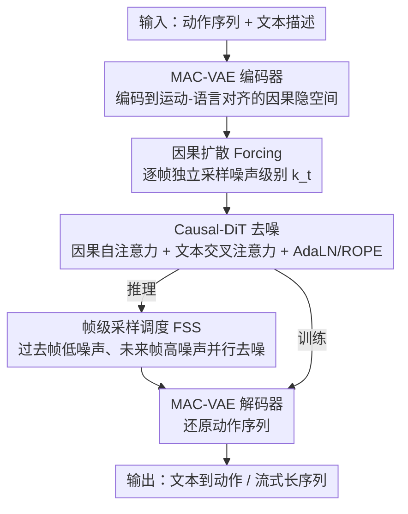

# Causal Motion Diffusion Models for Autoregressive Motion Generation

**会议**: CVPR 2026  
**arXiv**: [2602.22594](https://arxiv.org/abs/2602.22594)  
**代码**: 无  
**领域**: 人体动作生成 / 扩散模型  
**关键词**: 因果扩散, 自回归动作生成, 文本到动作, 流式生成, 帧级采样调度

## 一句话总结

提出 CMDM 框架，在运动-语言对齐的因果隐空间中统一扩散去噪与自回归生成，通过帧级独立噪声和因果不确定性采样调度，实现高质量、低延迟的文本到动作生成和长序列流式合成。

## 研究背景与动机

文本驱动的人体动作生成需要同时保证空间准确性和时序连贯性。现有方法分为两大阵营，各有局限：

- **全序列扩散模型**（MDM, MLD, MotionLCM 等）：对整个序列做双向去噪，质量高但打破了时序因果性，无法在线/流式生成。
- **自回归模型**（T2M-GPT, MotionStreamer 等）：保证因果性但存在误差累积问题，长序列不稳定；且依赖 teacher forcing 训练，推理时暴露偏差严重。

核心矛盾在于：如何同时获得扩散模型的生成保真度和自回归模型的因果结构？CMDM 通过在语义对齐的因果隐空间中进行帧级扩散去噪来统一两者。

## 方法详解

### 整体框架

CMDM 的整体思路是：先把动作序列压进一个既保因果结构、又带语义的隐空间，再在这个隐空间里做"逐帧带不同噪声"的扩散去噪，最后解码回动作。它由三个核心模块串成一条流水线：(1) **MAC-VAE** 编码器-解码器，把动作序列编码到运动-语言对齐的因果隐空间；(2) **Causal-DiT**，在隐空间里用因果注意力做扩散去噪，其训练采用「**因果扩散 Forcing**」——给每帧独立采样噪声级别，从而在扩散框架内强制时序因果；(3) **FSS** 帧级采样调度器，推理时让过去帧低噪声、未来帧高噪声并行去噪，加速生成。训练走 teacher forcing 直接监督，推理走 FSS 流式生成。

### 关键设计

1. **MAC-VAE（Motion-Language-Aligned Causal VAE）**: 用 1D 因果卷积和因果 ResNet 块构建编码器/解码器，确保每帧只依赖前面的帧。时间下采样 4 倍。关键创新是引入运动-语言对齐损失：利用预训练的 Part-TMR 模型提取帧级语义特征，通过边际余弦相似度损失 $\mathcal{L}_{mcos}$ 和边际距离矩阵相似度损失 $\mathcal{L}_{mdms}$ 进行对齐：

    $\mathcal{L}_{\text{MAC-VAE}} = \mathcal{L}_{\text{rec}} + \beta D_{\text{KL}} + \lambda \mathcal{L}_{\text{align}}$

   其中 $\mathcal{L}_{\text{align}} = \mathcal{L}_{\text{mcos}} + \mathcal{L}_{\text{mdms}}$，前者最小化特征级余弦差距，后者保持特征空间的相对结构一致性。

2. **因果扩散 Forcing（Causal Diffusion Forcing）**: 与传统扩散模型对所有帧施加相同噪声不同，CMDM 为每帧 $t$ 独立采样噪声级别 $k_t$，然后用因果自注意力（下三角 mask）做去噪：

    $\mathcal{L}_{\text{DF}} = \mathbb{E}_{k_t, \epsilon_t^{k_t}} \left[ \| \epsilon_t^{k_t} - \epsilon_\theta(\tilde{\mathbf{z}}_{\leq t}, k_t, \mathbf{c}) \|_2^2 \right]$

   每帧只能看到过去帧的信息，从而在扩散框架内强制时序因果性。帧级随机噪声还起到正则化作用，鼓励平滑的时序过渡。

3. **Causal-DiT（因果扩散 Transformer）**: 8 层 Transformer，4 头注意力，512 维。集成三个机制：因果自注意力（下三角 mask 防止看到未来帧）、交叉注意力（与 DistilBERT 文本嵌入交互）、AdaLN + ROPE（帧级扩散时间步嵌入 + 旋转位置编码稳定长序列去噪）。

4. **帧级采样调度（Frame-wise Sampling Schedule, FSS）**: 推理时给过去帧分配低噪声、未来帧分配高噪声。每个新帧从部分去噪的前序帧预测，而非等前一帧完全去噪。不确定性尺度 $L$ 控制下一帧在当前帧去噪到第 $K-L$ 步时就开始去噪。这大幅减少推理步数，缓解暴露偏差。

### 损失函数 / 训练策略

- MAC-VAE：重建损失 + KL 散度 + 运动-语言对齐损失（权重 $\lambda$ 按梯度范数自动调节）
- Causal-DiT：使用 Flow Matching 作为 ODE 采样器的因果扩散 forcing 损失
- 训练时文本条件以 0.1 概率随机丢弃，推理时使用 classifier-free guidance（scale=3.0）

## 实验关键数据

### 主实验

| 数据集 | 指标 | CMDM (FSS) | 之前 SOTA (SALAD) | 提升 |
|--------|------|-----------|------------------|------|
| HumanML3D | R-Top1 | **0.588** | 0.581 | +0.007 |
| HumanML3D | FID | **0.068** | 0.076 | -0.008 |
| HumanML3D | CLIP-Score | **0.685** | 0.671 | +0.014 |
| SnapMoGen | R-Top1 | **0.831** | 0.802 (MoMask++) | +0.029 |
| SnapMoGen | FID | **14.451** | 15.061 (MoMask++) | -0.610 |

**长序列生成**（与 FlowMDM、MARDM 比较）：

| 数据集 | Subsequence FID↓ | Transition AUJ↓ | 说明 |
|--------|-----------------|-----------------|------|
| HumanML3D CMDM | **0.12** | **0.42** | 大幅优于 FlowMDM (0.29/0.51) |
| SnapMoGen CMDM | **32.49** | 70.35 | 子序列质量远超 MARDM (40.80) |

### 消融实验

| 配置 | R-Top1 | FID | Transition AUJ |
|------|--------|-----|----------------|
| 完整 CMDM | 0.588 | 0.068 | 0.42 |
| 标准 VAE (去语言对齐) | 0.561 | 0.107 | 0.52 |
| C-VAE (去语言对齐) | 0.575 | 0.070 | 0.44 |
| 全序列扩散 (去因果) | 0.591 | 0.071 | **0.72** |
| 去 AdaLN | 0.583 | 0.076 | 0.47 |
| 去 ROPE | 0.581 | 0.087 | 0.51 |
| FSS K=50,L=5 | 0.583 | 0.077 | **0.38** |

### 关键发现

- **效率惊人**: CMDM 仅 114M 参数，FSS 模式达 125 fps（MARDM 310M/20fps，MotionStreamer 318M/11fps），快一个数量级
- 全序列扩散在单步 T2M 上 R-Top1 略高，但转场 AUJ 几乎翻倍（0.72 vs 0.42），证明因果扩散对长序列连贯性至关重要
- MAC-VAE 的语言对齐主要提升语义一致性而非运动质量本身
- FSS 中 $L=5$ 能获得最平滑的转场（AUJ=0.38），但语义略有损失

## 亮点与洞察

- 将 Diffusion Forcing 从 next-token prediction 迁移到动作生成领域，并通过帧级独立噪声统一了扩散和自回归两种范式
- FSS 是一个非常实用的推理加速策略：通过控制"不确定性级联"在因果链中的传播，在速度和质量间取得灵活平衡
- MAC-VAE 的语义对齐监督让隐空间既保持因果结构又具有语义意义，这种双重约束的设计值得借鉴
- 参数量比竞争方法少 2-3 倍但性能更好，说明架构设计比模型规模更重要

## 局限与展望

- 对高度抽象或模糊的文本描述，效果受限于预训练运动-语言模型（Part-TMR）的质量
- 极长序列（数分钟级别）仍可能累积微小时序伪影，需要运动感知反馈或自适应锚定机制
- 目前仅支持单人动作，未扩展到多人交互场景
- FSS 的最优 $K$、$L$ 组合需要针对不同场景调参

## 相关工作与启发

- **Diffusion Forcing** [Chen et al., 2024] 是本文帧级独立噪声的灵感来源，但原始设计面向 next-token prediction，CMDM 扩展到连续动作空间
- **MLD/MotionLCM** 在隐空间做全序列扩散效果不错，但 CMDM 证明因果约束能在不损失质量的前提下获得流式能力
- **MARDM/MotionStreamer** 用 masked autoregressive + diffusion head，但参数量大、推理慢

## 评分

- **新颖性**: ⭐⭐⭐⭐ 首个在运动-语言对齐因果隐空间中统一扩散与自回归的框架
- **实验充分度**: ⭐⭐⭐⭐⭐ 两个基准 + 长序列评估 + 详尽消融（VAE/扩散/采样各维度）+ 效率分析
- **写作质量**: ⭐⭐⭐⭐ 结构清晰、公式推导完整、实验细节充分
- **价值**: ⭐⭐⭐⭐⭐ 实时动作生成的实用性强，125fps 的推理速度有直接应用价值

<!-- RELATED:START -->

## 相关论文

- [\[CVPR 2026\] Towards Decompositional Human Motion Generation with Energy-Based Diffusion Models](towards_decompositional_human_motion_generation_with_energy-based_diffusion_mode.md)
- [\[CVPR 2026\] Next-Scale Autoregressive Models for Text-to-Motion Generation](next-scale_autoregressive_models_for_text-to-motion_generation.md)
- [\[CVPR 2026\] Interact2Ar: Full-Body Human-Human Interaction Generation via Autoregressive Diffusion Models](interact2ar_full-body_human-human_interaction_generation_via_autoregressive_diff.md)
- [\[CVPR 2026\] Multi-level Causal LLM-based Text-to-Motion Generation with Human Alignment (MoTiGA)](multi-level_causal_llm-based_text-to-motion_generation_with_human_alignment.md)
- [\[CVPR 2026\] LLaMo: Scaling Pretrained Language Models for Unified Motion Understanding and Generation with Continuous Autoregressive Tokens](llamo_scaling_pretrained_language_models_for_unified_motion_understanding_and_ge.md)

<!-- RELATED:END -->
