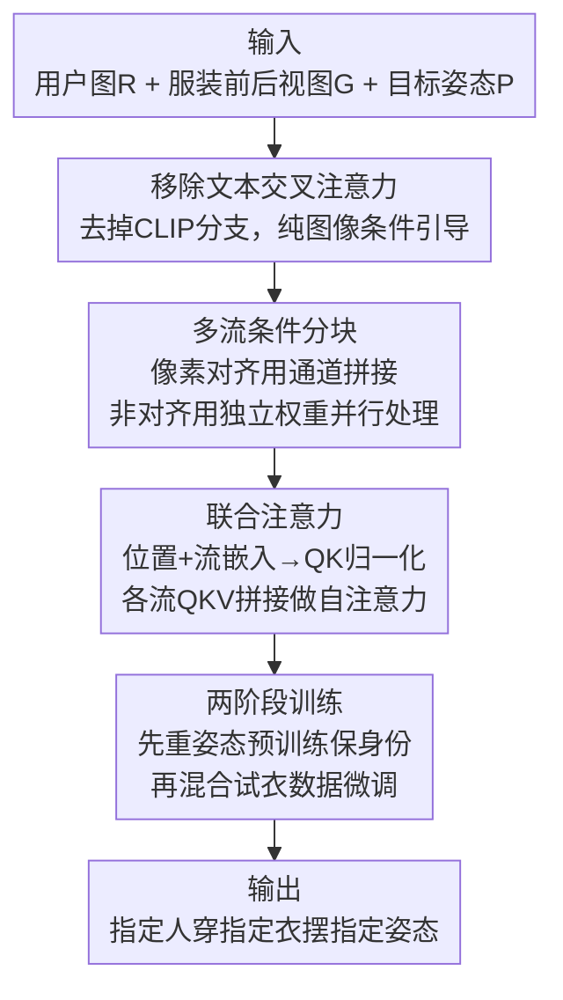

# Clothe and Pose

**会议**: CVPR 2026  
**论文**: [CVF Open Access](https://openaccess.thecvf.com/content/CVPR2026/html/Sharma_Clothe_and_Pose_CVPR_2026_paper.html)  
**代码**: 待确认  
**领域**: 人体理解 / 虚拟试衣 / 图像生成  
**关键词**: 虚拟试衣, 姿态迁移, 多流注意力, 潜空间扩散, 联合建模

## 一句话总结
这篇论文把"换衣服"和"换姿势"两件原本被拆成两段流水线做的事合并成一个任务（Clothe and Pose），用一个基于 SDXL 的多流（multi-stream）扩散模型同时吃用户图、服装前后视图和目标姿态骨架，单步生成"指定的人穿指定衣服摆指定姿势"的图像，并配套提出了带真值三元组的评测协议，在四种姿态变换上全面超过"试衣模型+重姿态模型"串行 baseline 以及 20B 的 Qwen-Image-Edit。

## 研究背景与动机

**领域现状**：数字时尚里有两条成熟但相互独立的技术线。一条是虚拟试衣（Virtual Try-On, VTON），给一张人像和一件衣服，把衣服"穿"到人身上；另一条是重姿态/姿态迁移（Reposing / Pose Transfer），给一张人像和一个目标骨架，把这个人摆成新姿势。两条线各自都已经从 GAN 时代走到了用大规模预训练潜空间扩散模型（LDM/SDXL）的时代。

**现有痛点**：用户真实的需求其实是两者的组合——"我想试试这件新衣服，并且像在实体店里那样转个身、换个姿势看看它怎么垂坠"。但要实现这个，自然的做法是把两个现成模块串起来：先用 CatVTON 之类做试衣，再用 Leffa 之类做重姿态。论文用图 2 直接展示了这条路的硬伤：**误差逐级累积**。Stage-1 试衣时会幻想出参考图里根本没有的下装；Stage-2 重姿态时又丢掉人物身份，最后输出和真值差得很远。更本质的是，重姿态模块只看一张图，没有服装信息，碰到被遮挡或不可见的服装区域就只能瞎编（hallucinate），尤其是从正面图生成背面姿态时。

**核心矛盾**：作者点出一个被忽略的事实——**穿衣和摆姿势是相互依赖的**：一个人怎么摆姿势取决于他穿了什么。把两者拆开串行做，等于强行假设它们独立，于是误差没法在两个阶段之间互相校正，只能单向放大。另一个被忽略的问题出在评测上：现有 VTON benchmark 用的是 $(G_A, P_AG_A)$ 这种成对数据（衣服 $G_A$ 和穿着 $G_A$ 的人 $P_AG_A$），训练和评测都靠"抠掉 $P_AG_A$ 里 $G_A$ 区域再重建"来做。这套设定会逼模型学会**输入依赖偏置**——输出受用户原本穿的衣服影响（图 3a：Alice 想试新 T 恤，结果输出被她当前穿的衣服带跑），而且没有真值无法量化"穿别的衣服"这种实用场景。

**本文目标**：把任务重新定义为"同时 clothe 和 pose"，并解决两个配套问题——(1) 一个能联合建模、不靠串行的统一模型；(2) 一套有真值、能量化实用场景的评测协议。

**切入角度**：既然穿衣和姿态相互依赖，就别把它们当两个独立模块，而是让一个网络同时拿到用户图、服装（前+后视图）、目标姿态三路条件，在内部学它们的交互。同时为了避免幻想被遮挡的服装，显式提供服装的正面和背面视图来"最大化信息"。

**核心 idea**：用一个**多流潜空间扩散架构 + 联合注意力**，把用户、服装、姿态三路条件并行处理后在自注意力里融合，单步生成 try-on 结果，替代"VTON→Repose"串行流水线。

## 方法详解

### 整体框架
给定一张参考用户图 $R$、上下装的服装图（各含正面 $U_f, B_f$ 和背面 $U_b, B_b$ 视图）以及目标姿态 $P$，模型一步生成同一个人穿着目标服装、摆出目标姿态的图像 $T$。姿态 $P$ 先用 ViTPose 提关键点、画成骨架图。所有上下装的前后视图在空间上拼接（spatial concatenation）记作 $G$。整个建模在 SDXL 的潜空间里进行：用 SDXL 的自编码器把每路条件都编码成 latent，再喂给一个改造过的 SDXL UNet。

关键在于**怎么把多路条件喂进 UNet**。论文先分析了 VTON 界现有的两种主流条件注入方式各自的毛病：(i) 把服装 latent 沿宽度方向和噪声 latent 空间拼接（CatVTON 等）——便宜，但逼网络同时干两件不相关的事：既要生成 try-on，又要把条件图原样复制到输出里，大量网络容量浪费在"抄条件"而非"生成质量"；(ii) 跑一条独立分支单独抽服装特征再拼接（IDM-VTON、Leffa 等）——每条分支都独立做 cross/self-attention，在多条件设定下推理和训练成本成倍上涨。为兼顾两者，作者提出一个借鉴文生图（如 SD3/FLUX 那类）的**多流架构**：每路条件用自己的一套可学习权重并行处理，再在一个**联合自注意力**模块里相互交互。

整个方法可以拆成下面这条流水线（节点名即下文关键设计）：

### 关键设计

**1. 移除文本交叉注意力：让模型只听图像条件的话**

SDXL 自带横跨全网络的文本交叉注意力块，用来对接 CLIP 文本嵌入，光这部分就约 0.5B 参数。现有 VTON 系统大多保留这条文本分支，要么注入一个通用模板/空 prompt，要么用 LLM 给服装合成文字描述（对未见过的服装在推理时会带来额外算力或金钱开销），要么用一堆姿态+外观 token 描述每张图。作者认为本任务的控制信号本就该是**目标姿态图和目标服装图**这些视觉条件，文本是多余且累赘的，于是直接把文本控制整条砍掉。这样既省掉 0.5B 参数和推理时合成 prompt 的开销，又让条件引导集中在像素级的服装/姿态信息上，避免文本这种弱条件稀释视觉控制。

**2. 多流条件处理：按"是否像素对齐"区别对待每路条件**

这是架构核心。作者把条件分成两类区别处理：对于**和目标输出像素对齐**的条件——本任务里只有姿态骨架 $P$（骨架位置就对应输出里身体的位置）——直接用**通道维拼接**（channel-wise concatenation）接到噪声 latent 上；对于**和输出不像素对齐**的条件——服装图和用户参考图（衣服平铺时的样子和穿在身上的样子位置完全不同）——则让它们**在每个网络块里和噪声 latent 并行处理**，各自配一套独立可学习权重。这样每路条件和噪声 latent 都有自己的神经权重，而不像纯空间拼接那样所有内容挤在同一套权重里互相干扰。它直接对应前面的痛点：空间拼接逼网络"边生成边抄条件"，独立分支又太贵；按对齐性分流，既给非对齐条件足够的独立表达能力，又只对真正对齐的姿态用最廉价的通道拼接。

**3. 联合注意力：让三路条件在自注意力里自由交互**

并行处理完各路条件后，怎么让它们融合是关键。作者给每路表示加上**位置嵌入**（编码空间位置信息）和一个可学习的**"流嵌入"（stream embedding）向量**（编码"这是来自哪一路条件"的来源信息）——早期实验表明这俩能让模型学得更快。加完嵌入后，各路表示过 QKV 投影层，并按 [10,14] 的做法施加 **QK-normalization** 稳定训练。归一化后，把每条流的 $Q$、$K$、$V$ 矩阵沿**序列长度维拼接**，再对拼好的大矩阵做一次自注意力。这一步让每路条件的表示都能和其它路（以及噪声 latent）自由交互，从而把"穿衣和姿态相互依赖"这件事让模型在内部自己学出来，而不是靠串行硬接。注意力做完后各路表示再分离，独立进入下一个网络块。这正是把"clothe 和 pose 相互依赖"落实到架构层面的机制：不是先后两段，而是在每一层的注意力里同时协商。

**4. 两阶段训练 + 条件 dropout：用互补数据源凑出稀缺的配对数据**

理想的训练样本是三元组 $(R, G, T)$——参考图、服装条件、同一个人换了衣服和姿势的目标图，但这种配对数据极稀缺。作者设计两阶段策略利用不同数据源的互补优势。**Stage-1 身份保持预训练**：在大规模姿态迁移数据上训练（同一人不同姿态但服装一致），并只提供**部分**服装信息（受数据限制，要么只给上装要么只给下装），让模型学会跨姿态保持身份；同时**随机 dropout 用户图里的服装 patch**，逼模型依赖显式服装条件 $G$ 而不是从参考图里抄服装外观。**Stage-2 多姿态试衣微调**：在"多姿态试衣数据 + 姿态迁移数据"的混合上微调，以 0.6 概率采样试衣样本，此时给**完整**上下装条件学整套换装。这个混合一举三得：试衣样本教完整换装、保留姿态迁移样本防止灾难性遗忘身份保持能力、条件多样性（部分/完整服装）提升鲁棒性并让模型顺带能做纯重姿态。训练时还以 0.15 概率把任一条件图换成灰像素空条件，以便推理时用 classifier-free guidance；这一 dropout 加上 Stage-1 训练，使模型能在**缺任意服装输入**的情况下工作。

## 实验关键数据

评测数据包含族裔多样的用户，共 360 件独特服装，每件配多姿态拍摄。评测覆盖四种目标姿态配置：Front→Front、Front→Left、Front→Right、Front→Back，每种 600 对，Clothe and Pose 任务共 2400 对。指标用 LPIPS（越低越好）、PSNR、SSIM（越高越好），因为有真值。

### 主实验（Clothe and Pose）

下表为 Front→Back 与 Front→Front 两种配置的对比（节选自原表 1）。串行 baseline 由"试衣模型 + 重姿态模型"拼成；Qwen-Image-Edit 是唯一原生支持该任务的 baseline（互联网级数据训练，20B 参数 vs 本文 5B）。

| 方法 | F→B LPIPS↓ | F→B PSNR↑ | F→B SSIM↑ | F→F LPIPS↓ | F→F PSNR↑ | F→F SSIM↑ |
|------|------|------|------|------|------|------|
| CatVTON+Leffa | 0.277 | 16.995 | 80.118 | 0.272 | 16.903 | 80.607 |
| Leffa+Kontext | 0.317 | 16.092 | 79.075 | 0.290 | 16.575 | 80.012 |
| Qwen-Image-Edit (20B) | 0.340 | 15.247 | 74.631 | 0.187 | 17.523 | 83.771 |
| **Ours (5B)** | **0.166** | **18.599** | **84.380** | **0.155** | **18.785** | **85.296** |

本文方法在所有四种配置上全面领先。增益在侧向（Front→Left/Right）和极端姿态（Front→Back）上尤其明显——因为模型能同时利用服装的正面和背面视图。值得注意的是，Qwen-Image-Edit 在正面对正面（F→F）时尚可（LPIPS 0.187），但一到 Front→Back 就崩到 0.340，而本文在 F→B 仍稳在 0.166，印证了"显式给背面服装信息"对极端姿态的价值。串行 baseline 普遍较差，直接暴露了顺序处理的误差累积问题。

### 重姿态实验（Reposing）+ 消融

本文评测数据无意间也成了研究纯重姿态的素材。下表节选自原表 2，对比本文完整模型与"不给服装"的消融版（同一 checkpoint），以验证服装条件对重姿态的作用。

| 方法 | F→B LPIPS↓ | F→B PSNR↑ | F→B SSIM↑ | F→R LPIPS↓ | F→R PSNR↑ | F→R SSIM↑ |
|------|------|------|------|------|------|------|
| CFLD | 0.258 | 15.472 | 81.304 | 0.236 | 15.694 | 83.044 |
| Leffa | 0.251 | 17.769 | 80.679 | 0.239 | 17.960 | 82.346 |
| Qwen-Image | 0.279 | 17.856 | 77.656 | 0.119 | 21.450 | 87.597 |
| Ours (w/o garment) | 0.138 | 19.972 | 85.054 | 0.112 | 21.348 | 87.324 |
| **Ours (full)** | **0.125** | **20.801** | **86.159** | **0.110** | **22.198** | **87.849** |

### 关键发现
- **服装条件显著帮助重姿态**：full 模型在 Front→Back 上 LPIPS 0.125，去掉服装条件后退到 0.138；其它配置也一致下降。这直接验证了作者的核心假设——穿衣和姿态相互依赖，给背面服装信息能让背面姿态生成更忠实。
- **误差累积是串行方法的命门**：串行 baseline 在表 1 全线落后，可视化（图 5）显示它们保不住身份和服装细节，正是 VTON 阶段误差在重姿态阶段被放大的结果。
- **DeepFashion benchmark 会高估重姿态性能**：Leffa、CFLD 在 DeepFashion 上训得很猛，但因该数据集训练/测试身份重叠，模型过拟合到身份层面，换到本文真实评测就保不住身份，说明该 benchmark 不适合衡量真实进步。
- **服装区域忠实度**：作者另用 SCHP 解析器抠出服装区域单独算 LPIPS（图 9/10），本文在两个任务上服装区域都比 baseline 更忠实。
- **小模型胜大模型**：5B 的本文模型在多数配置上压过 20B 的 Qwen-Image-Edit，说明任务专用的条件设计比单纯堆参数更有效。

## 亮点与洞察
- **"clothe 和 pose 相互依赖"这个观察本身就很值钱**：它把两个被默认独立的任务联系起来，并用图 2 的误差累积实验给出了串行做法不行的硬证据，是整篇论文的立论基石。
- **按"像素对齐性"决定条件注入方式很巧妙**：姿态骨架天然像素对齐就用最便宜的通道拼接，服装/用户图不对齐就给独立权重并行处理——这套"区别对待"避免了"所有条件一锅炖"或"每条件一条贵分支"的两个极端，是可迁移到任何多条件生成任务的设计原则。
- **显式提供服装前后视图**是个朴素但有效的反幻想手段：与其让模型猜被遮挡的背面，不如直接喂背面图，这也是它在极端姿态上碾压对手的直接原因。
- **流嵌入（stream embedding）+ 联合注意力**借鉴文生图的多流思路用到 VTON，给每路条件一个身份标记再统一做注意力，让"条件交互"成为可学习的内部行为而非人为拼接顺序。

## 局限与展望
- **依赖受控采集的评测数据**：评测用户在受控环境拍摄（极少配饰、扎起头发、无背景干扰），虽然便于聚焦人物/服装细节保持，但和真实开放场景仍有差距。
- **背景保持能力有限**：论文承认背景保持是靠"在生成起点把背景信息留在 latent 里"实现的，且这类训练数据量有限（图 11 编辑应用），复杂场景下的稳健性存疑。⚠️ 以原文为准。
- **配对数据稀缺是根本约束**：理想三元组 $(R,G,T)$ 数据不易获得，方法靠两阶段训练+数据混合绕过，但这本质是数据层面的妥协，规模化训练方案仍待探索。
- **作者定位为早期工作**：论文自称是统一服装-姿态合成的早期贡献，更多局限放在附录 E，留下了更优更高效训练方案的空间。

## 相关工作与启发
- **vs 串行流水线（CatVTON+Leffa / IDM-VTON+Leffa 等）**：他们把试衣和重姿态拆成两段独立模型先后跑，本文用一个多流模型联合建模；区别在于联合注意力让两个子任务在每一层互相校正，而串行做法误差只能单向累积、且重姿态模块拿不到服装信息只能幻想被遮挡区域。
- **vs Qwen-Image-Edit**：它用 20B 参数和互联网级数据原生支持该任务，本文用 5B 专用模型在多数配置上反超；区别在于本文针对"服装前后视图 + 姿态对齐性"做了专门的条件设计，而非靠通用大模型硬扛，尤其在极端背面姿态上优势明显。
- **vs Leffa / CFLD 等 DeepFashion 训练的重姿态方法**：它们在 DeepFashion 上过拟合到身份（训练测试身份重叠），换到真实评测就保不住人；本文同时联合训练服装条件，重姿态也更忠实，并顺带指出了该 benchmark 的评测缺陷。
- **vs SMPL-based 多姿态试衣（如 Liu et al.）**：他们用 SMPL 条件主要擅长正面姿态、难做任意姿态，本文支持任意姿态合成。

## 评分
- 新颖性: ⭐⭐⭐⭐ 把试衣和重姿态合并成一个任务+提出统一多流模型+配套评测协议，立意清晰且有实证支撑。
- 实验充分度: ⭐⭐⭐⭐ 四种姿态配置、2400 对、多任务（试衣/重姿态/编辑）对比，并有服装区域忠实度专项分析；受控数据是小遗憾。
- 写作质量: ⭐⭐⭐⭐ 动机讲得透（图 2/3 直击痛点），方法和评测设计交代清楚。
- 价值: ⭐⭐⭐⭐ 给数字时尚提供了更实用的统一框架和更合理的评测基准，对后续工作有奠基意义。

<!-- RELATED:START -->

## 相关论文

- [\[CVPR 2026\] Differentially Private 2D Human Pose Estimation](differentially_private_2d_human_pose_estimation.md)
- [\[CVPR 2026\] FMPose3D: monocular 3D pose estimation via flow matching](fmpose3d_monocular_3d_pose_estimation_via_flow_matching.md)
- [\[CVPR 2026\] Composite-Attribute Person Re-Identification via Pose-Guided Disentanglement](composite-attribute_person_re-identification_via_pose-guided_disentanglement.md)
- [\[CVPR 2026\] HamiPose: Hamiltonian Optimization for Unsupervised Domain Adaptive Pose Estimation](hamipose_hamiltonian_optimization_for_unsupervised_domain_adaptive_pose_estimati.md)
- [\[CVPR 2026\] E-3DPSM: A State Machine for Event-Based Egocentric 3D Human Pose Estimation](e-3dpsm_a_state_machine_for_event-based_egocentric_3d_human_pose_estimation.md)

<!-- RELATED:END -->
