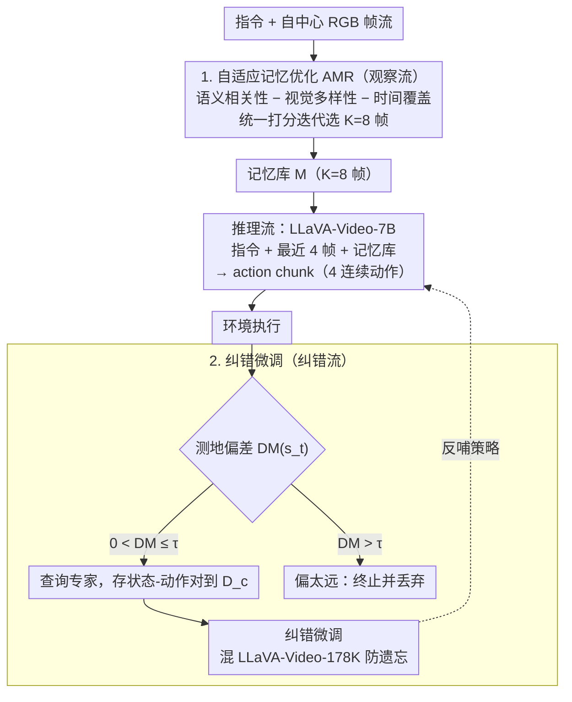

# DecoVLN: Decoupling Observation, Reasoning, and Correction for Vision-and-Language Navigation

**会议**: CVPR2026  
**arXiv**: [2603.13133](https://arxiv.org/abs/2603.13133)  
**代码**: [项目页面](https://arxiv.org/abs/2603.13133)（已提供 Project Page 和 Code 链接）  
**领域**: 人体理解 / 具身导航  
**关键词**: Vision-and-Language Navigation, 自适应记忆优化, 纠错微调, POMDP, 长期导航

## 一句话总结

提出 DecoVLN 框架，将 VLN 任务中的观察、推理和纠错三个过程解耦，通过自适应记忆优化机制和基于状态-动作对的纠错微调策略，在仅使用自中心 RGB 输入的条件下实现了 R2R-CE 和 RxR-CE 上的 SOTA 性能。

## 背景与动机

1. **视觉语言导航 (VLN)** 要求智能体根据自然语言指令在未见过的 3D 环境中导航，是具身 AI 的核心任务
2. **现有方法的感知缺陷**：Stop-and-Think 范式存在感知盲区（运动中错过关键视觉线索）；Full-History Streaming 范式通过固定采样或启发式策略检索上下文，会稀释关键信息密度
3. **复合误差问题**：VLN 作为序贯决策任务高度易受复合误差影响，早期的微小错误会随时间累积导致智能体严重偏离目标路径
4. **现有增强方法不足**：多数方法聚焦于多模态轨迹增强以改善开环动作预测，但缺乏有效的闭环反思和在线纠错能力
5. **长时记忆构建困难**：均匀采样策略会丢弃关键导航节点的线索并破坏时间连贯性；StreamVLN 虽引入 Slow-Fast 记忆机制但依赖深度传感器
6. **VLM 的空间理解局限**：现有视觉语言模型在 3D 空间理解方面表现有限，无法建立局部自中心观察与全局一致空间结构的对应关系

## 方法详解

### 整体框架

DecoVLN 把 VLN 建模为 POMDP 元组 $M=(S,A,T,R,\Omega,O)$，智能体要学一个策略 $\pi(H_t,I)$ 来最大化期望累积奖励。它的核心思路是把过去纠缠在一起的观察、推理、纠错三件事拆开各管各的：观察流在运动中持续感知，用自适应记忆优化（AMR）把高信息密度的帧筛进记忆库；推理流让 LLM 根据指令、当前帧和记忆库一次吐出含多个连续动作的 action chunk；纠错流用基于状态-动作对的微调，给模型装上内省和自我纠正的能力。三者解耦后，既避免了边走边想的高延迟，也让记忆和纠错能各自做到位。

### 关键设计

**1. 自适应记忆优化 AMR：把"记什么"写成一个可解的打分问题**

长时记忆是 VLN 的老大难——均匀采样会丢掉关键导航节点、还破坏时间连贯性，全历史流式又会稀释关键信息的密度。AMR 干脆把记忆构建形式化成一个优化问题：每个时间步从候选池 $\mathcal{C}$ 里挑 $K$ 帧组成精炼记忆 $\mathcal{M}$，最大化综合评分

$$f^* = \arg\max_{f \in \mathcal{C} \setminus \mathcal{M}} \left[ \lambda_R \cdot \text{Sim}_{\text{Sem}}(f, I) - (1-\lambda_R) \cdot \left( w_V \cdot \text{Sim}_{\text{Vis}}(f, \mathcal{M}) + w_T \cdot \text{Sim}_{\text{Temp}}(f, \mathcal{M}) \right) \right]$$

三个维度各管一件事：语义相关性 $\text{Sim}_{\text{Sem}}$（候选帧与指令的余弦相似度）把跟任务相关的帧往上拉；视觉多样性 $\text{Sim}_{\text{Vis}}$（候选帧与已选记忆帧的最大视觉相似度，当惩罚项）防止记一堆几乎一样的画面；时间覆盖 $\text{Sim}_{\text{Temp}} = \frac{1}{\min_{m \in \mathcal{M}} |t_f - t_m| + \epsilon}$ 惩罚扎堆在同一时刻的候选帧。这样记忆库里留下的，是既相关、又互不重复、又在时间轴上分散的关键节点，而不是被稀释的一锅粥。

**2. 纠错微调：在 step 级别精挑可信的纠错数据**

VLN 是序贯决策，早期一个小错会随时间累积、把智能体带偏，而多数方法只做开环动作预测、缺闭环纠错。DecoVLN 在 step 级别而非 episode 级别收集纠错信号，用测地距离量化当前状态偏离专家路径多远

$$DM(s_t) = \min_{s^* \in P_{exp}} d_g(s_t, s^*)$$

设一个偏差阈值 $\tau$：当 $0 < DM(s_t) \leq \tau$ 时智能体还在可信区域，就查询专家策略拿纠正动作、存进纠错数据集 $\mathcal{D}_c$；一旦 $DM(s_t) > \tau$ 说明已经偏得太离谱，直接终止当前 episode、把这些低质量数据过滤掉。再混入 LLaVA-Video-178K 防止灾难性遗忘。比起 DAgger 在 episode 级别一锅端，这种可信区域过滤用更少的数据（180K vs 240K）就拿到了更好的效果。

### 损失函数 / 训练策略

- 基础模型：LLaVA-Video-7B（SigLIP 视觉编码器 + Qwen2-7B 语言模型）
- 优化器：AdamW，LLM 学习率 $2 \times 10^{-5}$，视觉编码器 $5 \times 10^{-6}$
- 训练数据：约 360K 导航样本 + 180K 纠错样本
- 推理时输入：指令 + 记忆库 (K=8) + 最近 4 帧 → 输出 4 步 action chunk

## 实验关键数据

### R2R-CE & RxR-CE Val-Unseen 主实验

| 方法 | 输入 | R2R NE↓ | R2R SR↑ | R2R SPL↑ | RxR SR↑ | RxR SPL↑ | RxR nDTW↑ |
|------|------|---------|---------|----------|---------|----------|-----------|
| StreamVLN | RGB | 5.43 | 52.8 | 47.2 | 48.6 | 42.5 | 60.2 |
| NaVILA* | RGB | 5.22 | 54.0 | 49.0 | 49.3 | 44.0 | 58.8 |
| ETPNav | RGB+Pano+Depth | 4.71 | 57.0 | 49.0 | 54.7 | 44.8 | 61.9 |
| **DecoVLN** | **RGB** | **5.01** | **56.3** | **50.5** | **54.2** | **46.3** | **63.5** |

- 在 R2R 上相比 StreamVLN 提升 SR +3.5%, SPL +3.3%
- 在 RxR 上提升 SR +5.6%, SPL +3.8%
- 仅用 RGB 输入超越多数使用全景/深度/里程计的多传感器方法

### 消融实验

| AMR | CF | NE↓ | SR↑ | SPL↑ |
|-----|-----|------|------|------|
| ✗ | ✗ | 5.89 | 47.3 | 43.9 |
| ✓ | ✗ | 5.50 | 50.9 | 46.1 |
| ✓ | ✓ | **5.01** | **56.3** | **50.5** |

- AMR 贡献 SR +3.6%, SPL +2.2%
- 纠错微调在 AMR 基础上再提升 SR +5.4%，总计 SR +9.0%
- 记忆库大小 K=8 是性能与效率的最佳平衡点
- 可信区域阈值 $\tau=3$ 效果最优；相比 DAgger 用更少数据 (180K vs 240K) 达到更好性能

## 亮点

- **解耦设计**：观察/推理/纠错三过程解耦，避免 VLM 自回归生成的高延迟瓶颈
- **记忆优化有理论基础**：将记忆构建形式化为优化问题，联合考虑语义相关性、视觉多样性、时间覆盖三个维度
- **纠错策略高效**：step 级别纠错 + 可信区域过滤，数据效率优于 DAgger
- **仅 RGB 输入即超越多传感器方法**：无需深度/全景/里程计，架构简洁
- **真实世界部署**：在 Unitree GO2 四足机器人上成功部署，展现了强 sim-to-real 迁移能力
- **涌现行为**：机器人在运动中主动进行横向微调以保持关键导航点在视野内

## 局限与展望

- 记忆优化中的三个权重 ($\lambda_R$, $w_V$, $w_T$) 需要手动调节，缺乏自适应学习机制
- 评估仅在 Matterport3D 环境，未涵盖更大规模或户外场景
- 纠错微调依赖 Habitat 的最短路径跟随器作为专家策略，在真实环境中难以获取
- Action chunk 固定为 4 步，未探索动态长度的 action chunk
- 真实世界实验仅在办公室环境中进行，场景多样性有限
- 未与其他纠错方法（如 RL-based 方法）进行对比

## 与相关工作的对比

- **vs NaVid**：首个直接微调 VLM 端到端导航的方法，但缺乏长期记忆管理机制，DecoVLN 在 R2R SR 上 +19.3%
- **vs StreamVLN**：提出 Slow-Fast 记忆机制但依赖深度传感器做体素构建，DecoVLN 仅用 RGB 即超越
- **vs NaVILA**：使用额外大规模数据集训练，DecoVLN 在未使用额外数据的条件下仍具竞争力
- **vs DAgger**：传统 DAgger 在 episode 级别收集纠错数据，DecoVLN 在 step 级别精确筛选可信区域数据，用 180K 数据超越 DAgger 的 240K

## 评分

- 新颖性: ⭐⭐⭐⭐ — 观察/推理/纠错解耦 + 记忆优化公式化 + 状态-动作对纠错策略组合新颖
- 实验充分度: ⭐⭐⭐⭐ — 多基准对比、详细消融、长期导航验证、真实机器人部署
- 写作质量: ⭐⭐⭐⭐ — 结构清晰，问题建模严谨，方法描述规范
- 价值: ⭐⭐⭐⭐ — 在仅 RGB 输入条件下大幅超越多传感器方法，具有实际部署价值

<!-- RELATED:START -->

## 相关论文

- [\[CVPR 2026\] Unleashing Vision-Language Semantics for Deepfake Video Detection](unleashing_vision-language_semantics_for_deepfake_video_detection.md)
- [\[CVPR 2026\] Vision-Language Attribute Disentanglement and Reinforcement for Lifelong Person Re-Identification](vision-language_attribute_disentanglement_and_reinforcement_for_lifelong_person_.md)
- [\[CVPR 2026\] FaceCoT: Chain-of-Thought Reasoning in MLLMs for Face Anti-Spoofing](facecot_cot_reasoning_face_anti_spoofing.md)
- [\[CVPR 2026\] Superman: Unifying Skeleton and Vision for Human Motion Perception and Generation](superman_unifying_skeleton_and_vision_for_human_motion_perception_and_generation.md)
- [\[CVPR 2026\] Bridging Facial Understanding and Animation via Language Models](bridging_facial_understanding_and_animation_via_language_models.md)

<!-- RELATED:END -->
